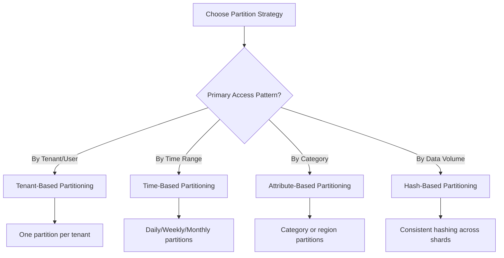
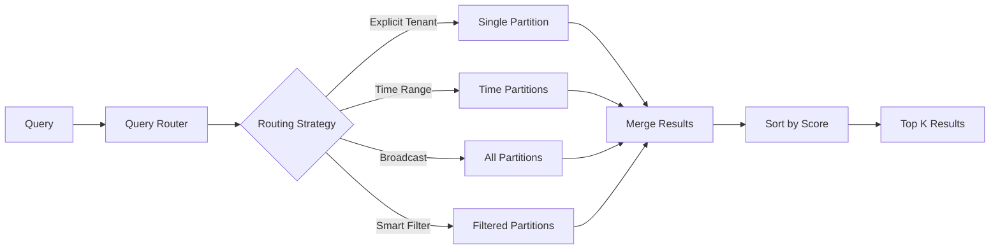
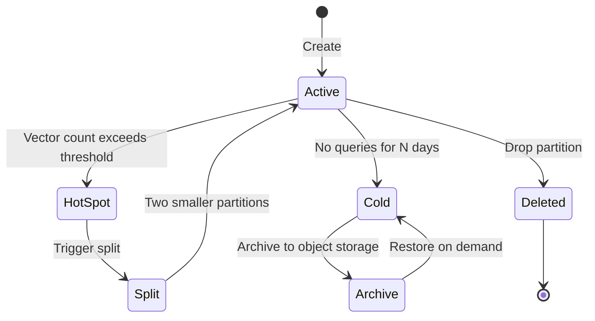

# How to Implement Partition Management

Author: [nawazdhandala](https://github.com/nawazdhandala)

Tags: Vector Database, Partitioning, Scalability, Data Management

Description: Learn to implement partition management for organizing and scaling vector data efficiently.

---

Vector databases store high-dimensional embeddings for similarity search, powering recommendation engines, semantic search, and AI applications. As data grows, a single collection becomes a bottleneck. Partition management solves this by dividing vectors into logical groups that can be queried independently, enabling horizontal scaling, tenant isolation, and efficient data lifecycle management.

## Why Partition Your Vector Data?

| Challenge | Without Partitions | With Partitions |
| --- | --- | --- |
| **Query Performance** | Scans entire dataset | Scans only relevant subset |
| **Multi-tenancy** | All tenants share one index | Each tenant has isolated data |
| **Data Lifecycle** | Delete requires full reindex | Drop partition instantly |
| **Scaling** | Vertical only | Horizontal across shards |
| **Maintenance** | Full collection downtime | Per-partition operations |

## Partition Strategies

Different use cases require different partitioning approaches. The right strategy depends on your query patterns, data distribution, and isolation requirements.



### Tenant-Based Partitioning

When building multi-tenant applications, each tenant gets a dedicated partition. This provides data isolation, predictable performance, and the ability to delete all tenant data instantly.

```python
# Tenant-based partition manager for multi-tenant vector applications
# Each tenant gets an isolated partition with its own index segment

from typing import Dict, List, Optional, Any
import hashlib
from datetime import datetime


class TenantPartitionManager:
    """
    Manages vector partitions on a per-tenant basis.
    Supports dynamic partition creation, tenant isolation, and quota management.
    """

    def __init__(self, vector_client: Any, collection_name: str):
        # Store the vector database client (Milvus, Pinecone, Qdrant, etc.)
        self.client = vector_client
        self.collection_name = collection_name

        # Track tenant metadata for quota and routing
        self.tenant_metadata: Dict[str, dict] = {}

        # Default configuration per partition
        self.default_config = {
            "index_type": "IVF_FLAT",  # Good balance of speed and accuracy
            "metric_type": "COSINE",    # Common for text embeddings
            "nlist": 1024,              # Number of clusters for IVF
        }

    def _get_partition_name(self, tenant_id: str) -> str:
        """
        Generate a consistent partition name from tenant ID.
        Uses hash prefix to ensure valid partition names across databases.
        """
        # Sanitize tenant ID for partition naming rules
        safe_id = hashlib.md5(tenant_id.encode()).hexdigest()[:8]
        return f"tenant_{safe_id}_{tenant_id[:16]}"

    def create_tenant_partition(
        self,
        tenant_id: str,
        quota_vectors: int = 1_000_000,
        custom_config: Optional[dict] = None
    ) -> dict:
        """
        Create a new partition for a tenant with optional custom settings.

        Args:
            tenant_id: Unique identifier for the tenant
            quota_vectors: Maximum vectors allowed for this tenant
            custom_config: Override default index configuration

        Returns:
            Partition metadata including name and creation time
        """
        partition_name = self._get_partition_name(tenant_id)

        # Merge custom config with defaults
        config = {**self.default_config, **(custom_config or {})}

        # Create the partition in the vector database
        # This example uses a generic API; adapt for your specific database
        self.client.create_partition(
            collection_name=self.collection_name,
            partition_name=partition_name,
            description=f"Tenant partition for {tenant_id}"
        )

        # Store tenant metadata for routing and quota enforcement
        metadata = {
            "tenant_id": tenant_id,
            "partition_name": partition_name,
            "created_at": datetime.utcnow().isoformat(),
            "quota_vectors": quota_vectors,
            "current_count": 0,
            "config": config,
            "status": "active"
        }
        self.tenant_metadata[tenant_id] = metadata

        return metadata

    def insert_vectors(
        self,
        tenant_id: str,
        vectors: List[List[float]],
        metadata: List[dict],
        ids: Optional[List[str]] = None
    ) -> dict:
        """
        Insert vectors into a tenant's partition with quota enforcement.

        Args:
            tenant_id: Target tenant for insertion
            vectors: List of embedding vectors
            metadata: Associated metadata for each vector
            ids: Optional custom IDs (auto-generated if not provided)

        Returns:
            Insertion result with count and any quota warnings
        """
        # Verify tenant exists and check quota
        if tenant_id not in self.tenant_metadata:
            raise ValueError(f"Tenant {tenant_id} does not have a partition")

        tenant = self.tenant_metadata[tenant_id]
        new_count = tenant["current_count"] + len(vectors)

        # Enforce quota limits
        if new_count > tenant["quota_vectors"]:
            raise QuotaExceededError(
                f"Insertion would exceed quota: {new_count} > {tenant['quota_vectors']}"
            )

        partition_name = tenant["partition_name"]

        # Perform the insertion
        result = self.client.insert(
            collection_name=self.collection_name,
            partition_name=partition_name,
            vectors=vectors,
            metadata=metadata,
            ids=ids
        )

        # Update the vector count
        self.tenant_metadata[tenant_id]["current_count"] = new_count

        return {
            "inserted": len(vectors),
            "partition": partition_name,
            "total_vectors": new_count,
            "quota_remaining": tenant["quota_vectors"] - new_count
        }

    def search_tenant(
        self,
        tenant_id: str,
        query_vector: List[float],
        top_k: int = 10,
        filters: Optional[dict] = None
    ) -> List[dict]:
        """
        Search within a single tenant's partition.
        Queries are isolated to prevent cross-tenant data leakage.

        Args:
            tenant_id: Tenant to search within
            query_vector: The embedding to find similar vectors for
            top_k: Number of results to return
            filters: Optional metadata filters

        Returns:
            List of matching vectors with scores and metadata
        """
        if tenant_id not in self.tenant_metadata:
            raise ValueError(f"Tenant {tenant_id} not found")

        partition_name = self.tenant_metadata[tenant_id]["partition_name"]

        # Search only within the tenant's partition
        results = self.client.search(
            collection_name=self.collection_name,
            partition_names=[partition_name],  # Restrict to single partition
            query_vectors=[query_vector],
            top_k=top_k,
            filters=filters
        )

        return results

    def delete_tenant(self, tenant_id: str, confirm: bool = False) -> dict:
        """
        Delete all data for a tenant by dropping their partition.
        This is much faster than deleting individual vectors.

        Args:
            tenant_id: Tenant to delete
            confirm: Safety flag to prevent accidental deletion

        Returns:
            Deletion result with vector count removed
        """
        if not confirm:
            raise ValueError("Must set confirm=True to delete tenant data")

        if tenant_id not in self.tenant_metadata:
            raise ValueError(f"Tenant {tenant_id} not found")

        tenant = self.tenant_metadata[tenant_id]
        partition_name = tenant["partition_name"]
        vector_count = tenant["current_count"]

        # Drop the entire partition (instant operation)
        self.client.drop_partition(
            collection_name=self.collection_name,
            partition_name=partition_name
        )

        # Clean up metadata
        del self.tenant_metadata[tenant_id]

        return {
            "deleted_tenant": tenant_id,
            "deleted_vectors": vector_count,
            "partition_dropped": partition_name
        }


class QuotaExceededError(Exception):
    """Raised when a tenant exceeds their vector quota."""
    pass


# Usage Example
# Initialize with your vector database client
partition_manager = TenantPartitionManager(
    vector_client=milvus_client,  # Or pinecone_client, qdrant_client, etc.
    collection_name="embeddings"
)

# Create partitions for new tenants
partition_manager.create_tenant_partition(
    tenant_id="acme-corp",
    quota_vectors=5_000_000  # 5M vectors for enterprise tenant
)

partition_manager.create_tenant_partition(
    tenant_id="startup-xyz",
    quota_vectors=100_000  # 100K vectors for starter plan
)

# Insert vectors with automatic routing
partition_manager.insert_vectors(
    tenant_id="acme-corp",
    vectors=embeddings,
    metadata=[{"doc_id": doc.id, "title": doc.title} for doc in documents]
)

# Search within tenant boundary
results = partition_manager.search_tenant(
    tenant_id="acme-corp",
    query_vector=query_embedding,
    top_k=20
)
```

### Time-Based Partitioning

For applications with temporal data such as logs, events, or time-series embeddings, partition by time window. This enables efficient data retention policies and faster queries over recent data.

```python
# Time-based partition manager for temporal vector data
# Automatically creates new partitions as time progresses

from datetime import datetime, timedelta
from typing import List, Optional, Any
from enum import Enum


class TimeGranularity(Enum):
    """Supported time windows for partitioning."""
    HOURLY = "hourly"
    DAILY = "daily"
    WEEKLY = "weekly"
    MONTHLY = "monthly"


class TimePartitionManager:
    """
    Manages vector partitions based on time windows.
    Supports automatic partition creation and data retention policies.
    """

    def __init__(
        self,
        vector_client: Any,
        collection_name: str,
        granularity: TimeGranularity = TimeGranularity.DAILY,
        retention_days: int = 90
    ):
        self.client = vector_client
        self.collection_name = collection_name
        self.granularity = granularity
        self.retention_days = retention_days

        # Cache of existing partitions
        self.partitions: dict = {}

    def _get_partition_key(self, timestamp: datetime) -> str:
        """
        Generate partition key based on granularity.
        Determines which partition a timestamp belongs to.
        """
        if self.granularity == TimeGranularity.HOURLY:
            return timestamp.strftime("%Y%m%d_%H")
        elif self.granularity == TimeGranularity.DAILY:
            return timestamp.strftime("%Y%m%d")
        elif self.granularity == TimeGranularity.WEEKLY:
            # ISO week number
            return timestamp.strftime("%Y_W%W")
        elif self.granularity == TimeGranularity.MONTHLY:
            return timestamp.strftime("%Y%m")
        else:
            raise ValueError(f"Unknown granularity: {self.granularity}")

    def _ensure_partition_exists(self, partition_key: str) -> str:
        """
        Create partition if it does not exist.
        Uses lazy creation to avoid pre-creating empty partitions.
        """
        partition_name = f"time_{partition_key}"

        if partition_name not in self.partitions:
            # Check if partition exists in the database
            existing = self.client.list_partitions(self.collection_name)

            if partition_name not in existing:
                # Create new time-based partition
                self.client.create_partition(
                    collection_name=self.collection_name,
                    partition_name=partition_name,
                    description=f"Time partition for {partition_key}"
                )

            # Cache the partition info
            self.partitions[partition_name] = {
                "created_at": datetime.utcnow(),
                "key": partition_key
            }

        return partition_name

    def insert_vectors(
        self,
        vectors: List[List[float]],
        timestamps: List[datetime],
        metadata: List[dict]
    ) -> dict:
        """
        Insert vectors into appropriate time partitions.
        Vectors are automatically routed based on their timestamp.

        Args:
            vectors: List of embedding vectors
            timestamps: Timestamp for each vector (determines partition)
            metadata: Associated metadata for each vector

        Returns:
            Summary of insertions per partition
        """
        # Group vectors by their target partition
        partition_groups: dict = {}

        for i, (vector, ts, meta) in enumerate(zip(vectors, timestamps, metadata)):
            partition_key = self._get_partition_key(ts)
            partition_name = self._ensure_partition_exists(partition_key)

            if partition_name not in partition_groups:
                partition_groups[partition_name] = {
                    "vectors": [],
                    "metadata": []
                }

            # Add timestamp to metadata for later filtering
            enriched_meta = {**meta, "_timestamp": ts.isoformat()}
            partition_groups[partition_name]["vectors"].append(vector)
            partition_groups[partition_name]["metadata"].append(enriched_meta)

        # Insert into each partition
        results = {}
        for partition_name, data in partition_groups.items():
            self.client.insert(
                collection_name=self.collection_name,
                partition_name=partition_name,
                vectors=data["vectors"],
                metadata=data["metadata"]
            )
            results[partition_name] = len(data["vectors"])

        return {
            "total_inserted": len(vectors),
            "partitions": results
        }

    def search_time_range(
        self,
        query_vector: List[float],
        start_time: datetime,
        end_time: datetime,
        top_k: int = 10
    ) -> List[dict]:
        """
        Search across partitions within a time range.
        Only loads relevant partitions for efficient querying.

        Args:
            query_vector: The embedding to find similar vectors for
            start_time: Start of the time range (inclusive)
            end_time: End of the time range (inclusive)
            top_k: Number of results to return

        Returns:
            Merged and sorted results from all relevant partitions
        """
        # Determine which partitions overlap with the time range
        relevant_partitions = self._get_partitions_in_range(start_time, end_time)

        if not relevant_partitions:
            return []

        # Search across all relevant partitions
        results = self.client.search(
            collection_name=self.collection_name,
            partition_names=relevant_partitions,
            query_vectors=[query_vector],
            top_k=top_k,
            # Filter by exact timestamp range within partitions
            filter_expression=f"_timestamp >= '{start_time.isoformat()}' AND _timestamp <= '{end_time.isoformat()}'"
        )

        return results

    def _get_partitions_in_range(
        self,
        start_time: datetime,
        end_time: datetime
    ) -> List[str]:
        """
        Calculate which partitions contain data in the given range.
        Avoids scanning partitions outside the query window.
        """
        partitions = []
        current = start_time

        # Step through time range and collect partition names
        while current <= end_time:
            partition_key = self._get_partition_key(current)
            partition_name = f"time_{partition_key}"

            if partition_name not in partitions:
                partitions.append(partition_name)

            # Move to next time window
            if self.granularity == TimeGranularity.HOURLY:
                current += timedelta(hours=1)
            elif self.granularity == TimeGranularity.DAILY:
                current += timedelta(days=1)
            elif self.granularity == TimeGranularity.WEEKLY:
                current += timedelta(weeks=1)
            elif self.granularity == TimeGranularity.MONTHLY:
                # Approximate month step
                current += timedelta(days=30)

        return partitions

    def apply_retention_policy(self) -> dict:
        """
        Delete partitions older than the retention period.
        Run this periodically (e.g., daily cron job) to manage storage.

        Returns:
            List of deleted partitions and freed storage
        """
        cutoff_date = datetime.utcnow() - timedelta(days=self.retention_days)
        cutoff_key = self._get_partition_key(cutoff_date)

        deleted = []
        all_partitions = self.client.list_partitions(self.collection_name)

        for partition_name in all_partitions:
            # Skip non-time partitions
            if not partition_name.startswith("time_"):
                continue

            # Extract the time key and compare
            partition_key = partition_name.replace("time_", "")

            if partition_key < cutoff_key:
                # Partition is older than retention period
                self.client.drop_partition(
                    collection_name=self.collection_name,
                    partition_name=partition_name
                )
                deleted.append(partition_name)

                # Remove from cache
                if partition_name in self.partitions:
                    del self.partitions[partition_name]

        return {
            "retention_days": self.retention_days,
            "cutoff_date": cutoff_date.isoformat(),
            "deleted_partitions": deleted,
            "deleted_count": len(deleted)
        }


# Usage Example
time_manager = TimePartitionManager(
    vector_client=vector_db,
    collection_name="event_embeddings",
    granularity=TimeGranularity.DAILY,
    retention_days=30  # Keep 30 days of data
)

# Insert events with their timestamps
time_manager.insert_vectors(
    vectors=event_embeddings,
    timestamps=[event.created_at for event in events],
    metadata=[{"event_type": e.type, "source": e.source} for e in events]
)

# Search recent events only
results = time_manager.search_time_range(
    query_vector=query_embedding,
    start_time=datetime.utcnow() - timedelta(days=7),
    end_time=datetime.utcnow(),
    top_k=20
)

# Clean up old data
time_manager.apply_retention_policy()
```

## Query Routing

When data is spread across partitions, the query router determines which partitions to search. Smart routing minimizes latency by avoiding unnecessary partition scans.



```python
# Query router that intelligently selects partitions based on query context
# Minimizes partition scans while ensuring complete results

from typing import List, Optional, Dict, Any, Callable
from dataclasses import dataclass
from enum import Enum
import asyncio


class RoutingStrategy(Enum):
    """Determines how queries are routed to partitions."""
    EXPLICIT = "explicit"       # Caller specifies partition
    BROADCAST = "broadcast"     # Search all partitions
    FILTERED = "filtered"       # Use metadata to select partitions
    SMART = "smart"             # AI-powered partition selection


@dataclass
class QueryContext:
    """
    Context passed to the router to determine partition selection.
    Contains all information needed for routing decisions.
    """
    query_vector: List[float]
    tenant_id: Optional[str] = None
    time_range: Optional[tuple] = None  # (start, end) datetime tuple
    filters: Optional[dict] = None
    partition_hints: Optional[List[str]] = None
    strategy: RoutingStrategy = RoutingStrategy.SMART


class PartitionRouter:
    """
    Routes queries to appropriate partitions based on context.
    Supports multiple routing strategies and parallel partition queries.
    """

    def __init__(
        self,
        vector_client: Any,
        collection_name: str,
        partition_metadata: Dict[str, dict]
    ):
        self.client = vector_client
        self.collection_name = collection_name

        # Partition metadata for routing decisions
        # Example: {"partition_1": {"tenant": "acme", "date_range": [...]}}
        self.partition_metadata = partition_metadata

        # Cache partition statistics for smart routing
        self.partition_stats: Dict[str, dict] = {}

    def select_partitions(self, context: QueryContext) -> List[str]:
        """
        Select partitions to query based on the routing context.

        Args:
            context: Query context with routing hints

        Returns:
            List of partition names to search
        """
        if context.strategy == RoutingStrategy.EXPLICIT:
            # Caller knows exactly which partitions to search
            return context.partition_hints or []

        elif context.strategy == RoutingStrategy.BROADCAST:
            # Search all partitions (expensive but complete)
            return list(self.partition_metadata.keys())

        elif context.strategy == RoutingStrategy.FILTERED:
            return self._filter_by_metadata(context)

        elif context.strategy == RoutingStrategy.SMART:
            return self._smart_selection(context)

        return []

    def _filter_by_metadata(self, context: QueryContext) -> List[str]:
        """
        Filter partitions based on metadata matching.
        Only includes partitions that could contain relevant data.
        """
        selected = []

        for partition_name, metadata in self.partition_metadata.items():
            include = True

            # Filter by tenant
            if context.tenant_id:
                if metadata.get("tenant") != context.tenant_id:
                    include = False

            # Filter by time range
            if context.time_range and "date_range" in metadata:
                start, end = context.time_range
                p_start, p_end = metadata["date_range"]

                # Check for overlap
                if end < p_start or start > p_end:
                    include = False

            # Filter by custom metadata
            if context.filters:
                for key, value in context.filters.items():
                    if metadata.get(key) != value:
                        include = False
                        break

            if include:
                selected.append(partition_name)

        return selected

    def _smart_selection(self, context: QueryContext) -> List[str]:
        """
        Use heuristics and statistics to select optimal partitions.
        Balances completeness against query performance.
        """
        # Start with filtered selection
        candidates = self._filter_by_metadata(context)

        if not candidates:
            # Fall back to broadcast if no metadata match
            return list(self.partition_metadata.keys())

        # Rank partitions by relevance if we have statistics
        if self.partition_stats:
            candidates = self._rank_by_relevance(candidates, context)

        return candidates

    def _rank_by_relevance(
        self,
        partitions: List[str],
        context: QueryContext
    ) -> List[str]:
        """
        Rank partitions by likely relevance using cached statistics.
        Prioritizes partitions with higher vector counts and recent data.
        """
        scored = []

        for partition in partitions:
            stats = self.partition_stats.get(partition, {})

            # Score based on vector count (more vectors = more likely matches)
            count_score = stats.get("vector_count", 0) / 1_000_000

            # Score based on recency (prefer recent partitions)
            recency_score = 0
            if "last_insert" in stats:
                # Higher score for recently updated partitions
                age_hours = (datetime.utcnow() - stats["last_insert"]).total_seconds() / 3600
                recency_score = max(0, 1 - age_hours / 168)  # Decay over 1 week

            # Combined score
            total_score = count_score * 0.7 + recency_score * 0.3
            scored.append((partition, total_score))

        # Sort by score descending
        scored.sort(key=lambda x: x[1], reverse=True)

        return [p for p, _ in scored]

    async def search(
        self,
        context: QueryContext,
        top_k: int = 10
    ) -> List[dict]:
        """
        Execute search across selected partitions with parallel queries.

        Args:
            context: Query context for routing and filtering
            top_k: Number of results to return

        Returns:
            Merged and sorted results from all relevant partitions
        """
        # Select partitions to query
        partitions = self.select_partitions(context)

        if not partitions:
            return []

        # Query partitions in parallel for better latency
        tasks = [
            self._search_partition(partition, context, top_k)
            for partition in partitions
        ]

        partition_results = await asyncio.gather(*tasks)

        # Merge results from all partitions
        all_results = []
        for results in partition_results:
            all_results.extend(results)

        # Sort by similarity score and return top_k
        all_results.sort(key=lambda x: x["score"], reverse=True)

        return all_results[:top_k]

    async def _search_partition(
        self,
        partition_name: str,
        context: QueryContext,
        top_k: int
    ) -> List[dict]:
        """
        Search a single partition asynchronously.
        Applies any additional filters from the query context.
        """
        try:
            results = await asyncio.to_thread(
                self.client.search,
                collection_name=self.collection_name,
                partition_names=[partition_name],
                query_vectors=[context.query_vector],
                top_k=top_k,
                filters=context.filters
            )

            # Add partition info to results for debugging
            for result in results:
                result["_partition"] = partition_name

            return results

        except Exception as e:
            # Log error but continue with other partitions
            print(f"Error searching partition {partition_name}: {e}")
            return []


# Usage Example
router = PartitionRouter(
    vector_client=vector_db,
    collection_name="documents",
    partition_metadata={
        "tenant_acme": {"tenant": "acme", "date_range": ["2025-01-01", "2025-12-31"]},
        "tenant_beta": {"tenant": "beta", "date_range": ["2025-01-01", "2025-12-31"]},
        "archive_2024": {"date_range": ["2024-01-01", "2024-12-31"]},
    }
)

# Search with tenant context (routes to single partition)
context = QueryContext(
    query_vector=embedding,
    tenant_id="acme",
    strategy=RoutingStrategy.FILTERED
)
results = await router.search(context, top_k=20)

# Search across time range (routes to relevant time partitions)
context = QueryContext(
    query_vector=embedding,
    time_range=(datetime(2025, 6, 1), datetime(2025, 12, 31)),
    strategy=RoutingStrategy.SMART
)
results = await router.search(context, top_k=20)
```

## Partition Lifecycle Management

Partitions need ongoing maintenance: rebalancing when data grows unevenly, archiving cold data, and handling partition splits and merges.



```python
# Partition lifecycle manager for automated maintenance
# Handles splits, archival, and health monitoring

from typing import Dict, List, Optional, Any
from datetime import datetime, timedelta
from dataclasses import dataclass
from enum import Enum
import json


class PartitionState(Enum):
    """Lifecycle states for a partition."""
    ACTIVE = "active"           # Normal operation
    HOT_SPOT = "hot_spot"       # Needs splitting
    COLD = "cold"               # Candidate for archival
    ARCHIVED = "archived"       # Moved to cold storage
    SPLITTING = "splitting"     # Split in progress
    DELETED = "deleted"         # Marked for removal


@dataclass
class PartitionHealth:
    """Health metrics for a single partition."""
    partition_name: str
    vector_count: int
    size_bytes: int
    query_count_24h: int
    last_query: Optional[datetime]
    last_insert: Optional[datetime]
    state: PartitionState

    @property
    def is_hot(self) -> bool:
        """Partition is hot if heavily queried recently."""
        if not self.last_query:
            return False
        return (datetime.utcnow() - self.last_query) < timedelta(hours=1)

    @property
    def is_cold(self) -> bool:
        """Partition is cold if not queried in 30 days."""
        if not self.last_query:
            return True
        return (datetime.utcnow() - self.last_query) > timedelta(days=30)


class PartitionLifecycleManager:
    """
    Manages the full lifecycle of vector database partitions.
    Handles automatic splitting, archival, and health monitoring.
    """

    def __init__(
        self,
        vector_client: Any,
        collection_name: str,
        archive_storage: Any,  # S3, GCS, or other object storage
        config: Optional[dict] = None
    ):
        self.client = vector_client
        self.collection_name = collection_name
        self.archive_storage = archive_storage

        # Default configuration
        self.config = {
            # Split partition when vector count exceeds this
            "split_threshold": 10_000_000,

            # Archive partition after this many days without queries
            "archive_after_days": 90,

            # Delete archived partitions after this many days
            "delete_after_days": 365,

            # Minimum vectors to keep partition active
            "min_vectors_active": 1000,

            **(config or {})
        }

        # Track partition health metrics
        self.health_metrics: Dict[str, PartitionHealth] = {}

    def collect_health_metrics(self) -> Dict[str, PartitionHealth]:
        """
        Gather health metrics for all partitions.
        Run periodically to enable automated lifecycle management.
        """
        partitions = self.client.list_partitions(self.collection_name)

        for partition_name in partitions:
            stats = self.client.get_partition_stats(
                collection_name=self.collection_name,
                partition_name=partition_name
            )

            # Get query metrics from monitoring system
            query_stats = self._get_query_metrics(partition_name)

            health = PartitionHealth(
                partition_name=partition_name,
                vector_count=stats.get("vector_count", 0),
                size_bytes=stats.get("size_bytes", 0),
                query_count_24h=query_stats.get("count_24h", 0),
                last_query=query_stats.get("last_query"),
                last_insert=stats.get("last_insert"),
                state=self._determine_state(partition_name, stats, query_stats)
            )

            self.health_metrics[partition_name] = health

        return self.health_metrics

    def _determine_state(
        self,
        partition_name: str,
        stats: dict,
        query_stats: dict
    ) -> PartitionState:
        """
        Determine the current state of a partition based on metrics.
        """
        vector_count = stats.get("vector_count", 0)
        last_query = query_stats.get("last_query")

        # Check for hot spot (needs splitting)
        if vector_count > self.config["split_threshold"]:
            return PartitionState.HOT_SPOT

        # Check for cold partition (archival candidate)
        if last_query:
            days_since_query = (datetime.utcnow() - last_query).days
            if days_since_query > self.config["archive_after_days"]:
                return PartitionState.COLD

        return PartitionState.ACTIVE

    def _get_query_metrics(self, partition_name: str) -> dict:
        """
        Get query metrics from the monitoring system.
        In production, this would query Prometheus, OneUptime, etc.
        """
        # Placeholder for monitoring integration
        return {
            "count_24h": 0,
            "last_query": None
        }

    async def run_maintenance(self) -> dict:
        """
        Execute automated maintenance tasks based on partition health.

        Returns:
            Summary of maintenance actions taken
        """
        # Refresh health metrics
        self.collect_health_metrics()

        actions = {
            "splits": [],
            "archives": [],
            "deletes": [],
            "errors": []
        }

        for partition_name, health in self.health_metrics.items():
            try:
                if health.state == PartitionState.HOT_SPOT:
                    # Split oversized partitions
                    result = await self.split_partition(partition_name)
                    actions["splits"].append(result)

                elif health.state == PartitionState.COLD:
                    # Archive cold partitions
                    result = await self.archive_partition(partition_name)
                    actions["archives"].append(result)

            except Exception as e:
                actions["errors"].append({
                    "partition": partition_name,
                    "error": str(e)
                })

        return actions

    async def split_partition(self, partition_name: str) -> dict:
        """
        Split an oversized partition into two smaller ones.
        Uses consistent hashing to distribute vectors evenly.

        Args:
            partition_name: The partition to split

        Returns:
            Information about the split operation
        """
        health = self.health_metrics.get(partition_name)
        if not health:
            raise ValueError(f"No health metrics for partition {partition_name}")

        # Create two new partitions
        new_partition_a = f"{partition_name}_a"
        new_partition_b = f"{partition_name}_b"

        self.client.create_partition(
            collection_name=self.collection_name,
            partition_name=new_partition_a
        )
        self.client.create_partition(
            collection_name=self.collection_name,
            partition_name=new_partition_b
        )

        # Stream vectors and redistribute based on hash
        vectors_moved = {"a": 0, "b": 0}

        # Process in batches to avoid memory issues
        batch_size = 10000
        offset = 0

        while True:
            # Fetch batch of vectors
            batch = self.client.query(
                collection_name=self.collection_name,
                partition_names=[partition_name],
                limit=batch_size,
                offset=offset
            )

            if not batch:
                break

            # Split batch based on vector ID hash
            batch_a = []
            batch_b = []

            for record in batch:
                # Use consistent hashing to determine target partition
                hash_value = hash(record["id"]) % 2
                if hash_value == 0:
                    batch_a.append(record)
                else:
                    batch_b.append(record)

            # Insert into new partitions
            if batch_a:
                self.client.insert(
                    collection_name=self.collection_name,
                    partition_name=new_partition_a,
                    vectors=[r["vector"] for r in batch_a],
                    metadata=[r["metadata"] for r in batch_a]
                )
                vectors_moved["a"] += len(batch_a)

            if batch_b:
                self.client.insert(
                    collection_name=self.collection_name,
                    partition_name=new_partition_b,
                    vectors=[r["vector"] for r in batch_b],
                    metadata=[r["metadata"] for r in batch_b]
                )
                vectors_moved["b"] += len(batch_b)

            offset += batch_size

        # Drop the original partition
        self.client.drop_partition(
            collection_name=self.collection_name,
            partition_name=partition_name
        )

        return {
            "original_partition": partition_name,
            "new_partitions": [new_partition_a, new_partition_b],
            "vectors_moved": vectors_moved
        }

    async def archive_partition(self, partition_name: str) -> dict:
        """
        Archive a cold partition to object storage.
        Reduces costs by moving rarely accessed data to cheaper storage.

        Args:
            partition_name: The partition to archive

        Returns:
            Information about the archive operation
        """
        health = self.health_metrics.get(partition_name)
        if not health:
            raise ValueError(f"No health metrics for partition {partition_name}")

        # Export partition data
        archive_data = {
            "partition_name": partition_name,
            "archived_at": datetime.utcnow().isoformat(),
            "vector_count": health.vector_count,
            "vectors": []
        }

        # Stream all vectors to archive
        batch_size = 10000
        offset = 0

        while True:
            batch = self.client.query(
                collection_name=self.collection_name,
                partition_names=[partition_name],
                limit=batch_size,
                offset=offset
            )

            if not batch:
                break

            archive_data["vectors"].extend(batch)
            offset += batch_size

        # Upload to object storage
        archive_key = f"archives/{self.collection_name}/{partition_name}.json"
        self.archive_storage.put_object(
            key=archive_key,
            body=json.dumps(archive_data)
        )

        # Drop the partition from the vector database
        self.client.drop_partition(
            collection_name=self.collection_name,
            partition_name=partition_name
        )

        return {
            "partition": partition_name,
            "archive_location": archive_key,
            "vectors_archived": len(archive_data["vectors"])
        }

    async def restore_partition(self, partition_name: str) -> dict:
        """
        Restore an archived partition from object storage.
        Use when cold data needs to be queried again.

        Args:
            partition_name: The partition to restore

        Returns:
            Information about the restore operation
        """
        archive_key = f"archives/{self.collection_name}/{partition_name}.json"

        # Download from object storage
        archive_data = json.loads(
            self.archive_storage.get_object(key=archive_key)
        )

        # Recreate the partition
        self.client.create_partition(
            collection_name=self.collection_name,
            partition_name=partition_name
        )

        # Restore vectors in batches
        vectors = archive_data["vectors"]
        batch_size = 10000

        for i in range(0, len(vectors), batch_size):
            batch = vectors[i:i + batch_size]
            self.client.insert(
                collection_name=self.collection_name,
                partition_name=partition_name,
                vectors=[v["vector"] for v in batch],
                metadata=[v["metadata"] for v in batch]
            )

        return {
            "partition": partition_name,
            "vectors_restored": len(vectors),
            "restored_from": archive_key
        }


# Usage Example
lifecycle_manager = PartitionLifecycleManager(
    vector_client=vector_db,
    collection_name="embeddings",
    archive_storage=s3_client,
    config={
        "split_threshold": 5_000_000,  # Split at 5M vectors
        "archive_after_days": 60,      # Archive after 60 days inactive
    }
)

# Run as a scheduled job (e.g., daily cron)
async def daily_maintenance():
    results = await lifecycle_manager.run_maintenance()
    print(f"Maintenance complete: {results}")
```

## Database-Specific Implementations

Different vector databases have varying partition APIs. Here are implementations for popular databases.

### Milvus Partitioning

```python
# Milvus-specific partition implementation
# Milvus has native partition support with automatic load balancing

from pymilvus import Collection, Partition, connections, utility


class MilvusPartitionManager:
    """
    Partition manager for Milvus vector database.
    Leverages Milvus-native partition features for optimal performance.
    """

    def __init__(self, host: str, port: int, collection_name: str):
        # Connect to Milvus
        connections.connect(host=host, port=port)

        self.collection = Collection(collection_name)
        self.collection_name = collection_name

    def create_partition(self, partition_name: str) -> dict:
        """
        Create a partition in Milvus.
        Milvus automatically manages partition data distribution.
        """
        # Check if partition exists
        if self.collection.has_partition(partition_name):
            return {"status": "exists", "partition": partition_name}

        # Create new partition
        partition = Partition(
            collection=self.collection,
            name=partition_name
        )

        return {
            "status": "created",
            "partition": partition_name
        }

    def insert_to_partition(
        self,
        partition_name: str,
        vectors: list,
        metadata: list
    ) -> dict:
        """
        Insert vectors into a specific Milvus partition.
        """
        partition = Partition(
            collection=self.collection,
            name=partition_name
        )

        # Prepare data in Milvus format
        # Assumes schema has 'id', 'vector', and metadata fields
        entities = [
            vectors,
            metadata
        ]

        result = partition.insert(entities)

        # Flush to ensure data is persisted
        partition.flush()

        return {
            "inserted_count": result.insert_count,
            "partition": partition_name
        }

    def search_partitions(
        self,
        partition_names: list,
        query_vectors: list,
        top_k: int,
        metric_type: str = "COSINE"
    ) -> list:
        """
        Search across specified Milvus partitions.
        Load partitions if not already loaded for search.
        """
        # Ensure partitions are loaded
        for pname in partition_names:
            partition = Partition(
                collection=self.collection,
                name=pname
            )
            if not partition.is_loaded:
                partition.load()

        # Configure search parameters
        search_params = {
            "metric_type": metric_type,
            "params": {"nprobe": 16}  # Number of clusters to search
        }

        # Execute search
        results = self.collection.search(
            data=query_vectors,
            anns_field="vector",
            param=search_params,
            limit=top_k,
            partition_names=partition_names
        )

        return results

    def drop_partition(self, partition_name: str) -> dict:
        """
        Drop a partition and all its data from Milvus.
        """
        if not self.collection.has_partition(partition_name):
            return {"status": "not_found", "partition": partition_name}

        partition = Partition(
            collection=self.collection,
            name=partition_name
        )

        # Release partition from memory first
        if partition.is_loaded:
            partition.release()

        # Drop the partition
        partition.drop()

        return {
            "status": "dropped",
            "partition": partition_name
        }

    def get_partition_stats(self, partition_name: str) -> dict:
        """
        Get statistics for a Milvus partition.
        """
        partition = Partition(
            collection=self.collection,
            name=partition_name
        )

        return {
            "partition_name": partition_name,
            "num_entities": partition.num_entities,
            "is_loaded": partition.is_loaded
        }
```

### Pinecone Namespaces

```python
# Pinecone namespace-based partitioning
# Pinecone uses namespaces within indexes for logical partitioning

import pinecone
from typing import List, Dict, Optional


class PineconePartitionManager:
    """
    Partition manager using Pinecone namespaces.
    Each namespace acts as an isolated partition within an index.
    """

    def __init__(self, api_key: str, environment: str, index_name: str):
        # Initialize Pinecone
        pinecone.init(api_key=api_key, environment=environment)

        self.index = pinecone.Index(index_name)
        self.index_name = index_name

    def insert_to_namespace(
        self,
        namespace: str,
        vectors: List[Dict],
        batch_size: int = 100
    ) -> dict:
        """
        Insert vectors into a Pinecone namespace.
        Namespaces are created automatically on first insert.

        Args:
            namespace: Partition/namespace name
            vectors: List of dicts with 'id', 'values', and optional 'metadata'
            batch_size: Number of vectors per upsert batch
        """
        total_upserted = 0

        # Process in batches for large inserts
        for i in range(0, len(vectors), batch_size):
            batch = vectors[i:i + batch_size]

            self.index.upsert(
                vectors=batch,
                namespace=namespace
            )

            total_upserted += len(batch)

        return {
            "namespace": namespace,
            "upserted_count": total_upserted
        }

    def search_namespace(
        self,
        namespace: str,
        query_vector: List[float],
        top_k: int = 10,
        filter_dict: Optional[Dict] = None,
        include_metadata: bool = True
    ) -> list:
        """
        Search within a specific Pinecone namespace.

        Args:
            namespace: Target namespace to search
            query_vector: Query embedding
            top_k: Number of results
            filter_dict: Optional metadata filters
            include_metadata: Whether to return metadata
        """
        results = self.index.query(
            vector=query_vector,
            namespace=namespace,
            top_k=top_k,
            filter=filter_dict,
            include_metadata=include_metadata
        )

        return results.matches

    def delete_namespace(self, namespace: str) -> dict:
        """
        Delete all vectors in a namespace.
        Uses delete_all to remove entire namespace contents.
        """
        self.index.delete(
            delete_all=True,
            namespace=namespace
        )

        return {
            "namespace": namespace,
            "status": "deleted"
        }

    def get_namespace_stats(self, namespace: str) -> dict:
        """
        Get vector count and other stats for a namespace.
        """
        stats = self.index.describe_index_stats()

        namespace_stats = stats.namespaces.get(namespace, {})

        return {
            "namespace": namespace,
            "vector_count": namespace_stats.get("vector_count", 0)
        }

    def list_namespaces(self) -> List[str]:
        """
        List all namespaces in the index.
        """
        stats = self.index.describe_index_stats()
        return list(stats.namespaces.keys())


# Usage Example
pinecone_manager = PineconePartitionManager(
    api_key="your-api-key",
    environment="us-west1-gcp",
    index_name="production-embeddings"
)

# Create tenant partitions using namespaces
pinecone_manager.insert_to_namespace(
    namespace="tenant-acme",
    vectors=[
        {"id": "doc1", "values": embedding1, "metadata": {"type": "document"}},
        {"id": "doc2", "values": embedding2, "metadata": {"type": "document"}},
    ]
)

# Search within tenant namespace
results = pinecone_manager.search_namespace(
    namespace="tenant-acme",
    query_vector=query_embedding,
    top_k=10,
    filter_dict={"type": "document"}
)
```

### Qdrant Collections as Partitions

```python
# Qdrant partitioning using collections or payload filtering
# Qdrant supports both collection-based and filter-based partitioning

from qdrant_client import QdrantClient
from qdrant_client.models import (
    Distance, VectorParams, PointStruct,
    Filter, FieldCondition, MatchValue
)
from typing import List, Dict, Optional


class QdrantPartitionManager:
    """
    Partition manager for Qdrant vector database.
    Supports collection-based partitioning for strong isolation
    or payload-based partitioning for flexible querying.
    """

    def __init__(self, host: str, port: int):
        self.client = QdrantClient(host=host, port=port)

    def create_partition_collection(
        self,
        partition_name: str,
        vector_size: int,
        distance: Distance = Distance.COSINE
    ) -> dict:
        """
        Create a separate collection for partition (strong isolation).
        Use this for tenant isolation where cross-tenant queries are forbidden.
        """
        self.client.create_collection(
            collection_name=partition_name,
            vectors_config=VectorParams(
                size=vector_size,
                distance=distance
            )
        )

        return {
            "partition": partition_name,
            "type": "collection",
            "status": "created"
        }

    def insert_with_partition_key(
        self,
        collection_name: str,
        partition_key: str,
        partition_value: str,
        vectors: List[Dict]
    ) -> dict:
        """
        Insert vectors with a partition key in payload (soft partitioning).
        Use this when you need to query across partitions.

        Args:
            collection_name: Target collection
            partition_key: Field name for partitioning (e.g., 'tenant_id')
            partition_value: Value for this partition (e.g., 'acme')
            vectors: List of vectors with 'id', 'vector', and 'payload'
        """
        points = []

        for v in vectors:
            # Add partition key to payload
            payload = v.get("payload", {})
            payload[partition_key] = partition_value

            points.append(PointStruct(
                id=v["id"],
                vector=v["vector"],
                payload=payload
            ))

        self.client.upsert(
            collection_name=collection_name,
            points=points
        )

        return {
            "collection": collection_name,
            "partition_key": partition_key,
            "partition_value": partition_value,
            "inserted_count": len(points)
        }

    def search_partition(
        self,
        collection_name: str,
        partition_key: str,
        partition_value: str,
        query_vector: List[float],
        top_k: int = 10,
        additional_filters: Optional[List] = None
    ) -> list:
        """
        Search within a specific partition using payload filtering.
        """
        # Build partition filter
        must_conditions = [
            FieldCondition(
                key=partition_key,
                match=MatchValue(value=partition_value)
            )
        ]

        # Add any additional filters
        if additional_filters:
            must_conditions.extend(additional_filters)

        results = self.client.search(
            collection_name=collection_name,
            query_vector=query_vector,
            query_filter=Filter(must=must_conditions),
            limit=top_k
        )

        return results

    def delete_partition(
        self,
        collection_name: str,
        partition_key: str,
        partition_value: str
    ) -> dict:
        """
        Delete all vectors in a partition.
        Uses payload filter to identify partition members.
        """
        self.client.delete(
            collection_name=collection_name,
            points_selector=Filter(
                must=[
                    FieldCondition(
                        key=partition_key,
                        match=MatchValue(value=partition_value)
                    )
                ]
            )
        )

        return {
            "collection": collection_name,
            "partition_key": partition_key,
            "partition_value": partition_value,
            "status": "deleted"
        }

    def get_partition_count(
        self,
        collection_name: str,
        partition_key: str,
        partition_value: str
    ) -> int:
        """
        Count vectors in a specific partition.
        """
        result = self.client.count(
            collection_name=collection_name,
            count_filter=Filter(
                must=[
                    FieldCondition(
                        key=partition_key,
                        match=MatchValue(value=partition_value)
                    )
                ]
            )
        )

        return result.count


# Usage Example
qdrant_manager = QdrantPartitionManager(host="localhost", port=6333)

# Option 1: Collection-based partitioning (strong isolation)
qdrant_manager.create_partition_collection(
    partition_name="tenant_acme",
    vector_size=1536
)

# Option 2: Payload-based partitioning (flexible querying)
qdrant_manager.insert_with_partition_key(
    collection_name="documents",
    partition_key="tenant_id",
    partition_value="acme",
    vectors=[
        {"id": 1, "vector": embedding1, "payload": {"title": "Doc 1"}},
        {"id": 2, "vector": embedding2, "payload": {"title": "Doc 2"}},
    ]
)

# Search within partition
results = qdrant_manager.search_partition(
    collection_name="documents",
    partition_key="tenant_id",
    partition_value="acme",
    query_vector=query_embedding,
    top_k=10
)
```

## Performance Monitoring

Track partition health and query performance to optimize your partitioning strategy.

```python
# Partition performance monitoring and metrics collection
# Integrates with Prometheus/OneUptime for observability

from typing import Dict, List, Any
from datetime import datetime, timedelta
from dataclasses import dataclass
import time


@dataclass
class PartitionMetrics:
    """Metrics collected for each partition."""
    partition_name: str
    vector_count: int
    avg_query_latency_ms: float
    p99_query_latency_ms: float
    queries_per_minute: float
    inserts_per_minute: float
    last_updated: datetime


class PartitionMonitor:
    """
    Monitors partition performance and emits metrics.
    Use these metrics to identify hot spots and optimize partitioning.
    """

    def __init__(self, vector_client: Any, collection_name: str):
        self.client = vector_client
        self.collection_name = collection_name

        # Store recent query latencies for percentile calculations
        self.latency_buffer: Dict[str, List[float]] = {}

        # Query and insert counters
        self.query_counts: Dict[str, int] = {}
        self.insert_counts: Dict[str, int] = {}

        self.last_reset = datetime.utcnow()

    def record_query(
        self,
        partition_name: str,
        latency_ms: float
    ) -> None:
        """
        Record a query event for metrics.
        Call this after each search operation.
        """
        # Initialize buffers if needed
        if partition_name not in self.latency_buffer:
            self.latency_buffer[partition_name] = []
            self.query_counts[partition_name] = 0

        self.latency_buffer[partition_name].append(latency_ms)
        self.query_counts[partition_name] += 1

        # Keep buffer size manageable
        if len(self.latency_buffer[partition_name]) > 1000:
            self.latency_buffer[partition_name] = \
                self.latency_buffer[partition_name][-1000:]

    def record_insert(
        self,
        partition_name: str,
        vector_count: int
    ) -> None:
        """
        Record an insert event for metrics.
        """
        if partition_name not in self.insert_counts:
            self.insert_counts[partition_name] = 0

        self.insert_counts[partition_name] += vector_count

    def get_metrics(self, partition_name: str) -> PartitionMetrics:
        """
        Calculate current metrics for a partition.
        """
        latencies = self.latency_buffer.get(partition_name, [])

        # Calculate latency statistics
        avg_latency = sum(latencies) / len(latencies) if latencies else 0
        p99_latency = sorted(latencies)[int(len(latencies) * 0.99)] if latencies else 0

        # Calculate rates
        elapsed_minutes = (datetime.utcnow() - self.last_reset).total_seconds() / 60
        elapsed_minutes = max(elapsed_minutes, 1)  # Avoid division by zero

        qpm = self.query_counts.get(partition_name, 0) / elapsed_minutes
        ipm = self.insert_counts.get(partition_name, 0) / elapsed_minutes

        # Get vector count from database
        stats = self.client.get_partition_stats(
            collection_name=self.collection_name,
            partition_name=partition_name
        )

        return PartitionMetrics(
            partition_name=partition_name,
            vector_count=stats.get("vector_count", 0),
            avg_query_latency_ms=avg_latency,
            p99_query_latency_ms=p99_latency,
            queries_per_minute=qpm,
            inserts_per_minute=ipm,
            last_updated=datetime.utcnow()
        )

    def get_all_metrics(self) -> List[PartitionMetrics]:
        """
        Get metrics for all partitions.
        """
        partitions = self.client.list_partitions(self.collection_name)
        return [self.get_metrics(p) for p in partitions]

    def identify_hot_partitions(
        self,
        latency_threshold_ms: float = 100,
        qpm_threshold: float = 1000
    ) -> List[str]:
        """
        Find partitions that may need splitting or optimization.
        Hot partitions have high latency or query volume.
        """
        hot_partitions = []

        for metrics in self.get_all_metrics():
            is_hot = (
                metrics.p99_query_latency_ms > latency_threshold_ms or
                metrics.queries_per_minute > qpm_threshold
            )

            if is_hot:
                hot_partitions.append(metrics.partition_name)

        return hot_partitions

    def export_prometheus_metrics(self) -> str:
        """
        Export metrics in Prometheus format.
        Scrape this endpoint with Prometheus or send to OneUptime.
        """
        lines = []

        for metrics in self.get_all_metrics():
            # Vector count gauge
            lines.append(
                f'vector_partition_count{{partition="{metrics.partition_name}"}} '
                f'{metrics.vector_count}'
            )

            # Latency gauges
            lines.append(
                f'vector_partition_latency_avg_ms{{partition="{metrics.partition_name}"}} '
                f'{metrics.avg_query_latency_ms:.2f}'
            )
            lines.append(
                f'vector_partition_latency_p99_ms{{partition="{metrics.partition_name}"}} '
                f'{metrics.p99_query_latency_ms:.2f}'
            )

            # Rate gauges
            lines.append(
                f'vector_partition_qpm{{partition="{metrics.partition_name}"}} '
                f'{metrics.queries_per_minute:.2f}'
            )

        return '\n'.join(lines)


# Instrumented search wrapper
class InstrumentedVectorClient:
    """
    Wrapper that adds instrumentation to vector database operations.
    """

    def __init__(self, client: Any, collection_name: str):
        self.client = client
        self.collection_name = collection_name
        self.monitor = PartitionMonitor(client, collection_name)

    def search(
        self,
        partition_names: List[str],
        query_vectors: List[List[float]],
        top_k: int
    ) -> list:
        """
        Instrumented search that records metrics.
        """
        start_time = time.time()

        results = self.client.search(
            collection_name=self.collection_name,
            partition_names=partition_names,
            query_vectors=query_vectors,
            top_k=top_k
        )

        latency_ms = (time.time() - start_time) * 1000

        # Record metrics for each partition searched
        for partition in partition_names:
            self.monitor.record_query(partition, latency_ms)

        return results

    def insert(
        self,
        partition_name: str,
        vectors: List[List[float]],
        metadata: List[dict]
    ) -> dict:
        """
        Instrumented insert that records metrics.
        """
        result = self.client.insert(
            collection_name=self.collection_name,
            partition_name=partition_name,
            vectors=vectors,
            metadata=metadata
        )

        self.monitor.record_insert(partition_name, len(vectors))

        return result


# Usage Example
instrumented_client = InstrumentedVectorClient(
    client=vector_db,
    collection_name="embeddings"
)

# Operations are automatically tracked
results = instrumented_client.search(
    partition_names=["tenant_acme"],
    query_vectors=[query_embedding],
    top_k=10
)

# Get metrics for monitoring
metrics = instrumented_client.monitor.get_all_metrics()
hot_partitions = instrumented_client.monitor.identify_hot_partitions()

# Export for Prometheus/OneUptime
prometheus_output = instrumented_client.monitor.export_prometheus_metrics()
```

## Best Practices Summary

| Area | Recommendation |
| --- | --- |
| **Partition Size** | Keep partitions between 1M and 10M vectors for optimal index performance |
| **Tenant Isolation** | Use separate partitions for tenants with strict data isolation requirements |
| **Time Data** | Partition by time window (daily/weekly) to enable efficient retention policies |
| **Query Routing** | Always route queries to specific partitions; avoid full collection scans |
| **Monitoring** | Track query latency per partition to identify hot spots before they impact users |
| **Lifecycle** | Automate partition splitting, archival, and deletion based on usage patterns |
| **Testing** | Load test with realistic partition counts; index behavior changes with partition count |

## Conclusion

Partition management transforms vector databases from single-node bottlenecks into scalable, multi-tenant systems. Key takeaways:

1. **Choose a strategy that matches your access patterns.** Tenant-based partitioning for multi-tenant apps, time-based for temporal data, and hash-based for even distribution.

2. **Query routing is critical.** Smart routing that targets specific partitions delivers orders of magnitude better performance than broadcast queries.

3. **Automate lifecycle management.** Partitions that grow too large need splitting. Cold partitions should be archived. Manual management does not scale.

4. **Monitor partition health.** Query latency spikes and uneven vector distribution signal the need for rebalancing.

5. **Test partition operations.** Splitting, archiving, and restoring partitions should be exercised in staging before production incidents force you to learn them.

Start with a simple partitioning scheme, instrument everything, and evolve the strategy as your data and query patterns emerge. The partition manager code in this post provides a foundation to build production-ready partition management for any vector database.
