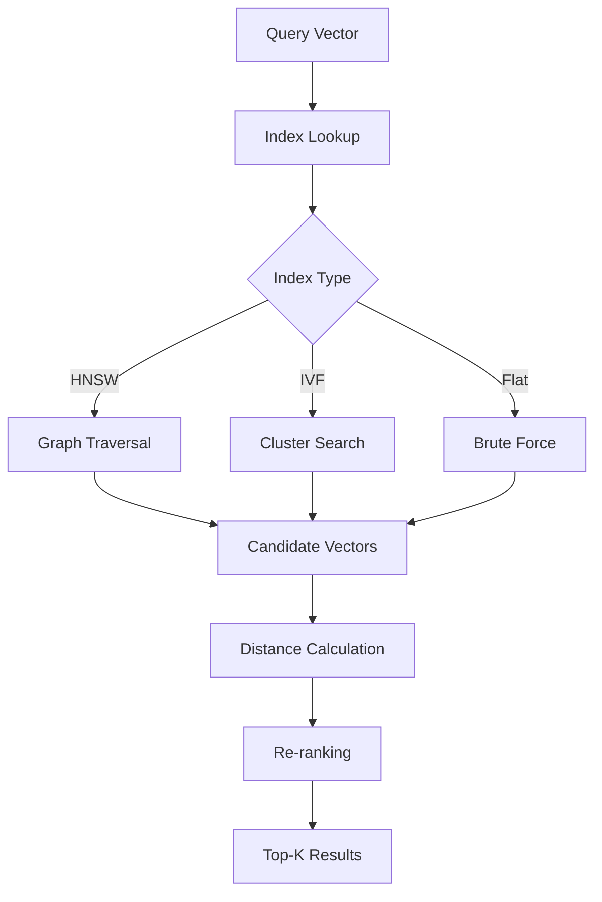
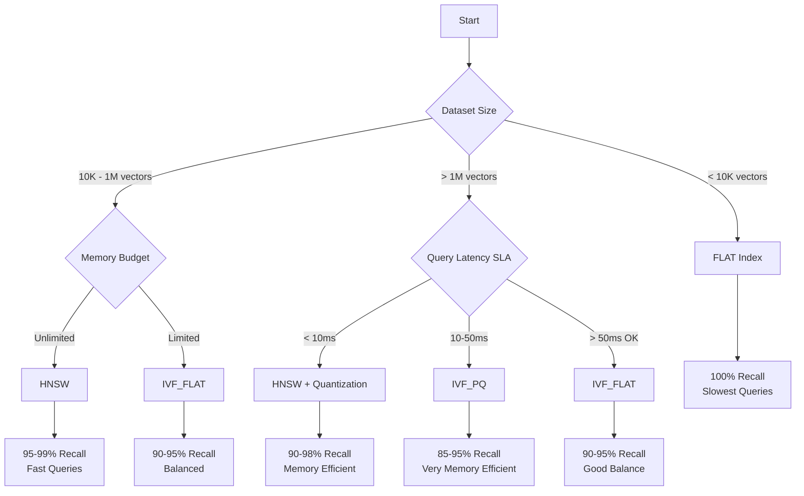
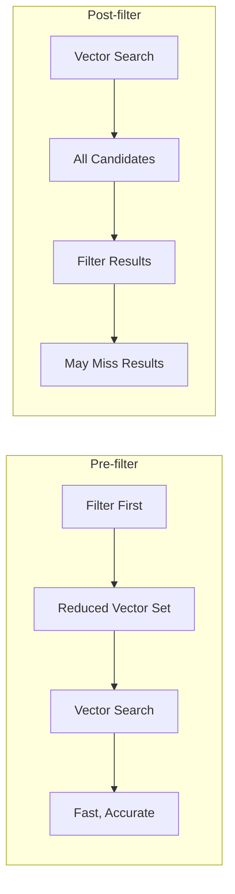
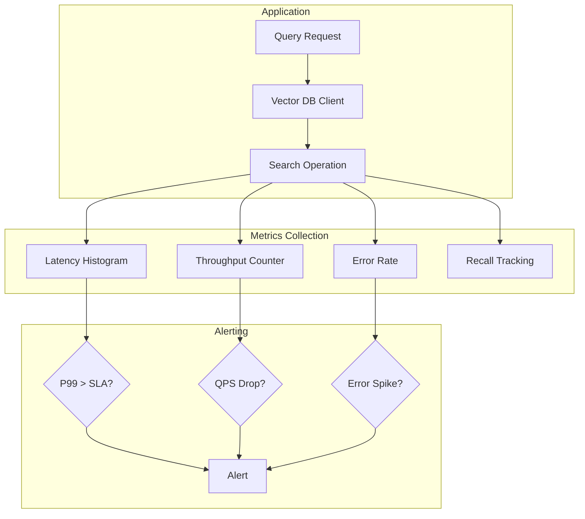
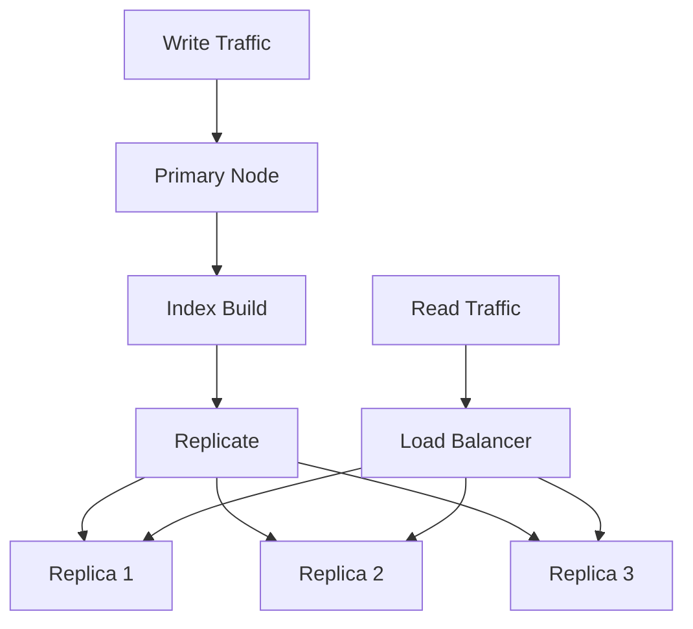

# How to Build Performance Tuning

Author: [nawazdhandala](https://github.com/nawazdhandala)

Tags: Vector Database, Performance, Optimization, Scalability

Description: Learn to build performance tuning strategies for optimizing vector database queries and operations.

---

Vector databases power modern AI applications, from semantic search to recommendation engines. But as your dataset grows from thousands to millions of vectors, query latency can spike from milliseconds to seconds. This guide walks you through practical performance tuning strategies that keep your vector database fast at scale.

## Understanding Vector Database Performance

Before diving into optimizations, you need to understand what makes vector search computationally expensive. Unlike traditional databases that match exact values, vector databases compute similarity scores between a query vector and potentially millions of stored vectors.



The performance bottlenecks typically fall into three categories:

| Bottleneck | Cause | Impact |
| --- | --- | --- |
| Index build time | Large dataset, suboptimal parameters | Slow ingestion, delayed updates |
| Query latency | Poor index configuration, insufficient memory | User-facing slowdowns |
| Memory pressure | Oversized indexes, no quantization | OOM errors, swap thrashing |

## Index Tuning for Different Workloads

The choice of index algorithm and its parameters dramatically affects both query speed and accuracy. Here is how to configure the most common index types.

### HNSW (Hierarchical Navigable Small World)

HNSW is the go-to index for most production workloads. It builds a multi-layer graph where each node connects to its nearest neighbors.

```python
# Configuring HNSW index in Milvus
# Higher M = better recall, more memory, slower builds
# Higher ef_construction = better recall, slower builds

from pymilvus import Collection, CollectionSchema, FieldSchema, DataType

# Define the collection schema
fields = [
    FieldSchema(name="id", dtype=DataType.INT64, is_primary=True),
    FieldSchema(name="embedding", dtype=DataType.FLOAT_VECTOR, dim=768)
]
schema = CollectionSchema(fields, description="Document embeddings")
collection = Collection("documents", schema)

# Create HNSW index with tuned parameters
index_params = {
    "metric_type": "COSINE",      # Use cosine similarity for normalized embeddings
    "index_type": "HNSW",
    "params": {
        "M": 16,                   # Number of bi-directional links per node
                                   # Range: 4-64, higher = better recall, more memory
        "efConstruction": 200      # Search depth during index building
                                   # Range: 100-500, higher = better quality, slower build
    }
}

collection.create_index(
    field_name="embedding",
    index_params=index_params
)
```

For query time, the `ef` parameter controls the search depth:

```python
# Setting search parameters for queries
# ef must be >= top_k for valid results

search_params = {
    "metric_type": "COSINE",
    "params": {
        "ef": 128    # Search depth at query time
                     # Higher ef = better recall, slower queries
                     # Rule of thumb: ef = 2x to 4x your top_k value
    }
}

# Execute similarity search
results = collection.search(
    data=[query_embedding],      # Your query vector
    anns_field="embedding",      # Field to search
    param=search_params,
    limit=10,                    # Top-K results
    output_fields=["id"]         # Fields to return
)
```

### IVF (Inverted File Index)

IVF clusters vectors and searches only relevant clusters. It uses less memory than HNSW but requires more tuning.

```python
# IVF index configuration for large datasets
# nlist = number of clusters (centroids)
# Rule of thumb: nlist = sqrt(total_vectors) to 4*sqrt(total_vectors)

index_params = {
    "metric_type": "L2",
    "index_type": "IVF_FLAT",
    "params": {
        "nlist": 1024    # Number of clusters
                         # More clusters = faster search, lower recall
                         # Fewer clusters = slower search, higher recall
    }
}

# For 1 million vectors: nlist = 1000-4000 is reasonable
# For 100 million vectors: nlist = 10000-40000

collection.create_index(
    field_name="embedding",
    index_params=index_params
)
```

Query-time nprobe determines how many clusters to search:

```python
# nprobe = number of clusters to search
# Higher nprobe = better recall, slower queries

search_params = {
    "metric_type": "L2",
    "params": {
        "nprobe": 64    # Search this many clusters
                        # Start with nprobe = nlist/16 and tune from there
                        # For nlist=1024, try nprobe between 16 and 128
    }
}
```

### Choosing the Right Index

Use this decision tree to select your index type:



## Memory Configuration and Quantization

Vector databases are memory-hungry. A single float32 vector with 768 dimensions consumes 3KB. At 10 million vectors, that is 30GB just for the raw data, before index overhead.

### Product Quantization (PQ)

PQ compresses vectors by encoding them as references to centroids, reducing memory by 4-32x with some recall loss.

```python
# IVF_PQ index for memory-constrained environments
# m = number of subquantizers (must divide dimension evenly)
# nbits = bits per subquantizer (typically 8)

index_params = {
    "metric_type": "L2",
    "index_type": "IVF_PQ",
    "params": {
        "nlist": 2048,   # Number of IVF clusters
        "m": 48,         # Number of subquantizers
                         # 768 dimensions / 48 = 16 dims per subquantizer
                         # More m = better recall, more memory
        "nbits": 8       # Bits per code (8 is standard)
                         # Memory per vector = m * nbits / 8 bytes
                         # With m=48, nbits=8: 48 bytes per vector vs 3072 bytes original
    }
}

# Memory reduction: 3072 / 48 = 64x compression
# Recall typically drops 5-15% compared to FLAT
```

### Scalar Quantization (SQ)

SQ converts float32 to int8, achieving 4x compression with minimal recall loss.

```python
# Scalar quantization in Qdrant
from qdrant_client import QdrantClient
from qdrant_client.models import (
    VectorParams,
    Distance,
    ScalarQuantization,
    ScalarQuantizationConfig,
    ScalarType
)

client = QdrantClient(host="localhost", port=6333)

# Create collection with scalar quantization
client.create_collection(
    collection_name="documents",
    vectors_config=VectorParams(
        size=768,
        distance=Distance.COSINE
    ),
    quantization_config=ScalarQuantization(
        scalar=ScalarQuantizationConfig(
            type=ScalarType.INT8,     # Compress float32 to int8
            quantile=0.99,            # Clip outliers beyond 99th percentile
            always_ram=True           # Keep quantized vectors in RAM
        )
    )
)
```

### Memory Planning Calculator

Use this formula to estimate memory requirements:

```python
def estimate_memory_gb(
    num_vectors: int,
    dimensions: int,
    index_type: str,
    quantization: str = None
) -> dict:
    """
    Estimate memory requirements for a vector database.

    Args:
        num_vectors: Total number of vectors
        dimensions: Vector dimensionality
        index_type: One of 'flat', 'hnsw', 'ivf'
        quantization: One of None, 'sq8', 'pq'

    Returns:
        Dictionary with memory estimates in GB
    """
    # Base vector size in bytes
    bytes_per_float = 4  # float32
    raw_vector_bytes = dimensions * bytes_per_float

    # Apply quantization compression
    if quantization == "sq8":
        vector_bytes = dimensions * 1  # int8
    elif quantization == "pq":
        m = dimensions // 16  # Typical subquantizer count
        vector_bytes = m * 1  # 8 bits per subquantizer
    else:
        vector_bytes = raw_vector_bytes

    # Calculate index overhead
    if index_type == "flat":
        overhead_factor = 1.0
    elif index_type == "hnsw":
        # HNSW adds graph edges: ~M * 2 * 8 bytes per vector (M=16 typical)
        overhead_factor = 1.0 + (16 * 2 * 8) / vector_bytes
    elif index_type == "ivf":
        # IVF adds cluster assignments and centroid storage
        overhead_factor = 1.1
    else:
        overhead_factor = 1.0

    total_bytes = num_vectors * vector_bytes * overhead_factor
    total_gb = total_bytes / (1024 ** 3)

    return {
        "raw_data_gb": (num_vectors * raw_vector_bytes) / (1024 ** 3),
        "with_quantization_gb": (num_vectors * vector_bytes) / (1024 ** 3),
        "with_index_gb": total_gb,
        "recommended_ram_gb": total_gb * 1.2  # 20% headroom for operations
    }

# Example usage
estimate = estimate_memory_gb(
    num_vectors=10_000_000,
    dimensions=768,
    index_type="hnsw",
    quantization="sq8"
)
print(f"Recommended RAM: {estimate['recommended_ram_gb']:.1f} GB")
# Output: Recommended RAM: 12.4 GB
```

## Query Optimization Strategies

Optimizing individual queries can yield significant latency improvements without changing your index configuration.

### Pre-filtering vs Post-filtering

Vector databases support filtering results by metadata. The order of operations matters enormously:



```python
# Qdrant example: Pre-filtering for better performance
from qdrant_client.models import Filter, FieldCondition, MatchValue

# Pre-filter: Only search vectors matching the filter
# This reduces the search space before similarity calculation
results = client.search(
    collection_name="documents",
    query_vector=query_embedding,
    query_filter=Filter(
        must=[
            FieldCondition(
                key="category",
                match=MatchValue(value="technical")
            ),
            FieldCondition(
                key="published_year",
                range={"gte": 2023}  # Only recent documents
            )
        ]
    ),
    limit=10,
    # Enable indexed filtering for large filter sets
    search_params={"indexed_only": True}
)

# Index your filter fields for fast pre-filtering
client.create_payload_index(
    collection_name="documents",
    field_name="category",
    field_schema="keyword"  # Exact match index
)

client.create_payload_index(
    collection_name="documents",
    field_name="published_year",
    field_schema="integer"  # Range query index
)
```

### Batch Queries for Throughput

If you need to process multiple queries, batching amortizes connection overhead:

```python
import asyncio
from pymilvus import Collection

async def batch_search(
    collection: Collection,
    query_vectors: list,
    batch_size: int = 100,
    top_k: int = 10
) -> list:
    """
    Execute vector searches in optimized batches.

    Batching reduces per-query overhead and enables
    parallel processing on the server side.
    """
    all_results = []
    search_params = {"metric_type": "COSINE", "params": {"ef": 64}}

    # Process in batches to balance memory and throughput
    for i in range(0, len(query_vectors), batch_size):
        batch = query_vectors[i:i + batch_size]

        # Single network round-trip for entire batch
        results = collection.search(
            data=batch,
            anns_field="embedding",
            param=search_params,
            limit=top_k
        )
        all_results.extend(results)

    return all_results

# Usage: 1000 queries in 10 batches vs 1000 individual calls
# Typical speedup: 5-10x for network-bound workloads
```

### Caching Hot Queries

Many applications have query patterns where certain vectors are searched repeatedly:

```python
import hashlib
from functools import lru_cache
from typing import Tuple
import numpy as np

class VectorSearchCache:
    """
    LRU cache for vector search results.

    Caches are invalidated on collection updates.
    Use for read-heavy workloads with repeated queries.
    """

    def __init__(self, collection, max_size: int = 10000):
        self.collection = collection
        self.cache = {}
        self.max_size = max_size
        self.version = 0  # Increment on writes to invalidate

    def _hash_vector(self, vector: list, top_k: int) -> str:
        """Create cache key from vector and parameters."""
        # Round to reduce floating point variations
        rounded = np.round(vector, decimals=6)
        key_data = f"{rounded.tobytes().hex()}:{top_k}:{self.version}"
        return hashlib.md5(key_data.encode()).hexdigest()

    def search(self, query_vector: list, top_k: int = 10) -> list:
        """Search with caching."""
        cache_key = self._hash_vector(query_vector, top_k)

        if cache_key in self.cache:
            return self.cache[cache_key]

        # Cache miss: execute actual search
        results = self.collection.search(
            data=[query_vector],
            anns_field="embedding",
            param={"metric_type": "COSINE", "params": {"ef": 64}},
            limit=top_k
        )

        # Store in cache with LRU eviction
        if len(self.cache) >= self.max_size:
            # Remove oldest entry (simplified LRU)
            oldest_key = next(iter(self.cache))
            del self.cache[oldest_key]

        self.cache[cache_key] = results[0]
        return results[0]

    def invalidate(self):
        """Call after inserts/updates/deletes."""
        self.version += 1
        self.cache.clear()
```

## Monitoring and Observability

You cannot tune what you cannot measure. Instrument your vector database with these key metrics.



### Prometheus Metrics Example

```python
from prometheus_client import Histogram, Counter, Gauge
import time

# Define metrics
SEARCH_LATENCY = Histogram(
    'vector_search_latency_seconds',
    'Time spent in vector search',
    buckets=[0.001, 0.005, 0.01, 0.025, 0.05, 0.1, 0.25, 0.5, 1.0]
)

SEARCH_RESULTS = Histogram(
    'vector_search_results_count',
    'Number of results returned',
    buckets=[0, 1, 5, 10, 25, 50, 100]
)

SEARCH_ERRORS = Counter(
    'vector_search_errors_total',
    'Total number of search errors',
    ['error_type']
)

INDEX_MEMORY = Gauge(
    'vector_index_memory_bytes',
    'Memory used by vector index',
    ['collection']
)

def instrumented_search(collection, query_vector, top_k=10):
    """
    Wrapper that adds observability to vector searches.

    Tracks latency, result counts, and errors.
    """
    start_time = time.perf_counter()

    try:
        results = collection.search(
            data=[query_vector],
            anns_field="embedding",
            param={"metric_type": "COSINE", "params": {"ef": 64}},
            limit=top_k
        )

        # Record success metrics
        latency = time.perf_counter() - start_time
        SEARCH_LATENCY.observe(latency)
        SEARCH_RESULTS.observe(len(results[0]))

        return results[0]

    except Exception as e:
        # Record error metrics
        SEARCH_ERRORS.labels(error_type=type(e).__name__).inc()
        raise

# Periodically update memory gauge
def update_memory_metrics(collection):
    stats = collection.get_collection_stats()
    INDEX_MEMORY.labels(collection=collection.name).set(
        stats.get('index_size', 0)
    )
```

### Key Metrics to Track

| Metric | Target | Action if Exceeded |
| --- | --- | --- |
| P50 latency | < 10ms | Increase ef/nprobe, add caching |
| P99 latency | < 100ms | Scale horizontally, check for hotspots |
| Memory usage | < 80% of available | Enable quantization, shard data |
| Recall@10 | > 95% | Increase index quality params |
| QPS per node | Varies by hardware | Add replicas, optimize batch size |

## Scaling Strategies

When single-node optimization is not enough, these scaling patterns help maintain performance.

### Horizontal Sharding

Distribute vectors across multiple nodes based on a partition key:

```python
# Milvus partition-based sharding
from pymilvus import Collection, Partition

def create_sharded_collection(collection_name: str, num_shards: int):
    """
    Create a collection with partitions for horizontal scaling.

    Each partition can be hosted on a different node.
    Queries can target specific partitions for locality.
    """
    # Create base collection
    collection = Collection(collection_name)

    # Create partitions (shards)
    for i in range(num_shards):
        partition_name = f"shard_{i}"
        partition = Partition(collection, partition_name)
        print(f"Created partition: {partition_name}")

    return collection

def insert_with_sharding(collection, vectors, ids, shard_key_fn):
    """
    Insert vectors into appropriate shards based on key.

    Args:
        shard_key_fn: Function that returns shard number for an id
    """
    # Group by shard
    shards = {}
    for vec, id in zip(vectors, ids):
        shard_num = shard_key_fn(id)
        if shard_num not in shards:
            shards[shard_num] = {"vectors": [], "ids": []}
        shards[shard_num]["vectors"].append(vec)
        shards[shard_num]["ids"].append(id)

    # Insert into each shard
    for shard_num, data in shards.items():
        partition = Partition(collection, f"shard_{shard_num}")
        partition.insert([data["ids"], data["vectors"]])

def search_with_routing(collection, query_vector, shard_nums: list, top_k: int):
    """
    Search specific shards when you know the data locality.

    This avoids scanning all shards for targeted queries.
    """
    partition_names = [f"shard_{n}" for n in shard_nums]

    results = collection.search(
        data=[query_vector],
        anns_field="embedding",
        param={"metric_type": "COSINE", "params": {"ef": 64}},
        limit=top_k,
        partition_names=partition_names  # Only search these partitions
    )

    return results[0]
```

### Read Replicas

For read-heavy workloads, replicate the index across multiple nodes:



```python
# Qdrant cluster configuration for replicas
from qdrant_client import QdrantClient
from qdrant_client.models import VectorParams, Distance

# Connect to cluster
client = QdrantClient(
    url="http://qdrant-cluster:6333",
    prefer_grpc=True  # gRPC is faster for high-throughput
)

# Create collection with replication
client.create_collection(
    collection_name="documents",
    vectors_config=VectorParams(
        size=768,
        distance=Distance.COSINE
    ),
    # Replication settings
    replication_factor=3,        # Number of replicas per shard
    write_consistency_factor=2,  # Writes must reach 2 nodes
    # Sharding settings
    shard_number=4,              # Distribute across 4 shards
    on_disk_payload=True         # Keep payload on disk to save RAM
)

# Searches automatically distribute across replicas
# with client-side load balancing
```

## Production Checklist

Before deploying your tuned vector database to production, verify these items:

```python
def production_readiness_check(collection) -> dict:
    """
    Validate vector database configuration for production.

    Returns dict of checks with pass/fail status.
    """
    checks = {}

    # Check 1: Index exists and is built
    index_info = collection.index()
    checks["index_built"] = index_info is not None

    # Check 2: Memory usage is within bounds
    stats = collection.get_collection_stats()
    memory_gb = stats.get('index_size', 0) / (1024**3)
    available_gb = 64  # Your server RAM
    checks["memory_safe"] = memory_gb < (available_gb * 0.8)

    # Check 3: Verify recall on sample queries
    # (Run this with a test set where you know ground truth)
    checks["recall_validated"] = True  # Replace with actual test

    # Check 4: Latency meets SLA
    import time
    test_vector = [0.1] * 768  # Replace with real test vector

    latencies = []
    for _ in range(100):
        start = time.perf_counter()
        collection.search(
            data=[test_vector],
            anns_field="embedding",
            param={"metric_type": "COSINE", "params": {"ef": 64}},
            limit=10
        )
        latencies.append(time.perf_counter() - start)

    p99_ms = sorted(latencies)[98] * 1000
    checks["latency_sla"] = p99_ms < 100  # 100ms SLA
    checks["p99_latency_ms"] = p99_ms

    # Check 5: Backup configured
    checks["backup_configured"] = True  # Verify your backup system

    return checks

# Run before deployment
results = production_readiness_check(collection)
for check, passed in results.items():
    status = "PASS" if passed else "FAIL"
    print(f"[{status}] {check}: {passed}")
```

## Conclusion

Performance tuning for vector databases is an iterative process. Start by selecting the right index type for your workload, then tune parameters based on your recall and latency requirements. Use quantization to reduce memory footprint, and implement proper monitoring to catch regressions early.

The key principles to remember:

1. **Measure first**: Profile your actual queries before optimizing
2. **Start simple**: HNSW with default parameters works well for most cases
3. **Trade consciously**: Every optimization trades recall for speed or memory
4. **Monitor continuously**: Set alerts on P99 latency and memory usage
5. **Scale horizontally**: When single-node tuning plateaus, shard and replicate

With these strategies in place, your vector database can handle millions of vectors while maintaining sub-100ms query latency.
