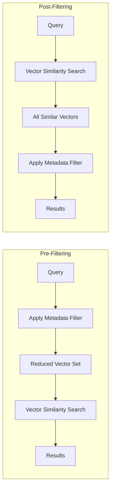
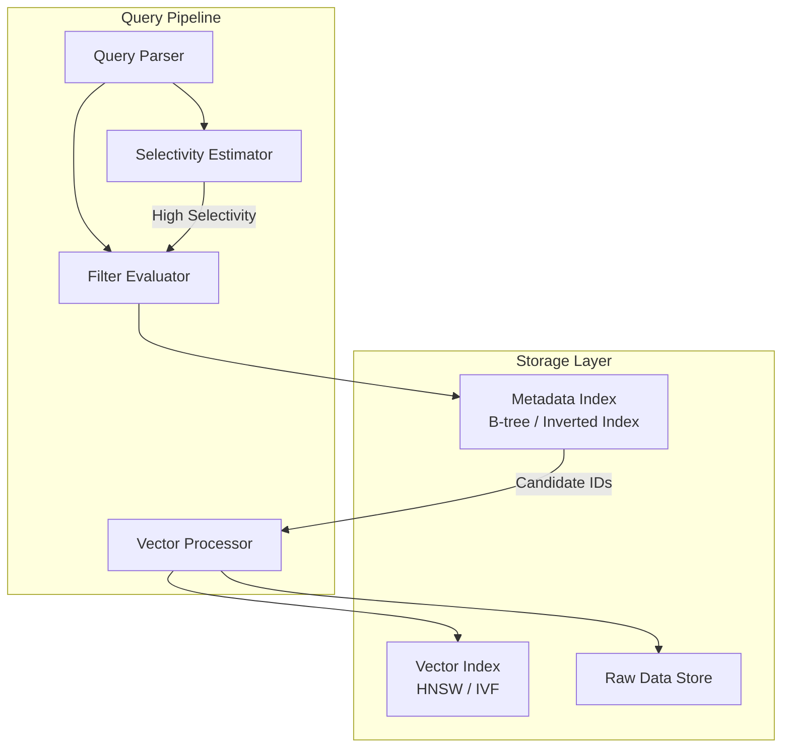

# How to Build Pre-Filtering

Author: [nawazdhandala](https://github.com/nawazdhandala)

Tags: Vector Database, Pre-Filtering, Query Optimization, Performance

Description: Learn to build pre-filtering for applying metadata filters before vector similarity search.

---

Vector databases power modern AI applications from semantic search to recommendation systems. But raw similarity search is rarely enough. Users want to search within specific categories, date ranges, or permission boundaries. Pre-filtering applies these metadata constraints before the vector similarity computation, dramatically improving both relevance and performance.

## Understanding Pre-Filtering vs Post-Filtering

The fundamental question: when do you apply your metadata filters?



**Post-filtering** searches across all vectors first, then discards results that do not match your metadata criteria. Simple to implement but wasteful. If 99% of your vectors do not match the filter, you computed 99% unnecessary similarity scores.

**Pre-filtering** narrows the search space before computing any similarity. More complex to implement but dramatically more efficient for selective filters.

## The Core Architecture

A pre-filtering system needs three components:

1. **Metadata Index** - Fast lookups for filter predicates
2. **Vector Index** - Approximate nearest neighbor search structure
3. **Filter-Aware Query Planner** - Decides the optimal execution strategy



## Building the Metadata Index

Start with a metadata schema that captures the filterable attributes.

```python
from dataclasses import dataclass
from typing import Any, Dict, List, Set, Optional
from enum import Enum
import bisect


class FieldType(Enum):
    """
    Supported metadata field types.
    Each type determines the index structure used.
    """
    STRING = "string"       # Exact match, uses inverted index
    INTEGER = "integer"     # Range queries, uses B-tree
    FLOAT = "float"         # Range queries, uses B-tree
    BOOLEAN = "boolean"     # Binary filter, uses bitmap
    TIMESTAMP = "timestamp" # Range queries, uses B-tree
    ARRAY = "array"         # Contains queries, uses inverted index


@dataclass
class FieldSchema:
    """
    Schema definition for a single metadata field.
    """
    name: str
    field_type: FieldType
    indexed: bool = True  # Whether to build an index for this field


class InvertedIndex:
    """
    Inverted index for string and array fields.
    Maps values to sets of document IDs for O(1) lookups.
    """

    def __init__(self):
        # value -> set of doc_ids that contain this value
        self._index: Dict[Any, Set[int]] = {}
        # doc_id -> set of values (for deletion support)
        self._reverse: Dict[int, Set[Any]] = {}

    def add(self, doc_id: int, value: Any) -> None:
        """
        Index a value for a document.
        Handles both single values and arrays.
        """
        # Normalize to list for uniform handling
        values = value if isinstance(value, list) else [value]

        for v in values:
            # Add to forward index
            if v not in self._index:
                self._index[v] = set()
            self._index[v].add(doc_id)

            # Add to reverse index for deletion support
            if doc_id not in self._reverse:
                self._reverse[doc_id] = set()
            self._reverse[doc_id].add(v)

    def remove(self, doc_id: int) -> None:
        """
        Remove all index entries for a document.
        """
        if doc_id not in self._reverse:
            return

        for value in self._reverse[doc_id]:
            self._index[value].discard(doc_id)
            # Clean up empty sets to prevent memory bloat
            if not self._index[value]:
                del self._index[value]

        del self._reverse[doc_id]

    def lookup(self, value: Any) -> Set[int]:
        """
        Find all document IDs with the given value.
        Returns empty set if value not found.
        """
        return self._index.get(value, set()).copy()

    def lookup_any(self, values: List[Any]) -> Set[int]:
        """
        Find documents matching ANY of the given values (OR).
        """
        result = set()
        for v in values:
            result.update(self._index.get(v, set()))
        return result

    def lookup_all(self, values: List[Any]) -> Set[int]:
        """
        Find documents matching ALL of the given values (AND).
        """
        if not values:
            return set()

        # Start with smallest set for efficiency
        sets = [self._index.get(v, set()) for v in values]
        sets.sort(key=len)

        result = sets[0].copy()
        for s in sets[1:]:
            result.intersection_update(s)
            # Early exit if intersection is empty
            if not result:
                break

        return result


class BTreeIndex:
    """
    B-tree style index for numeric and timestamp fields.
    Supports efficient range queries using sorted lists.

    Note: Production systems should use a proper B-tree implementation.
    This simplified version demonstrates the concept.
    """

    def __init__(self):
        # Sorted list of (value, doc_id) tuples
        self._entries: List[tuple] = []
        # doc_id -> value mapping for deletion
        self._doc_values: Dict[int, Any] = {}

    def add(self, doc_id: int, value: Any) -> None:
        """
        Add a value to the index, maintaining sort order.
        """
        entry = (value, doc_id)
        bisect.insort(self._entries, entry)
        self._doc_values[doc_id] = value

    def remove(self, doc_id: int) -> None:
        """
        Remove a document from the index.
        """
        if doc_id not in self._doc_values:
            return

        value = self._doc_values[doc_id]
        entry = (value, doc_id)

        # Find and remove the entry
        idx = bisect.bisect_left(self._entries, entry)
        if idx < len(self._entries) and self._entries[idx] == entry:
            self._entries.pop(idx)

        del self._doc_values[doc_id]

    def range_query(
        self,
        min_val: Optional[Any] = None,
        max_val: Optional[Any] = None,
        include_min: bool = True,
        include_max: bool = True
    ) -> Set[int]:
        """
        Find all documents with values in the given range.
        Supports open-ended ranges (None for unbounded).
        """
        if not self._entries:
            return set()

        # Find start position
        if min_val is None:
            start_idx = 0
        else:
            # Use a sentinel for doc_id to ensure correct positioning
            start_idx = bisect.bisect_left(
                self._entries,
                (min_val, -float('inf'))
            )

        # Find end position
        if max_val is None:
            end_idx = len(self._entries)
        else:
            end_idx = bisect.bisect_right(
                self._entries,
                (max_val, float('inf'))
            )

        # Collect matching document IDs
        result = set()
        for i in range(start_idx, end_idx):
            value, doc_id = self._entries[i]

            # Check boundary conditions
            if min_val is not None:
                if not include_min and value == min_val:
                    continue
            if max_val is not None:
                if not include_max and value == max_val:
                    continue

            result.add(doc_id)

        return result

    def equals(self, value: Any) -> Set[int]:
        """
        Find all documents with exactly the given value.
        """
        return self.range_query(value, value, True, True)
```

## Building the Filter Evaluator

The filter evaluator takes a filter expression and returns matching document IDs.

```python
from dataclasses import dataclass
from typing import Any, List, Set, Union
from enum import Enum


class FilterOp(Enum):
    """
    Supported filter operations.
    """
    EQ = "eq"           # Equals
    NE = "ne"           # Not equals
    GT = "gt"           # Greater than
    GTE = "gte"         # Greater than or equal
    LT = "lt"           # Less than
    LTE = "lte"         # Less than or equal
    IN = "in"           # Value in list
    NIN = "nin"         # Value not in list
    CONTAINS = "contains"  # Array contains value
    AND = "and"         # Logical AND
    OR = "or"           # Logical OR
    NOT = "not"         # Logical NOT


@dataclass
class FilterCondition:
    """
    A single filter condition on a metadata field.
    """
    field: str
    op: FilterOp
    value: Any


@dataclass
class FilterExpression:
    """
    A compound filter expression combining multiple conditions.
    """
    op: FilterOp  # AND, OR, NOT
    conditions: List[Union['FilterCondition', 'FilterExpression']]


class FilterEvaluator:
    """
    Evaluates filter expressions against metadata indexes.
    Returns the set of document IDs matching the filter.
    """

    def __init__(
        self,
        inverted_indexes: Dict[str, InvertedIndex],
        btree_indexes: Dict[str, BTreeIndex],
        all_doc_ids: Set[int]
    ):
        self._inverted = inverted_indexes
        self._btree = btree_indexes
        self._all_docs = all_doc_ids

    def evaluate(
        self,
        filter_expr: Union[FilterCondition, FilterExpression]
    ) -> Set[int]:
        """
        Evaluate a filter expression and return matching document IDs.
        """
        if isinstance(filter_expr, FilterCondition):
            return self._evaluate_condition(filter_expr)
        else:
            return self._evaluate_expression(filter_expr)

    def _evaluate_condition(self, cond: FilterCondition) -> Set[int]:
        """
        Evaluate a single filter condition.
        """
        field = cond.field
        op = cond.op
        value = cond.value

        # Check which index to use
        if field in self._inverted:
            return self._eval_inverted(field, op, value)
        elif field in self._btree:
            return self._eval_btree(field, op, value)
        else:
            # Field not indexed, fall back to full scan
            # In production, you might want to raise an error instead
            return self._all_docs.copy()

    def _eval_inverted(
        self,
        field: str,
        op: FilterOp,
        value: Any
    ) -> Set[int]:
        """
        Evaluate condition against inverted index.
        """
        index = self._inverted[field]

        if op == FilterOp.EQ:
            return index.lookup(value)

        elif op == FilterOp.NE:
            # All docs minus those matching the value
            matching = index.lookup(value)
            return self._all_docs - matching

        elif op == FilterOp.IN:
            return index.lookup_any(value)

        elif op == FilterOp.NIN:
            matching = index.lookup_any(value)
            return self._all_docs - matching

        elif op == FilterOp.CONTAINS:
            # For array fields, find docs where array contains value
            return index.lookup(value)

        else:
            raise ValueError(f"Unsupported operation {op} for inverted index")

    def _eval_btree(
        self,
        field: str,
        op: FilterOp,
        value: Any
    ) -> Set[int]:
        """
        Evaluate condition against B-tree index.
        """
        index = self._btree[field]

        if op == FilterOp.EQ:
            return index.equals(value)

        elif op == FilterOp.NE:
            matching = index.equals(value)
            return self._all_docs - matching

        elif op == FilterOp.GT:
            return index.range_query(min_val=value, include_min=False)

        elif op == FilterOp.GTE:
            return index.range_query(min_val=value, include_min=True)

        elif op == FilterOp.LT:
            return index.range_query(max_val=value, include_max=False)

        elif op == FilterOp.LTE:
            return index.range_query(max_val=value, include_max=True)

        elif op == FilterOp.IN:
            # Union of all exact matches
            result = set()
            for v in value:
                result.update(index.equals(v))
            return result

        else:
            raise ValueError(f"Unsupported operation {op} for B-tree index")

    def _evaluate_expression(self, expr: FilterExpression) -> Set[int]:
        """
        Evaluate a compound filter expression.
        """
        if expr.op == FilterOp.AND:
            # Intersection of all sub-conditions
            if not expr.conditions:
                return self._all_docs.copy()

            # Evaluate conditions and intersect
            # Start with first condition's results
            result = self.evaluate(expr.conditions[0])

            for cond in expr.conditions[1:]:
                result.intersection_update(self.evaluate(cond))
                # Early exit optimization
                if not result:
                    break

            return result

        elif expr.op == FilterOp.OR:
            # Union of all sub-conditions
            result = set()
            for cond in expr.conditions:
                result.update(self.evaluate(cond))
            return result

        elif expr.op == FilterOp.NOT:
            # Complement of the single sub-condition
            if len(expr.conditions) != 1:
                raise ValueError("NOT expression must have exactly one condition")
            matching = self.evaluate(expr.conditions[0])
            return self._all_docs - matching

        else:
            raise ValueError(f"Invalid expression operator: {expr.op}")
```

## Filter Selectivity Estimation

The query planner needs to estimate how selective a filter is to choose the optimal execution strategy.

```python
from dataclasses import dataclass
from typing import Dict, Optional
import math


@dataclass
class FieldStatistics:
    """
    Statistics about a metadata field for selectivity estimation.
    """
    total_docs: int          # Total documents in the collection
    distinct_values: int     # Number of unique values
    min_value: Optional[Any] # Minimum value (for numeric fields)
    max_value: Optional[Any] # Maximum value (for numeric fields)
    null_count: int          # Documents with null/missing value

    # Optional: value frequency histogram for better estimates
    # histogram: Dict[Any, int] = None


class SelectivityEstimator:
    """
    Estimates the selectivity (fraction of matching documents) for filters.

    Selectivity ranges from 0.0 (matches nothing) to 1.0 (matches everything).
    Lower selectivity = more selective = fewer matching documents.
    """

    def __init__(self, field_stats: Dict[str, FieldStatistics]):
        self._stats = field_stats

    def estimate(
        self,
        filter_expr: Union[FilterCondition, FilterExpression]
    ) -> float:
        """
        Estimate selectivity of a filter expression.
        Returns value between 0.0 and 1.0.
        """
        if isinstance(filter_expr, FilterCondition):
            return self._estimate_condition(filter_expr)
        else:
            return self._estimate_expression(filter_expr)

    def _estimate_condition(self, cond: FilterCondition) -> float:
        """
        Estimate selectivity of a single condition.
        """
        if cond.field not in self._stats:
            # Unknown field, assume medium selectivity
            return 0.5

        stats = self._stats[cond.field]
        op = cond.op
        value = cond.value

        # Equality: assume uniform distribution
        if op == FilterOp.EQ:
            if stats.distinct_values == 0:
                return 0.0
            return 1.0 / stats.distinct_values

        # Not equals: complement of equality
        elif op == FilterOp.NE:
            return 1.0 - (1.0 / stats.distinct_values)

        # Range queries: estimate based on value range
        elif op in (FilterOp.GT, FilterOp.GTE, FilterOp.LT, FilterOp.LTE):
            return self._estimate_range(stats, op, value)

        # IN: assume each value has equal probability
        elif op == FilterOp.IN:
            num_values = len(value) if isinstance(value, list) else 1
            single_selectivity = 1.0 / stats.distinct_values
            # Use inclusion-exclusion approximation
            return min(1.0, num_values * single_selectivity)

        # Contains for arrays: harder to estimate, use heuristic
        elif op == FilterOp.CONTAINS:
            # Assume average array has sqrt(distinct_values) elements
            avg_array_size = math.sqrt(stats.distinct_values)
            return avg_array_size / stats.distinct_values

        # Default fallback
        return 0.5

    def _estimate_range(
        self,
        stats: FieldStatistics,
        op: FilterOp,
        value: Any
    ) -> float:
        """
        Estimate selectivity for range conditions.
        Assumes uniform distribution between min and max.
        """
        if stats.min_value is None or stats.max_value is None:
            return 0.5

        try:
            range_size = float(stats.max_value - stats.min_value)
            if range_size == 0:
                return 1.0 if value == stats.min_value else 0.0

            # Calculate fraction of range that matches
            if op == FilterOp.GT:
                fraction = (stats.max_value - value) / range_size
            elif op == FilterOp.GTE:
                fraction = (stats.max_value - value) / range_size
            elif op == FilterOp.LT:
                fraction = (value - stats.min_value) / range_size
            elif op == FilterOp.LTE:
                fraction = (value - stats.min_value) / range_size
            else:
                fraction = 0.5

            return max(0.0, min(1.0, fraction))

        except (TypeError, ValueError):
            # Non-numeric comparison failed
            return 0.5

    def _estimate_expression(self, expr: FilterExpression) -> float:
        """
        Estimate selectivity of compound expressions.
        """
        if not expr.conditions:
            return 1.0

        selectivities = [self.estimate(c) for c in expr.conditions]

        if expr.op == FilterOp.AND:
            # Assume independence (multiply probabilities)
            # This is optimistic; correlated filters have higher selectivity
            result = 1.0
            for s in selectivities:
                result *= s
            return result

        elif expr.op == FilterOp.OR:
            # Use inclusion-exclusion principle
            # P(A or B) = P(A) + P(B) - P(A and B)
            # For independence: P(A or B) = P(A) + P(B) - P(A)*P(B)
            result = 0.0
            for i, s in enumerate(selectivities):
                result += s
                # Subtract pairwise intersections (approximation)
                if i > 0:
                    result -= selectivities[i-1] * s
            return max(0.0, min(1.0, result))

        elif expr.op == FilterOp.NOT:
            return 1.0 - selectivities[0]

        return 0.5
```

## Integrating with Vector Search

Now combine the filter evaluator with a vector index.

```python
import numpy as np
from typing import List, Tuple, Optional
from dataclasses import dataclass


@dataclass
class SearchResult:
    """
    A single search result with document ID and similarity score.
    """
    doc_id: int
    score: float
    metadata: Optional[Dict[str, Any]] = None


class PreFilteredVectorSearch:
    """
    Vector search with pre-filtering support.

    Execution strategies:
    1. Pre-filter then search: For highly selective filters
    2. Search then filter: For low selectivity filters
    3. Hybrid: For medium selectivity
    """

    # Selectivity thresholds for strategy selection
    PREFILTER_THRESHOLD = 0.1   # Use pre-filter if < 10% of docs match
    POSTFILTER_THRESHOLD = 0.9  # Use post-filter if > 90% of docs match

    def __init__(
        self,
        vectors: np.ndarray,           # Shape: (num_docs, embedding_dim)
        metadata: List[Dict[str, Any]], # Metadata for each document
        schema: List[FieldSchema]       # Schema for metadata fields
    ):
        self._vectors = vectors
        self._metadata = metadata
        self._num_docs = len(vectors)
        self._all_doc_ids = set(range(self._num_docs))

        # Build metadata indexes
        self._inverted_indexes: Dict[str, InvertedIndex] = {}
        self._btree_indexes: Dict[str, BTreeIndex] = {}
        self._build_indexes(schema)

        # Compute field statistics for selectivity estimation
        self._field_stats = self._compute_statistics(schema)

        # Initialize components
        self._filter_eval = FilterEvaluator(
            self._inverted_indexes,
            self._btree_indexes,
            self._all_doc_ids
        )
        self._selectivity_est = SelectivityEstimator(self._field_stats)

    def _build_indexes(self, schema: List[FieldSchema]) -> None:
        """
        Build metadata indexes based on schema.
        """
        for field_schema in schema:
            if not field_schema.indexed:
                continue

            field_name = field_schema.name
            field_type = field_schema.field_type

            # Choose index type based on field type
            if field_type in (FieldType.STRING, FieldType.ARRAY, FieldType.BOOLEAN):
                index = InvertedIndex()
                self._inverted_indexes[field_name] = index
            else:
                index = BTreeIndex()
                self._btree_indexes[field_name] = index

            # Populate index with existing data
            for doc_id, meta in enumerate(self._metadata):
                if field_name in meta and meta[field_name] is not None:
                    index.add(doc_id, meta[field_name])

    def _compute_statistics(
        self,
        schema: List[FieldSchema]
    ) -> Dict[str, FieldStatistics]:
        """
        Compute statistics for each indexed field.
        """
        stats = {}

        for field_schema in schema:
            field_name = field_schema.name
            values = [
                m.get(field_name)
                for m in self._metadata
                if field_name in m
            ]
            non_null = [v for v in values if v is not None]

            # Flatten arrays for distinct count
            if field_schema.field_type == FieldType.ARRAY:
                flat_values = []
                for v in non_null:
                    if isinstance(v, list):
                        flat_values.extend(v)
                    else:
                        flat_values.append(v)
                distinct = len(set(flat_values))
            else:
                distinct = len(set(non_null))

            # Compute min/max for numeric types
            min_val = None
            max_val = None
            if field_schema.field_type in (
                FieldType.INTEGER,
                FieldType.FLOAT,
                FieldType.TIMESTAMP
            ):
                if non_null:
                    min_val = min(non_null)
                    max_val = max(non_null)

            stats[field_name] = FieldStatistics(
                total_docs=self._num_docs,
                distinct_values=max(distinct, 1),  # Avoid division by zero
                min_value=min_val,
                max_value=max_val,
                null_count=len(values) - len(non_null)
            )

        return stats

    def search(
        self,
        query_vector: np.ndarray,
        filter_expr: Optional[Union[FilterCondition, FilterExpression]] = None,
        top_k: int = 10
    ) -> List[SearchResult]:
        """
        Search for similar vectors with optional pre-filtering.

        Automatically selects the optimal execution strategy based on
        estimated filter selectivity.
        """
        # No filter: standard vector search
        if filter_expr is None:
            return self._brute_force_search(query_vector, None, top_k)

        # Estimate filter selectivity
        selectivity = self._selectivity_est.estimate(filter_expr)
        estimated_matches = int(selectivity * self._num_docs)

        # Choose execution strategy
        if selectivity < self.PREFILTER_THRESHOLD:
            # Highly selective: pre-filter then search
            return self._prefilter_search(query_vector, filter_expr, top_k)

        elif selectivity > self.POSTFILTER_THRESHOLD:
            # Low selectivity: search then post-filter
            return self._postfilter_search(query_vector, filter_expr, top_k)

        else:
            # Medium selectivity: use hybrid approach
            return self._hybrid_search(
                query_vector,
                filter_expr,
                top_k,
                estimated_matches
            )

    def _prefilter_search(
        self,
        query_vector: np.ndarray,
        filter_expr: Union[FilterCondition, FilterExpression],
        top_k: int
    ) -> List[SearchResult]:
        """
        Pre-filtering strategy: filter first, then search within candidates.
        Best for highly selective filters.
        """
        # Get candidate document IDs from filter
        candidate_ids = self._filter_eval.evaluate(filter_expr)

        if not candidate_ids:
            return []

        # Search only within candidates
        return self._brute_force_search(query_vector, candidate_ids, top_k)

    def _postfilter_search(
        self,
        query_vector: np.ndarray,
        filter_expr: Union[FilterCondition, FilterExpression],
        top_k: int
    ) -> List[SearchResult]:
        """
        Post-filtering strategy: search first, then filter results.
        Best for low selectivity filters.
        """
        # Get more results than needed to account for filtering
        # Use a multiplier based on estimated selectivity
        selectivity = self._selectivity_est.estimate(filter_expr)
        fetch_k = min(
            self._num_docs,
            int(top_k / max(selectivity, 0.01))
        )

        # Get initial search results
        candidates = self._brute_force_search(query_vector, None, fetch_k)

        # Get matching document IDs from filter
        matching_ids = self._filter_eval.evaluate(filter_expr)

        # Filter results
        filtered = [r for r in candidates if r.doc_id in matching_ids]

        return filtered[:top_k]

    def _hybrid_search(
        self,
        query_vector: np.ndarray,
        filter_expr: Union[FilterCondition, FilterExpression],
        top_k: int,
        estimated_matches: int
    ) -> List[SearchResult]:
        """
        Hybrid strategy: balance between pre and post filtering.

        Uses filter to reduce candidate set, but processes in batches
        to avoid loading all vectors at once.
        """
        # Get candidate IDs from filter
        candidate_ids = self._filter_eval.evaluate(filter_expr)

        if not candidate_ids:
            return []

        # If candidates fit in memory, use pre-filter approach
        if len(candidate_ids) < 10000:
            return self._brute_force_search(query_vector, candidate_ids, top_k)

        # Otherwise, process in batches
        batch_size = 5000
        candidate_list = list(candidate_ids)
        all_results = []

        for i in range(0, len(candidate_list), batch_size):
            batch_ids = set(candidate_list[i:i + batch_size])
            batch_results = self._brute_force_search(
                query_vector,
                batch_ids,
                top_k
            )
            all_results.extend(batch_results)

        # Sort all results and return top_k
        all_results.sort(key=lambda r: r.score, reverse=True)
        return all_results[:top_k]

    def _brute_force_search(
        self,
        query_vector: np.ndarray,
        candidate_ids: Optional[Set[int]],
        top_k: int
    ) -> List[SearchResult]:
        """
        Brute force similarity search.

        In production, replace with ANN index (HNSW, IVF, etc.)
        This is for demonstration purposes.
        """
        # Normalize query vector for cosine similarity
        query_norm = query_vector / (np.linalg.norm(query_vector) + 1e-10)

        # Determine which vectors to search
        if candidate_ids is None:
            search_ids = range(self._num_docs)
        else:
            search_ids = candidate_ids

        # Compute similarities
        results = []
        for doc_id in search_ids:
            vec = self._vectors[doc_id]
            vec_norm = vec / (np.linalg.norm(vec) + 1e-10)
            similarity = float(np.dot(query_norm, vec_norm))

            results.append(SearchResult(
                doc_id=doc_id,
                score=similarity,
                metadata=self._metadata[doc_id]
            ))

        # Sort by similarity and return top_k
        results.sort(key=lambda r: r.score, reverse=True)
        return results[:top_k]
```

## Example Usage

Here is a complete example demonstrating the pre-filtering system.

```python
import numpy as np
from datetime import datetime, timedelta


def main():
    """
    Demonstrate pre-filtered vector search with realistic data.
    """
    # Generate sample data
    num_docs = 100000
    embedding_dim = 384

    print(f"Generating {num_docs} documents with {embedding_dim}-dim embeddings...")

    # Random embeddings (in production, these would come from an embedding model)
    np.random.seed(42)
    vectors = np.random.randn(num_docs, embedding_dim).astype(np.float32)

    # Generate metadata
    categories = ["tech", "science", "business", "sports", "entertainment"]
    authors = [f"author_{i}" for i in range(100)]

    metadata = []
    base_date = datetime(2024, 1, 1)

    for i in range(num_docs):
        metadata.append({
            "category": np.random.choice(categories),
            "author": np.random.choice(authors),
            "publish_date": (
                base_date + timedelta(days=np.random.randint(0, 365))
            ).timestamp(),
            "views": int(np.random.exponential(1000)),
            "tags": list(np.random.choice(
                ["ai", "ml", "data", "cloud", "devops", "security"],
                size=np.random.randint(1, 4),
                replace=False
            )),
            "is_premium": np.random.random() > 0.8
        })

    # Define schema
    schema = [
        FieldSchema("category", FieldType.STRING),
        FieldSchema("author", FieldType.STRING),
        FieldSchema("publish_date", FieldType.TIMESTAMP),
        FieldSchema("views", FieldType.INTEGER),
        FieldSchema("tags", FieldType.ARRAY),
        FieldSchema("is_premium", FieldType.BOOLEAN),
    ]

    print("Building indexes...")
    search_engine = PreFilteredVectorSearch(vectors, metadata, schema)

    # Create a query vector
    query = np.random.randn(embedding_dim).astype(np.float32)

    # Example 1: Simple category filter
    print("\n--- Example 1: Category Filter ---")
    filter1 = FilterCondition("category", FilterOp.EQ, "tech")
    results1 = search_engine.search(query, filter1, top_k=5)

    print(f"Top 5 'tech' articles:")
    for r in results1:
        print(f"  Doc {r.doc_id}: score={r.score:.4f}, "
              f"category={r.metadata['category']}")

    # Example 2: Compound filter with AND
    print("\n--- Example 2: Compound Filter (AND) ---")
    filter2 = FilterExpression(
        op=FilterOp.AND,
        conditions=[
            FilterCondition("category", FilterOp.EQ, "tech"),
            FilterCondition("views", FilterOp.GTE, 500),
            FilterCondition("is_premium", FilterOp.EQ, False)
        ]
    )
    results2 = search_engine.search(query, filter2, top_k=5)

    print(f"Top 5 non-premium tech articles with 500+ views:")
    for r in results2:
        print(f"  Doc {r.doc_id}: score={r.score:.4f}, "
              f"views={r.metadata['views']}, premium={r.metadata['is_premium']}")

    # Example 3: Tag contains filter
    print("\n--- Example 3: Array Contains Filter ---")
    filter3 = FilterCondition("tags", FilterOp.CONTAINS, "ai")
    results3 = search_engine.search(query, filter3, top_k=5)

    print(f"Top 5 articles tagged with 'ai':")
    for r in results3:
        print(f"  Doc {r.doc_id}: score={r.score:.4f}, "
              f"tags={r.metadata['tags']}")

    # Example 4: Date range filter
    print("\n--- Example 4: Date Range Filter ---")
    jan_start = datetime(2024, 1, 1).timestamp()
    jan_end = datetime(2024, 1, 31).timestamp()

    filter4 = FilterExpression(
        op=FilterOp.AND,
        conditions=[
            FilterCondition("publish_date", FilterOp.GTE, jan_start),
            FilterCondition("publish_date", FilterOp.LTE, jan_end)
        ]
    )
    results4 = search_engine.search(query, filter4, top_k=5)

    print(f"Top 5 articles from January 2024:")
    for r in results4:
        date = datetime.fromtimestamp(r.metadata['publish_date'])
        print(f"  Doc {r.doc_id}: score={r.score:.4f}, "
              f"date={date.strftime('%Y-%m-%d')}")

    # Example 5: Complex OR filter
    print("\n--- Example 5: Complex OR Filter ---")
    filter5 = FilterExpression(
        op=FilterOp.OR,
        conditions=[
            FilterCondition("category", FilterOp.EQ, "tech"),
            FilterCondition("category", FilterOp.EQ, "science"),
            FilterExpression(
                op=FilterOp.AND,
                conditions=[
                    FilterCondition("is_premium", FilterOp.EQ, True),
                    FilterCondition("views", FilterOp.GTE, 5000)
                ]
            )
        ]
    )
    results5 = search_engine.search(query, filter5, top_k=5)

    print(f"Top 5 tech/science OR premium with 5000+ views:")
    for r in results5:
        print(f"  Doc {r.doc_id}: score={r.score:.4f}, "
              f"cat={r.metadata['category']}, views={r.metadata['views']}, "
              f"premium={r.metadata['is_premium']}")


if __name__ == "__main__":
    main()
```

## Performance Trade-offs

The execution strategy significantly impacts performance.

```mermaid
graph TB
    subgraph Decision["Query Planner Decision Tree"]
        Q[Query Arrives] --> S[Estimate Selectivity]
        S --> |"< 10%"| PRE[Pre-Filter Strategy]
        S --> |"10% - 90%"| HYB[Hybrid Strategy]
        S --> |"> 90%"| POST[Post-Filter Strategy]
    end

    subgraph PrePerf["Pre-Filter Performance"]
        PRE --> P1[Filter Index Lookup: O(log n)]
        P1 --> P2[Vector Search: O(k * d)]
        P2 --> P3["Total: O(log n + k*d)"]
    end

    subgraph PostPerf["Post-Filter Performance"]
        POST --> O1[Vector Search: O(n * d)]
        O1 --> O2[Filter Check: O(m)]
        O2 --> O3["Total: O(n*d + m)"]
    end

    subgraph HybPerf["Hybrid Performance"]
        HYB --> H1[Filter Index: O(log n)]
        H1 --> H2[Batched Vector: O(batches * k * d)]
        H2 --> H3["Total: O(log n + b*k*d)"]
    end
```

### Performance Comparison Table

| Strategy | Best For | Index Lookups | Vector Ops | Memory |
|----------|----------|---------------|------------|--------|
| Pre-filter | Selectivity < 10% | O(log n) | O(k * d) | Low |
| Post-filter | Selectivity > 90% | O(m) | O(n * d) | High |
| Hybrid | 10% < Selectivity < 90% | O(log n) | O(batches * k * d) | Medium |

Where:
- n = total documents
- k = candidate count after filter
- d = embedding dimension
- m = results to filter
- batches = number of processing batches

## Index Design Considerations

### Choosing Index Types

| Data Type | Index Type | Operations | Space Complexity |
|-----------|------------|------------|------------------|
| String (low cardinality) | Inverted Index | EQ, IN, NE | O(n) |
| String (high cardinality) | Hash Index | EQ only | O(n) |
| Integer/Float | B-tree | EQ, Range, IN | O(n) |
| Boolean | Bitmap | EQ, NE | O(n/8) |
| Array | Inverted Index | CONTAINS, ANY | O(n * avg_len) |
| Timestamp | B-tree | Range queries | O(n) |

### Composite Index Optimization

For frequently used filter combinations, consider composite indexes.

```python
class CompositeIndex:
    """
    Composite index for multi-field filters.

    Example: category + is_premium
    Allows efficient lookup of documents matching both conditions.
    """

    def __init__(self, field_names: List[str]):
        self._fields = field_names
        # Composite key -> set of doc_ids
        self._index: Dict[tuple, Set[int]] = {}
        self._doc_keys: Dict[int, tuple] = {}

    def add(self, doc_id: int, metadata: Dict[str, Any]) -> None:
        """
        Add document to composite index.
        """
        # Build composite key from field values
        key = tuple(metadata.get(f) for f in self._fields)

        if key not in self._index:
            self._index[key] = set()
        self._index[key].add(doc_id)
        self._doc_keys[doc_id] = key

    def lookup(self, values: Dict[str, Any]) -> Set[int]:
        """
        Find documents matching all specified field values.
        """
        key = tuple(values.get(f) for f in self._fields)
        return self._index.get(key, set()).copy()

    def prefix_lookup(self, prefix_values: Dict[str, Any]) -> Set[int]:
        """
        Find documents matching a prefix of the composite key.
        Useful when not all fields are specified.
        """
        result = set()
        prefix = tuple(
            prefix_values.get(f)
            for f in self._fields
            if f in prefix_values
        )
        prefix_len = len(prefix)

        for key, doc_ids in self._index.items():
            if key[:prefix_len] == prefix:
                result.update(doc_ids)

        return result
```

## Handling Updates and Deletions

A production system must handle document updates efficiently.

```python
class IncrementalIndexManager:
    """
    Manages incremental updates to metadata indexes.

    Supports:
    - Adding new documents
    - Updating document metadata
    - Deleting documents
    - Periodic compaction
    """

    def __init__(self, search_engine: PreFilteredVectorSearch):
        self._engine = search_engine
        self._pending_deletes: Set[int] = set()
        self._delete_threshold = 1000  # Compact after this many deletes

    def add_document(
        self,
        doc_id: int,
        vector: np.ndarray,
        metadata: Dict[str, Any]
    ) -> None:
        """
        Add a new document to the search engine.
        """
        # Add to vector storage
        # In production, this would append to the vector index

        # Update metadata indexes
        for field, index in self._engine._inverted_indexes.items():
            if field in metadata and metadata[field] is not None:
                index.add(doc_id, metadata[field])

        for field, index in self._engine._btree_indexes.items():
            if field in metadata and metadata[field] is not None:
                index.add(doc_id, metadata[field])

        # Update all_doc_ids
        self._engine._all_doc_ids.add(doc_id)

    def update_metadata(
        self,
        doc_id: int,
        new_metadata: Dict[str, Any]
    ) -> None:
        """
        Update metadata for an existing document.
        """
        # Remove old index entries
        for field, index in self._engine._inverted_indexes.items():
            index.remove(doc_id)
        for field, index in self._engine._btree_indexes.items():
            index.remove(doc_id)

        # Add new index entries
        for field, index in self._engine._inverted_indexes.items():
            if field in new_metadata and new_metadata[field] is not None:
                index.add(doc_id, new_metadata[field])

        for field, index in self._engine._btree_indexes.items():
            if field in new_metadata and new_metadata[field] is not None:
                index.add(doc_id, new_metadata[field])

        # Update stored metadata
        self._engine._metadata[doc_id] = new_metadata

    def delete_document(self, doc_id: int) -> None:
        """
        Mark a document as deleted (lazy deletion).
        """
        self._pending_deletes.add(doc_id)
        self._engine._all_doc_ids.discard(doc_id)

        # Trigger compaction if threshold reached
        if len(self._pending_deletes) >= self._delete_threshold:
            self.compact()

    def compact(self) -> None:
        """
        Remove deleted documents from indexes.
        """
        for doc_id in self._pending_deletes:
            for index in self._engine._inverted_indexes.values():
                index.remove(doc_id)
            for index in self._engine._btree_indexes.values():
                index.remove(doc_id)

        self._pending_deletes.clear()
```

## Benchmarking Your Implementation

Always measure real performance on your data.

```python
import time
from typing import Callable, List


def benchmark_search(
    search_fn: Callable,
    queries: List[np.ndarray],
    filters: List[Union[FilterCondition, FilterExpression]],
    num_runs: int = 100
) -> Dict[str, float]:
    """
    Benchmark search performance with various filters.

    Returns timing statistics.
    """
    results = {
        "no_filter": [],
        "with_filter": []
    }

    # Warm up
    for q in queries[:5]:
        search_fn(q, None, top_k=10)
        if filters:
            search_fn(q, filters[0], top_k=10)

    # Benchmark without filter
    for i in range(num_runs):
        q = queries[i % len(queries)]
        start = time.perf_counter()
        search_fn(q, None, top_k=10)
        elapsed = time.perf_counter() - start
        results["no_filter"].append(elapsed * 1000)  # Convert to ms

    # Benchmark with filter
    for i in range(num_runs):
        q = queries[i % len(queries)]
        f = filters[i % len(filters)] if filters else None
        start = time.perf_counter()
        search_fn(q, f, top_k=10)
        elapsed = time.perf_counter() - start
        results["with_filter"].append(elapsed * 1000)

    # Compute statistics
    def stats(times):
        times = sorted(times)
        return {
            "mean": sum(times) / len(times),
            "p50": times[len(times) // 2],
            "p95": times[int(len(times) * 0.95)],
            "p99": times[int(len(times) * 0.99)],
        }

    return {
        "no_filter": stats(results["no_filter"]),
        "with_filter": stats(results["with_filter"])
    }
```

## Summary

Building pre-filtering for vector databases requires careful attention to:

1. **Index selection** - Match index types to field cardinality and query patterns
2. **Selectivity estimation** - Accurate estimates enable optimal query planning
3. **Execution strategy** - Pre-filter for selective queries, post-filter for broad queries
4. **Update handling** - Support incremental updates without full reindexing
5. **Benchmarking** - Measure real performance on production data

The key insight is that pre-filtering is not always faster. Highly selective filters benefit from pre-filtering. Broad filters work better with post-filtering. A smart query planner automatically picks the right strategy.

Start simple with basic indexes and add complexity as needed. Profile your actual queries to find the optimization opportunities that matter most for your workload.
