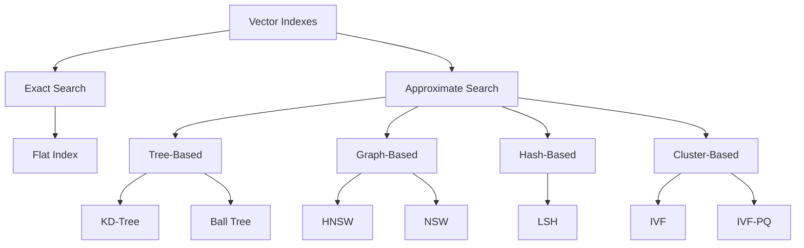
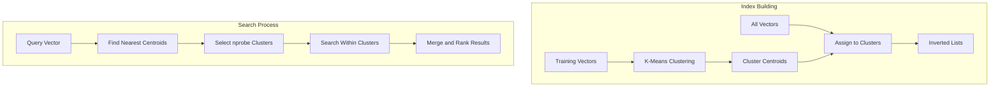
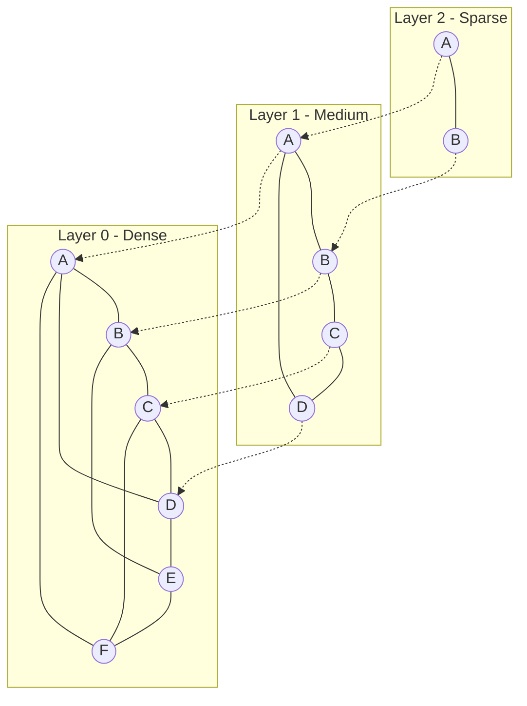
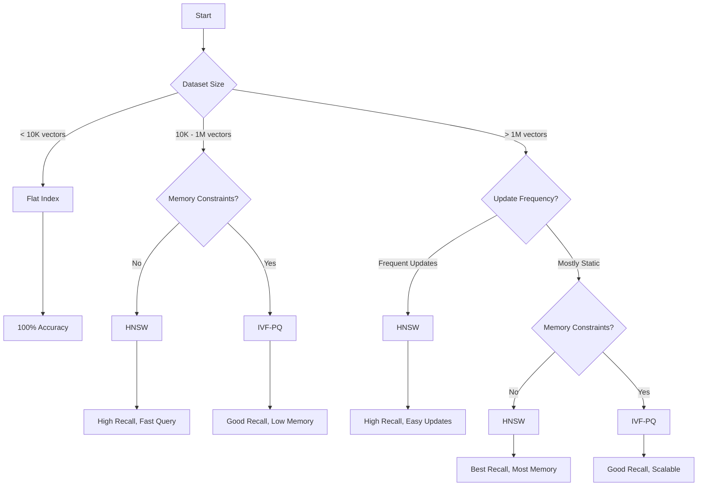

# How to Implement Vector Indexing

Author: [nawazdhandala](https://github.com/nawazdhandala)

Tags: Vector Database, RAG, Similarity Search, AI

Description: Learn how to implement vector indexing with HNSW, IVF, and other algorithms.

---

Vector indexing is the backbone of modern similarity search systems. Whether you are building a recommendation engine, a semantic search application, or a Retrieval Augmented Generation (RAG) pipeline, understanding how to implement and choose the right vector index is critical for performance. In this guide, we will explore the most popular indexing algorithms, their trade-offs, and practical implementations using industry-standard tools.

## What is Vector Indexing?

Vector indexing is a technique for organizing high-dimensional vectors (embeddings) so that nearest neighbor queries can be executed efficiently. Without an index, finding similar vectors requires comparing a query against every vector in the dataset, which becomes prohibitively slow as data grows.

```mermaid
flowchart LR
    A[Query Vector] --> B[Vector Index]
    B --> C[Candidate Selection]
    C --> D[Distance Calculation]
    D --> E[Top-K Results]

    subgraph "Without Index"
        F[Query] --> G[Scan All Vectors]
        G --> H[O(n) Comparisons]
    end

    subgraph "With Index"
        I[Query] --> J[Index Lookup]
        J --> K[O(log n) or O(1)]
    end
```

## Distance Metrics

Before diving into indexing algorithms, let us understand the common distance metrics used in similarity search.

```python
import numpy as np

def euclidean_distance(a: np.ndarray, b: np.ndarray) -> float:
    """
    Calculate L2 (Euclidean) distance between two vectors.
    Smaller values indicate more similar vectors.
    """
    return np.sqrt(np.sum((a - b) ** 2))

def cosine_similarity(a: np.ndarray, b: np.ndarray) -> float:
    """
    Calculate cosine similarity between two vectors.
    Returns value between -1 and 1, where 1 means identical direction.
    """
    dot_product = np.dot(a, b)
    norm_a = np.linalg.norm(a)
    norm_b = np.linalg.norm(b)
    return dot_product / (norm_a * norm_b)

def inner_product(a: np.ndarray, b: np.ndarray) -> float:
    """
    Calculate inner (dot) product between two vectors.
    Higher values indicate more similar vectors (for normalized vectors).
    """
    return np.dot(a, b)

# Example usage
vec1 = np.array([1.0, 2.0, 3.0])
vec2 = np.array([1.0, 2.0, 3.5])

print(f"Euclidean Distance: {euclidean_distance(vec1, vec2):.4f}")
print(f"Cosine Similarity: {cosine_similarity(vec1, vec2):.4f}")
print(f"Inner Product: {inner_product(vec1, vec2):.4f}")
```

## Index Types Overview



## 1. Flat Index (Brute Force)

The flat index is the simplest approach where all vectors are stored without any special organization. It provides exact results but scales poorly.

### When to Use Flat Index

- Dataset has fewer than 10,000 vectors
- 100% accuracy is required
- Vectors are frequently updated
- Query latency is not critical

### Implementation with FAISS

```python
import numpy as np
import faiss

# Configuration
DIMENSION = 128      # Vector dimensionality
NUM_VECTORS = 10000  # Number of vectors to index

# Generate random vectors for demonstration
# In practice, these would be embeddings from a model
np.random.seed(42)
vectors = np.random.random((NUM_VECTORS, DIMENSION)).astype('float32')

# Create a flat index using L2 (Euclidean) distance
# IndexFlatL2 performs exact nearest neighbor search
index = faiss.IndexFlatL2(DIMENSION)

# Add vectors to the index
# Note: Flat index does not require training
index.add(vectors)

print(f"Index contains {index.ntotal} vectors")

# Create a query vector
query = np.random.random((1, DIMENSION)).astype('float32')

# Search for the 5 nearest neighbors
k = 5
distances, indices = index.search(query, k)

print(f"Nearest neighbor indices: {indices[0]}")
print(f"Distances: {distances[0]}")
```

### Flat Index with Cosine Similarity

```python
import faiss
import numpy as np

DIMENSION = 128
NUM_VECTORS = 10000

# Generate and normalize vectors for cosine similarity
vectors = np.random.random((NUM_VECTORS, DIMENSION)).astype('float32')

# Normalize vectors to unit length
# After normalization, inner product equals cosine similarity
faiss.normalize_L2(vectors)

# Use IndexFlatIP (Inner Product) for cosine similarity
index = faiss.IndexFlatIP(DIMENSION)
index.add(vectors)

# Query must also be normalized
query = np.random.random((1, DIMENSION)).astype('float32')
faiss.normalize_L2(query)

# Search returns cosine similarities (higher is better)
similarities, indices = index.search(query, 5)
print(f"Most similar indices: {indices[0]}")
print(f"Cosine similarities: {similarities[0]}")
```

## 2. IVF (Inverted File Index)

IVF is a cluster-based approach that partitions the vector space into cells using k-means clustering. During search, only a subset of cells are examined, dramatically reducing computation.



### IVF Parameters

| Parameter | Description | Impact |
|-----------|-------------|--------|
| nlist | Number of clusters (cells) | Higher = smaller clusters, more precision |
| nprobe | Number of clusters to search | Higher = better recall, slower search |

### Implementation with FAISS

```python
import numpy as np
import faiss

DIMENSION = 128
NUM_VECTORS = 100000
NLIST = 100  # Number of clusters

# Generate training and database vectors
np.random.seed(42)
vectors = np.random.random((NUM_VECTORS, DIMENSION)).astype('float32')

# Create IVF index with L2 distance
# The quantizer determines how vectors are assigned to clusters
quantizer = faiss.IndexFlatL2(DIMENSION)
index = faiss.IndexIVFFlat(quantizer, DIMENSION, NLIST)

# IVF requires training on a representative sample
# Training learns the cluster centroids
print("Training index...")
index.train(vectors)

# Add vectors to the index
print("Adding vectors...")
index.add(vectors)

print(f"Index trained: {index.is_trained}")
print(f"Index contains {index.ntotal} vectors")

# Configure search parameters
# nprobe controls the accuracy-speed tradeoff
index.nprobe = 10  # Search 10 out of 100 clusters

# Perform search
query = np.random.random((1, DIMENSION)).astype('float32')
distances, indices = index.search(query, 5)

print(f"Results with nprobe=10: {indices[0]}")

# Increase nprobe for better accuracy
index.nprobe = 50
distances, indices = index.search(query, 5)
print(f"Results with nprobe=50: {indices[0]}")
```

### IVF with Product Quantization (IVF-PQ)

Product Quantization compresses vectors to reduce memory usage while maintaining search quality.

```python
import numpy as np
import faiss

DIMENSION = 128
NUM_VECTORS = 1000000
NLIST = 1000
M = 16        # Number of sub-quantizers
NBITS = 8     # Bits per sub-quantizer (256 centroids each)

vectors = np.random.random((NUM_VECTORS, DIMENSION)).astype('float32')

# Create IVF-PQ index
# This combines IVF clustering with PQ compression
quantizer = faiss.IndexFlatL2(DIMENSION)
index = faiss.IndexIVFPQ(quantizer, DIMENSION, NLIST, M, NBITS)

# Train the index (learns both cluster centroids and PQ codebooks)
print("Training IVF-PQ index...")
index.train(vectors)

# Add vectors (stored in compressed form)
print("Adding vectors...")
index.add(vectors)

# Calculate memory savings
# Original: NUM_VECTORS * DIMENSION * 4 bytes
# Compressed: NUM_VECTORS * M bytes (approximately)
original_size = NUM_VECTORS * DIMENSION * 4 / (1024 * 1024)
compressed_size = NUM_VECTORS * M / (1024 * 1024)

print(f"Original size: {original_size:.2f} MB")
print(f"Compressed size: {compressed_size:.2f} MB")
print(f"Compression ratio: {original_size / compressed_size:.1f}x")

# Search
index.nprobe = 50
query = np.random.random((1, DIMENSION)).astype('float32')
distances, indices = index.search(query, 5)
print(f"Top 5 results: {indices[0]}")
```

## 3. HNSW (Hierarchical Navigable Small World)

HNSW is a graph-based index that builds a multi-layer graph structure. It provides excellent query performance with high recall, making it the go-to choice for many production systems.



### HNSW Parameters

| Parameter | Description | Typical Values |
|-----------|-------------|----------------|
| M | Max connections per node | 16-64 |
| efConstruction | Build-time search depth | 100-500 |
| efSearch | Query-time search depth | 50-200 |

### Implementation with FAISS

```python
import numpy as np
import faiss

DIMENSION = 128
NUM_VECTORS = 100000

# HNSW parameters
M = 32               # Number of connections per node
EF_CONSTRUCTION = 200  # Controls index quality during build
EF_SEARCH = 64       # Controls recall during search

vectors = np.random.random((NUM_VECTORS, DIMENSION)).astype('float32')

# Create HNSW index
# HNSW uses a flat storage for the vectors
index = faiss.IndexHNSWFlat(DIMENSION, M)

# Set construction-time parameter
# Higher values create a better graph but take longer to build
index.hnsw.efConstruction = EF_CONSTRUCTION

# Add vectors (builds the graph incrementally)
print("Building HNSW index...")
index.add(vectors)

# Set search-time parameter
# Higher values improve recall at the cost of speed
index.hnsw.efSearch = EF_SEARCH

# Perform search
query = np.random.random((1, DIMENSION)).astype('float32')
distances, indices = index.search(query, 5)

print(f"Top 5 results: {indices[0]}")
print(f"Distances: {distances[0]}")

# Experiment with different efSearch values
for ef in [16, 32, 64, 128, 256]:
    index.hnsw.efSearch = ef
    distances, indices = index.search(query, 10)
    print(f"efSearch={ef}: found indices {indices[0][:3]}...")
```

### HNSW with hnswlib Library

```python
import hnswlib
import numpy as np

DIMENSION = 128
NUM_VECTORS = 100000

# Initialize the index
# 'l2' for Euclidean, 'ip' for inner product, 'cosine' for cosine similarity
index = hnswlib.Index(space='l2', dim=DIMENSION)

# Initialize index parameters
# max_elements: maximum number of vectors
# ef_construction: controls index quality
# M: number of bi-directional links per element
index.init_index(
    max_elements=NUM_VECTORS,
    ef_construction=200,
    M=16
)

# Generate and add vectors
vectors = np.random.random((NUM_VECTORS, DIMENSION)).astype('float32')
ids = np.arange(NUM_VECTORS)

# Add vectors with their IDs
print("Adding vectors to HNSW index...")
index.add_items(vectors, ids)

# Set query-time parameter
index.set_ef(64)

# Query the index
query = np.random.random((1, DIMENSION)).astype('float32')
labels, distances = index.knn_query(query, k=5)

print(f"Nearest neighbors: {labels[0]}")
print(f"Distances: {distances[0]}")

# Save and load index
index.save_index("hnsw_index.bin")

# Load index
new_index = hnswlib.Index(space='l2', dim=DIMENSION)
new_index.load_index("hnsw_index.bin")
```

## 4. Using Vector Databases

### Pinecone

Pinecone is a managed vector database that handles infrastructure and scaling automatically.

```python
from pinecone import Pinecone, ServerlessSpec
import numpy as np

# Initialize the Pinecone client
pc = Pinecone(api_key="your-api-key")

# Create an index
INDEX_NAME = "semantic-search"
DIMENSION = 1536  # OpenAI embedding dimension

# Check if index exists, create if not
if INDEX_NAME not in pc.list_indexes().names():
    pc.create_index(
        name=INDEX_NAME,
        dimension=DIMENSION,
        metric="cosine",  # Options: cosine, euclidean, dotproduct
        spec=ServerlessSpec(
            cloud="aws",
            region="us-east-1"
        )
    )

# Connect to the index
index = pc.Index(INDEX_NAME)

# Prepare vectors for upsert
# Each vector needs: id, values, and optional metadata
vectors_to_upsert = [
    {
        "id": "doc-1",
        "values": np.random.random(DIMENSION).tolist(),
        "metadata": {
            "title": "Introduction to Vector Databases",
            "category": "tutorial",
            "word_count": 1500
        }
    },
    {
        "id": "doc-2",
        "values": np.random.random(DIMENSION).tolist(),
        "metadata": {
            "title": "Advanced HNSW Techniques",
            "category": "deep-dive",
            "word_count": 3000
        }
    }
]

# Upsert vectors (insert or update)
index.upsert(vectors=vectors_to_upsert)

# Query with metadata filtering
query_vector = np.random.random(DIMENSION).tolist()

results = index.query(
    vector=query_vector,
    top_k=5,
    include_metadata=True,
    filter={
        "category": {"$eq": "tutorial"},
        "word_count": {"$gte": 1000}
    }
)

# Process results
for match in results["matches"]:
    print(f"ID: {match['id']}")
    print(f"Score: {match['score']:.4f}")
    print(f"Metadata: {match['metadata']}")
    print("---")

# Delete vectors
index.delete(ids=["doc-1", "doc-2"])

# Delete index when done
# pc.delete_index(INDEX_NAME)
```

### Weaviate

Weaviate is an open-source vector database with built-in vectorization modules.

```python
import weaviate
from weaviate.classes.config import Configure, Property, DataType
from weaviate.classes.query import MetadataQuery
import numpy as np

# Connect to Weaviate (local instance)
client = weaviate.connect_to_local()

# Or connect to Weaviate Cloud
# client = weaviate.connect_to_weaviate_cloud(
#     cluster_url="your-cluster-url",
#     auth_credentials=weaviate.auth.AuthApiKey("your-api-key")
# )

# Define a collection (schema)
collection_name = "Document"

# Delete if exists (for demo purposes)
if client.collections.exists(collection_name):
    client.collections.delete(collection_name)

# Create collection with HNSW configuration
collection = client.collections.create(
    name=collection_name,
    vectorizer_config=Configure.Vectorizer.none(),  # We provide our own vectors
    vector_index_config=Configure.VectorIndex.hnsw(
        distance_metric=Configure.VectorDistances.COSINE,
        ef_construction=128,
        max_connections=64,
        ef=64
    ),
    properties=[
        Property(name="title", data_type=DataType.TEXT),
        Property(name="content", data_type=DataType.TEXT),
        Property(name="category", data_type=DataType.TEXT),
    ]
)

# Insert documents with vectors
documents = [
    {
        "title": "Getting Started with Vector Search",
        "content": "Vector search enables semantic similarity...",
        "category": "tutorial",
        "vector": np.random.random(384).tolist()
    },
    {
        "title": "Production Vector Databases",
        "content": "Scaling vector search in production...",
        "category": "advanced",
        "vector": np.random.random(384).tolist()
    }
]

# Batch insert
with collection.batch.dynamic() as batch:
    for doc in documents:
        vector = doc.pop("vector")
        batch.add_object(
            properties=doc,
            vector=vector
        )

# Vector similarity search
query_vector = np.random.random(384).tolist()

results = collection.query.near_vector(
    near_vector=query_vector,
    limit=5,
    return_metadata=MetadataQuery(distance=True)
)

for obj in results.objects:
    print(f"Title: {obj.properties['title']}")
    print(f"Distance: {obj.metadata.distance:.4f}")
    print("---")

# Hybrid search (vector + keyword)
results = collection.query.hybrid(
    query="vector database production",
    vector=query_vector,
    alpha=0.5,  # Balance between vector and keyword search
    limit=5
)

# Filtered search
results = collection.query.near_vector(
    near_vector=query_vector,
    limit=5,
    filters=weaviate.classes.query.Filter.by_property("category").equal("tutorial")
)

# Close connection
client.close()
```

### pgvector (PostgreSQL Extension)

pgvector brings vector similarity search to PostgreSQL, allowing you to combine vector search with traditional SQL queries.

```python
import psycopg2
import numpy as np
from psycopg2.extras import execute_values

# Connect to PostgreSQL
conn = psycopg2.connect(
    host="localhost",
    database="vectordb",
    user="postgres",
    password="password"
)
cur = conn.cursor()

# Enable pgvector extension
cur.execute("CREATE EXTENSION IF NOT EXISTS vector")

# Create table with vector column
cur.execute("""
    CREATE TABLE IF NOT EXISTS documents (
        id SERIAL PRIMARY KEY,
        title TEXT NOT NULL,
        content TEXT,
        category TEXT,
        embedding vector(384),  -- 384-dimensional vectors
        created_at TIMESTAMP DEFAULT CURRENT_TIMESTAMP
    )
""")

# Create HNSW index for fast similarity search
# m: max connections, ef_construction: build-time search depth
cur.execute("""
    CREATE INDEX IF NOT EXISTS documents_embedding_idx
    ON documents
    USING hnsw (embedding vector_cosine_ops)
    WITH (m = 16, ef_construction = 64)
""")

conn.commit()

# Insert documents with embeddings
documents = [
    ("Vector Search Guide", "How to implement...", "tutorial", np.random.random(384).tolist()),
    ("Database Scaling", "Production tips...", "advanced", np.random.random(384).tolist()),
    ("ML Pipelines", "Building robust...", "tutorial", np.random.random(384).tolist()),
]

# Use execute_values for efficient batch insert
execute_values(
    cur,
    """
    INSERT INTO documents (title, content, category, embedding)
    VALUES %s
    """,
    documents,
    template="(%s, %s, %s, %s::vector)"
)
conn.commit()

# Vector similarity search using cosine distance
query_vector = np.random.random(384).tolist()

cur.execute("""
    SELECT
        id,
        title,
        category,
        1 - (embedding <=> %s::vector) as similarity
    FROM documents
    ORDER BY embedding <=> %s::vector
    LIMIT 5
""", (query_vector, query_vector))

print("Similarity search results:")
for row in cur.fetchall():
    print(f"ID: {row[0]}, Title: {row[1]}, Similarity: {row[3]:.4f}")

# Combined vector and SQL filtering
cur.execute("""
    SELECT
        id,
        title,
        1 - (embedding <=> %s::vector) as similarity
    FROM documents
    WHERE category = %s
    AND created_at > NOW() - INTERVAL '7 days'
    ORDER BY embedding <=> %s::vector
    LIMIT 5
""", (query_vector, "tutorial", query_vector))

print("\nFiltered search results:")
for row in cur.fetchall():
    print(f"ID: {row[0]}, Title: {row[1]}, Similarity: {row[2]:.4f}")

# Using different distance metrics
# <-> : L2 distance (Euclidean)
# <=> : Cosine distance
# <#> : Inner product (negative, for max inner product search)

# L2 distance search
cur.execute("""
    SELECT id, title, embedding <-> %s::vector as l2_distance
    FROM documents
    ORDER BY embedding <-> %s::vector
    LIMIT 5
""", (query_vector, query_vector))

# Set ef_search for query-time accuracy tuning
cur.execute("SET hnsw.ef_search = 100")

# IVFFlat index alternative (for larger datasets)
cur.execute("""
    CREATE INDEX IF NOT EXISTS documents_embedding_ivf_idx
    ON documents
    USING ivfflat (embedding vector_cosine_ops)
    WITH (lists = 100)
""")

# Set probes for IVFFlat search
cur.execute("SET ivfflat.probes = 10")

cur.close()
conn.close()
```

## Index Selection Guide

Choosing the right index depends on your specific requirements.



## Performance Comparison

| Index Type | Build Time | Query Time | Memory | Recall | Update Support |
|------------|------------|------------|--------|--------|----------------|
| Flat | O(1) | O(n) | High | 100% | Excellent |
| IVF | O(n) | O(n/k) | Medium | 95-99% | Moderate |
| IVF-PQ | O(n) | O(n/k) | Low | 90-95% | Moderate |
| HNSW | O(n log n) | O(log n) | High | 98-99% | Good |

## Best Practices

### 1. Normalize Vectors for Cosine Similarity

```python
import numpy as np

def normalize_vectors(vectors: np.ndarray) -> np.ndarray:
    """
    Normalize vectors to unit length for cosine similarity.
    This allows using inner product for faster computation.
    """
    norms = np.linalg.norm(vectors, axis=1, keepdims=True)
    # Avoid division by zero
    norms = np.where(norms == 0, 1, norms)
    return vectors / norms

# Example
vectors = np.random.random((1000, 128)).astype('float32')
normalized = normalize_vectors(vectors)

# Verify normalization
print(f"Norms after normalization: {np.linalg.norm(normalized, axis=1)[:5]}")
```

### 2. Batch Operations for Better Performance

```python
import faiss
import numpy as np

index = faiss.IndexFlatL2(128)
vectors = np.random.random((100000, 128)).astype('float32')

# Bad: Adding vectors one at a time
# for v in vectors:
#     index.add(v.reshape(1, -1))

# Good: Adding vectors in batches
BATCH_SIZE = 10000
for i in range(0, len(vectors), BATCH_SIZE):
    batch = vectors[i:i + BATCH_SIZE]
    index.add(batch)
    print(f"Added batch {i // BATCH_SIZE + 1}")

# Same applies to queries
queries = np.random.random((100, 128)).astype('float32')

# Search all queries at once
distances, indices = index.search(queries, k=10)
```

### 3. Monitor and Tune Index Parameters

```python
import time
import numpy as np
import faiss

def benchmark_index(index, queries, k=10, num_runs=5):
    """
    Benchmark index query performance.
    Returns average query time and recall estimation.
    """
    times = []

    for _ in range(num_runs):
        start = time.time()
        distances, indices = index.search(queries, k)
        times.append(time.time() - start)

    avg_time = np.mean(times)
    qps = len(queries) / avg_time

    return {
        "avg_query_time_ms": avg_time * 1000,
        "queries_per_second": qps,
        "total_queries": len(queries)
    }

# Example: Tuning HNSW efSearch
index = faiss.IndexHNSWFlat(128, 32)
vectors = np.random.random((100000, 128)).astype('float32')
index.add(vectors)

queries = np.random.random((1000, 128)).astype('float32')

print("HNSW Performance Tuning:")
print("-" * 50)

for ef in [16, 32, 64, 128, 256]:
    index.hnsw.efSearch = ef
    results = benchmark_index(index, queries)
    print(f"efSearch={ef:3d}: {results['queries_per_second']:.0f} QPS, "
          f"{results['avg_query_time_ms']:.2f}ms avg")
```

## Conclusion

Vector indexing is essential for building scalable similarity search systems. Here are the key takeaways:

1. **Start Simple**: Begin with a flat index for small datasets or prototyping. Only add complexity when needed.

2. **HNSW for Most Use Cases**: HNSW offers the best balance of speed, accuracy, and ease of use for most production systems.

3. **IVF-PQ for Memory Constraints**: When memory is limited or you have billions of vectors, IVF-PQ provides excellent compression.

4. **Use Managed Services for Production**: Pinecone, Weaviate, and pgvector handle operational complexity and let you focus on your application.

5. **Tune Parameters**: The right parameter settings can dramatically improve performance. Always benchmark with your actual data.

6. **Consider Your Update Pattern**: If you need frequent updates, choose an index that supports incremental changes (HNSW or flat).

By understanding these indexing algorithms and their trade-offs, you can build vector search systems that scale from thousands to billions of vectors while maintaining fast query times and high recall.
