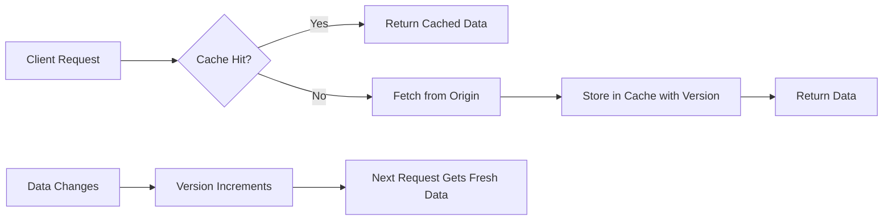
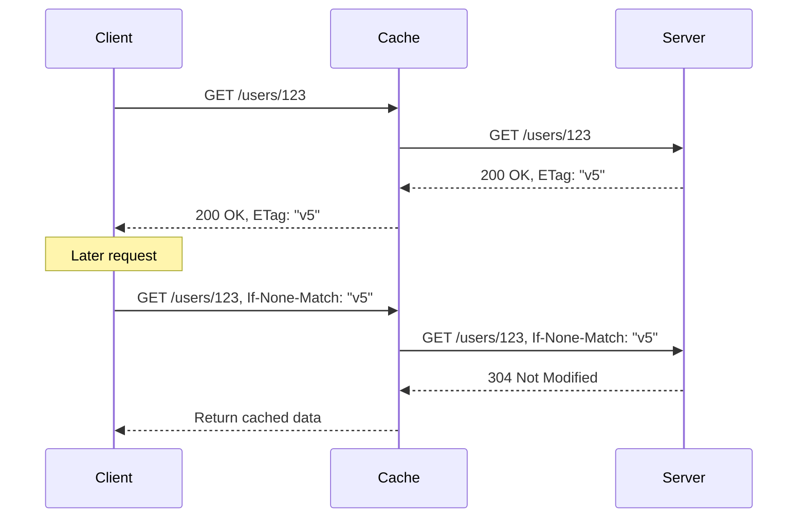
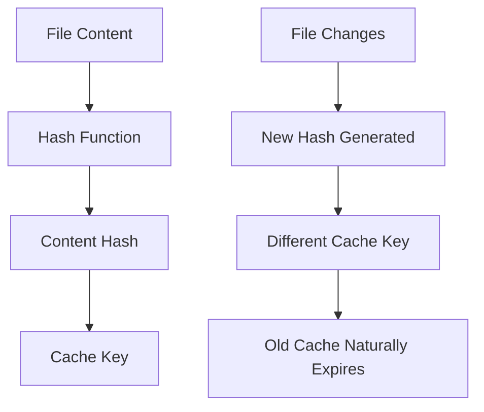
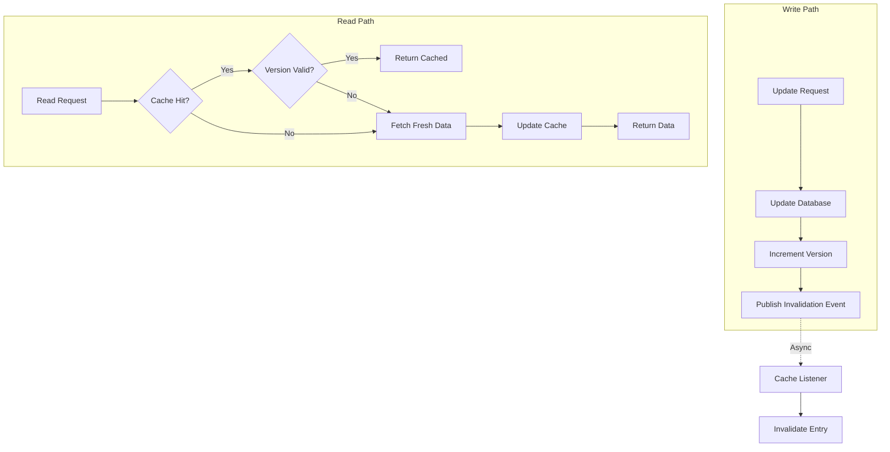

# How to Build Version-Based Invalidation

Author: [nawazdhandala](https://github.com/nawazdhandala)

Tags: Caching, Versioning, Invalidation, ETags

Description: Learn to build version-based cache invalidation using ETags and version numbers.

---

Cache invalidation is one of the hardest problems in computer science. When data changes, how do you ensure clients receive fresh content without sacrificing performance? Version-based invalidation solves this by associating a version identifier with each cached resource. When the resource changes, the version changes, and clients know to fetch the updated content.

## The Cache Invalidation Problem

Traditional time-based caching (TTL) forces a tradeoff: short TTLs mean frequent cache misses, while long TTLs risk serving stale data. Version-based invalidation eliminates this tradeoff entirely.



The key insight is that versions act as fingerprints. If the version matches, the data has not changed. If it differs, the cache is stale.

## Common Versioning Strategies

Different strategies suit different use cases. Here is a comparison of the main approaches.

| Strategy | Best For | Pros | Cons |
|----------|----------|------|------|
| ETags | HTTP responses, REST APIs | Standard protocol support | Requires server validation |
| Version Numbers | Database records, API resources | Simple to implement | Must track version separately |
| Content Hashes | Static assets, file content | Self-validating | Computation overhead |
| Timestamps | Time-sensitive data | Human readable | Clock sync issues |

## Implementing ETags

ETags (Entity Tags) are the HTTP standard for version-based validation. The server generates a unique identifier for each resource version and includes it in the response.



This Node.js implementation shows how to generate and validate ETags on the server side.

```javascript
const crypto = require('crypto');

// Generate ETag from content
function generateETag(content) {
  // Create hash from content
  const hash = crypto
    .createHash('md5')
    .update(JSON.stringify(content))
    .digest('hex');

  return `"${hash}"`;
}

// Express middleware for ETag handling
function etagMiddleware(req, res, next) {
  // Store original json method
  const originalJson = res.json.bind(res);

  res.json = function(data) {
    // Generate ETag for response data
    const etag = generateETag(data);

    // Set ETag header
    res.setHeader('ETag', etag);

    // Check If-None-Match header from client
    const clientETag = req.headers['if-none-match'];

    if (clientETag === etag) {
      // Content unchanged, return 304
      return res.status(304).end();
    }

    // Content changed, send full response
    return originalJson(data);
  };

  next();
}

// Usage in Express app
app.use(etagMiddleware);

app.get('/api/users/:id', async (req, res) => {
  const user = await db.users.findById(req.params.id);
  res.json(user);
});
```

For database-backed resources, you can use the record's version or timestamp directly.

```javascript
app.get('/api/products/:id', async (req, res) => {
  const product = await db.products.findById(req.params.id);

  // Use database version field for ETag
  const etag = `"${product.version}"`;
  res.setHeader('ETag', etag);

  // Check client's cached version
  if (req.headers['if-none-match'] === etag) {
    return res.status(304).end();
  }

  res.json(product);
});
```

## Version Numbers in Database Records

For applications managing their own cache, version numbers provide fine-grained control. Each record maintains a version that increments on every update.

This SQL schema includes versioning for cache invalidation.

```sql
CREATE TABLE products (
  id SERIAL PRIMARY KEY,
  name VARCHAR(255) NOT NULL,
  price DECIMAL(10, 2) NOT NULL,
  version INTEGER DEFAULT 1,
  updated_at TIMESTAMP DEFAULT CURRENT_TIMESTAMP
);

-- Trigger to auto-increment version on update
CREATE OR REPLACE FUNCTION increment_version()
RETURNS TRIGGER AS $$
BEGIN
  NEW.version = OLD.version + 1;
  NEW.updated_at = CURRENT_TIMESTAMP;
  RETURN NEW;
END;
$$ LANGUAGE plpgsql;

CREATE TRIGGER product_version_trigger
BEFORE UPDATE ON products
FOR EACH ROW EXECUTE FUNCTION increment_version();
```

The application layer uses versions to manage cache validity.

```javascript
class VersionedCache {
  constructor() {
    this.cache = new Map();
  }

  // Store item with its version
  set(key, value, version) {
    this.cache.set(key, {
      data: value,
      version: version,
      cachedAt: Date.now()
    });
  }

  // Get item if version matches
  get(key, currentVersion) {
    const entry = this.cache.get(key);

    if (!entry) {
      return { hit: false, data: null };
    }

    // Version mismatch means stale cache
    if (entry.version !== currentVersion) {
      this.cache.delete(key);
      return { hit: false, data: null, staleVersion: entry.version };
    }

    return { hit: true, data: entry.data };
  }

  // Invalidate specific key
  invalidate(key) {
    this.cache.delete(key);
  }
}

// Usage with database
const cache = new VersionedCache();

async function getProduct(productId) {
  // First check current version in database
  const versionResult = await db.query(
    'SELECT version FROM products WHERE id = $1',
    [productId]
  );

  const currentVersion = versionResult.rows[0]?.version;

  // Check cache with version
  const cached = cache.get(`product:${productId}`, currentVersion);

  if (cached.hit) {
    return cached.data;
  }

  // Cache miss or stale, fetch full record
  const product = await db.query(
    'SELECT * FROM products WHERE id = $1',
    [productId]
  );

  // Store with version for future requests
  cache.set(`product:${productId}`, product.rows[0], currentVersion);

  return product.rows[0];
}
```

## Content-Based Hashing

For static assets and files, content hashes ensure cache correctness without maintaining separate version state. The hash serves as both identifier and validator.



This implementation shows content-addressed caching for file assets.

```javascript
const crypto = require('crypto');
const fs = require('fs').promises;

class ContentAddressedCache {
  constructor(cacheDir) {
    this.cacheDir = cacheDir;
    this.manifest = new Map();
  }

  // Generate hash from file content
  async hashFile(filePath) {
    const content = await fs.readFile(filePath);
    return crypto
      .createHash('sha256')
      .update(content)
      .digest('hex')
      .substring(0, 16);
  }

  // Get versioned URL for asset
  async getVersionedPath(originalPath) {
    const hash = await this.hashFile(originalPath);
    const ext = originalPath.split('.').pop();
    const baseName = originalPath.replace(`.${ext}`, '');

    // Include hash in filename
    const versionedPath = `${baseName}.${hash}.${ext}`;

    // Store mapping for reverse lookup
    this.manifest.set(originalPath, versionedPath);

    return versionedPath;
  }

  // Build manifest for all assets
  async buildManifest(assetPaths) {
    const manifest = {};

    for (const path of assetPaths) {
      manifest[path] = await this.getVersionedPath(path);
    }

    return manifest;
  }
}

// Usage in build process
const cache = new ContentAddressedCache('./dist');
const manifest = await cache.buildManifest([
  './src/styles/main.css',
  './src/scripts/app.js',
  './src/images/logo.png'
]);

// Output: { './src/styles/main.css': './src/styles/main.a1b2c3d4.css', ... }
```

## Cache Invalidation Patterns

Version-based invalidation integrates with different cache architectures. Here are common patterns.



This pattern implements event-driven cache invalidation.

```javascript
const EventEmitter = require('events');

class CacheInvalidator extends EventEmitter {
  constructor(cache) {
    super();
    this.cache = cache;
    this.versionStore = new Map();
  }

  // Track entity versions
  setVersion(entityType, entityId, version) {
    const key = `${entityType}:${entityId}`;
    const oldVersion = this.versionStore.get(key);

    this.versionStore.set(key, version);

    // Emit event if version changed
    if (oldVersion && oldVersion !== version) {
      this.emit('invalidate', { entityType, entityId, oldVersion, newVersion: version });
    }
  }

  // Check if cached data is current
  isValid(entityType, entityId, cachedVersion) {
    const key = `${entityType}:${entityId}`;
    const currentVersion = this.versionStore.get(key);

    return currentVersion === cachedVersion;
  }

  // Subscribe to invalidation events
  onInvalidate(callback) {
    this.on('invalidate', callback);
  }
}

// Usage
const invalidator = new CacheInvalidator(cache);

// Listen for invalidations
invalidator.onInvalidate(({ entityType, entityId }) => {
  const cacheKey = `${entityType}:${entityId}`;
  cache.delete(cacheKey);
  console.log(`Invalidated cache for ${cacheKey}`);
});

// When data is updated
async function updateProduct(productId, updates) {
  const result = await db.query(
    'UPDATE products SET name = $1, price = $2 WHERE id = $3 RETURNING version',
    [updates.name, updates.price, productId]
  );

  // Trigger invalidation
  invalidator.setVersion('product', productId, result.rows[0].version);

  return result.rows[0];
}
```

## Client-Side Implementation

Browsers and HTTP clients need proper handling of version headers for cache efficiency.

```javascript
class VersionedApiClient {
  constructor(baseUrl) {
    this.baseUrl = baseUrl;
    this.etagCache = new Map();
  }

  async fetch(endpoint, options = {}) {
    const url = `${this.baseUrl}${endpoint}`;
    const cachedETag = this.etagCache.get(url);

    // Include cached ETag in request
    const headers = {
      ...options.headers,
      ...(cachedETag && { 'If-None-Match': cachedETag.etag })
    };

    const response = await fetch(url, { ...options, headers });

    // Handle 304 Not Modified
    if (response.status === 304 && cachedETag) {
      return cachedETag.data;
    }

    // Store new ETag and data
    const etag = response.headers.get('ETag');
    const data = await response.json();

    if (etag) {
      this.etagCache.set(url, { etag, data });
    }

    return data;
  }

  // Clear cache for specific endpoint
  invalidate(endpoint) {
    const url = `${this.baseUrl}${endpoint}`;
    this.etagCache.delete(url);
  }
}

// Usage
const api = new VersionedApiClient('https://api.example.com');

// First request fetches full data
const product = await api.fetch('/products/123');

// Second request uses ETag, gets 304 if unchanged
const sameProduct = await api.fetch('/products/123');
```

## Summary

Version-based invalidation provides precise cache control without the staleness risks of TTL-based approaches.

| Approach | When to Use | Key Benefit |
|----------|-------------|-------------|
| ETags | HTTP APIs, REST endpoints | Protocol standard, proxy support |
| Version Numbers | Database records, mutable resources | Simple increment logic |
| Content Hashes | Static assets, immutable content | Self-validating, CDN friendly |
| Event-Driven | Distributed systems, microservices | Real-time invalidation |

Start with ETags for HTTP APIs since they work with existing infrastructure. For application-level caching, version numbers on database records give you direct control. Content hashing works best for build pipelines and static assets where file content determines identity. Combining these approaches gives you a robust caching strategy that keeps data fresh while maximizing performance.
