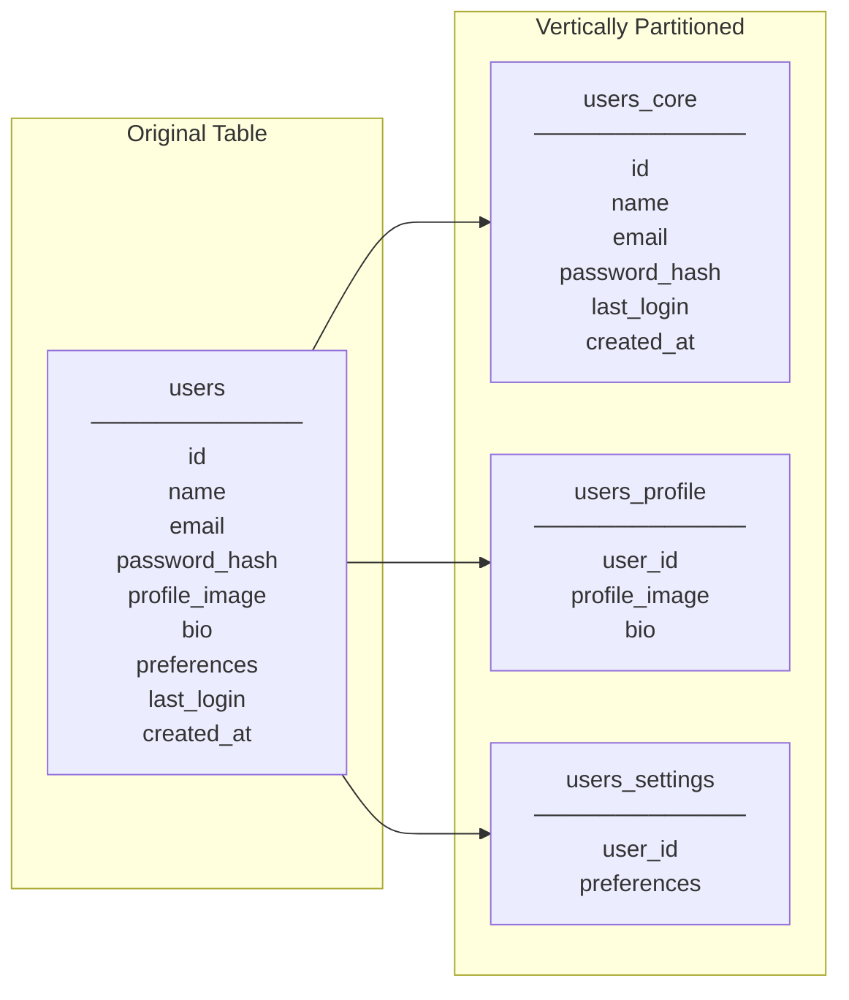
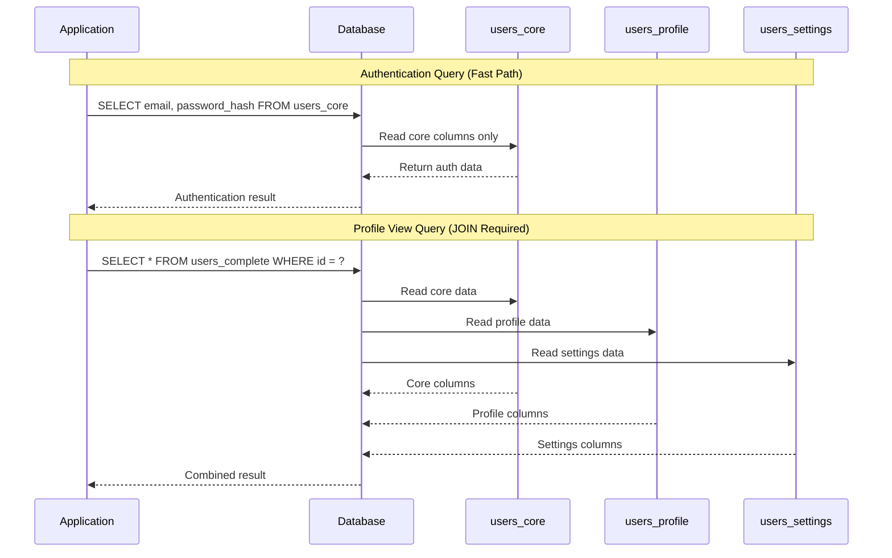

# How to Create Vertical Partitioning

Author: [nawazdhandala](https://github.com/nawazdhandala)

Tags: Database, Partitioning, Performance, Schema Design

Description: Learn to create vertical partitioning for splitting tables by columns to optimize storage and queries.

---

Vertical partitioning is a database design technique that splits a table into multiple tables by columns rather than rows. This approach helps optimize query performance, reduce I/O operations, and improve cache efficiency when dealing with wide tables that have columns with varying access patterns.

## What is Vertical Partitioning?

Unlike horizontal partitioning (which divides rows across tables), vertical partitioning separates columns into distinct tables. Each partition contains a subset of columns along with the primary key to maintain relationships between the partitions.

The following diagram illustrates how a single wide table transforms into multiple narrower tables through vertical partitioning.



## When to Use Vertical Partitioning

Vertical partitioning works best in specific scenarios. The table below outlines common use cases and their benefits.

| Scenario | Benefit |
|----------|---------|
| Wide tables with 50+ columns | Reduces row size and improves buffer pool efficiency |
| Mixed access patterns | Frequently accessed columns stay in cache |
| Large BLOB/TEXT columns | Keeps main table compact for faster scans |
| Security requirements | Isolates sensitive data in separate tables |
| Different update frequencies | Reduces lock contention on hot columns |

## Implementation Strategies

There are three primary approaches to implementing vertical partitioning, each with distinct trade-offs.

### Strategy 1: Physical Table Split

This approach creates separate physical tables and uses JOINs when you need data from multiple partitions. Start by identifying column groups based on access patterns.

The following SQL demonstrates splitting a wide users table into three focused tables.

```sql
-- Create the core users table with frequently accessed columns
CREATE TABLE users_core (
    id BIGINT PRIMARY KEY,
    name VARCHAR(100) NOT NULL,
    email VARCHAR(255) NOT NULL UNIQUE,
    password_hash VARCHAR(255) NOT NULL,
    last_login TIMESTAMP,
    created_at TIMESTAMP DEFAULT CURRENT_TIMESTAMP,
    INDEX idx_email (email),
    INDEX idx_last_login (last_login)
);

-- Create profile table for less frequently accessed data
CREATE TABLE users_profile (
    user_id BIGINT PRIMARY KEY,
    profile_image MEDIUMBLOB,
    bio TEXT,
    website VARCHAR(255),
    location VARCHAR(100),
    FOREIGN KEY (user_id) REFERENCES users_core(id) ON DELETE CASCADE
);

-- Create settings table for JSON preferences
CREATE TABLE users_settings (
    user_id BIGINT PRIMARY KEY,
    preferences JSON,
    notification_config JSON,
    privacy_settings JSON,
    FOREIGN KEY (user_id) REFERENCES users_core(id) ON DELETE CASCADE
);
```

### Strategy 2: Using Database Views

Database views provide a unified interface that hides the partitioning complexity from application code. This approach simplifies queries while maintaining the storage benefits.

```sql
-- Create a view that joins all partitions transparently
CREATE VIEW users_complete AS
SELECT
    c.id,
    c.name,
    c.email,
    c.password_hash,
    c.last_login,
    c.created_at,
    p.profile_image,
    p.bio,
    p.website,
    p.location,
    s.preferences,
    s.notification_config,
    s.privacy_settings
FROM users_core c
LEFT JOIN users_profile p ON c.id = p.user_id
LEFT JOIN users_settings s ON c.id = s.user_id;
```

### Strategy 3: Column-Family Approach (NoSQL)

For NoSQL databases like Cassandra or HBase, vertical partitioning maps naturally to the column-family concept. Each column family acts as a partition with its own storage characteristics.

```cql
-- Cassandra example using column families
CREATE TABLE users_by_auth (
    user_id UUID PRIMARY KEY,
    email TEXT,
    password_hash TEXT,
    last_login TIMESTAMP
) WITH compression = {'class': 'LZ4Compressor'};

CREATE TABLE users_by_profile (
    user_id UUID PRIMARY KEY,
    profile_image BLOB,
    bio TEXT,
    preferences MAP<TEXT, TEXT>
) WITH compression = {'class': 'DeflateCompressor'};
```

## Data Flow with Vertical Partitioning

The following diagram shows how queries interact with vertically partitioned tables. Notice how authentication queries only touch the core table while profile views require a JOIN operation.



## Practical Implementation in PostgreSQL

PostgreSQL offers table inheritance as a native mechanism for implementing vertical partitioning patterns. This example demonstrates a complete implementation with insert triggers.

```sql
-- Create base table with common columns
CREATE TABLE products_base (
    id SERIAL PRIMARY KEY,
    sku VARCHAR(50) NOT NULL UNIQUE,
    name VARCHAR(255) NOT NULL,
    price DECIMAL(10,2) NOT NULL,
    created_at TIMESTAMP DEFAULT NOW()
);

-- Create extension table for detailed product information
CREATE TABLE products_details (
    product_id INTEGER PRIMARY KEY REFERENCES products_base(id),
    description TEXT,
    specifications JSONB,
    weight_kg DECIMAL(8,3),
    dimensions JSONB
);

-- Create extension table for media assets
CREATE TABLE products_media (
    product_id INTEGER PRIMARY KEY REFERENCES products_base(id),
    thumbnail_url VARCHAR(500),
    images JSONB,
    videos JSONB
);

-- Function to insert across all partitions
CREATE OR REPLACE FUNCTION insert_product(
    p_sku VARCHAR,
    p_name VARCHAR,
    p_price DECIMAL,
    p_description TEXT DEFAULT NULL,
    p_specs JSONB DEFAULT NULL
) RETURNS INTEGER AS $$
DECLARE
    new_id INTEGER;
BEGIN
    -- Insert into base table and capture the new ID
    INSERT INTO products_base (sku, name, price)
    VALUES (p_sku, p_name, p_price)
    RETURNING id INTO new_id;

    -- Insert into details partition
    INSERT INTO products_details (product_id, description, specifications)
    VALUES (new_id, p_description, p_specs);

    -- Initialize media partition with empty record
    INSERT INTO products_media (product_id)
    VALUES (new_id);

    RETURN new_id;
END;
$$ LANGUAGE plpgsql;
```

## Performance Comparison

The following table compares query performance between a monolithic table and vertically partitioned tables based on benchmarks with 10 million rows.

| Query Type | Monolithic Table | Partitioned Tables | Improvement |
|------------|------------------|-------------------|-------------|
| Auth lookup | 45ms | 12ms | 73% faster |
| List names only | 890ms | 210ms | 76% faster |
| Full profile fetch | 35ms | 52ms | 48% slower |
| Update preferences | 28ms | 8ms | 71% faster |
| Bulk insert | 1200ms | 1450ms | 21% slower |

## Best Practices

Following these guidelines will help you implement vertical partitioning effectively.

**Group columns by access patterns.** Columns that are queried together should stay together. Analyze your query logs to identify these patterns before partitioning.

**Keep foreign keys on the primary key.** All partition tables should reference the same primary key from the base table. This ensures data integrity and simplifies JOIN operations.

**Consider write amplification.** Each partition adds overhead for inserts and updates that span multiple partitions. Batch operations when possible.

**Use covering indexes wisely.** Since partitioned tables are narrower, indexes become more efficient. A covering index on a narrow partition often fits entirely in memory.

**Monitor JOIN performance.** Regularly review query plans to ensure the database optimizer handles cross-partition JOINs efficiently. Add appropriate indexes if nested loops appear in explain output.

## Conclusion

Vertical partitioning offers significant performance benefits when tables have wide schemas with varied access patterns. By splitting columns into focused tables, you reduce I/O for targeted queries, improve cache utilization, and can apply different storage strategies to different data types. The trade-off is increased complexity for operations that need data from multiple partitions, so careful analysis of your access patterns is essential before implementing this technique.
