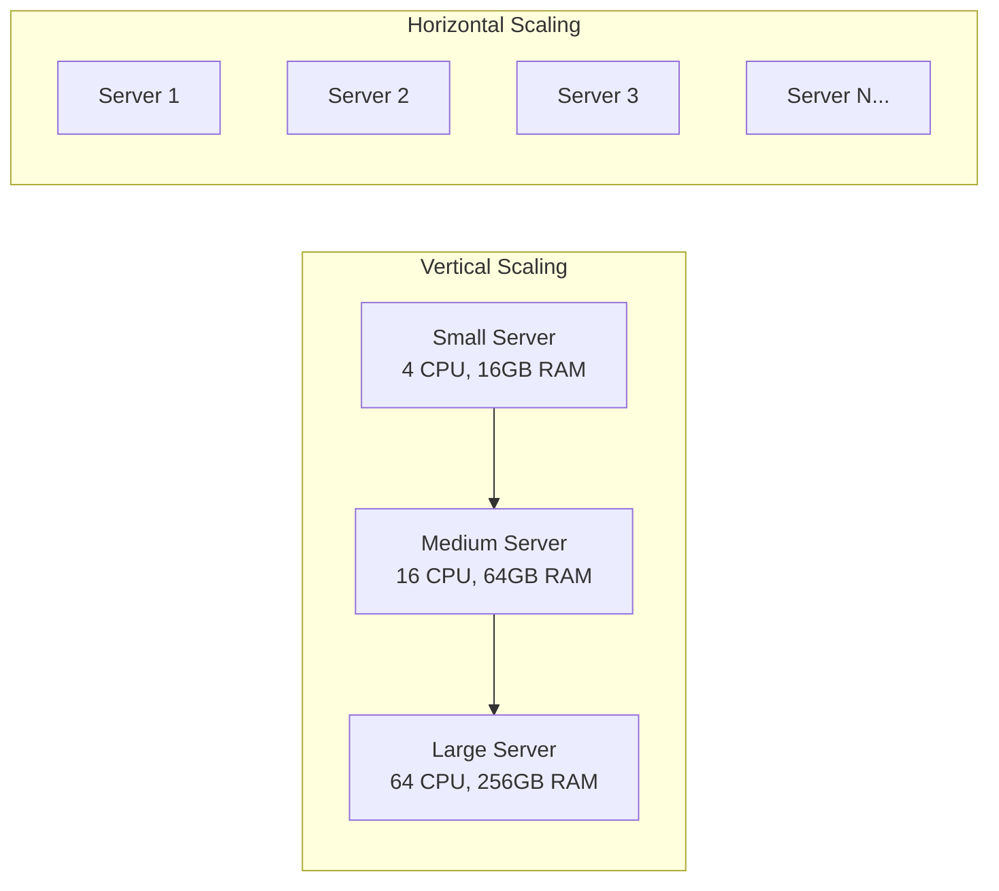
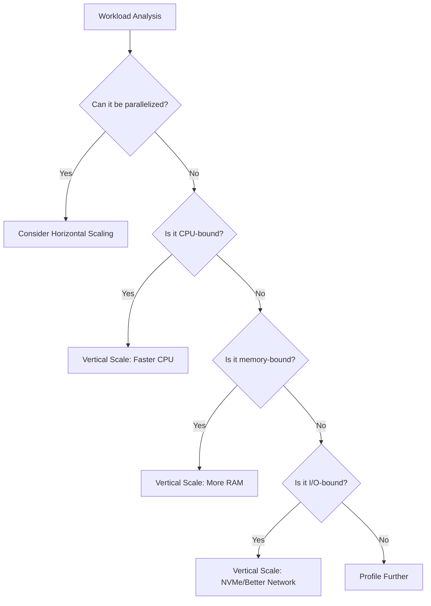
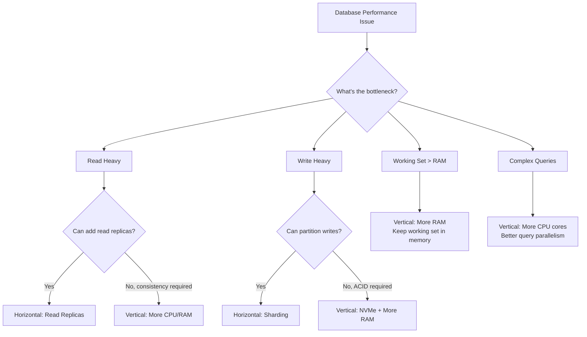
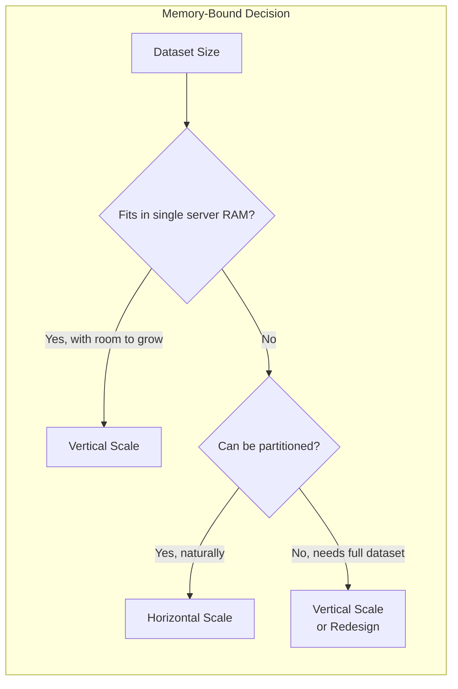
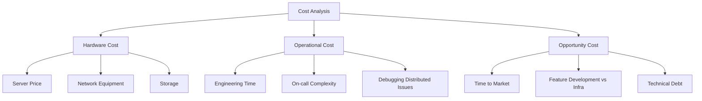
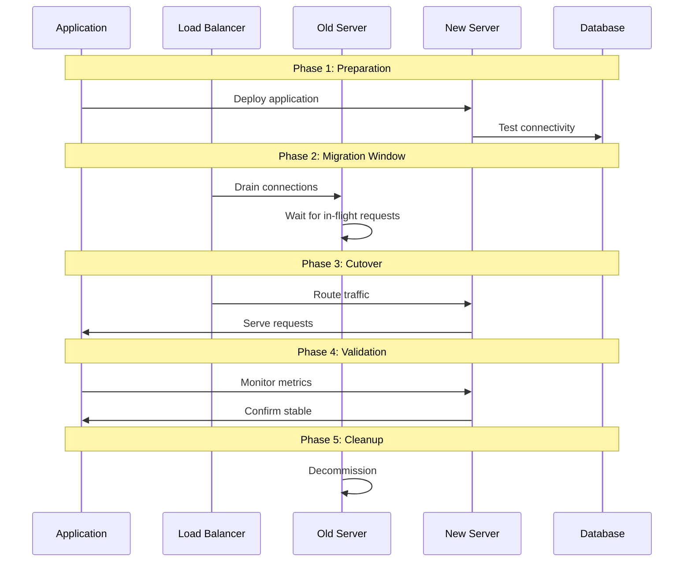
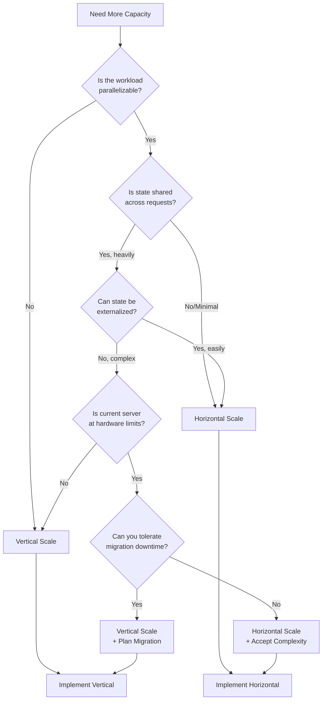
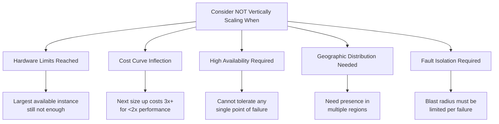

# How to Create Vertical Scaling Decisions

Author: [nawazdhandala](https://github.com/nawazdhandala)

Tags: Scaling, Infrastructure, Performance, DevOps

Description: Learn when vertical scaling is appropriate and how to implement it effectively.

---

Scaling decisions are among the most consequential choices in infrastructure planning. While horizontal scaling (adding more machines) dominates modern architectural discussions, vertical scaling (upgrading to more powerful hardware) remains a powerful and often overlooked strategy. This guide walks through the decision framework for when vertical scaling makes sense and how to implement it effectively.

## Understanding Vertical Scaling

Vertical scaling, also known as "scaling up," means increasing the resources of a single machine - more CPU cores, more RAM, faster storage, or better network throughput. Unlike horizontal scaling, which distributes load across multiple nodes, vertical scaling concentrates power in fewer, more capable machines.



## When Vertical Scaling is the Right Choice

### 1. Single-Threaded Workloads

Some applications simply cannot be parallelized effectively. Legacy systems, certain analytics pipelines, and applications with heavy sequential processing benefit more from faster cores than from more cores.



**Example: Sequential data processing pipeline**

```python
# This pipeline processes records sequentially - each record depends on the previous
# Horizontal scaling won't help here; a faster single core will

class SequentialProcessor:
    def __init__(self):
        self.state = {}

    def process_record(self, record):
        # Each record modifies shared state that the next record depends on
        # This cannot be parallelized without fundamental redesign
        previous_value = self.state.get(record['key'], 0)
        new_value = self.calculate_dependent_value(record, previous_value)
        self.state[record['key']] = new_value
        return new_value

    def calculate_dependent_value(self, record, previous):
        # Heavy computation that benefits from faster single-core performance
        result = previous
        for i in range(record['iterations']):
            result = (result * record['multiplier'] + record['offset']) % record['modulo']
        return result

# Monitoring: Track single-core utilization
# If one core is at 100% while others idle, vertical scaling helps
```

**Monitoring single-threaded bottlenecks:**

```bash
# Check per-core CPU utilization
mpstat -P ALL 1

# If you see output like this, vertical scaling helps:
# CPU    %usr   %nice    %sys %iowait    %irq   %soft  %steal  %guest  %idle
# all    12.50   0.00    2.00    0.00    0.00    0.25    0.00    0.00   85.25
#   0   100.00   0.00    0.00    0.00    0.00    0.00    0.00    0.00    0.00  <- Bottleneck!
#   1     0.00   0.00    0.00    0.00    0.00    0.00    0.00    0.00  100.00
#   2     0.00   0.00    0.00    0.00    0.00    0.00    0.00    0.00  100.00
```

### 2. Database Scaling Considerations

Databases are often the hardest component to scale horizontally. Vertical scaling buys you time, simplicity, and often better performance than sharding.



**Why vertical scaling often wins for databases:**

| Factor | Horizontal Challenge | Vertical Advantage |
|--------|---------------------|-------------------|
| Transactions | Distributed transactions are complex and slow | Single-node ACID is fast and simple |
| Joins | Cross-shard joins are expensive | All data local, fast joins |
| Consistency | Eventual consistency, conflict resolution | Strong consistency by default |
| Operations | Rebalancing, failover, split-brain | Single point of management |
| Latency | Network hops between shards | Everything in memory/local disk |

**Database vertical scaling checklist:**

```sql
-- PostgreSQL: Check if your working set fits in memory
SELECT
    pg_size_pretty(pg_database_size(current_database())) as db_size,
    current_setting('shared_buffers') as shared_buffers,
    current_setting('effective_cache_size') as effective_cache_size;

-- Check buffer cache hit ratio (should be > 99% for OLTP)
SELECT
    sum(heap_blks_read) as heap_read,
    sum(heap_blks_hit) as heap_hit,
    sum(heap_blks_hit) / (sum(heap_blks_hit) + sum(heap_blks_read))::float as ratio
FROM pg_statio_user_tables;

-- If ratio < 0.99, consider vertical scaling: more RAM
```

```yaml
# PostgreSQL configuration for vertical scaling
# Adjust based on your new server specs

# Memory (assume 256GB RAM server)
shared_buffers: 64GB              # 25% of RAM
effective_cache_size: 192GB       # 75% of RAM
work_mem: 256MB                   # Per-operation memory
maintenance_work_mem: 4GB         # For VACUUM, CREATE INDEX

# CPU (assume 64 cores)
max_parallel_workers_per_gather: 8
max_parallel_workers: 32
max_worker_processes: 64

# Storage (assume NVMe)
effective_io_concurrency: 200
random_page_cost: 1.1             # NVMe is nearly as fast as sequential
```

### 3. Memory-Bound Applications

Applications that need to keep large datasets in memory for performance - caches, in-memory databases, real-time analytics - scale vertically more naturally than horizontally.



**Example: In-memory cache sizing**

```python
import sys
from dataclasses import dataclass
from typing import Dict, Any

@dataclass
class CacheMetrics:
    """Track cache memory usage for vertical scaling decisions"""

    total_entries: int = 0
    total_bytes: int = 0
    hit_count: int = 0
    miss_count: int = 0
    eviction_count: int = 0

    @property
    def hit_ratio(self) -> float:
        total = self.hit_count + self.miss_count
        return self.hit_count / total if total > 0 else 0.0

    @property
    def eviction_ratio(self) -> float:
        """High eviction ratio = need more memory"""
        total_ops = self.hit_count + self.miss_count
        return self.eviction_count / total_ops if total_ops > 0 else 0.0

class SmartCache:
    def __init__(self, max_memory_bytes: int):
        self.max_memory = max_memory_bytes
        self.data: Dict[str, Any] = {}
        self.metrics = CacheMetrics()

    def get(self, key: str) -> Any:
        if key in self.data:
            self.metrics.hit_count += 1
            return self.data[key]
        self.metrics.miss_count += 1
        return None

    def set(self, key: str, value: Any) -> None:
        size = sys.getsizeof(value)

        # Evict if necessary
        while self.metrics.total_bytes + size > self.max_memory and self.data:
            self._evict_one()

        self.data[key] = value
        self.metrics.total_entries += 1
        self.metrics.total_bytes += size

    def _evict_one(self) -> None:
        # Simple FIFO eviction
        if self.data:
            key = next(iter(self.data))
            size = sys.getsizeof(self.data[key])
            del self.data[key]
            self.metrics.total_entries -= 1
            self.metrics.total_bytes -= size
            self.metrics.eviction_count += 1

    def should_scale_vertically(self) -> dict:
        """Decision helper for vertical scaling"""
        return {
            'hit_ratio': self.metrics.hit_ratio,
            'eviction_ratio': self.metrics.eviction_ratio,
            'memory_utilization': self.metrics.total_bytes / self.max_memory,
            'recommendation': self._get_recommendation()
        }

    def _get_recommendation(self) -> str:
        if self.metrics.eviction_ratio > 0.1:
            return "SCALE UP: High eviction rate indicates memory pressure"
        if self.metrics.hit_ratio < 0.9:
            return "SCALE UP: Low hit ratio suggests working set exceeds cache size"
        if self.metrics.total_bytes / self.max_memory > 0.95:
            return "SCALE UP: Memory nearly full, preemptive scaling recommended"
        return "STABLE: Current capacity is sufficient"

# Usage and monitoring
cache = SmartCache(max_memory_bytes=16 * 1024**3)  # 16GB

# After running workload, check scaling recommendation
decision = cache.should_scale_vertically()
print(f"Hit ratio: {decision['hit_ratio']:.2%}")
print(f"Eviction ratio: {decision['eviction_ratio']:.2%}")
print(f"Recommendation: {decision['recommendation']}")
```

### 4. Cost Comparison Framework

Vertical scaling can be surprisingly cost-effective, especially when you factor in operational complexity.



**Total Cost of Ownership Calculator:**

```python
from dataclasses import dataclass
from typing import Optional

@dataclass
class ScalingCostAnalysis:
    """Compare vertical vs horizontal scaling costs"""

    # Current state
    current_servers: int
    current_cost_per_server: float

    # Scaling options
    vertical_new_server_cost: float      # Cost of larger server
    horizontal_additional_servers: int    # Number of servers to add

    # Operational factors (monthly)
    engineer_hourly_rate: float = 150.0
    hours_managing_distributed: float = 20.0  # Monthly hours for distributed system
    hours_managing_single: float = 5.0        # Monthly hours for single server

    # Complexity factors
    incident_rate_distributed: float = 0.5    # Incidents per month
    incident_rate_single: float = 0.1
    incident_mttr_distributed: float = 4.0    # Hours to resolve
    incident_mttr_single: float = 1.0

    def calculate_monthly_cost(self, is_vertical: bool) -> dict:
        if is_vertical:
            hardware = self.vertical_new_server_cost
            management_hours = self.hours_managing_single
            incident_hours = self.incident_rate_single * self.incident_mttr_single
        else:
            hardware = (self.current_servers + self.horizontal_additional_servers) * self.current_cost_per_server
            management_hours = self.hours_managing_distributed
            incident_hours = self.incident_rate_distributed * self.incident_mttr_distributed

        operational = (management_hours + incident_hours) * self.engineer_hourly_rate

        return {
            'hardware_monthly': hardware,
            'operational_monthly': operational,
            'total_monthly': hardware + operational,
            'annual_total': (hardware + operational) * 12
        }

    def compare(self) -> dict:
        vertical = self.calculate_monthly_cost(is_vertical=True)
        horizontal = self.calculate_monthly_cost(is_vertical=False)

        return {
            'vertical': vertical,
            'horizontal': horizontal,
            'monthly_savings': horizontal['total_monthly'] - vertical['total_monthly'],
            'annual_savings': horizontal['annual_total'] - vertical['annual_total'],
            'recommendation': 'VERTICAL' if vertical['total_monthly'] < horizontal['total_monthly'] else 'HORIZONTAL'
        }

# Example analysis
analysis = ScalingCostAnalysis(
    current_servers=3,
    current_cost_per_server=500,          # $500/month per server
    vertical_new_server_cost=1500,        # $1500/month for larger server
    horizontal_additional_servers=3,       # Would need 3 more servers
)

result = analysis.compare()
print(f"Vertical monthly cost: ${result['vertical']['total_monthly']:,.2f}")
print(f"Horizontal monthly cost: ${result['horizontal']['total_monthly']:,.2f}")
print(f"Annual savings with {result['recommendation']}: ${abs(result['annual_savings']):,.2f}")
```

### 5. Downtime Requirements and Migration Strategy

Vertical scaling typically requires downtime for migration. Plan accordingly.



**Zero-downtime vertical scaling strategies:**

```yaml
# Strategy 1: Blue-Green with larger instance
# Works when you can afford to run both temporarily

blue_green_vertical:
  steps:
    - name: provision_new
      action: Create larger instance (green)
      duration: 10-30 minutes

    - name: deploy_app
      action: Deploy application to green
      duration: 5-10 minutes

    - name: warm_cache
      action: Pre-warm application caches
      duration: varies

    - name: switch_traffic
      action: Update load balancer to green
      duration: < 1 minute

    - name: drain_blue
      action: Allow blue to finish in-flight requests
      duration: 1-5 minutes

    - name: decommission
      action: Terminate old (blue) instance
      duration: immediate

  total_downtime: 0
  total_duration: 20-60 minutes
  cost: 2x hardware during migration
```

```python
# Graceful shutdown handler for zero-downtime scaling
import signal
import asyncio
from contextlib import asynccontextmanager

class GracefulScaler:
    def __init__(self):
        self.is_shutting_down = False
        self.active_requests = 0
        self.shutdown_event = asyncio.Event()

    def setup_signal_handlers(self):
        """Handle SIGTERM for graceful shutdown during scaling"""
        signal.signal(signal.SIGTERM, self._handle_shutdown)
        signal.signal(signal.SIGINT, self._handle_shutdown)

    def _handle_shutdown(self, signum, frame):
        print(f"Received signal {signum}, initiating graceful shutdown")
        self.is_shutting_down = True
        # Don't exit immediately - let requests drain

    @asynccontextmanager
    async def request_context(self):
        """Track active requests for graceful drain"""
        if self.is_shutting_down:
            raise ServiceUnavailable("Server is shutting down for scaling")

        self.active_requests += 1
        try:
            yield
        finally:
            self.active_requests -= 1
            if self.is_shutting_down and self.active_requests == 0:
                self.shutdown_event.set()

    async def wait_for_drain(self, timeout: float = 30.0):
        """Wait for all requests to complete before shutdown"""
        if self.active_requests == 0:
            return True

        try:
            await asyncio.wait_for(
                self.shutdown_event.wait(),
                timeout=timeout
            )
            return True
        except asyncio.TimeoutError:
            print(f"Timeout waiting for {self.active_requests} requests to drain")
            return False

    def health_check(self) -> dict:
        """Health check endpoint for load balancer"""
        return {
            'healthy': not self.is_shutting_down,
            'active_requests': self.active_requests,
            'status': 'draining' if self.is_shutting_down else 'serving'
        }
```

## Vertical Scaling Decision Framework

Use this decision tree when evaluating scaling options:



## Implementing Vertical Scaling

### Step 1: Capacity Assessment

```python
import psutil
import subprocess
from dataclasses import dataclass
from typing import Tuple

@dataclass
class CapacityReport:
    """Assess current capacity and headroom"""

    cpu_cores: int
    cpu_usage_percent: float
    memory_total_gb: float
    memory_used_gb: float
    disk_iops_current: int
    disk_iops_max: int
    network_bandwidth_gbps: float
    network_usage_percent: float

    def bottleneck_analysis(self) -> dict:
        """Identify which resource to scale"""
        bottlenecks = []

        if self.cpu_usage_percent > 80:
            bottlenecks.append({
                'resource': 'CPU',
                'usage': f'{self.cpu_usage_percent:.1f}%',
                'recommendation': 'More cores or faster clock speed'
            })

        memory_percent = (self.memory_used_gb / self.memory_total_gb) * 100
        if memory_percent > 85:
            bottlenecks.append({
                'resource': 'Memory',
                'usage': f'{memory_percent:.1f}%',
                'recommendation': f'Increase RAM from {self.memory_total_gb:.0f}GB'
            })

        iops_percent = (self.disk_iops_current / self.disk_iops_max) * 100
        if iops_percent > 70:
            bottlenecks.append({
                'resource': 'Disk I/O',
                'usage': f'{iops_percent:.1f}%',
                'recommendation': 'Upgrade to NVMe or faster storage tier'
            })

        if self.network_usage_percent > 70:
            bottlenecks.append({
                'resource': 'Network',
                'usage': f'{self.network_usage_percent:.1f}%',
                'recommendation': 'Upgrade network interface or bandwidth'
            })

        return {
            'bottlenecks': bottlenecks,
            'primary_constraint': bottlenecks[0]['resource'] if bottlenecks else None,
            'headroom_available': len(bottlenecks) == 0
        }

def collect_capacity_metrics() -> CapacityReport:
    """Collect current system metrics"""
    cpu_percent = psutil.cpu_percent(interval=1)
    memory = psutil.virtual_memory()

    # Disk IOPS would need iostat or similar
    # Network would need interface stats

    return CapacityReport(
        cpu_cores=psutil.cpu_count(),
        cpu_usage_percent=cpu_percent,
        memory_total_gb=memory.total / (1024**3),
        memory_used_gb=memory.used / (1024**3),
        disk_iops_current=0,  # Would need iostat
        disk_iops_max=100000,  # Placeholder
        network_bandwidth_gbps=10.0,
        network_usage_percent=0  # Would need interface stats
    )

# Example usage
report = collect_capacity_metrics()
analysis = report.bottleneck_analysis()
print(f"Primary bottleneck: {analysis['primary_constraint']}")
for b in analysis['bottlenecks']:
    print(f"  {b['resource']}: {b['usage']} - {b['recommendation']}")
```

### Step 2: Size Selection

```python
from dataclasses import dataclass
from typing import List, Optional

@dataclass
class ServerSpec:
    name: str
    cpu_cores: int
    memory_gb: int
    storage_type: str  # 'ssd', 'nvme'
    storage_iops: int
    network_gbps: float
    monthly_cost: float

# Common cloud provider instance types (representative)
INSTANCE_CATALOG = [
    ServerSpec("small", 4, 16, "ssd", 3000, 1, 100),
    ServerSpec("medium", 8, 32, "ssd", 6000, 5, 200),
    ServerSpec("large", 16, 64, "nvme", 20000, 10, 400),
    ServerSpec("xlarge", 32, 128, "nvme", 40000, 25, 800),
    ServerSpec("2xlarge", 64, 256, "nvme", 80000, 50, 1600),
    ServerSpec("4xlarge", 128, 512, "nvme", 160000, 100, 3200),
    ServerSpec("metal", 192, 768, "nvme", 250000, 200, 6000),
]

def recommend_vertical_upgrade(
    current: ServerSpec,
    capacity_report: CapacityReport,
    growth_factor: float = 1.5  # Plan for 50% growth
) -> List[ServerSpec]:
    """Recommend upgrade options based on bottleneck analysis"""

    analysis = capacity_report.bottleneck_analysis()
    candidates = []

    for spec in INSTANCE_CATALOG:
        if spec.monthly_cost <= current.monthly_cost:
            continue  # Skip smaller/equal options

        # Check if it addresses the bottleneck
        if analysis['primary_constraint'] == 'CPU':
            if spec.cpu_cores >= current.cpu_cores * growth_factor:
                candidates.append(spec)

        elif analysis['primary_constraint'] == 'Memory':
            if spec.memory_gb >= current.memory_gb * growth_factor:
                candidates.append(spec)

        elif analysis['primary_constraint'] == 'Disk I/O':
            if spec.storage_iops >= current.storage_iops * growth_factor:
                candidates.append(spec)

        elif analysis['primary_constraint'] == 'Network':
            if spec.network_gbps >= current.network_gbps * growth_factor:
                candidates.append(spec)

        else:
            # No bottleneck - recommend next size up for headroom
            if spec.monthly_cost == sorted([s.monthly_cost for s in INSTANCE_CATALOG if s.monthly_cost > current.monthly_cost])[0]:
                candidates.append(spec)
                break

    return sorted(candidates, key=lambda s: s.monthly_cost)[:3]

# Example
current_spec = ServerSpec("medium", 8, 32, "ssd", 6000, 5, 200)
report = collect_capacity_metrics()
recommendations = recommend_vertical_upgrade(current_spec, report)

print("Recommended upgrades:")
for spec in recommendations:
    print(f"  {spec.name}: {spec.cpu_cores} cores, {spec.memory_gb}GB RAM - ${spec.monthly_cost}/mo")
```

### Step 3: Migration Execution

```bash
#!/bin/bash
# vertical-scale-migration.sh
# Automated vertical scaling migration script

set -euo pipefail

OLD_INSTANCE="i-old123"
NEW_INSTANCE="i-new456"
LOAD_BALANCER="my-load-balancer"
TARGET_GROUP="my-target-group"
TIMEOUT=300

echo "=== Vertical Scaling Migration ==="
echo "Old instance: $OLD_INSTANCE"
echo "New instance: $NEW_INSTANCE"
echo ""

# Phase 1: Verify new instance is ready
echo "[Phase 1] Verifying new instance health..."
aws ec2 wait instance-status-ok --instance-ids "$NEW_INSTANCE"
echo "  New instance is healthy"

# Phase 2: Register new instance with load balancer
echo "[Phase 2] Registering new instance with load balancer..."
aws elbv2 register-targets \
    --target-group-arn "$TARGET_GROUP" \
    --targets "Id=$NEW_INSTANCE"

# Wait for new instance to be healthy in target group
echo "  Waiting for target to become healthy..."
aws elbv2 wait target-in-service \
    --target-group-arn "$TARGET_GROUP" \
    --targets "Id=$NEW_INSTANCE"
echo "  New instance registered and healthy"

# Phase 3: Deregister old instance (starts draining)
echo "[Phase 3] Deregistering old instance (draining connections)..."
aws elbv2 deregister-targets \
    --target-group-arn "$TARGET_GROUP" \
    --targets "Id=$OLD_INSTANCE"

# Wait for drain to complete
echo "  Waiting for connections to drain..."
sleep 30  # Adjust based on your deregistration delay setting

# Phase 4: Verify traffic is flowing to new instance
echo "[Phase 4] Verifying traffic on new instance..."
# Add your verification checks here - health endpoint, logs, metrics

# Phase 5: Cleanup
echo "[Phase 5] Migration complete"
echo "  Old instance can be terminated: $OLD_INSTANCE"

echo ""
echo "=== Migration Summary ==="
echo "  Status: SUCCESS"
echo "  New active instance: $NEW_INSTANCE"
echo "  Remember to terminate $OLD_INSTANCE after validation period"
```

## Monitoring for Vertical Scaling Triggers

Set up alerts that indicate when vertical scaling should be considered:

```yaml
# prometheus-vertical-scaling-alerts.yaml
groups:
  - name: vertical-scaling-indicators
    rules:
      # CPU saturation on single core (single-threaded bottleneck)
      - alert: SingleCoreBottleneck
        expr: |
          max by (instance) (
            rate(node_cpu_seconds_total{mode!="idle"}[5m])
          ) > 0.95
        for: 15m
        labels:
          severity: warning
          scaling_type: vertical
        annotations:
          summary: "Single core bottleneck detected"
          description: "Instance {{ $labels.instance }} has a single core at >95% utilization. Consider vertical scaling for faster CPU."

      # Memory pressure with low cache hit ratio
      - alert: MemoryPressure
        expr: |
          (
            node_memory_MemAvailable_bytes / node_memory_MemTotal_bytes < 0.1
          ) and (
            rate(node_vmstat_pgmajfault[5m]) > 100
          )
        for: 10m
        labels:
          severity: warning
          scaling_type: vertical
        annotations:
          summary: "Memory pressure detected"
          description: "Instance {{ $labels.instance }} is under memory pressure with high page faults. Consider vertical scaling for more RAM."

      # Database buffer cache misses
      - alert: DatabaseCacheMisses
        expr: |
          pg_stat_database_blks_hit /
          (pg_stat_database_blks_hit + pg_stat_database_blks_read) < 0.95
        for: 30m
        labels:
          severity: warning
          scaling_type: vertical
          component: database
        annotations:
          summary: "Database buffer cache hit ratio low"
          description: "PostgreSQL buffer cache hit ratio is {{ $value | humanizePercentage }}. Consider increasing shared_buffers via vertical scaling."

      # Approaching instance type limits
      - alert: ApproachingInstanceLimits
        expr: |
          (
            avg_over_time(node_cpu_seconds_total{mode!="idle"}[1h]) > 0.7
          ) or (
            avg_over_time((1 - node_memory_MemAvailable_bytes/node_memory_MemTotal_bytes)[1h]) > 0.8
          )
        for: 1h
        labels:
          severity: info
          scaling_type: vertical
        annotations:
          summary: "Approaching capacity limits"
          description: "Instance {{ $labels.instance }} is consistently using >70% CPU or >80% memory. Plan for vertical scaling."
```

## When NOT to Vertically Scale

Vertical scaling has limits. Know when to switch strategies:



## Summary

| Consideration | Favor Vertical | Favor Horizontal |
|--------------|----------------|------------------|
| **Workload type** | Single-threaded, sequential | Parallel, stateless |
| **State management** | Heavy shared state | Stateless or externalized |
| **Database** | ACID-critical, complex joins | Read-heavy, partitionable |
| **Memory requirements** | Large working set, caching | Can be partitioned |
| **Downtime tolerance** | Some downtime acceptable | Zero downtime required |
| **Operational maturity** | Small team, simple ops | DevOps expertise available |
| **Cost structure** | Linear scaling acceptable | Need elastic cost model |
| **Hardware availability** | Larger instances available | At instance limits |

Vertical scaling is not a relic of the past - it is a legitimate and often superior choice for many workloads. The key is understanding your application's characteristics and making data-driven decisions. Start with vertical scaling for simplicity, and migrate to horizontal scaling when you have clear evidence that you have outgrown single-machine capacity.

---

**Related Reading:**

- [One Big Server Is Probably Enough](https://oneuptime.com/blog/post/2025-12-12-one-big-server-is-enough/view)
- [How to Autoscale Deployments with the Horizontal Pod Autoscaler](https://oneuptime.com/blog/post/2025-11-27-hpa-autoscale/view)
- [Choosing the Right Kubernetes Distribution](https://oneuptime.com/blog/post/2025-11-27-choosing-the-right-kubernetes-distribution/view)
