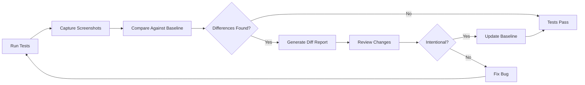
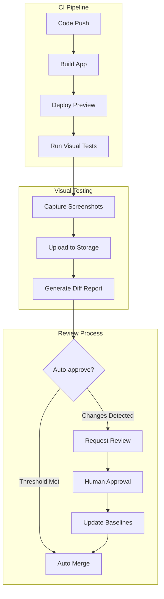

# How to Build Visual Regression Testing

Author: [nawazdhandala](https://github.com/nawazdhandala)

Tags: Testing, Frontend, CI/CD, DevOps

Description: A practical guide to implementing visual regression testing that catches UI bugs before they reach production, with real-world examples using Playwright and Percy.

---

You push a CSS fix. Tests pass. Linter is happy. You merge with confidence. Two days later, support tickets roll in: the checkout button is now invisible on mobile. Welcome to visual regression bugs, where everything works except what users actually see.

Functional tests verify behavior. Visual regression tests verify appearance. They capture screenshots of your UI and compare them against known baselines, flagging any pixel-level differences. This guide walks you through building a visual regression testing pipeline from scratch.

## Why Visual Regression Testing Matters

Traditional tests check that your code does the right thing. Visual regression tests check that your UI looks right. The gap between these two is where visual bugs hide:

- CSS changes that break layouts on specific screen sizes
- Font loading failures that swap typefaces
- Z-index collisions that hide elements
- Responsive breakpoints that misalign components
- Third-party widget updates that clash with your design

These bugs slip through unit tests, integration tests, and even manual QA. Visual regression testing catches them automatically.

## How Visual Regression Testing Works



The workflow is straightforward:

1. **Capture**: Take screenshots of your UI components or pages
2. **Compare**: Diff new screenshots against approved baselines
3. **Review**: Human review of flagged differences
4. **Update or Fix**: Either approve intentional changes or fix bugs

## Setting Up with Playwright

Playwright includes built-in visual comparison capabilities. Here's how to set it up from scratch.

### Installation

Install Playwright with its testing framework.

```bash
npm init -y
npm install -D @playwright/test
npx playwright install
```

### Basic Configuration

Create a Playwright configuration file that enables screenshot comparisons and defines viewport sizes for consistent captures.

```typescript
// playwright.config.ts
import { defineConfig, devices } from '@playwright/test';

export default defineConfig({
  // Directory containing test files
  testDir: './tests',

  // Run tests in parallel for speed
  fullyParallel: true,

  // Fail the build on CI if you accidentally left test.only in the source code
  forbidOnly: !!process.env.CI,

  // Retry failed tests on CI to handle flakiness
  retries: process.env.CI ? 2 : 0,

  // Configure screenshot comparison settings
  expect: {
    toHaveScreenshot: {
      // Allow 0.1% pixel difference to handle anti-aliasing variations
      maxDiffPixelRatio: 0.001,

      // Store baseline screenshots in this directory
      snapshotDir: './screenshots/baseline',
    },
  },

  // Define browser configurations to test
  projects: [
    {
      name: 'Desktop Chrome',
      use: {
        ...devices['Desktop Chrome'],
        viewport: { width: 1280, height: 720 },
      },
    },
    {
      name: 'Mobile Safari',
      use: {
        ...devices['iPhone 13'],
      },
    },
    {
      name: 'Tablet',
      use: {
        viewport: { width: 768, height: 1024 },
      },
    },
  ],
});
```

### Writing Your First Visual Test

Create a test that captures and compares screenshots. The first run generates baselines; subsequent runs compare against them.

```typescript
// tests/homepage.spec.ts
import { test, expect } from '@playwright/test';

test.describe('Homepage Visual Tests', () => {

  // Test the full page appearance
  test('homepage renders correctly', async ({ page }) => {
    await page.goto('https://your-app.com');

    // Wait for all images and fonts to load before capturing
    await page.waitForLoadState('networkidle');

    // Compare full page screenshot against baseline
    await expect(page).toHaveScreenshot('homepage-full.png', {
      fullPage: true,
    });
  });

  // Test a specific component in isolation
  test('navigation bar renders correctly', async ({ page }) => {
    await page.goto('https://your-app.com');

    // Locate the navigation element
    const navbar = page.locator('nav.main-navigation');

    // Compare just this component against its baseline
    await expect(navbar).toHaveScreenshot('navbar.png');
  });

  // Test hover and interaction states
  test('button hover state renders correctly', async ({ page }) => {
    await page.goto('https://your-app.com');

    const ctaButton = page.locator('button.cta-primary');

    // Capture default state
    await expect(ctaButton).toHaveScreenshot('cta-button-default.png');

    // Hover over the button
    await ctaButton.hover();

    // Capture hover state
    await expect(ctaButton).toHaveScreenshot('cta-button-hover.png');
  });
});
```

### Handling Dynamic Content

Real applications have dynamic content that changes between test runs. Mask or freeze these elements to prevent false positives.

```typescript
// tests/dashboard.spec.ts
import { test, expect } from '@playwright/test';

test('dashboard with dynamic content', async ({ page }) => {
  await page.goto('https://your-app.com/dashboard');

  // Mask elements that change between runs
  await expect(page).toHaveScreenshot('dashboard.png', {
    // Hide these selectors with a colored box
    mask: [
      page.locator('.timestamp'),
      page.locator('.user-avatar'),
      page.locator('.live-metrics'),
    ],
    // Color of the mask boxes
    maskColor: '#808080',
  });
});

test('freeze animations before capture', async ({ page }) => {
  await page.goto('https://your-app.com/landing');

  // Disable CSS animations and transitions
  await page.addStyleTag({
    content: `
      *, *::before, *::after {
        animation-duration: 0s !important;
        animation-delay: 0s !important;
        transition-duration: 0s !important;
        transition-delay: 0s !important;
      }
    `,
  });

  // Hide video elements
  await page.evaluate(() => {
    document.querySelectorAll('video').forEach(v => {
      v.style.visibility = 'hidden';
    });
  });

  await expect(page).toHaveScreenshot('landing-page.png');
});

test('mock current date for consistent renders', async ({ page }) => {
  // Set a fixed date so date-dependent content stays consistent
  await page.addInitScript(() => {
    const fixedDate = new Date('2026-01-15T12:00:00Z');
    // Override Date constructor
    const OriginalDate = Date;
    (window as any).Date = class extends OriginalDate {
      constructor(...args: any[]) {
        if (args.length === 0) {
          super(fixedDate.getTime());
        } else {
          super(...args);
        }
      }
      static now() {
        return fixedDate.getTime();
      }
    };
  });

  await page.goto('https://your-app.com/calendar');
  await expect(page).toHaveScreenshot('calendar-view.png');
});
```

## Scaling with Percy

For larger applications, consider a dedicated visual testing service like Percy (BrowserStack). It handles baseline management, review workflows, and cross-browser rendering.

### Percy Setup

Install the Percy CLI and Playwright integration.

```bash
npm install -D @percy/cli @percy/playwright
```

### Percy Test Example

Percy uploads screenshots to their service where baselines are managed centrally. This works well for teams where multiple developers need to review and approve visual changes.

```typescript
// tests/visual-percy.spec.ts
import { test } from '@playwright/test';
import percySnapshot from '@percy/playwright';

test.describe('Percy Visual Tests', () => {

  test('capture homepage', async ({ page }) => {
    await page.goto('https://your-app.com');
    await page.waitForLoadState('networkidle');

    // Percy handles the screenshot upload and comparison
    await percySnapshot(page, 'Homepage', {
      // Capture at multiple widths automatically
      widths: [375, 768, 1280],
      // Minimum height to capture
      minHeight: 1024,
    });
  });

  test('capture checkout flow', async ({ page }) => {
    await page.goto('https://your-app.com/checkout');

    // Capture each step of a multi-step flow
    await percySnapshot(page, 'Checkout - Cart Review');

    await page.click('[data-testid="proceed-to-shipping"]');
    await page.waitForSelector('[data-testid="shipping-form"]');
    await percySnapshot(page, 'Checkout - Shipping');

    await page.fill('[data-testid="shipping-address"]', '123 Test St');
    await page.click('[data-testid="proceed-to-payment"]');
    await page.waitForSelector('[data-testid="payment-form"]');
    await percySnapshot(page, 'Checkout - Payment');
  });
});
```

### Running Percy in CI

Percy requires a token for uploads. Set this in your CI environment.

```yaml
# .github/workflows/visual-tests.yml
name: Visual Regression Tests

on:
  pull_request:
    branches: [main]

jobs:
  visual-tests:
    runs-on: ubuntu-latest
    steps:
      # Check out the repository code
      - uses: actions/checkout@v4

      # Set up Node.js environment
      - uses: actions/setup-node@v4
        with:
          node-version: '20'
          cache: 'npm'

      # Install project dependencies
      - run: npm ci

      # Install Playwright browsers
      - run: npx playwright install --with-deps chromium

      # Run visual tests and upload to Percy
      - name: Percy Visual Tests
        run: npx percy exec -- npx playwright test tests/visual-percy.spec.ts
        env:
          PERCY_TOKEN: ${{ secrets.PERCY_TOKEN }}
```

## Building a Component Visual Testing Library

For design system teams, create a dedicated visual test suite that covers every component variant.

```typescript
// tests/components/button.visual.spec.ts
import { test, expect } from '@playwright/test';

// Define all button variants to test
const buttonVariants = [
  { variant: 'primary', size: 'small' },
  { variant: 'primary', size: 'medium' },
  { variant: 'primary', size: 'large' },
  { variant: 'secondary', size: 'small' },
  { variant: 'secondary', size: 'medium' },
  { variant: 'secondary', size: 'large' },
  { variant: 'danger', size: 'medium' },
  { variant: 'ghost', size: 'medium' },
];

// Define all states to capture
const buttonStates = ['default', 'hover', 'focus', 'disabled'];

test.describe('Button Component Visual Matrix', () => {

  for (const { variant, size } of buttonVariants) {
    for (const state of buttonStates) {

      test(`Button ${variant}/${size}/${state}`, async ({ page }) => {
        // Navigate to component playground or Storybook
        const url = new URL('https://your-storybook.com/iframe.html');
        url.searchParams.set('id', `components-button--${variant}`);
        url.searchParams.set('args', `size:${size}`);

        await page.goto(url.toString());

        const button = page.locator('button').first();

        // Apply the state
        if (state === 'hover') {
          await button.hover();
        } else if (state === 'focus') {
          await button.focus();
        } else if (state === 'disabled') {
          await button.evaluate(el => el.setAttribute('disabled', 'true'));
        }

        // Capture and compare
        await expect(button).toHaveScreenshot(
          `button-${variant}-${size}-${state}.png`
        );
      });
    }
  }
});
```

## CI Pipeline Architecture

A production visual testing pipeline needs to handle parallel execution, artifact storage, and review workflows.



### GitHub Actions Workflow

Complete workflow that runs visual tests on pull requests and manages baseline updates.

```yaml
# .github/workflows/visual-regression.yml
name: Visual Regression

on:
  pull_request:
    branches: [main]
  push:
    branches: [main]

jobs:
  visual-test:
    runs-on: ubuntu-latest
    steps:
      - uses: actions/checkout@v4
        with:
          # Fetch full history for baseline comparison
          fetch-depth: 0

      - uses: actions/setup-node@v4
        with:
          node-version: '20'
          cache: 'npm'

      - run: npm ci

      # Install only Chromium to speed up CI
      - run: npx playwright install --with-deps chromium

      # Build the application for testing
      - name: Build
        run: npm run build

      # Start the app in background for testing
      - name: Start App
        run: |
          npm run start &
          npx wait-on http://localhost:3000

      # Run visual regression tests
      - name: Run Visual Tests
        run: npx playwright test --project="Desktop Chrome"

      # Upload test results as artifacts
      - name: Upload Screenshots
        if: failure()
        uses: actions/upload-artifact@v4
        with:
          name: visual-test-results
          path: |
            test-results/
            playwright-report/
          retention-days: 7

      # Upload baseline screenshots on main branch
      - name: Update Baselines
        if: github.ref == 'refs/heads/main'
        run: |
          npx playwright test --update-snapshots
          git config user.name "github-actions[bot]"
          git config user.email "github-actions[bot]@users.noreply.github.com"
          git add screenshots/
          git diff --staged --quiet || git commit -m "chore: update visual baselines"
          git push
```

## Threshold Configuration

Configure thresholds to balance sensitivity with practicality. Too strict and you get false positives; too loose and real bugs slip through.

```typescript
// playwright.config.ts
import { defineConfig } from '@playwright/test';

export default defineConfig({
  expect: {
    toHaveScreenshot: {
      // Maximum allowed pixel difference ratio (0.1% = 0.001)
      // Handles minor anti-aliasing differences across systems
      maxDiffPixelRatio: 0.001,

      // Maximum absolute pixel difference allowed
      // Useful when you expect small, localized changes
      maxDiffPixels: 100,

      // Threshold for pixel color comparison (0-1)
      // Lower values are more strict
      threshold: 0.2,

      // Enable animations to finish before screenshot
      animations: 'disabled',

      // Scale screenshots to match baseline dimensions
      scale: 'css',
    },
  },
});
```

### Per-Test Threshold Overrides

Some pages need different sensitivity levels. Override thresholds at the test level.

```typescript
test('data visualization chart', async ({ page }) => {
  await page.goto('https://your-app.com/analytics');

  // Charts may have minor rendering variations
  // Allow higher tolerance for this specific test
  await expect(page.locator('.chart-container')).toHaveScreenshot('chart.png', {
    maxDiffPixelRatio: 0.02,  // 2% threshold for charts
    threshold: 0.3,
  });
});

test('pixel-perfect logo', async ({ page }) => {
  await page.goto('https://your-app.com');

  // Logos should match exactly
  await expect(page.locator('.logo')).toHaveScreenshot('logo.png', {
    maxDiffPixels: 0,  // Zero tolerance
    threshold: 0,
  });
});
```

## Debugging Failed Visual Tests

When tests fail, Playwright generates detailed diff reports. Here's how to interpret them.

| Artifact | Purpose |
|----------|---------|
| `*-actual.png` | Screenshot from current test run |
| `*-expected.png` | Baseline screenshot being compared against |
| `*-diff.png` | Highlighted pixel differences (pink/red areas) |

### Common Failure Causes and Fixes

| Symptom | Likely Cause | Fix |
|---------|--------------|-----|
| Entire page differs | Font loading race | Add `waitForLoadState('networkidle')` |
| Random element positions | Animation timing | Disable animations before capture |
| Text rendering differences | System fonts | Use web fonts with consistent rendering |
| Date/time content differs | Dynamic data | Mock dates or mask elements |
| 1px shifts | Subpixel rendering | Increase `maxDiffPixels` threshold |

### Investigating Diff Images

```typescript
test('debug visual differences', async ({ page }) => {
  await page.goto('https://your-app.com');

  // Take a screenshot without comparison for debugging
  await page.screenshot({
    path: 'debug-screenshot.png',
    fullPage: true,
  });

  // Log computed styles of problem elements
  const headerStyles = await page.locator('header').evaluate(el => {
    const styles = window.getComputedStyle(el);
    return {
      font: styles.fontFamily,
      fontSize: styles.fontSize,
      height: styles.height,
      padding: styles.padding,
    };
  });
  console.log('Header styles:', headerStyles);
});
```

## Best Practices

### Test Organization

Structure tests by feature and component for maintainability.

```
tests/
  visual/
    components/
      button.visual.spec.ts
      form.visual.spec.ts
      modal.visual.spec.ts
    pages/
      homepage.visual.spec.ts
      checkout.visual.spec.ts
    flows/
      signup.visual.spec.ts
      purchase.visual.spec.ts
```

### Baseline Management

Keep baselines in version control but consider the tradeoffs.

| Approach | Pros | Cons |
|----------|------|------|
| Git LFS | Version controlled, reviewable | Large repo size |
| Cloud storage (Percy, Chromatic) | No repo bloat, built-in review UI | External dependency, cost |
| Artifact storage | Simple, no repo changes | Harder to track history |

### Selective Testing

Not every test needs visual verification. Focus on high-value targets:

- Landing pages and marketing content
- Critical user flows (checkout, signup)
- Design system components
- Areas with recent CSS changes
- Pages with known visual complexity

### Performance Optimization

Visual tests are slower than unit tests. Optimize for CI speed.

```typescript
// Run visual tests in parallel across multiple workers
// playwright.config.ts
export default defineConfig({
  // Use multiple workers for parallel execution
  workers: process.env.CI ? 4 : 1,

  // Only retry on CI to save local development time
  retries: process.env.CI ? 2 : 0,

  // Shared setup to avoid redundant browser launches
  globalSetup: require.resolve('./global-setup'),
});
```

## Summary

Visual regression testing catches the bugs that slip through functional tests. Start with Playwright's built-in screenshot comparison for simplicity. Scale to Percy or Chromatic when you need cross-browser rendering, team collaboration features, or dedicated review workflows.

Key takeaways:

- **Mask dynamic content** to prevent false positives from timestamps, avatars, and live data
- **Disable animations** before capture for deterministic screenshots
- **Set appropriate thresholds** based on each component's sensitivity requirements
- **Run in CI** on every pull request to catch issues before merge
- **Review diffs carefully** as not every pixel change is a bug

Visual regression testing is one more layer in your quality assurance stack. Combined with unit tests, integration tests, and observability, it helps ensure users see exactly what you intended.
