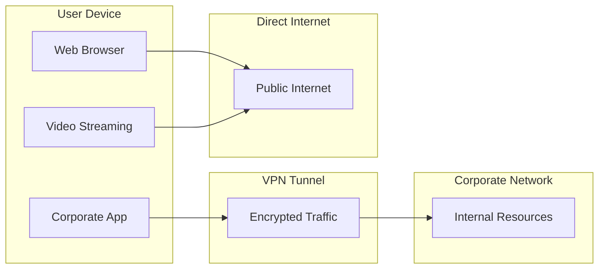
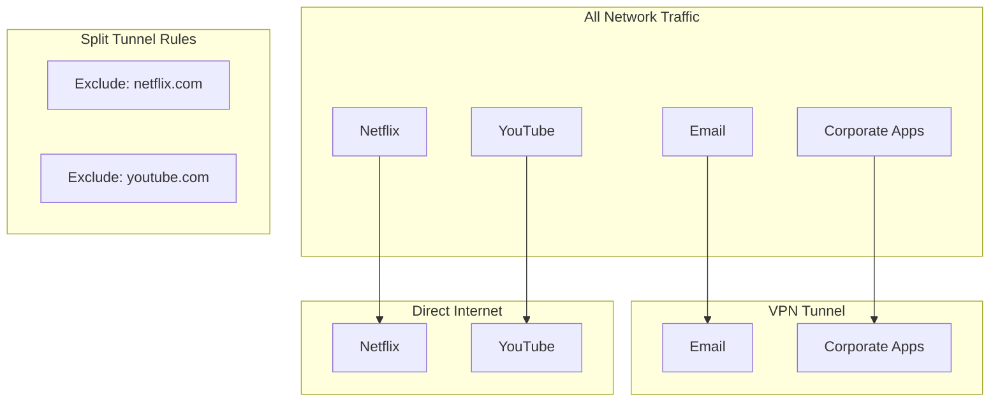
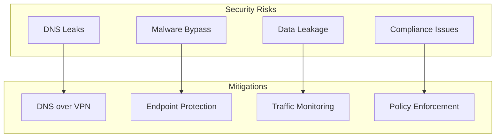

# How to Implement VPN Split Tunneling

Author: [nawazdhandala](https://github.com/nawazdhandala)

Tags: VPN, Split Tunneling, Networking, Security

Description: A comprehensive guide to implementing VPN split tunneling, covering configuration for major platforms, security considerations, practical code examples, and best practices for balancing performance with security in enterprise and remote work environments.

---

VPN split tunneling is one of those networking features that sounds complicated but can dramatically improve your network performance and user experience. Instead of forcing all traffic through your VPN tunnel, split tunneling lets you choose which traffic goes through the VPN and which traffic goes directly to the internet.

This guide will walk you through implementing split tunneling on various platforms, with practical code examples and configuration patterns you can use immediately.

---

## What is VPN Split Tunneling?

Split tunneling is a VPN feature that allows you to route some of your network traffic through an encrypted VPN tunnel while letting other traffic access the internet directly. This is different from full tunneling, where all traffic must pass through the VPN server.



---

## Types of Split Tunneling

There are three main approaches to split tunneling, each with different use cases:

### 1. Inverse Split Tunneling (Exclude Mode)

Only specified traffic bypasses the VPN. Everything else goes through the tunnel.



### 2. Include-Based Split Tunneling

Only specified traffic goes through the VPN. Everything else uses direct internet.

### 3. URL/Domain-Based Split Tunneling

Routes traffic based on destination domains or URLs rather than IP addresses.

---

## Implementing Split Tunneling on Linux

Linux provides powerful tools for implementing split tunneling using routing tables and iptables. Here is a complete implementation:

### Basic Route-Based Split Tunneling

```bash
#!/bin/bash
# split-tunnel.sh - Configure split tunneling on Linux

# Configuration
VPN_INTERFACE="tun0"
VPN_GATEWAY="10.8.0.1"
CORPORATE_NETWORKS=("10.0.0.0/8" "172.16.0.0/12" "192.168.100.0/24")
ROUTING_TABLE="100"
ROUTING_TABLE_NAME="vpn_split"

# Add custom routing table if not exists
if ! grep -q "$ROUTING_TABLE_NAME" /etc/iproute2/rt_tables; then
    echo "$ROUTING_TABLE $ROUTING_TABLE_NAME" >> /etc/iproute2/rt_tables
fi

# Function to enable split tunneling
enable_split_tunnel() {
    echo "Enabling split tunneling..."

    # Get default gateway for direct internet access
    DEFAULT_GW=$(ip route | grep default | awk '{print $3}' | head -1)
    DEFAULT_IF=$(ip route | grep default | awk '{print $5}' | head -1)

    # Mark packets destined for corporate networks
    for network in "${CORPORATE_NETWORKS[@]}"; do
        # Add route for corporate traffic through VPN
        ip route add "$network" via "$VPN_GATEWAY" dev "$VPN_INTERFACE" table main
        echo "Routing $network through VPN"
    done

    # Ensure default route uses direct internet
    ip route replace default via "$DEFAULT_GW" dev "$DEFAULT_IF" table main

    echo "Split tunneling enabled"
}

# Function to disable split tunneling
disable_split_tunnel() {
    echo "Disabling split tunneling..."

    for network in "${CORPORATE_NETWORKS[@]}"; do
        ip route del "$network" via "$VPN_GATEWAY" dev "$VPN_INTERFACE" 2>/dev/null
    done

    echo "Split tunneling disabled"
}

# Main execution
case "$1" in
    enable)
        enable_split_tunnel
        ;;
    disable)
        disable_split_tunnel
        ;;
    *)
        echo "Usage: $0 {enable|disable}"
        exit 1
        ;;
esac
```

### Advanced Implementation with Policy Routing

For more granular control, use policy-based routing with `ip rule`:

```bash
#!/bin/bash
# advanced-split-tunnel.sh - Policy-based split tunneling

# Mark traffic that should go through VPN
VPN_MARK="0x1"
VPN_TABLE="vpn"
DIRECT_TABLE="direct"

setup_policy_routing() {
    # Create routing tables
    echo "200 $VPN_TABLE" >> /etc/iproute2/rt_tables
    echo "201 $DIRECT_TABLE" >> /etc/iproute2/rt_tables

    # Get interfaces and gateways
    VPN_GW=$(ip route show dev tun0 | grep -oP 'via \K[\d.]+' | head -1)
    DEFAULT_GW=$(ip route | grep default | grep -v tun0 | awk '{print $3}')

    # Configure VPN routing table
    ip route add default via "$VPN_GW" dev tun0 table "$VPN_TABLE"

    # Configure direct routing table
    ip route add default via "$DEFAULT_GW" table "$DIRECT_TABLE"

    # Rule: marked packets use VPN table
    ip rule add fwmark "$VPN_MARK" table "$VPN_TABLE" priority 100

    # Rule: everything else uses direct table
    ip rule add table "$DIRECT_TABLE" priority 200
}

# Mark corporate traffic with iptables
mark_corporate_traffic() {
    local networks=("$@")

    for network in "${networks[@]}"; do
        iptables -t mangle -A OUTPUT -d "$network" -j MARK --set-mark "$VPN_MARK"
        iptables -t mangle -A PREROUTING -d "$network" -j MARK --set-mark "$VPN_MARK"
    done
}

# Example usage
setup_policy_routing
mark_corporate_traffic "10.0.0.0/8" "172.16.0.0/12" "192.168.100.0/24"
```

---

## Implementing Split Tunneling on macOS

macOS uses a different approach with `scutil` and routing tables:

```bash
#!/bin/bash
# macos-split-tunnel.sh - Split tunneling for macOS

VPN_SERVICE_NAME="Corporate VPN"
CORPORATE_SUBNETS=("10.0.0.0/8" "172.16.0.0/12")

get_vpn_interface() {
    scutil --nc list | grep "$VPN_SERVICE_NAME" | awk -F'"' '{print $2}'
}

configure_split_tunnel() {
    VPN_IF=$(get_vpn_interface)

    # Get VPN gateway
    VPN_GW=$(netstat -rn | grep "$VPN_IF" | grep -v link | awk '{print $2}' | head -1)

    # Get default gateway (non-VPN)
    DEFAULT_GW=$(netstat -rn | grep default | grep -v "$VPN_IF" | awk '{print $2}' | head -1)

    # Remove default route through VPN if exists
    sudo route delete default -interface "$VPN_IF" 2>/dev/null

    # Add routes for corporate subnets through VPN
    for subnet in "${CORPORATE_SUBNETS[@]}"; do
        sudo route add -net "$subnet" "$VPN_GW"
        echo "Added route: $subnet via $VPN_GW"
    done

    # Ensure default route uses regular gateway
    sudo route add default "$DEFAULT_GW"
}

# Run configuration
configure_split_tunnel
```

---

## Implementing Split Tunneling on Windows

Windows supports split tunneling through PowerShell and the VPN client configuration:

```powershell
# windows-split-tunnel.ps1 - Configure split tunneling on Windows

# VPN Connection name
$VpnName = "Corporate VPN"

# Networks to route through VPN
$VpnRoutes = @(
    "10.0.0.0/8",
    "172.16.0.0/12",
    "192.168.100.0/24"
)

function Enable-SplitTunnel {
    param (
        [string]$ConnectionName,
        [string[]]$Routes
    )

    # Disable default gateway on VPN connection
    Set-VpnConnection -Name $ConnectionName -SplitTunneling $true

    # Add routes for corporate networks
    foreach ($route in $Routes) {
        $network = $route.Split("/")[0]
        $prefix = $route.Split("/")[1]

        Add-VpnConnectionRoute -ConnectionName $ConnectionName `
            -DestinationPrefix $route -PassThru

        Write-Host "Added route: $route through VPN"
    }

    Write-Host "Split tunneling enabled for $ConnectionName"
}

function Disable-SplitTunnel {
    param (
        [string]$ConnectionName
    )

    # Enable default gateway (full tunnel)
    Set-VpnConnection -Name $ConnectionName -SplitTunneling $false

    # Remove custom routes
    $existingRoutes = Get-VpnConnectionRoute -ConnectionName $ConnectionName
    foreach ($route in $existingRoutes) {
        Remove-VpnConnectionRoute -ConnectionName $ConnectionName `
            -DestinationPrefix $route.DestinationPrefix -PassThru
    }

    Write-Host "Split tunneling disabled for $ConnectionName"
}

# Example: Enable split tunneling
Enable-SplitTunnel -ConnectionName $VpnName -Routes $VpnRoutes
```

### Windows Registry Method for Always-On VPN

```powershell
# Configure split tunneling via Windows Registry for Always-On VPN

$VpnProfileName = "Corporate_VPN"
$RegistryPath = "HKLM:\SOFTWARE\Microsoft\Windows\CurrentVersion\Policies\Network"

# Define traffic filters for split tunneling
$TrafficFilters = @"
<TrafficFilter>
    <App>
        <Id>*</Id>
    </App>
    <Claims>
        <Claim>
            <Sso>True</Sso>
        </Claim>
    </Claims>
    <Protocol>All</Protocol>
    <LocalPortRanges>All</LocalPortRanges>
    <RemotePortRanges>All</RemotePortRanges>
    <LocalAddressRanges>All</LocalAddressRanges>
    <RemoteAddressRanges>10.0.0.0/8,172.16.0.0/12</RemoteAddressRanges>
    <RoutingPolicyType>SplitTunnel</RoutingPolicyType>
</TrafficFilter>
"@

# Apply configuration
New-ItemProperty -Path $RegistryPath -Name "VPNTrafficFilters" `
    -Value $TrafficFilters -PropertyType String -Force
```

---

## OpenVPN Split Tunneling Configuration

OpenVPN is one of the most popular VPN solutions. Here is how to configure split tunneling:

### Server-Side Configuration

```conf
# /etc/openvpn/server.conf

# Basic server configuration
port 1194
proto udp
dev tun
ca ca.crt
cert server.crt
key server.key
dh dh2048.pem

# Network configuration
server 10.8.0.0 255.255.255.0

# Split tunneling - push only corporate routes
# Do NOT push redirect-gateway for split tunneling
# push "redirect-gateway def1 bypass-dhcp"  # Comment this out

# Push specific routes for corporate networks
push "route 10.0.0.0 255.0.0.0"
push "route 172.16.0.0 255.240.0.0"
push "route 192.168.100.0 255.255.255.0"

# Push DNS servers (optional)
push "dhcp-option DNS 10.0.0.53"
push "dhcp-option DOMAIN corp.example.com"

# Keep connection alive
keepalive 10 120

# Security settings
cipher AES-256-GCM
auth SHA256
```

### Client-Side Configuration

```conf
# client.ovpn

client
dev tun
proto udp
remote vpn.example.com 1194
resolv-retry infinite
nobind
persist-key
persist-tun

# Certificates
ca ca.crt
cert client.crt
key client.key

# Security
cipher AES-256-GCM
auth SHA256

# Split tunneling client settings
# Pull routes from server but don't use VPN as default gateway
pull
route-nopull

# Manually specify routes to use VPN
route 10.0.0.0 255.0.0.0 vpn_gateway
route 172.16.0.0 255.240.0.0 vpn_gateway
route 192.168.100.0 255.255.255.0 vpn_gateway
```

---

## WireGuard Split Tunneling

WireGuard makes split tunneling straightforward through its `AllowedIPs` configuration:

```ini
# /etc/wireguard/wg0.conf

[Interface]
PrivateKey = CLIENT_PRIVATE_KEY_HERE
Address = 10.200.200.2/32
DNS = 10.0.0.53

[Peer]
PublicKey = SERVER_PUBLIC_KEY_HERE
Endpoint = vpn.example.com:51820
PersistentKeepalive = 25

# Split tunneling - only route these networks through VPN
# Full tunnel would be: AllowedIPs = 0.0.0.0/0, ::/0
AllowedIPs = 10.0.0.0/8, 172.16.0.0/12, 192.168.100.0/24
```

### Dynamic WireGuard Configuration Script

```bash
#!/bin/bash
# wireguard-split-tunnel.sh - Dynamically configure WireGuard split tunneling

WG_INTERFACE="wg0"
WG_CONFIG="/etc/wireguard/${WG_INTERFACE}.conf"

# Corporate networks to route through VPN
CORPORATE_NETWORKS=(
    "10.0.0.0/8"
    "172.16.0.0/12"
    "192.168.100.0/24"
)

# Domains to resolve and add to split tunnel
CORPORATE_DOMAINS=(
    "internal.example.com"
    "gitlab.corp.example.com"
    "jira.corp.example.com"
)

resolve_domain_to_ip() {
    local domain=$1
    dig +short "$domain" | grep -E '^[0-9]+\.[0-9]+\.[0-9]+\.[0-9]+$'
}

generate_allowed_ips() {
    local allowed_ips=""

    # Add static networks
    for network in "${CORPORATE_NETWORKS[@]}"; do
        if [ -z "$allowed_ips" ]; then
            allowed_ips="$network"
        else
            allowed_ips="$allowed_ips, $network"
        fi
    done

    # Resolve and add domain IPs
    for domain in "${CORPORATE_DOMAINS[@]}"; do
        ip=$(resolve_domain_to_ip "$domain")
        if [ -n "$ip" ]; then
            allowed_ips="$allowed_ips, $ip/32"
        fi
    done

    echo "$allowed_ips"
}

update_wireguard_config() {
    local allowed_ips=$(generate_allowed_ips)

    # Update AllowedIPs in config
    sudo sed -i "s/^AllowedIPs = .*/AllowedIPs = $allowed_ips/" "$WG_CONFIG"

    # Restart WireGuard
    sudo wg-quick down "$WG_INTERFACE" 2>/dev/null
    sudo wg-quick up "$WG_INTERFACE"

    echo "WireGuard split tunnel updated with: $allowed_ips"
}

update_wireguard_config
```

---

## Application-Based Split Tunneling

Some scenarios require routing traffic based on the application rather than destination:

### Linux with cgroups

```bash
#!/bin/bash
# app-split-tunnel.sh - Application-based split tunneling using cgroups

CGROUP_NAME="vpn_apps"
VPN_MARK="0x1"
VPN_TABLE="100"

setup_cgroup_split_tunnel() {
    # Create cgroup for VPN apps
    sudo cgcreate -g net_cls:/$CGROUP_NAME

    # Assign a classid to the cgroup
    echo "0x00010001" | sudo tee /sys/fs/cgroup/net_cls/$CGROUP_NAME/net_cls.classid

    # Mark packets from this cgroup
    sudo iptables -t mangle -A OUTPUT -m cgroup --cgroup 0x00010001 \
        -j MARK --set-mark $VPN_MARK

    # Route marked packets through VPN
    sudo ip rule add fwmark $VPN_MARK table $VPN_TABLE priority 100

    # Add VPN route to table
    VPN_GW=$(ip route show dev tun0 | awk '/via/ {print $3}')
    sudo ip route add default via $VPN_GW dev tun0 table $VPN_TABLE
}

run_app_through_vpn() {
    local app_command="$@"
    sudo cgexec -g net_cls:/$CGROUP_NAME -- sudo -u $USER $app_command
}

# Setup
setup_cgroup_split_tunnel

# Example: Run specific apps through VPN
# run_app_through_vpn firefox
# run_app_through_vpn git clone git@corp.example.com:repo.git
```

### Network Namespace Approach

```bash
#!/bin/bash
# namespace-split-tunnel.sh - Split tunneling using network namespaces

NS_NAME="vpn_ns"
VETH_HOST="veth_host"
VETH_NS="veth_ns"

create_vpn_namespace() {
    # Create network namespace
    sudo ip netns add $NS_NAME

    # Create veth pair
    sudo ip link add $VETH_HOST type veth peer name $VETH_NS

    # Move one end to namespace
    sudo ip link set $VETH_NS netns $NS_NAME

    # Configure host side
    sudo ip addr add 192.168.254.1/24 dev $VETH_HOST
    sudo ip link set $VETH_HOST up

    # Configure namespace side
    sudo ip netns exec $NS_NAME ip addr add 192.168.254.2/24 dev $VETH_NS
    sudo ip netns exec $NS_NAME ip link set $VETH_NS up
    sudo ip netns exec $NS_NAME ip link set lo up
    sudo ip netns exec $NS_NAME ip route add default via 192.168.254.1

    # Enable NAT for namespace traffic
    sudo iptables -t nat -A POSTROUTING -s 192.168.254.0/24 -o tun0 -j MASQUERADE
    sudo sysctl -w net.ipv4.ip_forward=1
}

run_in_vpn_namespace() {
    sudo ip netns exec $NS_NAME sudo -u $USER "$@"
}

# Setup namespace
create_vpn_namespace

# Run apps in VPN namespace
# run_in_vpn_namespace curl https://internal.corp.example.com
```

---

## Security Considerations

Split tunneling introduces security trade-offs that must be carefully considered:



### DNS Leak Prevention

```bash
#!/bin/bash
# dns-leak-prevention.sh - Prevent DNS leaks with split tunneling

# Force corporate DNS queries through VPN
CORPORATE_DOMAINS=("corp.example.com" "internal.example.com")
VPN_DNS="10.0.0.53"

configure_dns_split() {
    # Create dnsmasq configuration for split DNS
    cat > /etc/dnsmasq.d/split-tunnel.conf << EOF
# Route corporate domains to VPN DNS
server=/corp.example.com/$VPN_DNS
server=/internal.example.com/$VPN_DNS

# Use default DNS for everything else
server=8.8.8.8
server=8.8.4.4
EOF

    # Restart dnsmasq
    sudo systemctl restart dnsmasq

    # Update resolv.conf to use local dnsmasq
    echo "nameserver 127.0.0.1" | sudo tee /etc/resolv.conf
}

configure_dns_split
```

### Firewall Rules for Split Tunneling Security

```bash
#!/bin/bash
# secure-split-tunnel-firewall.sh

VPN_INTERFACE="tun0"
CORPORATE_NETWORKS=("10.0.0.0/8" "172.16.0.0/12")

setup_firewall() {
    # Allow established connections
    iptables -A INPUT -m state --state ESTABLISHED,RELATED -j ACCEPT
    iptables -A OUTPUT -m state --state ESTABLISHED,RELATED -j ACCEPT

    # Allow corporate traffic only through VPN
    for network in "${CORPORATE_NETWORKS[@]}"; do
        # Block corporate traffic on non-VPN interfaces
        iptables -A OUTPUT -d "$network" ! -o "$VPN_INTERFACE" -j DROP

        # Allow corporate traffic through VPN
        iptables -A OUTPUT -d "$network" -o "$VPN_INTERFACE" -j ACCEPT
    done

    # Allow all other outbound traffic
    iptables -A OUTPUT -j ACCEPT

    # Log dropped packets for monitoring
    iptables -A OUTPUT -j LOG --log-prefix "SPLIT-TUNNEL-DROP: "
}

setup_firewall
```

---

## Monitoring Split Tunnel Traffic

Understanding what traffic flows where is crucial for troubleshooting and security:

```python
#!/usr/bin/env python3
"""
split_tunnel_monitor.py - Monitor split tunnel traffic flows
"""

import subprocess
import re
from collections import defaultdict
from datetime import datetime

class SplitTunnelMonitor:
    def __init__(self, vpn_interface="tun0", sample_interval=5):
        self.vpn_interface = vpn_interface
        self.sample_interval = sample_interval
        self.traffic_stats = defaultdict(lambda: {"vpn": 0, "direct": 0})

    def get_interface_stats(self, interface):
        """Get current byte counts for an interface."""
        try:
            with open(f"/sys/class/net/{interface}/statistics/tx_bytes") as f:
                tx = int(f.read().strip())
            with open(f"/sys/class/net/{interface}/statistics/rx_bytes") as f:
                rx = int(f.read().strip())
            return tx + rx
        except FileNotFoundError:
            return 0

    def get_connection_info(self):
        """Get current network connections and their interfaces."""
        result = subprocess.run(
            ["ss", "-tunp"],
            capture_output=True,
            text=True
        )

        connections = []
        for line in result.stdout.split("\n")[1:]:
            if line.strip():
                parts = line.split()
                if len(parts) >= 5:
                    connections.append({
                        "protocol": parts[0],
                        "local": parts[4],
                        "remote": parts[5] if len(parts) > 5 else "",
                        "state": parts[1]
                    })
        return connections

    def classify_traffic(self, destination):
        """Determine if traffic goes through VPN or direct."""
        result = subprocess.run(
            ["ip", "route", "get", destination],
            capture_output=True,
            text=True
        )

        if self.vpn_interface in result.stdout:
            return "vpn"
        return "direct"

    def generate_report(self):
        """Generate a traffic flow report."""
        connections = self.get_connection_info()

        report = {
            "timestamp": datetime.now().isoformat(),
            "vpn_interface": self.vpn_interface,
            "connections": {
                "vpn": [],
                "direct": []
            }
        }

        for conn in connections:
            if conn["remote"]:
                dest_ip = conn["remote"].split(":")[0]
                route_type = self.classify_traffic(dest_ip)
                report["connections"][route_type].append(conn)

        return report

    def print_report(self):
        """Print a formatted traffic report."""
        report = self.generate_report()

        print(f"\n=== Split Tunnel Traffic Report ===")
        print(f"Time: {report['timestamp']}")
        print(f"VPN Interface: {report['vpn_interface']}")
        print(f"\nVPN Traffic ({len(report['connections']['vpn'])} connections):")

        for conn in report["connections"]["vpn"][:10]:
            print(f"  {conn['protocol']} {conn['local']} -> {conn['remote']}")

        print(f"\nDirect Traffic ({len(report['connections']['direct'])} connections):")

        for conn in report["connections"]["direct"][:10]:
            print(f"  {conn['protocol']} {conn['local']} -> {conn['remote']}")


if __name__ == "__main__":
    monitor = SplitTunnelMonitor()
    monitor.print_report()
```

---

## Testing Your Split Tunnel Configuration

Always verify your split tunnel is working correctly:

```bash
#!/bin/bash
# test-split-tunnel.sh - Verify split tunnel configuration

# Colors for output
GREEN='\033[0;32m'
RED='\033[0;31m'
NC='\033[0m'

# Test destinations
CORPORATE_HOST="internal.corp.example.com"
CORPORATE_IP="10.0.1.100"
PUBLIC_HOST="ifconfig.me"

test_route() {
    local destination=$1
    local expected_interface=$2

    route_info=$(ip route get "$destination" 2>/dev/null)
    actual_interface=$(echo "$route_info" | grep -oP 'dev \K\S+')

    if [ "$actual_interface" = "$expected_interface" ]; then
        echo -e "${GREEN}[PASS]${NC} $destination routes through $actual_interface"
        return 0
    else
        echo -e "${RED}[FAIL]${NC} $destination routes through $actual_interface (expected: $expected_interface)"
        return 1
    fi
}

test_connectivity() {
    local host=$1
    local description=$2

    if ping -c 1 -W 2 "$host" > /dev/null 2>&1; then
        echo -e "${GREEN}[PASS]${NC} Connectivity to $description ($host)"
        return 0
    else
        echo -e "${RED}[FAIL]${NC} No connectivity to $description ($host)"
        return 1
    fi
}

test_public_ip() {
    local vpn_expected=$1

    public_ip=$(curl -s --max-time 5 https://ifconfig.me)

    if [ -n "$public_ip" ]; then
        echo -e "${GREEN}[INFO]${NC} Public IP: $public_ip"

        if [ "$vpn_expected" = "true" ]; then
            echo "       (Should be VPN exit IP)"
        else
            echo "       (Should be your real IP - split tunnel working)"
        fi
    else
        echo -e "${RED}[FAIL]${NC} Could not determine public IP"
    fi
}

echo "=== Split Tunnel Configuration Test ==="
echo ""

echo "Testing routes..."
test_route "$CORPORATE_IP" "tun0"
test_route "8.8.8.8" "eth0"

echo ""
echo "Testing connectivity..."
test_connectivity "$CORPORATE_IP" "Corporate network"
test_connectivity "8.8.8.8" "Public internet"

echo ""
echo "Testing public IP (should NOT be VPN IP for split tunnel)..."
test_public_ip "false"

echo ""
echo "=== Test Complete ==="
```

---

## Troubleshooting Common Issues

### Issue: Traffic Not Routing Through VPN

```bash
# Check if VPN interface is up
ip link show tun0

# Verify routes are added
ip route show | grep tun0

# Check for conflicting routes
ip route show table all | grep "10.0.0.0"

# Verify VPN gateway is reachable
ping -c 3 $(ip route show dev tun0 | grep via | awk '{print $3}')
```

### Issue: DNS Resolution Failing

```bash
# Test DNS resolution through VPN DNS
dig @10.0.0.53 internal.corp.example.com

# Check /etc/resolv.conf
cat /etc/resolv.conf

# Test with nslookup
nslookup internal.corp.example.com 10.0.0.53
```

### Issue: Split Tunnel Routes Disappearing

```bash
# Add routes persistently via NetworkManager dispatcher
cat > /etc/NetworkManager/dispatcher.d/99-split-tunnel << 'EOF'
#!/bin/bash
INTERFACE=$1
STATUS=$2

if [ "$INTERFACE" = "tun0" ] && [ "$STATUS" = "up" ]; then
    /usr/local/bin/split-tunnel.sh enable
fi
EOF

chmod +x /etc/NetworkManager/dispatcher.d/99-split-tunnel
```

---

## Best Practices

1. **Document Your Configuration**: Keep clear documentation of which networks route through VPN and why.

2. **Use Infrastructure as Code**: Define split tunnel configurations in version-controlled scripts.

3. **Monitor Traffic Flows**: Regularly audit which traffic uses which path.

4. **Test After Changes**: Always verify split tunneling works after VPN or network changes.

5. **Consider Compliance**: Ensure split tunneling aligns with your organization's security policies.

6. **Implement Fallbacks**: Have procedures for when full tunneling is required.

7. **Keep DNS Secure**: Always route corporate DNS queries through the VPN.

---

## Conclusion

VPN split tunneling is a powerful technique that can dramatically improve network performance while maintaining secure access to corporate resources. By carefully configuring which traffic routes through your VPN, you can reduce latency for public services, decrease VPN server load, and improve the overall user experience.

The key is to implement split tunneling thoughtfully, with clear policies about what traffic should be protected and robust monitoring to ensure the configuration works as intended. Whether you are using OpenVPN, WireGuard, or native OS VPN clients, the principles remain the same: define your corporate networks, configure the routes, and verify the setup works correctly.

Start with a conservative configuration that routes more traffic through the VPN, then gradually refine based on your security requirements and performance needs.
