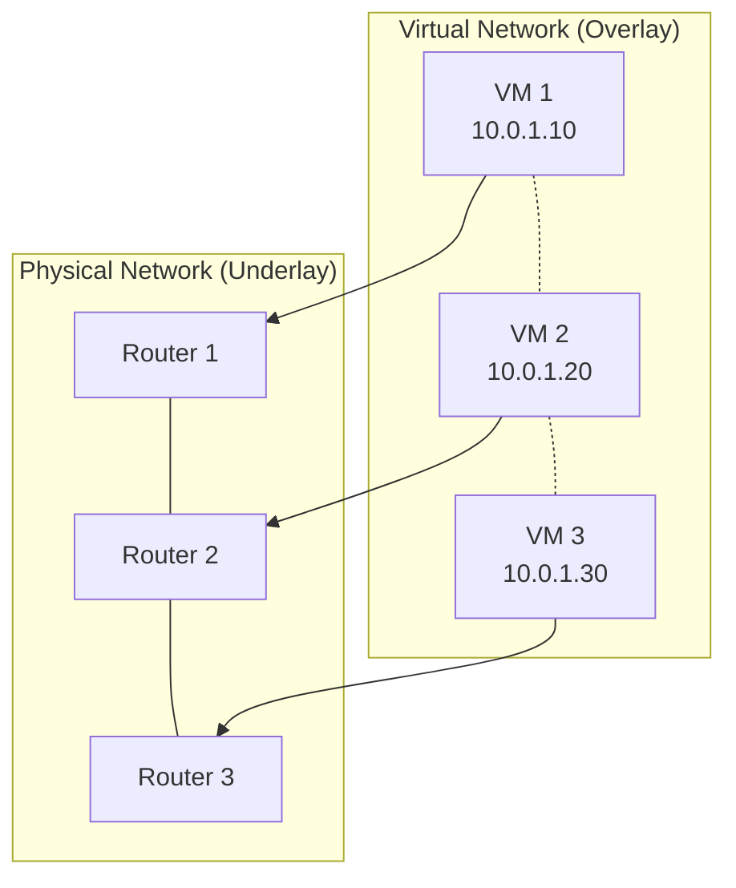
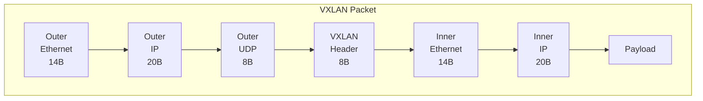
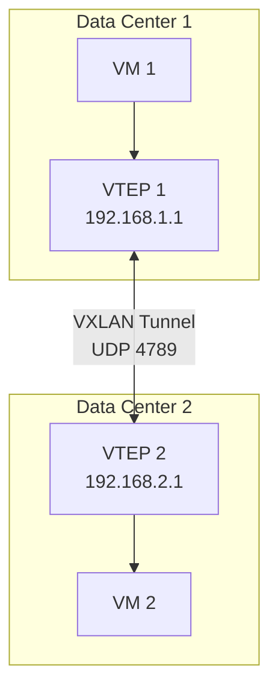
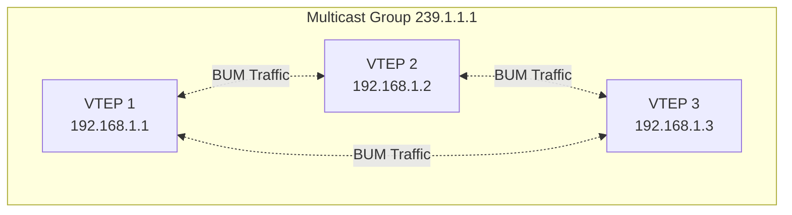
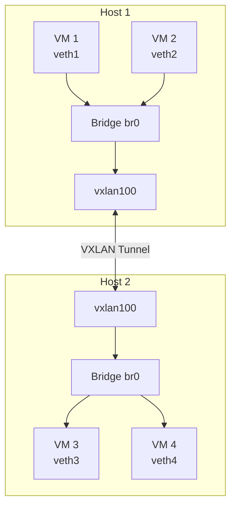
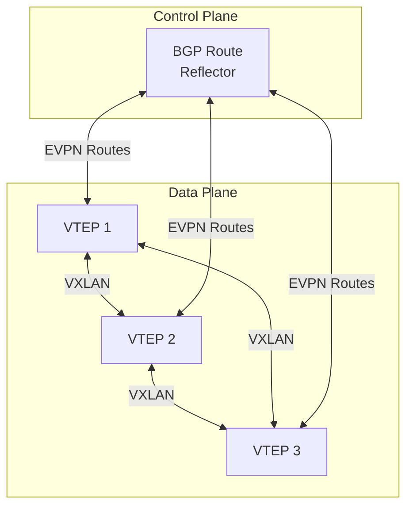
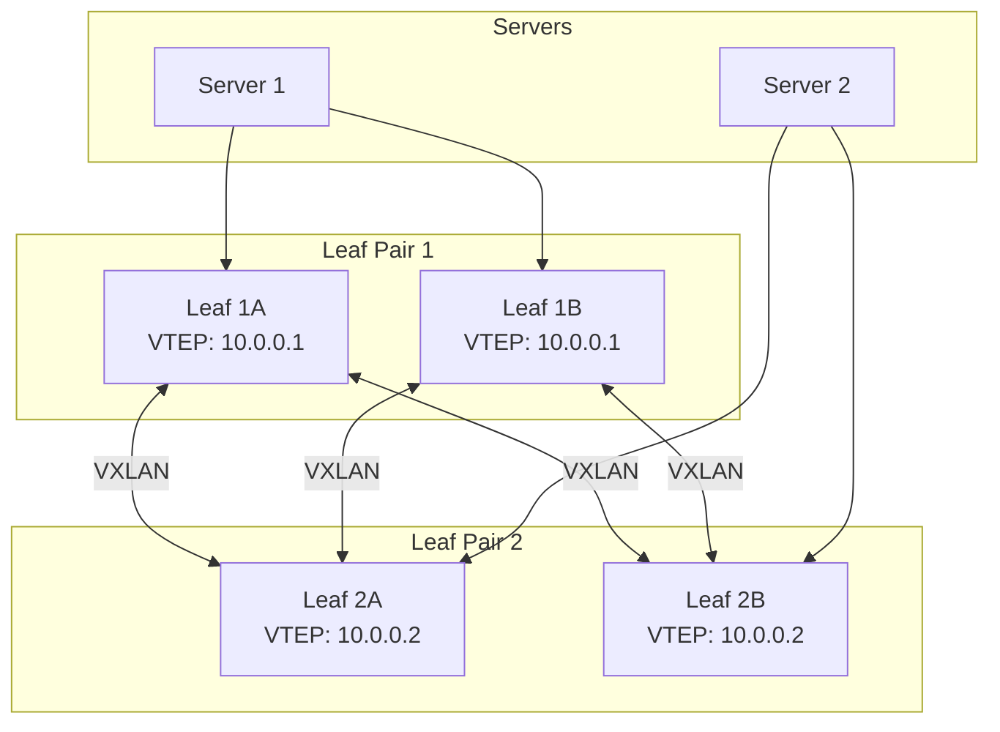
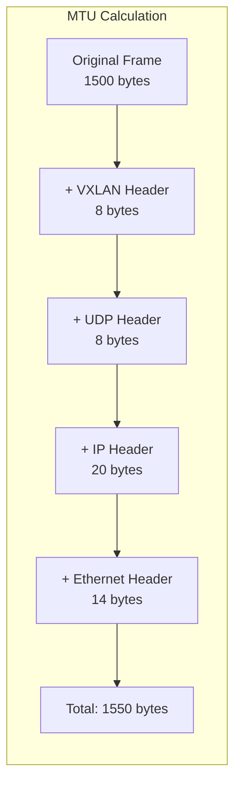

# How to Implement VXLAN Overlay Networks

Author: [nawazdhandala](https://github.com/nawazdhandala)

Tags: VXLAN, Networking, Overlay, SDN

Description: A comprehensive guide to implementing VXLAN overlay networks for scalable multi-tenant data center connectivity. Learn VXLAN architecture, configuration, troubleshooting, and production best practices.

---

> Traditional VLANs limit you to 4,096 network segments. VXLAN breaks this barrier with over 16 million virtual networks, enabling massive multi-tenant environments and seamless workload mobility across data centers.

Network scalability is a fundamental requirement for modern data centers. VXLAN provides the solution.

---

## What is VXLAN?

VXLAN (Virtual Extensible LAN) is a network virtualization technology that encapsulates Layer 2 Ethernet frames within Layer 3 UDP packets. This overlay approach allows you to create virtual Layer 2 networks that span across Layer 3 boundaries.



### Key Benefits

- **Scale**: 24-bit VNI supports 16 million+ virtual networks (vs 4,096 VLANs)
- **Flexibility**: Layer 2 connectivity over Layer 3 infrastructure
- **Mobility**: Seamless VM migration across data centers
- **Multi-tenancy**: Complete network isolation between tenants

---

## VXLAN Architecture

### Packet Structure

VXLAN adds a 50-byte header to encapsulate the original Ethernet frame:



The VXLAN header contains:

| Field | Size | Description |
|-------|------|-------------|
| Flags | 8 bits | VXLAN flags (I flag indicates valid VNI) |
| Reserved | 24 bits | Reserved for future use |
| VNI | 24 bits | VXLAN Network Identifier |
| Reserved | 8 bits | Reserved for future use |

### VTEP (VXLAN Tunnel Endpoint)

VTEPs are the devices that perform VXLAN encapsulation and decapsulation:



---

## Linux VXLAN Implementation

### Basic VXLAN Interface

Create a VXLAN interface on Linux using the `ip` command. This example creates a point-to-point VXLAN tunnel between two hosts:

```bash
#!/bin/bash
# vxlan-setup.sh - Create a basic VXLAN interface

# Configuration variables
VNI=100                    # VXLAN Network Identifier
VXLAN_IF="vxlan100"        # VXLAN interface name
LOCAL_IP="192.168.1.10"    # Local VTEP IP address
REMOTE_IP="192.168.1.20"   # Remote VTEP IP address
VXLAN_PORT=4789            # Standard VXLAN UDP port

# Create VXLAN interface
# id: VNI for this tunnel
# local: Source IP for outer header
# remote: Destination VTEP IP (unicast mode)
# dstport: UDP destination port
ip link add ${VXLAN_IF} type vxlan \
    id ${VNI} \
    local ${LOCAL_IP} \
    remote ${REMOTE_IP} \
    dstport ${VXLAN_PORT}

# Bring up the interface
ip link set ${VXLAN_IF} up

# Assign an IP address to the VXLAN interface
# This IP is used for communication within the overlay network
ip addr add 10.0.100.1/24 dev ${VXLAN_IF}

echo "VXLAN interface ${VXLAN_IF} created with VNI ${VNI}"
```

### Verify VXLAN Interface

Check the VXLAN interface configuration and status:

```bash
# View VXLAN interface details
ip -d link show vxlan100

# Expected output:
# vxlan100: <BROADCAST,MULTICAST,UP,LOWER_UP> mtu 1450 qdisc noqueue state UNKNOWN
#     link/ether 5a:8b:c3:d4:e5:f6 brd ff:ff:ff:ff:ff:ff
#     vxlan id 100 local 192.168.1.10 remote 192.168.1.20 dev eth0 srcport 0 0 dstport 4789

# View assigned IP address
ip addr show vxlan100

# Check routing table for overlay network
ip route show | grep vxlan
```

---

## Multicast-Based VXLAN

For environments with multiple VTEPs, multicast provides automatic peer discovery without manual configuration:



### Configure Multicast VXLAN

```bash
#!/bin/bash
# vxlan-multicast.sh - VXLAN with multicast for BUM traffic

VNI=200
VXLAN_IF="vxlan200"
LOCAL_IP="192.168.1.10"
MCAST_GROUP="239.1.1.1"      # Multicast group for this VNI
PHYSICAL_IF="eth0"           # Physical interface for multicast

# Create VXLAN interface with multicast
# group: Multicast address for BUM (Broadcast, Unknown unicast, Multicast) traffic
# dev: Physical interface to send/receive multicast
ip link add ${VXLAN_IF} type vxlan \
    id ${VNI} \
    local ${LOCAL_IP} \
    group ${MCAST_GROUP} \
    dev ${PHYSICAL_IF} \
    dstport 4789

ip link set ${VXLAN_IF} up
ip addr add 10.0.200.1/24 dev ${VXLAN_IF}

# Verify multicast group membership
ip maddr show dev ${PHYSICAL_IF}
```

### Multicast Requirements

Ensure your underlay network supports multicast:

```bash
# Enable multicast routing on Linux router
echo 1 > /proc/sys/net/ipv4/ip_forward
echo 0 > /proc/sys/net/ipv4/icmp_echo_ignore_broadcasts

# Install and configure multicast routing daemon
apt install pimd

# Verify multicast routing
ip mroute show
```

---

## VXLAN with Bridge Integration

Connect VMs to VXLAN overlay by bridging the VXLAN interface with local virtual interfaces:



### Bridge Configuration Script

```bash
#!/bin/bash
# vxlan-bridge.sh - Create VXLAN with bridge for VM connectivity

# Network configuration
VNI=300
BRIDGE_NAME="br-vxlan300"
VXLAN_IF="vxlan300"
LOCAL_IP="192.168.1.10"
REMOTE_IP="192.168.1.20"

# Create the VXLAN interface
ip link add ${VXLAN_IF} type vxlan \
    id ${VNI} \
    local ${LOCAL_IP} \
    remote ${REMOTE_IP} \
    dstport 4789 \
    learning    # Enable MAC learning for the bridge

# Create a bridge to connect VMs
ip link add ${BRIDGE_NAME} type bridge

# Set bridge properties
# Enable VLAN filtering for additional isolation if needed
ip link set ${BRIDGE_NAME} type bridge vlan_filtering 0

# Attach VXLAN interface to the bridge
ip link set ${VXLAN_IF} master ${BRIDGE_NAME}

# Bring up interfaces in order
ip link set ${VXLAN_IF} up
ip link set ${BRIDGE_NAME} up

# Optional: Assign IP to bridge for host access to overlay
ip addr add 10.0.300.1/24 dev ${BRIDGE_NAME}

echo "VXLAN bridge ${BRIDGE_NAME} ready for VM connections"
```

### Connect a VM or Container

```bash
# Create a veth pair for a VM/container
ip link add veth-vm1 type veth peer name veth-vm1-br

# Attach one end to the bridge
ip link set veth-vm1-br master br-vxlan300
ip link set veth-vm1-br up

# Move the other end to a network namespace (simulating a VM)
ip netns add vm1
ip link set veth-vm1 netns vm1

# Configure the interface inside the namespace
ip netns exec vm1 ip addr add 10.0.300.10/24 dev veth-vm1
ip netns exec vm1 ip link set veth-vm1 up
ip netns exec vm1 ip link set lo up

# Test connectivity
ip netns exec vm1 ping -c 3 10.0.300.1
```

---

## EVPN-VXLAN for Production

For production environments, EVPN (Ethernet VPN) with BGP provides control plane automation, eliminating the need for multicast:



### FRRouting EVPN Configuration

Install and configure FRRouting for EVPN-VXLAN:

```bash
# Install FRRouting
apt install frr

# Enable BGP and EVPN daemons
cat > /etc/frr/daemons << 'EOF'
bgpd=yes
zebra=yes
EOF

systemctl restart frr
```

Configure BGP with EVPN address family:

```bash
# /etc/frr/frr.conf
# FRRouting configuration for EVPN-VXLAN

frr version 8.4
frr defaults traditional
hostname vtep1
log syslog informational

# BGP configuration
router bgp 65001
 bgp router-id 192.168.1.10
 no bgp default ipv4-unicast

 # BGP neighbor - Route Reflector
 neighbor 192.168.1.1 remote-as 65001
 neighbor 192.168.1.1 update-source lo

 # EVPN address family for VXLAN control plane
 address-family l2vpn evpn
  neighbor 192.168.1.1 activate
  # Advertise all local VNIs
  advertise-all-vni
 exit-address-family

# VNI configuration for EVPN
vni 100
 rd 192.168.1.10:100
 route-target import 65001:100
 route-target export 65001:100
exit
```

### Create EVPN-Enabled VXLAN Interface

```bash
#!/bin/bash
# evpn-vxlan.sh - VXLAN interface for EVPN control plane

VNI=100
VXLAN_IF="vxlan100"
LOCAL_IP="192.168.1.10"
BRIDGE_NAME="br100"

# Create VXLAN interface without remote IP
# EVPN/BGP will handle peer discovery
ip link add ${VXLAN_IF} type vxlan \
    id ${VNI} \
    local ${LOCAL_IP} \
    dstport 4789 \
    nolearning   # Disable data-plane learning, EVPN handles it

# Create and configure bridge
ip link add ${BRIDGE_NAME} type bridge
ip link set ${BRIDGE_NAME} addrgenmode none
ip link set ${BRIDGE_NAME} type bridge stp_state 0

# Disable bridge learning on VXLAN port (EVPN provides MAC info)
ip link set ${VXLAN_IF} master ${BRIDGE_NAME}
bridge link set dev ${VXLAN_IF} learning off

# Bring up interfaces
ip link set ${VXLAN_IF} up
ip link set ${BRIDGE_NAME} up
```

---

## High Availability Design

### Anycast VTEP Architecture

Deploy multiple VTEPs with the same IP address for redundancy and load balancing:



### MLAG with VXLAN

Configure MLAG (Multi-Chassis Link Aggregation) for server dual-homing:

```bash
#!/bin/bash
# mlag-vxlan.sh - MLAG configuration for VXLAN redundancy

# Create bond interface on server
ip link add bond0 type bond mode 802.3ad

# Add physical interfaces to bond
ip link set eth0 master bond0
ip link set eth1 master bond0

# Configure bond parameters
ip link set bond0 type bond miimon 100
ip link set bond0 type bond lacp_rate fast

ip link set bond0 up

# VXLAN interface uses the bond's IP for redundancy
BOND_IP=$(ip -4 addr show bond0 | grep inet | awk '{print $2}' | cut -d/ -f1)

ip link add vxlan100 type vxlan \
    id 100 \
    local ${BOND_IP} \
    dstport 4789
```

---

## MTU Configuration

VXLAN adds 50 bytes of overhead. Proper MTU configuration prevents fragmentation:



### Configure Jumbo Frames

```bash
#!/bin/bash
# mtu-config.sh - Configure MTU for VXLAN

# Set underlay interface to jumbo frames
# This allows full 1500-byte inner frames
ip link set eth0 mtu 9000

# Set VXLAN interface MTU
# Underlay MTU (9000) - VXLAN overhead (50) = 8950
ip link set vxlan100 mtu 8950

# For standard MTU underlay (1500), reduce inner MTU
# Inner MTU = 1500 - 50 = 1450
ip link set vxlan100 mtu 1450

# Verify MTU settings
ip link show eth0 | grep mtu
ip link show vxlan100 | grep mtu
```

### Path MTU Discovery

Enable PMTUD to handle varying MTU across the path:

```bash
# Enable Path MTU Discovery
sysctl -w net.ipv4.ip_no_pmtu_disc=0

# Allow ICMP fragmentation needed messages
iptables -A INPUT -p icmp --icmp-type fragmentation-needed -j ACCEPT

# Check current PMTU to a remote VTEP
ip route get 192.168.2.1 | grep mtu
```

---

## Troubleshooting VXLAN

### Common Diagnostic Commands

```bash
#!/bin/bash
# vxlan-diagnostics.sh - VXLAN troubleshooting commands

echo "=== VXLAN Interface Status ==="
ip -d link show type vxlan

echo ""
echo "=== FDB (Forwarding Database) Entries ==="
# Shows MAC-to-VTEP mappings
bridge fdb show dev vxlan100

echo ""
echo "=== ARP Table for Overlay ==="
ip neigh show dev br-vxlan100

echo ""
echo "=== VXLAN Statistics ==="
# Requires kernel 4.17+
ip -s link show vxlan100

echo ""
echo "=== UDP Port 4789 Listening ==="
ss -ulnp | grep 4789

echo ""
echo "=== Multicast Group Membership ==="
ip maddr show
```

### Packet Capture for VXLAN

```bash
# Capture VXLAN traffic on physical interface
tcpdump -i eth0 -nn 'udp port 4789' -w vxlan.pcap

# Decode VXLAN headers with detailed output
tcpdump -i eth0 -nn -v 'udp port 4789'

# Filter by specific VNI (requires tshark)
tshark -i eth0 -f 'udp port 4789' -Y 'vxlan.vni == 100'

# Capture inner traffic on VXLAN interface
tcpdump -i vxlan100 -nn icmp
```

### Debug FDB Learning

```bash
# Watch FDB changes in real-time
bridge monitor fdb dev vxlan100

# Manually add static FDB entry
# Useful for debugging connectivity
bridge fdb add 00:11:22:33:44:55 dev vxlan100 dst 192.168.2.1

# Delete FDB entry
bridge fdb del 00:11:22:33:44:55 dev vxlan100
```

---

## Performance Optimization

### Offload to Hardware

Modern NICs support VXLAN offload for improved performance:

```bash
# Check if NIC supports VXLAN offload
ethtool -k eth0 | grep -i vxlan

# Expected output:
# tx-udp_tnl-segmentation: on
# tx-udp_tnl-csum-segmentation: on

# Enable VXLAN offload features
ethtool -K eth0 tx-udp_tnl-segmentation on
ethtool -K eth0 tx-udp_tnl-csum-segmentation on

# Configure VXLAN port for offload
ethtool -K eth0 rx-udp_tunnel-port-offload on

# Add VXLAN port to offload list
ip link add vxlan100 type vxlan \
    id 100 \
    local 192.168.1.10 \
    dstport 4789 \
    udp6zerocsumrx \
    udp6zerocsumtx
```

### Kernel Tuning

```bash
# /etc/sysctl.d/99-vxlan.conf
# Kernel parameters for VXLAN performance

# Increase socket buffer sizes
net.core.rmem_max = 134217728
net.core.wmem_max = 134217728
net.core.rmem_default = 33554432
net.core.wmem_default = 33554432

# Increase UDP buffer sizes
net.ipv4.udp_mem = 65536 131072 262144

# Increase ARP cache size for large overlay networks
net.ipv4.neigh.default.gc_thresh1 = 4096
net.ipv4.neigh.default.gc_thresh2 = 8192
net.ipv4.neigh.default.gc_thresh3 = 16384

# Increase FDB table size
net.bridge.bridge-nf-call-iptables = 0
```

Apply the settings:

```bash
sysctl -p /etc/sysctl.d/99-vxlan.conf
```

---

## Container Runtime Integration

### Docker VXLAN Overlay

Docker Swarm uses VXLAN for overlay networking:

```bash
# Initialize Docker Swarm
docker swarm init --advertise-addr 192.168.1.10

# Create VXLAN-based overlay network
docker network create \
    --driver overlay \
    --subnet 10.0.50.0/24 \
    --opt encrypted \
    my-overlay

# Deploy service on overlay
docker service create \
    --name web \
    --network my-overlay \
    --replicas 3 \
    nginx

# Inspect overlay network VNI
docker network inspect my-overlay | grep -i vxlan
```

### Kubernetes CNI with VXLAN

Flannel CNI plugin uses VXLAN for pod networking:

```yaml
# flannel-config.yaml
# ConfigMap for Flannel with VXLAN backend

apiVersion: v1
kind: ConfigMap
metadata:
  name: kube-flannel-cfg
  namespace: kube-system
data:
  net-conf.json: |
    {
      "Network": "10.244.0.0/16",
      "Backend": {
        "Type": "vxlan",
        "VNI": 1,
        "Port": 4789,
        "DirectRouting": false
      }
    }
```

Deploy Flannel:

```bash
# Apply Flannel with VXLAN backend
kubectl apply -f https://raw.githubusercontent.com/flannel-io/flannel/master/Documentation/kube-flannel.yml

# Verify VXLAN interfaces on nodes
kubectl get nodes -o wide
ssh node1 'ip -d link show flannel.1'
```

---

## Security Considerations

### Encrypt VXLAN Traffic with IPsec

```bash
#!/bin/bash
# ipsec-vxlan.sh - IPsec encryption for VXLAN traffic

# Install strongSwan
apt install strongswan

# Configure IPsec for VXLAN traffic
cat > /etc/ipsec.conf << 'EOF'
config setup
    charondebug="all"

conn vxlan-tunnel
    type=transport
    authby=psk
    left=192.168.1.10
    right=192.168.1.20
    leftprotoport=udp/4789
    rightprotoport=udp/4789
    auto=start
    ike=aes256-sha256-modp2048
    esp=aes256-sha256
EOF

# Set pre-shared key
echo '192.168.1.20 : PSK "your-secret-key"' >> /etc/ipsec.secrets

# Start IPsec
ipsec restart
ipsec status
```

### VXLAN Access Control

```bash
# Firewall rules for VXLAN
# Allow VXLAN from trusted VTEPs only
iptables -A INPUT -p udp --dport 4789 -s 192.168.1.0/24 -j ACCEPT
iptables -A INPUT -p udp --dport 4789 -j DROP

# Allow multicast for VXLAN
iptables -A INPUT -d 239.1.1.0/24 -j ACCEPT

# Log unauthorized VXLAN attempts
iptables -A INPUT -p udp --dport 4789 -j LOG --log-prefix "VXLAN-DENIED: "
```

---

## Monitoring VXLAN Networks

### Key Metrics to Track

```bash
#!/bin/bash
# vxlan-metrics.sh - Collect VXLAN metrics

echo "=== VXLAN Interface Statistics ==="
cat /sys/class/net/vxlan100/statistics/rx_packets
cat /sys/class/net/vxlan100/statistics/tx_packets
cat /sys/class/net/vxlan100/statistics/rx_errors
cat /sys/class/net/vxlan100/statistics/tx_errors
cat /sys/class/net/vxlan100/statistics/rx_dropped
cat /sys/class/net/vxlan100/statistics/tx_dropped

echo ""
echo "=== FDB Entry Count ==="
bridge fdb show dev vxlan100 | wc -l

echo ""
echo "=== Underlay Network Stats ==="
ethtool -S eth0 | grep -E 'rx_|tx_' | head -20
```

### Prometheus Node Exporter

Add custom VXLAN metrics to Prometheus:

```yaml
# /etc/node_exporter/textfile/vxlan.prom
# Custom VXLAN metrics for Prometheus

# HELP vxlan_fdb_entries Number of FDB entries per VXLAN interface
# TYPE vxlan_fdb_entries gauge
vxlan_fdb_entries{interface="vxlan100"} 42

# HELP vxlan_tunnel_up VXLAN tunnel status
# TYPE vxlan_tunnel_up gauge
vxlan_tunnel_up{vni="100",remote="192.168.2.1"} 1
```

Generate metrics script:

```bash
#!/bin/bash
# generate-vxlan-metrics.sh - Generate Prometheus metrics

OUTPUT="/etc/node_exporter/textfile/vxlan.prom"

echo "# HELP vxlan_fdb_entries Number of FDB entries" > ${OUTPUT}
echo "# TYPE vxlan_fdb_entries gauge" >> ${OUTPUT}

for vxlan in $(ip -o link show type vxlan | awk -F': ' '{print $2}'); do
    count=$(bridge fdb show dev ${vxlan} 2>/dev/null | wc -l)
    echo "vxlan_fdb_entries{interface=\"${vxlan}\"} ${count}" >> ${OUTPUT}
done
```

---

## Complete Production Example

Here is a full example deploying VXLAN between two hosts:

### Host 1 Configuration

```bash
#!/bin/bash
# host1-vxlan.sh - Complete VXLAN setup for Host 1

set -e

# Variables
VNI=1000
LOCAL_IP="192.168.1.10"
REMOTE_IP="192.168.1.20"
OVERLAY_IP="10.100.0.1/24"
BRIDGE_NAME="br-tenant1"
VXLAN_IF="vxlan1000"

echo "[1/5] Setting MTU on physical interface..."
ip link set eth0 mtu 9000

echo "[2/5] Creating VXLAN interface..."
ip link add ${VXLAN_IF} type vxlan \
    id ${VNI} \
    local ${LOCAL_IP} \
    remote ${REMOTE_IP} \
    dstport 4789 \
    learning

echo "[3/5] Creating bridge..."
ip link add ${BRIDGE_NAME} type bridge
ip link set ${BRIDGE_NAME} type bridge stp_state 0

echo "[4/5] Connecting VXLAN to bridge..."
ip link set ${VXLAN_IF} master ${BRIDGE_NAME}
ip link set ${VXLAN_IF} mtu 8950
ip link set ${VXLAN_IF} up
ip link set ${BRIDGE_NAME} up

echo "[5/5] Configuring overlay IP..."
ip addr add ${OVERLAY_IP} dev ${BRIDGE_NAME}

echo ""
echo "VXLAN configuration complete!"
echo "  VNI: ${VNI}"
echo "  Local VTEP: ${LOCAL_IP}"
echo "  Remote VTEP: ${REMOTE_IP}"
echo "  Overlay IP: ${OVERLAY_IP}"
```

### Host 2 Configuration

```bash
#!/bin/bash
# host2-vxlan.sh - Complete VXLAN setup for Host 2

set -e

VNI=1000
LOCAL_IP="192.168.1.20"
REMOTE_IP="192.168.1.10"
OVERLAY_IP="10.100.0.2/24"
BRIDGE_NAME="br-tenant1"
VXLAN_IF="vxlan1000"

ip link set eth0 mtu 9000

ip link add ${VXLAN_IF} type vxlan \
    id ${VNI} \
    local ${LOCAL_IP} \
    remote ${REMOTE_IP} \
    dstport 4789 \
    learning

ip link add ${BRIDGE_NAME} type bridge
ip link set ${BRIDGE_NAME} type bridge stp_state 0

ip link set ${VXLAN_IF} master ${BRIDGE_NAME}
ip link set ${VXLAN_IF} mtu 8950
ip link set ${VXLAN_IF} up
ip link set ${BRIDGE_NAME} up

ip addr add ${OVERLAY_IP} dev ${BRIDGE_NAME}

echo "VXLAN ready. Test with: ping 10.100.0.1"
```

### Verify Connectivity

```bash
# From Host 2, ping Host 1 over the overlay
ping -c 3 10.100.0.1

# Check FDB learned the remote MAC
bridge fdb show dev vxlan1000

# Verify encapsulated traffic
tcpdump -i eth0 -nn 'udp port 4789' -c 5
```

---

## Best Practices

1. **Use EVPN** for production environments to eliminate multicast dependencies
2. **Configure jumbo frames** on underlay to avoid fragmentation
3. **Enable hardware offload** where available for performance
4. **Monitor FDB size** to detect MAC address table exhaustion
5. **Encrypt sensitive traffic** using IPsec or MACsec
6. **Document VNI assignments** to avoid conflicts
7. **Test failover scenarios** before production deployment
8. **Use consistent MTU** across all VTEPs

---

## Conclusion

VXLAN overlay networks provide the scalability and flexibility needed for modern data centers. Key takeaways:

- **16 million virtual networks** using 24-bit VNI
- **Layer 2 over Layer 3** enables seamless VM mobility
- **Multiple deployment options**: unicast, multicast, or EVPN
- **Integration with containers** through Docker and Kubernetes CNIs
- **Performance optimization** through hardware offload and kernel tuning

---

**Related Reading:**

- [How to Set Up Docker Overlay Networks for Multi-Host Communication](https://oneuptime.com/blog/post/2026-01-16-docker-overlay-networks/view)
- [How to Configure MetalLB with Kubernetes](https://oneuptime.com/blog/post/2023-11-06-configure-metallb-with-kubernetes-microk8s/view)
- [How Moving from AWS to Bare-Metal Saved Us $230,000/yr](https://oneuptime.com/blog/post/2023-10-30-moving-from-aws-to-bare-metal/view)

---

*Building overlay networks for your infrastructure? [OneUptime](https://oneuptime.com) provides comprehensive monitoring for network infrastructure with real-time alerting and performance tracking.*
