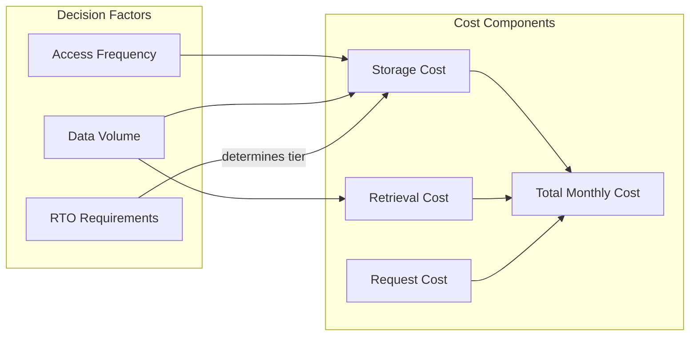
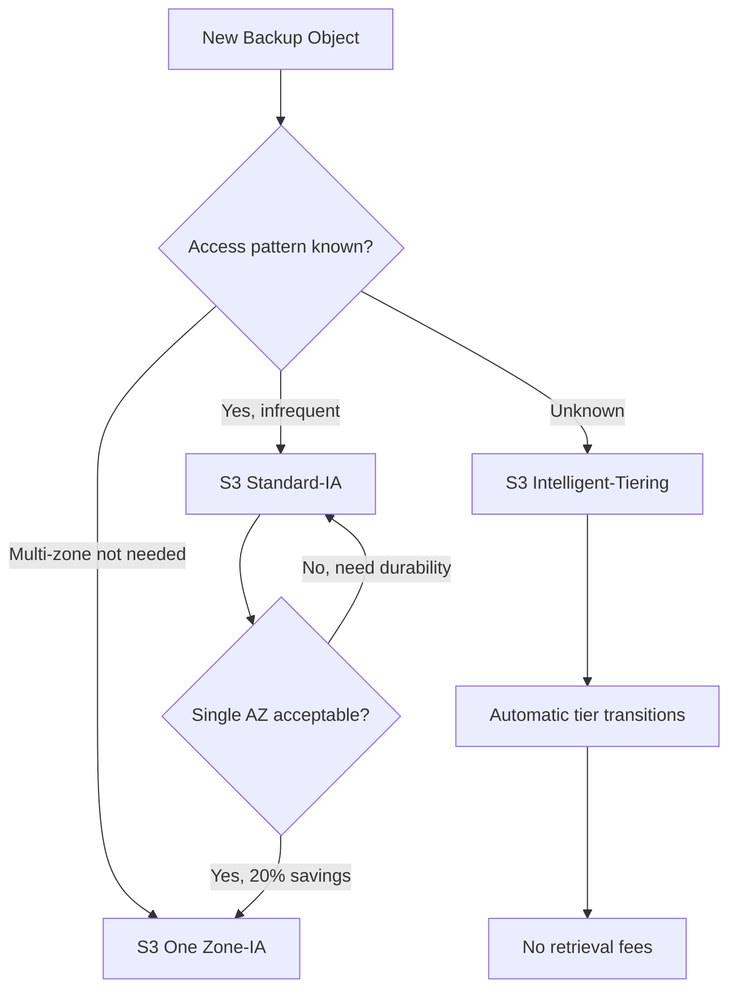
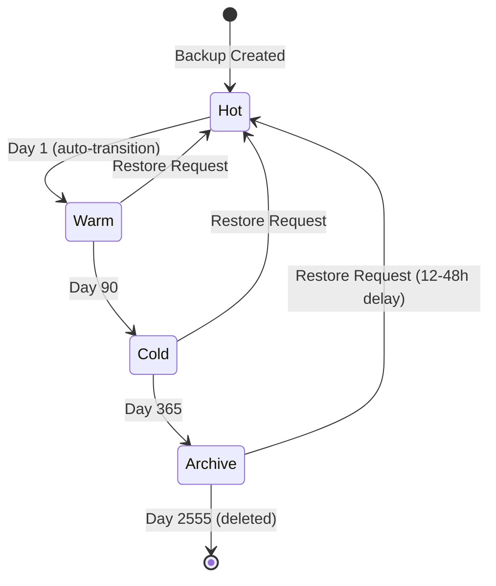
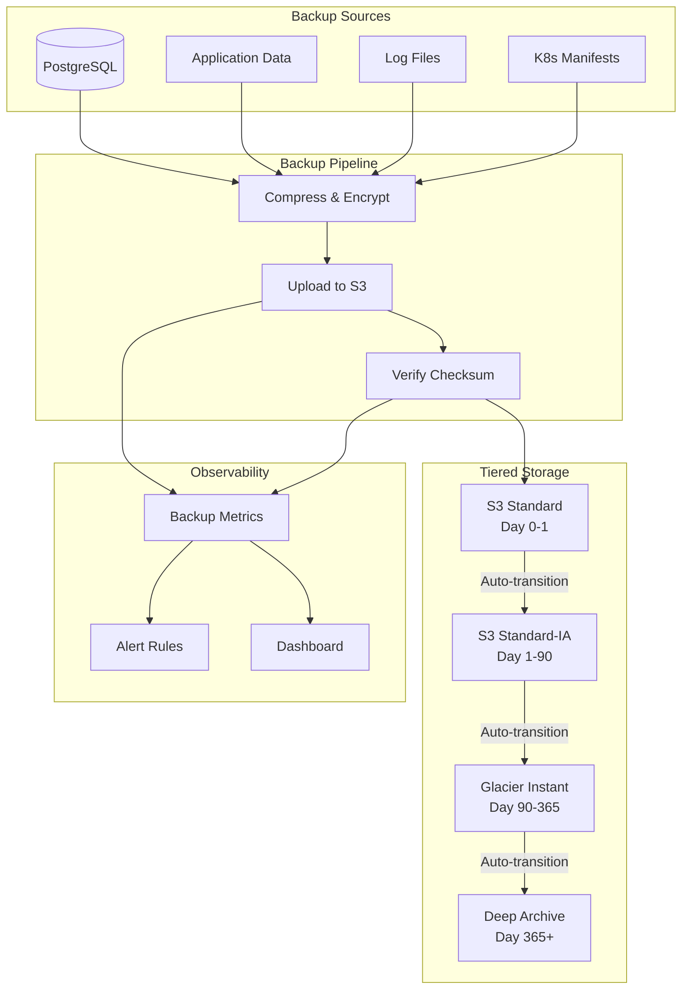

# How to Create Warm Storage Backups

Author: [nawazdhandala](https://github.com/nawazdhandala)

Tags: Backup, Storage, Cost Optimization, Disaster Recovery

Description: Learn how to use warm storage for backups with moderate access requirements.

---

Backups cost money. Hot storage keeps everything instantly available but burns through budgets. Cold storage is cheap but makes you wait hours when disaster strikes. Warm storage sits in the middle: affordable enough to store months of backups, fast enough to restore within minutes. This guide covers how to architect warm storage backup strategies that balance cost, access time, and operational simplicity.

## Understanding the Storage Temperature Spectrum

Before diving into implementation, understand where warm storage fits:

| Tier | Access Latency | Typical Cost (per GB/month) | Use Case |
| --- | --- | --- | --- |
| **Hot** | Milliseconds | $0.023 (S3 Standard) | Active data, frequent reads |
| **Warm** | Milliseconds to seconds | $0.0125 (S3 IA) | Backups accessed weekly/monthly |
| **Cold** | Minutes to hours | $0.004 (S3 Glacier) | Archives, compliance retention |
| **Deep Archive** | 12-48 hours | $0.00099 (Glacier Deep) | Legal holds, rarely accessed |

Warm storage offers a sweet spot: **45-50% cheaper than hot storage** with retrieval times measured in milliseconds, not hours. The trade-off is a minimum storage duration (typically 30 days) and per-request retrieval fees.

## Warm Storage Characteristics

Warm storage classes share common traits across cloud providers:

### AWS S3 Infrequent Access (S3 IA)

- **Minimum object size billing:** 128 KB
- **Minimum storage duration:** 30 days
- **Retrieval fee:** $0.01 per GB
- **Availability:** 99.9% (vs 99.99% for Standard)

### Azure Cool Blob Storage

- **Minimum storage duration:** 30 days
- **Early deletion penalty:** Pro-rated for days remaining
- **Access tier can be set per-blob**

### Google Cloud Nearline

- **Minimum storage duration:** 30 days
- **Retrieval fee:** $0.01 per GB
- **SLA:** 99.0% availability

The key insight: **warm storage is designed for data you access less than once a month** but need within seconds when you do.

## Balancing Cost and Access Time

The math determines when warm storage makes sense. Consider this cost analysis:



### Break-Even Calculation

For S3, the break-even point between Standard and IA:

```python
# Cost comparison: S3 Standard vs S3 Infrequent Access
def calculate_monthly_cost(size_gb, access_count, storage_class):
    """
    Calculate monthly cost for different S3 storage classes.

    Args:
        size_gb: Total data size in GB
        access_count: Number of times data is accessed per month
        storage_class: 'standard' or 'ia'
    """
    if storage_class == 'standard':
        storage_cost = size_gb * 0.023  # per GB/month
        retrieval_cost = 0
        request_cost = access_count * 0.0004 / 1000  # GET requests
    elif storage_class == 'ia':
        storage_cost = size_gb * 0.0125  # per GB/month
        retrieval_cost = size_gb * access_count * 0.01  # per GB retrieved
        request_cost = access_count * 0.001 / 1000  # GET requests (higher)

    return storage_cost + retrieval_cost + request_cost

# Example: 100 GB backup, accessed once per month
standard_cost = calculate_monthly_cost(100, 1, 'standard')  # $2.30
ia_cost = calculate_monthly_cost(100, 1, 'ia')              # $2.25

# Example: 100 GB backup, accessed 5 times per month
standard_cost_freq = calculate_monthly_cost(100, 5, 'standard')  # $2.30
ia_cost_freq = calculate_monthly_cost(100, 5, 'ia')              # $6.25 (more expensive!)

print(f"Monthly access = 1: Standard ${standard_cost:.2f}, IA ${ia_cost:.2f}")
print(f"Monthly access = 5: Standard ${standard_cost_freq:.2f}, IA ${ia_cost_freq:.2f}")
```

**Rule of thumb:** If you access data more than once per month, hot storage may be cheaper. Warm storage wins for backup retention where restores are rare events.

## Typical Warm Storage Use Cases

Warm storage excels in specific backup scenarios:

### 1. Database Point-in-Time Backups

Keep 30 days of daily database snapshots in warm storage:

```bash
#!/bin/bash
# daily-db-backup.sh
# Backup PostgreSQL to S3 Infrequent Access

set -euo pipefail

DB_NAME="production"
BACKUP_BUCKET="company-backups"
DATE=$(date +%Y-%m-%d)
BACKUP_FILE="postgres-${DB_NAME}-${DATE}.sql.gz"

# Create compressed backup
pg_dump -h localhost -U backup_user "${DB_NAME}" | gzip > "/tmp/${BACKUP_FILE}"

# Upload directly to S3 Infrequent Access
aws s3 cp "/tmp/${BACKUP_FILE}" \
    "s3://${BACKUP_BUCKET}/database/${BACKUP_FILE}" \
    --storage-class STANDARD_IA

# Clean up local file
rm "/tmp/${BACKUP_FILE}"

# Log success for monitoring
echo "$(date -u +%Y-%m-%dT%H:%M:%SZ) Backup completed: ${BACKUP_FILE}"
```

### 2. Application Log Archives

Move logs older than 7 days to warm storage:

```yaml
# fluent-bit configuration for log archival
[OUTPUT]
    Name                         s3
    Match                        app.logs.*
    bucket                       company-logs-archive
    region                       us-east-1
    total_file_size              50M
    upload_timeout               10m
    store_dir                    /var/log/fluent-bit/s3
    s3_key_format               /logs/$TAG/%Y/%m/%d/%H_%M_%S.gz
    storage_class               STANDARD_IA
    content_type                application/gzip
```

### 3. Container Image Backup

Archive production container images weekly:

```bash
#!/bin/bash
# backup-container-images.sh

REGISTRY="registry.company.com"
BACKUP_BUCKET="company-container-backups"
IMAGES=("api:production" "worker:production" "frontend:production")

for IMAGE in "${IMAGES[@]}"; do
    IMAGE_NAME=$(echo "$IMAGE" | tr ':' '-')
    BACKUP_FILE="${IMAGE_NAME}-$(date +%Y-%m-%d).tar.gz"

    # Pull and save image
    docker pull "${REGISTRY}/${IMAGE}"
    docker save "${REGISTRY}/${IMAGE}" | gzip > "/tmp/${BACKUP_FILE}"

    # Upload to warm storage
    aws s3 cp "/tmp/${BACKUP_FILE}" \
        "s3://${BACKUP_BUCKET}/images/${BACKUP_FILE}" \
        --storage-class STANDARD_IA

    rm "/tmp/${BACKUP_FILE}"
done
```

### 4. Kubernetes Cluster State Backups

Velero backup with warm storage:

```yaml
# velero-backup-location.yaml
apiVersion: velero.io/v1
kind: BackupStorageLocation
metadata:
  name: warm-storage
  namespace: velero
spec:
  provider: aws
  default: false
  objectStorage:
    bucket: k8s-backups
    prefix: velero
  config:
    region: us-east-1
    s3Url: https://s3.us-east-1.amazonaws.com
    storageClass: STANDARD_IA
---
apiVersion: velero.io/v1
kind: Schedule
metadata:
  name: daily-cluster-backup
  namespace: velero
spec:
  schedule: "0 2 * * *"  # 2 AM daily
  template:
    includedNamespaces:
    - production
    - staging
    storageLocation: warm-storage
    ttl: 720h  # 30 days retention
```

## S3 Infrequent Access Patterns

AWS S3 offers multiple IA tiers. Choose based on access patterns:



### Standard-IA vs One Zone-IA

```python
# Cost comparison for backup scenarios
def compare_ia_tiers(size_gb, months, restores_per_month):
    """
    Compare S3-IA tiers for backup workloads.
    """
    # Standard-IA: Multi-AZ, higher durability
    standard_ia = {
        'storage': size_gb * 0.0125 * months,
        'retrieval': size_gb * restores_per_month * months * 0.01,
        'durability': '99.999999999%',
        'availability': '99.9%'
    }

    # One Zone-IA: Single AZ, 20% cheaper storage
    one_zone_ia = {
        'storage': size_gb * 0.01 * months,
        'retrieval': size_gb * restores_per_month * months * 0.01,
        'durability': '99.999999999%',  # Same within the zone
        'availability': '99.5%'  # Lower due to single AZ
    }

    standard_ia['total'] = standard_ia['storage'] + standard_ia['retrieval']
    one_zone_ia['total'] = one_zone_ia['storage'] + one_zone_ia['retrieval']

    return standard_ia, one_zone_ia

# Example: 500 GB for 12 months, 2 restores per month
std, one_zone = compare_ia_tiers(500, 12, 0.17)  # ~2 restores/year
print(f"Standard-IA: ${std['total']:.2f}")
print(f"One Zone-IA: ${one_zone['total']:.2f}")
print(f"Savings: ${std['total'] - one_zone['total']:.2f}")
```

**When to use One Zone-IA:**
- Secondary backup copies (primary exists elsewhere)
- Data that can be regenerated
- Non-critical development/test backups

## Implementing Lifecycle Transition Policies

Automate the journey from hot to warm to cold storage:

```json
{
  "Rules": [
    {
      "ID": "BackupLifecycle",
      "Status": "Enabled",
      "Filter": {
        "Prefix": "backups/"
      },
      "Transitions": [
        {
          "Days": 1,
          "StorageClass": "STANDARD_IA"
        },
        {
          "Days": 90,
          "StorageClass": "GLACIER_IR"
        },
        {
          "Days": 365,
          "StorageClass": "DEEP_ARCHIVE"
        }
      ],
      "Expiration": {
        "Days": 2555
      }
    }
  ]
}
```

Apply with Terraform:

```hcl
# terraform/backup-bucket.tf

resource "aws_s3_bucket" "backups" {
  bucket = "company-warm-backups"
}

resource "aws_s3_bucket_lifecycle_configuration" "backup_lifecycle" {
  bucket = aws_s3_bucket.backups.id

  rule {
    id     = "backup-tiering"
    status = "Enabled"

    filter {
      prefix = "database/"
    }

    # Move to warm storage after 1 day
    transition {
      days          = 1
      storage_class = "STANDARD_IA"
    }

    # Move to cold storage after 90 days
    transition {
      days          = 90
      storage_class = "GLACIER_INSTANT_RETRIEVAL"
    }

    # Archive after 1 year
    transition {
      days          = 365
      storage_class = "DEEP_ARCHIVE"
    }

    # Delete after 7 years (compliance)
    expiration {
      days = 2555
    }
  }

  rule {
    id     = "log-tiering"
    status = "Enabled"

    filter {
      prefix = "logs/"
    }

    transition {
      days          = 7
      storage_class = "STANDARD_IA"
    }

    transition {
      days          = 30
      storage_class = "GLACIER_INSTANT_RETRIEVAL"
    }

    expiration {
      days = 90
    }
  }
}
```

### Visualizing the Transition Flow



## Recovery Time Considerations

Warm storage affects your Recovery Time Objective (RTO). Plan accordingly:

### RTO by Storage Class

| Storage Class | First Byte Latency | Full Restore (100 GB) | Cost per Restore |
| --- | --- | --- | --- |
| S3 Standard | Milliseconds | ~10 minutes | $0.00 |
| S3 Standard-IA | Milliseconds | ~10 minutes | $1.00 |
| S3 Glacier Instant | Milliseconds | ~10 minutes | $3.00 |
| S3 Glacier Flexible | 1-5 minutes (expedited) | ~15 minutes | $10.00 |
| S3 Glacier Deep | 12 hours (standard) | ~12 hours | $2.00 |

### Restore Script with Monitoring

```python
#!/usr/bin/env python3
"""
warm_restore.py - Restore backups from warm storage with progress tracking
"""

import boto3
import time
import sys
from datetime import datetime

def restore_from_warm_storage(bucket, key, destination_path):
    """
    Restore a backup from S3 Infrequent Access with progress monitoring.
    """
    s3 = boto3.client('s3')

    start_time = datetime.utcnow()
    print(f"[{start_time.isoformat()}] Starting restore: s3://{bucket}/{key}")

    # Get object metadata
    head = s3.head_object(Bucket=bucket, Key=key)
    size_bytes = head['ContentLength']
    storage_class = head.get('StorageClass', 'STANDARD')

    print(f"  Size: {size_bytes / (1024**3):.2f} GB")
    print(f"  Storage Class: {storage_class}")

    # Calculate expected retrieval cost
    if storage_class in ['STANDARD_IA', 'ONEZONE_IA']:
        retrieval_cost = (size_bytes / (1024**3)) * 0.01
        print(f"  Estimated retrieval cost: ${retrieval_cost:.2f}")

    # Download with progress callback
    downloaded = 0

    def progress_callback(bytes_transferred):
        nonlocal downloaded
        downloaded += bytes_transferred
        percent = (downloaded / size_bytes) * 100
        elapsed = (datetime.utcnow() - start_time).total_seconds()
        speed_mbps = (downloaded / (1024**2)) / elapsed if elapsed > 0 else 0
        sys.stdout.write(f"\r  Progress: {percent:.1f}% ({speed_mbps:.1f} MB/s)")
        sys.stdout.flush()

    s3.download_file(
        bucket,
        key,
        destination_path,
        Callback=progress_callback
    )

    end_time = datetime.utcnow()
    duration = (end_time - start_time).total_seconds()

    print(f"\n[{end_time.isoformat()}] Restore completed in {duration:.1f} seconds")

    return {
        'duration_seconds': duration,
        'size_bytes': size_bytes,
        'storage_class': storage_class
    }

if __name__ == "__main__":
    result = restore_from_warm_storage(
        bucket="company-warm-backups",
        key="database/postgres-production-2026-01-29.sql.gz",
        destination_path="/tmp/restore.sql.gz"
    )
```

### Parallel Restore for Large Datasets

```python
#!/usr/bin/env python3
"""
parallel_restore.py - Multi-part parallel restore from warm storage
"""

import boto3
import concurrent.futures
import os
from pathlib import Path

def download_range(bucket, key, start, end, part_num, temp_dir):
    """Download a specific byte range of an object."""
    s3 = boto3.client('s3')
    range_header = f"bytes={start}-{end}"

    response = s3.get_object(
        Bucket=bucket,
        Key=key,
        Range=range_header
    )

    part_path = Path(temp_dir) / f"part_{part_num:04d}"
    with open(part_path, 'wb') as f:
        f.write(response['Body'].read())

    return part_path

def parallel_restore(bucket, key, destination, num_parts=10, max_workers=5):
    """
    Restore large backup using parallel range requests.
    Significantly faster for multi-GB backups.
    """
    s3 = boto3.client('s3')

    # Get object size
    head = s3.head_object(Bucket=bucket, Key=key)
    total_size = head['ContentLength']
    part_size = total_size // num_parts

    temp_dir = Path(destination).parent / ".restore_temp"
    temp_dir.mkdir(exist_ok=True)

    # Generate byte ranges
    ranges = []
    for i in range(num_parts):
        start = i * part_size
        end = start + part_size - 1 if i < num_parts - 1 else total_size - 1
        ranges.append((start, end, i))

    # Download parts in parallel
    part_paths = []
    with concurrent.futures.ThreadPoolExecutor(max_workers=max_workers) as executor:
        futures = {
            executor.submit(
                download_range, bucket, key, start, end, part_num, temp_dir
            ): part_num
            for start, end, part_num in ranges
        }

        for future in concurrent.futures.as_completed(futures):
            part_paths.append((futures[future], future.result()))

    # Reassemble parts in order
    part_paths.sort(key=lambda x: x[0])

    with open(destination, 'wb') as outfile:
        for _, part_path in part_paths:
            with open(part_path, 'rb') as infile:
                outfile.write(infile.read())
            part_path.unlink()  # Clean up part file

    temp_dir.rmdir()

    return destination

# Usage
if __name__ == "__main__":
    parallel_restore(
        bucket="company-warm-backups",
        key="database/large-backup-2026-01-29.tar.gz",
        destination="/data/restore/large-backup.tar.gz",
        num_parts=20,
        max_workers=10
    )
```

## Complete Backup Pipeline Architecture



## Monitoring Warm Storage Backups

Track backup health and costs:

```yaml
# prometheus-rules.yaml
groups:
  - name: backup-alerts
    rules:
      - alert: BackupMissing
        expr: |
          time() - backup_last_success_timestamp{tier="warm"} > 86400
        for: 1h
        labels:
          severity: critical
        annotations:
          summary: "Warm storage backup missing for {{ $labels.backup_name }}"
          description: "No successful backup in the last 24 hours"

      - alert: BackupCostSpike
        expr: |
          increase(backup_retrieval_cost_dollars{tier="warm"}[24h]) > 50
        for: 15m
        labels:
          severity: warning
        annotations:
          summary: "Unusual warm storage retrieval costs"
          description: "Retrieval costs exceeded $50 in the last 24 hours"

      - alert: BackupSizeAnomaly
        expr: |
          abs(backup_size_bytes{tier="warm"} - backup_size_bytes{tier="warm"} offset 1d)
          / backup_size_bytes{tier="warm"} offset 1d > 0.5
        for: 30m
        labels:
          severity: warning
        annotations:
          summary: "Backup size changed by more than 50%"
```

## Best Practices Summary

1. **Use lifecycle policies:** Never manually move objects between tiers. Automate transitions based on age.

2. **Right-size your tier:** Calculate break-even points. If accessing data more than once per month, hot storage may be cheaper.

3. **Consider One Zone-IA for secondary copies:** Save 20% when you have primary backups elsewhere.

4. **Monitor retrieval costs:** Unexpected restores can spike bills. Set up cost alerts.

5. **Test restores regularly:** A backup you cannot restore is not a backup. Schedule monthly restore drills.

6. **Encrypt before upload:** Use client-side encryption for sensitive backups. Do not rely solely on S3 server-side encryption.

7. **Tag everything:** Use S3 object tags for cost allocation and lifecycle management.

```bash
# Example: Upload with tags for tracking
aws s3 cp backup.sql.gz s3://backups/db/backup.sql.gz \
    --storage-class STANDARD_IA \
    --metadata "backup-type=database,environment=production" \
    --tagging "Team=Platform&CostCenter=Infrastructure"
```

Warm storage is the workhorse of backup strategies. It costs less than keeping everything hot, restores faster than archives, and with proper lifecycle policies, manages itself. Set it up once, monitor it continuously, and test restores before you need them.
