# How to Build Warning Thresholds

Author: [nawazdhandala](https://github.com/nawazdhandala)

Tags: Monitoring, Thresholds, SRE, Alerting

Description: Learn how to set effective warning thresholds for early problem detection.

---

Warning thresholds are the early warning system of your monitoring stack. They give you lead time before problems become incidents. Done right, they create a buffer zone where issues can be addressed during business hours, not at 3 AM. Done wrong, they generate noise that trains your team to ignore alerts.

This guide covers the principles, math, and practical implementation of warning thresholds that actually work.

---

## Warning vs Critical: Understanding the Distinction

Critical alerts demand immediate action. Warning alerts inform about developing situations. The distinction is not just severity; it is about *timing* and *response expectation*.

| Aspect | Warning | Critical |
|--------|---------|----------|
| Response Time | Hours to days | Minutes |
| Action Required | Investigate, plan | Mitigate now |
| Notification | Ticket, dashboard | Page, SMS |
| Business Hours | Yes | Any time |
| Escalation | None or delayed | Immediate |


The warning zone is your buffer. It is where you catch problems before they become emergencies.

---

## Early Detection: The Value of Lead Time

Warning thresholds exist to buy time. Consider a disk filling at 2GB per day:

| Threshold | Current Usage | Time Until Full | Response Window |
|-----------|---------------|-----------------|-----------------|
| 90% Critical Only | 450GB of 500GB | 25 days | None (too late) |
| 80% Warning | 400GB of 500GB | 50 days | 25 days to act |
| 70% Warning | 350GB of 500GB | 75 days | 50 days to act |

Early warning transforms reactive firefighting into planned maintenance.

### Lead Time Calculation

```typescript
interface ThresholdConfig {
  criticalPercent: number;
  warningPercent: number;
  currentValue: number;
  capacity: number;
  rateOfChange: number; // units per hour
}

function calculateLeadTime(config: ThresholdConfig): {
  hoursUntilWarning: number;
  hoursUntilCritical: number;
  warningLeadTime: number;
} {
  const warningValue = config.capacity * (config.warningPercent / 100);
  const criticalValue = config.capacity * (config.criticalPercent / 100);

  const hoursUntilWarning = config.rateOfChange > 0
    ? (warningValue - config.currentValue) / config.rateOfChange
    : Infinity;

  const hoursUntilCritical = config.rateOfChange > 0
    ? (criticalValue - config.currentValue) / config.rateOfChange
    : Infinity;

  return {
    hoursUntilWarning: Math.max(0, hoursUntilWarning),
    hoursUntilCritical: Math.max(0, hoursUntilCritical),
    warningLeadTime: hoursUntilCritical - hoursUntilWarning
  };
}

// Example: Disk at 60% (300GB), filling at 5GB/hour, 500GB total
const result = calculateLeadTime({
  criticalPercent: 90,
  warningPercent: 75,
  currentValue: 300,
  capacity: 500,
  rateOfChange: 5
});

console.log(`Warning in: ${result.hoursUntilWarning} hours`);     // 15 hours
console.log(`Critical in: ${result.hoursUntilCritical} hours`);   // 30 hours
console.log(`Lead time: ${result.warningLeadTime} hours`);        // 15 hours
```

---

## Threshold Calculation Methods

There are several approaches to calculating warning thresholds. Each has trade-offs.

### Method 1: Fixed Percentage of Critical

The simplest approach: warning is a fixed percentage below critical.

```typescript
function fixedPercentageThreshold(criticalValue: number, warningRatio: number = 0.8): number {
  return criticalValue * warningRatio;
}

// If critical is 90% CPU, warning at 72% (80% of 90)
const warning = fixedPercentageThreshold(90, 0.8); // 72%
```

**Pros**: Simple, predictable
**Cons**: Does not account for metric behavior or response time

### Method 2: Statistical (Standard Deviation)

Use historical data to set thresholds based on normal variance.

```typescript
interface MetricStats {
  mean: number;
  stdDev: number;
}

function statisticalThresholds(stats: MetricStats): {
  warning: number;
  critical: number;
} {
  return {
    warning: stats.mean + (2 * stats.stdDev),   // ~95th percentile
    critical: stats.mean + (3 * stats.stdDev)   // ~99.7th percentile
  };
}

// Example: API latency with mean 200ms, stdDev 50ms
const latencyThresholds = statisticalThresholds({ mean: 200, stdDev: 50 });
console.log(`Warning: ${latencyThresholds.warning}ms`);   // 300ms
console.log(`Critical: ${latencyThresholds.critical}ms`); // 350ms
```


**Pros**: Adapts to actual metric behavior
**Cons**: Requires historical data, assumes normal distribution

### Method 3: Response-Time Based

Calculate warning threshold to provide sufficient lead time for response.

```typescript
interface ResponseBasedConfig {
  criticalThreshold: number;
  averageRateOfChange: number;  // units per minute
  requiredLeadTimeMinutes: number;
}

function responseBasedWarning(config: ResponseBasedConfig): number {
  const buffer = config.averageRateOfChange * config.requiredLeadTimeMinutes;
  return config.criticalThreshold - buffer;
}

// Example: Critical at 1000 connections, growing at 10/min, need 30 min lead time
const warning = responseBasedWarning({
  criticalThreshold: 1000,
  averageRateOfChange: 10,
  requiredLeadTimeMinutes: 30
});
console.log(`Warning at: ${warning} connections`); // 700 connections
```

**Pros**: Directly tied to operational needs
**Cons**: Requires understanding of metric growth patterns

### Method 4: SLO-Based

Derive thresholds from Service Level Objectives.

```typescript
interface SLOConfig {
  targetLatencyMs: number;      // SLO: p99 < 500ms
  errorBudgetPercent: number;   // Monthly error budget
  currentBurnRate: number;      // How fast we're consuming budget
}

function sloBasedThresholds(config: SLOConfig): {
  warning: { latency: number; burnRate: number };
  critical: { latency: number; burnRate: number };
} {
  return {
    warning: {
      latency: config.targetLatencyMs * 0.8,      // 80% of SLO
      burnRate: 2.0                                // 2x normal burn
    },
    critical: {
      latency: config.targetLatencyMs,            // At SLO limit
      burnRate: 10.0                               // 10x burn rate
    }
  };
}

const thresholds = sloBasedThresholds({
  targetLatencyMs: 500,
  errorBudgetPercent: 0.1,
  currentBurnRate: 1.0
});

console.log(`Warning latency: ${thresholds.warning.latency}ms`);   // 400ms
console.log(`Critical latency: ${thresholds.critical.latency}ms`); // 500ms
```

**Pros**: Aligned with business objectives
**Cons**: Requires mature SLO practice

---

## Lead Time Considerations

The gap between warning and critical thresholds must account for:

1. **Detection Time**: How quickly will you see the alert?
2. **Diagnosis Time**: How long to understand the problem?
3. **Resolution Time**: How long to fix it?
4. **Buffer Time**: Safety margin for unexpected delays

```mermaid
gantt
    title Lead Time Components
    dateFormat HH:mm
    axisFormat %H:%M

    section Timeline
    Warning Triggered       :milestone, m1, 00:00, 0m
    Detection & Triage      :active, detect, 00:00, 30m
    Diagnosis               :active, diag, after detect, 60m
    Resolution              :active, resolve, after diag, 90m
    Buffer                  :buffer, after resolve, 30m
    Critical Would Fire     :crit, milestone, m2, 03:30, 0m
```



### Calculating Required Lead Time

```typescript
interface LeadTimeComponents {
  detectionMinutes: number;
  diagnosisMinutes: number;
  resolutionMinutes: number;
  bufferPercent: number;
}

function calculateRequiredLeadTime(components: LeadTimeComponents): number {
  const baseTime =
    components.detectionMinutes +
    components.diagnosisMinutes +
    components.resolutionMinutes;

  return baseTime * (1 + components.bufferPercent / 100);
}

// Example: 15 min detection, 30 min diagnosis, 45 min resolution, 25% buffer
const requiredLeadTime = calculateRequiredLeadTime({
  detectionMinutes: 15,
  diagnosisMinutes: 30,
  resolutionMinutes: 45,
  bufferPercent: 25
});

console.log(`Required lead time: ${requiredLeadTime} minutes`); // 112.5 minutes
```

---

## Noise Prevention: Avoiding Alert Fatigue

Warning thresholds must not generate noise. Every false positive erodes trust.

### Anti-Flapping: Hysteresis

Prevent rapid threshold crossing by requiring sustained breach or recovery.

```typescript
interface HysteresisConfig {
  warningThreshold: number;
  clearThreshold: number;      // Must drop below this to clear
  sustainedMinutes: number;    // Must stay breached this long
}

class HysteresisAlert {
  private isAlerting: boolean = false;
  private breachStart: number | null = null;

  constructor(private config: HysteresisConfig) {}

  evaluate(currentValue: number, timestamp: number): 'alerting' | 'cleared' | 'pending' {
    if (!this.isAlerting) {
      // Check for new breach
      if (currentValue >= this.config.warningThreshold) {
        if (this.breachStart === null) {
          this.breachStart = timestamp;
          return 'pending';
        }

        const breachDuration = (timestamp - this.breachStart) / 60000; // to minutes
        if (breachDuration >= this.config.sustainedMinutes) {
          this.isAlerting = true;
          return 'alerting';
        }
        return 'pending';
      } else {
        this.breachStart = null;
        return 'cleared';
      }
    } else {
      // Check for clear condition (hysteresis)
      if (currentValue < this.config.clearThreshold) {
        this.isAlerting = false;
        this.breachStart = null;
        return 'cleared';
      }
      return 'alerting';
    }
  }
}

// Warning at 80%, clear at 70%, must be breached for 5 minutes
const alert = new HysteresisAlert({
  warningThreshold: 80,
  clearThreshold: 70,
  sustainedMinutes: 5
});
```


### Time-Based Suppression

Suppress warnings during known noisy periods.

```typescript
interface SuppressionWindow {
  startHour: number;  // 0-23
  endHour: number;
  daysOfWeek: number[]; // 0=Sunday, 6=Saturday
  reason: string;
}

function shouldSuppress(windows: SuppressionWindow[], now: Date): string | null {
  const hour = now.getHours();
  const day = now.getDay();

  for (const window of windows) {
    if (window.daysOfWeek.includes(day)) {
      if (window.startHour <= window.endHour) {
        // Same day window
        if (hour >= window.startHour && hour < window.endHour) {
          return window.reason;
        }
      } else {
        // Overnight window
        if (hour >= window.startHour || hour < window.endHour) {
          return window.reason;
        }
      }
    }
  }
  return null;
}

// Suppress during nightly batch processing
const suppressionWindows: SuppressionWindow[] = [
  {
    startHour: 2,
    endHour: 4,
    daysOfWeek: [0, 1, 2, 3, 4, 5, 6],
    reason: 'Nightly batch processing'
  },
  {
    startHour: 6,
    endHour: 8,
    daysOfWeek: [1], // Monday morning
    reason: 'Weekly report generation'
  }
];
```

### Grouping Related Warnings

Avoid alert storms by grouping related metrics.

```typescript
interface AlertGroup {
  name: string;
  alerts: string[];
  summaryTemplate: string;
}

class AlertGrouper {
  private pendingAlerts: Map<string, { alert: string; timestamp: number }[]> = new Map();
  private groupingWindowMs: number = 60000; // 1 minute

  constructor(private groups: AlertGroup[]) {}

  addAlert(alertName: string, timestamp: number): void {
    for (const group of this.groups) {
      if (group.alerts.includes(alertName)) {
        if (!this.pendingAlerts.has(group.name)) {
          this.pendingAlerts.set(group.name, []);
        }
        this.pendingAlerts.get(group.name)!.push({ alert: alertName, timestamp });
        return;
      }
    }
    // Ungrouped alert
    if (!this.pendingAlerts.has('ungrouped')) {
      this.pendingAlerts.set('ungrouped', []);
    }
    this.pendingAlerts.get('ungrouped')!.push({ alert: alertName, timestamp });
  }

  flush(): string[] {
    const summaries: string[] = [];

    for (const [groupName, alerts] of this.pendingAlerts) {
      if (groupName === 'ungrouped') {
        summaries.push(...alerts.map(a => a.alert));
      } else {
        const group = this.groups.find(g => g.name === groupName)!;
        const summary = group.summaryTemplate
          .replace('{count}', alerts.length.toString())
          .replace('{alerts}', alerts.map(a => a.alert).join(', '));
        summaries.push(summary);
      }
    }

    this.pendingAlerts.clear();
    return summaries;
  }
}

// Group database-related warnings
const grouper = new AlertGrouper([
  {
    name: 'database',
    alerts: ['db_connections_warning', 'db_query_latency_warning', 'db_replication_lag_warning'],
    summaryTemplate: 'Database health: {count} warnings ({alerts})'
  }
]);
```

---

## Actionable Warnings: Making Them Useful

A warning alert must answer three questions:
1. **What** is happening?
2. **Why** does it matter?
3. **What** should I do?

### Warning Alert Template

```typescript
interface WarningAlert {
  title: string;
  severity: 'warning';
  metric: {
    name: string;
    currentValue: number;
    warningThreshold: number;
    criticalThreshold: number;
    unit: string;
  };
  context: {
    service: string;
    environment: string;
    region: string;
  };
  impact: string;
  suggestedActions: string[];
  runbook: string;
  dashboardUrl: string;
  estimatedTimeToClirical: string | null;
}

function formatWarningAlert(alert: WarningAlert): string {
  const percentToCritical = (
    (alert.metric.criticalThreshold - alert.metric.currentValue) /
    (alert.metric.criticalThreshold - alert.metric.warningThreshold) * 100
  ).toFixed(0);

  return `
## ${alert.title}

**Severity**: Warning | **Service**: ${alert.context.service} | **Environment**: ${alert.context.environment}

### Current Status
- **Metric**: ${alert.metric.name}
- **Current**: ${alert.metric.currentValue}${alert.metric.unit}
- **Warning Threshold**: ${alert.metric.warningThreshold}${alert.metric.unit}
- **Critical Threshold**: ${alert.metric.criticalThreshold}${alert.metric.unit}
- **Buffer to Critical**: ${percentToCritical}%
${alert.estimatedTimeToClirical ? `- **Estimated Time to Critical**: ${alert.estimatedTimeToClirical}` : ''}

### Impact
${alert.impact}

### Suggested Actions
${alert.suggestedActions.map((a, i) => `${i + 1}. ${a}`).join('\n')}

### Resources
- [Runbook](${alert.runbook})
- [Dashboard](${alert.dashboardUrl})
  `.trim();
}

// Example usage
const alert: WarningAlert = {
  title: 'API Latency Elevated',
  severity: 'warning',
  metric: {
    name: 'http_request_duration_p99',
    currentValue: 380,
    warningThreshold: 350,
    criticalThreshold: 500,
    unit: 'ms'
  },
  context: {
    service: 'checkout-api',
    environment: 'production',
    region: 'us-east-1'
  },
  impact: 'User checkout experience degraded. Conversion rate may be affected.',
  suggestedActions: [
    'Check recent deployments in the last 2 hours',
    'Review database query performance',
    'Check external payment gateway latency',
    'Consider scaling up API instances if load increased'
  ],
  runbook: 'https://wiki.example.com/runbooks/checkout-latency',
  dashboardUrl: 'https://oneuptime.example.com/dashboard/checkout-api',
  estimatedTimeToClirical: '~45 minutes at current rate'
};

console.log(formatWarningAlert(alert));
```

### Prometheus/Alertmanager Configuration

```yaml
groups:
  - name: api-warnings
    rules:
      - alert: APILatencyWarning
        expr: |
          histogram_quantile(0.99,
            sum(rate(http_request_duration_seconds_bucket{service="checkout-api"}[5m]))
            by (le)
          ) > 0.35
        for: 5m
        labels:
          severity: warning
          service: checkout-api
        annotations:
          summary: "API p99 latency elevated"
          description: "p99 latency is {{ $value | humanizeDuration }} (threshold: 350ms)"
          impact: "User experience degraded, potential conversion impact"
          runbook: "https://wiki.example.com/runbooks/checkout-latency"
          dashboard: "https://oneuptime.example.com/dashboard/checkout-api"

      - alert: APILatencyCritical
        expr: |
          histogram_quantile(0.99,
            sum(rate(http_request_duration_seconds_bucket{service="checkout-api"}[5m]))
            by (le)
          ) > 0.5
        for: 2m
        labels:
          severity: critical
          service: checkout-api
        annotations:
          summary: "API p99 latency critical"
          description: "p99 latency is {{ $value | humanizeDuration }} (threshold: 500ms)"
```

---

## Complete Example: Multi-Metric Warning System

```typescript
import { EventEmitter } from 'events';

// Types
interface MetricDefinition {
  name: string;
  warningThreshold: number;
  criticalThreshold: number;
  clearThreshold: number;
  sustainedSeconds: number;
  unit: string;
  evaluator: 'above' | 'below';
}

interface MetricSample {
  name: string;
  value: number;
  timestamp: number;
  labels: Record<string, string>;
}

type AlertState = 'ok' | 'pending' | 'warning' | 'critical';

interface AlertStatus {
  metric: string;
  state: AlertState;
  value: number;
  threshold: number;
  since: number | null;
  labels: Record<string, string>;
}

// Warning threshold evaluator
class WarningThresholdEvaluator extends EventEmitter {
  private metrics: Map<string, MetricDefinition> = new Map();
  private states: Map<string, AlertStatus> = new Map();

  registerMetric(definition: MetricDefinition): void {
    this.metrics.set(definition.name, definition);
    this.states.set(definition.name, {
      metric: definition.name,
      state: 'ok',
      value: 0,
      threshold: definition.warningThreshold,
      since: null,
      labels: {}
    });
  }

  evaluate(sample: MetricSample): AlertStatus {
    const definition = this.metrics.get(sample.name);
    if (!definition) {
      throw new Error(`Unknown metric: ${sample.name}`);
    }

    const currentStatus = this.states.get(sample.name)!;
    const previousState = currentStatus.state;

    // Determine if thresholds are breached
    const isAboveCritical = definition.evaluator === 'above'
      ? sample.value >= definition.criticalThreshold
      : sample.value <= definition.criticalThreshold;

    const isAboveWarning = definition.evaluator === 'above'
      ? sample.value >= definition.warningThreshold
      : sample.value <= definition.warningThreshold;

    const isBelowClear = definition.evaluator === 'above'
      ? sample.value < definition.clearThreshold
      : sample.value > definition.clearThreshold;

    // State machine transitions
    let newState: AlertState = currentStatus.state;

    if (isAboveCritical) {
      newState = 'critical';
    } else if (isAboveWarning) {
      if (currentStatus.state === 'ok') {
        // Start pending timer
        newState = 'pending';
        currentStatus.since = sample.timestamp;
      } else if (currentStatus.state === 'pending') {
        // Check if sustained long enough
        const elapsed = (sample.timestamp - currentStatus.since!) / 1000;
        if (elapsed >= definition.sustainedSeconds) {
          newState = 'warning';
        }
      }
      // If already warning, stay warning
    } else if (isBelowClear) {
      newState = 'ok';
      currentStatus.since = null;
    }

    // Update status
    currentStatus.state = newState;
    currentStatus.value = sample.value;
    currentStatus.labels = sample.labels;

    // Emit events on state changes
    if (newState !== previousState) {
      this.emit('stateChange', {
        metric: sample.name,
        previousState,
        newState,
        value: sample.value,
        threshold: newState === 'critical'
          ? definition.criticalThreshold
          : definition.warningThreshold,
        labels: sample.labels
      });

      if (newState === 'warning') {
        this.emit('warning', currentStatus);
      } else if (newState === 'critical') {
        this.emit('critical', currentStatus);
      } else if (newState === 'ok' && (previousState === 'warning' || previousState === 'critical')) {
        this.emit('resolved', currentStatus);
      }
    }

    return { ...currentStatus };
  }

  getStatus(metricName: string): AlertStatus | undefined {
    return this.states.get(metricName);
  }

  getAllStatuses(): AlertStatus[] {
    return Array.from(this.states.values());
  }
}

// Usage example
const evaluator = new WarningThresholdEvaluator();

// Register metrics
evaluator.registerMetric({
  name: 'cpu_utilization',
  warningThreshold: 70,
  criticalThreshold: 90,
  clearThreshold: 65,
  sustainedSeconds: 300, // 5 minutes
  unit: '%',
  evaluator: 'above'
});

evaluator.registerMetric({
  name: 'disk_free_percent',
  warningThreshold: 20,
  criticalThreshold: 10,
  clearThreshold: 25,
  sustainedSeconds: 60,
  unit: '%',
  evaluator: 'below'
});

evaluator.registerMetric({
  name: 'api_latency_p99',
  warningThreshold: 350,
  criticalThreshold: 500,
  clearThreshold: 300,
  sustainedSeconds: 180, // 3 minutes
  unit: 'ms',
  evaluator: 'above'
});

// Event handlers
evaluator.on('warning', (status: AlertStatus) => {
  console.log(`WARNING: ${status.metric} = ${status.value} (threshold: ${status.threshold})`);
  // Send to ticketing system, Slack, etc.
});

evaluator.on('critical', (status: AlertStatus) => {
  console.log(`CRITICAL: ${status.metric} = ${status.value} (threshold: ${status.threshold})`);
  // Page on-call
});

evaluator.on('resolved', (status: AlertStatus) => {
  console.log(`RESOLVED: ${status.metric} back to normal`);
});

// Simulate metrics coming in
const samples: MetricSample[] = [
  { name: 'cpu_utilization', value: 65, timestamp: Date.now(), labels: { host: 'web-01' } },
  { name: 'cpu_utilization', value: 72, timestamp: Date.now() + 60000, labels: { host: 'web-01' } },
  { name: 'cpu_utilization', value: 75, timestamp: Date.now() + 360000, labels: { host: 'web-01' } },
];

for (const sample of samples) {
  const status = evaluator.evaluate(sample);
  console.log(`${sample.name}: ${sample.value} -> ${status.state}`);
}
```

---

## Warning Threshold Workflow


---

## Best Practices Summary

### Do

- Set warning thresholds to provide sufficient lead time for response
- Use hysteresis to prevent alert flapping
- Include actionable information in every alert
- Group related warnings to reduce noise
- Review and tune thresholds quarterly
- Tie thresholds to SLOs where possible
- Document the reasoning behind each threshold

### Do Not

- Set warning thresholds too close to critical (no lead time)
- Set warning thresholds too far from critical (noise)
- Alert on every metric (alert fatigue)
- Ignore warning alerts (defeats the purpose)
- Use the same thresholds across all environments
- Forget to update thresholds as systems scale

---

## Key Takeaways

1. **Warning thresholds buy time**. Calculate the lead time you need and work backward.

2. **Use the right calculation method** for your metric: fixed percentage for simple cases, statistical for variable metrics, response-time based for capacity metrics, SLO-based for user-facing metrics.

3. **Prevent noise aggressively**. Hysteresis, sustained duration, and suppression windows keep warnings trustworthy.

4. **Make every warning actionable**. If there is no clear action, it should not be a warning.

5. **Review regularly**. Thresholds that made sense six months ago may be noise today.

Warning thresholds are not just lower critical thresholds. They are a deliberate system for buying your team time to respond before users are impacted. Design them with intention.

---

**Related Reading:**

- [18 SRE Metrics Worth Tracking](https://oneuptime.com/blog/post/2025-11-28-sre-metrics-to-track/view)
- [How to Reduce Noise in OpenTelemetry](https://oneuptime.com/blog/post/2025-08-25-how-to-reduce-noise-in-opentelemetry/view)
- [Monitoring vs Observability for SRE](https://oneuptime.com/blog/post/2025-11-28-monitoring-vs-observability-sre/view)
