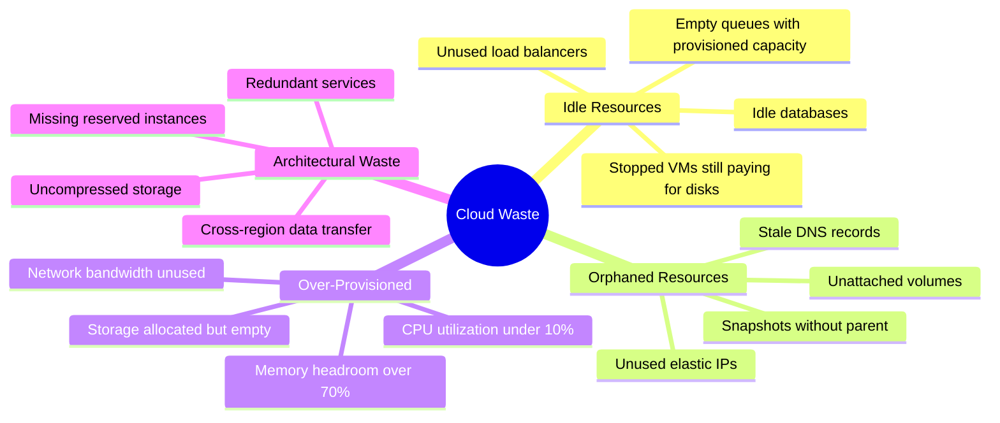
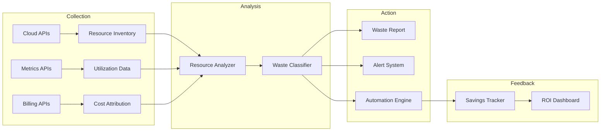
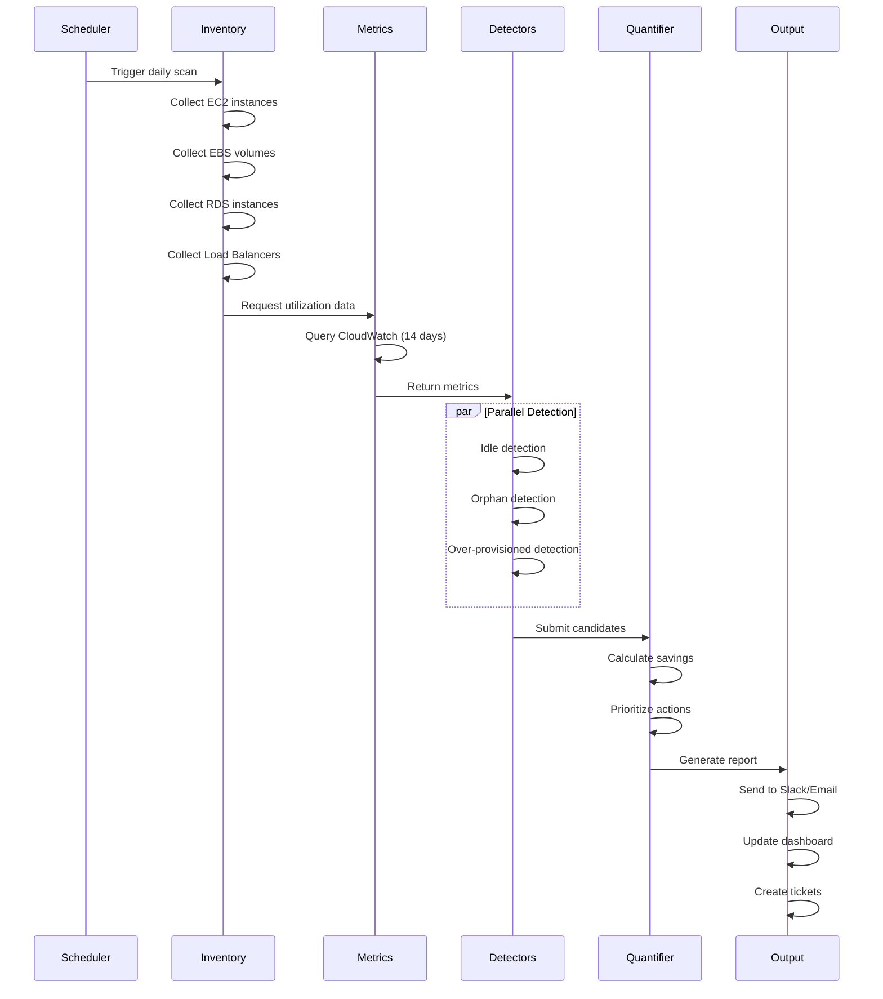
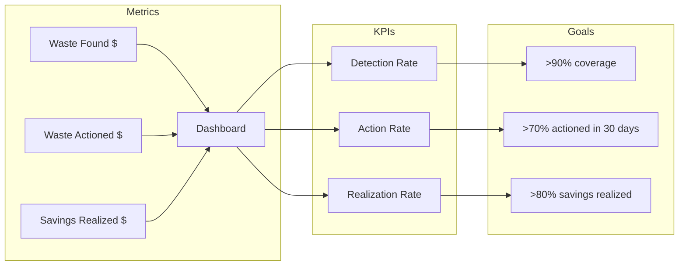

# How to Build Waste Identification

Author: [nawazdhandala](https://github.com/nawazdhandala)

Tags: Cost Optimization, FinOps, Cloud, Efficiency

Description: Learn how to systematically identify waste in cloud infrastructure.

---

## Why Waste Identification Matters

Cloud waste is a silent budget killer. Studies consistently show that 30-40% of cloud spend is wasted on unused or underutilized resources. Building a systematic waste identification process transforms reactive cost-cutting into proactive financial operations.

The goal isn't just to find waste once - it's to build a repeatable system that continuously surfaces optimization opportunities.

---

## Waste Categories

Before building detection systems, understand what you're looking for. Cloud waste falls into distinct categories:



Each category requires different detection strategies and remediation approaches.

---

## Building the Waste Detection Architecture

A robust waste identification system has four core components:



---

## Automated Waste Detection

The foundation is a scheduled scanner that inventories resources and correlates them with utilization metrics.

### Resource Inventory Collection

```python
import boto3
from datetime import datetime, timedelta
from dataclasses import dataclass
from typing import List, Dict, Optional
import json

@dataclass
class Resource:
    resource_id: str
    resource_type: str
    region: str
    created_at: datetime
    tags: Dict[str, str]
    monthly_cost: float
    metadata: Dict

@dataclass
class WasteCandidate:
    resource: Resource
    waste_type: str
    confidence: float  # 0.0 to 1.0
    estimated_monthly_savings: float
    detection_reason: str
    recommended_action: str

class CloudInventory:
    """Collects and maintains resource inventory across cloud accounts."""

    def __init__(self, regions: List[str] = None):
        self.regions = regions or ['us-east-1', 'us-west-2', 'eu-west-1']
        self.resources: List[Resource] = []

    def collect_ec2_instances(self) -> List[Resource]:
        """Inventory all EC2 instances across regions."""
        instances = []

        for region in self.regions:
            ec2 = boto3.client('ec2', region_name=region)
            paginator = ec2.get_paginator('describe_instances')

            for page in paginator.paginate():
                for reservation in page['Reservations']:
                    for instance in reservation['Instances']:
                        resource = Resource(
                            resource_id=instance['InstanceId'],
                            resource_type='ec2:instance',
                            region=region,
                            created_at=instance['LaunchTime'],
                            tags={t['Key']: t['Value'] for t in instance.get('Tags', [])},
                            monthly_cost=self._estimate_instance_cost(instance),
                            metadata={
                                'instance_type': instance['InstanceType'],
                                'state': instance['State']['Name'],
                                'platform': instance.get('Platform', 'linux'),
                                'vpc_id': instance.get('VpcId'),
                            }
                        )
                        instances.append(resource)

        return instances

    def collect_ebs_volumes(self) -> List[Resource]:
        """Inventory all EBS volumes across regions."""
        volumes = []

        for region in self.regions:
            ec2 = boto3.client('ec2', region_name=region)
            paginator = ec2.get_paginator('describe_volumes')

            for page in paginator.paginate():
                for volume in page['Volumes']:
                    resource = Resource(
                        resource_id=volume['VolumeId'],
                        resource_type='ec2:volume',
                        region=region,
                        created_at=volume['CreateTime'],
                        tags={t['Key']: t['Value'] for t in volume.get('Tags', [])},
                        monthly_cost=self._estimate_volume_cost(volume),
                        metadata={
                            'size_gb': volume['Size'],
                            'volume_type': volume['VolumeType'],
                            'state': volume['State'],
                            'attachments': volume['Attachments'],
                            'iops': volume.get('Iops'),
                        }
                    )
                    volumes.append(resource)

        return volumes

    def collect_rds_instances(self) -> List[Resource]:
        """Inventory all RDS instances across regions."""
        databases = []

        for region in self.regions:
            rds = boto3.client('rds', region_name=region)
            paginator = rds.get_paginator('describe_db_instances')

            for page in paginator.paginate():
                for db in page['DBInstances']:
                    resource = Resource(
                        resource_id=db['DBInstanceIdentifier'],
                        resource_type='rds:instance',
                        region=region,
                        created_at=db['InstanceCreateTime'],
                        tags={},  # Requires separate API call
                        monthly_cost=self._estimate_rds_cost(db),
                        metadata={
                            'instance_class': db['DBInstanceClass'],
                            'engine': db['Engine'],
                            'status': db['DBInstanceStatus'],
                            'multi_az': db['MultiAZ'],
                            'storage_gb': db['AllocatedStorage'],
                        }
                    )
                    databases.append(resource)

        return databases

    def _estimate_instance_cost(self, instance: Dict) -> float:
        """Estimate monthly cost for an EC2 instance."""
        # Simplified pricing - in production, use AWS Price List API
        hourly_rates = {
            't3.micro': 0.0104, 't3.small': 0.0208, 't3.medium': 0.0416,
            'm5.large': 0.096, 'm5.xlarge': 0.192, 'm5.2xlarge': 0.384,
            'c5.large': 0.085, 'c5.xlarge': 0.17, 'c5.2xlarge': 0.34,
            'r5.large': 0.126, 'r5.xlarge': 0.252, 'r5.2xlarge': 0.504,
        }
        instance_type = instance['InstanceType']
        hourly_rate = hourly_rates.get(instance_type, 0.10)
        return hourly_rate * 730  # Average hours per month

    def _estimate_volume_cost(self, volume: Dict) -> float:
        """Estimate monthly cost for an EBS volume."""
        gb_month_rates = {
            'gp2': 0.10, 'gp3': 0.08, 'io1': 0.125, 'io2': 0.125,
            'st1': 0.045, 'sc1': 0.025, 'standard': 0.05,
        }
        volume_type = volume['VolumeType']
        rate = gb_month_rates.get(volume_type, 0.10)
        return volume['Size'] * rate

    def _estimate_rds_cost(self, db: Dict) -> float:
        """Estimate monthly cost for an RDS instance."""
        # Simplified - actual pricing varies by engine and region
        hourly_rates = {
            'db.t3.micro': 0.017, 'db.t3.small': 0.034, 'db.t3.medium': 0.068,
            'db.m5.large': 0.171, 'db.m5.xlarge': 0.342, 'db.m5.2xlarge': 0.684,
            'db.r5.large': 0.24, 'db.r5.xlarge': 0.48, 'db.r5.2xlarge': 0.96,
        }
        instance_class = db['DBInstanceClass']
        hourly_rate = hourly_rates.get(instance_class, 0.20)
        base_cost = hourly_rate * 730
        storage_cost = db['AllocatedStorage'] * 0.115  # gp2 storage
        return base_cost + storage_cost

    def full_inventory(self) -> List[Resource]:
        """Collect complete resource inventory."""
        self.resources = []
        self.resources.extend(self.collect_ec2_instances())
        self.resources.extend(self.collect_ebs_volumes())
        self.resources.extend(self.collect_rds_instances())
        return self.resources
```

---

## Idle Resource Identification

Idle resources are running but doing no useful work. Detection requires correlating inventory with utilization metrics.

```python
class IdleResourceDetector:
    """Detects resources with consistently low utilization."""

    def __init__(self, lookback_days: int = 14):
        self.lookback_days = lookback_days
        self.cloudwatch = boto3.client('cloudwatch')

    def get_cpu_utilization(self, instance_id: str, region: str) -> Dict:
        """Get CPU utilization statistics for an EC2 instance."""
        cloudwatch = boto3.client('cloudwatch', region_name=region)

        end_time = datetime.utcnow()
        start_time = end_time - timedelta(days=self.lookback_days)

        response = cloudwatch.get_metric_statistics(
            Namespace='AWS/EC2',
            MetricName='CPUUtilization',
            Dimensions=[{'Name': 'InstanceId', 'Value': instance_id}],
            StartTime=start_time,
            EndTime=end_time,
            Period=3600,  # 1 hour
            Statistics=['Average', 'Maximum']
        )

        if not response['Datapoints']:
            return {'avg': 0, 'max': 0, 'datapoints': 0}

        datapoints = response['Datapoints']
        avg_values = [d['Average'] for d in datapoints]
        max_values = [d['Maximum'] for d in datapoints]

        return {
            'avg': sum(avg_values) / len(avg_values),
            'max': max(max_values),
            'datapoints': len(datapoints)
        }

    def get_network_io(self, instance_id: str, region: str) -> Dict:
        """Get network I/O for an EC2 instance."""
        cloudwatch = boto3.client('cloudwatch', region_name=region)

        end_time = datetime.utcnow()
        start_time = end_time - timedelta(days=self.lookback_days)

        total_bytes = 0
        for metric in ['NetworkIn', 'NetworkOut']:
            response = cloudwatch.get_metric_statistics(
                Namespace='AWS/EC2',
                MetricName=metric,
                Dimensions=[{'Name': 'InstanceId', 'Value': instance_id}],
                StartTime=start_time,
                EndTime=end_time,
                Period=86400,  # 1 day
                Statistics=['Sum']
            )
            for datapoint in response['Datapoints']:
                total_bytes += datapoint['Sum']

        return {
            'total_gb': total_bytes / (1024 ** 3),
            'daily_avg_mb': (total_bytes / (1024 ** 2)) / self.lookback_days
        }

    def detect_idle_instances(self, instances: List[Resource]) -> List[WasteCandidate]:
        """Identify EC2 instances with low utilization."""
        idle_candidates = []

        for instance in instances:
            if instance.metadata['state'] != 'running':
                continue

            cpu_stats = self.get_cpu_utilization(
                instance.resource_id,
                instance.region
            )
            network_stats = self.get_network_io(
                instance.resource_id,
                instance.region
            )

            # Idle criteria: CPU avg < 5%, max < 20%, minimal network
            is_idle = (
                cpu_stats['avg'] < 5 and
                cpu_stats['max'] < 20 and
                network_stats['daily_avg_mb'] < 100
            )

            if is_idle and cpu_stats['datapoints'] > 100:  # Enough data
                confidence = self._calculate_idle_confidence(cpu_stats, network_stats)

                candidate = WasteCandidate(
                    resource=instance,
                    waste_type='idle',
                    confidence=confidence,
                    estimated_monthly_savings=instance.monthly_cost,
                    detection_reason=(
                        f"CPU avg {cpu_stats['avg']:.1f}%, "
                        f"max {cpu_stats['max']:.1f}%, "
                        f"network {network_stats['daily_avg_mb']:.1f} MB/day"
                    ),
                    recommended_action='Terminate or stop during off-hours'
                )
                idle_candidates.append(candidate)

        return idle_candidates

    def detect_idle_databases(self, databases: List[Resource]) -> List[WasteCandidate]:
        """Identify RDS instances with low connection counts."""
        idle_candidates = []

        for db in databases:
            if db.metadata['status'] != 'available':
                continue

            conn_stats = self._get_db_connections(db.resource_id, db.region)
            cpu_stats = self._get_db_cpu(db.resource_id, db.region)

            # Idle: zero connections most of the time
            is_idle = (
                conn_stats['max_connections'] < 2 and
                cpu_stats['avg'] < 5
            )

            if is_idle:
                candidate = WasteCandidate(
                    resource=db,
                    waste_type='idle',
                    confidence=0.9 if conn_stats['max_connections'] == 0 else 0.7,
                    estimated_monthly_savings=db.monthly_cost,
                    detection_reason=(
                        f"Max connections: {conn_stats['max_connections']}, "
                        f"CPU avg: {cpu_stats['avg']:.1f}%"
                    ),
                    recommended_action='Consider snapshot and terminate, or downgrade'
                )
                idle_candidates.append(candidate)

        return idle_candidates

    def _calculate_idle_confidence(self, cpu_stats: Dict, network_stats: Dict) -> float:
        """Calculate confidence score for idle detection."""
        confidence = 0.5

        # More data = higher confidence
        if cpu_stats['datapoints'] > 200:
            confidence += 0.2

        # Lower utilization = higher confidence
        if cpu_stats['avg'] < 2:
            confidence += 0.15
        if cpu_stats['max'] < 10:
            confidence += 0.1

        # Minimal network = higher confidence
        if network_stats['daily_avg_mb'] < 10:
            confidence += 0.05

        return min(confidence, 0.95)

    def _get_db_connections(self, db_id: str, region: str) -> Dict:
        """Get database connection statistics."""
        cloudwatch = boto3.client('cloudwatch', region_name=region)

        end_time = datetime.utcnow()
        start_time = end_time - timedelta(days=self.lookback_days)

        response = cloudwatch.get_metric_statistics(
            Namespace='AWS/RDS',
            MetricName='DatabaseConnections',
            Dimensions=[{'Name': 'DBInstanceIdentifier', 'Value': db_id}],
            StartTime=start_time,
            EndTime=end_time,
            Period=3600,
            Statistics=['Maximum', 'Average']
        )

        if not response['Datapoints']:
            return {'max_connections': 0, 'avg_connections': 0}

        return {
            'max_connections': max(d['Maximum'] for d in response['Datapoints']),
            'avg_connections': sum(d['Average'] for d in response['Datapoints']) / len(response['Datapoints'])
        }

    def _get_db_cpu(self, db_id: str, region: str) -> Dict:
        """Get database CPU utilization."""
        cloudwatch = boto3.client('cloudwatch', region_name=region)

        end_time = datetime.utcnow()
        start_time = end_time - timedelta(days=self.lookback_days)

        response = cloudwatch.get_metric_statistics(
            Namespace='AWS/RDS',
            MetricName='CPUUtilization',
            Dimensions=[{'Name': 'DBInstanceIdentifier', 'Value': db_id}],
            StartTime=start_time,
            EndTime=end_time,
            Period=3600,
            Statistics=['Average']
        )

        if not response['Datapoints']:
            return {'avg': 0}

        return {
            'avg': sum(d['Average'] for d in response['Datapoints']) / len(response['Datapoints'])
        }
```

---

## Orphaned Resource Discovery

Orphaned resources are detached from their parent or purpose but continue incurring costs.

```python
class OrphanedResourceDetector:
    """Detects resources that are no longer attached or used."""

    def detect_unattached_volumes(self, volumes: List[Resource]) -> List[WasteCandidate]:
        """Find EBS volumes not attached to any instance."""
        orphaned = []

        for volume in volumes:
            attachments = volume.metadata.get('attachments', [])

            if not attachments and volume.metadata['state'] == 'available':
                # Check how long it's been unattached
                age_days = (datetime.utcnow() - volume.created_at.replace(tzinfo=None)).days

                # Higher confidence for older unattached volumes
                confidence = min(0.5 + (age_days / 60), 0.95)

                candidate = WasteCandidate(
                    resource=volume,
                    waste_type='orphaned',
                    confidence=confidence,
                    estimated_monthly_savings=volume.monthly_cost,
                    detection_reason=f"Unattached for {age_days}+ days, {volume.metadata['size_gb']} GB",
                    recommended_action='Snapshot if needed, then delete'
                )
                orphaned.append(candidate)

        return orphaned

    def detect_unused_elastic_ips(self, region: str) -> List[WasteCandidate]:
        """Find Elastic IPs not associated with running instances."""
        ec2 = boto3.client('ec2', region_name=region)
        orphaned = []

        response = ec2.describe_addresses()

        for address in response['Addresses']:
            # Unassociated EIPs have no InstanceId or NetworkInterfaceId
            if 'InstanceId' not in address and 'NetworkInterfaceId' not in address:
                resource = Resource(
                    resource_id=address['AllocationId'],
                    resource_type='ec2:elastic-ip',
                    region=region,
                    created_at=datetime.utcnow(),  # EIPs don't have creation time
                    tags={t['Key']: t['Value'] for t in address.get('Tags', [])},
                    monthly_cost=3.65,  # $0.005/hour for unattached EIP
                    metadata={'public_ip': address['PublicIp']}
                )

                candidate = WasteCandidate(
                    resource=resource,
                    waste_type='orphaned',
                    confidence=0.95,
                    estimated_monthly_savings=3.65,
                    detection_reason=f"Elastic IP {address['PublicIp']} not associated",
                    recommended_action='Release if not needed'
                )
                orphaned.append(candidate)

        return orphaned

    def detect_old_snapshots(self, region: str, age_threshold_days: int = 90) -> List[WasteCandidate]:
        """Find snapshots older than threshold with no AMI reference."""
        ec2 = boto3.client('ec2', region_name=region)
        orphaned = []

        # Get all AMIs to check which snapshots are in use
        amis = ec2.describe_images(Owners=['self'])['Images']
        snapshot_ids_in_use = set()

        for ami in amis:
            for block_device in ami.get('BlockDeviceMappings', []):
                if 'Ebs' in block_device:
                    snapshot_ids_in_use.add(block_device['Ebs'].get('SnapshotId'))

        # Check all snapshots
        paginator = ec2.get_paginator('describe_snapshots')

        for page in paginator.paginate(OwnerIds=['self']):
            for snapshot in page['Snapshots']:
                age_days = (datetime.utcnow() - snapshot['StartTime'].replace(tzinfo=None)).days

                if age_days > age_threshold_days and snapshot['SnapshotId'] not in snapshot_ids_in_use:
                    # Estimate cost: $0.05/GB-month
                    monthly_cost = snapshot['VolumeSize'] * 0.05

                    resource = Resource(
                        resource_id=snapshot['SnapshotId'],
                        resource_type='ec2:snapshot',
                        region=region,
                        created_at=snapshot['StartTime'],
                        tags={t['Key']: t['Value'] for t in snapshot.get('Tags', [])},
                        monthly_cost=monthly_cost,
                        metadata={
                            'volume_size': snapshot['VolumeSize'],
                            'volume_id': snapshot.get('VolumeId', 'deleted'),
                            'description': snapshot.get('Description', '')
                        }
                    )

                    candidate = WasteCandidate(
                        resource=resource,
                        waste_type='orphaned',
                        confidence=0.7 if age_days > 180 else 0.5,
                        estimated_monthly_savings=monthly_cost,
                        detection_reason=f"Snapshot {age_days} days old, not used by any AMI",
                        recommended_action='Review and delete if backup no longer needed'
                    )
                    orphaned.append(candidate)

        return orphaned

    def detect_unused_load_balancers(self, region: str) -> List[WasteCandidate]:
        """Find load balancers with no healthy targets."""
        elbv2 = boto3.client('elbv2', region_name=region)
        cloudwatch = boto3.client('cloudwatch', region_name=region)
        orphaned = []

        paginator = elbv2.get_paginator('describe_load_balancers')

        for page in paginator.paginate():
            for lb in page['LoadBalancers']:
                # Check request count over last 7 days
                end_time = datetime.utcnow()
                start_time = end_time - timedelta(days=7)

                response = cloudwatch.get_metric_statistics(
                    Namespace='AWS/ApplicationELB',
                    MetricName='RequestCount',
                    Dimensions=[{'Name': 'LoadBalancer', 'Value': lb['LoadBalancerArn'].split('/')[-3] + '/' + lb['LoadBalancerArn'].split('/')[-2] + '/' + lb['LoadBalancerArn'].split('/')[-1]}],
                    StartTime=start_time,
                    EndTime=end_time,
                    Period=86400,
                    Statistics=['Sum']
                )

                total_requests = sum(d['Sum'] for d in response.get('Datapoints', []))

                if total_requests < 100:  # Less than 100 requests in a week
                    # ALB cost: ~$16/month base + LCU charges
                    monthly_cost = 16.20

                    resource = Resource(
                        resource_id=lb['LoadBalancerArn'],
                        resource_type='elbv2:loadbalancer',
                        region=region,
                        created_at=lb['CreatedTime'],
                        tags={},
                        monthly_cost=monthly_cost,
                        metadata={
                            'name': lb['LoadBalancerName'],
                            'type': lb['Type'],
                            'scheme': lb['Scheme']
                        }
                    )

                    candidate = WasteCandidate(
                        resource=resource,
                        waste_type='orphaned',
                        confidence=0.8,
                        estimated_monthly_savings=monthly_cost,
                        detection_reason=f"Only {total_requests} requests in last 7 days",
                        recommended_action='Verify if still needed, delete if unused'
                    )
                    orphaned.append(candidate)

        return orphaned
```

---

## Over-Provisioned Detection

Over-provisioned resources are correctly used but sized larger than necessary.

```python
class OverProvisionedDetector:
    """Detects resources that are larger than their workload requires."""

    def __init__(self, lookback_days: int = 30):
        self.lookback_days = lookback_days

    def analyze_instance_rightsizing(
        self,
        instances: List[Resource]
    ) -> List[WasteCandidate]:
        """Identify instances that could be downsized."""
        candidates = []

        for instance in instances:
            if instance.metadata['state'] != 'running':
                continue

            metrics = self._get_instance_metrics(
                instance.resource_id,
                instance.region
            )

            recommendation = self._get_rightsizing_recommendation(
                instance.metadata['instance_type'],
                metrics
            )

            if recommendation:
                savings = instance.monthly_cost - recommendation['new_cost']

                if savings > 10:  # Only report if savings > $10/month
                    candidate = WasteCandidate(
                        resource=instance,
                        waste_type='over-provisioned',
                        confidence=recommendation['confidence'],
                        estimated_monthly_savings=savings,
                        detection_reason=(
                            f"CPU p95: {metrics['cpu_p95']:.1f}%, "
                            f"Memory avg: {metrics.get('memory_avg', 'N/A')}%, "
                            f"Current: {instance.metadata['instance_type']}"
                        ),
                        recommended_action=(
                            f"Downsize to {recommendation['new_type']} "
                            f"(saves ${savings:.2f}/month)"
                        )
                    )
                    candidates.append(candidate)

        return candidates

    def _get_instance_metrics(self, instance_id: str, region: str) -> Dict:
        """Gather comprehensive metrics for rightsizing analysis."""
        cloudwatch = boto3.client('cloudwatch', region_name=region)

        end_time = datetime.utcnow()
        start_time = end_time - timedelta(days=self.lookback_days)

        # Get CPU metrics with percentiles
        cpu_response = cloudwatch.get_metric_statistics(
            Namespace='AWS/EC2',
            MetricName='CPUUtilization',
            Dimensions=[{'Name': 'InstanceId', 'Value': instance_id}],
            StartTime=start_time,
            EndTime=end_time,
            Period=3600,
            Statistics=['Average', 'Maximum'],
            ExtendedStatistics=['p95', 'p99']
        )

        cpu_datapoints = cpu_response.get('Datapoints', [])

        if not cpu_datapoints:
            return {'cpu_avg': 0, 'cpu_max': 0, 'cpu_p95': 0}

        # Calculate percentiles from available data
        avg_values = sorted([d['Average'] for d in cpu_datapoints])
        p95_index = int(len(avg_values) * 0.95)

        metrics = {
            'cpu_avg': sum(d['Average'] for d in cpu_datapoints) / len(cpu_datapoints),
            'cpu_max': max(d['Maximum'] for d in cpu_datapoints),
            'cpu_p95': avg_values[p95_index] if avg_values else 0,
            'datapoints': len(cpu_datapoints)
        }

        # Memory requires CloudWatch agent - check if available
        mem_response = cloudwatch.get_metric_statistics(
            Namespace='CWAgent',
            MetricName='mem_used_percent',
            Dimensions=[{'Name': 'InstanceId', 'Value': instance_id}],
            StartTime=start_time,
            EndTime=end_time,
            Period=3600,
            Statistics=['Average', 'Maximum']
        )

        if mem_response.get('Datapoints'):
            metrics['memory_avg'] = sum(d['Average'] for d in mem_response['Datapoints']) / len(mem_response['Datapoints'])
            metrics['memory_max'] = max(d['Maximum'] for d in mem_response['Datapoints'])

        return metrics

    def _get_rightsizing_recommendation(
        self,
        current_type: str,
        metrics: Dict
    ) -> Optional[Dict]:
        """Determine if instance can be downsized."""

        # Instance family hierarchy (simplified)
        instance_families = {
            'm5': ['m5.large', 'm5.xlarge', 'm5.2xlarge', 'm5.4xlarge'],
            'c5': ['c5.large', 'c5.xlarge', 'c5.2xlarge', 'c5.4xlarge'],
            'r5': ['r5.large', 'r5.xlarge', 'r5.2xlarge', 'r5.4xlarge'],
            't3': ['t3.micro', 't3.small', 't3.medium', 't3.large', 't3.xlarge'],
        }

        # Simplified pricing
        instance_costs = {
            't3.micro': 7.59, 't3.small': 15.18, 't3.medium': 30.37,
            't3.large': 60.74, 't3.xlarge': 121.47,
            'm5.large': 70.08, 'm5.xlarge': 140.16,
            'm5.2xlarge': 280.32, 'm5.4xlarge': 560.64,
            'c5.large': 62.05, 'c5.xlarge': 124.10,
            'c5.2xlarge': 248.20, 'c5.4xlarge': 496.40,
            'r5.large': 91.98, 'r5.xlarge': 183.96,
            'r5.2xlarge': 367.92, 'r5.4xlarge': 735.84,
        }

        # Find current family
        family = None
        for fam, types in instance_families.items():
            if current_type in types:
                family = fam
                break

        if not family:
            return None

        current_index = instance_families[family].index(current_type)

        # Rightsizing logic based on CPU utilization
        cpu_p95 = metrics.get('cpu_p95', 100)
        memory_max = metrics.get('memory_max', 100)

        # Conservative: only recommend downsize if p95 CPU < 40% and memory < 60%
        if cpu_p95 < 40 and memory_max < 60 and current_index > 0:
            new_type = instance_families[family][current_index - 1]
            return {
                'new_type': new_type,
                'new_cost': instance_costs.get(new_type, 0),
                'confidence': 0.7 if cpu_p95 < 20 else 0.5
            }

        # Aggressive savings: if p95 < 20%, consider dropping two sizes
        if cpu_p95 < 20 and memory_max < 40 and current_index > 1:
            new_type = instance_families[family][current_index - 2]
            return {
                'new_type': new_type,
                'new_cost': instance_costs.get(new_type, 0),
                'confidence': 0.6
            }

        return None

    def analyze_rds_rightsizing(self, databases: List[Resource]) -> List[WasteCandidate]:
        """Identify over-provisioned RDS instances."""
        candidates = []

        for db in databases:
            if db.metadata['status'] != 'available':
                continue

            metrics = self._get_rds_metrics(db.resource_id, db.region)

            # Check for over-provisioning
            is_over_provisioned = (
                metrics.get('cpu_p95', 100) < 30 and
                metrics.get('connections_max', 100) < 20 and
                metrics.get('freeable_memory_min_gb', 0) > 2
            )

            if is_over_provisioned:
                current_class = db.metadata['instance_class']
                recommendation = self._get_rds_recommendation(current_class, metrics)

                if recommendation:
                    savings = db.monthly_cost * 0.5  # Estimate 50% savings on downgrade

                    candidate = WasteCandidate(
                        resource=db,
                        waste_type='over-provisioned',
                        confidence=0.6,
                        estimated_monthly_savings=savings,
                        detection_reason=(
                            f"CPU p95: {metrics['cpu_p95']:.1f}%, "
                            f"Max connections: {metrics['connections_max']}"
                        ),
                        recommended_action=f"Consider downsizing to {recommendation}"
                    )
                    candidates.append(candidate)

        return candidates

    def _get_rds_metrics(self, db_id: str, region: str) -> Dict:
        """Get RDS performance metrics."""
        cloudwatch = boto3.client('cloudwatch', region_name=region)

        end_time = datetime.utcnow()
        start_time = end_time - timedelta(days=self.lookback_days)

        metrics = {}

        # CPU Utilization
        cpu_response = cloudwatch.get_metric_statistics(
            Namespace='AWS/RDS',
            MetricName='CPUUtilization',
            Dimensions=[{'Name': 'DBInstanceIdentifier', 'Value': db_id}],
            StartTime=start_time,
            EndTime=end_time,
            Period=3600,
            Statistics=['Average', 'Maximum']
        )

        if cpu_response['Datapoints']:
            values = sorted([d['Average'] for d in cpu_response['Datapoints']])
            p95_index = int(len(values) * 0.95)
            metrics['cpu_p95'] = values[p95_index] if values else 0
            metrics['cpu_avg'] = sum(values) / len(values)

        # Database Connections
        conn_response = cloudwatch.get_metric_statistics(
            Namespace='AWS/RDS',
            MetricName='DatabaseConnections',
            Dimensions=[{'Name': 'DBInstanceIdentifier', 'Value': db_id}],
            StartTime=start_time,
            EndTime=end_time,
            Period=3600,
            Statistics=['Maximum', 'Average']
        )

        if conn_response['Datapoints']:
            metrics['connections_max'] = max(d['Maximum'] for d in conn_response['Datapoints'])
            metrics['connections_avg'] = sum(d['Average'] for d in conn_response['Datapoints']) / len(conn_response['Datapoints'])

        # Freeable Memory
        mem_response = cloudwatch.get_metric_statistics(
            Namespace='AWS/RDS',
            MetricName='FreeableMemory',
            Dimensions=[{'Name': 'DBInstanceIdentifier', 'Value': db_id}],
            StartTime=start_time,
            EndTime=end_time,
            Period=3600,
            Statistics=['Minimum', 'Average']
        )

        if mem_response['Datapoints']:
            metrics['freeable_memory_min_gb'] = min(d['Minimum'] for d in mem_response['Datapoints']) / (1024**3)

        return metrics

    def _get_rds_recommendation(self, current_class: str, metrics: Dict) -> Optional[str]:
        """Get downsizing recommendation for RDS."""
        class_hierarchy = {
            'db.m5': ['db.m5.large', 'db.m5.xlarge', 'db.m5.2xlarge', 'db.m5.4xlarge'],
            'db.r5': ['db.r5.large', 'db.r5.xlarge', 'db.r5.2xlarge', 'db.r5.4xlarge'],
            'db.t3': ['db.t3.micro', 'db.t3.small', 'db.t3.medium', 'db.t3.large'],
        }

        for family, classes in class_hierarchy.items():
            if current_class in classes:
                current_index = classes.index(current_class)
                if current_index > 0:
                    return classes[current_index - 1]

        return None
```

---

## Waste Quantification

Consolidating findings into actionable reports with business impact.

```python
from collections import defaultdict
from typing import Tuple
import json

class WasteQuantifier:
    """Aggregates and quantifies waste findings."""

    def __init__(self):
        self.waste_candidates: List[WasteCandidate] = []

    def add_candidates(self, candidates: List[WasteCandidate]):
        """Add waste candidates from various detectors."""
        self.waste_candidates.extend(candidates)

    def generate_summary(self) -> Dict:
        """Generate executive summary of waste findings."""
        by_type = defaultdict(list)
        by_region = defaultdict(list)
        by_resource_type = defaultdict(list)

        for candidate in self.waste_candidates:
            by_type[candidate.waste_type].append(candidate)
            by_region[candidate.resource.region].append(candidate)
            by_resource_type[candidate.resource.resource_type].append(candidate)

        total_savings = sum(c.estimated_monthly_savings for c in self.waste_candidates)
        annual_savings = total_savings * 12

        return {
            'total_waste_candidates': len(self.waste_candidates),
            'total_monthly_savings': round(total_savings, 2),
            'total_annual_savings': round(annual_savings, 2),
            'by_waste_type': {
                wtype: {
                    'count': len(candidates),
                    'monthly_savings': round(sum(c.estimated_monthly_savings for c in candidates), 2)
                }
                for wtype, candidates in by_type.items()
            },
            'by_region': {
                region: {
                    'count': len(candidates),
                    'monthly_savings': round(sum(c.estimated_monthly_savings for c in candidates), 2)
                }
                for region, candidates in by_region.items()
            },
            'by_resource_type': {
                rtype: {
                    'count': len(candidates),
                    'monthly_savings': round(sum(c.estimated_monthly_savings for c in candidates), 2)
                }
                for rtype, candidates in by_resource_type.items()
            },
            'high_confidence_savings': round(
                sum(c.estimated_monthly_savings for c in self.waste_candidates if c.confidence > 0.7),
                2
            )
        }

    def get_prioritized_actions(self, min_savings: float = 50) -> List[Dict]:
        """Get prioritized list of actions sorted by impact."""
        actions = []

        for candidate in self.waste_candidates:
            if candidate.estimated_monthly_savings < min_savings:
                continue

            # Priority score: savings * confidence
            priority_score = candidate.estimated_monthly_savings * candidate.confidence

            actions.append({
                'resource_id': candidate.resource.resource_id,
                'resource_type': candidate.resource.resource_type,
                'region': candidate.resource.region,
                'waste_type': candidate.waste_type,
                'monthly_savings': round(candidate.estimated_monthly_savings, 2),
                'confidence': round(candidate.confidence, 2),
                'priority_score': round(priority_score, 2),
                'reason': candidate.detection_reason,
                'action': candidate.recommended_action,
                'tags': candidate.resource.tags
            })

        # Sort by priority score descending
        actions.sort(key=lambda x: x['priority_score'], reverse=True)

        return actions

    def generate_report(self) -> str:
        """Generate human-readable waste report."""
        summary = self.generate_summary()
        actions = self.get_prioritized_actions()

        report = []
        report.append("=" * 60)
        report.append("CLOUD WASTE IDENTIFICATION REPORT")
        report.append("=" * 60)
        report.append("")
        report.append(f"Total Waste Candidates: {summary['total_waste_candidates']}")
        report.append(f"Estimated Monthly Savings: ${summary['total_monthly_savings']:,.2f}")
        report.append(f"Estimated Annual Savings: ${summary['total_annual_savings']:,.2f}")
        report.append(f"High Confidence Savings: ${summary['high_confidence_savings']:,.2f}/month")
        report.append("")

        report.append("-" * 40)
        report.append("BREAKDOWN BY WASTE TYPE")
        report.append("-" * 40)
        for wtype, data in summary['by_waste_type'].items():
            report.append(f"  {wtype}: {data['count']} resources, ${data['monthly_savings']:,.2f}/month")
        report.append("")

        report.append("-" * 40)
        report.append("BREAKDOWN BY REGION")
        report.append("-" * 40)
        for region, data in summary['by_region'].items():
            report.append(f"  {region}: {data['count']} resources, ${data['monthly_savings']:,.2f}/month")
        report.append("")

        report.append("-" * 40)
        report.append("TOP OPTIMIZATION OPPORTUNITIES")
        report.append("-" * 40)
        for i, action in enumerate(actions[:10], 1):
            report.append(f"\n{i}. {action['resource_id']} ({action['resource_type']})")
            report.append(f"   Region: {action['region']}")
            report.append(f"   Waste Type: {action['waste_type']}")
            report.append(f"   Monthly Savings: ${action['monthly_savings']:,.2f}")
            report.append(f"   Confidence: {action['confidence']*100:.0f}%")
            report.append(f"   Reason: {action['reason']}")
            report.append(f"   Action: {action['action']}")

        return "\n".join(report)
```

---

## Complete Waste Detection Pipeline

Bringing all components together into an automated pipeline.



```python
class WasteDetectionPipeline:
    """Orchestrates the complete waste detection workflow."""

    def __init__(self, regions: List[str] = None):
        self.regions = regions or ['us-east-1', 'us-west-2', 'eu-west-1']
        self.inventory = CloudInventory(self.regions)
        self.idle_detector = IdleResourceDetector()
        self.orphan_detector = OrphanedResourceDetector()
        self.overprovisioned_detector = OverProvisionedDetector()
        self.quantifier = WasteQuantifier()

    def run_full_scan(self) -> Dict:
        """Execute complete waste detection scan."""
        print("Starting waste detection scan...")

        # Step 1: Collect inventory
        print("Collecting resource inventory...")
        resources = self.inventory.full_inventory()

        instances = [r for r in resources if r.resource_type == 'ec2:instance']
        volumes = [r for r in resources if r.resource_type == 'ec2:volume']
        databases = [r for r in resources if r.resource_type == 'rds:instance']

        print(f"Found {len(instances)} instances, {len(volumes)} volumes, {len(databases)} databases")

        # Step 2: Run detectors
        print("Running idle resource detection...")
        idle_instances = self.idle_detector.detect_idle_instances(instances)
        idle_databases = self.idle_detector.detect_idle_databases(databases)
        self.quantifier.add_candidates(idle_instances)
        self.quantifier.add_candidates(idle_databases)

        print("Running orphaned resource detection...")
        orphaned_volumes = self.orphan_detector.detect_unattached_volumes(volumes)
        self.quantifier.add_candidates(orphaned_volumes)

        for region in self.regions:
            orphaned_eips = self.orphan_detector.detect_unused_elastic_ips(region)
            orphaned_snapshots = self.orphan_detector.detect_old_snapshots(region)
            orphaned_lbs = self.orphan_detector.detect_unused_load_balancers(region)

            self.quantifier.add_candidates(orphaned_eips)
            self.quantifier.add_candidates(orphaned_snapshots)
            self.quantifier.add_candidates(orphaned_lbs)

        print("Running over-provisioned detection...")
        oversized_instances = self.overprovisioned_detector.analyze_instance_rightsizing(instances)
        oversized_databases = self.overprovisioned_detector.analyze_rds_rightsizing(databases)
        self.quantifier.add_candidates(oversized_instances)
        self.quantifier.add_candidates(oversized_databases)

        # Step 3: Generate output
        print("Generating waste report...")
        summary = self.quantifier.generate_summary()
        report = self.quantifier.generate_report()
        actions = self.quantifier.get_prioritized_actions()

        return {
            'summary': summary,
            'report': report,
            'actions': actions,
            'scan_timestamp': datetime.utcnow().isoformat()
        }

    def run_and_notify(self, webhook_url: str = None):
        """Run scan and send notifications."""
        results = self.run_full_scan()

        # Print report
        print(results['report'])

        # Send to Slack if configured
        if webhook_url:
            self._send_slack_notification(results, webhook_url)

        return results

    def _send_slack_notification(self, results: Dict, webhook_url: str):
        """Send waste summary to Slack."""
        import requests

        summary = results['summary']
        top_actions = results['actions'][:5]

        blocks = [
            {
                "type": "header",
                "text": {
                    "type": "plain_text",
                    "text": "Cloud Waste Report"
                }
            },
            {
                "type": "section",
                "fields": [
                    {
                        "type": "mrkdwn",
                        "text": f"*Monthly Savings:*\n${summary['total_monthly_savings']:,.2f}"
                    },
                    {
                        "type": "mrkdwn",
                        "text": f"*Annual Savings:*\n${summary['total_annual_savings']:,.2f}"
                    },
                    {
                        "type": "mrkdwn",
                        "text": f"*Waste Items Found:*\n{summary['total_waste_candidates']}"
                    },
                    {
                        "type": "mrkdwn",
                        "text": f"*High Confidence:*\n${summary['high_confidence_savings']:,.2f}/mo"
                    }
                ]
            },
            {"type": "divider"},
            {
                "type": "section",
                "text": {
                    "type": "mrkdwn",
                    "text": "*Top Opportunities:*"
                }
            }
        ]

        for action in top_actions:
            blocks.append({
                "type": "section",
                "text": {
                    "type": "mrkdwn",
                    "text": (
                        f"*{action['resource_id']}* ({action['waste_type']})\n"
                        f"Save ${action['monthly_savings']}/mo - {action['action']}"
                    )
                }
            })

        requests.post(webhook_url, json={"blocks": blocks})


# Entry point for scheduled execution
def main():
    """Main entry point for waste detection."""
    pipeline = WasteDetectionPipeline(
        regions=['us-east-1', 'us-west-2', 'eu-west-1']
    )

    results = pipeline.run_and_notify(
        webhook_url=os.environ.get('SLACK_WEBHOOK_URL')
    )

    # Save results for historical tracking
    output_path = f"/tmp/waste-report-{datetime.utcnow().strftime('%Y%m%d')}.json"
    with open(output_path, 'w') as f:
        json.dump(results, f, indent=2, default=str)

    print(f"Report saved to {output_path}")

    return results


if __name__ == '__main__':
    main()
```

---

## Scheduling and Automation

Deploy waste detection as a recurring job.

```yaml
# kubernetes-cronjob.yaml
apiVersion: batch/v1
kind: CronJob
metadata:
  name: waste-detection
  namespace: finops
spec:
  schedule: "0 6 * * 1"  # Every Monday at 6 AM
  jobTemplate:
    spec:
      template:
        spec:
          serviceAccountName: waste-detector
          containers:
          - name: detector
            image: your-registry/waste-detector:latest
            env:
            - name: AWS_REGION
              value: "us-east-1"
            - name: SLACK_WEBHOOK_URL
              valueFrom:
                secretKeyRef:
                  name: finops-secrets
                  key: slack-webhook
            - name: SCAN_REGIONS
              value: "us-east-1,us-west-2,eu-west-1"
            resources:
              requests:
                memory: "512Mi"
                cpu: "250m"
              limits:
                memory: "1Gi"
                cpu: "500m"
          restartPolicy: OnFailure
  successfulJobsHistoryLimit: 3
  failedJobsHistoryLimit: 3
```

---

## Measuring Success

Track the effectiveness of your waste identification program.



Key metrics to track:
- **Detection coverage**: What percentage of your cloud spend is analyzed?
- **False positive rate**: How often are flagged resources actually needed?
- **Time to action**: How quickly are waste items addressed?
- **Savings realization**: How much of identified savings are captured?

---

## Summary

Building effective waste identification requires:

1. **Comprehensive inventory** - Know every resource you're paying for
2. **Utilization correlation** - Match resources to actual usage patterns
3. **Multi-category detection** - Idle, orphaned, and over-provisioned waste
4. **Confidence scoring** - Prioritize high-confidence findings
5. **Actionable output** - Clear recommendations with savings estimates
6. **Continuous operation** - Scheduled scans, not one-time audits

Start with the highest-impact category for your environment (usually orphaned resources), prove value quickly, then expand coverage.

For monitoring and alerting on your infrastructure optimization efforts, explore how [OneUptime](https://oneuptime.com) can help track SLOs and automate incident response.

---
