# How to Create Waste Reduction

Author: [nawazdhandala](https://github.com/nawazdhandala)

Tags: Cost Optimization, FinOps, Cloud, Efficiency

Description: Learn how to identify and eliminate waste in cloud infrastructure spending.

---

Cloud waste is money you're spending on resources that deliver zero value. Studies consistently show that 30-35% of cloud spending is wasted. That's not a rounding error - it's a significant portion of your infrastructure budget going up in smoke. This guide covers practical strategies to identify and eliminate waste in your cloud infrastructure.

## Understanding Cloud Waste

Before you can reduce waste, you need to understand where it comes from.


### Common Sources of Waste

| Waste Type | Description | Typical Savings |
|------------|-------------|-----------------|
| Idle Resources | Running but not processing workloads | 20-40% |
| Oversized Instances | More capacity than needed | 30-50% |
| Orphaned Resources | Disconnected from any workload | 100% |
| Untagged Resources | Cannot attribute costs | Variable |
| Development Waste | Non-prod running during off-hours | 65-75% |

## Waste Identification Methods

### 1. Utilization-Based Analysis

The foundation of waste identification is measuring actual utilization against provisioned capacity.

```python
import boto3
from datetime import datetime, timedelta
import json

def analyze_ec2_utilization(region='us-east-1', threshold=10):
    """
    Identify EC2 instances with CPU utilization below threshold.
    Returns list of potentially idle instances.
    """
    ec2 = boto3.client('ec2', region_name=region)
    cloudwatch = boto3.client('cloudwatch', region_name=region)

    # Get all running instances
    instances = ec2.describe_instances(
        Filters=[{'Name': 'instance-state-name', 'Values': ['running']}]
    )

    idle_instances = []

    for reservation in instances['Reservations']:
        for instance in reservation['Instances']:
            instance_id = instance['InstanceId']
            instance_type = instance['InstanceType']

            # Get average CPU over last 7 days
            response = cloudwatch.get_metric_statistics(
                Namespace='AWS/EC2',
                MetricName='CPUUtilization',
                Dimensions=[{'Name': 'InstanceId', 'Value': instance_id}],
                StartTime=datetime.utcnow() - timedelta(days=7),
                EndTime=datetime.utcnow(),
                Period=3600,  # 1 hour
                Statistics=['Average']
            )

            if response['Datapoints']:
                avg_cpu = sum(d['Average'] for d in response['Datapoints']) / len(response['Datapoints'])

                if avg_cpu < threshold:
                    # Get instance pricing estimate
                    hourly_cost = get_instance_hourly_cost(instance_type, region)
                    monthly_waste = hourly_cost * 730  # hours per month

                    idle_instances.append({
                        'instance_id': instance_id,
                        'instance_type': instance_type,
                        'avg_cpu': round(avg_cpu, 2),
                        'tags': {t['Key']: t['Value'] for t in instance.get('Tags', [])},
                        'monthly_waste_estimate': round(monthly_waste, 2)
                    })

    return idle_instances

def get_instance_hourly_cost(instance_type, region):
    """
    Get approximate hourly cost for an instance type.
    In production, use AWS Price List API or maintain a pricing table.
    """
    # Simplified pricing - use AWS Price List API in production
    pricing = {
        't3.micro': 0.0104,
        't3.small': 0.0208,
        't3.medium': 0.0416,
        't3.large': 0.0832,
        'm5.large': 0.096,
        'm5.xlarge': 0.192,
        'm5.2xlarge': 0.384,
        'c5.large': 0.085,
        'c5.xlarge': 0.17,
        'r5.large': 0.126,
        'r5.xlarge': 0.252
    }
    return pricing.get(instance_type, 0.10)  # Default estimate

# Example usage
if __name__ == '__main__':
    idle = analyze_ec2_utilization(threshold=10)
    print(f"Found {len(idle)} potentially idle instances")
    total_waste = sum(i['monthly_waste_estimate'] for i in idle)
    print(f"Estimated monthly waste: ${total_waste:.2f}")
    print(json.dumps(idle, indent=2))
```

### 2. Cost Anomaly Detection

Detect unusual spending patterns that might indicate waste.

```python
import numpy as np
from datetime import datetime, timedelta

def detect_cost_anomalies(daily_costs, sensitivity=2.0):
    """
    Detect cost anomalies using rolling average and standard deviation.

    Args:
        daily_costs: List of (date, cost) tuples
        sensitivity: Number of standard deviations for anomaly threshold

    Returns:
        List of anomalous days with details
    """
    if len(daily_costs) < 14:
        return []  # Need at least 2 weeks of data

    costs = np.array([c[1] for c in daily_costs])
    dates = [c[0] for c in daily_costs]

    anomalies = []

    # Use 7-day rolling window
    for i in range(7, len(costs)):
        window = costs[i-7:i]
        mean = np.mean(window)
        std = np.std(window)

        if std == 0:
            continue

        z_score = (costs[i] - mean) / std

        if abs(z_score) > sensitivity:
            anomalies.append({
                'date': dates[i],
                'cost': costs[i],
                'expected': round(mean, 2),
                'deviation_pct': round((costs[i] - mean) / mean * 100, 1),
                'z_score': round(z_score, 2),
                'anomaly_type': 'spike' if z_score > 0 else 'drop'
            })

    return anomalies

# Example usage
sample_costs = [
    ('2026-01-01', 1000), ('2026-01-02', 1020), ('2026-01-03', 980),
    ('2026-01-04', 1010), ('2026-01-05', 990), ('2026-01-06', 1015),
    ('2026-01-07', 1005), ('2026-01-08', 1000), ('2026-01-09', 1025),
    ('2026-01-10', 2500),  # Anomaly - sudden spike
    ('2026-01-11', 1010), ('2026-01-12', 995), ('2026-01-13', 1005),
    ('2026-01-14', 1020)
]

anomalies = detect_cost_anomalies(sample_costs)
for a in anomalies:
    print(f"{a['date']}: ${a['cost']} ({a['anomaly_type']}, {a['deviation_pct']}% from expected)")
```

## Unused Resource Detection

### Detecting Unattached EBS Volumes

Orphaned EBS volumes are one of the most common sources of waste.

```python
import boto3

def find_orphaned_volumes(region='us-east-1'):
    """
    Find EBS volumes that are not attached to any instance.
    """
    ec2 = boto3.client('ec2', region_name=region)

    volumes = ec2.describe_volumes(
        Filters=[{'Name': 'status', 'Values': ['available']}]
    )

    orphaned = []
    total_size_gb = 0

    for vol in volumes['Volumes']:
        volume_id = vol['VolumeId']
        size_gb = vol['Size']
        volume_type = vol['VolumeType']
        create_time = vol['CreateTime']

        # Calculate monthly cost based on volume type
        monthly_cost = calculate_ebs_monthly_cost(size_gb, volume_type)

        orphaned.append({
            'volume_id': volume_id,
            'size_gb': size_gb,
            'volume_type': volume_type,
            'created': create_time.isoformat(),
            'tags': {t['Key']: t['Value'] for t in vol.get('Tags', [])},
            'monthly_cost': monthly_cost
        })
        total_size_gb += size_gb

    return {
        'orphaned_volumes': orphaned,
        'total_count': len(orphaned),
        'total_size_gb': total_size_gb,
        'total_monthly_cost': sum(v['monthly_cost'] for v in orphaned)
    }

def calculate_ebs_monthly_cost(size_gb, volume_type):
    """Calculate monthly cost for EBS volume."""
    # Prices per GB-month (us-east-1)
    pricing = {
        'gp2': 0.10,
        'gp3': 0.08,
        'io1': 0.125,
        'io2': 0.125,
        'st1': 0.045,
        'sc1': 0.025,
        'standard': 0.05
    }
    return size_gb * pricing.get(volume_type, 0.10)
```

### Detecting Unused Elastic IPs

```python
def find_unused_elastic_ips(region='us-east-1'):
    """
    Find Elastic IPs that are not associated with any resource.
    Unassociated EIPs cost $0.005/hour = ~$3.65/month each.
    """
    ec2 = boto3.client('ec2', region_name=region)

    addresses = ec2.describe_addresses()

    unused = []
    for addr in addresses['Addresses']:
        # EIP is unused if it has no AssociationId
        if 'AssociationId' not in addr:
            unused.append({
                'public_ip': addr['PublicIp'],
                'allocation_id': addr['AllocationId'],
                'tags': {t['Key']: t['Value'] for t in addr.get('Tags', [])},
                'monthly_cost': 3.65  # $0.005/hour * 730 hours
            })

    return {
        'unused_eips': unused,
        'total_count': len(unused),
        'total_monthly_cost': len(unused) * 3.65
    }
```

### Detecting Old Snapshots

```python
from datetime import datetime, timedelta, timezone

def find_old_snapshots(region='us-east-1', age_days=90):
    """
    Find EBS snapshots older than specified age.
    """
    ec2 = boto3.client('ec2', region_name=region)

    # Get snapshots owned by this account
    snapshots = ec2.describe_snapshots(OwnerIds=['self'])

    cutoff_date = datetime.now(timezone.utc) - timedelta(days=age_days)
    old_snapshots = []
    total_size_gb = 0

    for snap in snapshots['Snapshots']:
        if snap['StartTime'] < cutoff_date:
            size_gb = snap['VolumeSize']
            # Snapshot storage costs ~$0.05/GB-month
            monthly_cost = size_gb * 0.05

            old_snapshots.append({
                'snapshot_id': snap['SnapshotId'],
                'volume_id': snap.get('VolumeId', 'N/A'),
                'size_gb': size_gb,
                'created': snap['StartTime'].isoformat(),
                'age_days': (datetime.now(timezone.utc) - snap['StartTime']).days,
                'description': snap.get('Description', ''),
                'monthly_cost': monthly_cost
            })
            total_size_gb += size_gb

    return {
        'old_snapshots': old_snapshots,
        'total_count': len(old_snapshots),
        'total_size_gb': total_size_gb,
        'total_monthly_cost': total_size_gb * 0.05
    }
```

## Orphaned Resource Cleanup

### Automated Cleanup Pipeline


### Cleanup Script with Safety Checks

```python
import boto3
from datetime import datetime, timedelta, timezone
import json

class OrphanedResourceCleaner:
    """
    Safely clean up orphaned cloud resources with multiple safety checks.
    """

    def __init__(self, region='us-east-1', dry_run=True):
        self.region = region
        self.dry_run = dry_run
        self.ec2 = boto3.client('ec2', region_name=region)
        self.sns = boto3.client('sns', region_name=region)

    def clean_unattached_volumes(self, min_age_days=7, exclude_tags=None):
        """
        Delete unattached EBS volumes older than min_age_days.

        Args:
            min_age_days: Minimum age before deletion
            exclude_tags: Dict of tag key/values to exclude from deletion
        """
        exclude_tags = exclude_tags or {'DoNotDelete': 'true', 'Environment': 'production'}

        volumes = self.ec2.describe_volumes(
            Filters=[{'Name': 'status', 'Values': ['available']}]
        )

        cutoff = datetime.now(timezone.utc) - timedelta(days=min_age_days)
        deleted = []
        skipped = []

        for vol in volumes['Volumes']:
            volume_id = vol['VolumeId']
            tags = {t['Key']: t['Value'] for t in vol.get('Tags', [])}

            # Safety check 1: Check exclude tags
            if any(tags.get(k) == v for k, v in exclude_tags.items()):
                skipped.append({
                    'volume_id': volume_id,
                    'reason': 'Protected by tag'
                })
                continue

            # Safety check 2: Check age
            if vol['CreateTime'] > cutoff:
                skipped.append({
                    'volume_id': volume_id,
                    'reason': f"Too new (created {vol['CreateTime'].isoformat()})"
                })
                continue

            # Safety check 3: Verify no recent snapshots exist
            snapshots = self.ec2.describe_snapshots(
                Filters=[{'Name': 'volume-id', 'Values': [volume_id]}]
            )

            recent_snapshot = any(
                s['StartTime'] > cutoff for s in snapshots['Snapshots']
            )

            if not recent_snapshot and not self.dry_run:
                # Create final snapshot before deletion
                self.ec2.create_snapshot(
                    VolumeId=volume_id,
                    Description=f"Final backup before cleanup - {datetime.now().isoformat()}"
                )

            if self.dry_run:
                deleted.append({
                    'volume_id': volume_id,
                    'size_gb': vol['Size'],
                    'action': 'WOULD DELETE (dry run)'
                })
            else:
                self.ec2.delete_volume(VolumeId=volume_id)
                deleted.append({
                    'volume_id': volume_id,
                    'size_gb': vol['Size'],
                    'action': 'DELETED'
                })

        return {
            'deleted': deleted,
            'skipped': skipped,
            'total_deleted': len(deleted),
            'total_skipped': len(skipped)
        }

    def tag_resources_for_review(self, resource_ids, resource_type='volume'):
        """
        Tag resources for review before deletion.
        """
        review_date = (datetime.now() + timedelta(days=7)).strftime('%Y-%m-%d')

        self.ec2.create_tags(
            Resources=resource_ids,
            Tags=[
                {'Key': 'WasteReview', 'Value': 'pending'},
                {'Key': 'WasteReviewDate', 'Value': review_date},
                {'Key': 'WasteDetectedBy', 'Value': 'automated-scan'}
            ]
        )

        return {
            'tagged_resources': resource_ids,
            'review_date': review_date
        }
```

## Development Environment Optimization

Development and test environments often run 24/7 but are only used during business hours. This represents 65-75% waste.

### Scheduling Pattern

```mermaid
gantt
    title Development Environment Schedule
    dateFormat HH:mm
    axisFormat %H:%M

    section Weekday
    Running (Business Hours)    :active, 08:00, 10h
    Stopped (Night)            :done, 18:00, 14h

    section Weekend
    Stopped (All Day)          :done, 00:00, 24h
```



### AWS Lambda Scheduler

```python
import boto3
import os

def lambda_handler(event, context):
    """
    Lambda function to start/stop development instances on schedule.

    Trigger with CloudWatch Events:
    - Start: cron(0 8 ? * MON-FRI *)  # 8 AM UTC weekdays
    - Stop: cron(0 18 ? * MON-FRI *)  # 6 PM UTC weekdays
    """
    ec2 = boto3.client('ec2')
    action = event.get('action', 'stop')  # 'start' or 'stop'

    # Find instances tagged for scheduling
    filters = [
        {'Name': 'tag:AutoSchedule', 'Values': ['true']},
        {'Name': 'tag:Environment', 'Values': ['development', 'staging', 'test']}
    ]

    if action == 'start':
        filters.append({'Name': 'instance-state-name', 'Values': ['stopped']})
        instances = ec2.describe_instances(Filters=filters)
        instance_ids = [
            i['InstanceId']
            for r in instances['Reservations']
            for i in r['Instances']
        ]

        if instance_ids:
            ec2.start_instances(InstanceIds=instance_ids)
            print(f"Started {len(instance_ids)} instances: {instance_ids}")

    elif action == 'stop':
        filters.append({'Name': 'instance-state-name', 'Values': ['running']})
        instances = ec2.describe_instances(Filters=filters)
        instance_ids = [
            i['InstanceId']
            for r in instances['Reservations']
            for i in r['Instances']
        ]

        if instance_ids:
            ec2.stop_instances(InstanceIds=instance_ids)
            print(f"Stopped {len(instance_ids)} instances: {instance_ids}")

    return {
        'action': action,
        'instance_count': len(instance_ids) if 'instance_ids' in locals() else 0,
        'instance_ids': instance_ids if 'instance_ids' in locals() else []
    }
```

### Kubernetes-Based Scheduling

For Kubernetes workloads, use KEDA or native scaling.

```yaml
# Scale development deployments to zero during off-hours
apiVersion: keda.sh/v1alpha1
kind: ScaledObject
metadata:
  name: dev-api-scaler
  namespace: development
spec:
  scaleTargetRef:
    name: api-deployment
  minReplicaCount: 0  # Allow scale to zero
  maxReplicaCount: 5
  triggers:
    - type: cron
      metadata:
        timezone: America/New_York
        start: 0 8 * * 1-5    # 8 AM weekdays
        end: 0 18 * * 1-5      # 6 PM weekdays
        desiredReplicas: "2"
    - type: cron
      metadata:
        timezone: America/New_York
        start: 0 18 * * 1-5   # 6 PM weekdays
        end: 0 8 * * 1-5       # 8 AM weekdays
        desiredReplicas: "0"
    - type: cron
      metadata:
        timezone: America/New_York
        start: 0 0 * * 0,6    # Weekends
        end: 0 0 * * 1        # Monday
        desiredReplicas: "0"
```

### On-Demand Development Environments

Implement ephemeral environments that spin up only when needed.

```yaml
# Terraform for on-demand dev environments
variable "developer_email" {
  description = "Email of developer requesting environment"
  type        = string
}

variable "ttl_hours" {
  description = "Time-to-live for environment in hours"
  type        = number
  default     = 8
}

resource "aws_instance" "dev_environment" {
  ami           = var.dev_ami
  instance_type = "t3.medium"

  tags = {
    Name        = "dev-${var.developer_email}"
    Environment = "development"
    Owner       = var.developer_email
    AutoSchedule = "true"
    TTL         = var.ttl_hours
    ExpiresAt   = timeadd(timestamp(), "${var.ttl_hours}h")
  }

  # Self-destruct after TTL
  user_data = <<-EOF
    #!/bin/bash
    echo "shutdown -h now" | at now + ${var.ttl_hours} hours
  EOF
}

output "environment_url" {
  value = "http://${aws_instance.dev_environment.public_ip}:8080"
}

output "expires_at" {
  value = timeadd(timestamp(), "${var.ttl_hours}h")
}
```

## Schedule-Based Resource Management

### Comprehensive Scheduling Strategy


### Multi-Region Schedule Manager

```python
import boto3
from datetime import datetime
import pytz

class MultiRegionScheduler:
    """
    Manage resource schedules across multiple regions and time zones.
    """

    SCHEDULES = {
        'business_hours': {
            'start_hour': 8,
            'end_hour': 18,
            'days': [0, 1, 2, 3, 4],  # Monday-Friday
            'timezone': 'America/New_York'
        },
        'extended_hours': {
            'start_hour': 6,
            'end_hour': 22,
            'days': [0, 1, 2, 3, 4, 5],  # Monday-Saturday
            'timezone': 'America/New_York'
        },
        'always_on': {
            'start_hour': 0,
            'end_hour': 24,
            'days': [0, 1, 2, 3, 4, 5, 6],
            'timezone': 'UTC'
        }
    }

    def __init__(self, regions):
        self.regions = regions

    def should_be_running(self, schedule_name, local_timezone=None):
        """
        Determine if resources should be running based on schedule.
        """
        schedule = self.SCHEDULES.get(schedule_name)
        if not schedule:
            return True  # Default to running if schedule unknown

        tz = pytz.timezone(local_timezone or schedule['timezone'])
        now = datetime.now(tz)

        # Check day of week
        if now.weekday() not in schedule['days']:
            return False

        # Check hour
        if schedule['start_hour'] <= now.hour < schedule['end_hour']:
            return True

        return False

    def enforce_schedules(self, dry_run=True):
        """
        Enforce schedules across all regions.
        """
        results = {}

        for region in self.regions:
            ec2 = boto3.client('ec2', region_name=region)

            # Get all instances with schedule tags
            instances = ec2.describe_instances(
                Filters=[
                    {'Name': 'tag-key', 'Values': ['Schedule']}
                ]
            )

            to_start = []
            to_stop = []

            for reservation in instances['Reservations']:
                for instance in reservation['Instances']:
                    instance_id = instance['InstanceId']
                    state = instance['State']['Name']
                    tags = {t['Key']: t['Value'] for t in instance.get('Tags', [])}
                    schedule_name = tags.get('Schedule', 'always_on')
                    local_tz = tags.get('Timezone')

                    should_run = self.should_be_running(schedule_name, local_tz)

                    if should_run and state == 'stopped':
                        to_start.append(instance_id)
                    elif not should_run and state == 'running':
                        to_stop.append(instance_id)

            if not dry_run:
                if to_start:
                    ec2.start_instances(InstanceIds=to_start)
                if to_stop:
                    ec2.stop_instances(InstanceIds=to_stop)

            results[region] = {
                'started': to_start,
                'stopped': to_stop,
                'dry_run': dry_run
            }

        return results
```

## Waste Prevention Policies

### Tagging Enforcement Policy

```python
import boto3
import json

def create_tagging_policy():
    """
    Create an AWS Organizations SCP to enforce required tags.
    """
    policy = {
        "Version": "2012-10-17",
        "Statement": [
            {
                "Sid": "RequireTagsOnEC2",
                "Effect": "Deny",
                "Action": [
                    "ec2:RunInstances"
                ],
                "Resource": [
                    "arn:aws:ec2:*:*:instance/*",
                    "arn:aws:ec2:*:*:volume/*"
                ],
                "Condition": {
                    "Null": {
                        "aws:RequestTag/Environment": "true",
                        "aws:RequestTag/Owner": "true",
                        "aws:RequestTag/CostCenter": "true"
                    }
                }
            },
            {
                "Sid": "RequireTagsOnRDS",
                "Effect": "Deny",
                "Action": [
                    "rds:CreateDBInstance",
                    "rds:CreateDBCluster"
                ],
                "Resource": "*",
                "Condition": {
                    "Null": {
                        "aws:RequestTag/Environment": "true",
                        "aws:RequestTag/Owner": "true"
                    }
                }
            }
        ]
    }

    return json.dumps(policy, indent=2)
```

### Budget Alerts and Guardrails

```yaml
# AWS Budget via CloudFormation
AWSTemplateFormatVersion: '2010-09-09'
Description: Cost management budgets and alerts

Resources:
  MonthlyBudget:
    Type: AWS::Budgets::Budget
    Properties:
      Budget:
        BudgetName: monthly-infrastructure-budget
        BudgetType: COST
        TimeUnit: MONTHLY
        BudgetLimit:
          Amount: 10000
          Unit: USD
        CostFilters:
          TagKeyValue:
            - "user:Environment$production"
            - "user:Environment$staging"
        CostTypes:
          IncludeTax: true
          IncludeSubscription: true
          UseBlended: false
      NotificationsWithSubscribers:
        - Notification:
            NotificationType: ACTUAL
            ComparisonOperator: GREATER_THAN
            Threshold: 80
          Subscribers:
            - SubscriptionType: EMAIL
              Address: finops@company.com
            - SubscriptionType: SNS
              Address: !Ref BudgetAlertTopic
        - Notification:
            NotificationType: ACTUAL
            ComparisonOperator: GREATER_THAN
            Threshold: 100
          Subscribers:
            - SubscriptionType: EMAIL
              Address: finops@company.com
            - SubscriptionType: EMAIL
              Address: engineering-leads@company.com

  DevelopmentBudget:
    Type: AWS::Budgets::Budget
    Properties:
      Budget:
        BudgetName: development-environment-budget
        BudgetType: COST
        TimeUnit: MONTHLY
        BudgetLimit:
          Amount: 2000
          Unit: USD
        CostFilters:
          TagKeyValue:
            - "user:Environment$development"
      NotificationsWithSubscribers:
        - Notification:
            NotificationType: ACTUAL
            ComparisonOperator: GREATER_THAN
            Threshold: 50
          Subscribers:
            - SubscriptionType: EMAIL
              Address: dev-leads@company.com

  BudgetAlertTopic:
    Type: AWS::SNS::Topic
    Properties:
      TopicName: budget-alerts
      Subscription:
        - Protocol: lambda
          Endpoint: !GetAtt BudgetAlertHandler.Arn

  BudgetAlertHandler:
    Type: AWS::Lambda::Function
    Properties:
      FunctionName: budget-alert-handler
      Runtime: python3.11
      Handler: index.handler
      Role: !GetAtt LambdaRole.Arn
      Code:
        ZipFile: |
          import json
          import boto3

          def handler(event, context):
              # Parse budget alert
              message = json.loads(event['Records'][0]['Sns']['Message'])

              # Could trigger automatic cost reduction actions:
              # - Stop non-critical development resources
              # - Send Slack notifications
              # - Create Jira tickets

              print(f"Budget alert received: {message}")
              return {'statusCode': 200}
```

### Automated Waste Detection Pipeline


## Waste Reduction Dashboard

### Key Metrics to Track

```python
class WasteDashboard:
    """
    Generate waste reduction metrics for dashboard.
    """

    def __init__(self, regions):
        self.regions = regions

    def get_waste_summary(self):
        """
        Calculate comprehensive waste summary.
        """
        summary = {
            'orphaned_resources': {
                'volumes': 0,
                'snapshots': 0,
                'elastic_ips': 0,
                'load_balancers': 0,
                'total_monthly_cost': 0
            },
            'idle_resources': {
                'instances': 0,
                'rds_instances': 0,
                'total_monthly_cost': 0
            },
            'oversized_resources': {
                'instances': 0,
                'rds_instances': 0,
                'potential_savings': 0
            },
            'scheduling_opportunities': {
                'dev_instances_24_7': 0,
                'potential_savings': 0
            }
        }

        for region in self.regions:
            # Aggregate data from each region
            orphaned = find_orphaned_volumes(region)
            summary['orphaned_resources']['volumes'] += orphaned['total_count']
            summary['orphaned_resources']['total_monthly_cost'] += orphaned['total_monthly_cost']

            idle = analyze_ec2_utilization(region)
            summary['idle_resources']['instances'] += len(idle)
            summary['idle_resources']['total_monthly_cost'] += sum(
                i['monthly_waste_estimate'] for i in idle
            )

        # Calculate totals
        summary['total_identified_waste'] = (
            summary['orphaned_resources']['total_monthly_cost'] +
            summary['idle_resources']['total_monthly_cost'] +
            summary['oversized_resources']['potential_savings'] +
            summary['scheduling_opportunities']['potential_savings']
        )

        return summary

    def generate_report(self, output_format='json'):
        """
        Generate waste reduction report.
        """
        summary = self.get_waste_summary()

        report = {
            'generated_at': datetime.now().isoformat(),
            'summary': summary,
            'recommendations': self._generate_recommendations(summary),
            'trending': self._get_waste_trend()
        }

        if output_format == 'json':
            return json.dumps(report, indent=2)

        return report

    def _generate_recommendations(self, summary):
        """
        Generate actionable recommendations based on waste analysis.
        """
        recommendations = []

        if summary['orphaned_resources']['total_monthly_cost'] > 100:
            recommendations.append({
                'priority': 'high',
                'category': 'orphaned_resources',
                'action': 'Delete orphaned EBS volumes',
                'potential_savings': summary['orphaned_resources']['total_monthly_cost'],
                'effort': 'low'
            })

        if summary['idle_resources']['instances'] > 0:
            recommendations.append({
                'priority': 'high',
                'category': 'idle_resources',
                'action': f"Review {summary['idle_resources']['instances']} idle instances",
                'potential_savings': summary['idle_resources']['total_monthly_cost'],
                'effort': 'medium'
            })

        return recommendations

    def _get_waste_trend(self):
        """
        Get historical waste trend data.
        """
        # In production, query from time-series database
        return {
            'direction': 'decreasing',
            'change_pct': -15,
            'period': '30_days'
        }
```

## Implementation Checklist

Use this checklist to implement a comprehensive waste reduction program:

### Phase 1: Visibility (Week 1-2)
- [ ] Enable AWS Cost Explorer / GCP Billing / Azure Cost Management
- [ ] Implement required tagging policy
- [ ] Deploy resource scanning scripts
- [ ] Set up cost anomaly detection
- [ ] Create waste tracking dashboard

### Phase 2: Quick Wins (Week 3-4)
- [ ] Delete orphaned EBS volumes
- [ ] Release unused Elastic IPs
- [ ] Remove old snapshots (keep backups!)
- [ ] Identify and terminate zombie instances
- [ ] Right-size obviously oversized resources

### Phase 3: Scheduling (Week 5-6)
- [ ] Tag development resources for scheduling
- [ ] Implement start/stop Lambda functions
- [ ] Configure CloudWatch Events schedules
- [ ] Set up KEDA for Kubernetes workloads
- [ ] Monitor scheduling effectiveness

### Phase 4: Prevention (Week 7-8)
- [ ] Deploy tagging enforcement SCPs
- [ ] Configure budget alerts
- [ ] Implement approval workflows for large resources
- [ ] Create resource TTL policies
- [ ] Establish waste review cadence

### Phase 5: Optimization (Ongoing)
- [ ] Monthly waste review meetings
- [ ] Quarterly right-sizing analysis
- [ ] Annual reserved capacity review
- [ ] Continuous monitoring and alerting
- [ ] Team training on cost awareness

---

Waste reduction is not a one-time project - it's an ongoing discipline. Start with visibility, tackle the quick wins, implement automation, and build a culture of cost awareness. The 30-35% of cloud spending that's typically wasted represents real money that could be invested in building better products. Make waste reduction part of your engineering culture, and your finance team will thank you.

**Related Reading:**

- [Datadog Dollars: Why Your Monitoring Bill Is Breaking the Bank](https://oneuptime.com/blog/post/2025-02-01-datadog-dollars-why-monitoring-is-breaking-the-bank/view)
- [Moving from AWS to Bare-Metal: How We Saved $230,000/yr](https://oneuptime.com/blog/post/2023-10-30-moving-from-aws-to-bare-metal/view)
- [What is Toil and How to Eliminate It](https://oneuptime.com/blog/post/2025-10-01-what-is-toil-and-how-to-eliminate-it/view)
