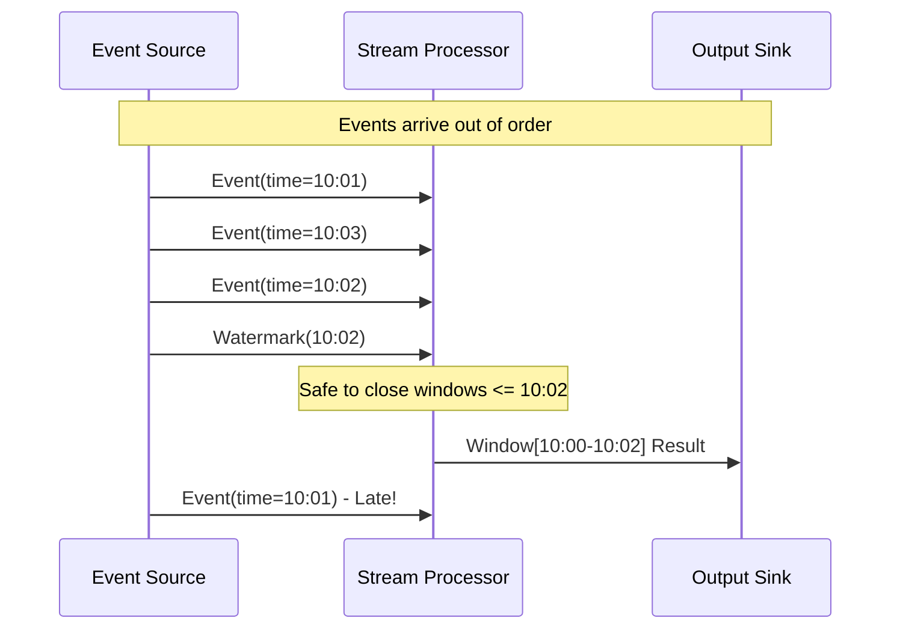
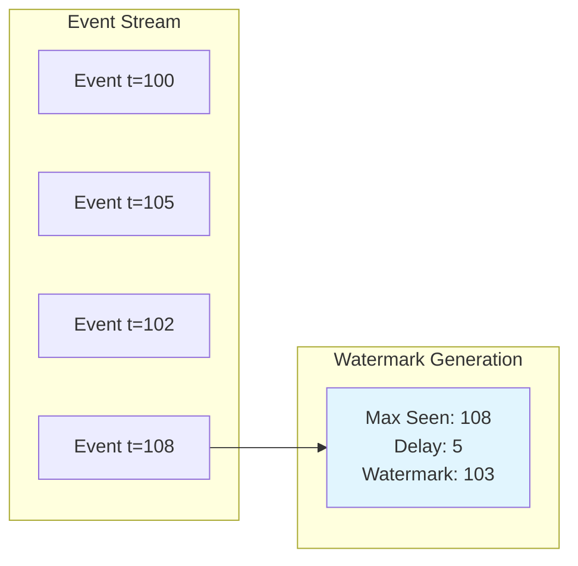
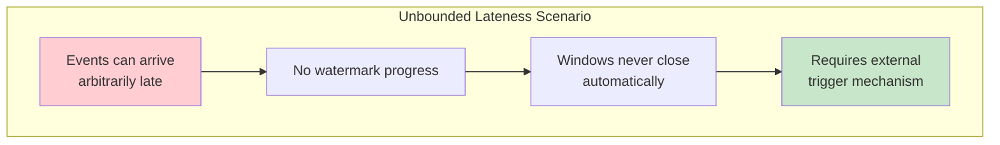
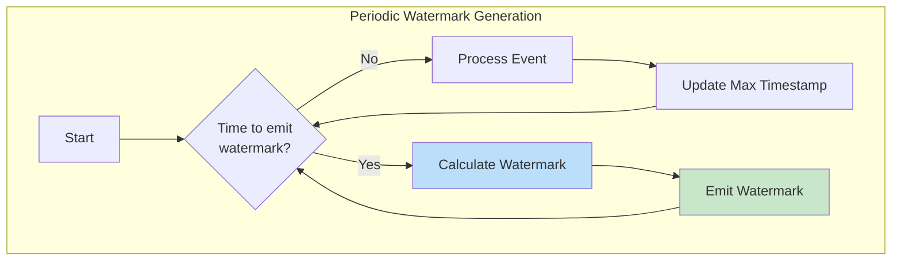
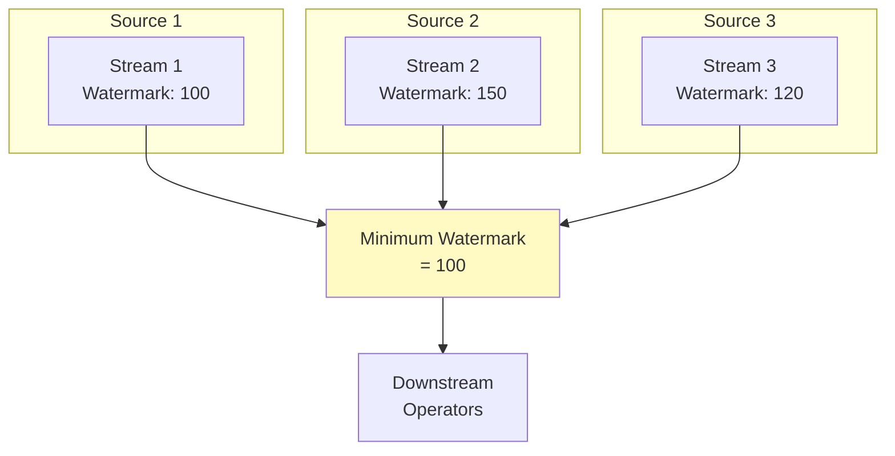
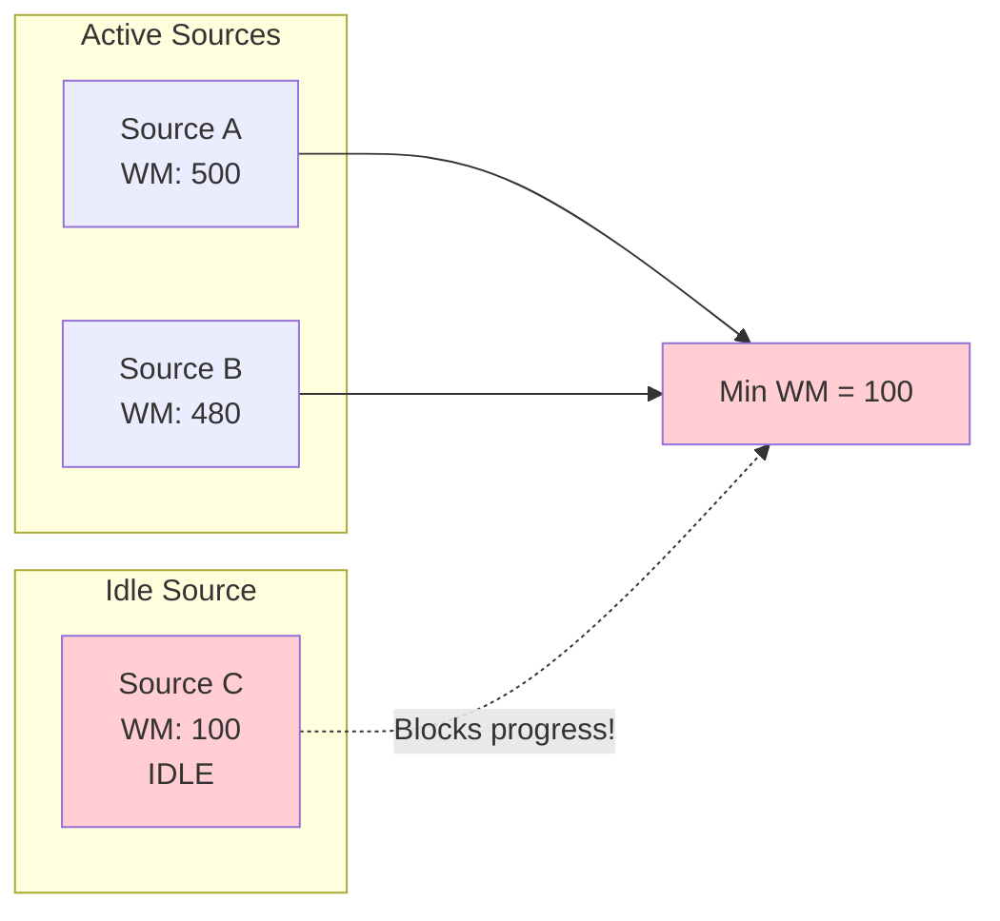
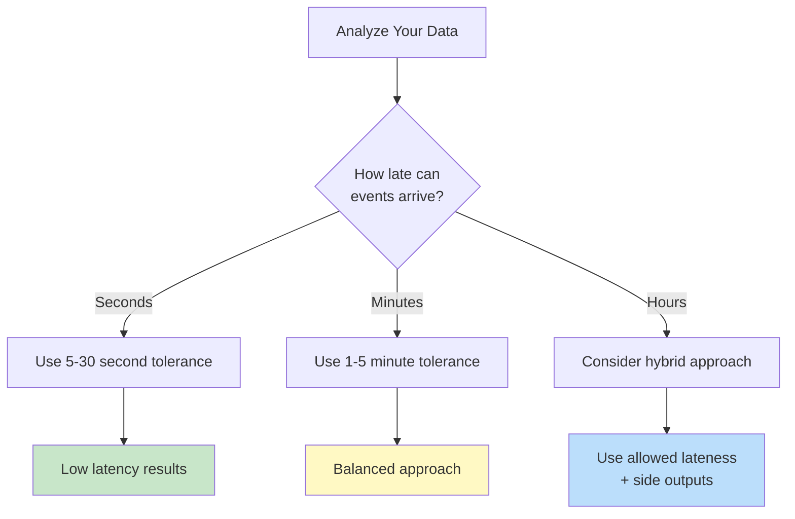

# How to Implement Watermark Generation

Author: [nawazdhandala](https://github.com/nawazdhandala)

Tags: Stream Processing, Watermarks, Event Time, Apache Flink

Description: Learn how to implement watermark generation strategies for handling out-of-order events.

---

## Introduction

In stream processing, handling time is one of the most challenging aspects of building reliable data pipelines. When processing events based on their event time (the time when the event actually occurred), you need a mechanism to track progress and determine when it is safe to emit results. This mechanism is called **watermarking**.

A watermark is a timestamp that indicates all events with timestamps less than or equal to the watermark have been observed. Watermarks allow stream processors to handle late-arriving or out-of-order events while still making progress and producing timely results.

## Why Watermarks Matter

In an ideal world, events would arrive in perfect order based on their event time. In reality, events often arrive out of order due to:

- Network latency variations
- Distributed system clock skew
- Buffering and batching in upstream systems
- Retry mechanisms and failure recovery

Without watermarks, a stream processor would have no way to know when it has received "enough" data to produce a result for a given time window.



## Watermark Generation Strategies

There are several strategies for generating watermarks, each suited to different use cases and lateness tolerances.

### 1. Bounded Out-of-Orderness Watermarks

The most common strategy assumes that events can be late by at most a fixed duration. This is called **bounded out-of-orderness**.



**How it works:**
- Track the maximum event timestamp seen so far
- Subtract a fixed delay (the maximum expected lateness)
- Emit this value as the current watermark

Here is an implementation in Apache Flink:

```java
import org.apache.flink.api.common.eventtime.WatermarkStrategy;
import org.apache.flink.api.common.eventtime.WatermarkGenerator;
import org.apache.flink.api.common.eventtime.WatermarkGeneratorSupplier;
import org.apache.flink.api.common.eventtime.WatermarkOutput;
import org.apache.flink.api.common.eventtime.Watermark;

import java.time.Duration;

// Using the built-in bounded out-of-orderness strategy
// This is the recommended approach for most use cases
WatermarkStrategy<MyEvent> strategy = WatermarkStrategy
    // Allow events to be up to 5 seconds late
    .<MyEvent>forBoundedOutOfOrderness(Duration.ofSeconds(5))
    // Extract the event timestamp from each event
    .withTimestampAssigner((event, timestamp) -> event.getEventTime());

// Apply the watermark strategy to your data stream
DataStream<MyEvent> streamWithWatermarks = inputStream
    .assignTimestampsAndWatermarks(strategy);
```

### 2. Custom Bounded Out-of-Orderness Implementation

For learning purposes, here is how you might implement bounded out-of-orderness manually:

```java
import org.apache.flink.api.common.eventtime.WatermarkGenerator;
import org.apache.flink.api.common.eventtime.WatermarkOutput;
import org.apache.flink.api.common.eventtime.Watermark;

/**
 * A custom watermark generator that implements bounded out-of-orderness.
 *
 * This generator tracks the maximum timestamp seen and emits watermarks
 * that are behind by a configurable maximum lateness duration.
 */
public class BoundedOutOfOrdernessGenerator<T> implements WatermarkGenerator<T> {

    // The maximum amount of time an event can be late
    private final long maxOutOfOrdernessMillis;

    // Track the highest timestamp we have seen so far
    private long currentMaxTimestamp = Long.MIN_VALUE;

    // Function to extract timestamp from events
    private final TimestampExtractor<T> timestampExtractor;

    public BoundedOutOfOrdernessGenerator(
            long maxOutOfOrdernessMillis,
            TimestampExtractor<T> timestampExtractor) {
        this.maxOutOfOrdernessMillis = maxOutOfOrdernessMillis;
        this.timestampExtractor = timestampExtractor;
    }

    /**
     * Called for each event in the stream.
     * Updates the maximum timestamp if this event has a higher timestamp.
     */
    @Override
    public void onEvent(T event, long eventTimestamp, WatermarkOutput output) {
        // Extract the event time from the event
        long timestamp = timestampExtractor.extractTimestamp(event);

        // Update the maximum timestamp seen
        currentMaxTimestamp = Math.max(currentMaxTimestamp, timestamp);
    }

    /**
     * Called periodically to emit watermarks.
     * Emits a watermark that is (maxTimestamp - maxOutOfOrderness).
     */
    @Override
    public void onPeriodicEmit(WatermarkOutput output) {
        // Only emit if we have seen at least one event
        if (currentMaxTimestamp != Long.MIN_VALUE) {
            // Calculate watermark: max seen timestamp minus the allowed lateness
            long watermarkTimestamp = currentMaxTimestamp - maxOutOfOrdernessMillis;
            output.emitWatermark(new Watermark(watermarkTimestamp));
        }
    }

    @FunctionalInterface
    public interface TimestampExtractor<T> {
        long extractTimestamp(T element);
    }
}
```

### 3. Unbounded Out-of-Orderness (No Watermarks)

In some scenarios, you cannot make any assumptions about how late events might arrive. This is called **unbounded out-of-orderness**.



When you have unbounded lateness, you typically need alternative approaches:

```java
import org.apache.flink.api.common.eventtime.WatermarkStrategy;

// Strategy for unbounded lateness - watermarks never advance
// Use this when you cannot bound the lateness of events
WatermarkStrategy<MyEvent> noWatermarks = WatermarkStrategy
    .<MyEvent>noWatermarks()
    .withTimestampAssigner((event, timestamp) -> event.getEventTime());

// Alternative: Use processing time triggers with allowed lateness
// This allows late events while still making progress
DataStream<MyEvent> result = inputStream
    .assignTimestampsAndWatermarks(
        WatermarkStrategy
            .<MyEvent>forBoundedOutOfOrderness(Duration.ofMinutes(1))
            .withTimestampAssigner((event, ts) -> event.getEventTime())
    )
    .keyBy(MyEvent::getKey)
    .window(TumblingEventTimeWindows.of(Time.minutes(5)))
    // Allow late events up to 1 hour after window closes
    .allowedLateness(Time.hours(1))
    // Send late events to a side output for special handling
    .sideOutputLateData(lateOutputTag)
    .aggregate(new MyAggregateFunction());
```

### 4. Periodic Watermark Generation

Watermarks are typically generated periodically rather than for every event. This reduces overhead while still providing timely progress tracking.



Configure the watermark emission interval in Flink:

```java
import org.apache.flink.api.common.ExecutionConfig;
import org.apache.flink.streaming.api.environment.StreamExecutionEnvironment;

// Get the execution environment
StreamExecutionEnvironment env = StreamExecutionEnvironment.getExecutionEnvironment();

// Configure the interval for periodic watermark generation
// Watermarks will be emitted every 200 milliseconds
env.getConfig().setAutoWatermarkInterval(200L);

// Alternatively, set via execution configuration
ExecutionConfig config = env.getConfig();
config.setAutoWatermarkInterval(200L);
```

### 5. Punctuated Watermark Generation

Sometimes watermarks should be emitted based on specific events in the stream rather than periodically. This is called **punctuated watermark generation**.

```java
import org.apache.flink.api.common.eventtime.WatermarkGenerator;
import org.apache.flink.api.common.eventtime.WatermarkOutput;
import org.apache.flink.api.common.eventtime.Watermark;

/**
 * A punctuated watermark generator that emits watermarks
 * when special marker events are encountered in the stream.
 *
 * This is useful when the source system sends explicit
 * completeness signals.
 */
public class PunctuatedWatermarkGenerator implements WatermarkGenerator<MyEvent> {

    /**
     * Called for each event. Checks if this event is a watermark marker
     * and emits a watermark if so.
     */
    @Override
    public void onEvent(MyEvent event, long eventTimestamp, WatermarkOutput output) {
        // Check if this event is a special watermark marker
        // Some systems send explicit "all data up to time X has been sent" events
        if (event.isWatermarkMarker()) {
            // Emit a watermark based on the marker's timestamp
            output.emitWatermark(new Watermark(event.getWatermarkTimestamp()));
        }
    }

    /**
     * For punctuated generators, we typically do not emit watermarks periodically.
     * All watermarks come from the onEvent method.
     */
    @Override
    public void onPeriodicEmit(WatermarkOutput output) {
        // No periodic watermarks - all watermarks come from marker events
    }
}
```

## Handling Multiple Streams and Sources

When your pipeline has multiple input streams, each stream generates its own watermarks. The overall watermark is the minimum across all input watermarks.



```java
import org.apache.flink.api.common.eventtime.WatermarkStrategy;
import org.apache.flink.streaming.api.datastream.DataStream;

import java.time.Duration;

// Each source can have its own watermark strategy
DataStream<MyEvent> stream1 = env
    .addSource(source1)
    .assignTimestampsAndWatermarks(
        WatermarkStrategy
            .<MyEvent>forBoundedOutOfOrderness(Duration.ofSeconds(5))
            .withTimestampAssigner((event, ts) -> event.getEventTime())
    );

DataStream<MyEvent> stream2 = env
    .addSource(source2)
    .assignTimestampsAndWatermarks(
        WatermarkStrategy
            // Different lateness tolerance for different sources
            .<MyEvent>forBoundedOutOfOrderness(Duration.ofSeconds(10))
            .withTimestampAssigner((event, ts) -> event.getEventTime())
    );

// When streams are unioned or joined, Flink tracks watermarks per partition
// and advances the overall watermark as the minimum across all partitions
DataStream<MyEvent> combined = stream1.union(stream2);
```

## Handling Idle Sources

A common problem occurs when some sources become idle (stop producing events). Since the overall watermark is the minimum across all sources, an idle source can block watermark progress entirely.



Flink provides a built-in solution for idle sources:

```java
import org.apache.flink.api.common.eventtime.WatermarkStrategy;
import java.time.Duration;

// Configure watermark strategy to handle idle sources
WatermarkStrategy<MyEvent> strategy = WatermarkStrategy
    .<MyEvent>forBoundedOutOfOrderness(Duration.ofSeconds(5))
    .withTimestampAssigner((event, ts) -> event.getEventTime())
    // Mark a source as idle if no events arrive for 30 seconds
    // Idle sources are excluded from watermark calculation
    .withIdleness(Duration.ofSeconds(30));

DataStream<MyEvent> stream = env
    .addSource(kafkaSource)
    .assignTimestampsAndWatermarks(strategy);
```

## Complete Example: Event Time Processing Pipeline

Here is a complete example that puts together all the concepts:

```java
import org.apache.flink.api.common.eventtime.WatermarkStrategy;
import org.apache.flink.streaming.api.datastream.DataStream;
import org.apache.flink.streaming.api.datastream.SingleOutputStreamOperator;
import org.apache.flink.streaming.api.environment.StreamExecutionEnvironment;
import org.apache.flink.streaming.api.functions.windowing.ProcessWindowFunction;
import org.apache.flink.streaming.api.windowing.assigners.TumblingEventTimeWindows;
import org.apache.flink.streaming.api.windowing.time.Time;
import org.apache.flink.streaming.api.windowing.windows.TimeWindow;
import org.apache.flink.util.Collector;
import org.apache.flink.util.OutputTag;

import java.time.Duration;

public class WatermarkExample {

    // Tag for late events that miss the window
    private static final OutputTag<SensorReading> LATE_DATA_TAG =
        new OutputTag<SensorReading>("late-data") {};

    public static void main(String[] args) throws Exception {

        // Set up the execution environment
        StreamExecutionEnvironment env =
            StreamExecutionEnvironment.getExecutionEnvironment();

        // Configure watermark generation interval (every 200ms)
        env.getConfig().setAutoWatermarkInterval(200L);

        // Define the watermark strategy
        // - Events can be up to 10 seconds late
        // - Sources are marked idle after 1 minute of inactivity
        WatermarkStrategy<SensorReading> watermarkStrategy = WatermarkStrategy
            .<SensorReading>forBoundedOutOfOrderness(Duration.ofSeconds(10))
            .withTimestampAssigner((reading, timestamp) -> reading.getTimestamp())
            .withIdleness(Duration.ofMinutes(1));

        // Read from source and assign watermarks
        DataStream<SensorReading> readings = env
            .addSource(new SensorSource())
            .assignTimestampsAndWatermarks(watermarkStrategy);

        // Process data in 1-minute tumbling windows
        SingleOutputStreamOperator<WindowResult> results = readings
            .keyBy(SensorReading::getSensorId)
            .window(TumblingEventTimeWindows.of(Time.minutes(1)))
            // Allow late data up to 5 minutes after window closes
            .allowedLateness(Time.minutes(5))
            // Send very late data to side output
            .sideOutputLateData(LATE_DATA_TAG)
            .process(new SensorWindowProcessor());

        // Handle late data separately
        DataStream<SensorReading> lateData = results.getSideOutput(LATE_DATA_TAG);
        lateData.addSink(new LateDataSink());

        // Output main results
        results.addSink(new ResultSink());

        env.execute("Watermark Example");
    }

    /**
     * Process window function that calculates statistics for each sensor.
     */
    public static class SensorWindowProcessor
            extends ProcessWindowFunction<SensorReading, WindowResult, String, TimeWindow> {

        @Override
        public void process(
                String sensorId,
                Context context,
                Iterable<SensorReading> readings,
                Collector<WindowResult> out) {

            // Calculate statistics from the readings
            double sum = 0;
            int count = 0;
            double min = Double.MAX_VALUE;
            double max = Double.MIN_VALUE;

            for (SensorReading reading : readings) {
                double value = reading.getValue();
                sum += value;
                count++;
                min = Math.min(min, value);
                max = Math.max(max, value);
            }

            // Get window timing information
            long windowStart = context.window().getStart();
            long windowEnd = context.window().getEnd();
            long currentWatermark = context.currentWatermark();

            // Emit the result
            out.collect(new WindowResult(
                sensorId,
                windowStart,
                windowEnd,
                count,
                sum / count,  // average
                min,
                max,
                currentWatermark
            ));
        }
    }
}
```

## Best Practices for Watermark Generation

### 1. Choose the Right Lateness Tolerance



### 2. Monitor Watermark Lag

Track the difference between event time and processing time to detect issues:

```java
import org.apache.flink.streaming.api.functions.ProcessFunction;
import org.apache.flink.util.Collector;
import org.apache.flink.metrics.Gauge;

/**
 * A process function that monitors watermark lag as a metric.
 */
public class WatermarkLagMonitor<T> extends ProcessFunction<T, T> {

    private transient long lastWatermark = Long.MIN_VALUE;

    @Override
    public void open(Configuration parameters) {
        // Register a gauge metric to track watermark lag
        getRuntimeContext()
            .getMetricGroup()
            .gauge("watermarkLag", (Gauge<Long>) () -> {
                if (lastWatermark == Long.MIN_VALUE) {
                    return 0L;
                }
                // Calculate lag: current processing time minus watermark
                return System.currentTimeMillis() - lastWatermark;
            });
    }

    @Override
    public void processElement(T value, Context ctx, Collector<T> out) {
        // Update the last known watermark
        lastWatermark = ctx.timerService().currentWatermark();

        // Pass through the element unchanged
        out.collect(value);
    }
}
```

### 3. Handle Late Data Gracefully

Always have a strategy for data that arrives after the watermark:

```java
// Three-tier late data handling strategy
SingleOutputStreamOperator<Result> results = stream
    .keyBy(Event::getKey)
    .window(TumblingEventTimeWindows.of(Time.minutes(5)))

    // Tier 1: Events within allowed lateness update the window result
    .allowedLateness(Time.minutes(10))

    // Tier 2: Very late events go to side output for separate processing
    .sideOutputLateData(lateOutputTag)

    .aggregate(new MyAggregator());

// Tier 3: Process late data (store for later reconciliation, alert, etc.)
results.getSideOutput(lateOutputTag)
    .process(new LateDataHandler());
```

## Summary

Watermarks are essential for event time processing in stream processing systems. Key takeaways:

1. **Bounded out-of-orderness** is the most common strategy and works well when you can estimate maximum lateness
2. **Periodic watermark generation** reduces overhead while maintaining progress
3. **Handle idle sources** to prevent watermark stalls
4. **Use allowed lateness** as a second chance for late data
5. **Monitor watermark lag** to detect and troubleshoot issues
6. **Side outputs** provide a safety net for very late data

By implementing proper watermark strategies, you can build stream processing pipelines that handle real-world timing challenges while producing accurate and timely results.

## Further Reading

- Apache Flink Documentation: Event Time and Watermarks
- Streaming Systems by Tyler Akidau, Slava Chernyak, and Reuven Lax
- The Dataflow Model: A Practical Approach to Balancing Correctness, Latency, and Cost in Massive-Scale, Unbounded, Out-of-Order Data Processing
