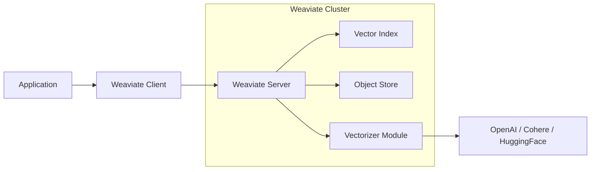
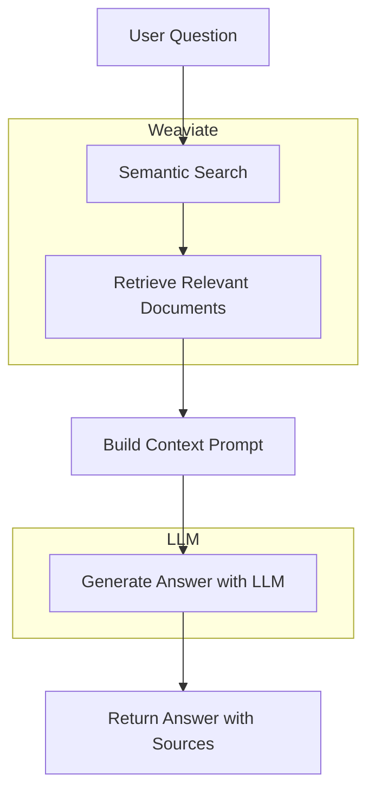

# How to Create Weaviate Integration

Author: [nawazdhandala](https://github.com/nawazdhandala)

Tags: Vector Database, Weaviate, AI, RAG

Description: Learn how to integrate Weaviate vector database into your applications for building semantic search and RAG-powered AI features.

---

Weaviate is an open-source vector database that enables semantic search, similarity matching, and retrieval-augmented generation (RAG) in your applications. Unlike traditional databases that match exact keywords, Weaviate understands meaning and context through vector embeddings, making it ideal for AI-powered features.

This guide walks you through integrating Weaviate from initial setup to production deployment, with practical examples for common use cases.

## Why Weaviate?

Before diving into implementation, here is why Weaviate stands out among vector databases:

| Feature | Benefit |
|---------|---------|
| **Native vectorization** | Built-in modules for OpenAI, Cohere, Hugging Face |
| **Hybrid search** | Combines vector and keyword search |
| **Multi-tenancy** | Isolate data per customer or project |
| **GraphQL API** | Flexible querying with familiar syntax |
| **Horizontal scaling** | Handles billions of vectors |

## Architecture Overview

Understanding how Weaviate fits into your application helps design better integrations.



The application sends data and queries through the Weaviate client. Weaviate stores objects and their vector representations, optionally generating embeddings through configured vectorizer modules.

## Installation and Setup

### Running Weaviate with Docker

The quickest way to get started is using Docker Compose. This configuration includes the text2vec-openai module for automatic vectorization.

```yaml
# docker-compose.yml
version: '3.4'
services:
  weaviate:
    image: semitechnologies/weaviate:1.24.1
    restart: on-failure:0
    ports:
      - "8080:8080"
      - "50051:50051"
    environment:
      # Core configuration
      QUERY_DEFAULTS_LIMIT: 25
      AUTHENTICATION_ANONYMOUS_ACCESS_ENABLED: 'true'
      PERSISTENCE_DATA_PATH: '/var/lib/weaviate'
      DEFAULT_VECTORIZER_MODULE: 'text2vec-openai'

      # Enable OpenAI vectorizer module
      ENABLE_MODULES: 'text2vec-openai,generative-openai'

      # Cluster configuration
      CLUSTER_HOSTNAME: 'node1'
    volumes:
      - weaviate_data:/var/lib/weaviate

volumes:
  weaviate_data:
```

Start Weaviate with:

```bash
docker-compose up -d
```

### Installing the Client Library

Weaviate provides clients for multiple languages. We will use the Python and Node.js clients in our examples.

Python installation:

```bash
pip install weaviate-client
```

Node.js installation:

```bash
npm install weaviate-ts-client
```

## Connecting to Weaviate

### Python Client Connection

Establish a connection with proper error handling and configuration.

```python
import weaviate
from weaviate.auth import AuthApiKey
import os

def create_weaviate_client():
    """
    Create a Weaviate client with appropriate configuration.
    Supports both local development and cloud deployment.
    """

    # Check if using Weaviate Cloud Services
    weaviate_url = os.getenv("WEAVIATE_URL", "http://localhost:8080")
    weaviate_api_key = os.getenv("WEAVIATE_API_KEY")
    openai_api_key = os.getenv("OPENAI_API_KEY")

    # Build connection parameters
    if weaviate_api_key:
        # Cloud deployment with API key authentication
        auth_config = AuthApiKey(api_key=weaviate_api_key)
        client = weaviate.Client(
            url=weaviate_url,
            auth_client_secret=auth_config,
            additional_headers={
                "X-OpenAI-Api-Key": openai_api_key
            }
        )
    else:
        # Local development without authentication
        client = weaviate.Client(
            url=weaviate_url,
            additional_headers={
                "X-OpenAI-Api-Key": openai_api_key
            }
        )

    # Verify connection
    if not client.is_ready():
        raise ConnectionError("Failed to connect to Weaviate")

    return client


# Usage
client = create_weaviate_client()
print(f"Connected to Weaviate. Schema: {client.schema.get()}")
```

### Node.js Client Connection

The TypeScript client follows a similar pattern with async initialization.

```typescript
import weaviate, { WeaviateClient, ApiKey } from 'weaviate-ts-client';

interface WeaviateConfig {
  url: string;
  apiKey?: string;
  openaiApiKey?: string;
}

/**
 * Creates a configured Weaviate client instance.
 * Handles both local and cloud deployments.
 */
async function createWeaviateClient(config: WeaviateConfig): Promise<WeaviateClient> {
  const clientConfig: any = {
    scheme: new URL(config.url).protocol.replace(':', ''),
    host: new URL(config.url).host,
  };

  // Add authentication if API key is provided
  if (config.apiKey) {
    clientConfig.apiKey = new ApiKey(config.apiKey);
  }

  // Add OpenAI API key for vectorization
  if (config.openaiApiKey) {
    clientConfig.headers = {
      'X-OpenAI-Api-Key': config.openaiApiKey,
    };
  }

  const client = weaviate.client(clientConfig);

  // Verify connection
  const ready = await client.misc.readyChecker().do();
  if (!ready) {
    throw new Error('Failed to connect to Weaviate');
  }

  return client;
}

// Usage
const client = await createWeaviateClient({
  url: process.env.WEAVIATE_URL || 'http://localhost:8080',
  apiKey: process.env.WEAVIATE_API_KEY,
  openaiApiKey: process.env.OPENAI_API_KEY,
});
```

## Defining Your Schema

Weaviate uses classes to organize data, similar to tables in relational databases. Each class defines properties and how data should be vectorized.

### Creating a Document Collection

This schema defines a collection for storing documents with automatic vectorization.

```python
def create_document_schema(client):
    """
    Create a schema for document storage with semantic search capabilities.
    Uses text2vec-openai for automatic embedding generation.
    """

    document_class = {
        "class": "Document",
        "description": "A document with semantic search capabilities",

        # Configure the vectorizer module
        "vectorizer": "text2vec-openai",
        "moduleConfig": {
            "text2vec-openai": {
                "model": "text-embedding-3-small",
                "dimensions": 1536,
                "type": "text"
            },
            # Enable generative AI for RAG queries
            "generative-openai": {
                "model": "gpt-4"
            }
        },

        # Define the properties to store
        "properties": [
            {
                "name": "title",
                "dataType": ["text"],
                "description": "Document title",
                # Include in vector calculation
                "moduleConfig": {
                    "text2vec-openai": {
                        "skip": False,
                        "vectorizePropertyName": False
                    }
                }
            },
            {
                "name": "content",
                "dataType": ["text"],
                "description": "Main document content",
                "moduleConfig": {
                    "text2vec-openai": {
                        "skip": False,
                        "vectorizePropertyName": False
                    }
                }
            },
            {
                "name": "category",
                "dataType": ["text"],
                "description": "Document category for filtering",
                # Exclude from vector - used for filtering only
                "moduleConfig": {
                    "text2vec-openai": {
                        "skip": True
                    }
                }
            },
            {
                "name": "createdAt",
                "dataType": ["date"],
                "description": "Creation timestamp"
            },
            {
                "name": "metadata",
                "dataType": ["object"],
                "description": "Additional metadata",
                "nestedProperties": [
                    {"name": "author", "dataType": ["text"]},
                    {"name": "source", "dataType": ["text"]},
                    {"name": "version", "dataType": ["int"]}
                ]
            }
        ]
    }

    # Check if class already exists
    existing_schema = client.schema.get()
    existing_classes = [c["class"] for c in existing_schema.get("classes", [])]

    if "Document" not in existing_classes:
        client.schema.create_class(document_class)
        print("Document class created successfully")
    else:
        print("Document class already exists")


create_document_schema(client)
```

### Schema for Multi-tenant Applications

When building SaaS applications, multi-tenancy keeps customer data isolated.

```python
def create_multi_tenant_schema(client):
    """
    Create a multi-tenant schema where each tenant's data is isolated.
    Useful for SaaS applications with per-customer data separation.
    """

    knowledge_base_class = {
        "class": "KnowledgeBase",
        "description": "Customer knowledge base with tenant isolation",
        "vectorizer": "text2vec-openai",

        # Enable multi-tenancy
        "multiTenancyConfig": {
            "enabled": True
        },

        "moduleConfig": {
            "text2vec-openai": {
                "model": "text-embedding-3-small"
            }
        },

        "properties": [
            {
                "name": "question",
                "dataType": ["text"],
                "description": "FAQ question or article title"
            },
            {
                "name": "answer",
                "dataType": ["text"],
                "description": "Answer or article content"
            },
            {
                "name": "tags",
                "dataType": ["text[]"],
                "description": "Tags for categorization"
            }
        ]
    }

    client.schema.create_class(knowledge_base_class)

    # Create tenants for each customer
    tenants = [
        {"name": "customer_acme"},
        {"name": "customer_globex"},
        {"name": "customer_initech"}
    ]

    client.schema.add_class_tenants("KnowledgeBase", tenants)
    print(f"Created KnowledgeBase class with {len(tenants)} tenants")
```

## Inserting Data

### Single Object Insertion

Insert individual objects with automatic vectorization.

```python
import uuid
from datetime import datetime

def insert_document(client, title: str, content: str, category: str, metadata: dict):
    """
    Insert a single document into Weaviate.
    The content will be automatically vectorized.
    """

    document = {
        "title": title,
        "content": content,
        "category": category,
        "createdAt": datetime.utcnow().isoformat() + "Z",
        "metadata": metadata
    }

    # Generate a deterministic UUID based on content
    # This prevents duplicate insertions
    doc_uuid = uuid.uuid5(uuid.NAMESPACE_DNS, f"{title}-{content[:100]}")

    result = client.data_object.create(
        data_object=document,
        class_name="Document",
        uuid=str(doc_uuid)
    )

    return result


# Example usage
insert_document(
    client,
    title="Getting Started with Kubernetes",
    content="Kubernetes is a container orchestration platform that automates deployment, scaling, and management of containerized applications...",
    category="devops",
    metadata={
        "author": "Jane Developer",
        "source": "internal-docs",
        "version": 1
    }
)
```

### Batch Insertion for Large Datasets

For large datasets, batch insertion significantly improves performance.

```python
def batch_insert_documents(client, documents: list):
    """
    Insert multiple documents efficiently using batch operations.
    Handles errors gracefully and reports failed insertions.
    """

    # Configure batch settings for optimal performance
    client.batch.configure(
        batch_size=100,           # Objects per batch
        num_workers=4,            # Parallel workers
        dynamic=True,             # Adjust batch size based on performance
        timeout_retries=3,        # Retry failed batches
        connection_error_retries=3
    )

    failed_objects = []

    with client.batch as batch:
        for doc in documents:
            try:
                doc_uuid = uuid.uuid5(
                    uuid.NAMESPACE_DNS,
                    f"{doc['title']}-{doc['content'][:100]}"
                )

                batch.add_data_object(
                    data_object={
                        "title": doc["title"],
                        "content": doc["content"],
                        "category": doc.get("category", "general"),
                        "createdAt": datetime.utcnow().isoformat() + "Z",
                        "metadata": doc.get("metadata", {})
                    },
                    class_name="Document",
                    uuid=str(doc_uuid)
                )
            except Exception as e:
                failed_objects.append({"doc": doc["title"], "error": str(e)})

    # Report results
    print(f"Inserted {len(documents) - len(failed_objects)} documents")
    if failed_objects:
        print(f"Failed: {failed_objects}")

    return failed_objects


# Example: Batch insert multiple documents
documents = [
    {
        "title": "Python Best Practices",
        "content": "Writing clean Python code involves following PEP 8 guidelines...",
        "category": "programming"
    },
    {
        "title": "Docker Security Guide",
        "content": "Securing Docker containers requires understanding attack vectors...",
        "category": "security"
    },
    # ... more documents
]

batch_insert_documents(client, documents)
```

### Inserting with Custom Vectors

Sometimes you want to provide pre-computed vectors instead of using automatic vectorization.

```python
import numpy as np

def insert_with_custom_vector(client, title: str, content: str, vector: list):
    """
    Insert a document with a pre-computed vector.
    Useful when using custom embedding models or pre-processed data.
    """

    doc_uuid = uuid.uuid5(uuid.NAMESPACE_DNS, f"{title}-{content[:100]}")

    # Normalize vector (recommended for cosine similarity)
    vector_array = np.array(vector)
    normalized_vector = (vector_array / np.linalg.norm(vector_array)).tolist()

    client.data_object.create(
        data_object={
            "title": title,
            "content": content,
            "createdAt": datetime.utcnow().isoformat() + "Z"
        },
        class_name="Document",
        uuid=str(doc_uuid),
        vector=normalized_vector
    )

    return str(doc_uuid)
```

## Querying Data

### Semantic Search

Find documents based on meaning, not just keywords.

```python
def semantic_search(client, query: str, limit: int = 5, category: str = None):
    """
    Perform semantic search to find documents similar in meaning to the query.
    Optionally filter by category.
    """

    # Build the query
    search_query = (
        client.query
        .get("Document", ["title", "content", "category", "createdAt"])
        .with_near_text({"concepts": [query]})
        .with_limit(limit)
        .with_additional(["distance", "certainty", "id"])
    )

    # Add category filter if specified
    if category:
        search_query = search_query.with_where({
            "path": ["category"],
            "operator": "Equal",
            "valueText": category
        })

    result = search_query.do()

    documents = result.get("data", {}).get("Get", {}).get("Document", [])

    return [
        {
            "title": doc["title"],
            "content": doc["content"][:200] + "...",
            "category": doc["category"],
            "similarity": doc["_additional"]["certainty"]
        }
        for doc in documents
    ]


# Example: Find documents about container orchestration
results = semantic_search(
    client,
    query="How do I manage containerized applications at scale?",
    limit=5,
    category="devops"
)

for result in results:
    print(f"{result['title']} (similarity: {result['similarity']:.2f})")
```

### Hybrid Search

Combine semantic search with keyword matching for better precision.

```python
def hybrid_search(client, query: str, limit: int = 5, alpha: float = 0.5):
    """
    Perform hybrid search combining vector similarity and keyword matching.

    Args:
        query: Search query text
        limit: Maximum results to return
        alpha: Balance between vector (1.0) and keyword (0.0) search
    """

    result = (
        client.query
        .get("Document", ["title", "content", "category"])
        .with_hybrid(
            query=query,
            alpha=alpha,  # 0.5 = equal weight to vector and keyword
            properties=["title", "content"]  # Fields to search
        )
        .with_limit(limit)
        .with_additional(["score", "explainScore"])
        .do()
    )

    documents = result.get("data", {}).get("Get", {}).get("Document", [])

    return [
        {
            "title": doc["title"],
            "content": doc["content"][:200] + "...",
            "score": doc["_additional"]["score"]
        }
        for doc in documents
    ]


# Hybrid search gives better results for queries with specific terms
results = hybrid_search(
    client,
    query="Kubernetes pod scheduling algorithms",
    alpha=0.7  # Lean more toward semantic search
)
```

### Filtered Search with Complex Conditions

Combine semantic search with structured filtering.

```python
def advanced_filtered_search(client, query: str, filters: dict, limit: int = 10):
    """
    Semantic search with complex filtering conditions.

    Args:
        query: Semantic search query
        filters: Dictionary of filter conditions
            - categories: List of allowed categories
            - date_from: Minimum creation date
            - date_to: Maximum creation date
            - author: Author name to match
    """

    # Build filter conditions
    where_conditions = []

    if filters.get("categories"):
        where_conditions.append({
            "path": ["category"],
            "operator": "ContainsAny",
            "valueTextArray": filters["categories"]
        })

    if filters.get("date_from"):
        where_conditions.append({
            "path": ["createdAt"],
            "operator": "GreaterThanEqual",
            "valueDate": filters["date_from"]
        })

    if filters.get("date_to"):
        where_conditions.append({
            "path": ["createdAt"],
            "operator": "LessThanEqual",
            "valueDate": filters["date_to"]
        })

    if filters.get("author"):
        where_conditions.append({
            "path": ["metadata", "author"],
            "operator": "Equal",
            "valueText": filters["author"]
        })

    # Combine conditions with AND
    where_filter = None
    if len(where_conditions) == 1:
        where_filter = where_conditions[0]
    elif len(where_conditions) > 1:
        where_filter = {
            "operator": "And",
            "operands": where_conditions
        }

    # Execute query
    search_query = (
        client.query
        .get("Document", ["title", "content", "category", "createdAt", "metadata"])
        .with_near_text({"concepts": [query]})
        .with_limit(limit)
        .with_additional(["certainty"])
    )

    if where_filter:
        search_query = search_query.with_where(where_filter)

    return search_query.do()


# Example: Find recent security docs by a specific author
results = advanced_filtered_search(
    client,
    query="container security best practices",
    filters={
        "categories": ["security", "devops"],
        "date_from": "2024-01-01T00:00:00Z",
        "author": "Jane Developer"
    }
)
```

## Building RAG Applications

Retrieval-Augmented Generation combines semantic search with LLM generation for powerful question-answering systems.



### Simple RAG Query

Weaviate's generative module handles RAG queries natively.

```python
def rag_query(client, question: str, limit: int = 3):
    """
    Perform a RAG query: retrieve relevant documents and generate an answer.
    Uses Weaviate's built-in generative module.
    """

    # Prompt template for the LLM
    generate_prompt = """
    Based on the following documents, answer the question.
    If the documents don't contain relevant information, say so.

    Question: {question}

    Provide a clear, concise answer with specific details from the documents.
    """

    result = (
        client.query
        .get("Document", ["title", "content"])
        .with_near_text({"concepts": [question]})
        .with_limit(limit)
        .with_generate(
            grouped_task=generate_prompt.format(question=question)
        )
        .do()
    )

    data = result.get("data", {}).get("Get", {}).get("Document", [])

    if not data:
        return {"answer": "No relevant documents found.", "sources": []}

    # Extract generated answer and sources
    generated = data[0].get("_additional", {}).get("generate", {})

    return {
        "answer": generated.get("groupedResult", ""),
        "sources": [
            {"title": doc["title"], "excerpt": doc["content"][:200]}
            for doc in data
        ]
    }


# Example usage
response = rag_query(
    client,
    question="How do I configure horizontal pod autoscaling in Kubernetes?"
)

print(f"Answer: {response['answer']}")
print(f"\nSources:")
for source in response['sources']:
    print(f"  - {source['title']}")
```

### Advanced RAG with Citation

Build a more sophisticated RAG system that cites sources properly.

```python
def rag_with_citations(client, question: str, limit: int = 5):
    """
    RAG query that generates answers with inline citations.
    Each claim is linked to its source document.
    """

    # First, retrieve relevant documents
    search_result = (
        client.query
        .get("Document", ["title", "content", "metadata"])
        .with_near_text({"concepts": [question]})
        .with_limit(limit)
        .with_additional(["id", "certainty"])
        .do()
    )

    documents = search_result.get("data", {}).get("Get", {}).get("Document", [])

    if not documents:
        return {"answer": "No relevant information found.", "citations": []}

    # Build numbered context with source references
    context_parts = []
    citations = []

    for i, doc in enumerate(documents, 1):
        context_parts.append(f"[{i}] {doc['title']}\n{doc['content']}")
        citations.append({
            "number": i,
            "title": doc["title"],
            "author": doc.get("metadata", {}).get("author", "Unknown"),
            "certainty": doc["_additional"]["certainty"]
        })

    context = "\n\n---\n\n".join(context_parts)

    # Generate answer with citation instructions
    generate_prompt = f"""
    Answer the following question using ONLY the provided sources.
    Include citation numbers [1], [2], etc. when referencing information.

    Question: {question}

    Sources:
    {context}

    Provide a comprehensive answer with citations. If sources conflict, note the discrepancy.
    """

    # Use generative search for the answer
    gen_result = (
        client.query
        .get("Document", ["title"])
        .with_near_text({"concepts": [question]})
        .with_limit(1)
        .with_generate(single_prompt=generate_prompt)
        .do()
    )

    generated = gen_result.get("data", {}).get("Get", {}).get("Document", [])
    answer = generated[0]["_additional"]["generate"]["singleResult"] if generated else ""

    return {
        "answer": answer,
        "citations": citations
    }
```

## Production Best Practices

### Connection Pooling and Error Handling

```python
import time
from functools import wraps

class WeaviateService:
    """
    Production-ready Weaviate service with connection management,
    retry logic, and proper error handling.
    """

    def __init__(self, url: str, api_key: str = None, openai_key: str = None):
        self.url = url
        self.api_key = api_key
        self.openai_key = openai_key
        self._client = None
        self._last_health_check = 0
        self._health_check_interval = 30  # seconds

    @property
    def client(self):
        """Lazy client initialization with health checking."""
        current_time = time.time()

        if self._client is None:
            self._client = self._create_client()
        elif current_time - self._last_health_check > self._health_check_interval:
            if not self._client.is_ready():
                self._client = self._create_client()
            self._last_health_check = current_time

        return self._client

    def _create_client(self):
        """Create a new Weaviate client instance."""
        import weaviate
        from weaviate.auth import AuthApiKey

        config = {"url": self.url}

        if self.api_key:
            config["auth_client_secret"] = AuthApiKey(api_key=self.api_key)

        headers = {}
        if self.openai_key:
            headers["X-OpenAI-Api-Key"] = self.openai_key

        if headers:
            config["additional_headers"] = headers

        client = weaviate.Client(**config)

        if not client.is_ready():
            raise ConnectionError(f"Cannot connect to Weaviate at {self.url}")

        self._last_health_check = time.time()
        return client

    def retry_operation(self, max_retries: int = 3, backoff_factor: float = 0.5):
        """Decorator for retrying failed operations."""
        def decorator(func):
            @wraps(func)
            def wrapper(*args, **kwargs):
                last_exception = None

                for attempt in range(max_retries):
                    try:
                        return func(*args, **kwargs)
                    except Exception as e:
                        last_exception = e
                        if attempt < max_retries - 1:
                            sleep_time = backoff_factor * (2 ** attempt)
                            time.sleep(sleep_time)
                            # Reset client on connection errors
                            if "connection" in str(e).lower():
                                self._client = None

                raise last_exception
            return wrapper
        return decorator

    def search(self, query: str, limit: int = 10):
        """Search with automatic retry."""
        @self.retry_operation(max_retries=3)
        def _search():
            return (
                self.client.query
                .get("Document", ["title", "content", "category"])
                .with_near_text({"concepts": [query]})
                .with_limit(limit)
                .with_additional(["certainty"])
                .do()
            )

        return _search()


# Usage
weaviate_service = WeaviateService(
    url=os.getenv("WEAVIATE_URL"),
    api_key=os.getenv("WEAVIATE_API_KEY"),
    openai_key=os.getenv("OPENAI_API_KEY")
)

results = weaviate_service.search("kubernetes deployment strategies")
```

### Monitoring and Observability

Track Weaviate operations for debugging and performance optimization.

```python
import time
import logging
from contextlib import contextmanager

logger = logging.getLogger("weaviate")

@contextmanager
def track_operation(operation_name: str, **attributes):
    """
    Context manager for tracking Weaviate operations.
    Logs timing and errors for observability.
    """
    start_time = time.time()

    logger.info(f"Starting {operation_name}", extra=attributes)

    try:
        yield
        duration = time.time() - start_time
        logger.info(
            f"Completed {operation_name}",
            extra={
                **attributes,
                "duration_ms": duration * 1000,
                "status": "success"
            }
        )
    except Exception as e:
        duration = time.time() - start_time
        logger.error(
            f"Failed {operation_name}: {str(e)}",
            extra={
                **attributes,
                "duration_ms": duration * 1000,
                "status": "error",
                "error": str(e)
            }
        )
        raise


# Usage in search operations
def monitored_search(client, query: str, limit: int = 10):
    with track_operation("semantic_search", query=query, limit=limit):
        result = (
            client.query
            .get("Document", ["title", "content"])
            .with_near_text({"concepts": [query]})
            .with_limit(limit)
            .do()
        )

    return result
```

### Index Optimization

Configure vector indexes for your specific use case.

```python
def create_optimized_schema(client, expected_object_count: int):
    """
    Create a schema with index settings optimized for the expected data size.

    HNSW parameters affect search speed vs accuracy tradeoff:
    - efConstruction: Higher = better recall, slower indexing
    - maxConnections: Higher = better recall, more memory
    - ef: Higher = better recall, slower queries
    """

    # Determine settings based on data size
    if expected_object_count < 10000:
        # Small dataset: optimize for accuracy
        ef_construction = 128
        max_connections = 64
        ef = 100
    elif expected_object_count < 1000000:
        # Medium dataset: balanced settings
        ef_construction = 128
        max_connections = 32
        ef = 64
    else:
        # Large dataset: optimize for speed
        ef_construction = 64
        max_connections = 16
        ef = 32

    document_class = {
        "class": "OptimizedDocument",
        "vectorizer": "text2vec-openai",

        # Configure HNSW index
        "vectorIndexConfig": {
            "distance": "cosine",
            "efConstruction": ef_construction,
            "maxConnections": max_connections,
            "ef": ef,

            # Enable vector compression for large datasets
            "pq": {
                "enabled": expected_object_count > 100000,
                "segments": 128,
                "centroids": 256
            }
        },

        # Configure inverted index for filtering
        "invertedIndexConfig": {
            "indexTimestamps": True,
            "indexNullState": True,
            "indexPropertyLength": True
        },

        "properties": [
            {
                "name": "title",
                "dataType": ["text"],
                "indexFilterable": True,
                "indexSearchable": True
            },
            {
                "name": "content",
                "dataType": ["text"],
                "indexFilterable": False,
                "indexSearchable": True
            },
            {
                "name": "category",
                "dataType": ["text"],
                "indexFilterable": True,
                "indexSearchable": False
            }
        ]
    }

    client.schema.create_class(document_class)
    print(f"Created optimized schema for ~{expected_object_count} objects")
```

## Testing Weaviate Integrations

### Unit Testing with Mocks

```python
import pytest
from unittest.mock import Mock, MagicMock

class TestSemanticSearch:
    """Test semantic search functionality with mocked Weaviate client."""

    @pytest.fixture
    def mock_client(self):
        """Create a mock Weaviate client."""
        client = Mock()

        # Mock successful search response
        client.query.get.return_value.with_near_text.return_value \
            .with_limit.return_value.with_additional.return_value.do.return_value = {
            "data": {
                "Get": {
                    "Document": [
                        {
                            "title": "Test Document",
                            "content": "Test content about the query",
                            "_additional": {"certainty": 0.95}
                        }
                    ]
                }
            }
        }

        return client

    def test_semantic_search_returns_results(self, mock_client):
        """Verify semantic search returns formatted results."""
        results = semantic_search(mock_client, "test query", limit=5)

        assert len(results) == 1
        assert results[0]["title"] == "Test Document"
        assert results[0]["similarity"] == 0.95

    def test_semantic_search_handles_empty_results(self, mock_client):
        """Verify empty result handling."""
        mock_client.query.get.return_value.with_near_text.return_value \
            .with_limit.return_value.with_additional.return_value.do.return_value = {
            "data": {"Get": {"Document": []}}
        }

        results = semantic_search(mock_client, "nonexistent topic")
        assert len(results) == 0
```

### Integration Testing

```python
import pytest
import os

@pytest.fixture(scope="module")
def weaviate_client():
    """
    Create a real Weaviate client for integration tests.
    Requires a running Weaviate instance.
    """
    import weaviate

    client = weaviate.Client(
        url=os.getenv("WEAVIATE_TEST_URL", "http://localhost:8080")
    )

    # Create test schema
    test_class = {
        "class": "TestDocument",
        "vectorizer": "none",  # Use provided vectors for testing
        "properties": [
            {"name": "title", "dataType": ["text"]},
            {"name": "content", "dataType": ["text"]}
        ]
    }

    # Clean up any existing test class
    try:
        client.schema.delete_class("TestDocument")
    except:
        pass

    client.schema.create_class(test_class)

    yield client

    # Cleanup
    client.schema.delete_class("TestDocument")


class TestWeaviateIntegration:
    """Integration tests requiring a running Weaviate instance."""

    def test_insert_and_search(self, weaviate_client):
        """Test full insert and search workflow."""
        # Insert test document with a simple vector
        weaviate_client.data_object.create(
            data_object={
                "title": "Integration Test",
                "content": "Testing Weaviate integration"
            },
            class_name="TestDocument",
            vector=[0.1] * 1536  # Simple test vector
        )

        # Search for it
        result = (
            weaviate_client.query
            .get("TestDocument", ["title", "content"])
            .with_near_vector({"vector": [0.1] * 1536})
            .with_limit(1)
            .do()
        )

        documents = result["data"]["Get"]["TestDocument"]
        assert len(documents) == 1
        assert documents[0]["title"] == "Integration Test"
```

## Summary

| Task | Key Points |
|------|------------|
| **Setup** | Docker Compose for local dev, configure vectorizer modules |
| **Schema** | Define classes with properties, enable multi-tenancy for SaaS |
| **Insertion** | Batch operations for large datasets, deterministic UUIDs prevent duplicates |
| **Search** | Semantic for meaning, hybrid for precision, filters for structure |
| **RAG** | Built-in generative module, cite sources properly |
| **Production** | Connection pooling, retry logic, index optimization |

Weaviate provides the foundation for building AI-powered search and RAG applications. Start with the basic semantic search, then layer on hybrid search and generative features as your application requirements grow.

For monitoring your Weaviate integration in production, consider pairing it with [OneUptime](https://oneuptime.com) to track query latency, error rates, and index health alongside the rest of your infrastructure.

---

**Related Reading:**

- [Traces and Spans in OpenTelemetry](https://oneuptime.com/blog/post/2025-08-27-traces-and-spans-in-opentelemetry/view)
- [How to Structure Logs Properly in OpenTelemetry](https://oneuptime.com/blog/post/2025-08-28-how-to-structure-logs-properly-in-opentelemetry/view)
- [Keep PII Out of Observability Telemetry](https://oneuptime.com/blog/post/2025-11-13-keep-pii-out-of-observability-telemetry/view)
