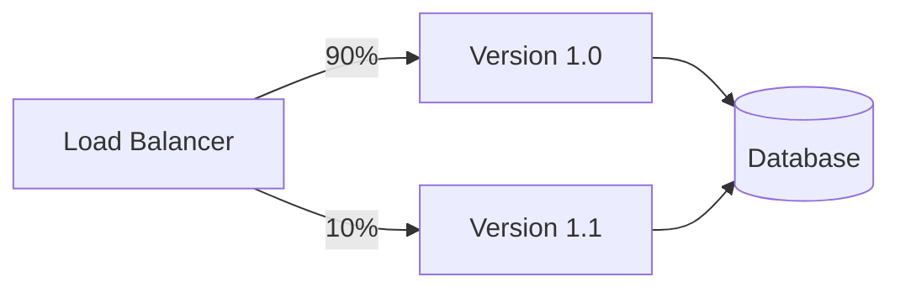
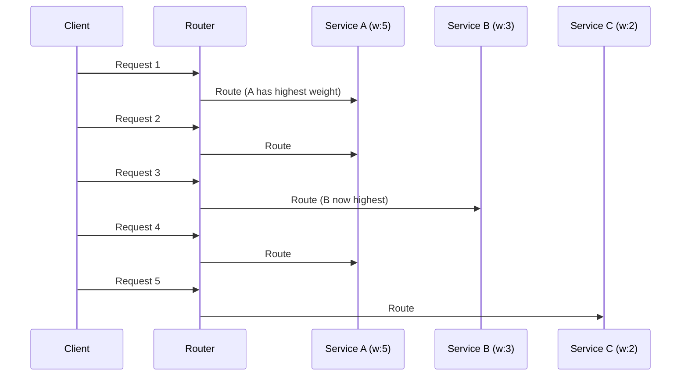
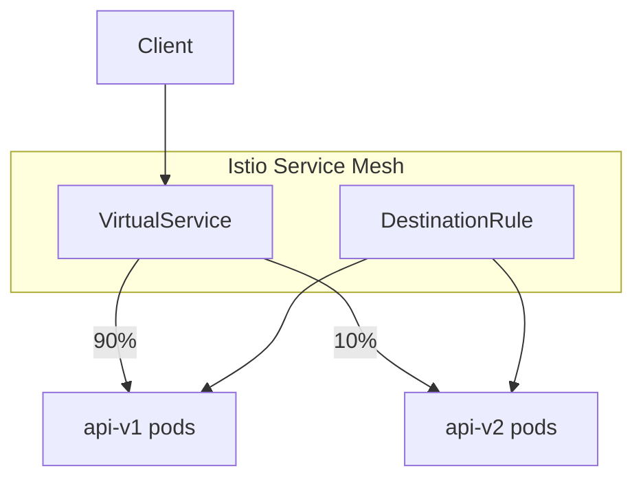
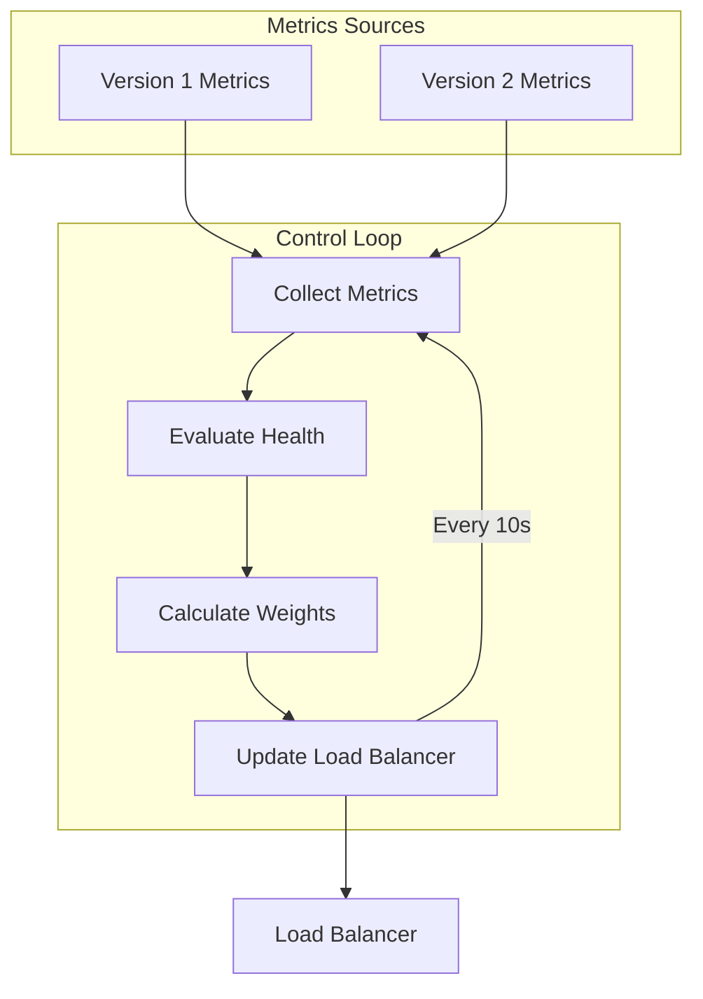
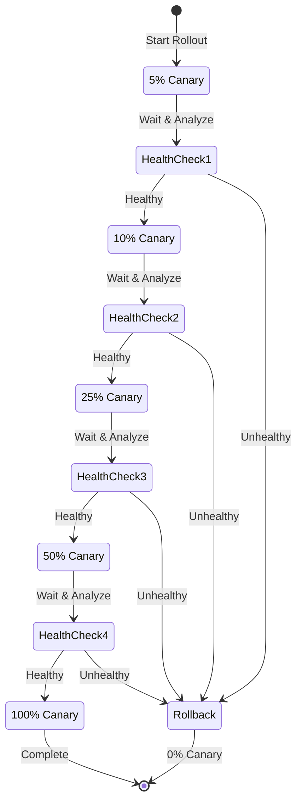

# How to Implement Weight-Based Routing

Author: [nawazdhandala](https://github.com/nawazdhandala)

Tags: API Gateway, Traffic Management, Routing, Deployment

Description: Learn how to implement weight-based routing for traffic distribution.

---

Weight-based routing is a traffic management technique that distributes requests across multiple service versions based on assigned weights. It is fundamental to canary deployments, A/B testing, and gradual rollouts. This guide covers everything from basic algorithms to production-ready implementations.

## Understanding Weight-Based Routing

Weight-based routing splits traffic between service versions proportionally. If version A has weight 90 and version B has weight 10, approximately 90% of requests go to A and 10% to B.



### Why Use Weight-Based Routing?

- **Risk mitigation**: Test new versions with limited traffic before full rollout
- **A/B testing**: Compare performance metrics between versions
- **Gradual migration**: Move traffic incrementally during major changes
- **Rollback capability**: Quickly shift traffic back if issues arise

## Weight Distribution Algorithms

Several algorithms can implement weight-based routing. Each has trade-offs in complexity, accuracy, and performance.

### Algorithm 1: Random Selection with Cumulative Weights

The simplest approach generates a random number and selects the target based on cumulative weight ranges.

```javascript
class WeightedRouter {
  constructor(targets) {
    this.targets = targets;
    this.totalWeight = targets.reduce((sum, t) => sum + t.weight, 0);
    this.buildCumulativeWeights();
  }

  buildCumulativeWeights() {
    let cumulative = 0;
    this.cumulativeTargets = this.targets.map(target => {
      cumulative += target.weight;
      return {
        ...target,
        cumulativeWeight: cumulative
      };
    });
  }

  route() {
    const random = Math.random() * this.totalWeight;

    for (const target of this.cumulativeTargets) {
      if (random < target.cumulativeWeight) {
        return target;
      }
    }

    return this.cumulativeTargets[this.cumulativeTargets.length - 1];
  }
}

// Usage
const router = new WeightedRouter([
  { name: 'v1', endpoint: 'http://api-v1:8080', weight: 90 },
  { name: 'v2', endpoint: 'http://api-v2:8080', weight: 10 }
]);

// Route 1000 requests
const distribution = { v1: 0, v2: 0 };
for (let i = 0; i < 1000; i++) {
  const target = router.route();
  distribution[target.name]++;
}
console.log(distribution); // Approximately { v1: 900, v2: 100 }
```

### Algorithm 2: Weighted Round Robin

For more deterministic distribution, weighted round robin ensures exact proportions over time.

```javascript
class WeightedRoundRobin {
  constructor(targets) {
    this.targets = targets.map(t => ({
      ...t,
      currentWeight: 0
    }));
    this.totalWeight = targets.reduce((sum, t) => sum + t.weight, 0);
  }

  route() {
    // Increase current weight by configured weight
    for (const target of this.targets) {
      target.currentWeight += target.weight;
    }

    // Select target with highest current weight
    let selected = this.targets[0];
    for (const target of this.targets) {
      if (target.currentWeight > selected.currentWeight) {
        selected = target;
      }
    }

    // Decrease selected target's weight by total
    selected.currentWeight -= this.totalWeight;

    return selected;
  }
}

// Example: weights 5:3:2 will produce pattern like:
// A, A, B, A, C, A, B, A, C, B (repeating)
const wrr = new WeightedRoundRobin([
  { name: 'A', weight: 5 },
  { name: 'B', weight: 3 },
  { name: 'C', weight: 2 }
]);
```



### Algorithm 3: Consistent Hashing with Weights

For sticky sessions with weighted distribution, use consistent hashing with virtual nodes proportional to weights.

```javascript
const crypto = require('crypto');

class WeightedConsistentHash {
  constructor(targets, virtualNodesMultiplier = 100) {
    this.ring = new Map();
    this.sortedHashes = [];

    for (const target of targets) {
      const virtualNodes = target.weight * virtualNodesMultiplier;

      for (let i = 0; i < virtualNodes; i++) {
        const hash = this.hash(`${target.name}:${i}`);
        this.ring.set(hash, target);
        this.sortedHashes.push(hash);
      }
    }

    this.sortedHashes.sort((a, b) => a - b);
  }

  hash(key) {
    const hash = crypto.createHash('md5').update(key).digest('hex');
    return parseInt(hash.substring(0, 8), 16);
  }

  route(key) {
    const hash = this.hash(key);

    // Binary search for first hash >= key hash
    let left = 0;
    let right = this.sortedHashes.length;

    while (left < right) {
      const mid = Math.floor((left + right) / 2);
      if (this.sortedHashes[mid] < hash) {
        left = mid + 1;
      } else {
        right = mid;
      }
    }

    // Wrap around if needed
    const index = left === this.sortedHashes.length ? 0 : left;
    return this.ring.get(this.sortedHashes[index]);
  }
}

// Same user always routes to same version
const hasher = new WeightedConsistentHash([
  { name: 'v1', weight: 90 },
  { name: 'v2', weight: 10 }
]);

console.log(hasher.route('user-123')); // Always same result
console.log(hasher.route('user-456')); // Always same result
```

## Canary Deployment Weights

Canary deployments use weight-based routing to test new versions with a small percentage of traffic before full rollout.

### Kubernetes Ingress with NGINX

```yaml
apiVersion: networking.k8s.io/v1
kind: Ingress
metadata:
  name: api-canary
  annotations:
    nginx.ingress.kubernetes.io/canary: "true"
    nginx.ingress.kubernetes.io/canary-weight: "10"
spec:
  ingressClassName: nginx
  rules:
    - host: api.example.com
      http:
        paths:
          - path: /
            pathType: Prefix
            backend:
              service:
                name: api-v2
                port:
                  number: 80
---
apiVersion: networking.k8s.io/v1
kind: Ingress
metadata:
  name: api-stable
spec:
  ingressClassName: nginx
  rules:
    - host: api.example.com
      http:
        paths:
          - path: /
            pathType: Prefix
            backend:
              service:
                name: api-v1
                port:
                  number: 80
```

### Istio VirtualService

Istio provides native weight-based routing through VirtualService resources.

```yaml
apiVersion: networking.istio.io/v1beta1
kind: VirtualService
metadata:
  name: api-routing
spec:
  hosts:
    - api.example.com
  http:
    - match:
        - uri:
            prefix: /api
      route:
        - destination:
            host: api
            subset: stable
          weight: 90
        - destination:
            host: api
            subset: canary
          weight: 10
---
apiVersion: networking.istio.io/v1beta1
kind: DestinationRule
metadata:
  name: api-destination
spec:
  host: api
  subsets:
    - name: stable
      labels:
        version: v1
    - name: canary
      labels:
        version: v2
```



### AWS ALB with Target Groups

```yaml
# CloudFormation template
AWSTemplateFormatVersion: '2010-09-09'
Resources:
  ALBListener:
    Type: AWS::ElasticLoadBalancingV2::Listener
    Properties:
      LoadBalancerArn: !Ref ApplicationLoadBalancer
      Port: 443
      Protocol: HTTPS
      DefaultActions:
        - Type: forward
          ForwardConfig:
            TargetGroups:
              - TargetGroupArn: !Ref StableTargetGroup
                Weight: 90
              - TargetGroupArn: !Ref CanaryTargetGroup
                Weight: 10
            TargetGroupStickinessConfig:
              Enabled: true
              DurationSeconds: 3600

  StableTargetGroup:
    Type: AWS::ElasticLoadBalancingV2::TargetGroup
    Properties:
      Name: api-stable
      Port: 8080
      Protocol: HTTP
      VpcId: !Ref VPC
      HealthCheckPath: /health

  CanaryTargetGroup:
    Type: AWS::ElasticLoadBalancingV2::TargetGroup
    Properties:
      Name: api-canary
      Port: 8080
      Protocol: HTTP
      VpcId: !Ref VPC
      HealthCheckPath: /health
```

## A/B Testing with Weights

A/B testing requires consistent routing - the same user should always see the same version during the test.

### Header-Based Routing with Weights

```javascript
const express = require('express');
const crypto = require('crypto');

const app = express();

const experiments = {
  'checkout-redesign': {
    variants: [
      { name: 'control', weight: 50, endpoint: 'http://checkout-v1:8080' },
      { name: 'treatment', weight: 50, endpoint: 'http://checkout-v2:8080' }
    ]
  },
  'pricing-test': {
    variants: [
      { name: 'A', weight: 33, endpoint: 'http://pricing-a:8080' },
      { name: 'B', weight: 33, endpoint: 'http://pricing-b:8080' },
      { name: 'C', weight: 34, endpoint: 'http://pricing-c:8080' }
    ]
  }
};

function assignVariant(userId, experimentId) {
  const experiment = experiments[experimentId];
  if (!experiment) return null;

  // Create deterministic hash from user + experiment
  const hash = crypto
    .createHash('sha256')
    .update(`${userId}:${experimentId}`)
    .digest('hex');

  // Convert first 8 chars to number (0-4294967295)
  const hashNum = parseInt(hash.substring(0, 8), 16);

  // Normalize to 0-100
  const bucket = (hashNum / 0xFFFFFFFF) * 100;

  // Find variant based on cumulative weights
  let cumulative = 0;
  for (const variant of experiment.variants) {
    cumulative += variant.weight;
    if (bucket < cumulative) {
      return variant;
    }
  }

  return experiment.variants[experiment.variants.length - 1];
}

app.use('/experiment/:experimentId', (req, res, next) => {
  const userId = req.headers['x-user-id'] || req.cookies.userId;
  const variant = assignVariant(userId, req.params.experimentId);

  if (!variant) {
    return res.status(404).json({ error: 'Experiment not found' });
  }

  // Log assignment for analytics
  console.log({
    event: 'experiment_assignment',
    userId,
    experiment: req.params.experimentId,
    variant: variant.name
  });

  // Proxy to variant endpoint
  req.variantEndpoint = variant.endpoint;
  next();
});
```

### Envoy Filter for A/B Testing

```yaml
apiVersion: networking.istio.io/v1alpha3
kind: EnvoyFilter
metadata:
  name: ab-test-filter
spec:
  workloadSelector:
    labels:
      app: api-gateway
  configPatches:
    - applyTo: HTTP_FILTER
      match:
        context: SIDECAR_INBOUND
        listener:
          filterChain:
            filter:
              name: envoy.filters.network.http_connection_manager
      patch:
        operation: INSERT_BEFORE
        value:
          name: envoy.filters.http.lua
          typed_config:
            "@type": type.googleapis.com/envoy.extensions.filters.http.lua.v3.Lua
            inlineCode: |
              function envoy_on_request(handle)
                local user_id = handle:headers():get("x-user-id")
                if user_id == nil then
                  return
                end

                -- Simple hash-based assignment
                local hash = 0
                for i = 1, #user_id do
                  hash = (hash * 31 + string.byte(user_id, i)) % 100
                end

                if hash < 50 then
                  handle:headers():add("x-variant", "control")
                else
                  handle:headers():add("x-variant", "treatment")
                end
              end
```

## Dynamic Weight Adjustment

Production systems need to adjust weights dynamically based on metrics, time, or manual intervention.

### Automated Weight Controller

```javascript
const axios = require('axios');

class DynamicWeightController {
  constructor(config) {
    this.config = config;
    this.currentWeights = { ...config.initialWeights };
    this.metricsHistory = [];
  }

  async collectMetrics() {
    const metrics = {};

    for (const [version, endpoint] of Object.entries(this.config.metricsEndpoints)) {
      try {
        const response = await axios.get(`${endpoint}/metrics`);
        metrics[version] = {
          errorRate: response.data.error_rate,
          latencyP99: response.data.latency_p99,
          successRate: response.data.success_rate
        };
      } catch (error) {
        metrics[version] = { error: true };
      }
    }

    return metrics;
  }

  evaluateHealth(metrics) {
    const thresholds = this.config.thresholds;
    const health = {};

    for (const [version, m] of Object.entries(metrics)) {
      if (m.error) {
        health[version] = 'unhealthy';
        continue;
      }

      if (m.errorRate > thresholds.maxErrorRate) {
        health[version] = 'degraded';
      } else if (m.latencyP99 > thresholds.maxLatencyP99) {
        health[version] = 'slow';
      } else {
        health[version] = 'healthy';
      }
    }

    return health;
  }

  calculateNewWeights(health) {
    const weights = { ...this.currentWeights };

    for (const [version, status] of Object.entries(health)) {
      switch (status) {
        case 'unhealthy':
          // Immediately reduce to 0
          weights[version] = 0;
          break;
        case 'degraded':
          // Reduce by 50%
          weights[version] = Math.floor(weights[version] * 0.5);
          break;
        case 'slow':
          // Reduce by 25%
          weights[version] = Math.floor(weights[version] * 0.75);
          break;
        case 'healthy':
          // Gradually restore toward target
          const target = this.config.targetWeights[version];
          if (weights[version] < target) {
            weights[version] = Math.min(target, weights[version] + 5);
          }
          break;
      }
    }

    // Normalize weights to sum to 100
    const total = Object.values(weights).reduce((a, b) => a + b, 0);
    if (total > 0) {
      for (const version of Object.keys(weights)) {
        weights[version] = Math.round((weights[version] / total) * 100);
      }
    }

    return weights;
  }

  async updateLoadBalancer(weights) {
    // Update NGINX upstream weights
    await axios.post(this.config.nginxApiEndpoint, {
      upstream: 'api_backend',
      servers: Object.entries(weights).map(([version, weight]) => ({
        address: this.config.endpoints[version],
        weight
      }))
    });

    console.log('Weights updated:', weights);
  }

  async run() {
    setInterval(async () => {
      const metrics = await this.collectMetrics();
      const health = this.evaluateHealth(metrics);
      const newWeights = this.calculateNewWeights(health);

      if (JSON.stringify(newWeights) !== JSON.stringify(this.currentWeights)) {
        await this.updateLoadBalancer(newWeights);
        this.currentWeights = newWeights;
      }
    }, this.config.intervalMs);
  }
}

// Usage
const controller = new DynamicWeightController({
  initialWeights: { v1: 90, v2: 10 },
  targetWeights: { v1: 50, v2: 50 },
  endpoints: {
    v1: 'http://api-v1:8080',
    v2: 'http://api-v2:8080'
  },
  metricsEndpoints: {
    v1: 'http://api-v1:9090',
    v2: 'http://api-v2:9090'
  },
  thresholds: {
    maxErrorRate: 0.01,    // 1%
    maxLatencyP99: 500     // 500ms
  },
  nginxApiEndpoint: 'http://nginx-controller/api/upstreams',
  intervalMs: 10000
});

controller.run();
```



### Kubernetes HPA-Style Weight Controller

```yaml
apiVersion: v1
kind: ConfigMap
metadata:
  name: weight-controller-config
data:
  config.yaml: |
    targets:
      - name: api-v1
        service: api-v1
        initialWeight: 100
      - name: api-v2
        service: api-v2
        initialWeight: 0

    rollout:
      steps:
        - weight: 10
          pause: 5m
        - weight: 25
          pause: 10m
        - weight: 50
          pause: 15m
        - weight: 100
          pause: 0

    rollback:
      errorRateThreshold: 0.05
      latencyThreshold: 1000ms
---
apiVersion: apps/v1
kind: Deployment
metadata:
  name: weight-controller
spec:
  replicas: 1
  selector:
    matchLabels:
      app: weight-controller
  template:
    metadata:
      labels:
        app: weight-controller
    spec:
      serviceAccountName: weight-controller
      containers:
        - name: controller
          image: weight-controller:latest
          volumeMounts:
            - name: config
              mountPath: /etc/config
          env:
            - name: PROMETHEUS_URL
              value: http://prometheus:9090
            - name: ISTIO_PILOT_URL
              value: http://istiod:15010
      volumes:
        - name: config
          configMap:
            name: weight-controller-config
```

## Weight Verification

Always verify that weights are being applied correctly in production.

### Verification Script

```javascript
const axios = require('axios');

async function verifyWeights(endpoint, expectedWeights, sampleSize = 10000) {
  const results = {};

  // Initialize counters
  for (const version of Object.keys(expectedWeights)) {
    results[version] = 0;
  }

  // Send requests and track responses
  console.log(`Sending ${sampleSize} requests to ${endpoint}...`);

  const batchSize = 100;
  for (let i = 0; i < sampleSize; i += batchSize) {
    const promises = [];

    for (let j = 0; j < batchSize && i + j < sampleSize; j++) {
      promises.push(
        axios.get(endpoint, {
          headers: { 'X-Request-ID': `verify-${i + j}` },
          timeout: 5000
        }).then(response => {
          const version = response.headers['x-served-by'] ||
                          response.data.version;
          if (version && results[version] !== undefined) {
            results[version]++;
          }
        }).catch(() => {
          // Ignore errors for verification
        })
      );
    }

    await Promise.all(promises);
  }

  // Calculate actual percentages
  const total = Object.values(results).reduce((a, b) => a + b, 0);
  const actualWeights = {};

  for (const [version, count] of Object.entries(results)) {
    actualWeights[version] = (count / total) * 100;
  }

  // Compare with expected
  console.log('\nWeight Verification Results:');
  console.log('===========================');

  let allPassing = true;
  const tolerance = 2; // 2% tolerance

  for (const [version, expected] of Object.entries(expectedWeights)) {
    const actual = actualWeights[version] || 0;
    const diff = Math.abs(actual - expected);
    const status = diff <= tolerance ? 'PASS' : 'FAIL';

    if (diff > tolerance) allPassing = false;

    console.log(`${version}: expected ${expected}%, actual ${actual.toFixed(2)}% [${status}]`);
  }

  console.log(`\nOverall: ${allPassing ? 'PASS' : 'FAIL'}`);

  return { actualWeights, allPassing };
}

// Usage
verifyWeights('https://api.example.com/health', {
  'v1': 90,
  'v2': 10
});
```

### Prometheus Queries for Weight Verification

```promql
# Requests per version (rate over 5 minutes)
sum(rate(http_requests_total[5m])) by (version)

# Percentage by version
sum(rate(http_requests_total[5m])) by (version)
/ ignoring(version) group_left
sum(rate(http_requests_total[5m])) * 100

# Error rate by version
sum(rate(http_requests_total{status=~"5.."}[5m])) by (version)
/ sum(rate(http_requests_total[5m])) by (version) * 100

# Latency P99 by version
histogram_quantile(0.99,
  sum(rate(http_request_duration_seconds_bucket[5m])) by (le, version)
)
```

### Grafana Dashboard Panel

```json
{
  "title": "Traffic Distribution by Version",
  "type": "piechart",
  "targets": [
    {
      "expr": "sum(rate(http_requests_total[5m])) by (version)",
      "legendFormat": "{{version}}"
    }
  ],
  "options": {
    "legend": {
      "displayMode": "table",
      "placement": "right",
      "values": ["percent", "value"]
    }
  }
}
```

## Gradual Traffic Shifting

Implement automated progressive rollouts with safety gates.

### Progressive Rollout Controller

```javascript
class ProgressiveRollout {
  constructor(config) {
    this.config = config;
    this.currentStep = 0;
    this.rolloutId = Date.now().toString();
  }

  async start() {
    console.log(`Starting rollout ${this.rolloutId}`);

    for (let i = 0; i < this.config.steps.length; i++) {
      this.currentStep = i;
      const step = this.config.steps[i];

      console.log(`Step ${i + 1}: Shifting to ${step.canaryWeight}% canary traffic`);

      // Update weights
      await this.setWeights({
        stable: 100 - step.canaryWeight,
        canary: step.canaryWeight
      });

      // Wait for metrics to stabilize
      await this.sleep(step.analysisDelay || 60000);

      // Check health
      const healthy = await this.analyzeHealth();

      if (!healthy) {
        console.log('Health check failed, initiating rollback');
        await this.rollback();
        return { success: false, reason: 'health_check_failed', step: i };
      }

      // Pause between steps
      if (step.pauseDuration && i < this.config.steps.length - 1) {
        console.log(`Pausing for ${step.pauseDuration}ms`);
        await this.sleep(step.pauseDuration);
      }
    }

    console.log('Rollout complete!');
    return { success: true };
  }

  async setWeights(weights) {
    // Istio example
    const virtualService = {
      apiVersion: 'networking.istio.io/v1beta1',
      kind: 'VirtualService',
      metadata: {
        name: this.config.serviceName,
        namespace: this.config.namespace
      },
      spec: {
        hosts: [this.config.host],
        http: [{
          route: [
            {
              destination: {
                host: this.config.serviceName,
                subset: 'stable'
              },
              weight: weights.stable
            },
            {
              destination: {
                host: this.config.serviceName,
                subset: 'canary'
              },
              weight: weights.canary
            }
          ]
        }]
      }
    };

    await this.kubeClient.apply(virtualService);
  }

  async analyzeHealth() {
    const metrics = await this.fetchMetrics();

    const checks = [
      metrics.canary.errorRate < this.config.maxErrorRate,
      metrics.canary.latencyP99 < this.config.maxLatency,
      metrics.canary.successRate > this.config.minSuccessRate
    ];

    // Compare with stable version
    if (this.config.compareWithStable) {
      checks.push(
        metrics.canary.errorRate <= metrics.stable.errorRate * 1.1,
        metrics.canary.latencyP99 <= metrics.stable.latencyP99 * 1.2
      );
    }

    return checks.every(c => c);
  }

  async rollback() {
    console.log('Rolling back to 100% stable');
    await this.setWeights({ stable: 100, canary: 0 });
  }

  sleep(ms) {
    return new Promise(resolve => setTimeout(resolve, ms));
  }
}

// Usage
const rollout = new ProgressiveRollout({
  serviceName: 'api',
  namespace: 'production',
  host: 'api.example.com',
  steps: [
    { canaryWeight: 5, analysisDelay: 60000, pauseDuration: 300000 },
    { canaryWeight: 10, analysisDelay: 60000, pauseDuration: 300000 },
    { canaryWeight: 25, analysisDelay: 60000, pauseDuration: 600000 },
    { canaryWeight: 50, analysisDelay: 60000, pauseDuration: 600000 },
    { canaryWeight: 100, analysisDelay: 60000 }
  ],
  maxErrorRate: 0.01,
  maxLatency: 500,
  minSuccessRate: 0.99,
  compareWithStable: true
});

rollout.start();
```



### Argo Rollouts Integration

```yaml
apiVersion: argoproj.io/v1alpha1
kind: Rollout
metadata:
  name: api-rollout
spec:
  replicas: 10
  selector:
    matchLabels:
      app: api
  template:
    metadata:
      labels:
        app: api
    spec:
      containers:
        - name: api
          image: api:v2
          ports:
            - containerPort: 8080
  strategy:
    canary:
      canaryService: api-canary
      stableService: api-stable
      trafficRouting:
        istio:
          virtualService:
            name: api-vsvc
            routes:
              - primary
      steps:
        - setWeight: 5
        - pause: { duration: 5m }
        - analysis:
            templates:
              - templateName: success-rate
        - setWeight: 20
        - pause: { duration: 10m }
        - analysis:
            templates:
              - templateName: success-rate
        - setWeight: 50
        - pause: { duration: 10m }
        - setWeight: 100
---
apiVersion: argoproj.io/v1alpha1
kind: AnalysisTemplate
metadata:
  name: success-rate
spec:
  metrics:
    - name: success-rate
      interval: 1m
      successCondition: result[0] >= 0.99
      failureLimit: 3
      provider:
        prometheus:
          address: http://prometheus:9090
          query: |
            sum(rate(http_requests_total{status=~"2.."}[5m]))
            / sum(rate(http_requests_total[5m]))
```

## Summary

Weight-based routing is essential for safe deployments. Key takeaways:

1. **Choose the right algorithm**: Random selection for simplicity, weighted round robin for determinism, consistent hashing for sticky sessions
2. **Automate weight adjustments**: Use metrics to drive weight changes automatically
3. **Verify continuously**: Always monitor actual traffic distribution against expected weights
4. **Implement safety gates**: Automatic rollback on health degradation
5. **Progress gradually**: Small increments with analysis between each step

Start with manual weight adjustments to understand the behavior, then automate as you gain confidence. The goal is safe, repeatable deployments that catch issues before they affect all users.
