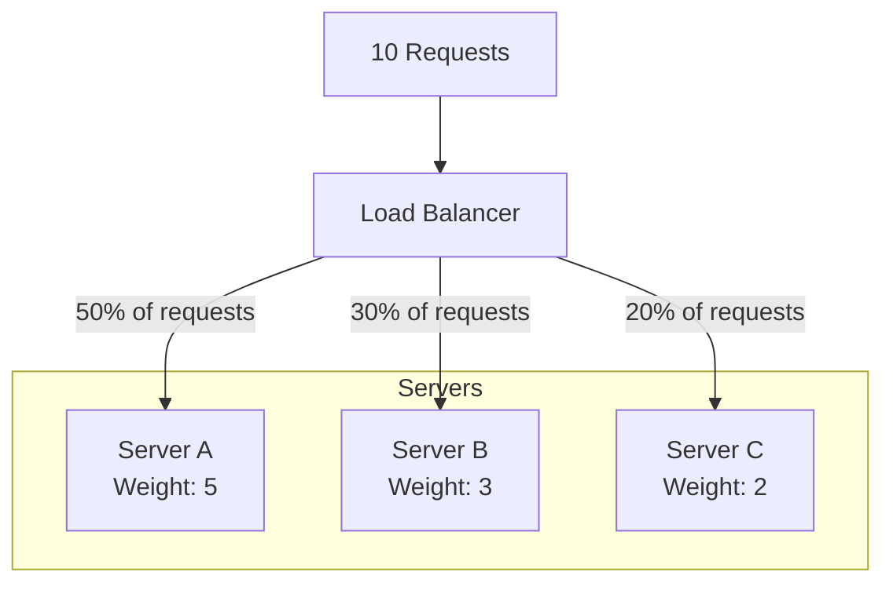
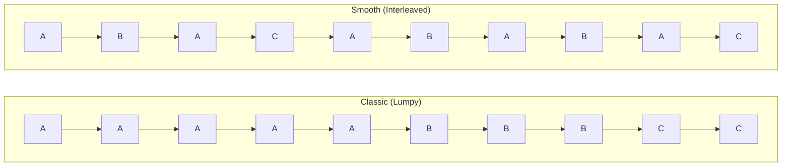
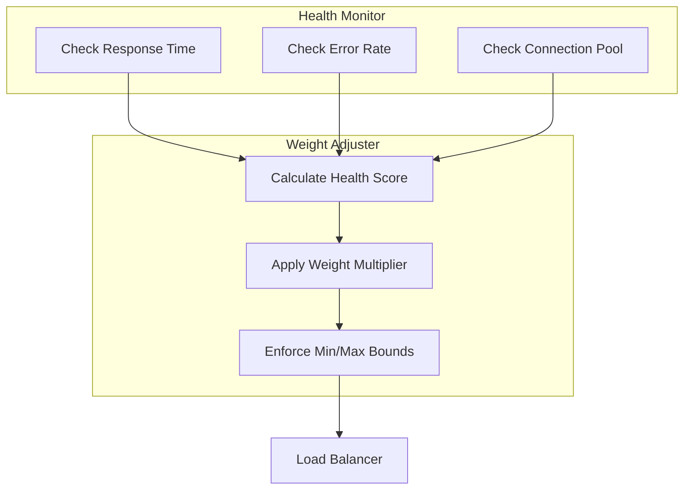
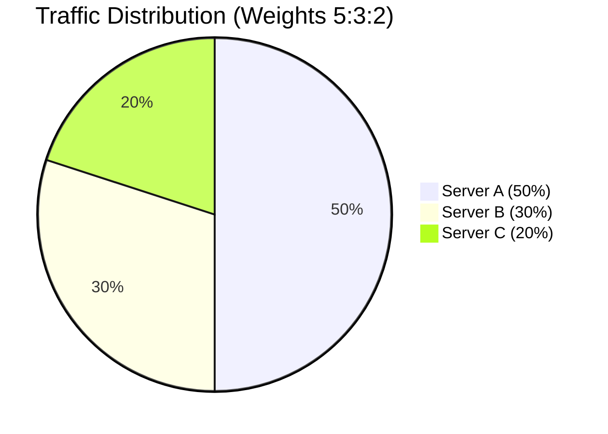

# How to Create Weighted Round Robin

Author: [nawazdhandala](https://github.com/nawazdhandala)

Tags: Load Balancing, Algorithm, Weighted, Distribution

Description: Distribute traffic across servers proportionally to their capacity using weighted round robin load balancing.

---

Standard round robin treats all servers equally. That works fine when your servers have identical specs. But in the real world, you often have a mix: some servers with 32GB RAM, others with 8GB. Some on fast SSDs, others on spinning disks. Weighted round robin lets you route more traffic to stronger servers while still giving weaker ones a fair share.

This guide covers the algorithm, multiple implementation approaches, and practical considerations for production use.

---

## Why Weighted Round Robin?

| Scenario | Problem with Simple RR | Weighted RR Solution |
|----------|------------------------|---------------------|
| Mixed server capacities | 8GB server gets same load as 32GB server | Route 4x traffic to the bigger server |
| Gradual rollout | New server gets full traffic immediately | Start with low weight, increase over time |
| Cost optimization | Expensive servers underutilized | Maximize usage of high-capacity nodes |
| Degraded servers | Failing server still gets equal share | Reduce weight during recovery |

The pattern: assign each server a weight proportional to its capacity, then distribute requests accordingly.

---

## How Weighted Round Robin Works



With weights 5:3:2, Server A handles 50% of traffic, Server B handles 30%, and Server C handles 20%. Over 10 requests, the distribution would be A=5, B=3, C=2.

---

## The Classic Algorithm

The simplest approach expands the server list based on weights. If Server A has weight 3 and Server B has weight 2, the expanded list becomes [A, A, A, B, B]. Then you cycle through it.

```typescript
interface Server {
  id: string;
  address: string;
  weight: number;
}

class SimpleWeightedRoundRobin {
  private servers: Server[];
  private expandedList: Server[];
  private currentIndex: number;

  constructor(servers: Server[]) {
    this.servers = servers;
    this.expandedList = this.buildExpandedList();
    this.currentIndex = 0;
  }

  private buildExpandedList(): Server[] {
    const list: Server[] = [];
    for (const server of this.servers) {
      for (let i = 0; i < server.weight; i++) {
        list.push(server);
      }
    }
    return list;
  }

  getNext(): Server {
    if (this.expandedList.length === 0) {
      throw new Error('No servers available');
    }

    const server = this.expandedList[this.currentIndex];
    this.currentIndex = (this.currentIndex + 1) % this.expandedList.length;
    return server;
  }
}

// Usage
const balancer = new SimpleWeightedRoundRobin([
  { id: 'srv-1', address: '10.0.0.1:8080', weight: 5 },
  { id: 'srv-2', address: '10.0.0.2:8080', weight: 3 },
  { id: 'srv-3', address: '10.0.0.3:8080', weight: 2 },
]);

// Sequence: srv-1, srv-1, srv-1, srv-1, srv-1, srv-2, srv-2, srv-2, srv-3, srv-3
for (let i = 0; i < 10; i++) {
  const server = balancer.getNext();
  console.log(`Request ${i + 1} -> ${server.id}`);
}
```

**Problem**: The distribution is lumpy. Server A gets 5 consecutive requests before B sees any traffic. During bursts, A might get overwhelmed while B and C sit idle.

---

## Smooth Weighted Round Robin

The smooth variant spreads requests more evenly. Instead of A,A,A,A,A,B,B,B,C,C, you get A,B,A,C,A,B,A,B,A,C. Same proportions, better distribution.



The algorithm tracks "current weight" for each server. Each round:
1. Add the static weight to each server's current weight
2. Pick the server with the highest current weight
3. Subtract the total weight from the selected server

```typescript
interface WeightedServer {
  id: string;
  address: string;
  weight: number;
  currentWeight: number;
}

class SmoothWeightedRoundRobin {
  private servers: WeightedServer[];
  private totalWeight: number;

  constructor(servers: Array<{ id: string; address: string; weight: number }>) {
    this.servers = servers.map(s => ({
      ...s,
      currentWeight: 0
    }));
    this.totalWeight = this.servers.reduce((sum, s) => sum + s.weight, 0);
  }

  getNext(): WeightedServer {
    if (this.servers.length === 0) {
      throw new Error('No servers available');
    }

    // Add weight to each server
    for (const server of this.servers) {
      server.currentWeight += server.weight;
    }

    // Find server with highest current weight
    let selected = this.servers[0];
    for (const server of this.servers) {
      if (server.currentWeight > selected.currentWeight) {
        selected = server;
      }
    }

    // Subtract total weight from selected server
    selected.currentWeight -= this.totalWeight;

    return selected;
  }

  // Get current distribution state for debugging
  getState(): Array<{ id: string; weight: number; currentWeight: number }> {
    return this.servers.map(s => ({
      id: s.id,
      weight: s.weight,
      currentWeight: s.currentWeight
    }));
  }
}

// Usage
const balancer = new SmoothWeightedRoundRobin([
  { id: 'srv-1', address: '10.0.0.1:8080', weight: 5 },
  { id: 'srv-2', address: '10.0.0.2:8080', weight: 3 },
  { id: 'srv-3', address: '10.0.0.3:8080', weight: 2 },
]);

// Produces interleaved sequence: srv-1, srv-2, srv-1, srv-3, srv-1, srv-2, srv-1, srv-2, srv-1, srv-3
for (let i = 0; i < 10; i++) {
  const server = balancer.getNext();
  console.log(`Request ${i + 1} -> ${server.id}`);
}
```

---

## Step-by-Step Walkthrough

Let's trace through the smooth algorithm with weights A=5, B=3, C=2 (total=10):

| Round | Before Add | After Add | Selected | After Subtract |
|-------|------------|-----------|----------|----------------|
| 1 | A=0, B=0, C=0 | A=5, B=3, C=2 | A (5) | A=-5, B=3, C=2 |
| 2 | A=-5, B=3, C=2 | A=0, B=6, C=4 | B (6) | A=0, B=-4, C=4 |
| 3 | A=0, B=-4, C=4 | A=5, B=-1, C=6 | C (6) | A=5, B=-1, C=-4 |
| 4 | A=5, B=-1, C=-4 | A=10, B=2, C=-2 | A (10) | A=0, B=2, C=-2 |
| 5 | A=0, B=2, C=-2 | A=5, B=5, C=0 | A (5)* | A=-5, B=5, C=0 |

*When tied, first server wins (or use secondary criteria)

---

## Weight Calculation Strategies

### Capacity-Based Weights

Assign weights based on server resources:

```typescript
interface ServerSpecs {
  id: string;
  address: string;
  cpuCores: number;
  memoryGB: number;
  diskType: 'ssd' | 'hdd';
}

function calculateWeight(specs: ServerSpecs): number {
  // Base weight from CPU
  let weight = specs.cpuCores;

  // Adjust for memory (1 point per 4GB)
  weight += Math.floor(specs.memoryGB / 4);

  // Bonus for SSD
  if (specs.diskType === 'ssd') {
    weight = Math.ceil(weight * 1.2);
  }

  return Math.max(1, weight);
}

// Example
const servers: ServerSpecs[] = [
  { id: 'large', address: '10.0.0.1:8080', cpuCores: 16, memoryGB: 64, diskType: 'ssd' },
  { id: 'medium', address: '10.0.0.2:8080', cpuCores: 8, memoryGB: 32, diskType: 'ssd' },
  { id: 'small', address: '10.0.0.3:8080', cpuCores: 4, memoryGB: 8, diskType: 'hdd' },
];

const weights = servers.map(s => ({
  id: s.id,
  address: s.address,
  weight: calculateWeight(s)
}));

// Results: large=38, medium=18, small=6
```

### Benchmark-Based Weights

Run load tests and assign weights based on actual throughput:

```typescript
interface BenchmarkResult {
  serverId: string;
  requestsPerSecond: number;
  p99LatencyMs: number;
}

function weightsFromBenchmarks(results: BenchmarkResult[]): Map<string, number> {
  // Use RPS as base, penalize high latency
  const scores = results.map(r => ({
    id: r.serverId,
    score: r.requestsPerSecond / (1 + r.p99LatencyMs / 100)
  }));

  // Find minimum score to normalize
  const minScore = Math.min(...scores.map(s => s.score));

  // Convert to integer weights (minimum 1)
  const weights = new Map<string, number>();
  for (const s of scores) {
    weights.set(s.id, Math.max(1, Math.round(s.score / minScore)));
  }

  return weights;
}

// Example benchmark results
const benchmarks: BenchmarkResult[] = [
  { serverId: 'srv-1', requestsPerSecond: 1000, p99LatencyMs: 50 },
  { serverId: 'srv-2', requestsPerSecond: 600, p99LatencyMs: 80 },
  { serverId: 'srv-3', requestsPerSecond: 300, p99LatencyMs: 120 },
];

const weights = weightsFromBenchmarks(benchmarks);
// Results roughly: srv-1=5, srv-2=3, srv-3=1
```

---

## Dynamic Weight Adjustment

Static weights work for stable environments. Production systems need to adapt to changing conditions.



```typescript
interface HealthMetrics {
  responseTimeMs: number;
  errorRate: number;       // 0.0 to 1.0
  activeConnections: number;
  maxConnections: number;
}

interface DynamicServer {
  id: string;
  address: string;
  baseWeight: number;
  currentWeight: number;
  effectiveWeight: number; // baseWeight * health multiplier
  metrics: HealthMetrics;
}

class DynamicWeightedRoundRobin {
  private servers: DynamicServer[];
  private totalWeight: number;

  constructor(servers: Array<{ id: string; address: string; baseWeight: number }>) {
    this.servers = servers.map(s => ({
      ...s,
      currentWeight: 0,
      effectiveWeight: s.baseWeight,
      metrics: {
        responseTimeMs: 0,
        errorRate: 0,
        activeConnections: 0,
        maxConnections: 100
      }
    }));
    this.recalculateTotalWeight();
  }

  private recalculateTotalWeight(): void {
    this.totalWeight = this.servers.reduce((sum, s) => sum + s.effectiveWeight, 0);
  }

  updateMetrics(serverId: string, metrics: Partial<HealthMetrics>): void {
    const server = this.servers.find(s => s.id === serverId);
    if (!server) return;

    Object.assign(server.metrics, metrics);
    this.adjustWeight(server);
    this.recalculateTotalWeight();
  }

  private adjustWeight(server: DynamicServer): void {
    let multiplier = 1.0;

    // Penalize high response time (baseline 100ms)
    if (server.metrics.responseTimeMs > 100) {
      multiplier *= Math.max(0.1, 1 - (server.metrics.responseTimeMs - 100) / 500);
    }

    // Penalize errors heavily
    multiplier *= (1 - server.metrics.errorRate * 2);

    // Penalize connection saturation
    const connectionRatio = server.metrics.activeConnections / server.metrics.maxConnections;
    if (connectionRatio > 0.8) {
      multiplier *= Math.max(0.2, 1 - (connectionRatio - 0.8) * 2);
    }

    // Apply bounds
    multiplier = Math.max(0.1, Math.min(1.0, multiplier));

    server.effectiveWeight = Math.max(1, Math.round(server.baseWeight * multiplier));
  }

  getNext(): DynamicServer {
    if (this.servers.length === 0 || this.totalWeight === 0) {
      throw new Error('No servers available');
    }

    for (const server of this.servers) {
      server.currentWeight += server.effectiveWeight;
    }

    let selected = this.servers[0];
    for (const server of this.servers) {
      if (server.currentWeight > selected.currentWeight) {
        selected = server;
      }
    }

    selected.currentWeight -= this.totalWeight;

    return selected;
  }

  getServerStats(): Array<{ id: string; baseWeight: number; effectiveWeight: number }> {
    return this.servers.map(s => ({
      id: s.id,
      baseWeight: s.baseWeight,
      effectiveWeight: s.effectiveWeight
    }));
  }
}

// Usage with health monitoring
const balancer = new DynamicWeightedRoundRobin([
  { id: 'srv-1', address: '10.0.0.1:8080', baseWeight: 5 },
  { id: 'srv-2', address: '10.0.0.2:8080', baseWeight: 3 },
  { id: 'srv-3', address: '10.0.0.3:8080', baseWeight: 2 },
]);

// Simulate srv-1 having issues
balancer.updateMetrics('srv-1', {
  responseTimeMs: 300,
  errorRate: 0.05
});

// Check adjusted weights
console.log(balancer.getServerStats());
// srv-1 effective weight reduced from 5 to ~3
```

---

## Thread-Safe Implementation

For concurrent environments, add proper synchronization:

```typescript
import { Mutex } from 'async-mutex';

class ThreadSafeWeightedRoundRobin {
  private servers: WeightedServer[];
  private totalWeight: number;
  private mutex: Mutex;

  constructor(servers: Array<{ id: string; address: string; weight: number }>) {
    this.servers = servers.map(s => ({
      ...s,
      currentWeight: 0
    }));
    this.totalWeight = this.servers.reduce((sum, s) => sum + s.weight, 0);
    this.mutex = new Mutex();
  }

  async getNext(): Promise<WeightedServer> {
    const release = await this.mutex.acquire();

    try {
      if (this.servers.length === 0) {
        throw new Error('No servers available');
      }

      for (const server of this.servers) {
        server.currentWeight += server.weight;
      }

      let selected = this.servers[0];
      for (const server of this.servers) {
        if (server.currentWeight > selected.currentWeight) {
          selected = server;
        }
      }

      selected.currentWeight -= this.totalWeight;

      return selected;
    } finally {
      release();
    }
  }

  async addServer(server: { id: string; address: string; weight: number }): Promise<void> {
    const release = await this.mutex.acquire();

    try {
      this.servers.push({ ...server, currentWeight: 0 });
      this.totalWeight += server.weight;
    } finally {
      release();
    }
  }

  async removeServer(serverId: string): Promise<boolean> {
    const release = await this.mutex.acquire();

    try {
      const index = this.servers.findIndex(s => s.id === serverId);
      if (index === -1) return false;

      const removed = this.servers.splice(index, 1)[0];
      this.totalWeight -= removed.weight;
      return true;
    } finally {
      release();
    }
  }
}
```

---

## Weight Distribution Visualization



Over 1000 requests with weights 5:3:2, you should see:
- Server A: ~500 requests
- Server B: ~300 requests
- Server C: ~200 requests

Verify with a simple test:

```typescript
function verifyDistribution(
  balancer: SmoothWeightedRoundRobin,
  iterations: number
): Map<string, number> {
  const counts = new Map<string, number>();

  for (let i = 0; i < iterations; i++) {
    const server = balancer.getNext();
    counts.set(server.id, (counts.get(server.id) || 0) + 1);
  }

  return counts;
}

// Test
const balancer = new SmoothWeightedRoundRobin([
  { id: 'A', address: '10.0.0.1:8080', weight: 5 },
  { id: 'B', address: '10.0.0.2:8080', weight: 3 },
  { id: 'C', address: '10.0.0.3:8080', weight: 2 },
]);

const distribution = verifyDistribution(balancer, 10000);
console.log('Distribution:', Object.fromEntries(distribution));
// Expected: { A: 5000, B: 3000, C: 2000 }
```

---

## Common Pitfalls

### Weight Overflow

With large weights or many iterations, current weights can overflow:

```typescript
// Bad: weights can grow unbounded if server is removed/added
class BuggyImplementation {
  // If you remove a server without resetting weights,
  // remaining servers accumulate weight debt
}

// Good: reset or bound current weights periodically
private normalizeWeights(): void {
  // Find minimum current weight
  const min = Math.min(...this.servers.map(s => s.currentWeight));

  // Subtract minimum from all (keeps relative values, prevents overflow)
  if (min > 1000000 || min < -1000000) {
    for (const server of this.servers) {
      server.currentWeight -= min;
    }
  }
}
```

### Zero Total Weight

Handle the edge case where all weights become zero:

```typescript
getNext(): WeightedServer {
  if (this.totalWeight === 0) {
    // Fallback to simple round robin
    const server = this.servers[this.fallbackIndex];
    this.fallbackIndex = (this.fallbackIndex + 1) % this.servers.length;
    return server;
  }
  // Normal weighted selection...
}
```

### Weight Updates During Selection

Changing weights while requests are in flight can cause imbalanced distribution:

```typescript
// Use copy-on-write for weight updates
updateWeights(newWeights: Map<string, number>): void {
  const newServers = this.servers.map(s => ({
    ...s,
    weight: newWeights.get(s.id) ?? s.weight,
    currentWeight: 0  // Reset to avoid drift
  }));

  // Atomic swap
  this.servers = newServers;
  this.recalculateTotalWeight();
}
```

---

## Production Configuration Example

Here's a complete load balancer configuration combining weighted round robin with health checks:

```typescript
interface LoadBalancerConfig {
  servers: ServerConfig[];
  healthCheck: {
    intervalMs: number;
    timeoutMs: number;
    unhealthyThreshold: number;
    healthyThreshold: number;
  };
  weightAdjustment: {
    enabled: boolean;
    minWeight: number;
    responseTimePenaltyMs: number;
    errorRatePenalty: number;
  };
}

const config: LoadBalancerConfig = {
  servers: [
    { id: 'prod-1', address: '10.0.1.1:8080', weight: 10 },
    { id: 'prod-2', address: '10.0.1.2:8080', weight: 10 },
    { id: 'prod-3', address: '10.0.1.3:8080', weight: 5 },  // Smaller instance
  ],
  healthCheck: {
    intervalMs: 5000,
    timeoutMs: 2000,
    unhealthyThreshold: 3,
    healthyThreshold: 2,
  },
  weightAdjustment: {
    enabled: true,
    minWeight: 1,
    responseTimePenaltyMs: 100,  // Start penalty at 100ms
    errorRatePenalty: 2.0,       // Multiply error rate by 2 for weight reduction
  },
};
```

---

## Comparison with Other Algorithms

| Algorithm | Distribution | Complexity | Use Case |
|-----------|-------------|------------|----------|
| Round Robin | Equal | O(1) | Identical servers |
| Weighted RR | Proportional | O(n) | Mixed capacity |
| Least Connections | Dynamic | O(n) or O(log n) | Variable request duration |
| Weighted Least Conn | Dynamic + Proportional | O(n) | Mixed capacity + variable duration |
| Random | Statistical equal | O(1) | Stateless simplicity |
| Consistent Hash | Session sticky | O(log n) | Cache locality |

Weighted round robin strikes a balance: it respects server capacity without tracking per-request state like connection counts.

---

## Key Takeaways

1. **Use smooth weighted round robin** to avoid lumpy traffic distribution
2. **Calculate weights from actual capacity** using CPU, memory, and benchmark data
3. **Implement dynamic weight adjustment** based on health metrics for production resilience
4. **Add thread safety** if your load balancer handles concurrent requests
5. **Watch for overflow and edge cases** like zero total weight
6. **Verify distribution** with automated tests before deploying

Weighted round robin is a building block. Combine it with health checks, circuit breakers, and connection pooling for a production-grade load balancing layer.

---

**Related Reading:**

- [What is Site Reliability Engineering](https://oneuptime.com/blog/post/2025-11-28-what-is-site-reliability-engineering/view)
- [SRE Best Practices](https://oneuptime.com/blog/post/2025-11-28-sre-best-practices/view)
- [Kubernetes Multi-Cluster High Availability](https://oneuptime.com/blog/post/2026-01-06-kubernetes-multi-cluster-high-availability/view)
