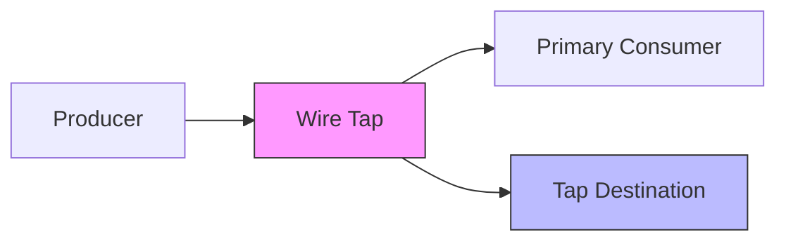
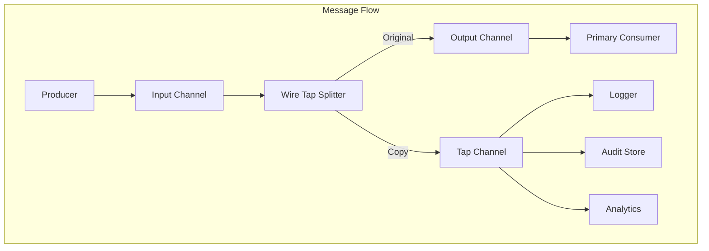
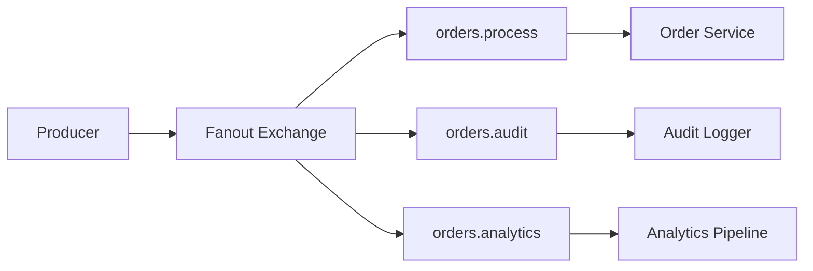
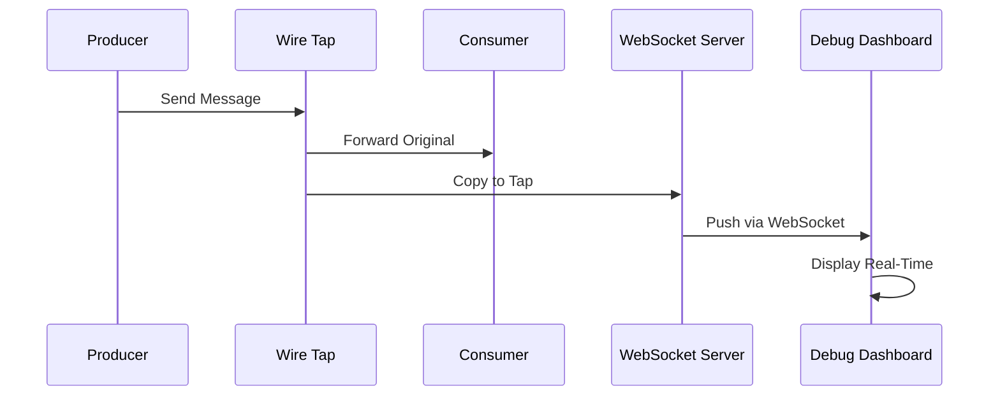
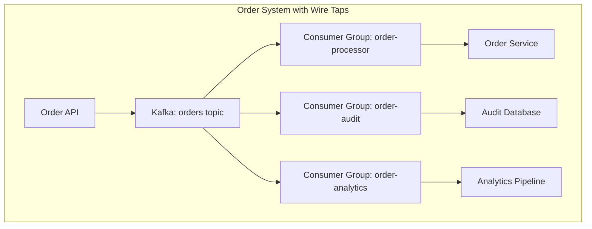

# How to Create Wire Tap Pattern

Author: [nawazdhandala](https://github.com/nawazdhandala)

Tags: Messaging, Patterns, Monitoring, EIP

Description: Learn how to implement the Wire Tap pattern for non-intrusive message inspection, audit logging, and debugging in distributed systems.

---

You need to see what messages flow through your system, but you cannot afford to slow down the main pipeline. You want audit logs, debugging visibility, or analytics feeds without coupling them to your core business logic.

Enter the Wire Tap pattern.

The Wire Tap is an Enterprise Integration Pattern (EIP) that lets you passively observe messages flowing through a channel. Think of it like a network packet sniffer for your message queues. The original message continues to its intended destination, while a copy goes somewhere else for inspection, logging, or analysis.

---

## Table of Contents

1. What is the Wire Tap Pattern?
2. When to Use Wire Taps
3. Architecture Overview
4. Implementation Examples
5. Wire Tap with Message Brokers
6. Audit Logging with Wire Taps
7. Debugging Production Systems
8. Performance Considerations
9. Common Mistakes
10. Wire Tap vs Other Patterns

---

## 1. What is the Wire Tap Pattern?

The Wire Tap pattern inserts an intermediary into a message channel that:

1. Receives each incoming message
2. Sends a copy to a secondary channel (the "tap")
3. Forwards the original message to its primary destination

The key property: the primary flow remains unaffected. The wire tap is passive and non-blocking.



The wire tap sits invisibly in the message path. Producers and primary consumers do not know it exists.

---

## 2. When to Use Wire Taps

Wire Taps solve specific problems:

| Use Case | Why Wire Tap Works |
|----------|-------------------|
| Audit logging | Capture every message for compliance without modifying business logic |
| Debugging | Inspect live traffic to diagnose issues without adding debug code |
| Analytics feeds | Feed real-time data to dashboards or ML pipelines |
| Message replay | Store messages for later reprocessing |
| Integration testing | Verify message formats in production without risk |
| Security monitoring | Detect anomalous patterns in message content |

Wire Taps shine when you need visibility without coupling. Adding logging directly to your services creates tight dependencies. Wire Taps keep concerns separated.

---

## 3. Architecture Overview

A wire tap has three core components:

1. **Input Channel**: Where messages arrive
2. **Splitter**: Copies the message (or a transformation of it)
3. **Tap Channel**: Where copies go for secondary processing



The splitter can operate in several modes:

- **Pass-through**: Copy entire message unchanged
- **Filtered**: Only tap messages matching criteria
- **Transformed**: Send a modified or redacted copy to the tap

---

## 4. Implementation Examples

### Basic Wire Tap in Node.js

Here is a simple wire tap implementation using an in-memory channel:

```typescript
interface Message {
  id: string;
  payload: unknown;
  timestamp: number;
}

type MessageHandler = (message: Message) => Promise<void>;

class WireTap {
  private primaryHandler: MessageHandler;
  private tapHandler: MessageHandler;
  private tapAsync: boolean;

  constructor(options: {
    primary: MessageHandler;
    tap: MessageHandler;
    tapAsync?: boolean; // If true, don't wait for tap to complete
  }) {
    this.primaryHandler = options.primary;
    this.tapHandler = options.tap;
    this.tapAsync = options.tapAsync ?? true;
  }

  async handle(message: Message): Promise<void> {
    // Send copy to tap (fire and forget if async)
    const tapPromise = this.tapHandler({ ...message });

    if (!this.tapAsync) {
      await tapPromise;
    } else {
      // Handle tap errors silently to not affect primary flow
      tapPromise.catch((err) => {
        console.error('Wire tap error (non-blocking):', err.message);
      });
    }

    // Always forward to primary destination
    await this.primaryHandler(message);
  }
}

// Usage
const wireTap = new WireTap({
  primary: async (msg) => {
    console.log('Processing:', msg.id);
    // Business logic here
  },
  tap: async (msg) => {
    // Log to audit system
    await auditLogger.log({
      messageId: msg.id,
      timestamp: msg.timestamp,
      payload: msg.payload,
    });
  },
  tapAsync: true,
});

// Messages flow through the tap transparently
await wireTap.handle({
  id: 'msg-001',
  payload: { orderId: 12345 },
  timestamp: Date.now(),
});
```

### Wire Tap with Filtering

Not every message needs tapping. Add a filter to be selective:

```typescript
class FilteredWireTap {
  private primaryHandler: MessageHandler;
  private tapHandler: MessageHandler;
  private filter: (message: Message) => boolean;

  constructor(options: {
    primary: MessageHandler;
    tap: MessageHandler;
    filter: (message: Message) => boolean;
  }) {
    this.primaryHandler = options.primary;
    this.tapHandler = options.tap;
    this.filter = options.filter;
  }

  async handle(message: Message): Promise<void> {
    // Only tap if filter matches
    if (this.filter(message)) {
      this.tapHandler({ ...message }).catch((err) => {
        console.error('Tap error:', err.message);
      });
    }

    await this.primaryHandler(message);
  }
}

// Only tap high-value orders
const filteredTap = new FilteredWireTap({
  primary: processOrder,
  tap: auditHighValueOrder,
  filter: (msg) => {
    const payload = msg.payload as { amount?: number };
    return (payload.amount ?? 0) > 10000;
  },
});
```

### Wire Tap with Transformation

Sometimes you need to redact sensitive data before tapping:

```typescript
class TransformingWireTap<T, U> {
  private primaryHandler: (message: Message) => Promise<void>;
  private tapHandler: (transformed: U) => Promise<void>;
  private transform: (message: Message) => U;

  constructor(options: {
    primary: (message: Message) => Promise<void>;
    tap: (transformed: U) => Promise<void>;
    transform: (message: Message) => U;
  }) {
    this.primaryHandler = options.primary;
    this.tapHandler = options.tap;
    this.transform = options.transform;
  }

  async handle(message: Message): Promise<void> {
    // Transform and tap
    const transformed = this.transform(message);
    this.tapHandler(transformed).catch(console.error);

    // Forward original unchanged
    await this.primaryHandler(message);
  }
}

// Redact PII before tapping
const redactingTap = new TransformingWireTap({
  primary: processUserMessage,
  tap: logToAnalytics,
  transform: (msg) => ({
    id: msg.id,
    timestamp: msg.timestamp,
    payload: {
      ...(msg.payload as object),
      email: '[REDACTED]',
      ssn: '[REDACTED]',
    },
  }),
});
```

---

## 5. Wire Tap with Message Brokers

Real systems use message brokers. Here is how to implement wire taps with popular options.

### RabbitMQ with Fanout Exchange

RabbitMQ's fanout exchange is a natural wire tap:

```typescript
import amqp from 'amqplib';

async function setupWireTap() {
  const connection = await amqp.connect('amqp://localhost');
  const channel = await connection.createChannel();

  // Create the wire tap exchange (fanout broadcasts to all bound queues)
  await channel.assertExchange('orders.wiretap', 'fanout', { durable: true });

  // Primary processing queue
  await channel.assertQueue('orders.process', { durable: true });
  await channel.bindQueue('orders.process', 'orders.wiretap', '');

  // Audit tap queue
  await channel.assertQueue('orders.audit', { durable: true });
  await channel.bindQueue('orders.audit', 'orders.wiretap', '');

  // Analytics tap queue
  await channel.assertQueue('orders.analytics', { durable: true });
  await channel.bindQueue('orders.analytics', 'orders.wiretap', '');

  return channel;
}

// Producer sends to the exchange, all queues receive copies
async function publishOrder(channel: amqp.Channel, order: object) {
  channel.publish(
    'orders.wiretap',
    '',
    Buffer.from(JSON.stringify(order)),
    { persistent: true }
  );
}
```



### Kafka with Multiple Consumer Groups

Kafka topics naturally support wire taps through consumer groups:

```typescript
import { Kafka } from 'kafkajs';

const kafka = new Kafka({ brokers: ['localhost:9092'] });

// Primary consumer group
const primaryConsumer = kafka.consumer({ groupId: 'order-processor' });
await primaryConsumer.subscribe({ topic: 'orders', fromBeginning: false });
await primaryConsumer.run({
  eachMessage: async ({ message }) => {
    // Process order
    await processOrder(JSON.parse(message.value?.toString() ?? '{}'));
  },
});

// Audit tap consumer group (separate group = separate copy of all messages)
const auditConsumer = kafka.consumer({ groupId: 'order-audit-tap' });
await auditConsumer.subscribe({ topic: 'orders', fromBeginning: false });
await auditConsumer.run({
  eachMessage: async ({ message }) => {
    // Audit logging
    await writeAuditLog(JSON.parse(message.value?.toString() ?? '{}'));
  },
});

// Analytics tap consumer group
const analyticsConsumer = kafka.consumer({ groupId: 'order-analytics-tap' });
await analyticsConsumer.subscribe({ topic: 'orders', fromBeginning: false });
await analyticsConsumer.run({
  eachMessage: async ({ message }) => {
    // Feed analytics
    await sendToAnalytics(JSON.parse(message.value?.toString() ?? '{}'));
  },
});
```

Each consumer group independently reads all messages from the topic. The primary processor and taps operate in isolation.

---

## 6. Audit Logging with Wire Taps

Audit logging is the most common wire tap use case. Here is a production-ready implementation:

```typescript
interface AuditRecord {
  messageId: string;
  timestamp: string;
  source: string;
  destination: string;
  messageType: string;
  payload: unknown;
  metadata: Record<string, string>;
}

class AuditWireTap {
  private auditStore: AuditStore;
  private serviceName: string;

  constructor(auditStore: AuditStore, serviceName: string) {
    this.auditStore = auditStore;
    this.serviceName = serviceName;
  }

  createTap<T>(
    destination: string,
    messageType: string
  ): (message: T & { id: string }) => Promise<void> {
    return async (message) => {
      const record: AuditRecord = {
        messageId: message.id,
        timestamp: new Date().toISOString(),
        source: this.serviceName,
        destination,
        messageType,
        payload: this.redactSensitiveFields(message),
        metadata: {
          environment: process.env.NODE_ENV ?? 'development',
          version: process.env.APP_VERSION ?? 'unknown',
        },
      };

      // Non-blocking write to audit store
      this.auditStore.write(record).catch((err) => {
        // Log but do not throw - audit failure should not break the system
        console.error('Audit write failed:', err.message);
      });
    };
  }

  private redactSensitiveFields(obj: unknown): unknown {
    if (typeof obj !== 'object' || obj === null) return obj;

    const sensitiveKeys = ['password', 'ssn', 'creditCard', 'token', 'secret'];
    const result: Record<string, unknown> = {};

    for (const [key, value] of Object.entries(obj)) {
      if (sensitiveKeys.some((k) => key.toLowerCase().includes(k))) {
        result[key] = '[REDACTED]';
      } else if (typeof value === 'object') {
        result[key] = this.redactSensitiveFields(value);
      } else {
        result[key] = value;
      }
    }

    return result;
  }
}

// Usage
const auditTap = new AuditWireTap(auditStore, 'payment-service');

const paymentWireTap = new WireTap({
  primary: processPayment,
  tap: auditTap.createTap('payment-processor', 'PaymentRequest'),
});
```

### Audit Log Schema

Store audit records in a queryable format:

```sql
CREATE TABLE audit_log (
  id BIGSERIAL PRIMARY KEY,
  message_id VARCHAR(255) NOT NULL,
  timestamp TIMESTAMPTZ NOT NULL,
  source VARCHAR(255) NOT NULL,
  destination VARCHAR(255) NOT NULL,
  message_type VARCHAR(255) NOT NULL,
  payload JSONB NOT NULL,
  metadata JSONB NOT NULL,
  created_at TIMESTAMPTZ DEFAULT NOW()
);

CREATE INDEX idx_audit_timestamp ON audit_log (timestamp);
CREATE INDEX idx_audit_message_id ON audit_log (message_id);
CREATE INDEX idx_audit_source ON audit_log (source);
CREATE INDEX idx_audit_type ON audit_log (message_type);
```

---

## 7. Debugging Production Systems

Wire taps are powerful debugging tools. Here is how to add temporary debugging taps:

```typescript
class DebugWireTap {
  private enabled: boolean = false;
  private filter: ((msg: Message) => boolean) | null = null;
  private sampleRate: number = 1.0;
  private outputHandler: (msg: Message) => void;

  constructor(outputHandler: (msg: Message) => void) {
    this.outputHandler = outputHandler;
  }

  enable(options?: {
    filter?: (msg: Message) => boolean;
    sampleRate?: number;
    durationMs?: number;
  }): void {
    this.enabled = true;
    this.filter = options?.filter ?? null;
    this.sampleRate = options?.sampleRate ?? 1.0;

    if (options?.durationMs) {
      setTimeout(() => this.disable(), options.durationMs);
    }

    console.log('Debug wire tap enabled');
  }

  disable(): void {
    this.enabled = false;
    this.filter = null;
    this.sampleRate = 1.0;
    console.log('Debug wire tap disabled');
  }

  tap(message: Message): void {
    if (!this.enabled) return;
    if (this.filter && !this.filter(message)) return;
    if (Math.random() > this.sampleRate) return;

    this.outputHandler({
      ...message,
      _debugTimestamp: Date.now(),
    } as Message);
  }
}

// Create a debug tap that outputs to console
const debugTap = new DebugWireTap((msg) => {
  console.log('[DEBUG TAP]', JSON.stringify(msg, null, 2));
});

// Enable temporarily for 5 minutes, sampling 10% of messages
debugTap.enable({
  durationMs: 5 * 60 * 1000,
  sampleRate: 0.1,
  filter: (msg) => (msg.payload as { status?: string }).status === 'error',
});
```

### Real-Time Debug Dashboard

Connect your debug tap to a WebSocket for live inspection:

```typescript
import { WebSocketServer } from 'ws';

class LiveDebugTap {
  private wss: WebSocketServer;
  private subscribers: Set<WebSocket> = new Set();

  constructor(port: number) {
    this.wss = new WebSocketServer({ port });

    this.wss.on('connection', (ws) => {
      this.subscribers.add(ws);
      ws.on('close', () => this.subscribers.delete(ws));
    });
  }

  tap(message: Message): void {
    const payload = JSON.stringify({
      type: 'message',
      data: message,
      timestamp: Date.now(),
    });

    for (const ws of this.subscribers) {
      if (ws.readyState === ws.OPEN) {
        ws.send(payload);
      }
    }
  }
}

// Start debug tap server on port 8080
const liveTap = new LiveDebugTap(8080);

// Integrate with your message flow
const wireTap = new WireTap({
  primary: processMessage,
  tap: async (msg) => liveTap.tap(msg),
});
```



---

## 8. Performance Considerations

Wire taps must not become bottlenecks. Follow these guidelines:

### Make Taps Asynchronous

Never block the primary flow waiting for the tap:

```typescript
// Good: Fire and forget
async handle(message: Message): Promise<void> {
  // Tap runs in background
  this.tapHandler(message).catch(this.handleTapError);

  // Primary continues immediately
  await this.primaryHandler(message);
}

// Bad: Waiting for tap
async handle(message: Message): Promise<void> {
  await this.tapHandler(message); // Blocks primary!
  await this.primaryHandler(message);
}
```

### Buffer and Batch

High-throughput systems should batch tap writes:

```typescript
class BatchingWireTap {
  private buffer: Message[] = [];
  private flushInterval: NodeJS.Timeout;
  private maxBatchSize: number;
  private tapHandler: (messages: Message[]) => Promise<void>;

  constructor(options: {
    tap: (messages: Message[]) => Promise<void>;
    maxBatchSize?: number;
    flushIntervalMs?: number;
  }) {
    this.tapHandler = options.tap;
    this.maxBatchSize = options.maxBatchSize ?? 100;

    this.flushInterval = setInterval(
      () => this.flush(),
      options.flushIntervalMs ?? 1000
    );
  }

  tap(message: Message): void {
    this.buffer.push({ ...message });

    if (this.buffer.length >= this.maxBatchSize) {
      this.flush();
    }
  }

  private flush(): void {
    if (this.buffer.length === 0) return;

    const batch = this.buffer;
    this.buffer = [];

    this.tapHandler(batch).catch((err) => {
      console.error('Batch tap failed:', err.message);
    });
  }

  shutdown(): void {
    clearInterval(this.flushInterval);
    this.flush();
  }
}
```

### Monitor Tap Lag

Track how far behind your tap consumers fall:

```typescript
class MonitoredWireTap {
  private lagGauge: Gauge; // Your metrics library
  private lastPrimaryTime: number = 0;
  private lastTapTime: number = 0;

  async handle(message: Message): Promise<void> {
    const now = Date.now();

    // Primary path
    await this.primaryHandler(message);
    this.lastPrimaryTime = Date.now();

    // Tap path (async)
    this.tapHandler(message)
      .then(() => {
        this.lastTapTime = Date.now();
        this.lagGauge.set(this.lastTapTime - this.lastPrimaryTime);
      })
      .catch(console.error);
  }
}
```

---

## 9. Common Mistakes

Avoid these wire tap pitfalls:

| Mistake | Problem | Fix |
|---------|---------|-----|
| Synchronous taps | Blocks primary processing | Always use async fire-and-forget |
| No error handling | Tap failures crash the system | Catch and log tap errors silently |
| Tapping everything | Storage and performance overhead | Filter and sample appropriately |
| Leaking PII | Compliance and security violations | Transform and redact before tapping |
| No tap monitoring | Silent failures go unnoticed | Add metrics for tap lag and errors |
| Tight coupling | Tap changes require primary changes | Keep tap logic completely separate |

### Anti-Pattern: Tap as Control Flow

Wire taps observe. They should never affect the primary flow:

```typescript
// Bad: Tap result affects primary
async handle(message: Message): Promise<void> {
  const tapResult = await this.tapHandler(message);
  if (tapResult.shouldReject) {
    throw new Error('Tap rejected message'); // Wrong!
  }
  await this.primaryHandler(message);
}

// Good: Tap is completely passive
async handle(message: Message): Promise<void> {
  this.tapHandler(message).catch(console.error);
  await this.primaryHandler(message);
}
```

---

## 10. Wire Tap vs Other Patterns

How does the Wire Tap compare to similar patterns?

| Pattern | Purpose | Difference from Wire Tap |
|---------|---------|-------------------------|
| Message Filter | Selectively route messages | Filter removes messages; wire tap copies them |
| Content Enricher | Add data to messages | Enricher modifies; wire tap observes |
| Publish-Subscribe | Multiple consumers | Pub-sub is the architecture; wire tap uses it |
| Message Store | Persist messages | Wire tap can feed a store; they are complementary |
| Interceptor | Transform in-flight | Interceptor modifies the primary flow |

Wire Taps are specifically about passive observation. If you need to modify messages, route them conditionally, or validate content, use a different pattern.

---

## Putting It All Together

Here is a complete wire tap setup for an order processing system:

```typescript
import { Kafka } from 'kafkajs';

// Initialize Kafka
const kafka = new Kafka({ brokers: ['localhost:9092'] });
const producer = kafka.producer();
const primaryConsumer = kafka.consumer({ groupId: 'order-processor' });
const auditConsumer = kafka.consumer({ groupId: 'order-audit' });
const analyticsConsumer = kafka.consumer({ groupId: 'order-analytics' });

async function main() {
  await producer.connect();

  // Primary order processing
  await primaryConsumer.connect();
  await primaryConsumer.subscribe({ topic: 'orders' });
  await primaryConsumer.run({
    eachMessage: async ({ message }) => {
      const order = JSON.parse(message.value?.toString() ?? '{}');
      await processOrder(order);
    },
  });

  // Audit wire tap
  await auditConsumer.connect();
  await auditConsumer.subscribe({ topic: 'orders' });
  await auditConsumer.run({
    eachMessage: async ({ message }) => {
      const order = JSON.parse(message.value?.toString() ?? '{}');
      await writeAuditLog({
        messageId: order.id,
        timestamp: new Date().toISOString(),
        payload: redactPII(order),
      });
    },
  });

  // Analytics wire tap
  await analyticsConsumer.connect();
  await analyticsConsumer.subscribe({ topic: 'orders' });
  await analyticsConsumer.run({
    eachMessage: async ({ message }) => {
      const order = JSON.parse(message.value?.toString() ?? '{}');
      await sendToAnalytics({
        orderId: order.id,
        amount: order.total,
        region: order.shippingRegion,
        timestamp: Date.now(),
      });
    },
  });

  console.log('Order system with wire taps running');
}

main().catch(console.error);
```



---

## Summary

The Wire Tap pattern gives you visibility into message flows without modifying your core business logic. Use it for:

- Audit logging for compliance
- Debugging production issues
- Feeding analytics pipelines
- Message replay and recovery

Key principles:

1. Taps are passive and non-blocking
2. Tap failures must not affect the primary flow
3. Filter and sample to manage volume
4. Redact sensitive data before tapping
5. Monitor tap lag and errors

Wire Taps work naturally with message brokers like Kafka (consumer groups) and RabbitMQ (fanout exchanges). For simpler setups, implement them in your application code with async handlers.

Start with audit logging. Once you see the value of observing your message flows, you will find more uses for wire taps across your system.

---

**Related Reading:**

- [What are Traces and Spans in OpenTelemetry](https://oneuptime.com/blog/post/2025-08-27-traces-and-spans-in-opentelemetry/view)
- [Three Pillars of Observability: Logs, Metrics, and Traces](https://oneuptime.com/blog/post/2025-08-20-three-pillars-of-observability-logs-metrics-traces/view)
- [How to Structure Logs Properly in OpenTelemetry](https://oneuptime.com/blog/post/2025-08-28-how-to-structure-logs-properly-in-opentelemetry/view)
