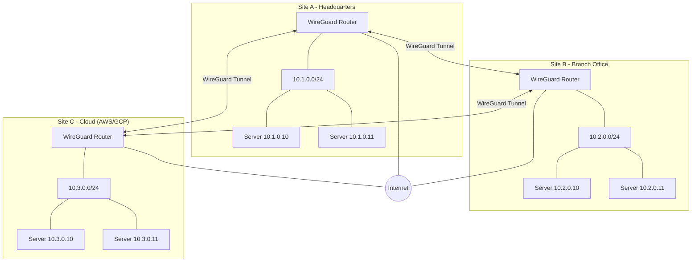
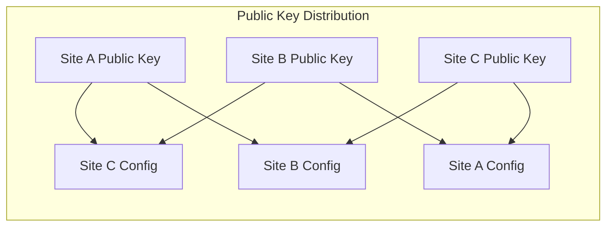
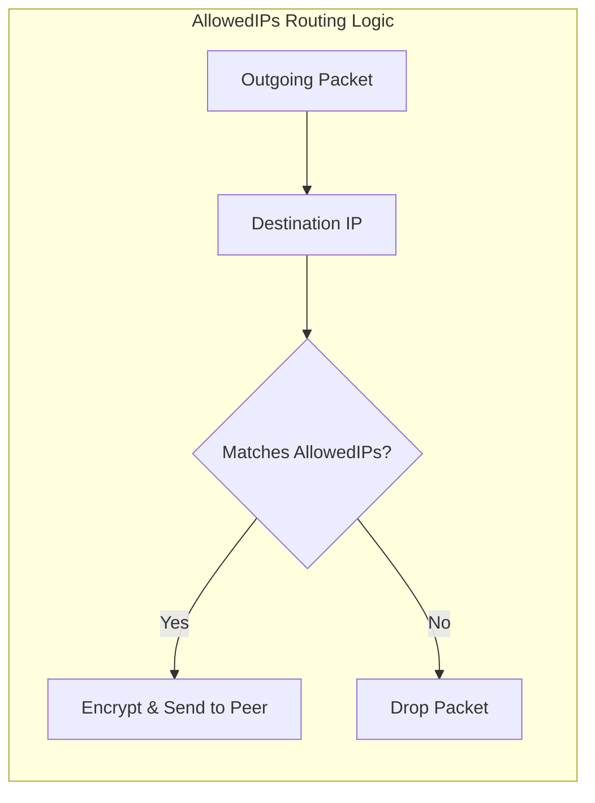

# How to Create WireGuard Site-to-Site VPN

Author: [nawazdhandala](https://github.com/nawazdhandala)

Tags: WireGuard, VPN, Networking, Security

Description: A complete guide to setting up WireGuard site-to-site VPN tunnels for secure connectivity between data centers, offices, and cloud environments.

---

WireGuard is a modern VPN protocol that outperforms IPsec and OpenVPN in both speed and simplicity. Its cryptographic design uses state-of-the-art primitives, and the entire codebase is around 4,000 lines of code. This makes it auditable, maintainable, and fast. Site-to-site VPNs connect entire networks rather than individual devices, making them ideal for linking offices, data centers, and cloud environments.

## Why WireGuard for Site-to-Site?

Traditional VPN solutions like IPsec require complex configuration and multiple protocols. WireGuard simplifies this with a single, unified approach.

| Feature | WireGuard | IPsec | OpenVPN |
|---------|-----------|-------|---------|
| Lines of Code | ~4,000 | ~400,000 | ~100,000 |
| Handshake | 1-RTT | Multiple | Multiple |
| Encryption | ChaCha20, Curve25519 | Configurable (complex) | Configurable |
| Kernel Integration | Yes | Yes | No (userspace) |
| Configuration | Simple INI-style | Complex | Verbose |

## Site-to-Site VPN Topology



## Prerequisites

Install WireGuard on all site routers.

```bash
# Debian/Ubuntu
sudo apt update && sudo apt install wireguard

# RHEL/CentOS/Rocky
sudo dnf install epel-release
sudo dnf install wireguard-tools

# Arch Linux
sudo pacman -S wireguard-tools
```

Enable IP forwarding on all routers.

```bash
# Enable immediately
sudo sysctl -w net.ipv4.ip_forward=1

# Make persistent across reboots
echo "net.ipv4.ip_forward = 1" | sudo tee /etc/sysctl.d/99-wireguard.conf
sudo sysctl --system
```

## Key Generation and Exchange

WireGuard uses Curve25519 for key exchange. Each site needs a public/private key pair.

### Generate Keys for Each Site

```bash
# Run on each site router
# Generate private key and derive public key
wg genkey | tee /etc/wireguard/privatekey | wg pubkey > /etc/wireguard/publickey

# Set secure permissions on private key
chmod 600 /etc/wireguard/privatekey

# Display keys (you'll need these for configuration)
echo "Private Key: $(cat /etc/wireguard/privatekey)"
echo "Public Key: $(cat /etc/wireguard/publickey)"
```

### Key Exchange Matrix

You need to exchange public keys between all sites. Never share private keys.



Example key output (these are examples, generate your own):

```
Site A Public Key: aB3CdEfGhIjKlMnOpQrStUvWxYz1234567890abcdef=
Site B Public Key: bC4DeFgHiJkLmNoPqRsTuVwXyZ2345678901bcdefg=
Site C Public Key: cD5EfGhIjKlMnOpQrStUvWxYz3456789012cdefgh=
```

## WireGuard Configuration

### Site A Configuration (Headquarters)

```ini
# /etc/wireguard/wg0.conf on Site A
# Site A - Headquarters Router
# Public IP: 203.0.113.1
# Local subnet: 10.1.0.0/24
# WireGuard interface IP: 10.100.0.1/24

[Interface]
# Private key for this site (never share this)
PrivateKey = SITE_A_PRIVATE_KEY_HERE

# WireGuard tunnel interface address
Address = 10.100.0.1/24

# UDP port for WireGuard traffic
ListenPort = 51820

# PostUp/PostDown scripts for routing and firewall rules
# These run when the interface comes up/down
PostUp = iptables -A FORWARD -i wg0 -j ACCEPT
PostUp = iptables -A FORWARD -o wg0 -j ACCEPT
PostUp = iptables -t nat -A POSTROUTING -o eth0 -j MASQUERADE
PostDown = iptables -D FORWARD -i wg0 -j ACCEPT
PostDown = iptables -D FORWARD -o wg0 -j ACCEPT
PostDown = iptables -t nat -D POSTROUTING -o eth0 -j MASQUERADE

# Site B Peer Configuration
[Peer]
# Site B's public key
PublicKey = bC4DeFgHiJkLmNoPqRsTuVwXyZ2345678901bcdefg=

# Site B's public IP and WireGuard port
Endpoint = 203.0.113.2:51820

# Routes: Site B's WireGuard IP and its local subnet
# Traffic to these networks goes through this peer
AllowedIPs = 10.100.0.2/32, 10.2.0.0/24

# Send keepalive every 25 seconds (important for NAT traversal)
PersistentKeepalive = 25

# Site C Peer Configuration
[Peer]
# Site C's public key
PublicKey = cD5EfGhIjKlMnOpQrStUvWxYz3456789012cdefgh=

# Site C's public IP and WireGuard port
Endpoint = 203.0.113.3:51820

# Routes: Site C's WireGuard IP and its local subnet
AllowedIPs = 10.100.0.3/32, 10.3.0.0/24

PersistentKeepalive = 25
```

### Site B Configuration (Branch Office)

```ini
# /etc/wireguard/wg0.conf on Site B
# Site B - Branch Office Router
# Public IP: 203.0.113.2
# Local subnet: 10.2.0.0/24
# WireGuard interface IP: 10.100.0.2/24

[Interface]
PrivateKey = SITE_B_PRIVATE_KEY_HERE
Address = 10.100.0.2/24
ListenPort = 51820

PostUp = iptables -A FORWARD -i wg0 -j ACCEPT
PostUp = iptables -A FORWARD -o wg0 -j ACCEPT
PostUp = iptables -t nat -A POSTROUTING -o eth0 -j MASQUERADE
PostDown = iptables -D FORWARD -i wg0 -j ACCEPT
PostDown = iptables -D FORWARD -o wg0 -j ACCEPT
PostDown = iptables -t nat -D POSTROUTING -o eth0 -j MASQUERADE

# Site A Peer Configuration
[Peer]
PublicKey = aB3CdEfGhIjKlMnOpQrStUvWxYz1234567890abcdef=
Endpoint = 203.0.113.1:51820
AllowedIPs = 10.100.0.1/32, 10.1.0.0/24
PersistentKeepalive = 25

# Site C Peer Configuration
[Peer]
PublicKey = cD5EfGhIjKlMnOpQrStUvWxYz3456789012cdefgh=
Endpoint = 203.0.113.3:51820
AllowedIPs = 10.100.0.3/32, 10.3.0.0/24
PersistentKeepalive = 25
```

### Site C Configuration (Cloud)

```ini
# /etc/wireguard/wg0.conf on Site C
# Site C - Cloud Router (AWS/GCP)
# Public IP: 203.0.113.3
# Local subnet: 10.3.0.0/24
# WireGuard interface IP: 10.100.0.3/24

[Interface]
PrivateKey = SITE_C_PRIVATE_KEY_HERE
Address = 10.100.0.3/24
ListenPort = 51820

PostUp = iptables -A FORWARD -i wg0 -j ACCEPT
PostUp = iptables -A FORWARD -o wg0 -j ACCEPT
PostUp = iptables -t nat -A POSTROUTING -o eth0 -j MASQUERADE
PostDown = iptables -D FORWARD -i wg0 -j ACCEPT
PostDown = iptables -D FORWARD -o wg0 -j ACCEPT
PostDown = iptables -t nat -D POSTROUTING -o eth0 -j MASQUERADE

# Site A Peer Configuration
[Peer]
PublicKey = aB3CdEfGhIjKlMnOpQrStUvWxYz1234567890abcdef=
Endpoint = 203.0.113.1:51820
AllowedIPs = 10.100.0.1/32, 10.1.0.0/24
PersistentKeepalive = 25

# Site B Peer Configuration
[Peer]
PublicKey = bC4DeFgHiJkLmNoPqRsTuVwXyZ2345678901bcdefg=
Endpoint = 203.0.113.2:51820
AllowedIPs = 10.100.0.2/32, 10.2.0.0/24
PersistentKeepalive = 25
```

## Routing Configuration

### Understanding AllowedIPs as Routing Table

WireGuard's `AllowedIPs` serves dual purposes:
1. Acts as an ACL for incoming packets
2. Acts as a routing table for outgoing packets



### Static Routes for Complex Networks

If you have multiple subnets behind a site, add them to AllowedIPs and configure static routes.

```bash
# On Site A, if Site B has additional subnets 10.20.0.0/24 and 10.21.0.0/24
# Add to Site B peer's AllowedIPs:
# AllowedIPs = 10.100.0.2/32, 10.2.0.0/24, 10.20.0.0/24, 10.21.0.0/24

# If needed, add explicit static routes
sudo ip route add 10.20.0.0/24 dev wg0
sudo ip route add 10.21.0.0/24 dev wg0
```

### Make Routes Persistent

Create a script to ensure routes persist across reboots.

```bash
# /etc/wireguard/routes.sh
#!/bin/bash
# Add static routes for Site B additional subnets
ip route add 10.20.0.0/24 dev wg0 2>/dev/null || true
ip route add 10.21.0.0/24 dev wg0 2>/dev/null || true
```

Add to WireGuard config:

```ini
PostUp = /etc/wireguard/routes.sh
```

## NAT and Firewall Configuration

### iptables Rules

```bash
# Allow WireGuard traffic on the public interface
sudo iptables -A INPUT -p udp --dport 51820 -j ACCEPT

# Allow forwarding between WireGuard and LAN
sudo iptables -A FORWARD -i wg0 -o eth0 -j ACCEPT
sudo iptables -A FORWARD -i eth0 -o wg0 -j ACCEPT

# Enable NAT (masquerading) for traffic leaving to internet
sudo iptables -t nat -A POSTROUTING -o eth0 -j MASQUERADE

# Save rules to persist across reboots
sudo iptables-save > /etc/iptables/rules.v4
```

### nftables Rules (Modern Alternative)

```bash
# /etc/nftables.conf
#!/usr/sbin/nft -f

flush ruleset

table inet filter {
    chain input {
        type filter hook input priority 0; policy drop;

        # Allow established connections
        ct state established,related accept

        # Allow loopback
        iif lo accept

        # Allow WireGuard UDP port
        udp dport 51820 accept

        # Allow SSH (adjust as needed)
        tcp dport 22 accept
    }

    chain forward {
        type filter hook forward priority 0; policy drop;

        # Allow forwarding for WireGuard
        iifname "wg0" accept
        oifname "wg0" accept

        # Allow established connections
        ct state established,related accept
    }

    chain output {
        type filter hook output priority 0; policy accept;
    }
}

table inet nat {
    chain postrouting {
        type nat hook postrouting priority 100;

        # Masquerade traffic going out the public interface
        oifname "eth0" masquerade
    }
}
```

Apply nftables rules:

```bash
sudo nft -f /etc/nftables.conf
sudo systemctl enable nftables
```

### Cloud Provider Security Groups

For AWS:

```bash
# Allow WireGuard UDP port in security group
aws ec2 authorize-security-group-ingress \
    --group-id sg-xxxxxxxxx \
    --protocol udp \
    --port 51820 \
    --cidr 0.0.0.0/0
```

For GCP:

```bash
# Create firewall rule for WireGuard
gcloud compute firewall-rules create allow-wireguard \
    --allow udp:51820 \
    --direction INGRESS \
    --priority 1000 \
    --network default \
    --source-ranges 0.0.0.0/0
```

## Starting and Managing WireGuard

### Start the Interface

```bash
# Start WireGuard interface
sudo wg-quick up wg0

# Enable at boot
sudo systemctl enable wg-quick@wg0

# Check status
sudo wg show
```

### Expected Output from wg show

```
interface: wg0
  public key: aB3CdEfGhIjKlMnOpQrStUvWxYz1234567890abcdef=
  private key: (hidden)
  listening port: 51820

peer: bC4DeFgHiJkLmNoPqRsTuVwXyZ2345678901bcdefg=
  endpoint: 203.0.113.2:51820
  allowed ips: 10.100.0.2/32, 10.2.0.0/24
  latest handshake: 12 seconds ago
  transfer: 1.54 GiB received, 892.31 MiB sent
  persistent keepalive: every 25 seconds

peer: cD5EfGhIjKlMnOpQrStUvWxYz3456789012cdefgh=
  endpoint: 203.0.113.3:51820
  allowed ips: 10.100.0.3/32, 10.3.0.0/24
  latest handshake: 8 seconds ago
  transfer: 2.11 GiB received, 1.23 GiB sent
  persistent keepalive: every 25 seconds
```

### Management Commands

```bash
# Stop the interface
sudo wg-quick down wg0

# Restart to apply config changes
sudo systemctl restart wg-quick@wg0

# View real-time statistics
watch sudo wg show

# Add a peer without restarting (runtime only)
sudo wg set wg0 peer NEW_PEER_PUBLIC_KEY \
    endpoint NEW_PEER_IP:51820 \
    allowed-ips 10.100.0.4/32,10.4.0.0/24 \
    persistent-keepalive 25

# Remove a peer at runtime
sudo wg set wg0 peer PEER_PUBLIC_KEY remove
```

## Testing the Connection

### Verify Tunnel is Up

```bash
# Check interface is active
ip link show wg0

# Check IP address is assigned
ip addr show wg0

# Check routing table
ip route | grep wg0
```

### Test Connectivity Between Sites

```bash
# From Site A, ping Site B's WireGuard interface
ping -c 4 10.100.0.2

# From Site A, ping a server on Site B's local network
ping -c 4 10.2.0.10

# Test TCP connectivity
nc -zv 10.2.0.10 22

# Trace the route
traceroute 10.2.0.10
```

### Verify Traffic is Encrypted

```bash
# On the WireGuard router, capture traffic
# You should see encrypted UDP packets, not plaintext
sudo tcpdump -i eth0 udp port 51820 -n

# Compare with traffic on the wg0 interface
# This shows decrypted traffic
sudo tcpdump -i wg0 -n
```

## Troubleshooting

### Common Issues and Solutions

**No handshake occurring**

```bash
# Check if UDP port is reachable
nc -zuv PEER_IP 51820

# Verify keys match
# On Site A, check Site B's public key matches what Site B generated
wg show wg0

# Check firewall isn't blocking
sudo iptables -L -n | grep 51820
```

**Handshake succeeds but no traffic flows**

```bash
# Verify AllowedIPs are correct
# Missing routes in AllowedIPs will drop packets

# Check IP forwarding is enabled
sysctl net.ipv4.ip_forward

# Verify NAT/masquerade rules
sudo iptables -t nat -L -n

# Check for routing issues
ip route get 10.2.0.10
```

**Intermittent connectivity**

```bash
# Ensure PersistentKeepalive is set (especially behind NAT)
# Add to peer configuration:
# PersistentKeepalive = 25

# Check for MTU issues (default WireGuard MTU is 1420)
ping -M do -s 1392 10.2.0.10
```

### Debug Logging

```bash
# Enable WireGuard debug logging
echo module wireguard +p > /sys/kernel/debug/dynamic_debug/control

# View debug messages
dmesg -w | grep wireguard

# Disable debug logging
echo module wireguard -p > /sys/kernel/debug/dynamic_debug/control
```

## Security Best Practices

### Protect Private Keys

```bash
# Set strict permissions
chmod 600 /etc/wireguard/privatekey
chmod 600 /etc/wireguard/wg0.conf
chown root:root /etc/wireguard/*
```

### Limit Allowed IPs

Only include networks that should be reachable. Avoid using `0.0.0.0/0` unless you're routing all traffic through the VPN.

### Rotate Keys Periodically

```bash
# Generate new keys
wg genkey | tee /etc/wireguard/privatekey.new | wg pubkey > /etc/wireguard/publickey.new

# Update configuration at all sites during maintenance window
# Then activate new config
sudo systemctl restart wg-quick@wg0
```

### Monitor for Anomalies

```bash
# Script to check VPN health
#!/bin/bash

PEERS=("10.100.0.2" "10.100.0.3")

for peer in "${PEERS[@]}"; do
    if ping -c 1 -W 5 "$peer" > /dev/null 2>&1; then
        echo "OK: $peer is reachable"
    else
        echo "FAIL: $peer is unreachable"
        # Send alert (integrate with your monitoring system)
    fi
done
```

## Automation with Ansible

### Ansible Playbook for WireGuard Deployment

```yaml
# wireguard-site-to-site.yml
---
- name: Deploy WireGuard Site-to-Site VPN
  hosts: wireguard_routers
  become: yes
  vars:
    wireguard_port: 51820
    wireguard_interface: wg0

  tasks:
    - name: Install WireGuard
      package:
        name: wireguard-tools
        state: present

    - name: Enable IP forwarding
      sysctl:
        name: net.ipv4.ip_forward
        value: '1'
        sysctl_set: yes
        state: present
        reload: yes

    - name: Generate private key
      shell: wg genkey
      register: wg_private_key
      args:
        creates: /etc/wireguard/privatekey

    - name: Save private key
      copy:
        content: "{{ wg_private_key.stdout }}"
        dest: /etc/wireguard/privatekey
        mode: '0600'
      when: wg_private_key.changed

    - name: Generate public key
      shell: cat /etc/wireguard/privatekey | wg pubkey
      register: wg_public_key

    - name: Save public key
      copy:
        content: "{{ wg_public_key.stdout }}"
        dest: /etc/wireguard/publickey
        mode: '0644'

    - name: Deploy WireGuard configuration
      template:
        src: wg0.conf.j2
        dest: "/etc/wireguard/{{ wireguard_interface }}.conf"
        mode: '0600'
      notify: Restart WireGuard

    - name: Enable and start WireGuard
      systemd:
        name: "wg-quick@{{ wireguard_interface }}"
        enabled: yes
        state: started

  handlers:
    - name: Restart WireGuard
      systemd:
        name: "wg-quick@{{ wireguard_interface }}"
        state: restarted
```

### Jinja2 Template for Configuration

```jinja2
# templates/wg0.conf.j2
[Interface]
PrivateKey = {{ lookup('file', '/etc/wireguard/privatekey') }}
Address = {{ wireguard_address }}
ListenPort = {{ wireguard_port }}

PostUp = iptables -A FORWARD -i %i -j ACCEPT
PostUp = iptables -A FORWARD -o %i -j ACCEPT
PostUp = iptables -t nat -A POSTROUTING -o {{ public_interface }} -j MASQUERADE
PostDown = iptables -D FORWARD -i %i -j ACCEPT
PostDown = iptables -D FORWARD -o %i -j ACCEPT
PostDown = iptables -t nat -D POSTROUTING -o {{ public_interface }} -j MASQUERADE


[Peer]
PublicKey = {{ peer.public_key }}
Endpoint = {{ peer.endpoint }}
AllowedIPs = {{ peer.allowed_ips | join(', ') }}
PersistentKeepalive = 25

```

---

WireGuard makes site-to-site VPNs simple without sacrificing security. The configuration is readable, the performance is excellent, and the cryptographic choices are solid. Start with a two-site setup, verify everything works, then expand to a full mesh as needed. Monitor your tunnels and rotate keys periodically to maintain a strong security posture.
