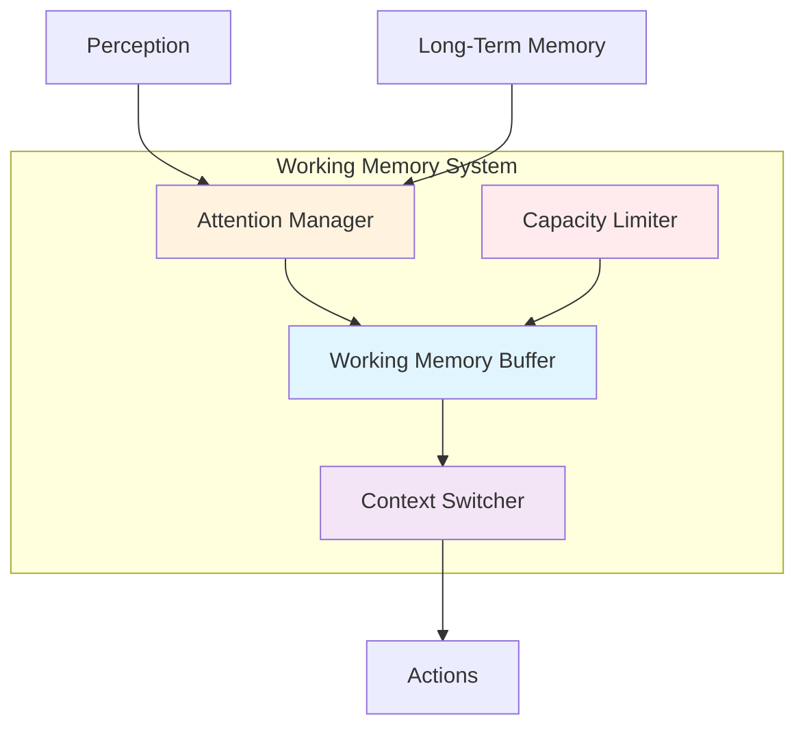
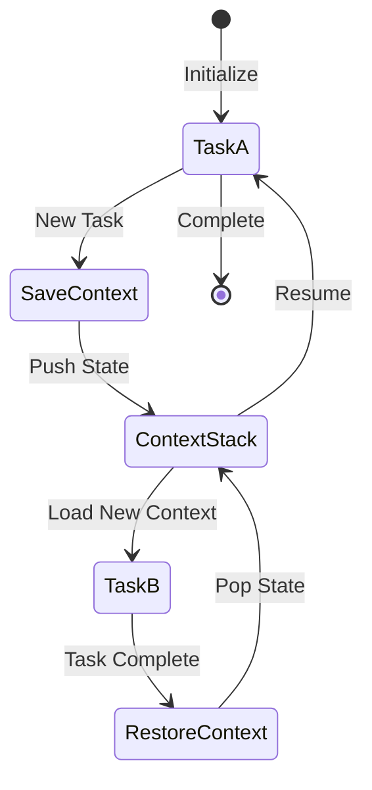
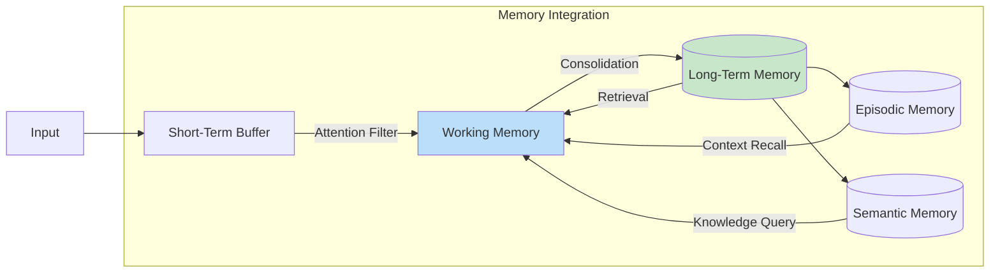
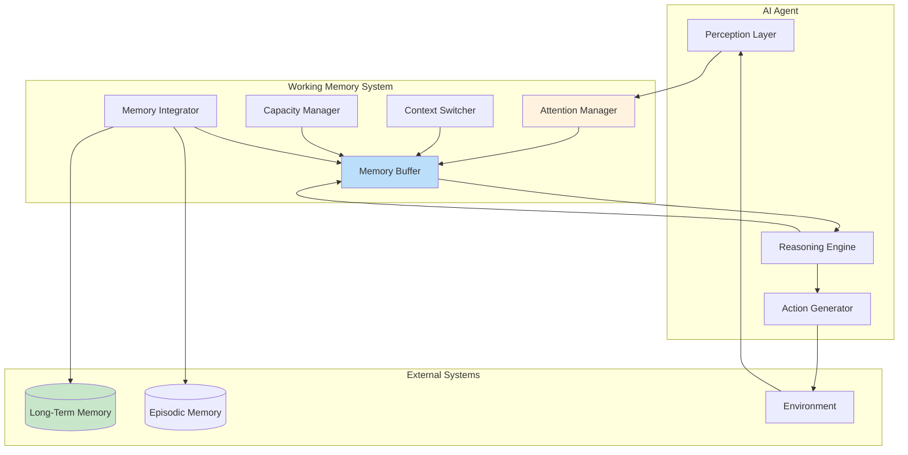

# How to Implement Working Memory

Author: [nawazdhandala](https://github.com/nawazdhandala)

Tags: AI Agents, Working Memory, Context Management, Cognitive Architecture

Description: Learn to implement working memory for AI agents with active context management, attention mechanisms, and task-relevant information retention.

---

Working memory is the cognitive workspace where AI agents hold and manipulate information relevant to their current task. Unlike long-term memory that stores persistent knowledge, working memory maintains a dynamic, limited-capacity buffer of immediately useful information. This guide walks through implementing a robust working memory system for AI agents.

## Understanding Working Memory in AI Agents

Working memory serves as the bridge between perception, long-term memory, and action. It holds the information an agent needs right now - the current goal, relevant context, intermediate results, and active constraints.



## Core Components

### 1. Memory Buffer Implementation

The memory buffer is the central data structure that holds active information. Each item in the buffer has content, metadata, and a relevance score.

```python
from dataclasses import dataclass, field
from typing import Any, Dict, List, Optional
from datetime import datetime
import heapq


@dataclass
class MemoryItem:
    """A single item in working memory."""
    content: Any
    item_type: str  # 'goal', 'context', 'intermediate', 'constraint'
    relevance_score: float = 1.0
    created_at: datetime = field(default_factory=datetime.now)
    last_accessed: datetime = field(default_factory=datetime.now)
    access_count: int = 0
    metadata: Dict[str, Any] = field(default_factory=dict)

    def access(self) -> None:
        """Update access statistics when item is retrieved."""
        self.last_accessed = datetime.now()
        self.access_count += 1

    def decay(self, decay_rate: float = 0.95) -> None:
        """Apply temporal decay to relevance score."""
        time_delta = (datetime.now() - self.last_accessed).total_seconds()
        self.relevance_score *= (decay_rate ** (time_delta / 60))  # Decay per minute


class WorkingMemoryBuffer:
    """
    Fixed-capacity buffer for active memory items.
    Uses a priority queue to maintain items by relevance.
    """

    def __init__(self, capacity: int = 7):
        self.capacity = capacity
        self._items: Dict[str, MemoryItem] = {}
        self._priority_queue: List[tuple] = []  # (negative_relevance, id)

    def add(self, item_id: str, item: MemoryItem) -> Optional[MemoryItem]:
        """
        Add item to buffer. Returns evicted item if at capacity.
        """
        evicted = None

        if len(self._items) >= self.capacity and item_id not in self._items:
            evicted = self._evict_lowest_relevance()

        self._items[item_id] = item
        heapq.heappush(self._priority_queue, (-item.relevance_score, item_id))

        return evicted

    def get(self, item_id: str) -> Optional[MemoryItem]:
        """Retrieve item and update access statistics."""
        if item_id in self._items:
            item = self._items[item_id]
            item.access()
            return item
        return None

    def _evict_lowest_relevance(self) -> Optional[MemoryItem]:
        """Remove and return the least relevant item."""
        # Clean up stale entries and find lowest relevance
        while self._priority_queue:
            _, item_id = heapq.heappop(self._priority_queue)
            if item_id in self._items:
                return self._items.pop(item_id)
        return None

    def apply_decay(self) -> None:
        """Apply decay to all items and rebuild priority queue."""
        for item in self._items.values():
            item.decay()

        self._priority_queue = [
            (-item.relevance_score, item_id)
            for item_id, item in self._items.items()
        ]
        heapq.heapify(self._priority_queue)

    def get_active_items(self) -> List[MemoryItem]:
        """Return all items sorted by relevance."""
        return sorted(
            self._items.values(),
            key=lambda x: x.relevance_score,
            reverse=True
        )
```

The buffer maintains a fixed capacity (defaulting to 7, inspired by Miller's research on human working memory). When capacity is exceeded, the least relevant item is evicted.

### 2. Attention Allocation Mechanism

Attention determines which information enters working memory and how relevance scores are updated. The attention mechanism filters incoming information and boosts relevant items.

```python
from abc import ABC, abstractmethod
import numpy as np


class AttentionMechanism(ABC):
    """Base class for attention allocation strategies."""

    @abstractmethod
    def compute_relevance(
        self,
        candidate: Any,
        current_goal: str,
        context: List[MemoryItem]
    ) -> float:
        """Compute relevance score for a candidate item."""
        pass


class GoalBasedAttention(AttentionMechanism):
    """
    Attention mechanism that prioritizes goal-relevant information.
    Uses semantic similarity to measure relevance.
    """

    def __init__(self, embedding_model):
        self.embedding_model = embedding_model
        self._goal_embedding = None
        self._current_goal = None

    def set_goal(self, goal: str) -> None:
        """Update the current goal and cache its embedding."""
        self._current_goal = goal
        self._goal_embedding = self.embedding_model.encode(goal)

    def compute_relevance(
        self,
        candidate: Any,
        current_goal: str,
        context: List[MemoryItem]
    ) -> float:
        """
        Compute relevance using:
        1. Semantic similarity to goal
        2. Contextual coherence with existing items
        3. Recency bonus
        """
        if current_goal != self._current_goal:
            self.set_goal(current_goal)

        # Semantic similarity to goal
        candidate_embedding = self.embedding_model.encode(str(candidate))
        goal_similarity = self._cosine_similarity(
            candidate_embedding,
            self._goal_embedding
        )

        # Contextual coherence - average similarity to context items
        context_similarity = 0.0
        if context:
            context_embeddings = [
                self.embedding_model.encode(str(item.content))
                for item in context
            ]
            similarities = [
                self._cosine_similarity(candidate_embedding, emb)
                for emb in context_embeddings
            ]
            context_similarity = np.mean(similarities)

        # Weighted combination
        relevance = (0.6 * goal_similarity) + (0.4 * context_similarity)

        return float(np.clip(relevance, 0.0, 1.0))

    def _cosine_similarity(self, a: np.ndarray, b: np.ndarray) -> float:
        """Compute cosine similarity between two vectors."""
        return np.dot(a, b) / (np.linalg.norm(a) * np.linalg.norm(b) + 1e-8)


class AttentionManager:
    """
    Manages attention allocation across working memory.
    Filters incoming information and updates relevance scores.
    """

    def __init__(
        self,
        attention_mechanism: AttentionMechanism,
        relevance_threshold: float = 0.3
    ):
        self.attention = attention_mechanism
        self.threshold = relevance_threshold
        self.current_goal: Optional[str] = None

    def filter_and_score(
        self,
        candidates: List[Any],
        buffer: WorkingMemoryBuffer
    ) -> List[tuple]:
        """
        Filter candidates by relevance threshold.
        Returns list of (candidate, relevance_score) tuples.
        """
        context = buffer.get_active_items()
        results = []

        for candidate in candidates:
            relevance = self.attention.compute_relevance(
                candidate,
                self.current_goal,
                context
            )

            if relevance >= self.threshold:
                results.append((candidate, relevance))

        # Sort by relevance descending
        return sorted(results, key=lambda x: x[1], reverse=True)

    def update_goal(self, new_goal: str, buffer: WorkingMemoryBuffer) -> None:
        """
        Update current goal and recalculate all relevance scores.
        This may cause items to be evicted if they become irrelevant.
        """
        self.current_goal = new_goal

        # Recalculate relevance for all items
        context = buffer.get_active_items()
        for item in context:
            new_relevance = self.attention.compute_relevance(
                item.content,
                new_goal,
                [i for i in context if i != item]
            )
            item.relevance_score = new_relevance

        # Trigger decay and cleanup
        buffer.apply_decay()
```

The attention mechanism computes relevance scores based on semantic similarity to the current goal and coherence with existing context. Items below the relevance threshold are filtered out.

### 3. Context Switching

Context switching allows the agent to save and restore working memory states when switching between tasks or sub-goals.



```python
from typing import Tuple
from copy import deepcopy
import json


@dataclass
class ContextSnapshot:
    """Immutable snapshot of working memory state."""
    items: Dict[str, MemoryItem]
    goal: str
    timestamp: datetime
    metadata: Dict[str, Any]

    def to_dict(self) -> Dict:
        """Serialize snapshot for storage."""
        return {
            'items': {
                k: {
                    'content': str(v.content),
                    'item_type': v.item_type,
                    'relevance_score': v.relevance_score,
                    'metadata': v.metadata
                }
                for k, v in self.items.items()
            },
            'goal': self.goal,
            'timestamp': self.timestamp.isoformat(),
            'metadata': self.metadata
        }


class ContextSwitcher:
    """
    Manages context switching between tasks.
    Maintains a stack of saved contexts for nested task handling.
    """

    def __init__(self, max_stack_depth: int = 10):
        self.context_stack: List[ContextSnapshot] = []
        self.max_depth = max_stack_depth

    def save_context(
        self,
        buffer: WorkingMemoryBuffer,
        goal: str,
        metadata: Optional[Dict] = None
    ) -> ContextSnapshot:
        """
        Save current working memory state to stack.
        """
        snapshot = ContextSnapshot(
            items=deepcopy(buffer._items),
            goal=goal,
            timestamp=datetime.now(),
            metadata=metadata or {}
        )

        if len(self.context_stack) >= self.max_depth:
            # Remove oldest context if stack is full
            self.context_stack.pop(0)

        self.context_stack.append(snapshot)
        return snapshot

    def restore_context(
        self,
        buffer: WorkingMemoryBuffer
    ) -> Tuple[str, Dict]:
        """
        Restore most recent saved context.
        Returns the restored goal and metadata.
        """
        if not self.context_stack:
            raise ValueError("No saved context to restore")

        snapshot = self.context_stack.pop()

        # Clear current buffer and restore saved state
        buffer._items.clear()
        buffer._priority_queue.clear()

        for item_id, item in snapshot.items.items():
            buffer.add(item_id, deepcopy(item))

        return snapshot.goal, snapshot.metadata

    def peek_context(self) -> Optional[ContextSnapshot]:
        """View the most recent saved context without restoring."""
        return self.context_stack[-1] if self.context_stack else None

    def clear_stack(self) -> None:
        """Clear all saved contexts."""
        self.context_stack.clear()

    def get_stack_depth(self) -> int:
        """Return current stack depth."""
        return len(self.context_stack)
```

Context switching is essential for handling interruptions and nested sub-tasks. The agent can save its current mental state, handle a new task, and seamlessly return to the previous context.

### 4. Capacity Management

Working memory has limited capacity. Effective capacity management ensures the most relevant information stays available while gracefully handling overflow.

```python
from enum import Enum


class EvictionPolicy(Enum):
    """Strategies for evicting items when capacity is exceeded."""
    LEAST_RELEVANT = "least_relevant"
    LEAST_RECENTLY_USED = "lru"
    OLDEST = "oldest"
    WEIGHTED = "weighted"


class CapacityManager:
    """
    Manages working memory capacity constraints.
    Implements various eviction policies and capacity adjustment.
    """

    def __init__(
        self,
        base_capacity: int = 7,
        policy: EvictionPolicy = EvictionPolicy.WEIGHTED,
        min_capacity: int = 3,
        max_capacity: int = 15
    ):
        self.base_capacity = base_capacity
        self.current_capacity = base_capacity
        self.policy = policy
        self.min_capacity = min_capacity
        self.max_capacity = max_capacity

        # Weights for WEIGHTED policy
        self.relevance_weight = 0.5
        self.recency_weight = 0.3
        self.access_weight = 0.2

    def select_for_eviction(
        self,
        items: Dict[str, MemoryItem],
        count: int = 1
    ) -> List[str]:
        """
        Select items for eviction based on current policy.
        Returns list of item IDs to evict.
        """
        if not items:
            return []

        if self.policy == EvictionPolicy.LEAST_RELEVANT:
            scored = sorted(
                items.items(),
                key=lambda x: x[1].relevance_score
            )

        elif self.policy == EvictionPolicy.LEAST_RECENTLY_USED:
            scored = sorted(
                items.items(),
                key=lambda x: x[1].last_accessed
            )

        elif self.policy == EvictionPolicy.OLDEST:
            scored = sorted(
                items.items(),
                key=lambda x: x[1].created_at
            )

        elif self.policy == EvictionPolicy.WEIGHTED:
            scored = sorted(
                items.items(),
                key=lambda x: self._compute_retention_score(x[1])
            )

        return [item_id for item_id, _ in scored[:count]]

    def _compute_retention_score(self, item: MemoryItem) -> float:
        """
        Compute weighted retention score.
        Higher score means more likely to be retained.
        """
        # Normalize recency to 0-1 range (items accessed in last hour)
        recency = (datetime.now() - item.last_accessed).total_seconds()
        recency_score = max(0, 1 - (recency / 3600))

        # Normalize access count (cap at 10 accesses)
        access_score = min(item.access_count / 10, 1.0)

        return (
            self.relevance_weight * item.relevance_score +
            self.recency_weight * recency_score +
            self.access_weight * access_score
        )

    def adjust_capacity(self, cognitive_load: float) -> int:
        """
        Dynamically adjust capacity based on cognitive load.
        Higher load reduces effective capacity.

        cognitive_load: 0.0 (minimal) to 1.0 (maximum)
        """
        # Capacity decreases as cognitive load increases
        load_factor = 1 - (cognitive_load * 0.4)  # Up to 40% reduction

        new_capacity = int(self.base_capacity * load_factor)
        self.current_capacity = max(
            self.min_capacity,
            min(new_capacity, self.max_capacity)
        )

        return self.current_capacity

    def get_utilization(self, current_items: int) -> float:
        """Return current capacity utilization as percentage."""
        return current_items / self.current_capacity if self.current_capacity > 0 else 1.0
```

The capacity manager supports multiple eviction policies. The weighted policy combines relevance, recency, and access frequency to make balanced eviction decisions.

### 5. Integration with Long-Term Memory

Working memory must integrate with long-term memory for retrieval and consolidation. This creates a complete memory system.



```python
from abc import abstractmethod


class LongTermMemoryInterface(ABC):
    """Interface for long-term memory systems."""

    @abstractmethod
    def store(self, item: MemoryItem, importance: float) -> str:
        """Store item in long-term memory. Returns storage ID."""
        pass

    @abstractmethod
    def retrieve(self, query: str, limit: int = 5) -> List[MemoryItem]:
        """Retrieve relevant items from long-term memory."""
        pass

    @abstractmethod
    def update(self, item_id: str, updates: Dict) -> bool:
        """Update an existing memory item."""
        pass


class MemoryIntegrator:
    """
    Integrates working memory with long-term memory systems.
    Handles retrieval, consolidation, and memory refresh.
    """

    def __init__(
        self,
        working_memory: WorkingMemoryBuffer,
        long_term_memory: LongTermMemoryInterface,
        attention_manager: AttentionManager,
        consolidation_threshold: float = 0.7,
        refresh_interval: int = 300  # seconds
    ):
        self.wm = working_memory
        self.ltm = long_term_memory
        self.attention = attention_manager
        self.consolidation_threshold = consolidation_threshold
        self.refresh_interval = refresh_interval
        self._last_refresh = datetime.now()

    def retrieve_to_working_memory(
        self,
        query: str,
        max_items: int = 3
    ) -> List[MemoryItem]:
        """
        Retrieve relevant items from LTM to working memory.
        Applies attention filtering before adding to WM.
        """
        # Retrieve candidates from long-term memory
        candidates = self.ltm.retrieve(query, limit=max_items * 2)

        # Filter and score using attention mechanism
        scored = self.attention.filter_and_score(
            [c.content for c in candidates],
            self.wm
        )

        # Add top items to working memory
        added = []
        for content, relevance in scored[:max_items]:
            # Find original MemoryItem
            original = next(
                (c for c in candidates if c.content == content),
                None
            )
            if original:
                original.relevance_score = relevance
                item_id = f"ltm_{hash(str(content))}"
                self.wm.add(item_id, original)
                added.append(original)

        return added

    def consolidate_to_long_term(self) -> List[str]:
        """
        Consolidate important working memory items to long-term memory.
        Returns list of consolidated item IDs.
        """
        consolidated = []

        for item in self.wm.get_active_items():
            # Check consolidation criteria
            if self._should_consolidate(item):
                importance = self._compute_importance(item)
                storage_id = self.ltm.store(item, importance)
                consolidated.append(storage_id)

                # Mark as consolidated in metadata
                item.metadata['consolidated'] = True
                item.metadata['ltm_id'] = storage_id

        return consolidated

    def _should_consolidate(self, item: MemoryItem) -> bool:
        """Determine if item should be consolidated to LTM."""
        # Don't re-consolidate
        if item.metadata.get('consolidated'):
            return False

        # Check relevance threshold
        if item.relevance_score < self.consolidation_threshold:
            return False

        # Check access frequency - frequently accessed items are important
        if item.access_count < 2:
            return False

        return True

    def _compute_importance(self, item: MemoryItem) -> float:
        """Compute importance score for long-term storage."""
        base_importance = item.relevance_score

        # Boost for frequently accessed items
        access_boost = min(item.access_count * 0.05, 0.2)

        # Boost for goal-related items
        goal_boost = 0.1 if item.item_type == 'goal' else 0

        return min(base_importance + access_boost + goal_boost, 1.0)

    def refresh_working_memory(self, current_context: str) -> None:
        """
        Periodically refresh working memory with relevant LTM items.
        Ensures working memory stays aligned with current context.
        """
        now = datetime.now()
        elapsed = (now - self._last_refresh).total_seconds()

        if elapsed < self.refresh_interval:
            return

        self._last_refresh = now

        # Retrieve fresh items based on current context
        self.retrieve_to_working_memory(current_context, max_items=2)

        # Apply decay to existing items
        self.wm.apply_decay()
```

## Putting It All Together

Here is a complete working memory system that combines all components.

```python
class WorkingMemorySystem:
    """
    Complete working memory system for AI agents.
    Integrates buffer, attention, context switching, and LTM.
    """

    def __init__(
        self,
        embedding_model,
        long_term_memory: LongTermMemoryInterface,
        capacity: int = 7
    ):
        # Core components
        self.buffer = WorkingMemoryBuffer(capacity=capacity)
        self.attention_mechanism = GoalBasedAttention(embedding_model)
        self.attention_manager = AttentionManager(self.attention_mechanism)
        self.context_switcher = ContextSwitcher()
        self.capacity_manager = CapacityManager(base_capacity=capacity)
        self.integrator = MemoryIntegrator(
            self.buffer,
            long_term_memory,
            self.attention_manager
        )

        self._current_goal: Optional[str] = None

    def set_goal(self, goal: str) -> None:
        """Set the current goal and update attention focus."""
        self._current_goal = goal
        self.attention_manager.update_goal(goal, self.buffer)

    def add_item(
        self,
        item_id: str,
        content: Any,
        item_type: str = 'context'
    ) -> Optional[MemoryItem]:
        """
        Add item to working memory with attention-based relevance scoring.
        """
        if self._current_goal is None:
            relevance = 0.5  # Default if no goal set
        else:
            relevance = self.attention_mechanism.compute_relevance(
                content,
                self._current_goal,
                self.buffer.get_active_items()
            )

        item = MemoryItem(
            content=content,
            item_type=item_type,
            relevance_score=relevance
        )

        return self.buffer.add(item_id, item)

    def get_item(self, item_id: str) -> Optional[MemoryItem]:
        """Retrieve item from working memory."""
        return self.buffer.get(item_id)

    def get_context(self) -> List[Dict]:
        """Get current working memory context as list of dicts."""
        return [
            {
                'content': item.content,
                'type': item.item_type,
                'relevance': item.relevance_score
            }
            for item in self.buffer.get_active_items()
        ]

    def switch_task(self, new_goal: str, metadata: Optional[Dict] = None) -> None:
        """Save current context and switch to new task."""
        # Save current state
        self.context_switcher.save_context(
            self.buffer,
            self._current_goal,
            metadata
        )

        # Clear buffer for new task
        self.buffer._items.clear()
        self.buffer._priority_queue.clear()

        # Set new goal
        self.set_goal(new_goal)

        # Retrieve relevant items from LTM for new task
        self.integrator.retrieve_to_working_memory(new_goal)

    def resume_previous_task(self) -> Tuple[str, Dict]:
        """Restore previous task context."""
        goal, metadata = self.context_switcher.restore_context(self.buffer)
        self.set_goal(goal)
        return goal, metadata

    def update(self, cognitive_load: float = 0.5) -> None:
        """
        Periodic update - apply decay, manage capacity, refresh from LTM.
        """
        # Adjust capacity based on cognitive load
        self.capacity_manager.adjust_capacity(cognitive_load)

        # Apply decay
        self.buffer.apply_decay()

        # Check if eviction needed
        while len(self.buffer._items) > self.capacity_manager.current_capacity:
            ids_to_evict = self.capacity_manager.select_for_eviction(
                self.buffer._items,
                count=1
            )
            for item_id in ids_to_evict:
                self.buffer._items.pop(item_id, None)

        # Consolidate important items to LTM
        self.integrator.consolidate_to_long_term()

        # Refresh from LTM if needed
        if self._current_goal:
            self.integrator.refresh_working_memory(self._current_goal)

    def get_status(self) -> Dict:
        """Return current system status."""
        return {
            'current_goal': self._current_goal,
            'item_count': len(self.buffer._items),
            'capacity': self.capacity_manager.current_capacity,
            'utilization': self.capacity_manager.get_utilization(
                len(self.buffer._items)
            ),
            'context_stack_depth': self.context_switcher.get_stack_depth()
        }
```

## Usage Example

Here is how to use the working memory system in an AI agent.

```python
# Initialize the system
from sentence_transformers import SentenceTransformer

embedding_model = SentenceTransformer('all-MiniLM-L6-v2')
ltm = YourLongTermMemoryImplementation()  # Your LTM implementation

wm_system = WorkingMemorySystem(
    embedding_model=embedding_model,
    long_term_memory=ltm,
    capacity=7
)

# Set initial goal
wm_system.set_goal("Help user debug their Python code")

# Add relevant context
wm_system.add_item("error_msg", "TypeError: 'NoneType' has no attribute 'split'", "context")
wm_system.add_item("file_name", "data_processor.py", "context")
wm_system.add_item("line_number", 42, "context")

# Get current working context for LLM prompt
context = wm_system.get_context()
print(f"Active context: {context}")

# Handle task switch - user asks unrelated question
wm_system.switch_task(
    "Explain Python decorators",
    metadata={"reason": "user_question", "priority": "low"}
)

# After answering, resume debugging task
goal, metadata = wm_system.resume_previous_task()
print(f"Resumed: {goal}")  # "Help user debug their Python code"

# Periodic update in agent loop
wm_system.update(cognitive_load=0.6)

# Check system status
status = wm_system.get_status()
print(f"Status: {status}")
```

## Architecture Overview



## Best Practices

1. **Set Clear Goals**: Always set a goal before adding items. The attention mechanism relies on goal relevance for scoring.

2. **Regular Updates**: Call `update()` periodically to apply decay and manage capacity. This keeps working memory fresh and relevant.

3. **Use Context Switching**: Save context before handling interruptions. This preserves state and enables seamless task resumption.

4. **Monitor Utilization**: Keep track of capacity utilization. High utilization may indicate the agent is overloaded.

5. **Tune Thresholds**: Adjust relevance thresholds and decay rates based on your application. Fast-paced tasks may need faster decay.

6. **Consolidate Important Memories**: Ensure important insights are consolidated to long-term memory before they decay.

## Conclusion

Working memory is essential for AI agents that need to maintain context, handle complex tasks, and switch between activities. By implementing a buffer with attention-based filtering, context switching, capacity management, and long-term memory integration, you create a cognitive architecture that mirrors human-like information processing.

The key insights are:

- Working memory is a limited, dynamic buffer - not unlimited storage
- Attention mechanisms filter what enters and stays in working memory
- Context switching enables multi-tasking without losing progress
- Integration with long-term memory prevents information loss
- Regular maintenance (decay, eviction, consolidation) keeps the system healthy

Start with the basic buffer and attention mechanism, then add context switching and LTM integration as needed for your agent's complexity. The modular design allows you to customize each component for your specific use case.
