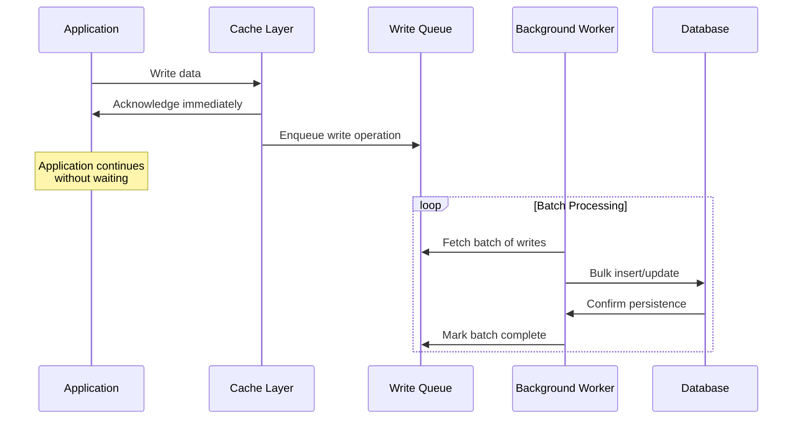
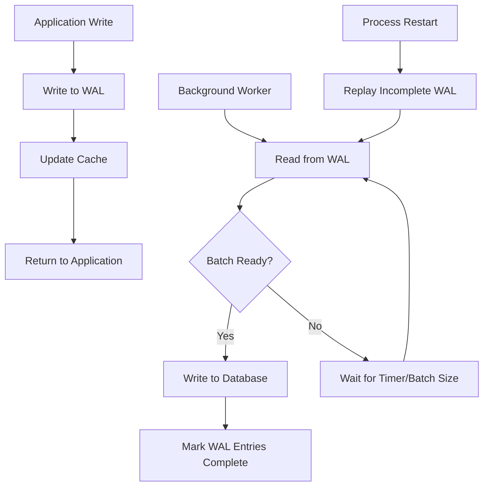

# How to Create Write-Behind Pattern Details

Author: [nawazdhandala](https://github.com/nawazdhandala)

Tags: Caching, Write-Behind, Performance, Architecture

Description: A practical guide to implementing the write-behind caching pattern for high-throughput systems with batching, durability, and failure recovery strategies.

---

Caching is fundamental to building fast applications. Most developers are familiar with read-through and write-through patterns, but write-behind (also called write-back) takes a different approach. Instead of blocking on every write to the database, write-behind acknowledges writes immediately in the cache and asynchronously persists them to storage later. This makes write operations fast at the cost of added complexity around durability and failure handling.

## What is Write-Behind Caching?

In a write-behind pattern, the application writes data to the cache first. The cache acknowledges the write immediately. A background process then flushes the cached writes to the persistent store at a later time, typically in batches. The application never waits for the database write to complete.



This pattern shines in scenarios where:

- Write throughput is high and cannot afford per-write database latency
- Writes can tolerate slight delays before becoming durable
- Batching writes to the database improves overall efficiency
- The application can handle the complexity of eventual consistency

## Basic Write-Behind Implementation

Let's build a write-behind cache in TypeScript. The core idea is maintaining an in-memory cache alongside a queue of pending writes that a background worker processes.

```typescript
import { EventEmitter } from "events";

interface WriteOperation<T> {
  key: string;
  value: T;
  timestamp: number;
  retryCount: number;
}

interface WriteBehindOptions {
  batchSize: number;
  flushIntervalMs: number;
  maxRetries: number;
  maxQueueSize: number;
}

class WriteBehindCache<T> extends EventEmitter {
  private cache: Map<string, T> = new Map();
  private writeQueue: WriteOperation<T>[] = [];
  private flushTimer: NodeJS.Timeout | null = null;
  private isFlushing: boolean = false;
  private options: WriteBehindOptions;
  private persistFn: (operations: WriteOperation<T>[]) => Promise<void>;

  constructor(
    persistFn: (operations: WriteOperation<T>[]) => Promise<void>,
    options: Partial<WriteBehindOptions> = {}
  ) {
    super();
    this.persistFn = persistFn;
    this.options = {
      batchSize: options.batchSize || 100,
      flushIntervalMs: options.flushIntervalMs || 1000,
      maxRetries: options.maxRetries || 3,
      maxQueueSize: options.maxQueueSize || 10000,
    };

    this.startFlushTimer();
  }

  async write(key: string, value: T): Promise<void> {
    // Check queue capacity
    if (this.writeQueue.length >= this.options.maxQueueSize) {
      throw new Error("Write queue is full, apply backpressure");
    }

    // Update cache immediately
    this.cache.set(key, value);

    // Enqueue for persistence
    this.writeQueue.push({
      key,
      value,
      timestamp: Date.now(),
      retryCount: 0,
    });

    this.emit("write:queued", { key, queueSize: this.writeQueue.length });

    // Trigger flush if batch size reached
    if (this.writeQueue.length >= this.options.batchSize) {
      this.flush();
    }
  }

  read(key: string): T | undefined {
    return this.cache.get(key);
  }

  private startFlushTimer(): void {
    this.flushTimer = setInterval(() => {
      if (this.writeQueue.length > 0 && !this.isFlushing) {
        this.flush();
      }
    }, this.options.flushIntervalMs);
  }

  async flush(): Promise<void> {
    if (this.isFlushing || this.writeQueue.length === 0) {
      return;
    }

    this.isFlushing = true;

    // Take a batch from the queue
    const batch = this.writeQueue.splice(0, this.options.batchSize);

    try {
      await this.persistFn(batch);
      this.emit("flush:success", { count: batch.length });
    } catch (error) {
      // Re-queue failed operations with incremented retry count
      const retriable = batch
        .map((op) => ({ ...op, retryCount: op.retryCount + 1 }))
        .filter((op) => op.retryCount <= this.options.maxRetries);

      const failed = batch.filter(
        (op) => op.retryCount + 1 > this.options.maxRetries
      );

      // Add retriable ops back to front of queue
      this.writeQueue.unshift(...retriable);

      this.emit("flush:error", {
        error,
        retriable: retriable.length,
        failed: failed.length,
      });

      // Emit individual failure events for ops that exceeded retries
      for (const op of failed) {
        this.emit("write:failed", { key: op.key, value: op.value });
      }
    } finally {
      this.isFlushing = false;
    }
  }

  async shutdown(): Promise<void> {
    if (this.flushTimer) {
      clearInterval(this.flushTimer);
    }

    // Flush remaining writes
    while (this.writeQueue.length > 0) {
      await this.flush();
    }
  }

  getQueueSize(): number {
    return this.writeQueue.length;
  }
}
```

## Usage Example with Database

Here is how you would use the write-behind cache with a PostgreSQL database:

```typescript
import { Pool } from "pg";

const pool = new Pool({ connectionString: process.env.DATABASE_URL });

// Define the persist function that handles batch writes
async function persistBatch(operations: WriteOperation<UserData>[]): Promise<void> {
  const client = await pool.connect();

  try {
    await client.query("BEGIN");

    // Use UPSERT for idempotent batch writes
    const values = operations.map((op, i) => {
      const offset = i * 3;
      return `($${offset + 1}, $${offset + 2}, $${offset + 3})`;
    }).join(", ");

    const params = operations.flatMap((op) => [
      op.key,
      JSON.stringify(op.value),
      new Date(op.timestamp),
    ]);

    await client.query(
      `INSERT INTO users (id, data, updated_at)
       VALUES ${values}
       ON CONFLICT (id) DO UPDATE SET
         data = EXCLUDED.data,
         updated_at = EXCLUDED.updated_at`,
      params
    );

    await client.query("COMMIT");
  } catch (error) {
    await client.query("ROLLBACK");
    throw error;
  } finally {
    client.release();
  }
}

// Create the cache instance
const userCache = new WriteBehindCache<UserData>(persistBatch, {
  batchSize: 50,
  flushIntervalMs: 2000,
  maxRetries: 3,
  maxQueueSize: 5000,
});

// Monitor events
userCache.on("write:queued", ({ key, queueSize }) => {
  console.log(`Write queued for ${key}, queue size: ${queueSize}`);
});

userCache.on("flush:success", ({ count }) => {
  console.log(`Flushed ${count} writes to database`);
});

userCache.on("flush:error", ({ error, retriable, failed }) => {
  console.error(`Flush failed: ${error.message}`);
  console.log(`Retriable: ${retriable}, Failed permanently: ${failed}`);
});

userCache.on("write:failed", ({ key }) => {
  // Handle permanently failed writes
  // Maybe write to a dead letter queue or alert
  console.error(`Write permanently failed for key: ${key}`);
});
```

## Write Coalescing for Hot Keys

When the same key gets updated frequently, you can save database writes by coalescing multiple updates into a single write. Only the latest value matters.

```typescript
class CoalescingWriteBehindCache<T> extends EventEmitter {
  private cache: Map<string, T> = new Map();
  private pendingWrites: Map<string, WriteOperation<T>> = new Map();
  private flushTimer: NodeJS.Timeout | null = null;
  private options: WriteBehindOptions;
  private persistFn: (operations: WriteOperation<T>[]) => Promise<void>;

  constructor(
    persistFn: (operations: WriteOperation<T>[]) => Promise<void>,
    options: Partial<WriteBehindOptions> = {}
  ) {
    super();
    this.persistFn = persistFn;
    this.options = {
      batchSize: options.batchSize || 100,
      flushIntervalMs: options.flushIntervalMs || 1000,
      maxRetries: options.maxRetries || 3,
      maxQueueSize: options.maxQueueSize || 10000,
    };
    this.startFlushTimer();
  }

  async write(key: string, value: T): Promise<void> {
    this.cache.set(key, value);

    // Coalesce: only keep the latest write per key
    const existing = this.pendingWrites.get(key);

    this.pendingWrites.set(key, {
      key,
      value,
      timestamp: Date.now(),
      retryCount: existing?.retryCount || 0,
    });

    if (this.pendingWrites.size >= this.options.batchSize) {
      this.flush();
    }
  }

  private startFlushTimer(): void {
    this.flushTimer = setInterval(() => {
      if (this.pendingWrites.size > 0) {
        this.flush();
      }
    }, this.options.flushIntervalMs);
  }

  async flush(): Promise<void> {
    if (this.pendingWrites.size === 0) {
      return;
    }

    // Take all pending writes
    const batch = Array.from(this.pendingWrites.values());
    this.pendingWrites.clear();

    try {
      await this.persistFn(batch);
      this.emit("flush:success", { count: batch.length });
    } catch (error) {
      // Re-add failed writes with incremented retry count
      for (const op of batch) {
        if (op.retryCount < this.options.maxRetries) {
          this.pendingWrites.set(op.key, {
            ...op,
            retryCount: op.retryCount + 1,
          });
        } else {
          this.emit("write:failed", { key: op.key, value: op.value });
        }
      }
      this.emit("flush:error", { error, batch: batch.length });
    }
  }

  read(key: string): T | undefined {
    return this.cache.get(key);
  }
}
```

The coalescing approach works well for counters, user sessions, and other data where only the current state matters. If you have 1000 updates to the same key in one second, you only write once.

## Durability with Write-Ahead Logging

The main risk with write-behind is data loss. If the process crashes before flushing, pending writes disappear. A write-ahead log (WAL) solves this by persisting write operations to disk before acknowledging them.



```typescript
import { appendFileSync, readFileSync, writeFileSync, existsSync } from "fs";

interface WALEntry<T> {
  id: string;
  key: string;
  value: T;
  timestamp: number;
  completed: boolean;
}

class DurableWriteBehindCache<T> extends EventEmitter {
  private cache: Map<string, T> = new Map();
  private walPath: string;
  private walEntries: Map<string, WALEntry<T>> = new Map();
  private options: WriteBehindOptions;
  private persistFn: (operations: WriteOperation<T>[]) => Promise<void>;
  private flushTimer: NodeJS.Timeout | null = null;

  constructor(
    walPath: string,
    persistFn: (operations: WriteOperation<T>[]) => Promise<void>,
    options: Partial<WriteBehindOptions> = {}
  ) {
    super();
    this.walPath = walPath;
    this.persistFn = persistFn;
    this.options = {
      batchSize: options.batchSize || 100,
      flushIntervalMs: options.flushIntervalMs || 1000,
      maxRetries: options.maxRetries || 3,
      maxQueueSize: options.maxQueueSize || 10000,
    };

    this.recoverFromWAL();
    this.startFlushTimer();
  }

  private recoverFromWAL(): void {
    if (!existsSync(this.walPath)) {
      writeFileSync(this.walPath, "");
      return;
    }

    const content = readFileSync(this.walPath, "utf-8");
    const lines = content.split("\n").filter((line) => line.trim());

    for (const line of lines) {
      try {
        const entry: WALEntry<T> = JSON.parse(line);
        if (!entry.completed) {
          this.walEntries.set(entry.id, entry);
          this.cache.set(entry.key, entry.value);
        }
      } catch (e) {
        // Skip malformed entries
      }
    }

    if (this.walEntries.size > 0) {
      console.log(`Recovered ${this.walEntries.size} pending writes from WAL`);
      this.emit("recovery:complete", { count: this.walEntries.size });
    }
  }

  async write(key: string, value: T): Promise<void> {
    const id = `${Date.now()}-${Math.random().toString(36).slice(2)}`;

    const entry: WALEntry<T> = {
      id,
      key,
      value,
      timestamp: Date.now(),
      completed: false,
    };

    // Write to WAL first (synchronous for durability)
    appendFileSync(this.walPath, JSON.stringify(entry) + "\n");

    // Then update cache
    this.cache.set(key, value);
    this.walEntries.set(id, entry);

    if (this.walEntries.size >= this.options.batchSize) {
      this.flush();
    }
  }

  private startFlushTimer(): void {
    this.flushTimer = setInterval(() => {
      if (this.walEntries.size > 0) {
        this.flush();
      }
    }, this.options.flushIntervalMs);
  }

  async flush(): Promise<void> {
    if (this.walEntries.size === 0) {
      return;
    }

    const entries = Array.from(this.walEntries.values());
    const batch = entries.slice(0, this.options.batchSize);

    const operations: WriteOperation<T>[] = batch.map((e) => ({
      key: e.key,
      value: e.value,
      timestamp: e.timestamp,
      retryCount: 0,
    }));

    try {
      await this.persistFn(operations);

      // Mark as completed and remove from pending
      for (const entry of batch) {
        entry.completed = true;
        this.walEntries.delete(entry.id);
      }

      // Compact WAL periodically
      this.compactWAL();

      this.emit("flush:success", { count: batch.length });
    } catch (error) {
      this.emit("flush:error", { error, batch: batch.length });
    }
  }

  private compactWAL(): void {
    // Rewrite WAL with only incomplete entries
    const incomplete = Array.from(this.walEntries.values());
    const content = incomplete.map((e) => JSON.stringify(e)).join("\n");
    writeFileSync(this.walPath, content ? content + "\n" : "");
  }

  read(key: string): T | undefined {
    return this.cache.get(key);
  }

  async shutdown(): Promise<void> {
    if (this.flushTimer) {
      clearInterval(this.flushTimer);
    }

    while (this.walEntries.size > 0) {
      await this.flush();
    }
  }
}
```

## Handling Failures and Retries

Failure handling in write-behind caches requires careful thought. You need to balance between retrying failed writes and not letting the queue grow unbounded.

```typescript
interface RetryPolicy {
  maxRetries: number;
  baseDelayMs: number;
  maxDelayMs: number;
  backoffMultiplier: number;
}

class ResilientWriteBehindCache<T> extends EventEmitter {
  private cache: Map<string, T> = new Map();
  private writeQueue: WriteOperation<T>[] = [];
  private retryQueue: WriteOperation<T>[] = [];
  private options: WriteBehindOptions;
  private retryPolicy: RetryPolicy;
  private persistFn: (operations: WriteOperation<T>[]) => Promise<void>;
  private flushTimer: NodeJS.Timeout | null = null;
  private retryTimer: NodeJS.Timeout | null = null;
  private deadLetterHandler: ((op: WriteOperation<T>) => void) | null = null;

  constructor(
    persistFn: (operations: WriteOperation<T>[]) => Promise<void>,
    options: Partial<WriteBehindOptions> = {},
    retryPolicy: Partial<RetryPolicy> = {}
  ) {
    super();
    this.persistFn = persistFn;
    this.options = {
      batchSize: options.batchSize || 100,
      flushIntervalMs: options.flushIntervalMs || 1000,
      maxRetries: options.maxRetries || 3,
      maxQueueSize: options.maxQueueSize || 10000,
    };
    this.retryPolicy = {
      maxRetries: retryPolicy.maxRetries || 5,
      baseDelayMs: retryPolicy.baseDelayMs || 1000,
      maxDelayMs: retryPolicy.maxDelayMs || 30000,
      backoffMultiplier: retryPolicy.backoffMultiplier || 2,
    };

    this.startTimers();
  }

  setDeadLetterHandler(handler: (op: WriteOperation<T>) => void): void {
    this.deadLetterHandler = handler;
  }

  private startTimers(): void {
    // Main flush timer
    this.flushTimer = setInterval(() => {
      if (this.writeQueue.length > 0) {
        this.flush();
      }
    }, this.options.flushIntervalMs);

    // Retry timer (runs less frequently)
    this.retryTimer = setInterval(() => {
      this.processRetryQueue();
    }, this.retryPolicy.baseDelayMs);
  }

  async write(key: string, value: T): Promise<void> {
    const totalPending = this.writeQueue.length + this.retryQueue.length;

    if (totalPending >= this.options.maxQueueSize) {
      this.emit("backpressure", { queueSize: totalPending });
      throw new Error("Write queue is full");
    }

    this.cache.set(key, value);

    this.writeQueue.push({
      key,
      value,
      timestamp: Date.now(),
      retryCount: 0,
    });

    if (this.writeQueue.length >= this.options.batchSize) {
      this.flush();
    }
  }

  private calculateBackoffDelay(retryCount: number): number {
    const delay = this.retryPolicy.baseDelayMs *
      Math.pow(this.retryPolicy.backoffMultiplier, retryCount);

    // Add jitter (plus or minus 20%)
    const jitter = delay * 0.2 * (Math.random() - 0.5);

    return Math.min(delay + jitter, this.retryPolicy.maxDelayMs);
  }

  async flush(): Promise<void> {
    if (this.writeQueue.length === 0) {
      return;
    }

    const batch = this.writeQueue.splice(0, this.options.batchSize);

    try {
      await this.persistFn(batch);
      this.emit("flush:success", { count: batch.length });
    } catch (error) {
      this.handleFlushFailure(batch, error as Error);
    }
  }

  private handleFlushFailure(batch: WriteOperation<T>[], error: Error): void {
    for (const op of batch) {
      const newRetryCount = op.retryCount + 1;

      if (newRetryCount > this.retryPolicy.maxRetries) {
        // Move to dead letter handling
        if (this.deadLetterHandler) {
          this.deadLetterHandler(op);
        }
        this.emit("write:dead-letter", { key: op.key, retries: op.retryCount });
      } else {
        // Schedule for retry with backoff
        this.retryQueue.push({
          ...op,
          retryCount: newRetryCount,
          timestamp: Date.now() + this.calculateBackoffDelay(newRetryCount),
        });
      }
    }

    this.emit("flush:error", {
      error,
      batch: batch.length,
      retryQueueSize: this.retryQueue.length,
    });
  }

  private processRetryQueue(): void {
    const now = Date.now();
    const ready: WriteOperation<T>[] = [];
    const notReady: WriteOperation<T>[] = [];

    for (const op of this.retryQueue) {
      if (op.timestamp <= now) {
        ready.push(op);
      } else {
        notReady.push(op);
      }
    }

    this.retryQueue = notReady;

    if (ready.length > 0) {
      // Add ready items back to main queue for processing
      this.writeQueue.push(...ready);
      this.emit("retry:scheduled", { count: ready.length });
    }
  }

  read(key: string): T | undefined {
    return this.cache.get(key);
  }

  getStats(): {
    cacheSize: number;
    writeQueueSize: number;
    retryQueueSize: number;
  } {
    return {
      cacheSize: this.cache.size,
      writeQueueSize: this.writeQueue.length,
      retryQueueSize: this.retryQueue.length,
    };
  }
}
```

## Monitoring Write-Behind Caches

Proper monitoring is critical for write-behind caches. You need visibility into queue depth, flush latency, and failure rates.

```typescript
import { Counter, Gauge, Histogram } from "prom-client";

const writeQueueDepth = new Gauge({
  name: "write_behind_queue_depth",
  help: "Current number of pending writes",
  labelNames: ["cache_name"],
});

const retryQueueDepth = new Gauge({
  name: "write_behind_retry_queue_depth",
  help: "Current number of writes pending retry",
  labelNames: ["cache_name"],
});

const flushDuration = new Histogram({
  name: "write_behind_flush_duration_seconds",
  help: "Time taken to flush batches to database",
  labelNames: ["cache_name", "result"],
  buckets: [0.01, 0.05, 0.1, 0.25, 0.5, 1, 2.5, 5],
});

const writesTotal = new Counter({
  name: "write_behind_writes_total",
  help: "Total writes processed",
  labelNames: ["cache_name", "result"],
});

const deadLetterTotal = new Counter({
  name: "write_behind_dead_letter_total",
  help: "Writes that exceeded retry limit",
  labelNames: ["cache_name"],
});

class MonitoredWriteBehindCache<T> {
  private cache: ResilientWriteBehindCache<T>;
  private name: string;

  constructor(
    name: string,
    persistFn: (operations: WriteOperation<T>[]) => Promise<void>,
    options: Partial<WriteBehindOptions> = {}
  ) {
    this.name = name;
    this.cache = new ResilientWriteBehindCache(persistFn, options);
    this.setupMonitoring();
  }

  private setupMonitoring(): void {
    this.cache.on("flush:success", ({ count }) => {
      writesTotal.inc({ cache_name: this.name, result: "success" }, count);
    });

    this.cache.on("flush:error", ({ batch }) => {
      writesTotal.inc({ cache_name: this.name, result: "error" }, batch);
    });

    this.cache.on("write:dead-letter", () => {
      deadLetterTotal.inc({ cache_name: this.name });
    });

    // Update gauges periodically
    setInterval(() => {
      const stats = this.cache.getStats();
      writeQueueDepth.set({ cache_name: this.name }, stats.writeQueueSize);
      retryQueueDepth.set({ cache_name: this.name }, stats.retryQueueSize);
    }, 5000);
  }

  async write(key: string, value: T): Promise<void> {
    return this.cache.write(key, value);
  }

  read(key: string): T | undefined {
    return this.cache.read(key);
  }
}
```

## When to Use Write-Behind

Write-behind caching fits specific use cases. Consider it when:

| Scenario | Why Write-Behind Helps |
|----------|------------------------|
| High write throughput | Batching reduces database load |
| Write latency sensitivity | Immediate acknowledgment |
| Analytics/metrics ingestion | Slight delay is acceptable |
| Session stores | Frequent updates, coalescing helps |
| Activity logging | Bulk inserts are more efficient |

Avoid write-behind when:

| Scenario | Why to Avoid |
|----------|--------------|
| Financial transactions | Durability is critical |
| Order processing | Consistency required |
| Inventory management | Stale reads cause overselling |
| Compliance logging | Must be synchronously durable |

## Summary

Write-behind caching trades immediate durability for write performance. The pattern works well when you can tolerate eventual consistency and when batching writes provides meaningful performance gains. The key implementation details to get right are:

1. **Queue management**: Bound the queue size and implement backpressure
2. **Batching**: Coalesce writes to the same key when possible
3. **Durability**: Use a write-ahead log if you cannot afford to lose pending writes
4. **Failure handling**: Implement exponential backoff and dead letter queues
5. **Monitoring**: Track queue depth, flush latency, and failure rates

The write-behind pattern is a powerful tool, but it adds operational complexity. Make sure the performance benefits justify that complexity for your use case.
