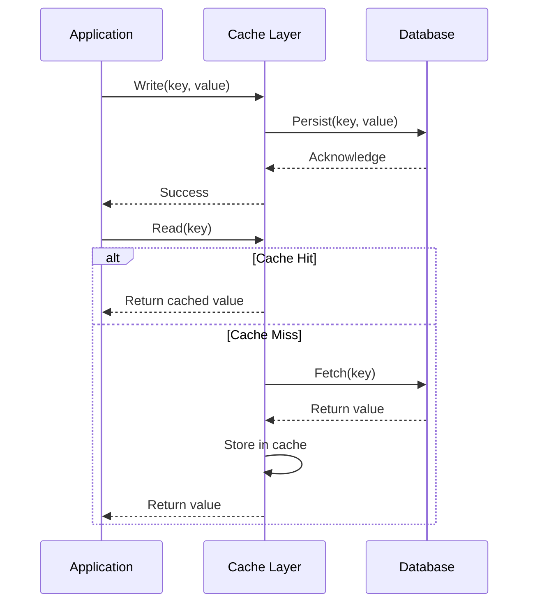
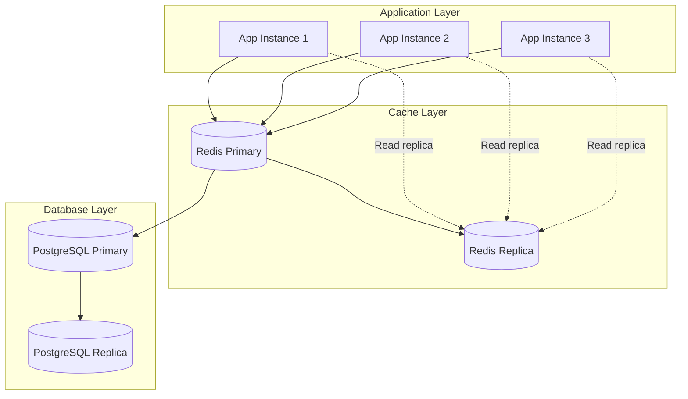

# How to Implement Write-Through Pattern Details

Author: [nawazdhandala](https://github.com/nawazdhandala)

Tags: Caching, Write-Through, Data Consistency, Architecture

Description: Learn to implement the write-through caching pattern for synchronous cache and database updates.

---

Caching is one of the simplest ways to improve application performance, but keeping cached data in sync with your database creates real engineering challenges. The write-through pattern solves this by treating the cache as the primary interface for writes, with every write flowing through to the database before returning success. This guarantees consistency at the cost of slightly higher write latency.

## How Write-Through Works

In a write-through setup, your application writes to the cache first. The cache layer then synchronously persists the data to the database. Only after both operations complete does the caller receive confirmation. Reads always hit the cache first, falling back to the database on a miss and populating the cache before returning.



The synchronous database write is what distinguishes write-through from write-behind (also called write-back). Write-behind queues database writes and returns immediately, trading consistency for throughput. Write-through never lies about persistence.

## When to Choose Write-Through

This pattern fits specific use cases well. The table below summarizes when write-through makes sense versus alternatives.

| Scenario | Recommended Pattern | Reason |
| --- | --- | --- |
| Financial transactions, inventory counts | Write-through | Data loss is unacceptable; consistency matters more than latency |
| User session data, preferences | Write-through | Reads heavily outweigh writes; stale data causes confusion |
| Analytics event ingestion | Write-behind | High throughput matters; occasional loss is tolerable |
| Product catalog reads | Cache-aside | Infrequent writes; manual invalidation is simpler |
| Real-time leaderboards | Write-through | Reads are constant; writes must be immediately visible |

Choose write-through when your application needs strong consistency and read-heavy workloads benefit from warm caches. Avoid it for write-heavy pipelines where synchronous database round-trips become a bottleneck.

## Implementation in Node.js

Here is a practical implementation using Redis as the cache and PostgreSQL as the database. The core idea is wrapping both operations in a single function that only returns after both succeed.

The cache service handles the coordination between Redis and the database layer.

```typescript
// services/cache.ts
import Redis from "ioredis";
import { Pool } from "pg";

const redis = new Redis({
  host: process.env.REDIS_HOST,
  port: 6379,
});

const db = new Pool({
  connectionString: process.env.DATABASE_URL,
});

// Write-through: update cache and database synchronously
export async function writeThroughSet<T>(
  key: string,
  value: T,
  tableName: string,
  ttlSeconds: number = 3600
): Promise<void> {
  const serialized = JSON.stringify(value);

  // Start a database transaction for atomicity
  const client = await db.connect();
  try {
    await client.query("BEGIN");

    // Upsert the record in the database
    await client.query(
      `INSERT INTO ${tableName} (key, value, updated_at)
       VALUES ($1, $2, NOW())
       ON CONFLICT (key) DO UPDATE SET value = $2, updated_at = NOW()`,
      [key, serialized]
    );

    // Only update cache after database confirms
    await redis.setex(key, ttlSeconds, serialized);

    await client.query("COMMIT");
  } catch (error) {
    await client.query("ROLLBACK");
    throw error;
  } finally {
    client.release();
  }
}

// Read with cache-first strategy
export async function readThrough<T>(
  key: string,
  tableName: string,
  ttlSeconds: number = 3600
): Promise<T | null> {
  // Check cache first
  const cached = await redis.get(key);
  if (cached) {
    return JSON.parse(cached) as T;
  }

  // Cache miss: fetch from database
  const result = await db.query(
    `SELECT value FROM ${tableName} WHERE key = $1`,
    [key]
  );

  if (result.rows.length === 0) {
    return null;
  }

  const value = result.rows[0].value;

  // Populate cache for future reads
  await redis.setex(key, ttlSeconds, value);

  return JSON.parse(value) as T;
}
```

The functions above handle the basic pattern. The `writeThroughSet` function uses a database transaction to ensure the write either fully succeeds or fully fails. If the Redis operation fails after the database commit, you have a brief inconsistency window, but the database remains the source of truth.

## Handling Edge Cases

Real systems need to handle failures gracefully. The implementation below adds retry logic and circuit breaker patterns for production use.

```typescript
// services/resilient-cache.ts
import { writeThroughSet, readThrough } from "./cache";

interface RetryConfig {
  maxAttempts: number;
  baseDelayMs: number;
}

const defaultRetryConfig: RetryConfig = {
  maxAttempts: 3,
  baseDelayMs: 100,
};

// Exponential backoff helper
async function sleep(ms: number): Promise<void> {
  return new Promise((resolve) => setTimeout(resolve, ms));
}

// Write with retry logic
export async function resilientWrite<T>(
  key: string,
  value: T,
  tableName: string,
  config: RetryConfig = defaultRetryConfig
): Promise<boolean> {
  let lastError: Error | null = null;

  for (let attempt = 1; attempt <= config.maxAttempts; attempt++) {
    try {
      await writeThroughSet(key, value, tableName);
      return true;
    } catch (error) {
      lastError = error as Error;

      // Log the failure for observability
      console.error(`Write attempt ${attempt} failed for key ${key}:`, error);

      if (attempt < config.maxAttempts) {
        // Exponential backoff: 100ms, 200ms, 400ms...
        const delay = config.baseDelayMs * Math.pow(2, attempt - 1);
        await sleep(delay);
      }
    }
  }

  // All retries exhausted
  throw new Error(
    `Write-through failed after ${config.maxAttempts} attempts: ${lastError?.message}`
  );
}
```

## Architecture Considerations

The diagram below shows how write-through fits into a typical service architecture with multiple application instances.



A few architecture decisions matter when scaling write-through:

**Cache topology.** A single Redis primary handles all writes to avoid split-brain scenarios. Read replicas scale read throughput without consistency risks.

**TTL strategy.** Set TTLs based on how often data changes. User profiles might use 24-hour TTLs while inventory counts need 5-minute windows. Shorter TTLs reduce memory pressure but increase database load on misses.

**Key design.** Use predictable, namespaced keys like `user:123:profile` or `product:456:inventory`. This makes debugging easier and enables pattern-based eviction when needed.

## Performance Trade-offs

Write-through adds latency to every write operation. The synchronous database round-trip typically adds 5-20ms depending on your infrastructure. For most applications, this is acceptable because:

1. Reads vastly outnumber writes in typical workloads
2. Cache hits eliminate database reads entirely
3. Consistency guarantees prevent costly bug hunts

If write latency becomes a bottleneck, consider these optimizations:

| Optimization | Trade-off |
| --- | --- |
| Connection pooling | Reduces connection overhead; requires tuning pool size |
| Prepared statements | Faster execution; adds complexity to query layer |
| Batch writes | Lower per-write latency; increases complexity and memory |
| Async cache update | Slight inconsistency window; faster perceived writes |

## Monitoring Write-Through Systems

Observability is essential for write-through caches. Track these metrics to catch problems early:

- **Cache hit ratio**: Should stay above 90% for read-heavy workloads. Drops indicate TTL issues or working set exceeds cache size.
- **Write latency p99**: Sudden spikes suggest database contention or network issues.
- **Cache eviction rate**: High eviction means your cache is undersized.
- **Database connection pool utilization**: Saturation causes write failures.

Set alerts when hit ratios drop below thresholds or when write latencies exceed your SLO. These metrics combined with distributed tracing give you visibility into whether cache or database is the bottleneck.

## Summary

Write-through caching gives you strong consistency between cache and database at the cost of synchronous write latency. It works best for read-heavy workloads where data correctness matters more than raw write throughput. The pattern is straightforward to implement: wrap cache and database writes in a single operation, handle failures with retries, and monitor hit ratios and latencies.

Start with the basic implementation, measure your actual workload, and add resilience features as needed. The goal is not a perfect cache but a cache that fails predictably and keeps your data consistent when it matters most.
