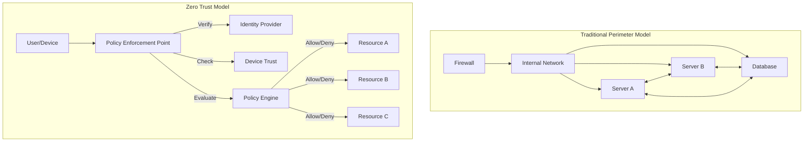
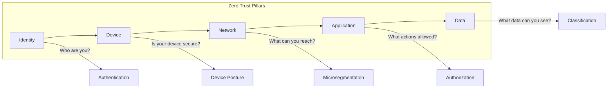
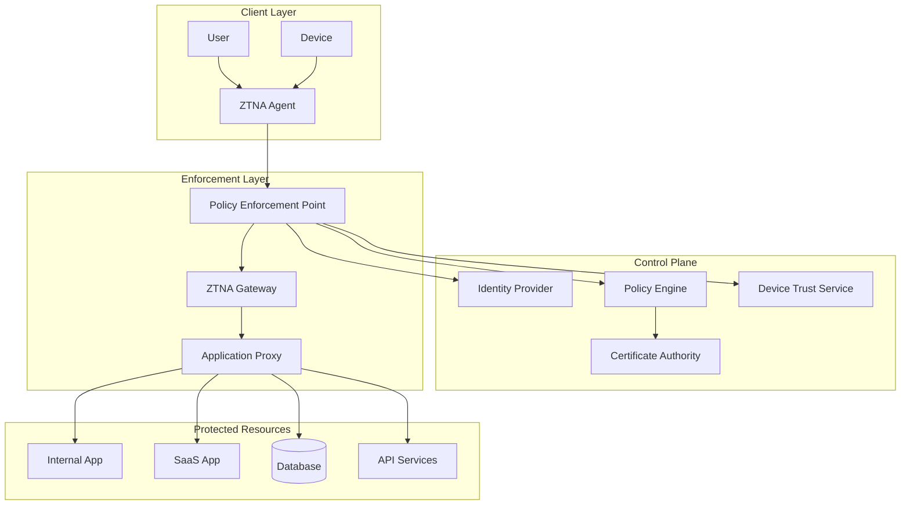
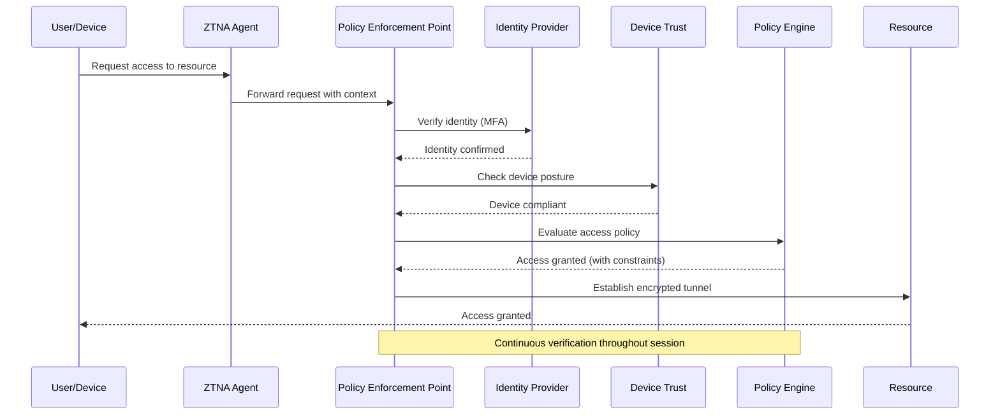
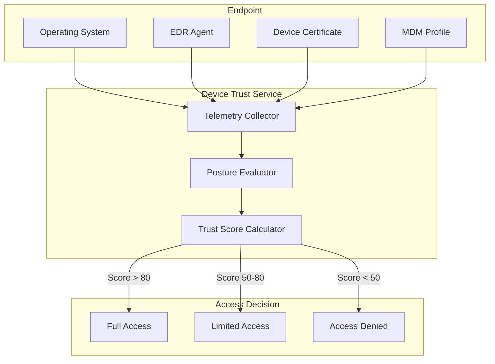
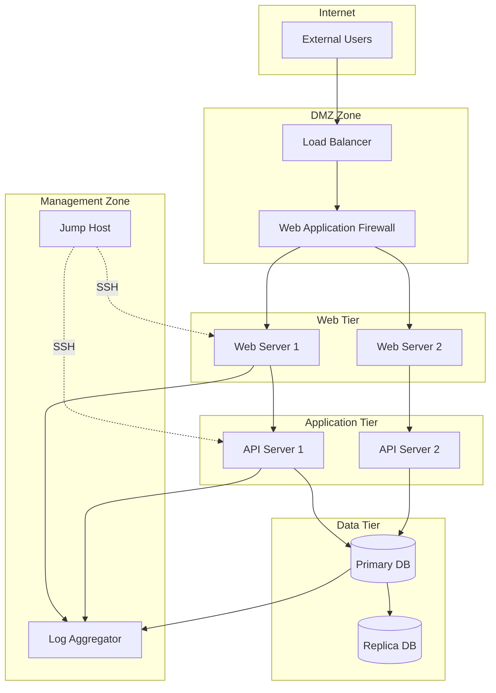
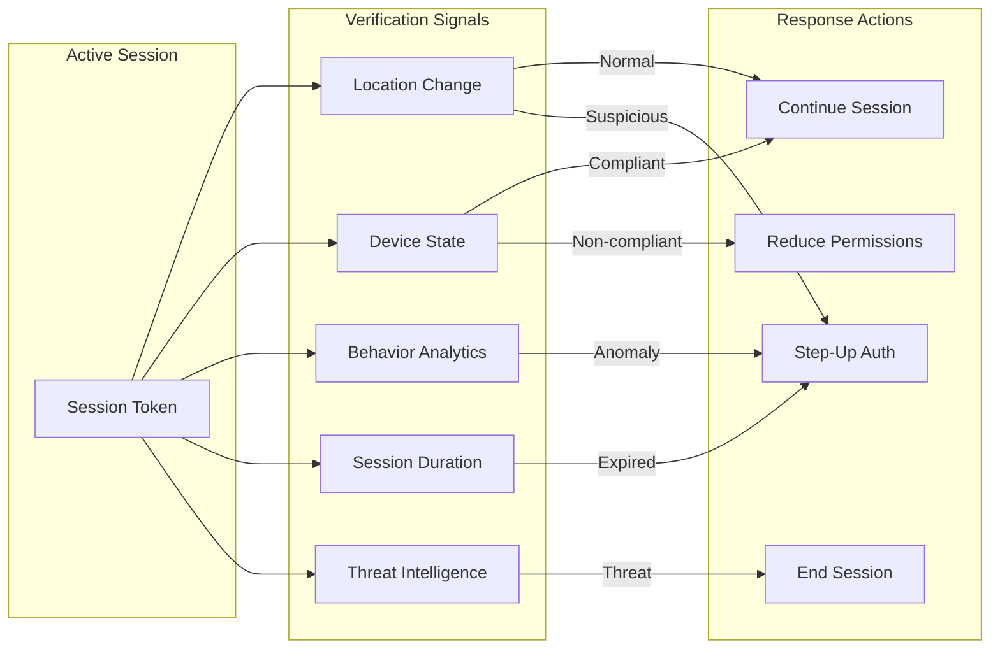
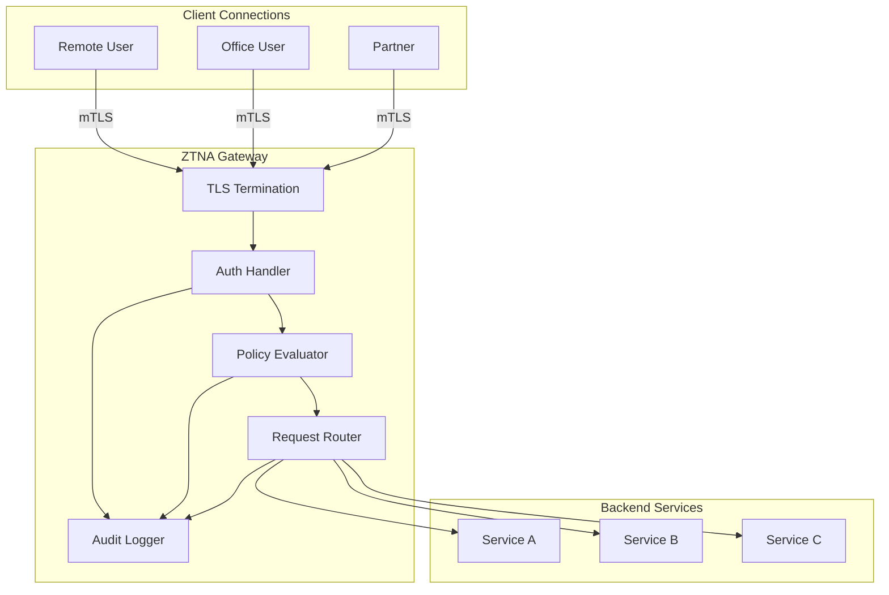
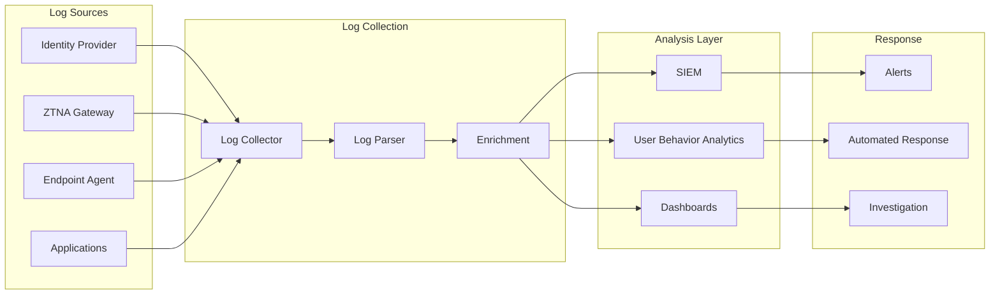

# How to Build Zero Trust Network Access

Author: [nawazdhandala](https://github.com/nawazdhandala)

Tags: Zero Trust, Security, Networking, Architecture

Description: A practical guide to implementing Zero Trust Network Access from the ground up, covering identity verification, device trust, microsegmentation, and continuous verification.

---

The traditional perimeter security model assumes everything inside the network can be trusted. That assumption killed countless organizations when attackers breached the perimeter and moved laterally without resistance. Zero Trust Network Access (ZTNA) flips this model: trust nothing, verify everything, assume breach.

This guide walks through building a ZTNA architecture from scratch, with concrete implementation patterns you can apply to your infrastructure today.

---

## What Zero Trust Actually Means

Zero Trust is not a product you buy. It is an architecture built on three principles:

1. **Never trust, always verify.** Every access request gets authenticated and authorized, regardless of where it originates.
2. **Assume breach.** Design systems as if attackers are already inside. Limit blast radius through segmentation.
3. **Least privilege access.** Grant the minimum permissions needed for the task, for the shortest time necessary.



---

## The Five Pillars of Zero Trust Architecture

A complete ZTNA implementation addresses five interconnected domains:



### Pillar 1: Identity

Identity is the new perimeter. Every access decision starts with strong authentication.

**Implementation requirements:**

- Multi-factor authentication (MFA) on every access point
- Single Sign-On (SSO) with SAML or OIDC
- Passwordless authentication where possible (FIDO2, WebAuthn)
- Just-in-time (JIT) provisioning through SCIM

### Pillar 2: Device Trust

A valid identity on a compromised device is still a threat. Device posture checks verify the endpoint before granting access.

**Device trust signals:**

- Operating system version and patch level
- Endpoint detection and response (EDR) agent running
- Disk encryption enabled
- Certificate-based device identity
- Mobile device management (MDM) compliance

### Pillar 3: Network

Microsegmentation replaces the flat network with isolated zones. Lateral movement becomes impossible without explicit permission.

### Pillar 4: Application

Application-level controls enforce what authenticated users can actually do. Role-based access control (RBAC) and attribute-based access control (ABAC) govern every action.

### Pillar 5: Data

Data classification and protection travel with the data itself. Encryption, DLP policies, and access logging ensure sensitive information stays controlled.

---

## Architecture Deep Dive

### Core Components



### Policy Decision Flow

Every access request follows this evaluation sequence:



---

## Implementation Patterns

### Pattern 1: Identity-First Access

Start every implementation with identity. Without strong authentication, nothing else matters.

**Step 1: Deploy an Identity Provider**

Use a modern IdP that supports:
- SAML 2.0 and OIDC
- Conditional access policies
- Risk-based authentication
- SCIM provisioning

Popular choices: Okta, Azure AD, Google Workspace, Keycloak (self-hosted).

**Step 2: Enforce MFA Everywhere**

```yaml
# Example: Conditional access policy structure
policy:
  name: require-mfa-all-apps
  conditions:
    users: all
    applications: all
    locations:
      exclude:
        - trusted_office_ips
  grant_controls:
    require:
      - mfa
    session_controls:
      sign_in_frequency: 8 hours
```

**Step 3: Implement Risk-Based Authentication**

Increase authentication requirements based on risk signals:

| Risk Signal | Response |
|-------------|----------|
| New device | Require MFA + email verification |
| Unusual location | Step-up authentication |
| Off-hours access | Manager approval required |
| High-sensitivity resource | Require hardware key |

### Pattern 2: Device Trust Verification

Device posture checks run before and during every session.

**Device Trust Architecture:**



**Posture Check Implementation:**

```json
{
  "device_requirements": {
    "os_minimum_version": {
      "windows": "10.0.19044",
      "macos": "12.0",
      "ios": "15.0",
      "android": "12"
    },
    "security_requirements": {
      "disk_encryption": true,
      "firewall_enabled": true,
      "antivirus_running": true,
      "screen_lock_enabled": true,
      "jailbreak_detected": false
    },
    "certificate_requirements": {
      "device_certificate_valid": true,
      "certificate_not_revoked": true
    }
  }
}
```

### Pattern 3: Microsegmentation

Microsegmentation divides your network into isolated zones. Each workload only communicates with explicitly permitted destinations.

**Network Segmentation Layers:**



**Segmentation Policy Example:**

```yaml
# Network policy for API tier
apiVersion: networking.k8s.io/v1
kind: NetworkPolicy
metadata:
  name: api-tier-policy
  namespace: production
spec:
  podSelector:
    matchLabels:
      tier: api
  policyTypes:
    - Ingress
    - Egress
  ingress:
    # Only accept traffic from web tier
    - from:
        - podSelector:
            matchLabels:
              tier: web
      ports:
        - protocol: TCP
          port: 8080
  egress:
    # Only allow connections to database tier
    - to:
        - podSelector:
            matchLabels:
              tier: database
      ports:
        - protocol: TCP
          port: 5432
    # Allow DNS resolution
    - to:
        - namespaceSelector:
            matchLabels:
              kubernetes.io/metadata.name: kube-system
          podSelector:
            matchLabels:
              k8s-app: kube-dns
      ports:
        - protocol: UDP
          port: 53
```

### Pattern 4: Continuous Verification

Zero Trust does not stop at initial authentication. Sessions require ongoing validation.

**Continuous Verification Signals:**



**Session Reevaluation Implementation:**

```python
class ContinuousVerification:
    def __init__(self, session):
        self.session = session
        self.evaluation_interval = 300  # 5 minutes

    def evaluate_session(self):
        signals = self.collect_signals()

        # Check location consistency
        if self.location_changed_suspiciously(signals['location']):
            return self.require_step_up_auth()

        # Verify device still compliant
        if not signals['device_posture']['compliant']:
            return self.reduce_permissions()

        # Check behavior patterns
        if self.detect_anomaly(signals['behavior']):
            return self.require_step_up_auth()

        # Verify session not expired
        if self.session_expired(signals['timestamp']):
            return self.require_reauth()

        # Check threat intelligence
        if signals['threat_level'] == 'high':
            return self.terminate_session()

        return self.continue_session()

    def collect_signals(self):
        return {
            'location': self.get_current_location(),
            'device_posture': self.check_device_posture(),
            'behavior': self.get_behavior_metrics(),
            'timestamp': self.get_session_timestamp(),
            'threat_level': self.check_threat_intel()
        }
```

---

## Building the ZTNA Gateway

The ZTNA gateway is the enforcement point that brokers all connections between users and resources.

### Gateway Architecture



### Gateway Configuration

```yaml
# ZTNA Gateway configuration
gateway:
  name: production-gateway
  listeners:
    - port: 443
      protocol: HTTPS
      tls:
        mode: mTLS
        client_ca: /etc/certs/client-ca.pem
        server_cert: /etc/certs/server.pem
        server_key: /etc/certs/server-key.pem

  authentication:
    provider: oidc
    issuer: https://idp.example.com
    client_id: gateway-client
    scopes:
      - openid
      - profile
      - groups

  authorization:
    policy_engine: opa
    policy_path: /policies/authz.rego

  routes:
    - match:
        path_prefix: /api/v1/
        headers:
          x-service: internal-api
      destination:
        service: api-service.internal
        port: 8080
      policy:
        require_groups:
          - engineering
          - api-users
        device_trust:
          minimum_score: 70

    - match:
        path_prefix: /admin/
      destination:
        service: admin-service.internal
        port: 8443
      policy:
        require_groups:
          - platform-admins
        require_mfa: true
        device_trust:
          minimum_score: 90
          require_managed: true

  audit:
    enabled: true
    destination: siem.internal:514
    format: json
    include_headers: true
    include_body: false
```

---

## Monitoring and Observability

Zero Trust generates extensive telemetry. You need visibility into authentication events, policy decisions, and access patterns.

### Key Metrics to Track

| Metric | Purpose | Alert Threshold |
|--------|---------|-----------------|
| Authentication failures | Detect brute force | > 5 failures/minute |
| Policy denials | Identify misconfiguration | > 10% denial rate |
| Session duration | Spot hijacking | > 8 hours |
| Device posture failures | Track compliance | > 20% non-compliant |
| Unusual access patterns | Detect compromise | Anomaly detection |

### Logging Architecture



### Sample Log Query

```sql
-- Find failed access attempts by user in last hour
SELECT
    user_id,
    resource,
    denial_reason,
    device_id,
    source_ip,
    timestamp
FROM access_logs
WHERE
    decision = 'DENY'
    AND timestamp > NOW() - INTERVAL '1 hour'
ORDER BY timestamp DESC;

-- Identify users with unusual access patterns
SELECT
    user_id,
    COUNT(DISTINCT resource) as unique_resources,
    COUNT(*) as total_requests,
    COUNT(DISTINCT source_ip) as unique_ips
FROM access_logs
WHERE timestamp > NOW() - INTERVAL '24 hours'
GROUP BY user_id
HAVING
    COUNT(DISTINCT resource) > 50
    OR COUNT(DISTINCT source_ip) > 5;
```

---

## Migration Strategy

Moving to Zero Trust is not a weekend project. Plan a phased rollout that minimizes disruption.

### Phase 1: Visibility (Weeks 1-4)

- Deploy logging and monitoring infrastructure
- Inventory all users, devices, and applications
- Map existing access patterns
- Identify high-value assets

### Phase 2: Identity Foundation (Weeks 5-12)

- Deploy or upgrade identity provider
- Enable MFA for all users
- Implement SSO for major applications
- Begin device enrollment

### Phase 3: Initial Enforcement (Weeks 13-20)

- Deploy ZTNA gateway in monitor mode
- Create baseline policies
- Start with low-risk applications
- Gather feedback and tune policies

### Phase 4: Expand Coverage (Weeks 21-32)

- Migrate additional applications
- Implement microsegmentation
- Enable continuous verification
- Decommission legacy VPN

### Phase 5: Optimize (Ongoing)

- Refine policies based on telemetry
- Automate common workflows
- Regular security assessments
- Update threat models

---

## Common Pitfalls

**Starting too big.** Do not try to implement everything at once. Pick one critical application and prove the model works.

**Ignoring user experience.** Constant authentication prompts create friction and drive shadow IT. Balance security with usability.

**Treating it as a product purchase.** Zero Trust is an architecture, not a SKU. No single vendor provides a complete solution.

**Neglecting legacy systems.** Old applications that cannot support modern authentication need compensating controls or isolation.

**Skipping the inventory.** You cannot protect what you do not know exists. Asset discovery comes first.

**Underestimating device diversity.** BYOD, contractors, and IoT devices all need strategies that differ from managed corporate endpoints.

---

## Security Checklist

Before declaring your ZTNA implementation complete, verify these controls:

- [ ] MFA enforced on all user authentication
- [ ] Device posture checks required for sensitive resources
- [ ] Default-deny network policies in all segments
- [ ] Session timeout and reauthentication configured
- [ ] All access logged with user, device, and resource context
- [ ] Alerting configured for anomalous access patterns
- [ ] Incident response procedures updated for Zero Trust events
- [ ] Break-glass procedures documented and tested
- [ ] Regular access reviews scheduled
- [ ] Penetration testing includes Zero Trust bypass attempts

---

Zero Trust Network Access is not a destination but a continuous practice. Start with identity, expand to device trust and microsegmentation, and never stop verifying. The attackers are persistent. Your security architecture should be too.
