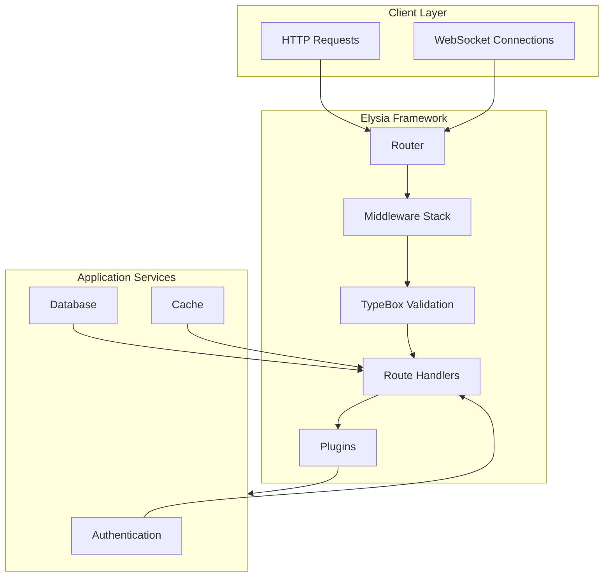
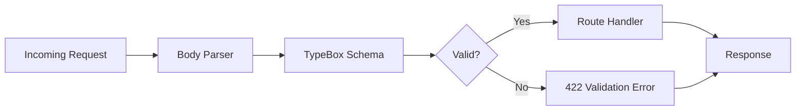
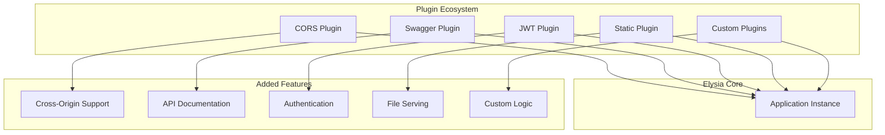
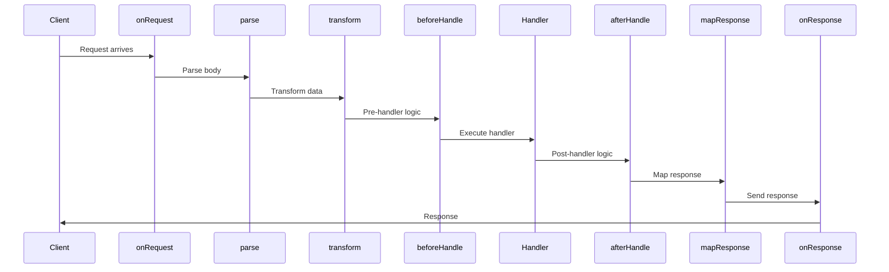
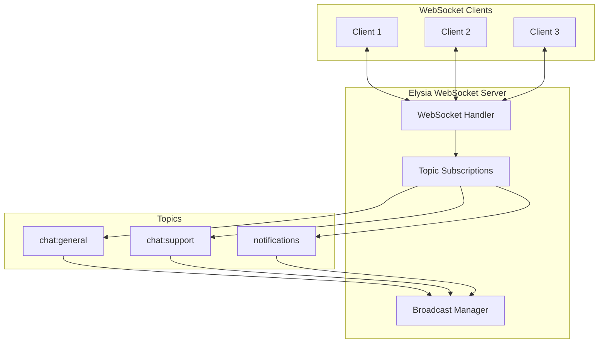

# How to Use Elysia Framework with Bun

Author: [nawazdhandala](https://github.com/nawazdhandala)

Tags: Bun, Elysia, TypeScript, REST API

Description: Learn how to build fast, type-safe APIs with the Elysia framework on Bun runtime, covering routing, validation, plugins, middleware, WebSockets, OpenAPI, and authentication.

---

Building modern web APIs requires a framework that is both fast and developer-friendly. Elysia is a TypeScript web framework designed specifically for Bun, offering exceptional performance and end-to-end type safety. With its elegant API and powerful plugin system, Elysia makes building production-ready APIs a joy.

In this comprehensive guide, we will explore everything you need to know about building APIs with Elysia and Bun. From basic routing to advanced patterns like authentication, WebSockets, and automatic OpenAPI documentation, you will learn how to leverage the full power of this modern stack.

## Why Elysia and Bun?

Before diving into code, let us understand why this combination is gaining popularity among developers.

**Bun** is a modern JavaScript runtime that is significantly faster than Node.js. It includes a built-in bundler, test runner, and package manager, making it a complete toolkit for JavaScript and TypeScript development.

**Elysia** is designed from the ground up to take advantage of Bun's capabilities. It provides:

- **Exceptional Performance**: One of the fastest web frameworks available
- **End-to-End Type Safety**: Full TypeScript support with inference
- **Elegant API**: Clean, chainable syntax that is easy to learn
- **Built-in Validation**: Schema validation with TypeBox
- **Plugin Ecosystem**: Extensible architecture with official plugins

The following diagram illustrates the Elysia architecture:



## Getting Started with Elysia

Let us start by setting up a new Elysia project. First, ensure you have Bun installed on your system.

Create a new project directory and initialize it:

```bash
mkdir elysia-api
cd elysia-api
bun init -y
bun add elysia
```

Create your first Elysia server with a simple hello world endpoint:

```typescript
// src/index.ts - Basic Elysia server setup
// This creates a minimal server that responds to GET requests

import { Elysia } from "elysia";

const app = new Elysia()
  .get("/", () => "Hello from Elysia!")
  .get("/health", () => ({ status: "healthy", timestamp: Date.now() }))
  .listen(3000);

console.log(`Server running at http://localhost:${app.server?.port}`);
```

Run the server with:

```bash
bun run src/index.ts
```

## Routing in Elysia

Elysia provides a clean, chainable API for defining routes. Each HTTP method has a corresponding function that accepts a path and a handler.

Here is an example demonstrating various route patterns:

```typescript
// src/routes.ts - Comprehensive routing examples
// Demonstrates different route patterns and HTTP methods

import { Elysia } from "elysia";

const app = new Elysia()
  // Basic GET route returning a string
  .get("/", () => "Welcome to our API")
  
  // GET route returning JSON
  .get("/api/info", () => ({
    name: "Elysia API",
    version: "1.0.0",
    runtime: "Bun"
  }))
  
  // POST route for creating resources
  .post("/api/items", ({ body }) => {
    console.log("Creating item:", body);
    return { message: "Item created", data: body };
  })
  
  // PUT route for updating resources
  .put("/api/items/:id", ({ params, body }) => {
    return { message: `Updated item ${params.id}`, data: body };
  })
  
  // DELETE route for removing resources
  .delete("/api/items/:id", ({ params }) => {
    return { message: `Deleted item ${params.id}` };
  })
  
  // PATCH route for partial updates
  .patch("/api/items/:id", ({ params, body }) => {
    return { message: `Patched item ${params.id}`, changes: body };
  })
  
  .listen(3000);
```

### Route Parameters and Query Strings

Elysia makes it easy to work with dynamic route parameters and query strings:

```typescript
// src/params.ts - Working with URL parameters and query strings
// Shows how to extract and use route parameters

import { Elysia } from "elysia";

const app = new Elysia()
  // Single route parameter
  .get("/users/:id", ({ params }) => {
    return { userId: params.id };
  })
  
  // Multiple route parameters
  .get("/users/:userId/posts/:postId", ({ params }) => {
    return {
      userId: params.userId,
      postId: params.postId
    };
  })
  
  // Query string parameters
  .get("/search", ({ query }) => {
    const { q, page = "1", limit = "10" } = query;
    return {
      searchTerm: q,
      page: parseInt(page),
      limit: parseInt(limit)
    };
  })
  
  // Combining params and query
  .get("/users/:id/posts", ({ params, query }) => {
    return {
      userId: params.id,
      filter: query.status,
      sort: query.sort || "createdAt"
    };
  })
  
  .listen(3000);
```

### Route Groups and Prefixes

Organize your routes using groups and prefixes for better code structure:

```typescript
// src/groups.ts - Organizing routes with groups and prefixes
// Demonstrates modular route organization

import { Elysia } from "elysia";

// User-related routes as a separate module
const userRoutes = new Elysia({ prefix: "/users" })
  .get("/", () => ({ users: [] }))
  .get("/:id", ({ params }) => ({ user: { id: params.id } }))
  .post("/", ({ body }) => ({ created: body }))
  .put("/:id", ({ params, body }) => ({ updated: { id: params.id, ...body } }))
  .delete("/:id", ({ params }) => ({ deleted: params.id }));

// Product-related routes as a separate module
const productRoutes = new Elysia({ prefix: "/products" })
  .get("/", () => ({ products: [] }))
  .get("/:id", ({ params }) => ({ product: { id: params.id } }))
  .get("/:id/reviews", ({ params }) => ({ reviews: [], productId: params.id }));

// Main application combining all route modules
const app = new Elysia()
  .get("/", () => "API Root")
  .group("/api/v1", (app) =>
    app
      .use(userRoutes)
      .use(productRoutes)
  )
  .listen(3000);
```

## Validation with TypeBox

One of Elysia's most powerful features is its integration with TypeBox for schema validation. TypeBox provides JSON Schema compatible type definitions that work seamlessly with TypeScript.

The following diagram shows how validation flows through Elysia:



Install TypeBox (included with Elysia, but shown for clarity):

```bash
bun add @sinclair/typebox
```

Create validated routes with strong type inference:

```typescript
// src/validation.ts - Schema validation with TypeBox
// Provides compile-time and runtime type safety

import { Elysia, t } from "elysia";

// Define reusable schemas for your data models
const UserSchema = t.Object({
  name: t.String({ minLength: 2, maxLength: 100 }),
  email: t.String({ format: "email" }),
  age: t.Optional(t.Number({ minimum: 0, maximum: 150 })),
  role: t.Union([t.Literal("admin"), t.Literal("user"), t.Literal("guest")])
});

const CreatePostSchema = t.Object({
  title: t.String({ minLength: 1, maxLength: 200 }),
  content: t.String({ minLength: 10 }),
  tags: t.Array(t.String(), { minItems: 1, maxItems: 10 }),
  published: t.Boolean({ default: false })
});

const app = new Elysia()
  // Validate request body
  .post("/users", ({ body }) => {
    // body is fully typed as { name: string, email: string, age?: number, role: "admin" | "user" | "guest" }
    return { message: "User created", user: body };
  }, {
    body: UserSchema
  })
  
  // Validate query parameters
  .get("/users", ({ query }) => {
    return { 
      page: query.page,
      limit: query.limit,
      search: query.search 
    };
  }, {
    query: t.Object({
      page: t.Numeric({ default: 1, minimum: 1 }),
      limit: t.Numeric({ default: 10, minimum: 1, maximum: 100 }),
      search: t.Optional(t.String())
    })
  })
  
  // Validate route parameters
  .get("/users/:id", ({ params }) => {
    return { userId: params.id };
  }, {
    params: t.Object({
      id: t.String({ pattern: "^[0-9a-f]{24}$" }) // MongoDB ObjectId pattern
    })
  })
  
  // Validate response schema
  .get("/posts/:id", ({ params }) => {
    return {
      id: params.id,
      title: "Sample Post",
      content: "This is the post content",
      createdAt: new Date().toISOString()
    };
  }, {
    params: t.Object({ id: t.String() }),
    response: t.Object({
      id: t.String(),
      title: t.String(),
      content: t.String(),
      createdAt: t.String()
    })
  })
  
  // Complex nested validation
  .post("/posts", ({ body }) => {
    return { created: body };
  }, {
    body: CreatePostSchema
  })
  
  .listen(3000);
```

### Custom Validation Logic

Sometimes you need validation beyond what schemas provide. Elysia supports custom validators:

```typescript
// src/custom-validation.ts - Custom validation functions
// Implements business logic validation beyond schema checks

import { Elysia, t } from "elysia";

// Custom validator for checking unique email
const validateUniqueEmail = async (email: string): Promise<boolean> => {
  // In production, check against your database
  const existingEmails = ["taken@example.com"];
  return !existingEmails.includes(email);
};

const app = new Elysia()
  .post("/register", async ({ body, set }) => {
    // Perform custom validation
    const isUnique = await validateUniqueEmail(body.email);
    
    if (!isUnique) {
      set.status = 409;
      return { error: "Email already registered" };
    }
    
    // Password strength validation
    if (body.password.length < 8) {
      set.status = 400;
      return { error: "Password must be at least 8 characters" };
    }
    
    return { message: "Registration successful", email: body.email };
  }, {
    body: t.Object({
      email: t.String({ format: "email" }),
      password: t.String(),
      confirmPassword: t.String()
    })
  })
  
  // Using transform for preprocessing
  .post("/users", ({ body }) => {
    return { user: body };
  }, {
    body: t.Object({
      name: t.String(),
      email: t.String()
    }),
    transform({ body }) {
      // Normalize email to lowercase
      body.email = body.email.toLowerCase().trim();
      // Trim whitespace from name
      body.name = body.name.trim();
    }
  })
  
  .listen(3000);
```

## Plugins in Elysia

Elysia's plugin system allows you to extend functionality in a modular way. Plugins can add routes, middleware, decorators, and more.



### Official Plugins

Install commonly used official plugins:

```bash
bun add @elysiajs/cors @elysiajs/swagger @elysiajs/jwt @elysiajs/static
```

Here is how to use the official plugins:

```typescript
// src/plugins.ts - Using official Elysia plugins
// Demonstrates CORS, Swagger, and static file serving

import { Elysia } from "elysia";
import { cors } from "@elysiajs/cors";
import { swagger } from "@elysiajs/swagger";
import { staticPlugin } from "@elysiajs/static";

const app = new Elysia()
  // Enable CORS for cross-origin requests
  .use(cors({
    origin: ["http://localhost:5173", "https://myapp.com"],
    methods: ["GET", "POST", "PUT", "DELETE", "PATCH"],
    credentials: true,
    allowedHeaders: ["Content-Type", "Authorization"]
  }))
  
  // Add Swagger documentation
  .use(swagger({
    documentation: {
      info: {
        title: "My Elysia API",
        version: "1.0.0",
        description: "A comprehensive API built with Elysia and Bun"
      },
      tags: [
        { name: "Users", description: "User management endpoints" },
        { name: "Products", description: "Product catalog endpoints" }
      ]
    },
    path: "/docs"
  }))
  
  // Serve static files from the public directory
  .use(staticPlugin({
    assets: "public",
    prefix: "/static"
  }))
  
  // Your API routes
  .get("/", () => "Hello World")
  .get("/api/users", () => ({ users: [] }), {
    detail: {
      tags: ["Users"],
      summary: "Get all users",
      description: "Returns a list of all registered users"
    }
  })
  
  .listen(3000);

console.log("API docs available at http://localhost:3000/docs");
```

### Creating Custom Plugins

Build reusable plugins for your specific needs:

```typescript
// src/custom-plugin.ts - Creating custom Elysia plugins
// Shows how to build modular, reusable functionality

import { Elysia } from "elysia";

// Plugin for request logging
const loggingPlugin = new Elysia({ name: "logging" })
  .derive(({ request }) => ({
    requestId: crypto.randomUUID(),
    requestTime: Date.now()
  }))
  .onRequest(({ request }) => {
    console.log(`[${new Date().toISOString()}] ${request.method} ${request.url}`);
  })
  .onAfterResponse(({ request, requestId, requestTime }) => {
    const duration = Date.now() - requestTime;
    console.log(`[${requestId}] Completed in ${duration}ms`);
  });

// Plugin for rate limiting
const rateLimitPlugin = (options: { maxRequests: number; windowMs: number }) => {
  const requests = new Map<string, { count: number; resetTime: number }>();
  
  return new Elysia({ name: "rate-limit" })
    .onRequest(({ request, set }) => {
      const ip = request.headers.get("x-forwarded-for") || "unknown";
      const now = Date.now();
      
      const record = requests.get(ip);
      
      if (!record || now > record.resetTime) {
        requests.set(ip, { count: 1, resetTime: now + options.windowMs });
        return;
      }
      
      if (record.count >= options.maxRequests) {
        set.status = 429;
        return { error: "Too many requests", retryAfter: Math.ceil((record.resetTime - now) / 1000) };
      }
      
      record.count++;
    });
};

// Plugin for adding common response headers
const securityHeadersPlugin = new Elysia({ name: "security-headers" })
  .onAfterHandle(({ set }) => {
    set.headers["X-Content-Type-Options"] = "nosniff";
    set.headers["X-Frame-Options"] = "DENY";
    set.headers["X-XSS-Protection"] = "1; mode=block";
    set.headers["Strict-Transport-Security"] = "max-age=31536000; includeSubDomains";
  });

// Using custom plugins in the main application
const app = new Elysia()
  .use(loggingPlugin)
  .use(rateLimitPlugin({ maxRequests: 100, windowMs: 60000 }))
  .use(securityHeadersPlugin)
  .get("/", ({ requestId }) => ({ 
    message: "Hello!", 
    requestId 
  }))
  .listen(3000);
```

## Middleware in Elysia

Middleware in Elysia is handled through lifecycle hooks. These hooks run at different stages of request processing.



Here is a comprehensive middleware example:

```typescript
// src/middleware.ts - Elysia middleware with lifecycle hooks
// Demonstrates different hooks for request processing

import { Elysia } from "elysia";

const app = new Elysia()
  // onRequest: First hook, runs before parsing
  .onRequest(({ request }) => {
    console.log(`Incoming: ${request.method} ${request.url}`);
  })
  
  // onParse: Custom body parsing
  .onParse(async ({ request, contentType }) => {
    if (contentType === "application/xml") {
      const text = await request.text();
      // Parse XML and return object
      return { xml: text };
    }
  })
  
  // onTransform: Modify request data before validation
  .onTransform(({ body, query }) => {
    // Convert string IDs to numbers if needed
    if (query?.id && typeof query.id === "string") {
      (query as any).id = parseInt(query.id);
    }
  })
  
  // beforeHandle: Run before the route handler
  .onBeforeHandle(({ set, request }) => {
    // Check for maintenance mode
    const maintenanceMode = false;
    if (maintenanceMode) {
      set.status = 503;
      return { error: "Service temporarily unavailable" };
    }
  })
  
  // afterHandle: Modify response after handler
  .onAfterHandle(({ response, set }) => {
    // Add metadata to all responses
    if (typeof response === "object" && response !== null) {
      return {
        ...response,
        meta: {
          timestamp: new Date().toISOString(),
          version: "1.0.0"
        }
      };
    }
  })
  
  // onError: Global error handling
  .onError(({ code, error, set }) => {
    console.error(`Error [${code}]:`, error.message);
    
    switch (code) {
      case "VALIDATION":
        set.status = 422;
        return { error: "Validation failed", details: error.message };
      case "NOT_FOUND":
        set.status = 404;
        return { error: "Resource not found" };
      default:
        set.status = 500;
        return { error: "Internal server error" };
    }
  })
  
  // onResponse: Runs after response is sent (for logging/cleanup)
  .onResponse(({ request, set }) => {
    console.log(`Response sent: ${set.status} for ${request.url}`);
  })
  
  .get("/", () => ({ message: "Hello World" }))
  .get("/users/:id", ({ params }) => ({ user: { id: params.id, name: "John" } }))
  
  .listen(3000);
```

### Scoped Middleware

Apply middleware to specific route groups:

```typescript
// src/scoped-middleware.ts - Applying middleware to specific routes
// Shows how to scope middleware to certain endpoints

import { Elysia } from "elysia";

// Authentication middleware
const authMiddleware = new Elysia({ name: "auth" })
  .derive(({ request, set }) => {
    const token = request.headers.get("Authorization")?.replace("Bearer ", "");
    
    if (!token) {
      set.status = 401;
      throw new Error("Authentication required");
    }
    
    // In production, verify the token
    const user = { id: "user123", role: "admin" };
    return { user };
  });

// Admin-only middleware
const adminMiddleware = new Elysia({ name: "admin" })
  .derive(({ user, set }) => {
    if (user?.role !== "admin") {
      set.status = 403;
      throw new Error("Admin access required");
    }
    return { isAdmin: true };
  });

const app = new Elysia()
  // Public routes - no middleware
  .get("/", () => "Welcome")
  .get("/health", () => ({ status: "ok" }))
  .post("/login", () => ({ token: "jwt-token-here" }))
  
  // Protected routes - require authentication
  .group("/api", (app) =>
    app
      .use(authMiddleware)
      .get("/profile", ({ user }) => ({ user }))
      .get("/settings", ({ user }) => ({ userId: user.id, settings: {} }))
      
      // Admin-only routes - require admin role
      .group("/admin", (app) =>
        app
          .use(adminMiddleware)
          .get("/users", () => ({ users: [] }))
          .delete("/users/:id", ({ params }) => ({ deleted: params.id }))
      )
  )
  
  .listen(3000);
```

## WebSockets with Elysia

Elysia provides first-class WebSocket support, making it easy to build real-time applications.



Here is a complete WebSocket implementation:

```typescript
// src/websocket.ts - WebSocket support in Elysia
// Implements real-time bidirectional communication

import { Elysia, t } from "elysia";

// Store for active connections and rooms
const rooms = new Map<string, Set<any>>();

const app = new Elysia()
  .ws("/chat", {
    // Validate connection query params
    query: t.Object({
      username: t.String({ minLength: 1 }),
      room: t.Optional(t.String())
    }),
    
    // Validate incoming messages
    body: t.Object({
      type: t.Union([
        t.Literal("message"),
        t.Literal("join"),
        t.Literal("leave"),
        t.Literal("typing")
      ]),
      content: t.Optional(t.String()),
      room: t.Optional(t.String())
    }),
    
    // Called when a client connects
    open(ws) {
      const { username, room = "general" } = ws.data.query;
      
      // Subscribe to the room topic
      ws.subscribe(room);
      
      // Add to room tracking
      if (!rooms.has(room)) {
        rooms.set(room, new Set());
      }
      rooms.get(room)!.add(ws);
      
      // Notify room members
      ws.publish(room, JSON.stringify({
        type: "system",
        content: `${username} joined the room`,
        timestamp: Date.now()
      }));
      
      // Send welcome message to the connecting client
      ws.send(JSON.stringify({
        type: "system",
        content: `Welcome to ${room}, ${username}!`,
        members: rooms.get(room)!.size
      }));
      
      console.log(`${username} connected to room ${room}`);
    },
    
    // Called when a message is received
    message(ws, message) {
      const { username, room = "general" } = ws.data.query;
      
      switch (message.type) {
        case "message":
          // Broadcast message to all room members
          ws.publish(room, JSON.stringify({
            type: "message",
            username,
            content: message.content,
            timestamp: Date.now()
          }));
          break;
          
        case "typing":
          // Notify others that user is typing
          ws.publish(room, JSON.stringify({
            type: "typing",
            username,
            isTyping: true
          }));
          break;
          
        case "join":
          // Join a new room
          const newRoom = message.room || "general";
          ws.subscribe(newRoom);
          if (!rooms.has(newRoom)) {
            rooms.set(newRoom, new Set());
          }
          rooms.get(newRoom)!.add(ws);
          ws.publish(newRoom, JSON.stringify({
            type: "system",
            content: `${username} joined ${newRoom}`
          }));
          break;
          
        case "leave":
          // Leave current room
          ws.unsubscribe(room);
          rooms.get(room)?.delete(ws);
          ws.publish(room, JSON.stringify({
            type: "system",
            content: `${username} left the room`
          }));
          break;
      }
    },
    
    // Called when a client disconnects
    close(ws) {
      const { username, room = "general" } = ws.data.query;
      
      // Remove from room tracking
      rooms.get(room)?.delete(ws);
      
      // Notify remaining members
      ws.publish(room, JSON.stringify({
        type: "system",
        content: `${username} disconnected`,
        timestamp: Date.now()
      }));
      
      console.log(`${username} disconnected from room ${room}`);
    }
  })
  
  // REST endpoint to get room info
  .get("/rooms", () => {
    const roomList = Array.from(rooms.entries()).map(([name, members]) => ({
      name,
      memberCount: members.size
    }));
    return { rooms: roomList };
  })
  
  .listen(3000);

console.log("WebSocket server running at ws://localhost:3000/chat");
```

## OpenAPI Documentation

Elysia can automatically generate OpenAPI (Swagger) documentation from your route definitions and schemas.

```typescript
// src/openapi.ts - Automatic OpenAPI documentation
// Generates interactive API docs from your code

import { Elysia, t } from "elysia";
import { swagger } from "@elysiajs/swagger";

// Define reusable schemas
const UserSchema = t.Object({
  id: t.String(),
  name: t.String(),
  email: t.String({ format: "email" }),
  createdAt: t.String()
});

const CreateUserSchema = t.Object({
  name: t.String({ minLength: 2, description: "User's full name" }),
  email: t.String({ format: "email", description: "User's email address" }),
  password: t.String({ minLength: 8, description: "Must be at least 8 characters" })
});

const ErrorSchema = t.Object({
  error: t.String(),
  code: t.Optional(t.String())
});

const app = new Elysia()
  .use(swagger({
    documentation: {
      info: {
        title: "User Management API",
        version: "1.0.0",
        description: "Complete API for managing users in the system",
        contact: {
          name: "API Support",
          email: "support@example.com"
        },
        license: {
          name: "MIT",
          url: "https://opensource.org/licenses/MIT"
        }
      },
      tags: [
        { name: "Users", description: "User management operations" },
        { name: "Health", description: "System health endpoints" }
      ],
      servers: [
        { url: "http://localhost:3000", description: "Development" },
        { url: "https://api.example.com", description: "Production" }
      ]
    },
    path: "/docs",
    exclude: ["/docs", "/docs/json"]
  }))
  
  // Health check endpoint
  .get("/health", () => ({ status: "healthy", uptime: process.uptime() }), {
    detail: {
      tags: ["Health"],
      summary: "Health check",
      description: "Returns the current health status of the API"
    }
  })
  
  // List users
  .get("/users", () => {
    return {
      users: [
        { id: "1", name: "Alice", email: "alice@example.com", createdAt: new Date().toISOString() }
      ],
      total: 1
    };
  }, {
    detail: {
      tags: ["Users"],
      summary: "List all users",
      description: "Returns a paginated list of all users"
    },
    query: t.Object({
      page: t.Optional(t.Numeric({ default: 1, description: "Page number" })),
      limit: t.Optional(t.Numeric({ default: 10, description: "Items per page" }))
    }),
    response: {
      200: t.Object({
        users: t.Array(UserSchema),
        total: t.Number()
      })
    }
  })
  
  // Get single user
  .get("/users/:id", ({ params, set }) => {
    if (params.id === "not-found") {
      set.status = 404;
      return { error: "User not found" };
    }
    return {
      id: params.id,
      name: "Alice",
      email: "alice@example.com",
      createdAt: new Date().toISOString()
    };
  }, {
    detail: {
      tags: ["Users"],
      summary: "Get user by ID",
      description: "Returns a single user by their unique identifier"
    },
    params: t.Object({
      id: t.String({ description: "User's unique identifier" })
    }),
    response: {
      200: UserSchema,
      404: ErrorSchema
    }
  })
  
  // Create user
  .post("/users", ({ body }) => {
    return {
      id: crypto.randomUUID(),
      name: body.name,
      email: body.email,
      createdAt: new Date().toISOString()
    };
  }, {
    detail: {
      tags: ["Users"],
      summary: "Create a new user",
      description: "Creates a new user account with the provided information"
    },
    body: CreateUserSchema,
    response: {
      201: UserSchema,
      422: ErrorSchema
    }
  })
  
  // Update user
  .put("/users/:id", ({ params, body }) => {
    return {
      id: params.id,
      ...body,
      updatedAt: new Date().toISOString()
    };
  }, {
    detail: {
      tags: ["Users"],
      summary: "Update user",
      description: "Updates an existing user's information"
    },
    params: t.Object({
      id: t.String()
    }),
    body: t.Partial(CreateUserSchema),
    response: {
      200: t.Object({
        id: t.String(),
        name: t.Optional(t.String()),
        email: t.Optional(t.String()),
        updatedAt: t.String()
      })
    }
  })
  
  // Delete user
  .delete("/users/:id", ({ params }) => {
    return { message: "User deleted successfully", id: params.id };
  }, {
    detail: {
      tags: ["Users"],
      summary: "Delete user",
      description: "Permanently deletes a user account"
    },
    params: t.Object({
      id: t.String()
    }),
    response: {
      200: t.Object({
        message: t.String(),
        id: t.String()
      })
    }
  })
  
  .listen(3000);

console.log("API documentation available at http://localhost:3000/docs");
```

## Authentication

Implementing secure authentication is crucial for any API. Elysia provides a JWT plugin that integrates seamlessly with its type system.

```typescript
// src/auth.ts - JWT authentication implementation
// Secure user authentication with access and refresh tokens

import { Elysia, t } from "elysia";
import { jwt } from "@elysiajs/jwt";

// Simulated user database
const users = new Map([
  ["user@example.com", { id: "1", email: "user@example.com", password: "hashed_password", role: "user" }],
  ["admin@example.com", { id: "2", email: "admin@example.com", password: "hashed_admin_pw", role: "admin" }]
]);

// Refresh token storage (use Redis in production)
const refreshTokens = new Set<string>();

const app = new Elysia()
  // Configure JWT plugin
  .use(jwt({
    name: "jwt",
    secret: process.env.JWT_SECRET || "your-super-secret-key-change-in-production",
    exp: "15m" // Access token expiry
  }))
  .use(jwt({
    name: "refreshJwt",
    secret: process.env.REFRESH_SECRET || "your-refresh-secret-key",
    exp: "7d" // Refresh token expiry
  }))
  
  // Login endpoint
  .post("/auth/login", async ({ body, jwt, refreshJwt, set }) => {
    const user = users.get(body.email);
    
    // Validate credentials (use proper password hashing in production)
    if (!user || user.password !== body.password) {
      set.status = 401;
      return { error: "Invalid credentials" };
    }
    
    // Generate tokens
    const accessToken = await jwt.sign({
      sub: user.id,
      email: user.email,
      role: user.role
    });
    
    const refreshToken = await refreshJwt.sign({
      sub: user.id,
      type: "refresh"
    });
    
    // Store refresh token
    refreshTokens.add(refreshToken);
    
    return {
      accessToken,
      refreshToken,
      user: { id: user.id, email: user.email, role: user.role }
    };
  }, {
    body: t.Object({
      email: t.String({ format: "email" }),
      password: t.String()
    })
  })
  
  // Refresh token endpoint
  .post("/auth/refresh", async ({ body, jwt, refreshJwt, set }) => {
    // Verify refresh token exists in storage
    if (!refreshTokens.has(body.refreshToken)) {
      set.status = 401;
      return { error: "Invalid refresh token" };
    }
    
    // Verify and decode refresh token
    const payload = await refreshJwt.verify(body.refreshToken);
    if (!payload) {
      set.status = 401;
      refreshTokens.delete(body.refreshToken);
      return { error: "Expired refresh token" };
    }
    
    // Find user
    const user = Array.from(users.values()).find(u => u.id === payload.sub);
    if (!user) {
      set.status = 401;
      return { error: "User not found" };
    }
    
    // Generate new access token
    const accessToken = await jwt.sign({
      sub: user.id,
      email: user.email,
      role: user.role
    });
    
    return { accessToken };
  }, {
    body: t.Object({
      refreshToken: t.String()
    })
  })
  
  // Logout endpoint
  .post("/auth/logout", ({ body }) => {
    refreshTokens.delete(body.refreshToken);
    return { message: "Logged out successfully" };
  }, {
    body: t.Object({
      refreshToken: t.String()
    })
  })
  
  // Protected route middleware
  .derive(async ({ request, jwt, set }) => {
    const authHeader = request.headers.get("Authorization");
    
    if (!authHeader?.startsWith("Bearer ")) {
      return { user: null };
    }
    
    const token = authHeader.slice(7);
    const payload = await jwt.verify(token);
    
    if (!payload) {
      return { user: null };
    }
    
    return {
      user: {
        id: payload.sub as string,
        email: payload.email as string,
        role: payload.role as string
      }
    };
  })
  
  // Protected route example
  .get("/api/profile", ({ user, set }) => {
    if (!user) {
      set.status = 401;
      return { error: "Authentication required" };
    }
    return { user };
  })
  
  // Admin-only route example
  .get("/api/admin/users", ({ user, set }) => {
    if (!user) {
      set.status = 401;
      return { error: "Authentication required" };
    }
    if (user.role !== "admin") {
      set.status = 403;
      return { error: "Admin access required" };
    }
    return { users: Array.from(users.values()).map(u => ({ id: u.id, email: u.email, role: u.role })) };
  })
  
  .listen(3000);
```

## Error Handling

Proper error handling ensures your API provides meaningful feedback while maintaining security.

```typescript
// src/error-handling.ts - Comprehensive error handling
// Implements structured error responses and logging

import { Elysia, t } from "elysia";

// Custom error classes for different scenarios
class AppError extends Error {
  constructor(
    public statusCode: number,
    public code: string,
    message: string
  ) {
    super(message);
    this.name = "AppError";
  }
}

class NotFoundError extends AppError {
  constructor(resource: string) {
    super(404, "NOT_FOUND", `${resource} not found`);
  }
}

class ValidationError extends AppError {
  constructor(message: string, public details?: Record<string, string>) {
    super(422, "VALIDATION_ERROR", message);
  }
}

class UnauthorizedError extends AppError {
  constructor(message = "Authentication required") {
    super(401, "UNAUTHORIZED", message);
  }
}

class ForbiddenError extends AppError {
  constructor(message = "Access denied") {
    super(403, "FORBIDDEN", message);
  }
}

const app = new Elysia()
  // Global error handler
  .onError(({ code, error, set, request }) => {
    // Log error for debugging
    console.error(`[${new Date().toISOString()}] Error:`, {
      code,
      message: error.message,
      path: new URL(request.url).pathname,
      stack: error.stack
    });
    
    // Handle custom application errors
    if (error instanceof AppError) {
      set.status = error.statusCode;
      return {
        error: error.message,
        code: error.code,
        ...(error instanceof ValidationError && error.details ? { details: error.details } : {})
      };
    }
    
    // Handle Elysia validation errors
    if (code === "VALIDATION") {
      set.status = 422;
      return {
        error: "Validation failed",
        code: "VALIDATION_ERROR",
        details: error.message
      };
    }
    
    // Handle not found errors
    if (code === "NOT_FOUND") {
      set.status = 404;
      return {
        error: "Endpoint not found",
        code: "NOT_FOUND"
      };
    }
    
    // Handle internal errors (hide details in production)
    set.status = 500;
    return {
      error: process.env.NODE_ENV === "production" 
        ? "Internal server error" 
        : error.message,
      code: "INTERNAL_ERROR"
    };
  })
  
  // Example routes demonstrating error handling
  .get("/users/:id", ({ params }) => {
    // Simulate user lookup
    if (params.id === "not-found") {
      throw new NotFoundError("User");
    }
    return { user: { id: params.id, name: "John" } };
  })
  
  .post("/users", ({ body }) => {
    // Custom validation example
    if (body.name.toLowerCase() === "admin") {
      throw new ValidationError("Invalid name", {
        name: "The name 'admin' is reserved"
      });
    }
    return { user: { id: "new-id", ...body } };
  }, {
    body: t.Object({
      name: t.String({ minLength: 2 }),
      email: t.String({ format: "email" })
    })
  })
  
  .get("/admin/secrets", ({ request }) => {
    // Check authorization
    const token = request.headers.get("Authorization");
    if (!token) {
      throw new UnauthorizedError();
    }
    if (token !== "Bearer admin-token") {
      throw new ForbiddenError("Admin privileges required");
    }
    return { secrets: ["secret1", "secret2"] };
  })
  
  // Demonstrate async error handling
  .get("/external-api", async () => {
    try {
      const response = await fetch("https://api.example.com/data");
      if (!response.ok) {
        throw new AppError(502, "UPSTREAM_ERROR", "External API unavailable");
      }
      return await response.json();
    } catch (error) {
      if (error instanceof AppError) throw error;
      throw new AppError(503, "SERVICE_UNAVAILABLE", "Could not reach external service");
    }
  })
  
  .listen(3000);
```

## Complete API Example

Let us put everything together into a complete, production-ready API:

```typescript
// src/app.ts - Complete production-ready API
// Combines all patterns into a cohesive application

import { Elysia, t } from "elysia";
import { cors } from "@elysiajs/cors";
import { swagger } from "@elysiajs/swagger";
import { jwt } from "@elysiajs/jwt";

// Type definitions
interface User {
  id: string;
  email: string;
  name: string;
  role: "user" | "admin";
  createdAt: Date;
}

interface Task {
  id: string;
  title: string;
  description: string;
  status: "pending" | "in_progress" | "completed";
  userId: string;
  createdAt: Date;
  updatedAt: Date;
}

// In-memory storage (use a real database in production)
const users = new Map<string, User>();
const tasks = new Map<string, Task>();

// Schemas
const TaskSchema = t.Object({
  id: t.String(),
  title: t.String(),
  description: t.String(),
  status: t.Union([t.Literal("pending"), t.Literal("in_progress"), t.Literal("completed")]),
  userId: t.String(),
  createdAt: t.String(),
  updatedAt: t.String()
});

const CreateTaskSchema = t.Object({
  title: t.String({ minLength: 1, maxLength: 200 }),
  description: t.String({ maxLength: 2000 }),
  status: t.Optional(t.Union([t.Literal("pending"), t.Literal("in_progress"), t.Literal("completed")]))
});

const UpdateTaskSchema = t.Partial(CreateTaskSchema);

// Helper functions
const generateId = () => crypto.randomUUID();

const serializeTask = (task: Task) => ({
  ...task,
  createdAt: task.createdAt.toISOString(),
  updatedAt: task.updatedAt.toISOString()
});

// Create the application
const app = new Elysia()
  // Plugins
  .use(cors({
    origin: process.env.CORS_ORIGINS?.split(",") || "*",
    credentials: true
  }))
  .use(swagger({
    documentation: {
      info: {
        title: "Task Management API",
        version: "1.0.0",
        description: "A complete task management API built with Elysia"
      },
      tags: [
        { name: "Auth", description: "Authentication endpoints" },
        { name: "Tasks", description: "Task management endpoints" }
      ]
    }
  }))
  .use(jwt({
    name: "jwt",
    secret: process.env.JWT_SECRET || "development-secret"
  }))
  
  // Request logging
  .onRequest(({ request }) => {
    console.log(`[${new Date().toISOString()}] ${request.method} ${request.url}`);
  })
  
  // Global error handling
  .onError(({ code, error, set }) => {
    console.error("Error:", error);
    if (code === "VALIDATION") {
      set.status = 422;
      return { error: "Validation failed", details: error.message };
    }
    if (code === "NOT_FOUND") {
      set.status = 404;
      return { error: "Not found" };
    }
    set.status = 500;
    return { error: "Internal server error" };
  })
  
  // Health check
  .get("/health", () => ({
    status: "healthy",
    timestamp: new Date().toISOString(),
    uptime: process.uptime()
  }), {
    detail: { tags: ["Health"] }
  })
  
  // Auth routes
  .post("/auth/register", async ({ body, jwt }) => {
    const id = generateId();
    const user: User = {
      id,
      email: body.email,
      name: body.name,
      role: "user",
      createdAt: new Date()
    };
    users.set(id, user);
    
    const token = await jwt.sign({ sub: id, email: user.email, role: user.role });
    return { token, user: { id: user.id, email: user.email, name: user.name, role: user.role } };
  }, {
    body: t.Object({
      email: t.String({ format: "email" }),
      name: t.String({ minLength: 2 }),
      password: t.String({ minLength: 8 })
    }),
    detail: { tags: ["Auth"], summary: "Register a new user" }
  })
  
  .post("/auth/login", async ({ body, jwt, set }) => {
    const user = Array.from(users.values()).find(u => u.email === body.email);
    if (!user) {
      set.status = 401;
      return { error: "Invalid credentials" };
    }
    
    const token = await jwt.sign({ sub: user.id, email: user.email, role: user.role });
    return { token, user: { id: user.id, email: user.email, name: user.name, role: user.role } };
  }, {
    body: t.Object({
      email: t.String({ format: "email" }),
      password: t.String()
    }),
    detail: { tags: ["Auth"], summary: "Login" }
  })
  
  // Auth middleware for protected routes
  .derive(async ({ request, jwt }) => {
    const auth = request.headers.get("Authorization");
    if (!auth?.startsWith("Bearer ")) {
      return { currentUser: null };
    }
    
    const token = auth.slice(7);
    const payload = await jwt.verify(token);
    if (!payload) {
      return { currentUser: null };
    }
    
    const user = users.get(payload.sub as string);
    return { currentUser: user || null };
  })
  
  // Task routes (protected)
  .group("/tasks", (app) =>
    app
      // Require authentication for all task routes
      .onBeforeHandle(({ currentUser, set }) => {
        if (!currentUser) {
          set.status = 401;
          return { error: "Authentication required" };
        }
      })
      
      // List tasks for current user
      .get("/", ({ currentUser, query }) => {
        const userTasks = Array.from(tasks.values())
          .filter(t => t.userId === currentUser!.id)
          .filter(t => !query.status || t.status === query.status)
          .sort((a, b) => b.createdAt.getTime() - a.createdAt.getTime());
        
        return {
          tasks: userTasks.map(serializeTask),
          total: userTasks.length
        };
      }, {
        query: t.Object({
          status: t.Optional(t.Union([t.Literal("pending"), t.Literal("in_progress"), t.Literal("completed")]))
        }),
        detail: { tags: ["Tasks"], summary: "List tasks" }
      })
      
      // Get single task
      .get("/:id", ({ params, currentUser, set }) => {
        const task = tasks.get(params.id);
        if (!task) {
          set.status = 404;
          return { error: "Task not found" };
        }
        if (task.userId !== currentUser!.id) {
          set.status = 403;
          return { error: "Access denied" };
        }
        return { task: serializeTask(task) };
      }, {
        params: t.Object({ id: t.String() }),
        detail: { tags: ["Tasks"], summary: "Get task" }
      })
      
      // Create task
      .post("/", ({ body, currentUser }) => {
        const id = generateId();
        const now = new Date();
        const task: Task = {
          id,
          title: body.title,
          description: body.description,
          status: body.status || "pending",
          userId: currentUser!.id,
          createdAt: now,
          updatedAt: now
        };
        tasks.set(id, task);
        return { task: serializeTask(task) };
      }, {
        body: CreateTaskSchema,
        detail: { tags: ["Tasks"], summary: "Create task" }
      })
      
      // Update task
      .patch("/:id", ({ params, body, currentUser, set }) => {
        const task = tasks.get(params.id);
        if (!task) {
          set.status = 404;
          return { error: "Task not found" };
        }
        if (task.userId !== currentUser!.id) {
          set.status = 403;
          return { error: "Access denied" };
        }
        
        const updated: Task = {
          ...task,
          ...body,
          updatedAt: new Date()
        };
        tasks.set(params.id, updated);
        return { task: serializeTask(updated) };
      }, {
        params: t.Object({ id: t.String() }),
        body: UpdateTaskSchema,
        detail: { tags: ["Tasks"], summary: "Update task" }
      })
      
      // Delete task
      .delete("/:id", ({ params, currentUser, set }) => {
        const task = tasks.get(params.id);
        if (!task) {
          set.status = 404;
          return { error: "Task not found" };
        }
        if (task.userId !== currentUser!.id) {
          set.status = 403;
          return { error: "Access denied" };
        }
        
        tasks.delete(params.id);
        return { message: "Task deleted" };
      }, {
        params: t.Object({ id: t.String() }),
        detail: { tags: ["Tasks"], summary: "Delete task" }
      })
  )
  
  .listen(process.env.PORT || 3000);

console.log(`Server running at http://localhost:${app.server?.port}`);
console.log(`API docs at http://localhost:${app.server?.port}/swagger`);
```

## Best Practices Summary

Following these best practices will help you build robust, maintainable Elysia applications:

1. **Use TypeBox for validation**: Define schemas for all request bodies, query parameters, and responses. This provides both runtime validation and compile-time type safety.

2. **Organize routes into modules**: Use Elysia plugins and route groups to separate concerns. Keep related routes together in dedicated files.

3. **Implement proper authentication**: Use short-lived access tokens with refresh token rotation. Store refresh tokens securely and validate them on each use.

4. **Handle errors consistently**: Create custom error classes and use a global error handler to provide structured error responses.

5. **Add request logging**: Log all incoming requests and responses for debugging and monitoring. Include request IDs for tracing.

6. **Use middleware strategically**: Apply middleware at the appropriate scope. Global middleware for cross-cutting concerns, scoped middleware for route-specific logic.

7. **Document your API**: Use the Swagger plugin with detailed descriptions, examples, and response schemas. Keep documentation in sync with code.

8. **Validate environment variables**: Check for required configuration at startup. Provide sensible defaults for development.

9. **Implement rate limiting**: Protect your API from abuse with rate limiting. Consider different limits for authenticated and unauthenticated requests.

10. **Use connection pooling**: When connecting to databases, use connection pools. Bun works well with most Node.js database drivers.

11. **Test your endpoints**: Write integration tests for your API routes. Test both success and error cases.

12. **Monitor performance**: Elysia is fast, but measure latency and throughput in production. Use tracing for complex request flows.

## Conclusion

Elysia combined with Bun provides an exceptional developer experience for building modern web APIs. The framework's elegant API, type safety, and performance make it an excellent choice for projects of any size.

In this guide, we covered:

- Setting up an Elysia project with Bun
- Creating routes with various HTTP methods and parameters
- Validating requests and responses with TypeBox schemas
- Building and using plugins for modular functionality
- Implementing middleware through lifecycle hooks
- Adding WebSocket support for real-time features
- Generating OpenAPI documentation automatically
- Implementing JWT authentication with refresh tokens
- Handling errors comprehensively and consistently

The combination of Bun's speed and Elysia's elegant design creates a powerful platform for building APIs. Start with the patterns shown here and adapt them to your specific needs.

For production deployments, remember to:

- Use environment variables for configuration
- Set up proper logging and monitoring
- Implement rate limiting and security headers
- Use a real database instead of in-memory storage
- Deploy behind a reverse proxy like Nginx or Caddy
- Enable HTTPS with proper certificates

Happy coding with Elysia and Bun!
