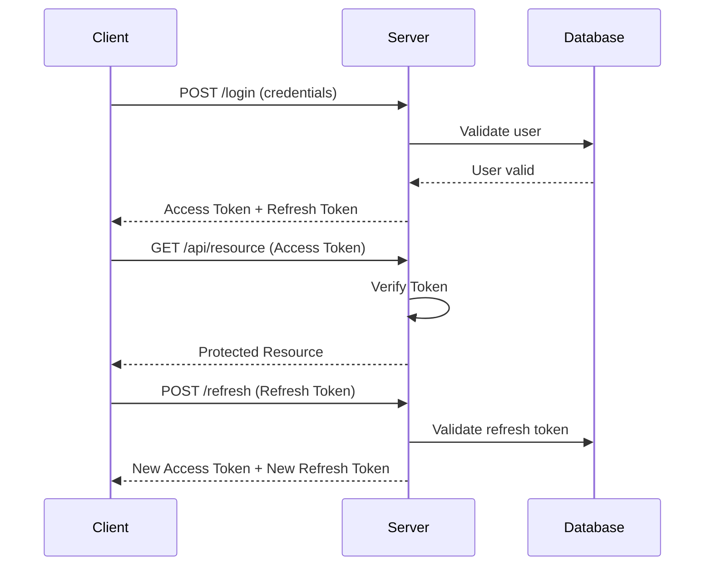
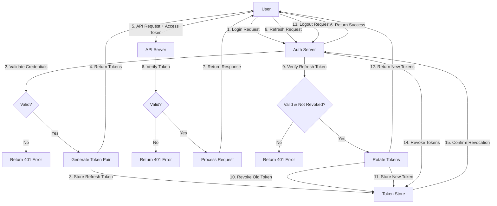

# How to Implement JWT Authentication with Bun

Author: [nawazdhandala](https://github.com/nawazdhandala)

Tags: Bun, JWT, Authentication, Security

Description: Learn how to implement secure JWT authentication with Bun runtime including token creation, verification, middleware, refresh tokens, and security best practices for production applications.

---

> Building authentication seemed simple until you realized the nuances of token management, secure storage, and proper revocation. With Bun's built-in performance and native TypeScript support, implementing JWT authentication becomes both fast and developer-friendly. This guide walks you through building a production-ready JWT authentication system.

Bun is a modern JavaScript runtime that excels at server-side applications. Its native support for TypeScript, fast startup times, and built-in testing make it an excellent choice for building authentication services. This guide covers everything from basic token operations to advanced patterns like refresh token rotation.

---

## What is JWT?

JSON Web Tokens (JWT) are a compact, URL-safe way to represent claims between two parties. A JWT consists of three parts separated by dots:

```
Header.Payload.Signature

eyJhbGciOiJIUzI1NiIsInR5cCI6IkpXVCJ9.
eyJzdWIiOiJ1c2VyMTIzIiwiZXhwIjoxNzA2NzQwODAwfQ.
K8qx2d5pXy9z1k3mN7jL0vWu4rF6hT8aB2cE5gI
```

- **Header**: Contains the algorithm (HS256, RS256) and token type
- **Payload**: Contains claims like user ID, expiration, and custom data
- **Signature**: Cryptographic signature that verifies the token was not tampered with

The following diagram illustrates how JWT authentication flows between client and server:



---

## Project Setup

First, initialize a new Bun project and install the required dependencies. We use jose for JWT operations and bcrypt for password hashing.

```bash
# Create a new project
mkdir bun-jwt-auth && cd bun-jwt-auth
bun init -y

# Install dependencies
bun add jose bcrypt
bun add -d @types/bcrypt
```

Create your project structure to keep the code organized:

```bash
mkdir -p src/{middleware,routes,utils,types}
```

---

## Configuration Setup

Create an environment configuration file that loads secrets from environment variables. Never hardcode secrets in your source code.

```typescript
// src/config.ts
// Application configuration loaded from environment variables

export const config = {
  // JWT secret must be at least 256 bits (32 characters) for HS256
  jwtSecret: process.env.JWT_SECRET,
  
  // Refresh token secret should be different from access token secret
  refreshSecret: process.env.REFRESH_SECRET,
  
  // Short-lived access tokens minimize damage from stolen tokens
  accessTokenExpiry: "15m",
  
  // Refresh tokens live longer but are rotated on each use
  refreshTokenExpiry: "7d",
  
  // Server port
  port: parseInt(process.env.PORT || "3000"),
};

// Validate required environment variables at startup
if (!config.jwtSecret || config.jwtSecret.length < 32) {
  throw new Error("JWT_SECRET must be set and at least 32 characters");
}

if (!config.refreshSecret || config.refreshSecret.length < 32) {
  throw new Error("REFRESH_SECRET must be set and at least 32 characters");
}
```

Create a `.env` file for local development. Generate secure secrets using cryptographic random generators.

```bash
# .env
# Generate these with: openssl rand -base64 32
JWT_SECRET=your-super-secret-jwt-key-at-least-32-chars
REFRESH_SECRET=your-super-secret-refresh-key-at-least-32-chars
PORT=3000
```

---

## Creating JWT Tokens

The jose library provides a clean API for creating and verifying JWTs. This module handles token generation with proper claims and expiration times.

```typescript
// src/utils/jwt.ts
// JWT token creation and verification utilities

import { SignJWT, jwtVerify, type JWTPayload } from "jose";
import { config } from "../config";

// Custom payload interface extending standard JWT claims
export interface TokenPayload extends JWTPayload {
  sub: string;       // User ID (subject claim)
  email: string;     // User email for convenience
  type: "access" | "refresh";  // Token type for validation
  jti: string;       // Unique token ID for revocation
}

// Convert secret strings to Uint8Array for jose library
const accessSecret = new TextEncoder().encode(config.jwtSecret);
const refreshSecret = new TextEncoder().encode(config.refreshSecret);

// Generate a unique token ID for tracking and revocation
function generateTokenId(): string {
  return crypto.randomUUID();
}

// Create a short-lived access token for API authentication
export async function createAccessToken(
  userId: string,
  email: string
): Promise<string> {
  const tokenId = generateTokenId();

  // Build and sign the JWT with all required claims
  const token = await new SignJWT({
    sub: userId,
    email: email,
    type: "access",
    jti: tokenId,
  })
    .setProtectedHeader({ alg: "HS256" })  // Algorithm in header
    .setIssuedAt()                          // Current timestamp
    .setExpirationTime(config.accessTokenExpiry)  // Short expiry
    .setIssuer("bun-auth-service")          // Identifies token source
    .setAudience("bun-api")                 // Intended recipient
    .sign(accessSecret);

  return token;
}

// Create a longer-lived refresh token for obtaining new access tokens
export async function createRefreshToken(
  userId: string,
  email: string
): Promise<{ token: string; tokenId: string }> {
  const tokenId = generateTokenId();

  const token = await new SignJWT({
    sub: userId,
    email: email,
    type: "refresh",
    jti: tokenId,
  })
    .setProtectedHeader({ alg: "HS256" })
    .setIssuedAt()
    .setExpirationTime(config.refreshTokenExpiry)  // Longer expiry
    .setIssuer("bun-auth-service")
    .setAudience("bun-api")
    .sign(refreshSecret);

  // Return both token and ID for database storage
  return { token, tokenId };
}

// Verify an access token and return its payload
export async function verifyAccessToken(
  token: string
): Promise<TokenPayload> {
  try {
    const { payload } = await jwtVerify(token, accessSecret, {
      issuer: "bun-auth-service",
      audience: "bun-api",
    });

    // Ensure this is an access token, not a refresh token
    if (payload.type !== "access") {
      throw new Error("Invalid token type");
    }

    return payload as TokenPayload;
  } catch (error) {
    throw new Error("Invalid or expired access token");
  }
}

// Verify a refresh token and return its payload
export async function verifyRefreshToken(
  token: string
): Promise<TokenPayload> {
  try {
    const { payload } = await jwtVerify(token, refreshSecret, {
      issuer: "bun-auth-service",
      audience: "bun-api",
    });

    // Ensure this is a refresh token, not an access token
    if (payload.type !== "refresh") {
      throw new Error("Invalid token type");
    }

    return payload as TokenPayload;
  } catch (error) {
    throw new Error("Invalid or expired refresh token");
  }
}
```

---

## Authentication Middleware

The middleware extracts tokens from requests, validates them, and attaches user information to the request context. This enables protected routes to access user data easily.

```typescript
// src/middleware/auth.ts
// Authentication middleware for protecting routes

import { verifyAccessToken, type TokenPayload } from "../utils/jwt";

// Extended request type with authenticated user
export interface AuthenticatedRequest extends Request {
  user?: TokenPayload;
}

// Response helper for JSON responses
function jsonResponse(data: object, status: number = 200): Response {
  return new Response(JSON.stringify(data), {
    status,
    headers: { "Content-Type": "application/json" },
  });
}

// Middleware function that validates JWT and attaches user to request
export async function authMiddleware(
  request: AuthenticatedRequest
): Promise<AuthenticatedRequest | Response> {
  // Extract Authorization header
  const authHeader = request.headers.get("Authorization");

  if (!authHeader) {
    return jsonResponse(
      { error: "Authorization header missing" },
      401
    );
  }

  // Validate Bearer token format
  if (!authHeader.startsWith("Bearer ")) {
    return jsonResponse(
      { error: "Invalid authorization format. Use: Bearer <token>" },
      401
    );
  }

  // Extract the token part
  const token = authHeader.substring(7);

  if (!token) {
    return jsonResponse({ error: "Token missing" }, 401);
  }

  try {
    // Verify token and extract payload
    const payload = await verifyAccessToken(token);

    // Attach user info to request for downstream handlers
    request.user = payload;

    return request;
  } catch (error) {
    return jsonResponse(
      { error: "Invalid or expired token" },
      401
    );
  }
}

// Higher-order function to wrap route handlers with authentication
export function withAuth(
  handler: (req: AuthenticatedRequest) => Promise<Response>
): (req: Request) => Promise<Response> {
  return async (request: Request): Promise<Response> => {
    // Run authentication middleware
    const result = await authMiddleware(request as AuthenticatedRequest);

    // If middleware returned a Response, it means auth failed
    if (result instanceof Response) {
      return result;
    }

    // Auth succeeded, call the actual handler
    return handler(result);
  };
}
```

---

## User Management and Password Hashing

This module handles user storage, password hashing with bcrypt, and credential validation. In production, replace the in-memory store with a proper database.

```typescript
// src/utils/users.ts
// User management with secure password hashing

import bcrypt from "bcrypt";

// User interface with hashed password
export interface User {
  id: string;
  email: string;
  passwordHash: string;
  createdAt: Date;
}

// In-memory user store (replace with database in production)
const users = new Map<string, User>();

// Cost factor for bcrypt (10-12 is recommended for production)
const SALT_ROUNDS = 10;

// Create a new user with hashed password
export async function createUser(
  email: string,
  password: string
): Promise<User> {
  // Check for existing user
  const existingUser = Array.from(users.values()).find(
    (u) => u.email === email
  );
  if (existingUser) {
    throw new Error("User already exists");
  }

  // Hash password with bcrypt (never store plain text passwords)
  const passwordHash = await bcrypt.hash(password, SALT_ROUNDS);

  const user: User = {
    id: crypto.randomUUID(),
    email,
    passwordHash,
    createdAt: new Date(),
  };

  users.set(user.id, user);
  return user;
}

// Validate user credentials and return user if valid
export async function validateCredentials(
  email: string,
  password: string
): Promise<User | null> {
  // Find user by email
  const user = Array.from(users.values()).find((u) => u.email === email);

  if (!user) {
    // Use constant-time comparison to prevent timing attacks
    // Hash a dummy password to maintain consistent timing
    await bcrypt.hash(password, SALT_ROUNDS);
    return null;
  }

  // Compare password with stored hash
  const isValid = await bcrypt.compare(password, user.passwordHash);

  return isValid ? user : null;
}

// Get user by ID
export function getUserById(id: string): User | undefined {
  return users.get(id);
}
```

---

## Refresh Token Storage and Rotation

Refresh token rotation is a critical security measure. When a refresh token is used, it is invalidated and a new one is issued. If an attacker steals a token, they can only use it once before the legitimate user's next refresh detects the theft.

```typescript
// src/utils/tokenStore.ts
// Refresh token storage with rotation and revocation support

// Stored refresh token metadata
interface StoredToken {
  tokenId: string;
  userId: string;
  familyId: string;      // Groups tokens from same login session
  deviceInfo: string;    // User-Agent for session management
  createdAt: Date;
  expiresAt: Date;
  revoked: boolean;
}

// In-memory token store (use Redis or database in production)
const refreshTokens = new Map<string, StoredToken>();

// Store a new refresh token
export function storeRefreshToken(
  tokenId: string,
  userId: string,
  familyId: string,
  deviceInfo: string,
  expiresInDays: number = 7
): void {
  const expiresAt = new Date();
  expiresAt.setDate(expiresAt.getDate() + expiresInDays);

  refreshTokens.set(tokenId, {
    tokenId,
    userId,
    familyId,
    deviceInfo,
    createdAt: new Date(),
    expiresAt,
    revoked: false,
  });
}

// Get stored token by ID
export function getStoredToken(tokenId: string): StoredToken | undefined {
  return refreshTokens.get(tokenId);
}

// Revoke a single token
export function revokeToken(tokenId: string): boolean {
  const token = refreshTokens.get(tokenId);
  if (token) {
    token.revoked = true;
    return true;
  }
  return false;
}

// Revoke all tokens in a family (for reuse detection)
export function revokeTokenFamily(familyId: string): void {
  for (const token of refreshTokens.values()) {
    if (token.familyId === familyId) {
      token.revoked = true;
    }
  }
}

// Revoke all tokens for a user (logout everywhere)
export function revokeAllUserTokens(userId: string): void {
  for (const token of refreshTokens.values()) {
    if (token.userId === userId) {
      token.revoked = true;
    }
  }
}

// Get all active sessions for a user
export function getUserSessions(userId: string): StoredToken[] {
  return Array.from(refreshTokens.values()).filter(
    (t) => t.userId === userId && !t.revoked && t.expiresAt > new Date()
  );
}

// Cleanup expired tokens (call periodically)
export function cleanupExpiredTokens(): number {
  const now = new Date();
  let removed = 0;

  for (const [tokenId, token] of refreshTokens.entries()) {
    if (token.expiresAt < now) {
      refreshTokens.delete(tokenId);
      removed++;
    }
  }

  return removed;
}
```

---

## Authentication Routes

These routes handle user registration, login, token refresh with rotation, and logout. Each endpoint includes proper error handling and security measures.

```typescript
// src/routes/auth.ts
// Authentication endpoints for login, refresh, and logout

import {
  createAccessToken,
  createRefreshToken,
  verifyRefreshToken,
} from "../utils/jwt";
import { createUser, validateCredentials } from "../utils/users";
import {
  storeRefreshToken,
  getStoredToken,
  revokeToken,
  revokeTokenFamily,
  revokeAllUserTokens,
  getUserSessions,
} from "../utils/tokenStore";
import { withAuth, type AuthenticatedRequest } from "../middleware/auth";

// Helper for JSON responses
function json(data: object, status: number = 200): Response {
  return new Response(JSON.stringify(data), {
    status,
    headers: { "Content-Type": "application/json" },
  });
}

// POST /auth/register - Create a new user account
export async function register(request: Request): Promise<Response> {
  try {
    const body = await request.json();
    const { email, password } = body;

    // Validate input
    if (!email || !password) {
      return json({ error: "Email and password required" }, 400);
    }

    // Validate password strength
    if (password.length < 8) {
      return json(
        { error: "Password must be at least 8 characters" },
        400
      );
    }

    // Create user with hashed password
    const user = await createUser(email, password);

    return json({
      message: "User created successfully",
      userId: user.id,
    }, 201);
  } catch (error) {
    if (error instanceof Error && error.message === "User already exists") {
      return json({ error: "Email already registered" }, 409);
    }
    return json({ error: "Registration failed" }, 500);
  }
}

// POST /auth/login - Authenticate and receive tokens
export async function login(request: Request): Promise<Response> {
  try {
    const body = await request.json();
    const { email, password } = body;

    // Validate input
    if (!email || !password) {
      return json({ error: "Email and password required" }, 400);
    }

    // Validate credentials
    const user = await validateCredentials(email, password);

    if (!user) {
      // Use generic error message to prevent user enumeration
      return json({ error: "Invalid credentials" }, 401);
    }

    // Generate token pair
    const accessToken = await createAccessToken(user.id, user.email);
    const { token: refreshToken, tokenId } = await createRefreshToken(
      user.id,
      user.email
    );

    // Create family ID for token rotation tracking
    const familyId = crypto.randomUUID();

    // Store refresh token metadata
    const deviceInfo = request.headers.get("User-Agent") || "Unknown";
    storeRefreshToken(tokenId, user.id, familyId, deviceInfo);

    return json({
      accessToken,
      refreshToken,
      tokenType: "Bearer",
      expiresIn: 900, // 15 minutes in seconds
    });
  } catch (error) {
    return json({ error: "Login failed" }, 500);
  }
}

// POST /auth/refresh - Exchange refresh token for new token pair
export async function refresh(request: Request): Promise<Response> {
  try {
    const body = await request.json();
    const { refreshToken } = body;

    if (!refreshToken) {
      return json({ error: "Refresh token required" }, 400);
    }

    // Verify the refresh token signature and claims
    const payload = await verifyRefreshToken(refreshToken);

    // Get stored token metadata
    const storedToken = getStoredToken(payload.jti as string);

    if (!storedToken) {
      return json({ error: "Refresh token not found" }, 401);
    }

    // Check if token was revoked (already used or explicitly revoked)
    if (storedToken.revoked) {
      // SECURITY: Token reuse detected - possible theft!
      // Revoke entire token family to force re-authentication
      revokeTokenFamily(storedToken.familyId);
      return json(
        { error: "Token reuse detected. All sessions revoked." },
        401
      );
    }

    // Mark old token as used (revoked)
    revokeToken(payload.jti as string);

    // Generate new token pair
    const newAccessToken = await createAccessToken(
      payload.sub as string,
      payload.email as string
    );
    const { token: newRefreshToken, tokenId: newTokenId } =
      await createRefreshToken(
        payload.sub as string,
        payload.email as string
      );

    // Store new refresh token in same family
    storeRefreshToken(
      newTokenId,
      payload.sub as string,
      storedToken.familyId,
      storedToken.deviceInfo
    );

    return json({
      accessToken: newAccessToken,
      refreshToken: newRefreshToken,
      tokenType: "Bearer",
      expiresIn: 900,
    });
  } catch (error) {
    return json({ error: "Invalid refresh token" }, 401);
  }
}

// POST /auth/logout - Revoke current refresh token
export const logout = withAuth(
  async (request: AuthenticatedRequest): Promise<Response> => {
    try {
      const body = await request.json();
      const { refreshToken } = body;

      if (refreshToken) {
        // Verify and revoke the provided refresh token
        const payload = await verifyRefreshToken(refreshToken);
        revokeToken(payload.jti as string);
      }

      return json({ message: "Logged out successfully" });
    } catch (error) {
      // Even if token validation fails, consider logout successful
      return json({ message: "Logged out" });
    }
  }
);

// POST /auth/logout-all - Revoke all user sessions
export const logoutAll = withAuth(
  async (request: AuthenticatedRequest): Promise<Response> => {
    if (!request.user) {
      return json({ error: "Unauthorized" }, 401);
    }

    revokeAllUserTokens(request.user.sub);

    return json({ message: "All sessions logged out" });
  }
);

// GET /auth/sessions - Get all active sessions for current user
export const sessions = withAuth(
  async (request: AuthenticatedRequest): Promise<Response> => {
    if (!request.user) {
      return json({ error: "Unauthorized" }, 401);
    }

    const userSessions = getUserSessions(request.user.sub);

    // Return sanitized session info (don't expose token IDs)
    const sessionInfo = userSessions.map((s) => ({
      deviceInfo: s.deviceInfo,
      createdAt: s.createdAt,
      expiresAt: s.expiresAt,
    }));

    return json({ sessions: sessionInfo });
  }
);
```

---

## Protected Routes Example

Here is how to create protected API endpoints that require authentication. The withAuth wrapper handles token validation automatically.

```typescript
// src/routes/protected.ts
// Example protected routes that require authentication

import { withAuth, type AuthenticatedRequest } from "../middleware/auth";

// Helper for JSON responses
function json(data: object, status: number = 200): Response {
  return new Response(JSON.stringify(data), {
    status,
    headers: { "Content-Type": "application/json" },
  });
}

// GET /api/profile - Get current user profile
export const getProfile = withAuth(
  async (request: AuthenticatedRequest): Promise<Response> => {
    // User info is available from the validated token
    const user = request.user!;

    return json({
      id: user.sub,
      email: user.email,
      tokenIssuedAt: user.iat,
      tokenExpiresAt: user.exp,
    });
  }
);

// GET /api/dashboard - Protected dashboard data
export const getDashboard = withAuth(
  async (request: AuthenticatedRequest): Promise<Response> => {
    const user = request.user!;

    // Fetch user-specific data (example)
    const dashboardData = {
      welcome: `Hello, ${user.email}!`,
      stats: {
        lastLogin: new Date().toISOString(),
        accountAge: "30 days",
      },
    };

    return json(dashboardData);
  }
);

// POST /api/settings - Update user settings
export const updateSettings = withAuth(
  async (request: AuthenticatedRequest): Promise<Response> => {
    const user = request.user!;

    try {
      const body = await request.json();

      // Validate and process settings update
      // In production, save to database

      return json({
        message: "Settings updated",
        userId: user.sub,
      });
    } catch (error) {
      return json({ error: "Invalid request body" }, 400);
    }
  }
);
```

---

## Main Server Application

The main server file ties everything together with proper routing and error handling. Bun's native HTTP server provides excellent performance.

```typescript
// src/server.ts
// Main Bun HTTP server with routing

import { config } from "./config";
import {
  register,
  login,
  refresh,
  logout,
  logoutAll,
  sessions,
} from "./routes/auth";
import { getProfile, getDashboard, updateSettings } from "./routes/protected";
import { cleanupExpiredTokens } from "./utils/tokenStore";

// Helper for JSON responses
function json(data: object, status: number = 200): Response {
  return new Response(JSON.stringify(data), {
    status,
    headers: { "Content-Type": "application/json" },
  });
}

// Simple router implementation
async function handleRequest(request: Request): Promise<Response> {
  const url = new URL(request.url);
  const path = url.pathname;
  const method = request.method;

  // Route matching
  try {
    // Authentication routes
    if (path === "/auth/register" && method === "POST") {
      return await register(request);
    }
    if (path === "/auth/login" && method === "POST") {
      return await login(request);
    }
    if (path === "/auth/refresh" && method === "POST") {
      return await refresh(request);
    }
    if (path === "/auth/logout" && method === "POST") {
      return await logout(request);
    }
    if (path === "/auth/logout-all" && method === "POST") {
      return await logoutAll(request);
    }
    if (path === "/auth/sessions" && method === "GET") {
      return await sessions(request);
    }

    // Protected routes
    if (path === "/api/profile" && method === "GET") {
      return await getProfile(request);
    }
    if (path === "/api/dashboard" && method === "GET") {
      return await getDashboard(request);
    }
    if (path === "/api/settings" && method === "POST") {
      return await updateSettings(request);
    }

    // Health check
    if (path === "/health" && method === "GET") {
      return json({ status: "healthy", timestamp: new Date().toISOString() });
    }

    // Not found
    return json({ error: "Not found" }, 404);
  } catch (error) {
    console.error("Request error:", error);
    return json({ error: "Internal server error" }, 500);
  }
}

// Start the server
const server = Bun.serve({
  port: config.port,
  fetch: handleRequest,
});

console.log(`Server running on http://localhost:${server.port}`);

// Cleanup expired tokens every hour
setInterval(() => {
  const removed = cleanupExpiredTokens();
  if (removed > 0) {
    console.log(`Cleaned up ${removed} expired tokens`);
  }
}, 60 * 60 * 1000);
```

---

## Secure Cookie Storage for Browsers

For browser-based applications, HTTP-only cookies are more secure than localStorage. JavaScript cannot access HTTP-only cookies, protecting tokens from XSS attacks.

```typescript
// src/utils/cookies.ts
// Secure cookie handling for browser authentication

// Cookie configuration for maximum security
const COOKIE_OPTIONS = {
  httpOnly: true,      // Not accessible via JavaScript
  secure: true,        // Only sent over HTTPS
  sameSite: "lax",     // CSRF protection
  path: "/",           // Available to all routes
};

// Set access token cookie
export function setAccessTokenCookie(token: string): string {
  const maxAge = 15 * 60; // 15 minutes in seconds
  return `access_token=${token}; Max-Age=${maxAge}; HttpOnly; Secure; SameSite=Lax; Path=/`;
}

// Set refresh token cookie (restricted to refresh endpoint)
export function setRefreshTokenCookie(token: string): string {
  const maxAge = 7 * 24 * 60 * 60; // 7 days in seconds
  return `refresh_token=${token}; Max-Age=${maxAge}; HttpOnly; Secure; SameSite=Lax; Path=/auth/refresh`;
}

// Clear auth cookies for logout
export function clearAuthCookies(): string[] {
  return [
    "access_token=; Max-Age=0; HttpOnly; Secure; SameSite=Lax; Path=/",
    "refresh_token=; Max-Age=0; HttpOnly; Secure; SameSite=Lax; Path=/auth/refresh",
  ];
}

// Parse cookies from request header
export function parseCookies(cookieHeader: string | null): Map<string, string> {
  const cookies = new Map<string, string>();

  if (!cookieHeader) {
    return cookies;
  }

  const pairs = cookieHeader.split(";");
  for (const pair of pairs) {
    const [name, value] = pair.trim().split("=");
    if (name && value) {
      cookies.set(name, value);
    }
  }

  return cookies;
}

// Cookie-based login response
export async function loginWithCookies(
  request: Request,
  accessToken: string,
  refreshToken: string
): Promise<Response> {
  const response = new Response(
    JSON.stringify({ message: "Logged in successfully" }),
    {
      status: 200,
      headers: {
        "Content-Type": "application/json",
        "Set-Cookie": setAccessTokenCookie(accessToken),
      },
    }
  );

  // Add second cookie (refresh token)
  response.headers.append("Set-Cookie", setRefreshTokenCookie(refreshToken));

  return response;
}
```

---

## Access Token Blacklisting

For immediate token revocation (security incidents, password changes), maintain a blacklist of revoked token IDs. The blacklist automatically expires entries to prevent memory growth.

```typescript
// src/utils/blacklist.ts
// In-memory blacklist for immediate access token revocation

interface BlacklistEntry {
  jti: string;
  expiresAt: number; // Unix timestamp
}

// In-memory blacklist (use Redis in production)
const blacklist = new Map<string, BlacklistEntry>();

// Add token to blacklist
export function blacklistToken(jti: string, expiresAt: number): void {
  blacklist.set(jti, { jti, expiresAt });
}

// Check if token is blacklisted
export function isTokenBlacklisted(jti: string): boolean {
  const entry = blacklist.get(jti);

  if (!entry) {
    return false;
  }

  // Token expired naturally, remove from blacklist
  if (entry.expiresAt < Date.now() / 1000) {
    blacklist.delete(jti);
    return false;
  }

  return true;
}

// Cleanup expired entries (call periodically)
export function cleanupBlacklist(): number {
  const now = Date.now() / 1000;
  let removed = 0;

  for (const [jti, entry] of blacklist.entries()) {
    if (entry.expiresAt < now) {
      blacklist.delete(jti);
      removed++;
    }
  }

  return removed;
}

// Get blacklist size for monitoring
export function getBlacklistSize(): number {
  return blacklist.size;
}
```

---

## Rate Limiting

Rate limiting protects authentication endpoints from brute force attacks. This implementation uses a sliding window approach with configurable limits.

```typescript
// src/middleware/rateLimit.ts
// Rate limiting middleware to prevent brute force attacks

interface RateLimitEntry {
  count: number;
  resetTime: number;
}

// In-memory rate limit store (use Redis for distributed systems)
const rateLimits = new Map<string, RateLimitEntry>();

// Rate limit configuration
const RATE_LIMITS = {
  login: { maxRequests: 5, windowMs: 60000 },    // 5 attempts per minute
  refresh: { maxRequests: 10, windowMs: 60000 }, // 10 refreshes per minute
  register: { maxRequests: 3, windowMs: 60000 }, // 3 registrations per minute
};

// Get client identifier (IP address)
function getClientId(request: Request): string {
  // Check forwarded headers for proxy scenarios
  const forwarded = request.headers.get("X-Forwarded-For");
  if (forwarded) {
    return forwarded.split(",")[0].trim();
  }
  
  // Fallback to a default (in production, get actual client IP)
  return request.headers.get("X-Real-IP") || "unknown";
}

// Rate limit check middleware
export function checkRateLimit(
  request: Request,
  endpoint: keyof typeof RATE_LIMITS
): { allowed: boolean; retryAfter?: number } {
  const clientId = getClientId(request);
  const key = `${endpoint}:${clientId}`;
  const limit = RATE_LIMITS[endpoint];
  const now = Date.now();

  const entry = rateLimits.get(key);

  // No existing entry or window expired
  if (!entry || entry.resetTime < now) {
    rateLimits.set(key, {
      count: 1,
      resetTime: now + limit.windowMs,
    });
    return { allowed: true };
  }

  // Within window, check count
  if (entry.count >= limit.maxRequests) {
    const retryAfter = Math.ceil((entry.resetTime - now) / 1000);
    return { allowed: false, retryAfter };
  }

  // Increment count
  entry.count++;
  return { allowed: true };
}

// Rate limit wrapper for route handlers
export function withRateLimit(
  endpoint: keyof typeof RATE_LIMITS,
  handler: (req: Request) => Promise<Response>
): (req: Request) => Promise<Response> {
  return async (request: Request): Promise<Response> => {
    const { allowed, retryAfter } = checkRateLimit(request, endpoint);

    if (!allowed) {
      return new Response(
        JSON.stringify({
          error: "Too many requests",
          retryAfter,
        }),
        {
          status: 429,
          headers: {
            "Content-Type": "application/json",
            "Retry-After": String(retryAfter),
          },
        }
      );
    }

    return handler(request);
  };
}

// Cleanup old entries periodically
export function cleanupRateLimits(): void {
  const now = Date.now();
  for (const [key, entry] of rateLimits.entries()) {
    if (entry.resetTime < now) {
      rateLimits.delete(key);
    }
  }
}
```

---

## Testing JWT Authentication

Bun's built-in test runner makes testing JWT authentication straightforward. These tests cover token creation, verification, and authentication flow.

```typescript
// src/tests/jwt.test.ts
// Unit tests for JWT authentication

import { describe, test, expect, beforeAll } from "bun:test";
import {
  createAccessToken,
  createRefreshToken,
  verifyAccessToken,
  verifyRefreshToken,
} from "../utils/jwt";

describe("JWT Token Operations", () => {
  const testUserId = "user-123";
  const testEmail = "test@example.com";

  test("creates valid access token", async () => {
    const token = await createAccessToken(testUserId, testEmail);

    expect(token).toBeDefined();
    expect(typeof token).toBe("string");
    expect(token.split(".")).toHaveLength(3); // Header.Payload.Signature
  });

  test("verifies valid access token", async () => {
    const token = await createAccessToken(testUserId, testEmail);
    const payload = await verifyAccessToken(token);

    expect(payload.sub).toBe(testUserId);
    expect(payload.email).toBe(testEmail);
    expect(payload.type).toBe("access");
    expect(payload.jti).toBeDefined();
  });

  test("rejects invalid access token", async () => {
    const invalidToken = "invalid.token.here";

    expect(verifyAccessToken(invalidToken)).rejects.toThrow();
  });

  test("rejects refresh token as access token", async () => {
    const { token } = await createRefreshToken(testUserId, testEmail);

    expect(verifyAccessToken(token)).rejects.toThrow();
  });

  test("creates valid refresh token", async () => {
    const { token, tokenId } = await createRefreshToken(testUserId, testEmail);

    expect(token).toBeDefined();
    expect(tokenId).toBeDefined();
  });

  test("verifies valid refresh token", async () => {
    const { token } = await createRefreshToken(testUserId, testEmail);
    const payload = await verifyRefreshToken(token);

    expect(payload.sub).toBe(testUserId);
    expect(payload.type).toBe("refresh");
  });
});

describe("Token Expiration", () => {
  test("access token includes expiration claim", async () => {
    const token = await createAccessToken("user-1", "test@test.com");
    const payload = await verifyAccessToken(token);

    expect(payload.exp).toBeDefined();
    expect(payload.iat).toBeDefined();
    expect(payload.exp! > payload.iat!).toBe(true);
  });
});
```

Run tests with:

```bash
bun test
```

---

## Authentication Flow Diagram

The following diagram shows the complete authentication flow including login, token refresh, and logout:



---

## Best Practices Summary

### Token Management

1. **Use short-lived access tokens** (15-30 minutes maximum)
2. **Implement refresh token rotation** to detect theft
3. **Store token metadata in database** for revocation tracking
4. **Use separate secrets** for access and refresh tokens
5. **Include unique token IDs (jti)** for revocation capability

### Security Measures

1. **Hash passwords with bcrypt** using cost factor 10-12
2. **Use HTTPS in production** to protect tokens in transit
3. **Implement rate limiting** on authentication endpoints
4. **Use HTTP-only cookies** for browser applications
5. **Validate all token claims** including type, issuer, and audience

### Error Handling

1. **Use generic error messages** to prevent user enumeration
2. **Log authentication failures** for security monitoring
3. **Implement account lockout** after repeated failures
4. **Return appropriate HTTP status codes** (401, 403, 429)

### Production Considerations

1. **Use Redis** for token storage and blacklisting
2. **Implement token encryption at rest** for sensitive environments
3. **Monitor authentication metrics** (login success/failure rates)
4. **Set up alerts** for unusual authentication patterns
5. **Rotate JWT secrets periodically** with zero-downtime deployment

---

## Common Mistakes to Avoid

### Long-Lived Access Tokens

```typescript
// BAD: Access tokens that last for days
const accessExpiry = "30d";

// GOOD: Short-lived access tokens
const accessExpiry = "15m";
```

### No Token Type Validation

```typescript
// BAD: Accept any valid token
const payload = await verifyAccessToken(token);

// GOOD: Validate token type
if (payload.type !== "access") {
  throw new Error("Invalid token type");
}
```

### Hardcoded Secrets

```typescript
// BAD: Secret in source code
const secret = "my-secret-key-123";

// GOOD: Secret from environment
const secret = process.env.JWT_SECRET;
```

### No Revocation Mechanism

```typescript
// BAD: No way to invalidate tokens
async function logout() {
  return { message: "Logged out" };
}

// GOOD: Revoke refresh token on logout
async function logout(refreshToken: string) {
  const payload = await verifyRefreshToken(refreshToken);
  revokeToken(payload.jti);
  return { message: "Logged out" };
}
```

---

## Conclusion

Building secure JWT authentication with Bun requires attention to several critical areas:

- **Token lifecycle management** with short-lived access tokens and rotated refresh tokens
- **Secure storage** using HTTP-only cookies for browsers and validating token types
- **Revocation mechanisms** through database-backed token stores and blacklists
- **Rate limiting** to prevent brute force attacks
- **Proper error handling** that does not leak sensitive information

With Bun's excellent performance and native TypeScript support, implementing these security measures is straightforward. The patterns shown in this guide provide a solid foundation for production-ready authentication systems. Remember to use a proper database like PostgreSQL for user data and Redis for token storage in production environments.

---

*Need to monitor your authentication system? [OneUptime](https://oneuptime.com) provides comprehensive observability for tracking authentication failures, suspicious activity patterns, and token-related issues across your infrastructure.*

**Related Reading:**
- [How to Handle JWT Authentication Securely in Python](https://oneuptime.com/blog/post/python-jwt-authentication)
- [How to Build WebSocket Servers with Bun](https://oneuptime.com/blog/post/bun-websocket-servers)
