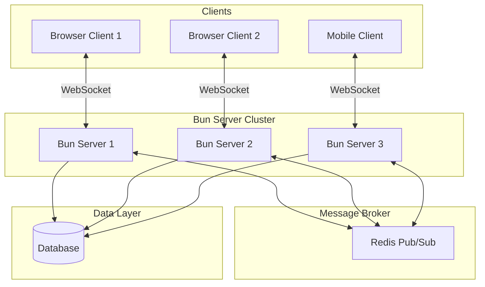
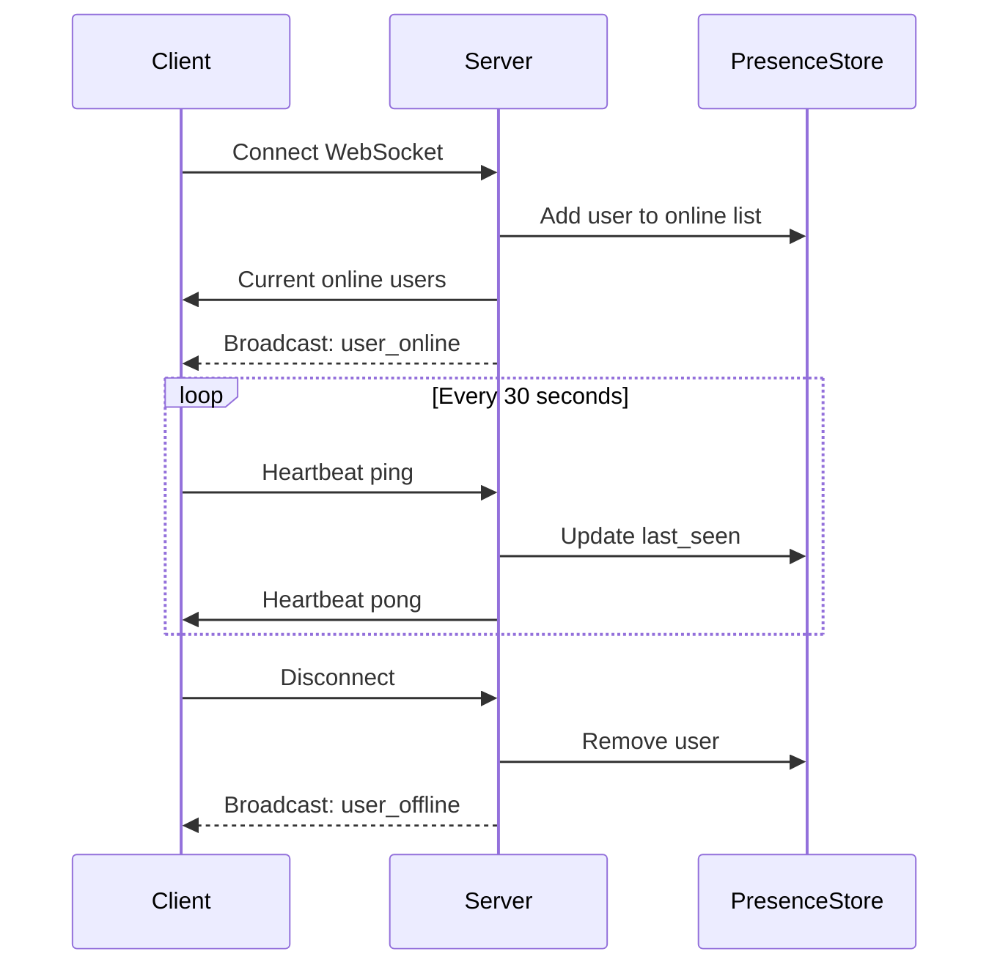
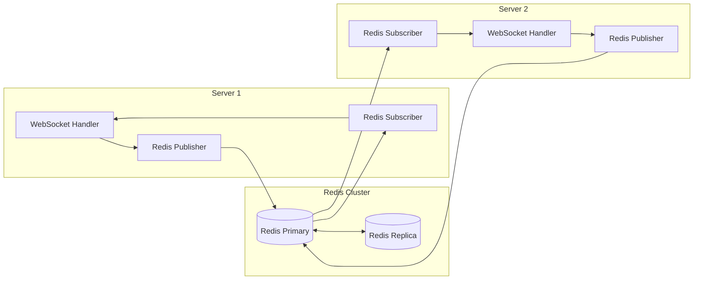
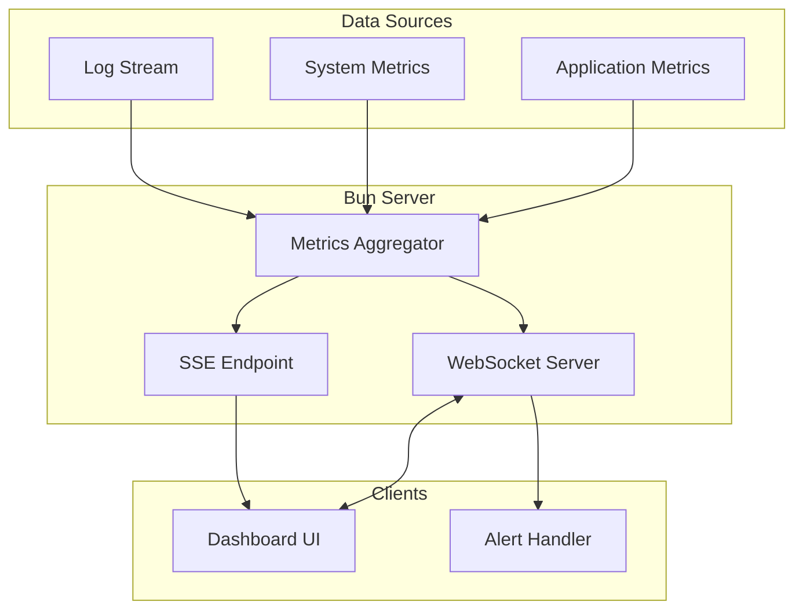

# How to Build Real-time Applications with Bun

Author: [nawazdhandala](https://github.com/nawazdhandala)

Tags: Bun, WebSocket, Real-time, Pub/Sub

Description: Learn how to build scalable real-time applications using Bun's native WebSocket support, pub/sub patterns, Server-Sent Events, and Redis for horizontal scaling.

---

Real-time applications have become essential in modern web development. From chat applications and live dashboards to collaborative editors and gaming platforms, users expect instant updates without refreshing their browsers. Bun, the fast all-in-one JavaScript runtime, provides first-class support for building real-time applications with its native WebSocket implementation and impressive performance characteristics.

In this comprehensive guide, we will explore how to build production-ready real-time applications using Bun. We will cover WebSocket fundamentals, pub/sub patterns, Server-Sent Events, presence detection, and scaling strategies with Redis.

## Why Bun for Real-time Applications?

Bun offers several advantages for real-time applications:

- **Native WebSocket support**: Built directly into the runtime, not requiring external dependencies
- **Exceptional performance**: Handles thousands of concurrent connections efficiently
- **Low memory footprint**: Uses less memory compared to Node.js for similar workloads
- **Built-in TypeScript support**: No transpilation step needed
- **Fast startup times**: Critical for serverless and edge deployments

## Understanding the Architecture

Before diving into code, let us understand the typical architecture of a real-time application built with Bun.



## WebSocket Basics with Bun

Bun provides a native WebSocket API that integrates seamlessly with its HTTP server. Let us start with a basic WebSocket server.

This example creates a simple WebSocket server that echoes messages back to clients and tracks connection lifecycle events.

```typescript
// server.ts - Basic WebSocket server with Bun
const server = Bun.serve({
  port: 3000,
  
  // Handle regular HTTP requests
  fetch(request, server) {
    const url = new URL(request.url);
    
    // Upgrade HTTP connection to WebSocket
    if (url.pathname === "/ws") {
      const upgraded = server.upgrade(request, {
        // Attach custom data to the WebSocket connection
        data: {
          connectedAt: Date.now(),
          userId: crypto.randomUUID(),
        },
      });
      
      if (upgraded) {
        return; // Bun handles the response
      }
      
      return new Response("WebSocket upgrade failed", { status: 400 });
    }
    
    return new Response("Real-time Server Running");
  },
  
  // WebSocket event handlers
  websocket: {
    // Called when a connection is opened
    open(ws) {
      console.log(`Client connected: ${ws.data.userId}`);
    },
    
    // Called when a message is received
    message(ws, message) {
      console.log(`Received from ${ws.data.userId}: ${message}`);
      
      // Echo the message back
      ws.send(`Echo: ${message}`);
    },
    
    // Called when a connection is closed
    close(ws, code, reason) {
      console.log(`Client disconnected: ${ws.data.userId}`);
    },
    
    // Called when there is an error
    error(ws, error) {
      console.error(`WebSocket error: ${error.message}`);
    },
  },
});

console.log(`Server running at http://localhost:${server.port}`);
```

## Implementing Rooms and Channels

Most real-time applications require the concept of rooms or channels where users can subscribe to specific topics. Bun provides built-in pub/sub functionality through WebSocket subscriptions.

This implementation shows how to create a room system where users can join, leave, and send messages to specific rooms.

```typescript
// rooms.ts - Room-based messaging system
interface RoomData {
  userId: string;
  username: string;
  rooms: Set<string>;
}

const server = Bun.serve({
  port: 3000,
  
  fetch(request, server) {
    const url = new URL(request.url);
    
    if (url.pathname === "/ws") {
      const username = url.searchParams.get("username") || "Anonymous";
      
      const upgraded = server.upgrade(request, {
        data: {
          userId: crypto.randomUUID(),
          username,
          rooms: new Set<string>(),
        } as RoomData,
      });
      
      return upgraded
        ? undefined
        : new Response("Upgrade failed", { status: 400 });
    }
    
    return new Response("WebSocket Room Server");
  },
  
  websocket: {
    open(ws) {
      // Subscribe to a personal channel for direct messages
      ws.subscribe(`user:${ws.data.userId}`);
      console.log(`${ws.data.username} connected`);
    },
    
    message(ws, message) {
      try {
        const data = JSON.parse(message.toString());
        
        switch (data.type) {
          case "join_room":
            handleJoinRoom(ws, data.room);
            break;
            
          case "leave_room":
            handleLeaveRoom(ws, data.room);
            break;
            
          case "room_message":
            handleRoomMessage(ws, data.room, data.content);
            break;
            
          case "broadcast":
            handleBroadcast(ws, data.content);
            break;
        }
      } catch (error) {
        ws.send(JSON.stringify({ type: "error", message: "Invalid JSON" }));
      }
    },
    
    close(ws) {
      // Clean up subscriptions when client disconnects
      ws.data.rooms.forEach((room) => {
        ws.unsubscribe(`room:${room}`);
        ws.publish(`room:${room}`, JSON.stringify({
          type: "user_left",
          userId: ws.data.userId,
          username: ws.data.username,
          room,
        }));
      });
    },
  },
});

// Join a room and notify other members
function handleJoinRoom(ws: any, room: string) {
  ws.subscribe(`room:${room}`);
  ws.data.rooms.add(room);
  
  // Notify everyone in the room
  ws.publish(`room:${room}`, JSON.stringify({
    type: "user_joined",
    userId: ws.data.userId,
    username: ws.data.username,
    room,
  }));
  
  // Confirm to the user
  ws.send(JSON.stringify({
    type: "joined_room",
    room,
  }));
}

// Leave a room and notify other members
function handleLeaveRoom(ws: any, room: string) {
  ws.unsubscribe(`room:${room}`);
  ws.data.rooms.delete(room);
  
  ws.publish(`room:${room}`, JSON.stringify({
    type: "user_left",
    userId: ws.data.userId,
    username: ws.data.username,
    room,
  }));
  
  ws.send(JSON.stringify({
    type: "left_room",
    room,
  }));
}

// Send a message to a specific room
function handleRoomMessage(ws: any, room: string, content: string) {
  if (!ws.data.rooms.has(room)) {
    ws.send(JSON.stringify({
      type: "error",
      message: "You must join the room first",
    }));
    return;
  }
  
  ws.publish(`room:${room}`, JSON.stringify({
    type: "room_message",
    userId: ws.data.userId,
    username: ws.data.username,
    room,
    content,
    timestamp: Date.now(),
  }));
}

// Broadcast to all connected clients
function handleBroadcast(ws: any, content: string) {
  server.publish("broadcast", JSON.stringify({
    type: "broadcast",
    userId: ws.data.userId,
    username: ws.data.username,
    content,
    timestamp: Date.now(),
  }));
}
```

## Presence Detection

Presence detection allows users to see who is online and what they are doing. This is crucial for collaborative applications.



This presence system tracks online users, their status, and handles heartbeat pings to detect stale connections.

```typescript
// presence.ts - User presence detection system
interface UserPresence {
  userId: string;
  username: string;
  status: "online" | "away" | "busy";
  lastSeen: number;
  customData?: Record<string, any>;
}

// In-memory presence store (use Redis in production)
const presenceStore = new Map<string, UserPresence>();

// Clean up stale connections every 60 seconds
const PRESENCE_TIMEOUT = 60000;
const HEARTBEAT_INTERVAL = 30000;

setInterval(() => {
  const now = Date.now();
  const staleUsers: string[] = [];
  
  presenceStore.forEach((presence, odUserId) => {
    if (now - presence.lastSeen > PRESENCE_TIMEOUT) {
      staleUsers.push(userId);
    }
  });
  
  staleUsers.forEach((userId) => {
    presenceStore.delete(userId);
    server.publish("presence", JSON.stringify({
      type: "user_offline",
      userId,
    }));
  });
}, PRESENCE_TIMEOUT);

const server = Bun.serve({
  port: 3000,
  
  fetch(request, server) {
    const url = new URL(request.url);
    
    if (url.pathname === "/ws") {
      const username = url.searchParams.get("username") || "Anonymous";
      const userId = crypto.randomUUID();
      
      server.upgrade(request, {
        data: { userId, username },
      });
      
      return;
    }
    
    // REST endpoint for getting all online users
    if (url.pathname === "/api/presence") {
      return new Response(
        JSON.stringify(Array.from(presenceStore.values())),
        { headers: { "Content-Type": "application/json" } }
      );
    }
    
    return new Response("Presence Server");
  },
  
  websocket: {
    open(ws) {
      const presence: UserPresence = {
        userId: ws.data.userId,
        username: ws.data.username,
        status: "online",
        lastSeen: Date.now(),
      };
      
      presenceStore.set(ws.data.userId, presence);
      ws.subscribe("presence");
      
      // Send current presence list to the new user
      ws.send(JSON.stringify({
        type: "presence_list",
        users: Array.from(presenceStore.values()),
      }));
      
      // Notify others about the new user
      ws.publish("presence", JSON.stringify({
        type: "user_online",
        user: presence,
      }));
    },
    
    message(ws, message) {
      const data = JSON.parse(message.toString());
      
      switch (data.type) {
        case "heartbeat":
          handleHeartbeat(ws);
          break;
          
        case "status_change":
          handleStatusChange(ws, data.status);
          break;
          
        case "presence_update":
          handlePresenceUpdate(ws, data.customData);
          break;
      }
    },
    
    close(ws) {
      presenceStore.delete(ws.data.userId);
      
      ws.publish("presence", JSON.stringify({
        type: "user_offline",
        userId: ws.data.userId,
      }));
    },
  },
});

function handleHeartbeat(ws: any) {
  const presence = presenceStore.get(ws.data.userId);
  if (presence) {
    presence.lastSeen = Date.now();
    ws.send(JSON.stringify({ type: "heartbeat_ack" }));
  }
}

function handleStatusChange(ws: any, status: UserPresence["status"]) {
  const presence = presenceStore.get(ws.data.userId);
  if (presence) {
    presence.status = status;
    presence.lastSeen = Date.now();
    
    ws.publish("presence", JSON.stringify({
      type: "status_changed",
      userId: ws.data.userId,
      status,
    }));
  }
}

function handlePresenceUpdate(ws: any, customData: Record<string, any>) {
  const presence = presenceStore.get(ws.data.userId);
  if (presence) {
    presence.customData = customData;
    presence.lastSeen = Date.now();
    
    ws.publish("presence", JSON.stringify({
      type: "presence_updated",
      userId: ws.data.userId,
      customData,
    }));
  }
}
```

## Server-Sent Events (SSE)

While WebSockets provide bidirectional communication, Server-Sent Events are perfect for scenarios where you only need server-to-client updates. SSE is simpler to implement and works better with HTTP/2.

This example demonstrates a real-time metrics feed using SSE for one-way server-to-client communication.

```typescript
// sse.ts - Server-Sent Events implementation
const server = Bun.serve({
  port: 3000,
  
  fetch(request) {
    const url = new URL(request.url);
    
    if (url.pathname === "/events") {
      return handleSSE(request);
    }
    
    if (url.pathname === "/metrics") {
      return handleMetricsStream(request);
    }
    
    return new Response("SSE Server");
  },
});

// Basic SSE endpoint
function handleSSE(request: Request): Response {
  const encoder = new TextEncoder();
  
  const stream = new ReadableStream({
    start(controller) {
      // Send initial connection event
      controller.enqueue(
        encoder.encode(`event: connected\ndata: {"status": "connected"}\n\n`)
      );
      
      // Send periodic updates
      const interval = setInterval(() => {
        const data = {
          timestamp: Date.now(),
          message: "Server heartbeat",
        };
        
        controller.enqueue(
          encoder.encode(`event: heartbeat\ndata: ${JSON.stringify(data)}\n\n`)
        );
      }, 5000);
      
      // Clean up on close
      request.signal.addEventListener("abort", () => {
        clearInterval(interval);
        controller.close();
      });
    },
  });
  
  return new Response(stream, {
    headers: {
      "Content-Type": "text/event-stream",
      "Cache-Control": "no-cache",
      "Connection": "keep-alive",
    },
  });
}

// Metrics streaming endpoint for dashboards
function handleMetricsStream(request: Request): Response {
  const encoder = new TextEncoder();
  
  const stream = new ReadableStream({
    start(controller) {
      const sendMetrics = () => {
        const metrics = {
          cpu: Math.random() * 100,
          memory: Math.random() * 100,
          requests: Math.floor(Math.random() * 1000),
          latency: Math.random() * 200,
          timestamp: Date.now(),
        };
        
        controller.enqueue(
          encoder.encode(`data: ${JSON.stringify(metrics)}\n\n`)
        );
      };
      
      // Send metrics every second
      const interval = setInterval(sendMetrics, 1000);
      sendMetrics(); // Send immediately
      
      request.signal.addEventListener("abort", () => {
        clearInterval(interval);
        controller.close();
      });
    },
  });
  
  return new Response(stream, {
    headers: {
      "Content-Type": "text/event-stream",
      "Cache-Control": "no-cache",
    },
  });
}

console.log(`SSE Server running at http://localhost:${server.port}`);
```

## Scaling with Redis

For production deployments with multiple server instances, you need a message broker to coordinate between servers. Redis pub/sub is the most common choice.



This Redis adapter enables horizontal scaling by broadcasting messages across multiple server instances.

```typescript
// redis-adapter.ts - Redis-based scaling for WebSocket servers
import { createClient } from "redis";

// Redis clients for pub/sub
const publisher = createClient({ url: process.env.REDIS_URL });
const subscriber = createClient({ url: process.env.REDIS_URL });

await publisher.connect();
await subscriber.connect();

// Track local WebSocket connections
const localConnections = new Map<string, any>();

// Subscribe to Redis channels for cross-server messaging
await subscriber.subscribe("ws:broadcast", (message) => {
  const data = JSON.parse(message);
  
  // Broadcast to all local connections
  localConnections.forEach((ws) => {
    ws.send(message);
  });
});

await subscriber.pSubscribe("ws:room:*", (message, channel) => {
  const room = channel.replace("ws:room:", "");
  const data = JSON.parse(message);
  
  // Send to local connections in this room
  localConnections.forEach((ws) => {
    if (ws.data.rooms?.has(room)) {
      ws.send(message);
    }
  });
});

await subscriber.pSubscribe("ws:user:*", (message, channel) => {
  const targetUserId = channel.replace("ws:user:", "");
  const ws = localConnections.get(targetUserId);
  
  if (ws) {
    ws.send(message);
  }
});

const server = Bun.serve({
  port: 3000,
  
  fetch(request, server) {
    const url = new URL(request.url);
    
    if (url.pathname === "/ws") {
      const userId = crypto.randomUUID();
      
      server.upgrade(request, {
        data: {
          userId,
          rooms: new Set<string>(),
        },
      });
      
      return;
    }
    
    return new Response("Redis-Scaled WebSocket Server");
  },
  
  websocket: {
    open(ws) {
      localConnections.set(ws.data.userId, ws);
      console.log(`Connected: ${ws.data.userId} (${localConnections.size} total)`);
    },
    
    async message(ws, message) {
      const data = JSON.parse(message.toString());
      
      switch (data.type) {
        case "broadcast":
          // Publish to Redis for all servers
          await publisher.publish(
            "ws:broadcast",
            JSON.stringify({
              type: "broadcast",
              userId: ws.data.userId,
              content: data.content,
              timestamp: Date.now(),
            })
          );
          break;
          
        case "room_message":
          await publisher.publish(
            `ws:room:${data.room}`,
            JSON.stringify({
              type: "room_message",
              userId: ws.data.userId,
              room: data.room,
              content: data.content,
              timestamp: Date.now(),
            })
          );
          break;
          
        case "direct_message":
          await publisher.publish(
            `ws:user:${data.targetUserId}`,
            JSON.stringify({
              type: "direct_message",
              fromUserId: ws.data.userId,
              content: data.content,
              timestamp: Date.now(),
            })
          );
          break;
          
        case "join_room":
          ws.data.rooms.add(data.room);
          ws.send(JSON.stringify({ type: "joined_room", room: data.room }));
          break;
          
        case "leave_room":
          ws.data.rooms.delete(data.room);
          ws.send(JSON.stringify({ type: "left_room", room: data.room }));
          break;
      }
    },
    
    close(ws) {
      localConnections.delete(ws.data.userId);
      console.log(`Disconnected: ${ws.data.userId}`);
    },
  },
});

console.log(`Server running on port ${server.port}`);
```

## Building a Real-time Dashboard

Let us put everything together and build a complete real-time monitoring dashboard that displays live metrics.



This complete dashboard server implementation includes metrics collection, WebSocket updates, historical data storage, and alert broadcasting.

```typescript
// dashboard.ts - Complete real-time dashboard server
interface Metrics {
  cpu: number;
  memory: number;
  disk: number;
  network: { in: number; out: number };
  requests: number;
  errors: number;
  latencyP50: number;
  latencyP95: number;
  latencyP99: number;
  timestamp: number;
}

interface Alert {
  id: string;
  type: "warning" | "critical";
  metric: string;
  value: number;
  threshold: number;
  message: string;
  timestamp: number;
}

// Store for metrics history (use time-series DB in production)
const metricsHistory: Metrics[] = [];
const MAX_HISTORY = 1000;

// Active alerts
const activeAlerts = new Map<string, Alert>();

// Alert thresholds
const THRESHOLDS = {
  cpu: { warning: 70, critical: 90 },
  memory: { warning: 80, critical: 95 },
  latencyP99: { warning: 500, critical: 1000 },
  errors: { warning: 10, critical: 50 },
};

// Simulate metrics collection
function collectMetrics(): Metrics {
  return {
    cpu: Math.random() * 100,
    memory: 40 + Math.random() * 50,
    disk: 30 + Math.random() * 40,
    network: {
      in: Math.floor(Math.random() * 1000000),
      out: Math.floor(Math.random() * 500000),
    },
    requests: Math.floor(Math.random() * 5000),
    errors: Math.floor(Math.random() * 20),
    latencyP50: 20 + Math.random() * 80,
    latencyP95: 100 + Math.random() * 200,
    latencyP99: 200 + Math.random() * 400,
    timestamp: Date.now(),
  };
}

// Check metrics against thresholds and generate alerts
function checkThresholds(metrics: Metrics): Alert[] {
  const alerts: Alert[] = [];
  
  const checkMetric = (name: string, value: number, thresholds: { warning: number; critical: number }) => {
    const alertId = `${name}-alert`;
    
    if (value >= thresholds.critical) {
      alerts.push({
        id: alertId,
        type: "critical",
        metric: name,
        value,
        threshold: thresholds.critical,
        message: `${name} is critically high: ${value.toFixed(2)}`,
        timestamp: Date.now(),
      });
    } else if (value >= thresholds.warning) {
      alerts.push({
        id: alertId,
        type: "warning",
        metric: name,
        value,
        threshold: thresholds.warning,
        message: `${name} is elevated: ${value.toFixed(2)}`,
        timestamp: Date.now(),
      });
    } else {
      // Clear alert if metric is back to normal
      activeAlerts.delete(alertId);
    }
  };
  
  checkMetric("cpu", metrics.cpu, THRESHOLDS.cpu);
  checkMetric("memory", metrics.memory, THRESHOLDS.memory);
  checkMetric("latencyP99", metrics.latencyP99, THRESHOLDS.latencyP99);
  checkMetric("errors", metrics.errors, THRESHOLDS.errors);
  
  return alerts;
}

const server = Bun.serve({
  port: 3000,
  
  fetch(request, server) {
    const url = new URL(request.url);
    
    switch (url.pathname) {
      case "/ws":
        return server.upgrade(request, {
          data: { subscribedMetrics: true },
        })
          ? undefined
          : new Response("Upgrade failed", { status: 400 });
        
      case "/api/metrics/history":
        return new Response(JSON.stringify(metricsHistory.slice(-100)), {
          headers: { "Content-Type": "application/json" },
        });
        
      case "/api/alerts":
        return new Response(
          JSON.stringify(Array.from(activeAlerts.values())),
          { headers: { "Content-Type": "application/json" } }
        );
        
      case "/events/metrics":
        return handleMetricsSSE(request);
        
      default:
        return new Response("Dashboard API Server");
    }
  },
  
  websocket: {
    open(ws) {
      ws.subscribe("metrics");
      ws.subscribe("alerts");
      
      // Send current state
      ws.send(JSON.stringify({
        type: "initial_state",
        history: metricsHistory.slice(-100),
        alerts: Array.from(activeAlerts.values()),
      }));
    },
    
    message(ws, message) {
      const data = JSON.parse(message.toString());
      
      if (data.type === "subscribe") {
        ws.subscribe(data.channel);
      } else if (data.type === "unsubscribe") {
        ws.unsubscribe(data.channel);
      }
    },
    
    close(ws) {
      // Cleanup handled automatically by Bun
    },
  },
});

// SSE endpoint for metrics streaming
function handleMetricsSSE(request: Request): Response {
  const encoder = new TextEncoder();
  
  const stream = new ReadableStream({
    start(controller) {
      const sendMetrics = () => {
        const lastMetrics = metricsHistory[metricsHistory.length - 1];
        if (lastMetrics) {
          controller.enqueue(
            encoder.encode(`data: ${JSON.stringify(lastMetrics)}\n\n`)
          );
        }
      };
      
      const interval = setInterval(sendMetrics, 1000);
      
      request.signal.addEventListener("abort", () => {
        clearInterval(interval);
        controller.close();
      });
    },
  });
  
  return new Response(stream, {
    headers: {
      "Content-Type": "text/event-stream",
      "Cache-Control": "no-cache",
    },
  });
}

// Metrics collection and broadcasting loop
setInterval(() => {
  const metrics = collectMetrics();
  
  // Store in history
  metricsHistory.push(metrics);
  if (metricsHistory.length > MAX_HISTORY) {
    metricsHistory.shift();
  }
  
  // Broadcast metrics to all subscribers
  server.publish("metrics", JSON.stringify({
    type: "metrics_update",
    data: metrics,
  }));
  
  // Check thresholds and broadcast alerts
  const newAlerts = checkThresholds(metrics);
  newAlerts.forEach((alert) => {
    const existing = activeAlerts.get(alert.id);
    
    // Only broadcast if alert is new or changed severity
    if (!existing || existing.type !== alert.type) {
      activeAlerts.set(alert.id, alert);
      
      server.publish("alerts", JSON.stringify({
        type: "alert",
        data: alert,
      }));
    }
  });
}, 1000);

console.log(`Dashboard server running at http://localhost:${server.port}`);
```

## Client-Side Implementation

Here is a React hook for connecting to the real-time dashboard that handles reconnection logic and state management.

```typescript
// useRealtimeDashboard.ts - React hook for dashboard connections
import { useEffect, useRef, useState, useCallback } from "react";

interface DashboardState {
  connected: boolean;
  metrics: Metrics[];
  alerts: Alert[];
  latestMetrics: Metrics | null;
}

export function useRealtimeDashboard(url: string) {
  const [state, setState] = useState<DashboardState>({
    connected: false,
    metrics: [],
    alerts: [],
    latestMetrics: null,
  });
  
  const wsRef = useRef<WebSocket | null>(null);
  const reconnectTimeoutRef = useRef<number>();
  
  const connect = useCallback(() => {
    const ws = new WebSocket(url);
    wsRef.current = ws;
    
    ws.onopen = () => {
      setState((prev) => ({ ...prev, connected: true }));
      console.log("Connected to dashboard");
    };
    
    ws.onmessage = (event) => {
      const message = JSON.parse(event.data);
      
      switch (message.type) {
        case "initial_state":
          setState((prev) => ({
            ...prev,
            metrics: message.history,
            alerts: message.alerts,
            latestMetrics: message.history[message.history.length - 1] || null,
          }));
          break;
          
        case "metrics_update":
          setState((prev) => ({
            ...prev,
            metrics: [...prev.metrics.slice(-99), message.data],
            latestMetrics: message.data,
          }));
          break;
          
        case "alert":
          setState((prev) => {
            const alerts = prev.alerts.filter((a) => a.id !== message.data.id);
            return { ...prev, alerts: [...alerts, message.data] };
          });
          break;
      }
    };
    
    ws.onclose = () => {
      setState((prev) => ({ ...prev, connected: false }));
      
      // Reconnect with exponential backoff
      reconnectTimeoutRef.current = window.setTimeout(() => {
        connect();
      }, 3000);
    };
    
    ws.onerror = (error) => {
      console.error("WebSocket error:", error);
    };
  }, [url]);
  
  useEffect(() => {
    connect();
    
    return () => {
      wsRef.current?.close();
      if (reconnectTimeoutRef.current) {
        clearTimeout(reconnectTimeoutRef.current);
      }
    };
  }, [connect]);
  
  return state;
}
```

## Best Practices Summary

When building real-time applications with Bun, follow these best practices to ensure reliability and performance:

**Connection Management**
- Always implement heartbeat mechanisms to detect stale connections
- Use exponential backoff for client reconnection attempts
- Set appropriate timeout values for different use cases
- Clean up resources promptly when connections close

**Message Design**
- Use structured JSON messages with consistent type fields
- Keep message payloads small to reduce bandwidth usage
- Implement message acknowledgment for critical operations
- Version your message protocol for backward compatibility

**Scaling Considerations**
- Use Redis pub/sub for multi-server deployments from the start
- Implement sticky sessions or use Redis for session state
- Monitor connection counts and memory usage per server
- Consider using a load balancer with WebSocket support

**Security**
- Validate all incoming messages before processing
- Implement authentication before upgrading to WebSocket
- Rate limit message frequency per connection
- Sanitize user-provided content before broadcasting

**Error Handling**
- Gracefully handle malformed messages without crashing
- Implement circuit breakers for external dependencies
- Log errors with sufficient context for debugging
- Send meaningful error messages to clients

**Performance Optimization**
- Use binary protocols (MessagePack, Protocol Buffers) for high-throughput scenarios
- Batch multiple small updates into single messages when possible
- Implement message compression for large payloads
- Profile and monitor WebSocket handler performance

## Conclusion

Bun provides an excellent foundation for building real-time applications with its native WebSocket support and impressive performance characteristics. In this guide, we covered the essential patterns and techniques for building production-ready real-time systems.

We explored WebSocket fundamentals with Bun's intuitive API, implemented rooms and channels for organized messaging, built presence detection systems for user awareness, compared WebSockets with Server-Sent Events for different use cases, and demonstrated horizontal scaling with Redis pub/sub.

The real-time dashboard example showed how these concepts come together in a practical application, complete with metrics streaming, alert management, and client-side state handling.

As you build your own real-time applications, remember that the choice between WebSockets and SSE depends on your specific needs. WebSockets excel for bidirectional communication, while SSE is simpler for server-to-client streaming. For production deployments, always plan for horizontal scaling from the beginning by integrating Redis or a similar message broker.

Bun's performance advantages make it particularly well-suited for real-time applications where every millisecond counts. Combined with TypeScript support and a growing ecosystem, Bun is an excellent choice for your next real-time project.
