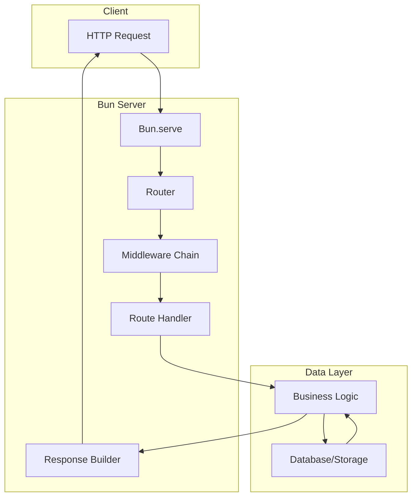
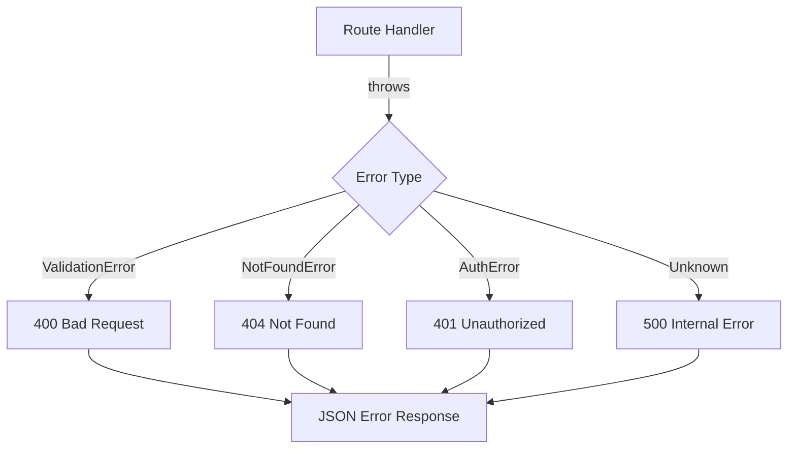
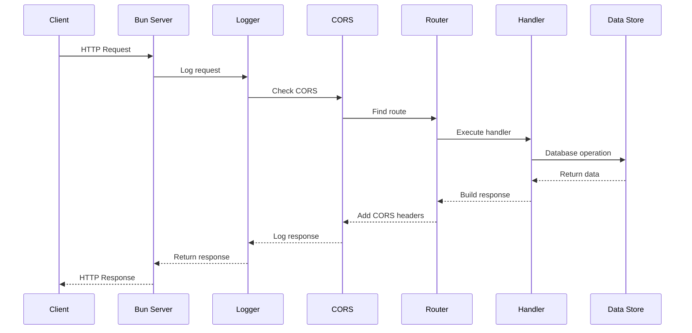

# How to Build REST APIs with Bun

Author: [nawazdhandala](https://github.com/nawazdhandala)

Tags: Bun, REST API, TypeScript, Backend

Description: Learn how to build fast, production-ready REST APIs using Bun's native HTTP server with routing, middleware, JSON handling, error handling, and CRUD operations.

---

> Bun is a modern JavaScript runtime that offers incredible performance and a built-in HTTP server. This guide walks you through building production-ready REST APIs using Bun's native `Bun.serve()` API without any external frameworks.

Bun has emerged as a compelling alternative to Node.js, offering significantly faster startup times, native TypeScript support, and a streamlined developer experience. One of its standout features is the built-in HTTP server that can handle thousands of requests per second with minimal configuration.

---

## Why Choose Bun for REST APIs?

| Feature | Bun | Node.js |
|---------|-----|---------|
| **Startup Time** | ~25ms | ~300ms |
| **TypeScript Support** | Native | Requires transpilation |
| **Package Manager** | Built-in (fastest) | npm/yarn/pnpm |
| **HTTP Server** | Built-in, optimized | Requires http module |
| **Hot Reload** | Built-in | Requires nodemon |

Bun's HTTP server is built on top of highly optimized native code, making it one of the fastest options available for building web APIs.

---

## Architecture Overview

Before diving into the code, let's understand the architecture of a typical Bun REST API:



---

## Getting Started with Bun.serve

The `Bun.serve()` function is the foundation of building HTTP servers in Bun. It provides a simple yet powerful API for handling HTTP requests.

This basic example creates a server that responds to all requests with a simple message:

```typescript
// server.ts
const server = Bun.serve({
  port: 3000,
  fetch(request: Request): Response {
    return new Response("Hello from Bun!", {
      headers: { "Content-Type": "text/plain" },
    });
  },
});

console.log(`Server running at http://localhost:${server.port}`);
```

Run the server with:

```bash
bun run server.ts
```

---

## Understanding the Request Object

Bun uses the standard Web API `Request` object. Here's how to extract useful information from incoming requests:

This utility function demonstrates extracting common request properties for logging and processing:

```typescript
// request-utils.ts
interface RequestInfo {
  method: string;
  url: string;
  pathname: string;
  searchParams: URLSearchParams;
  headers: Headers;
}

function parseRequest(request: Request): RequestInfo {
  const url = new URL(request.url);
  
  return {
    method: request.method,
    url: request.url,
    pathname: url.pathname,
    searchParams: url.searchParams,
    headers: request.headers,
  };
}

// Example usage in a handler
async function handleRequest(request: Request): Promise<Response> {
  const { method, pathname, searchParams } = parseRequest(request);
  
  console.log(`[${method}] ${pathname}`);
  
  // Access query parameters
  const page = searchParams.get("page") || "1";
  const limit = searchParams.get("limit") || "10";
  
  return new Response(JSON.stringify({ page, limit }), {
    headers: { "Content-Type": "application/json" },
  });
}
```

---

## Building a Router

Bun doesn't include a built-in router, but creating one is straightforward. A router maps URL patterns and HTTP methods to handler functions.

This router implementation supports dynamic path parameters and method-based routing:

```typescript
// router.ts
type RouteHandler = (
  request: Request,
  params: Record<string, string>
) => Response | Promise<Response>;

interface Route {
  method: string;
  pattern: RegExp;
  paramNames: string[];
  handler: RouteHandler;
}

class Router {
  private routes: Route[] = [];

  // Convert path pattern to regex and extract param names
  private pathToRegex(path: string): { pattern: RegExp; paramNames: string[] } {
    const paramNames: string[] = [];
    
    const regexPattern = path
      .replace(/\//g, "\\/")
      .replace(/:(\w+)/g, (_, paramName) => {
        paramNames.push(paramName);
        return "([^/]+)";
      });
    
    return {
      pattern: new RegExp(`^${regexPattern}$`),
      paramNames,
    };
  }

  // Register route methods
  get(path: string, handler: RouteHandler): void {
    this.addRoute("GET", path, handler);
  }

  post(path: string, handler: RouteHandler): void {
    this.addRoute("POST", path, handler);
  }

  put(path: string, handler: RouteHandler): void {
    this.addRoute("PUT", path, handler);
  }

  patch(path: string, handler: RouteHandler): void {
    this.addRoute("PATCH", path, handler);
  }

  delete(path: string, handler: RouteHandler): void {
    this.addRoute("DELETE", path, handler);
  }

  private addRoute(method: string, path: string, handler: RouteHandler): void {
    const { pattern, paramNames } = this.pathToRegex(path);
    this.routes.push({ method, pattern, paramNames, handler });
  }

  // Match incoming request to a route
  async handle(request: Request): Promise<Response> {
    const url = new URL(request.url);
    const pathname = url.pathname;

    for (const route of this.routes) {
      if (route.method !== request.method) continue;

      const match = pathname.match(route.pattern);
      if (match) {
        // Extract path parameters
        const params: Record<string, string> = {};
        route.paramNames.forEach((name, index) => {
          params[name] = match[index + 1];
        });

        return await route.handler(request, params);
      }
    }

    // No route matched
    return new Response(JSON.stringify({ error: "Not Found" }), {
      status: 404,
      headers: { "Content-Type": "application/json" },
    });
  }
}

export const router = new Router();
```

---

## Implementing Middleware

Middleware functions process requests before they reach route handlers. They can handle authentication, logging, CORS, and more.


This middleware system uses a chain pattern to process requests through multiple layers:

```typescript
// middleware.ts
type MiddlewareHandler = (
  request: Request,
  next: () => Promise<Response>
) => Response | Promise<Response>;

class MiddlewareChain {
  private middlewares: MiddlewareHandler[] = [];

  use(middleware: MiddlewareHandler): void {
    this.middlewares.push(middleware);
  }

  async execute(
    request: Request,
    finalHandler: (request: Request) => Promise<Response>
  ): Promise<Response> {
    let index = 0;

    const next = async (): Promise<Response> => {
      if (index < this.middlewares.length) {
        const middleware = this.middlewares[index++];
        return await middleware(request, next);
      }
      return await finalHandler(request);
    };

    return await next();
  }
}

export const middlewareChain = new MiddlewareChain();
```

### Logger Middleware

This middleware logs all incoming requests with timestamps and response times:

```typescript
// middlewares/logger.ts
import type { MiddlewareHandler } from "../middleware";

export const loggerMiddleware: MiddlewareHandler = async (request, next) => {
  const start = Date.now();
  const url = new URL(request.url);
  
  console.log(`[${new Date().toISOString()}] ${request.method} ${url.pathname}`);
  
  const response = await next();
  
  const duration = Date.now() - start;
  console.log(`[${new Date().toISOString()}] Response: ${response.status} (${duration}ms)`);
  
  return response;
};
```

### CORS Middleware

This middleware adds Cross-Origin Resource Sharing headers to support browser requests:

```typescript
// middlewares/cors.ts
import type { MiddlewareHandler } from "../middleware";

interface CorsOptions {
  origins: string[];
  methods: string[];
  headers: string[];
}

export function createCorsMiddleware(options: CorsOptions): MiddlewareHandler {
  return async (request, next) => {
    const origin = request.headers.get("Origin");
    
    // Handle preflight requests
    if (request.method === "OPTIONS") {
      return new Response(null, {
        status: 204,
        headers: {
          "Access-Control-Allow-Origin": options.origins.includes(origin || "") 
            ? origin! 
            : options.origins[0],
          "Access-Control-Allow-Methods": options.methods.join(", "),
          "Access-Control-Allow-Headers": options.headers.join(", "),
          "Access-Control-Max-Age": "86400",
        },
      });
    }

    const response = await next();
    
    // Clone response to add headers
    const newHeaders = new Headers(response.headers);
    newHeaders.set(
      "Access-Control-Allow-Origin",
      options.origins.includes(origin || "") ? origin! : options.origins[0]
    );

    return new Response(response.body, {
      status: response.status,
      statusText: response.statusText,
      headers: newHeaders,
    });
  };
}
```

### Authentication Middleware

This middleware validates JWT tokens and attaches user information to requests:

```typescript
// middlewares/auth.ts
import type { MiddlewareHandler } from "../middleware";

interface User {
  id: string;
  email: string;
  role: string;
}

// Store authenticated user in a WeakMap keyed by request
const requestUserMap = new WeakMap<Request, User>();

export function getUser(request: Request): User | undefined {
  return requestUserMap.get(request);
}

export const authMiddleware: MiddlewareHandler = async (request, next) => {
  const authHeader = request.headers.get("Authorization");
  
  if (!authHeader || !authHeader.startsWith("Bearer ")) {
    return new Response(JSON.stringify({ error: "Unauthorized" }), {
      status: 401,
      headers: { "Content-Type": "application/json" },
    });
  }

  const token = authHeader.substring(7);
  
  try {
    // In production, verify JWT token properly
    const user = await verifyToken(token);
    requestUserMap.set(request, user);
    return await next();
  } catch (error) {
    return new Response(JSON.stringify({ error: "Invalid token" }), {
      status: 401,
      headers: { "Content-Type": "application/json" },
    });
  }
};

async function verifyToken(token: string): Promise<User> {
  // Simplified token verification
  // In production, use a proper JWT library
  if (token === "valid-token") {
    return { id: "1", email: "user@example.com", role: "admin" };
  }
  throw new Error("Invalid token");
}
```

---

## JSON Request and Response Handling

Working with JSON is fundamental to REST APIs. Bun uses standard Web APIs for parsing and generating JSON.

These helper functions simplify JSON handling with proper error management:

```typescript
// json-utils.ts
interface JsonResponse<T> {
  success: boolean;
  data?: T;
  error?: string;
  meta?: {
    page?: number;
    limit?: number;
    total?: number;
  };
}

// Parse JSON body with error handling
async function parseJsonBody<T>(request: Request): Promise<T | null> {
  try {
    const contentType = request.headers.get("Content-Type");
    
    if (!contentType || !contentType.includes("application/json")) {
      return null;
    }
    
    return await request.json() as T;
  } catch (error) {
    return null;
  }
}

// Create JSON response with consistent structure
function jsonResponse<T>(
  data: T,
  status: number = 200,
  meta?: JsonResponse<T>["meta"]
): Response {
  const body: JsonResponse<T> = {
    success: status >= 200 && status < 300,
    data,
    meta,
  };

  return new Response(JSON.stringify(body), {
    status,
    headers: { "Content-Type": "application/json" },
  });
}

// Create error response
function errorResponse(message: string, status: number = 400): Response {
  const body: JsonResponse<null> = {
    success: false,
    error: message,
  };

  return new Response(JSON.stringify(body), {
    status,
    headers: { "Content-Type": "application/json" },
  });
}

export { parseJsonBody, jsonResponse, errorResponse };
```

---

## Error Handling

Robust error handling is essential for production APIs. This approach uses custom error classes and a centralized error handler.



Define custom error classes for different error scenarios:

```typescript
// errors.ts
export class ApiError extends Error {
  constructor(
    public message: string,
    public statusCode: number,
    public code: string
  ) {
    super(message);
    this.name = "ApiError";
  }
}

export class NotFoundError extends ApiError {
  constructor(resource: string) {
    super(`${resource} not found`, 404, "NOT_FOUND");
    this.name = "NotFoundError";
  }
}

export class ValidationError extends ApiError {
  constructor(message: string) {
    super(message, 400, "VALIDATION_ERROR");
    this.name = "ValidationError";
  }
}

export class AuthenticationError extends ApiError {
  constructor(message: string = "Authentication required") {
    super(message, 401, "AUTHENTICATION_ERROR");
    this.name = "AuthenticationError";
  }
}

export class ForbiddenError extends ApiError {
  constructor(message: string = "Access denied") {
    super(message, 403, "FORBIDDEN");
    this.name = "ForbiddenError";
  }
}
```

This error handler middleware catches all errors and returns appropriate responses:

```typescript
// error-handler.ts
import { ApiError } from "./errors";

export function handleError(error: unknown): Response {
  console.error("Error:", error);

  if (error instanceof ApiError) {
    return new Response(
      JSON.stringify({
        success: false,
        error: {
          message: error.message,
          code: error.code,
        },
      }),
      {
        status: error.statusCode,
        headers: { "Content-Type": "application/json" },
      }
    );
  }

  // Unknown error
  return new Response(
    JSON.stringify({
      success: false,
      error: {
        message: "Internal server error",
        code: "INTERNAL_ERROR",
      },
    }),
    {
      status: 500,
      headers: { "Content-Type": "application/json" },
    }
  );
}
```

---

## Building a Complete CRUD API

Let's build a complete user management API with all CRUD operations.

### Data Model and Storage

This in-memory store simulates a database for demonstration purposes:

```typescript
// models/user.ts
export interface User {
  id: string;
  email: string;
  name: string;
  role: "admin" | "user";
  createdAt: Date;
  updatedAt: Date;
}

export interface CreateUserDto {
  email: string;
  name: string;
  role?: "admin" | "user";
}

export interface UpdateUserDto {
  email?: string;
  name?: string;
  role?: "admin" | "user";
}

// In-memory storage (use a real database in production)
class UserStore {
  private users: Map<string, User> = new Map();
  private idCounter = 1;

  create(data: CreateUserDto): User {
    const id = String(this.idCounter++);
    const now = new Date();
    
    const user: User = {
      id,
      email: data.email,
      name: data.name,
      role: data.role || "user",
      createdAt: now,
      updatedAt: now,
    };
    
    this.users.set(id, user);
    return user;
  }

  findById(id: string): User | undefined {
    return this.users.get(id);
  }

  findAll(page: number = 1, limit: number = 10): { users: User[]; total: number } {
    const allUsers = Array.from(this.users.values());
    const start = (page - 1) * limit;
    const users = allUsers.slice(start, start + limit);
    
    return { users, total: allUsers.length };
  }

  update(id: string, data: UpdateUserDto): User | undefined {
    const user = this.users.get(id);
    if (!user) return undefined;

    const updatedUser: User = {
      ...user,
      ...data,
      updatedAt: new Date(),
    };
    
    this.users.set(id, updatedUser);
    return updatedUser;
  }

  delete(id: string): boolean {
    return this.users.delete(id);
  }

  findByEmail(email: string): User | undefined {
    return Array.from(this.users.values()).find((u) => u.email === email);
  }
}

export const userStore = new UserStore();
```

### Validation

This validation helper ensures incoming data meets requirements:

```typescript
// validation.ts
import { ValidationError } from "./errors";

export function validateEmail(email: string): void {
  const emailRegex = /^[^\s@]+@[^\s@]+\.[^\s@]+$/;
  if (!emailRegex.test(email)) {
    throw new ValidationError("Invalid email format");
  }
}

export function validateRequired(value: unknown, fieldName: string): void {
  if (value === undefined || value === null || value === "") {
    throw new ValidationError(`${fieldName} is required`);
  }
}

export function validateLength(
  value: string,
  fieldName: string,
  min: number,
  max: number
): void {
  if (value.length < min || value.length > max) {
    throw new ValidationError(
      `${fieldName} must be between ${min} and ${max} characters`
    );
  }
}
```

### User Handlers

These handlers implement the CRUD operations for the user resource:

```typescript
// handlers/users.ts
import { userStore, type CreateUserDto, type UpdateUserDto } from "../models/user";
import { NotFoundError, ValidationError } from "../errors";
import { parseJsonBody, jsonResponse, errorResponse } from "../json-utils";
import { validateEmail, validateRequired, validateLength } from "../validation";

// GET /api/users
export async function listUsers(
  request: Request,
  params: Record<string, string>
): Promise<Response> {
  const url = new URL(request.url);
  const page = parseInt(url.searchParams.get("page") || "1");
  const limit = parseInt(url.searchParams.get("limit") || "10");

  // Validate pagination params
  if (page < 1 || limit < 1 || limit > 100) {
    return errorResponse("Invalid pagination parameters", 400);
  }

  const { users, total } = userStore.findAll(page, limit);
  
  return jsonResponse(users, 200, {
    page,
    limit,
    total,
  });
}

// GET /api/users/:id
export async function getUser(
  request: Request,
  params: Record<string, string>
): Promise<Response> {
  const user = userStore.findById(params.id);
  
  if (!user) {
    throw new NotFoundError("User");
  }
  
  return jsonResponse(user);
}

// POST /api/users
export async function createUser(
  request: Request,
  params: Record<string, string>
): Promise<Response> {
  const body = await parseJsonBody<CreateUserDto>(request);
  
  if (!body) {
    throw new ValidationError("Request body must be valid JSON");
  }

  // Validate input
  validateRequired(body.email, "email");
  validateRequired(body.name, "name");
  validateEmail(body.email);
  validateLength(body.name, "name", 2, 100);

  // Check for duplicate email
  if (userStore.findByEmail(body.email)) {
    throw new ValidationError("Email already exists");
  }

  const user = userStore.create(body);
  
  return jsonResponse(user, 201);
}

// PUT /api/users/:id
export async function updateUser(
  request: Request,
  params: Record<string, string>
): Promise<Response> {
  const existing = userStore.findById(params.id);
  
  if (!existing) {
    throw new NotFoundError("User");
  }

  const body = await parseJsonBody<UpdateUserDto>(request);
  
  if (!body) {
    throw new ValidationError("Request body must be valid JSON");
  }

  // Validate input if provided
  if (body.email) {
    validateEmail(body.email);
    
    // Check for duplicate email
    const existingByEmail = userStore.findByEmail(body.email);
    if (existingByEmail && existingByEmail.id !== params.id) {
      throw new ValidationError("Email already exists");
    }
  }
  
  if (body.name) {
    validateLength(body.name, "name", 2, 100);
  }

  const user = userStore.update(params.id, body);
  
  return jsonResponse(user);
}

// DELETE /api/users/:id
export async function deleteUser(
  request: Request,
  params: Record<string, string>
): Promise<Response> {
  const existing = userStore.findById(params.id);
  
  if (!existing) {
    throw new NotFoundError("User");
  }

  userStore.delete(params.id);
  
  return new Response(null, { status: 204 });
}
```

---

## Putting It All Together

Here's the complete server setup combining all the components:

```typescript
// index.ts
import { router } from "./router";
import { middlewareChain } from "./middleware";
import { handleError } from "./error-handler";
import { loggerMiddleware } from "./middlewares/logger";
import { createCorsMiddleware } from "./middlewares/cors";
import {
  listUsers,
  getUser,
  createUser,
  updateUser,
  deleteUser,
} from "./handlers/users";

// Register middleware
middlewareChain.use(loggerMiddleware);
middlewareChain.use(
  createCorsMiddleware({
    origins: ["http://localhost:3000", "https://example.com"],
    methods: ["GET", "POST", "PUT", "PATCH", "DELETE", "OPTIONS"],
    headers: ["Content-Type", "Authorization"],
  })
);

// Register routes
router.get("/api/users", listUsers);
router.get("/api/users/:id", getUser);
router.post("/api/users", createUser);
router.put("/api/users/:id", updateUser);
router.delete("/api/users/:id", deleteUser);

// Health check endpoint
router.get("/health", async () => {
  return new Response(
    JSON.stringify({ status: "ok", timestamp: new Date().toISOString() }),
    { headers: { "Content-Type": "application/json" } }
  );
});

// Start server
const server = Bun.serve({
  port: process.env.PORT || 3000,
  
  async fetch(request: Request): Promise<Response> {
    try {
      return await middlewareChain.execute(request, async (req) => {
        return await router.handle(req);
      });
    } catch (error) {
      return handleError(error);
    }
  },
  
  // Handle server errors
  error(error: Error): Response {
    console.error("Server error:", error);
    return new Response("Internal Server Error", { status: 500 });
  },
});

console.log(`Server running at http://localhost:${server.port}`);
console.log(`Health check: http://localhost:${server.port}/health`);
```

---

## Request Flow Diagram



---

## Testing the API

You can test the API using curl commands:

```bash
# Health check
curl http://localhost:3000/health

# Create a user
curl -X POST http://localhost:3000/api/users \
  -H "Content-Type: application/json" \
  -d '{"email": "john@example.com", "name": "John Doe"}'

# List all users
curl http://localhost:3000/api/users

# Get a specific user
curl http://localhost:3000/api/users/1

# Update a user
curl -X PUT http://localhost:3000/api/users/1 \
  -H "Content-Type: application/json" \
  -d '{"name": "John Smith"}'

# Delete a user
curl -X DELETE http://localhost:3000/api/users/1
```

---

## Best Practices Summary

### 1. Use TypeScript for Type Safety
TypeScript catches errors at compile time and provides better IDE support. Bun runs TypeScript natively without any build step.

### 2. Implement Proper Error Handling
Create custom error classes for different scenarios. Use a centralized error handler to ensure consistent error responses.

### 3. Validate All Input
Never trust client input. Validate request bodies, query parameters, and path parameters before processing.

### 4. Use Middleware for Cross-Cutting Concerns
Implement logging, authentication, and CORS as middleware to keep route handlers focused on business logic.

### 5. Return Consistent Response Formats
Use a standard response structure with success flags, data payloads, and error details.

### 6. Add Health Check Endpoints
Include `/health` endpoints for monitoring and load balancer health checks.

### 7. Use Environment Variables for Configuration
Never hardcode sensitive values. Use `process.env` or Bun's built-in environment variable support.

### 8. Implement Pagination for List Endpoints
Always paginate list responses to prevent memory issues and improve performance.

### 9. Use Proper HTTP Status Codes
Return appropriate status codes: 200 for success, 201 for creation, 204 for deletion, 400 for validation errors, 404 for not found, and 500 for server errors.

### 10. Log Requests and Errors
Implement comprehensive logging for debugging and monitoring in production.

---

## Conclusion

Bun provides an excellent foundation for building high-performance REST APIs with minimal dependencies. Its native TypeScript support, fast startup times, and built-in HTTP server make it ideal for modern backend development.

Key takeaways from this guide:

- **Bun.serve() is simple and powerful**: The fetch handler pattern makes it easy to process HTTP requests
- **Building a router is straightforward**: Pattern matching with regular expressions handles dynamic routes effectively
- **Middleware chains provide flexibility**: The chain pattern allows clean separation of concerns
- **Error handling should be centralized**: Custom error classes and a global handler ensure consistent responses
- **JSON handling uses standard Web APIs**: The Request and Response objects work naturally with JSON data

The complete example demonstrates how to structure a production-ready API with proper validation, error handling, and CRUD operations. Whether you're building a small service or a larger application, these patterns scale well.

As Bun continues to mature, its ecosystem grows stronger. For production deployments, consider adding a real database, implementing rate limiting, and setting up proper monitoring with tools like OneUptime to track API performance and reliability.

---

*Want to monitor your Bun APIs in production? [OneUptime](https://oneuptime.com) provides comprehensive API monitoring with uptime tracking, performance metrics, and instant alerting when issues arise.*
