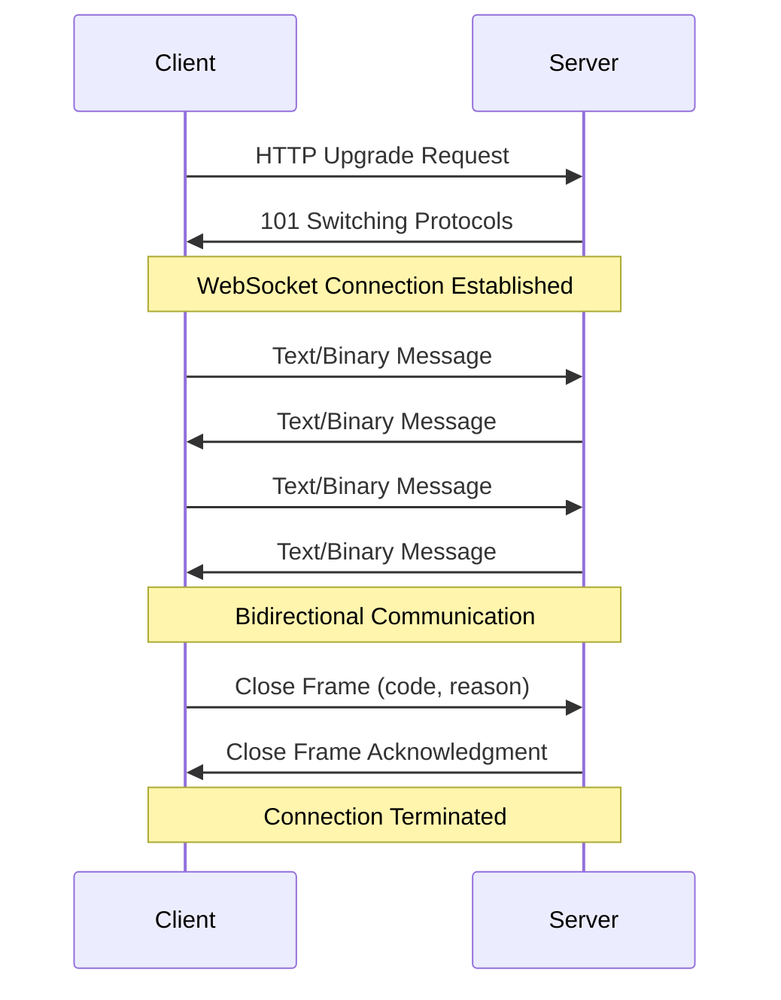
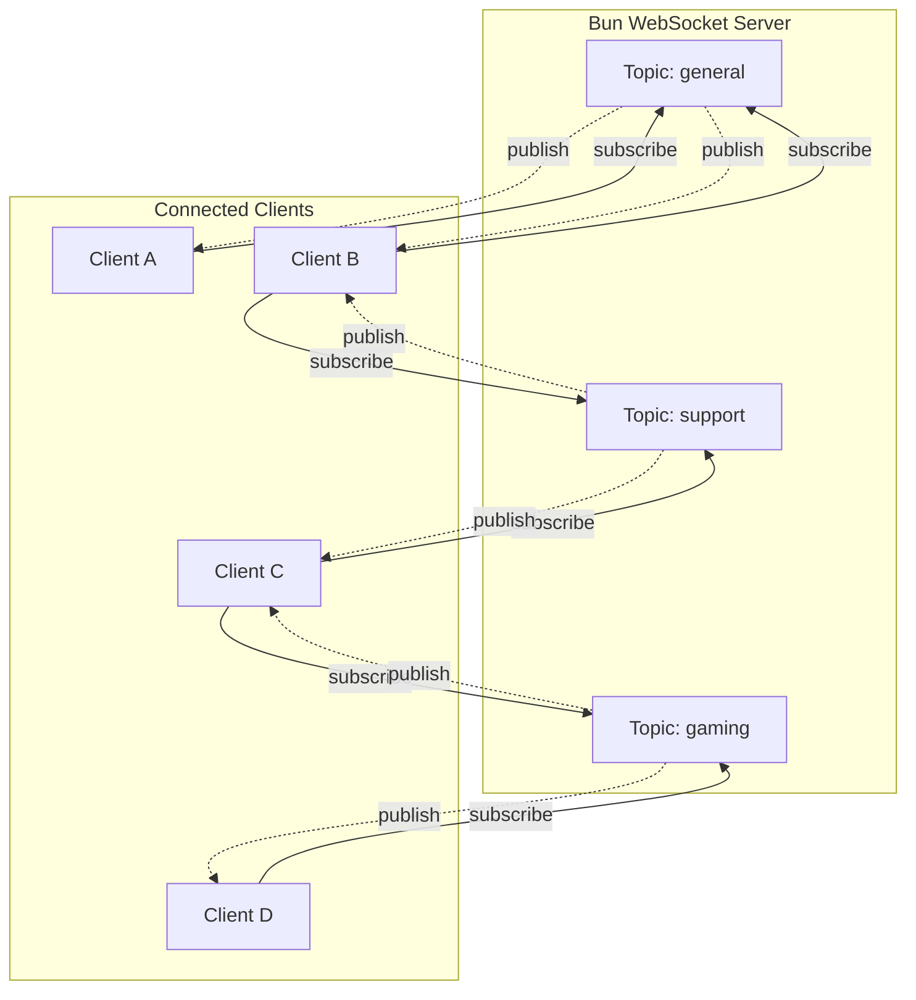
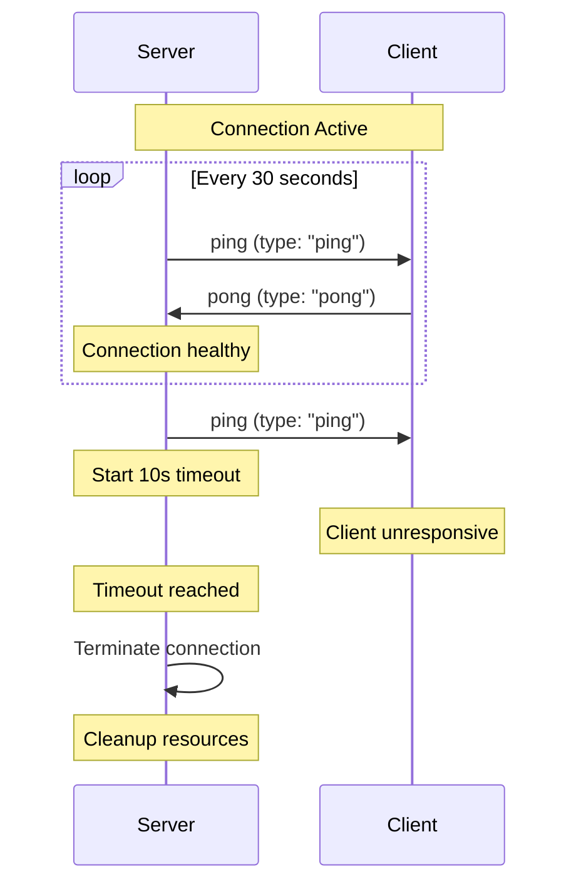
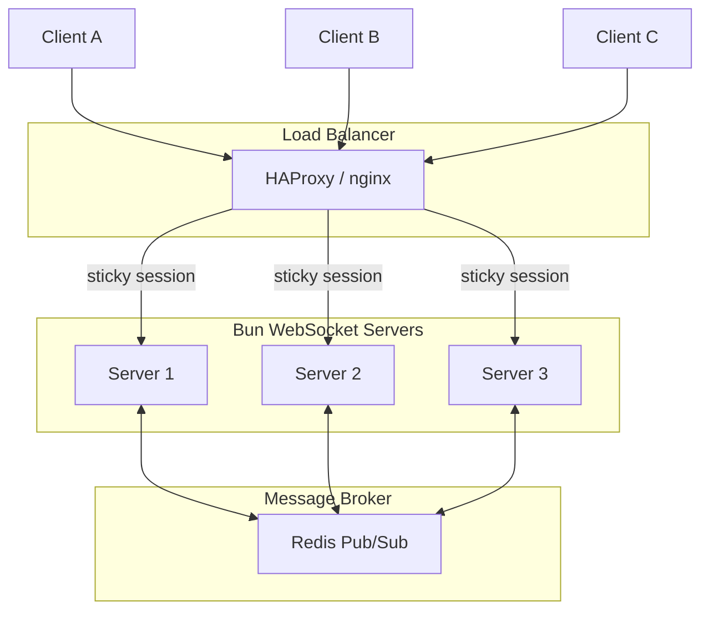

# How to Build WebSocket Servers with Bun

Author: [nawazdhandala](https://github.com/nawazdhandala)

Tags: Bun, WebSocket, Real-time, Backend

Description: Learn how to build high-performance WebSocket servers with Bun using its native API, pub/sub patterns, authentication, and scaling strategies.

---

Real-time communication has become essential for modern web applications. Whether you are building chat applications, live dashboards, collaborative tools, or multiplayer games, WebSockets provide the bidirectional, low-latency communication that users expect. Bun, the fast all-in-one JavaScript runtime, offers a native WebSocket server implementation that is both simple to use and incredibly performant.

In this comprehensive guide, we will explore how to build production-ready WebSocket servers with Bun. We will cover everything from basic setup to advanced patterns including authentication, room management, pub/sub, heartbeat mechanisms, and scaling strategies.

## Why Bun for WebSocket Servers?

Bun is designed with performance in mind. Its WebSocket implementation is built directly into the runtime, which means:

- **Zero dependencies**: No need to install `ws`, `socket.io`, or any other WebSocket library
- **Native performance**: Written in Zig with optimized memory management
- **Built-in pub/sub**: Topic-based message broadcasting without external dependencies
- **Seamless TypeScript support**: First-class TypeScript support out of the box
- **Simple API**: Intuitive handler-based design that is easy to reason about

## Understanding the WebSocket Connection Lifecycle

Before diving into code, let us understand how WebSocket connections work. The following diagram illustrates the complete WebSocket lifecycle:



WebSockets maintain a persistent TCP connection, eliminating the overhead of repeated HTTP handshakes. This makes them ideal for scenarios requiring frequent message exchange between client and server.

## Setting Up Your Bun Project

First, ensure you have Bun installed. Then create a new project:

```bash
mkdir bun-websocket-server
cd bun-websocket-server
bun init -y
```

This creates a minimal project structure. We will organize our code as follows:

```
bun-websocket-server/
├── index.ts
├── handlers/
│   └── websocket.ts
├── services/
│   ├── auth.ts
│   ├── rooms.ts
│   └── heartbeat.ts
├── types/
│   └── index.ts
└── package.json
```

## Creating a Basic WebSocket Server

Bun's WebSocket API is integrated directly into `Bun.serve()`. Here is the simplest possible WebSocket server that echoes messages back to clients:

```typescript
// index.ts - Basic WebSocket echo server with Bun
// Bun.serve() handles both HTTP and WebSocket connections in a single function

const server = Bun.serve({
  port: 8080,
  
  // Handle regular HTTP requests
  fetch(request, server) {
    const url = new URL(request.url);
    
    // Upgrade HTTP connection to WebSocket when client requests it
    if (url.pathname === "/ws") {
      const upgraded = server.upgrade(request);
      if (upgraded) {
        // Connection successfully upgraded to WebSocket
        return undefined;
      }
      return new Response("WebSocket upgrade failed", { status: 400 });
    }
    
    return new Response("WebSocket server running. Connect to /ws");
  },
  
  // WebSocket event handlers
  websocket: {
    // Called when a new WebSocket connection is established
    open(ws) {
      console.log("Client connected");
    },
    
    // Called when a message is received from the client
    message(ws, message) {
      console.log("Received:", message);
      // Echo the message back to the client
      ws.send(`Echo: ${message}`);
    },
    
    // Called when the connection is closed
    close(ws, code, reason) {
      console.log(`Client disconnected: ${code} - ${reason}`);
    },
    
    // Called when backpressure is relieved and the socket is ready to receive more data
    drain(ws) {
      console.log("Socket drained, ready for more data");
    },
  },
});

console.log(`WebSocket server running at http://localhost:${server.port}`);
```

Run the server with:

```bash
bun run index.ts
```

## Understanding the WebSocket Handler Interface

Bun's WebSocket handlers receive a `ServerWebSocket` object with the following key methods and properties:

```typescript
// types/index.ts - WebSocket type definitions for Bun
// Defines the structure of data attached to each WebSocket connection

export interface WebSocketData {
  clientId: string;
  userId?: string;
  username?: string;
  connectedAt: Date;
  rooms: Set<string>;
}

// The ServerWebSocket<T> interface provides these methods:
// ws.send(data) - Send text or binary data to the client
// ws.sendText(text) - Send text data only
// ws.sendBinary(data) - Send binary data only
// ws.close(code?, reason?) - Close the connection
// ws.subscribe(topic) - Subscribe to a pub/sub topic
// ws.unsubscribe(topic) - Unsubscribe from a topic
// ws.publish(topic, data) - Publish to all subscribers of a topic
// ws.publishText(topic, text) - Publish text to a topic
// ws.publishBinary(topic, data) - Publish binary to a topic
// ws.isSubscribed(topic) - Check if subscribed to a topic
// ws.data - Access the custom data attached to this socket
// ws.readyState - Get the current connection state
// ws.remoteAddress - Get the client IP address
```

## Handling Multiple Connections

A real application needs to track all connected clients. Bun allows you to attach custom data to each WebSocket connection through the upgrade process:

```typescript
// services/connections.ts - Managing multiple WebSocket connections
// Tracks all connected clients and provides utility methods for broadcasting

import type { ServerWebSocket } from "bun";
import type { WebSocketData } from "../types";

class ConnectionManager {
  // Store all active client connections by their unique ID
  private clients: Map<string, ServerWebSocket<WebSocketData>> = new Map();

  // Generate a unique identifier for each new connection
  private generateId(): string {
    return crypto.randomUUID();
  }

  // Register a new client connection and return the assigned ID
  addClient(ws: ServerWebSocket<WebSocketData>): string {
    const id = ws.data.clientId;
    this.clients.set(id, ws);
    console.log(`Client ${id} connected. Total clients: ${this.clients.size}`);
    return id;
  }

  // Remove a client when they disconnect
  removeClient(id: string): void {
    this.clients.delete(id);
    console.log(`Client ${id} disconnected. Total clients: ${this.clients.size}`);
  }

  // Retrieve a specific client by their ID
  getClient(id: string): ServerWebSocket<WebSocketData> | undefined {
    return this.clients.get(id);
  }

  // Get all currently connected clients
  getAllClients(): ServerWebSocket<WebSocketData>[] {
    return Array.from(this.clients.values());
  }

  // Get the total number of connected clients
  getClientCount(): number {
    return this.clients.size;
  }

  // Broadcast a message to all connected clients
  broadcast(message: string, excludeId?: string): void {
    for (const [id, client] of this.clients) {
      if (id !== excludeId && client.readyState === WebSocket.OPEN) {
        client.send(message);
      }
    }
  }
}

export const connectionManager = new ConnectionManager();
```

Now update the server to use the connection manager:

```typescript
// index.ts - WebSocket server with connection tracking
// Attaches unique data to each connection during the upgrade process

import { connectionManager } from "./services/connections";
import type { WebSocketData } from "./types";

const server = Bun.serve<WebSocketData>({
  port: 8080,

  fetch(request, server) {
    const url = new URL(request.url);

    if (url.pathname === "/ws") {
      // Create unique data for this connection during upgrade
      const clientId = crypto.randomUUID();
      const wsData: WebSocketData = {
        clientId,
        connectedAt: new Date(),
        rooms: new Set(),
      };

      const upgraded = server.upgrade(request, { data: wsData });
      if (upgraded) return undefined;

      return new Response("WebSocket upgrade failed", { status: 400 });
    }

    return new Response("WebSocket server running");
  },

  websocket: {
    open(ws) {
      // Register the client in our connection manager
      connectionManager.addClient(ws);

      // Send welcome message with the assigned client ID
      ws.send(JSON.stringify({
        type: "connected",
        clientId: ws.data.clientId,
        timestamp: Date.now(),
      }));
    },

    message(ws, message) {
      const text = typeof message === "string" ? message : message.toString();
      console.log(`[${ws.data.clientId}] Received: ${text}`);

      // Broadcast the message to all other clients
      connectionManager.broadcast(
        JSON.stringify({
          type: "message",
          from: ws.data.clientId,
          content: text,
        }),
        ws.data.clientId
      );
    },

    close(ws, code, reason) {
      connectionManager.removeClient(ws.data.clientId);
    },
  },
});

console.log(`Server running at http://localhost:${server.port}`);
```

## Built-in Pub/Sub with Topics

Bun provides native pub/sub functionality through topics. This is more efficient than manually iterating over connections. The following diagram shows how pub/sub works in Bun:



Here is how to implement topic-based messaging:

```typescript
// services/rooms.ts - Room management using Bun's native pub/sub
// Each room is a topic that clients can subscribe to

import type { ServerWebSocket } from "bun";
import type { WebSocketData } from "../types";

class RoomManager {
  // Track room memberships for cleanup purposes
  private roomMembers: Map<string, Set<string>> = new Map();

  // Have a client join a room/topic
  joinRoom(ws: ServerWebSocket<WebSocketData>, roomName: string): void {
    // Subscribe the WebSocket to the topic
    ws.subscribe(roomName);
    ws.data.rooms.add(roomName);

    // Track membership
    if (!this.roomMembers.has(roomName)) {
      this.roomMembers.set(roomName, new Set());
    }
    this.roomMembers.get(roomName)!.add(ws.data.clientId);

    console.log(`Client ${ws.data.clientId} joined room: ${roomName}`);

    // Notify the room about the new member
    ws.publish(roomName, JSON.stringify({
      type: "user_joined",
      room: roomName,
      userId: ws.data.clientId,
      username: ws.data.username || "Anonymous",
      timestamp: Date.now(),
    }));

    // Confirm to the joining client
    ws.send(JSON.stringify({
      type: "room_joined",
      room: roomName,
      memberCount: this.getRoomMemberCount(roomName),
    }));
  }

  // Have a client leave a room/topic
  leaveRoom(ws: ServerWebSocket<WebSocketData>, roomName: string): void {
    ws.unsubscribe(roomName);
    ws.data.rooms.delete(roomName);

    // Update membership tracking
    const members = this.roomMembers.get(roomName);
    if (members) {
      members.delete(ws.data.clientId);
      if (members.size === 0) {
        this.roomMembers.delete(roomName);
      }
    }

    console.log(`Client ${ws.data.clientId} left room: ${roomName}`);

    // Notify remaining room members
    ws.publish(roomName, JSON.stringify({
      type: "user_left",
      room: roomName,
      userId: ws.data.clientId,
      username: ws.data.username || "Anonymous",
      timestamp: Date.now(),
    }));
  }

  // Remove a client from all rooms when they disconnect
  leaveAllRooms(ws: ServerWebSocket<WebSocketData>): void {
    for (const room of ws.data.rooms) {
      this.leaveRoom(ws, room);
    }
  }

  // Send a message to all members of a room
  broadcastToRoom(
    ws: ServerWebSocket<WebSocketData>,
    roomName: string,
    message: string,
    includeSelf: boolean = false
  ): void {
    if (includeSelf) {
      // Use server.publish to include the sender
      ws.publish(roomName, message);
      ws.send(message);
    } else {
      // Default behavior excludes the sender
      ws.publish(roomName, message);
    }
  }

  // Get the list of rooms a client is in
  getClientRooms(clientId: string): string[] {
    const rooms: string[] = [];
    for (const [roomName, members] of this.roomMembers) {
      if (members.has(clientId)) {
        rooms.push(roomName);
      }
    }
    return rooms;
  }

  // Get the number of members in a room
  getRoomMemberCount(roomName: string): number {
    return this.roomMembers.get(roomName)?.size || 0;
  }
}

export const roomManager = new RoomManager();
```

## Handling Binary and Text Messages

Bun WebSockets support both text and binary messages. Here is how to handle different message types:

```typescript
// handlers/message.ts - Message type handling for text and binary data
// Demonstrates processing different message formats efficiently

import type { ServerWebSocket } from "bun";
import type { WebSocketData } from "../types";

interface MessageEnvelope {
  type: string;
  payload: unknown;
}

// Parse and validate incoming messages
function parseMessage(data: string | Buffer): MessageEnvelope | null {
  try {
    const text = typeof data === "string" ? data : data.toString("utf-8");
    const parsed = JSON.parse(text);

    if (typeof parsed.type !== "string") {
      throw new Error("Message must have a type field");
    }

    return parsed as MessageEnvelope;
  } catch (error) {
    console.error("Failed to parse message:", error);
    return null;
  }
}

// Handle incoming WebSocket messages
export function handleMessage(
  ws: ServerWebSocket<WebSocketData>,
  rawMessage: string | Buffer
): void {
  // Check if this is binary data for special handling
  if (rawMessage instanceof Buffer && !isTextMessage(rawMessage)) {
    handleBinaryMessage(ws, rawMessage);
    return;
  }

  // Parse as JSON message
  const message = parseMessage(rawMessage);
  if (!message) {
    ws.send(JSON.stringify({
      type: "error",
      error: "Invalid message format. Expected JSON with type field.",
    }));
    return;
  }

  // Route to appropriate handler based on message type
  switch (message.type) {
    case "ping":
      handlePing(ws);
      break;
    case "join_room":
      handleJoinRoom(ws, message.payload as { room: string });
      break;
    case "leave_room":
      handleLeaveRoom(ws, message.payload as { room: string });
      break;
    case "chat":
      handleChatMessage(ws, message.payload as { room: string; text: string });
      break;
    default:
      ws.send(JSON.stringify({
        type: "error",
        error: `Unknown message type: ${message.type}`,
      }));
  }
}

// Check if buffer contains text data
function isTextMessage(buffer: Buffer): boolean {
  // Simple heuristic: check if buffer contains valid UTF-8 text
  try {
    const text = buffer.toString("utf-8");
    return text.startsWith("{") || text.startsWith("[");
  } catch {
    return false;
  }
}

// Handle binary messages like file uploads or media
function handleBinaryMessage(
  ws: ServerWebSocket<WebSocketData>,
  data: Buffer
): void {
  console.log(`Received binary data: ${data.length} bytes`);

  // Example: Process image uploads, audio chunks, etc.
  ws.send(JSON.stringify({
    type: "binary_received",
    size: data.length,
    timestamp: Date.now(),
  }));
}

// Handle ping messages for client-side heartbeat
function handlePing(ws: ServerWebSocket<WebSocketData>): void {
  ws.send(JSON.stringify({
    type: "pong",
    timestamp: Date.now(),
  }));
}
```

## Implementing Authentication

Security is critical for WebSocket servers. You can authenticate users during the HTTP upgrade request or through the first message after connection. Here is a JWT-based authentication implementation:

```typescript
// services/auth.ts - JWT authentication for WebSocket connections
// Validates tokens before allowing WebSocket upgrades

import { SignJWT, jwtVerify } from "jose";

// In production, load this from environment variables
const JWT_SECRET = new TextEncoder().encode(
  process.env.JWT_SECRET || "your-super-secret-key-min-32-chars!"
);

export interface UserPayload {
  userId: string;
  username: string;
  roles: string[];
}

// Create a JWT token for a user
export async function createToken(user: UserPayload): Promise<string> {
  return new SignJWT({ ...user })
    .setProtectedHeader({ alg: "HS256" })
    .setIssuedAt()
    .setExpirationTime("1h")
    .sign(JWT_SECRET);
}

// Verify and decode a JWT token
export async function verifyToken(token: string): Promise<UserPayload | null> {
  try {
    const { payload } = await jwtVerify(token, JWT_SECRET);
    return payload as unknown as UserPayload;
  } catch (error) {
    console.error("Token verification failed:", error);
    return null;
  }
}

// Extract token from request URL or headers
export function extractToken(request: Request): string | null {
  // Check URL query parameter
  const url = new URL(request.url);
  const tokenFromQuery = url.searchParams.get("token");
  if (tokenFromQuery) return tokenFromQuery;

  // Check Authorization header
  const authHeader = request.headers.get("authorization");
  if (authHeader?.startsWith("Bearer ")) {
    return authHeader.slice(7);
  }

  // Check Sec-WebSocket-Protocol header (useful for browser clients)
  const protocol = request.headers.get("sec-websocket-protocol");
  if (protocol) {
    const parts = protocol.split(", ");
    const tokenPart = parts.find((p) => p.startsWith("token."));
    if (tokenPart) {
      return tokenPart.slice(6);
    }
  }

  return null;
}

// Authenticate a WebSocket connection attempt
export async function authenticateRequest(
  request: Request
): Promise<UserPayload | null> {
  const token = extractToken(request);
  if (!token) {
    console.log("No authentication token provided");
    return null;
  }

  return await verifyToken(token);
}
```

Integrate authentication into the server:

```typescript
// index.ts - WebSocket server with authentication
// Rejects unauthenticated connections during the upgrade phase

import { authenticateRequest, type UserPayload } from "./services/auth";
import { connectionManager } from "./services/connections";
import { roomManager } from "./services/rooms";
import { handleMessage } from "./handlers/message";
import type { WebSocketData } from "./types";

const server = Bun.serve<WebSocketData>({
  port: 8080,

  async fetch(request, server) {
    const url = new URL(request.url);

    if (url.pathname === "/ws") {
      // Authenticate before upgrading the connection
      const user = await authenticateRequest(request);

      if (!user) {
        return new Response("Unauthorized: Valid token required", {
          status: 401,
        });
      }

      // Create connection data with authenticated user info
      const wsData: WebSocketData = {
        clientId: crypto.randomUUID(),
        userId: user.userId,
        username: user.username,
        connectedAt: new Date(),
        rooms: new Set(),
      };

      const upgraded = server.upgrade(request, { data: wsData });
      if (upgraded) return undefined;

      return new Response("WebSocket upgrade failed", { status: 400 });
    }

    // Health check endpoint
    if (url.pathname === "/health") {
      return new Response(JSON.stringify({
        status: "healthy",
        connections: connectionManager.getClientCount(),
      }), {
        headers: { "Content-Type": "application/json" },
      });
    }

    return new Response("Bun WebSocket Server");
  },

  websocket: {
    open(ws) {
      connectionManager.addClient(ws);

      ws.send(JSON.stringify({
        type: "authenticated",
        clientId: ws.data.clientId,
        userId: ws.data.userId,
        username: ws.data.username,
        timestamp: Date.now(),
      }));
    },

    message(ws, message) {
      handleMessage(ws, message);
    },

    close(ws, code, reason) {
      roomManager.leaveAllRooms(ws);
      connectionManager.removeClient(ws.data.clientId);
    },
  },
});

console.log(`Authenticated WebSocket server running at ${server.port}`);
```

## Implementing Heartbeat and Keep-Alive

Long-lived connections can become stale due to network issues or client crashes. Implementing a heartbeat mechanism helps detect and clean up dead connections:



Here is the heartbeat implementation:

```typescript
// services/heartbeat.ts - Connection health monitoring
// Automatically terminates unresponsive connections

import type { ServerWebSocket } from "bun";
import type { WebSocketData } from "../types";
import { connectionManager } from "./connections";
import { roomManager } from "./rooms";

interface HeartbeatConfig {
  pingInterval: number;    // How often to send pings (milliseconds)
  pongTimeout: number;     // How long to wait for pong response
}

const DEFAULT_CONFIG: HeartbeatConfig = {
  pingInterval: 30000,     // 30 seconds
  pongTimeout: 10000,      // 10 seconds
};

class HeartbeatManager {
  private config: HeartbeatConfig;
  // Track clients waiting for pong responses
  private pendingPongs: Map<string, Timer> = new Map();
  // Track ping interval timers for each client
  private pingIntervals: Map<string, Timer> = new Map();

  constructor(config: Partial<HeartbeatConfig> = {}) {
    this.config = { ...DEFAULT_CONFIG, ...config };
  }

  // Start heartbeat monitoring for a new connection
  startHeartbeat(ws: ServerWebSocket<WebSocketData>): void {
    const clientId = ws.data.clientId;

    // Set up recurring ping
    const intervalId = setInterval(() => {
      if (ws.readyState !== WebSocket.OPEN) {
        this.stopHeartbeat(clientId);
        return;
      }

      // Send ping message
      try {
        ws.send(JSON.stringify({
          type: "ping",
          timestamp: Date.now(),
        }));
      } catch (error) {
        console.error(`Failed to send ping to ${clientId}:`, error);
        this.stopHeartbeat(clientId);
        return;
      }

      // Set timeout for pong response
      const timeoutId = setTimeout(() => {
        console.log(`Client ${clientId} heartbeat timeout, closing connection`);
        this.stopHeartbeat(clientId);
        
        // Clean up and close the connection
        roomManager.leaveAllRooms(ws);
        connectionManager.removeClient(clientId);
        ws.close(1000, "Heartbeat timeout");
      }, this.config.pongTimeout);

      this.pendingPongs.set(clientId, timeoutId);
    }, this.config.pingInterval);

    this.pingIntervals.set(clientId, intervalId);
    console.log(`Heartbeat started for client ${clientId}`);
  }

  // Called when a pong is received from a client
  receivePong(clientId: string): void {
    const timeoutId = this.pendingPongs.get(clientId);
    if (timeoutId) {
      clearTimeout(timeoutId);
      this.pendingPongs.delete(clientId);
    }
  }

  // Stop heartbeat monitoring for a client
  stopHeartbeat(clientId: string): void {
    const intervalId = this.pingIntervals.get(clientId);
    if (intervalId) {
      clearInterval(intervalId);
      this.pingIntervals.delete(clientId);
    }

    const timeoutId = this.pendingPongs.get(clientId);
    if (timeoutId) {
      clearTimeout(timeoutId);
      this.pendingPongs.delete(clientId);
    }

    console.log(`Heartbeat stopped for client ${clientId}`);
  }
}

export const heartbeatManager = new HeartbeatManager();
```

## Building a Complete Chat Application

Let us combine everything into a fully functional chat application. This example demonstrates real-world patterns for a production chat system:

```typescript
// index.ts - Complete chat application with Bun WebSockets
// Implements rooms, authentication, typing indicators, and message history

import type { ServerWebSocket } from "bun";

// Define the data attached to each WebSocket connection
interface ChatUserData {
  clientId: string;
  userId: string;
  username: string;
  connectedAt: Date;
  rooms: Set<string>;
  isTyping: Map<string, boolean>;
}

// Message types for the chat protocol
type ChatMessage =
  | { type: "join_room"; room: string }
  | { type: "leave_room"; room: string }
  | { type: "chat"; room: string; text: string }
  | { type: "typing"; room: string; isTyping: boolean }
  | { type: "pong" }
  | { type: "get_rooms" };

// Track connected clients
const clients = new Map<string, ServerWebSocket<ChatUserData>>();

// Store recent messages per room for new joiners
const messageHistory = new Map<string, Array<{
  username: string;
  text: string;
  timestamp: number;
}>>();

const MAX_HISTORY = 50;

// Add message to room history
function addToHistory(room: string, username: string, text: string): void {
  if (!messageHistory.has(room)) {
    messageHistory.set(room, []);
  }
  const history = messageHistory.get(room)!;
  history.push({ username, text, timestamp: Date.now() });
  
  // Keep only recent messages
  if (history.length > MAX_HISTORY) {
    history.shift();
  }
}

const server = Bun.serve<ChatUserData>({
  port: 8080,

  fetch(request, server) {
    const url = new URL(request.url);

    if (url.pathname === "/ws") {
      // Extract username from query params (simplified auth for demo)
      const username = url.searchParams.get("username");
      if (!username) {
        return new Response("Username required", { status: 400 });
      }

      const userData: ChatUserData = {
        clientId: crypto.randomUUID(),
        userId: crypto.randomUUID(),
        username,
        connectedAt: new Date(),
        rooms: new Set(),
        isTyping: new Map(),
      };

      const upgraded = server.upgrade(request, { data: userData });
      if (upgraded) return undefined;

      return new Response("Upgrade failed", { status: 400 });
    }

    // Serve a simple HTML chat client
    if (url.pathname === "/") {
      return new Response(getChatClientHtml(), {
        headers: { "Content-Type": "text/html" },
      });
    }

    return new Response("Not Found", { status: 404 });
  },

  websocket: {
    // Called when a client connects
    open(ws) {
      clients.set(ws.data.clientId, ws);

      ws.send(JSON.stringify({
        type: "welcome",
        clientId: ws.data.clientId,
        username: ws.data.username,
        availableRooms: ["general", "random", "tech"],
      }));

      console.log(`${ws.data.username} connected (${clients.size} total)`);
    },

    // Called when a message is received
    message(ws, rawMessage) {
      let msg: ChatMessage;
      try {
        msg = JSON.parse(
          typeof rawMessage === "string" ? rawMessage : rawMessage.toString()
        );
      } catch {
        ws.send(JSON.stringify({ type: "error", error: "Invalid JSON" }));
        return;
      }

      switch (msg.type) {
        case "join_room": {
          const { room } = msg;
          ws.subscribe(room);
          ws.data.rooms.add(room);

          // Send room history to newcomer
          const history = messageHistory.get(room) || [];
          ws.send(JSON.stringify({
            type: "room_joined",
            room,
            history,
          }));

          // Notify room members
          ws.publish(room, JSON.stringify({
            type: "user_joined",
            room,
            username: ws.data.username,
            timestamp: Date.now(),
          }));

          console.log(`${ws.data.username} joined #${room}`);
          break;
        }

        case "leave_room": {
          const { room } = msg;
          ws.unsubscribe(room);
          ws.data.rooms.delete(room);
          ws.data.isTyping.set(room, false);

          ws.publish(room, JSON.stringify({
            type: "user_left",
            room,
            username: ws.data.username,
            timestamp: Date.now(),
          }));

          console.log(`${ws.data.username} left #${room}`);
          break;
        }

        case "chat": {
          const { room, text } = msg;
          
          // Validate message
          if (!ws.data.rooms.has(room)) {
            ws.send(JSON.stringify({
              type: "error",
              error: "You must join the room first",
            }));
            return;
          }

          if (text.length > 2000) {
            ws.send(JSON.stringify({
              type: "error",
              error: "Message too long (max 2000 characters)",
            }));
            return;
          }

          // Store in history
          addToHistory(room, ws.data.username, text);

          // Clear typing indicator
          ws.data.isTyping.set(room, false);

          // Broadcast to room including sender
          const chatPayload = JSON.stringify({
            type: "chat",
            room,
            username: ws.data.username,
            text,
            timestamp: Date.now(),
          });

          ws.publish(room, chatPayload);
          ws.send(chatPayload);
          break;
        }

        case "typing": {
          const { room, isTyping } = msg;
          
          if (!ws.data.rooms.has(room)) return;

          const wasTyping = ws.data.isTyping.get(room) || false;
          if (wasTyping === isTyping) return;

          ws.data.isTyping.set(room, isTyping);

          ws.publish(room, JSON.stringify({
            type: "typing",
            room,
            username: ws.data.username,
            isTyping,
          }));
          break;
        }

        case "pong": {
          // Heartbeat response, client is alive
          break;
        }

        case "get_rooms": {
          ws.send(JSON.stringify({
            type: "room_list",
            rooms: Array.from(ws.data.rooms),
          }));
          break;
        }

        default:
          ws.send(JSON.stringify({
            type: "error",
            error: "Unknown message type",
          }));
      }
    },

    // Called when a client disconnects
    close(ws, code, reason) {
      // Notify all rooms the user was in
      for (const room of ws.data.rooms) {
        ws.publish(room, JSON.stringify({
          type: "user_left",
          room,
          username: ws.data.username,
          timestamp: Date.now(),
        }));
      }

      clients.delete(ws.data.clientId);
      console.log(`${ws.data.username} disconnected (${clients.size} total)`);
    },

    // Configurable options
    maxPayloadLength: 64 * 1024,  // 64KB max message size
    idleTimeout: 120,             // Close idle connections after 2 minutes
    backpressureLimit: 1024 * 1024, // 1MB backpressure limit
  },
});

// Simple HTML chat client for testing
function getChatClientHtml(): string {
  return `<!DOCTYPE html>
<html>
<head>
  <title>Bun Chat</title>
  <style>
    body { font-family: sans-serif; max-width: 800px; margin: 0 auto; padding: 20px; }
    #messages { height: 400px; overflow-y: auto; border: 1px solid #ccc; padding: 10px; margin-bottom: 10px; }
    .message { margin: 5px 0; }
    .system { color: #888; font-style: italic; }
    input, button { padding: 8px; margin: 5px; }
  </style>
</head>
<body>
  <h1>Bun WebSocket Chat</h1>
  <div id="login">
    <input type="text" id="username" placeholder="Username">
    <button onclick="connect()">Connect</button>
  </div>
  <div id="chat" style="display:none">
    <div id="messages"></div>
    <input type="text" id="room" value="general" placeholder="Room">
    <button onclick="joinRoom()">Join Room</button>
    <br>
    <input type="text" id="message" placeholder="Message" onkeypress="if(event.key==='Enter')sendMessage()">
    <button onclick="sendMessage()">Send</button>
  </div>
  <script>
    let ws;
    function connect() {
      const username = document.getElementById('username').value;
      ws = new WebSocket('ws://localhost:8080/ws?username=' + username);
      ws.onopen = () => {
        document.getElementById('login').style.display = 'none';
        document.getElementById('chat').style.display = 'block';
      };
      ws.onmessage = (e) => {
        const data = JSON.parse(e.data);
        const div = document.createElement('div');
        div.className = 'message' + (data.type !== 'chat' ? ' system' : '');
        div.textContent = data.type === 'chat' 
          ? data.username + ': ' + data.text
          : JSON.stringify(data);
        document.getElementById('messages').appendChild(div);
        document.getElementById('messages').scrollTop = 99999;
      };
    }
    function joinRoom() {
      ws.send(JSON.stringify({ type: 'join_room', room: document.getElementById('room').value }));
    }
    function sendMessage() {
      const input = document.getElementById('message');
      ws.send(JSON.stringify({ type: 'chat', room: document.getElementById('room').value, text: input.value }));
      input.value = '';
    }
  </script>
</body>
</html>`;
}

console.log(`Chat server running at http://localhost:${server.port}`);
```

## Scaling WebSocket Servers

When your application grows, you will need to scale beyond a single server. Here is an architecture for horizontal scaling:



Key scaling considerations for Bun WebSocket servers:

**1. Sticky Sessions**: Configure your load balancer to use IP hash or cookie-based sticky sessions to ensure WebSocket connections remain on the same server.

**2. Cross-Server Communication**: Use Redis pub/sub to broadcast messages across server instances:

```typescript
// services/redis-pubsub.ts - Cross-server message broadcasting
// Enables communication between WebSocket server instances

import { createClient } from "redis";

const CHANNEL_PREFIX = "ws:";

class RedisPubSub {
  private publisher: ReturnType<typeof createClient> | null = null;
  private subscriber: ReturnType<typeof createClient> | null = null;
  private handlers: Map<string, (message: string) => void> = new Map();

  async connect(): Promise<void> {
    const redisUrl = process.env.REDIS_URL || "redis://localhost:6379";

    // Separate connections for pub and sub
    this.publisher = createClient({ url: redisUrl });
    this.subscriber = createClient({ url: redisUrl });

    await Promise.all([
      this.publisher.connect(),
      this.subscriber.connect(),
    ]);

    console.log("Connected to Redis for cross-server messaging");
  }

  // Publish a message to other server instances
  async publish(channel: string, message: string): Promise<void> {
    if (!this.publisher) throw new Error("Redis not connected");
    await this.publisher.publish(CHANNEL_PREFIX + channel, message);
  }

  // Subscribe to messages from other servers
  async subscribe(
    channel: string,
    handler: (message: string) => void
  ): Promise<void> {
    if (!this.subscriber) throw new Error("Redis not connected");

    this.handlers.set(channel, handler);
    await this.subscriber.subscribe(
      CHANNEL_PREFIX + channel,
      (message) => handler(message)
    );
  }

  // Broadcast a room message across all server instances
  async broadcastToRoom(room: string, message: string): Promise<void> {
    await this.publish(`room:${room}`, message);
  }
}

export const redisPubSub = new RedisPubSub();
```

**3. Shared State Storage**: Store user sessions and room memberships in Redis:

```typescript
// Store session when user connects
await redis.hSet(`session:${clientId}`, {
  serverId: SERVER_ID,
  userId: user.userId,
  connectedAt: Date.now(),
});
await redis.expire(`session:${clientId}`, 3600);

// Store room membership
await redis.sAdd(`room:${roomName}:members`, clientId);
```

## Best Practices Summary

Follow these best practices to build robust WebSocket servers with Bun:

1. **Validate all incoming messages**: Never trust client data. Check message types, validate payloads, and enforce size limits. Malformed messages should receive clear error responses.

2. **Use Bun's native pub/sub**: For room-based messaging, prefer `ws.subscribe()` and `ws.publish()` over manual iteration. This is more performant and less error-prone.

3. **Authenticate during upgrade**: Validate authentication tokens in the `fetch` handler before calling `server.upgrade()`. Reject unauthorized connections early.

4. **Implement heartbeat mechanisms**: Use ping/pong messages to detect dead connections. Configure appropriate `idleTimeout` in WebSocket options to clean up stale connections.

5. **Handle backpressure**: Monitor the `drain` event and implement flow control when clients cannot keep up with message volume. Use `backpressureLimit` to prevent memory issues.

6. **Clean up on disconnect**: Always remove clients from rooms, clear intervals, and release resources in the `close` handler.

7. **Use structured message protocols**: Define clear message types with TypeScript interfaces. Consider using a schema validation library for complex protocols.

8. **Rate limit messages**: Prevent abuse by tracking message counts per client and rejecting excessive traffic.

9. **Log meaningful events**: Log connections, disconnections, and errors with client identifiers for debugging and monitoring.

10. **Plan for horizontal scaling**: Design your architecture to support multiple server instances from the start using Redis or similar message brokers.

## Conclusion

Bun provides an excellent platform for building high-performance WebSocket servers. Its native implementation eliminates dependencies while offering powerful features like built-in pub/sub, TypeScript support, and efficient memory management.

In this guide, we covered:

- Setting up a basic WebSocket server with `Bun.serve()`
- Managing multiple connections with custom data attachment
- Implementing rooms and channels using Bun's native pub/sub
- Handling both text and binary messages
- Securing connections with JWT authentication
- Maintaining connection health with heartbeat mechanisms
- Building a complete chat application
- Scaling strategies for production deployments

The key advantages of using Bun for WebSockets are its simplicity and performance. You can build real-time features without external dependencies, and the API is intuitive enough to get started quickly while being powerful enough for complex applications.

As your application grows, remember to implement proper monitoring, set up alerting for connection anomalies, and plan your scaling strategy early. With Bun's efficient runtime and the patterns outlined in this guide, you have a solid foundation for building real-time applications that can handle significant load.

Start experimenting with the chat application example and gradually add features as you learn more about your specific requirements. Happy coding with Bun!
