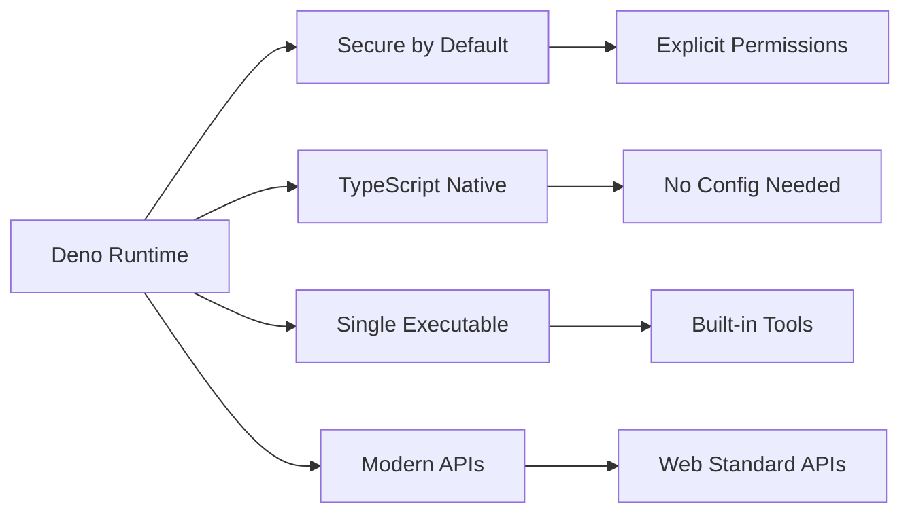
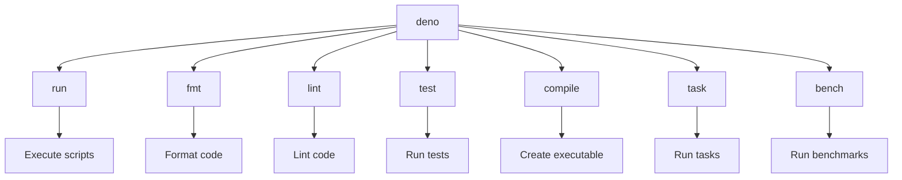
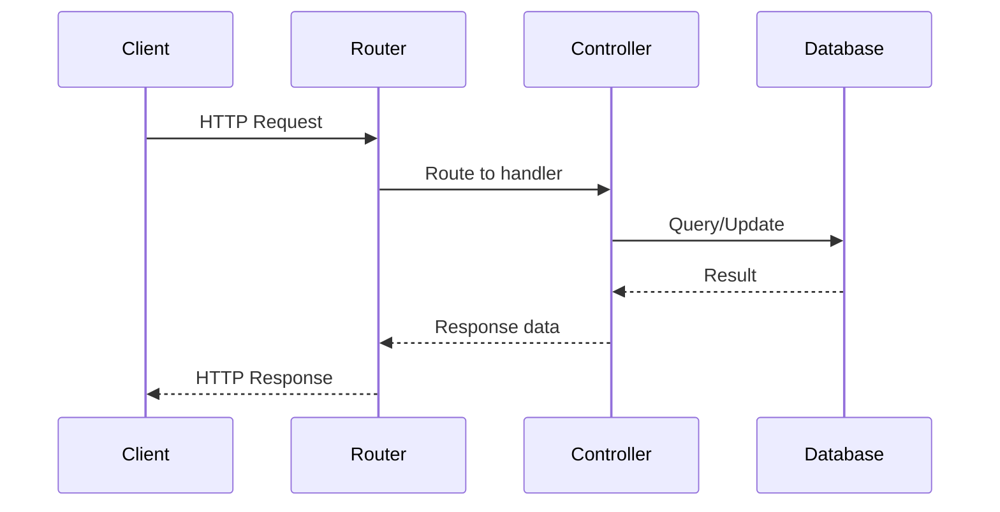
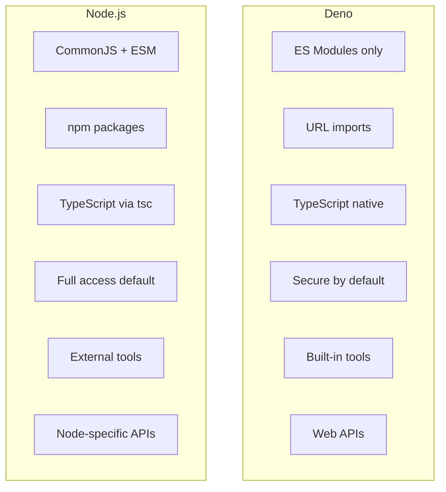

# How to Get Started with Deno Runtime

Author: [nawazdhandala](https://www.github.com/nawazdhandala)

Tags: Deno, TypeScript, JavaScript, Runtime

Description: A comprehensive guide to getting started with Deno runtime, covering installation, project setup, module system, permissions, TypeScript support, and practical examples for building modern applications.

---

> Deno is a modern runtime for JavaScript and TypeScript that addresses many of the design shortcomings in Node.js. Built by Ryan Dahl, the original creator of Node.js, Deno offers first-class TypeScript support, a secure-by-default permission system, and a streamlined developer experience with built-in tooling.

Whether you're coming from Node.js or starting fresh with server-side JavaScript, Deno provides a clean slate for building modern applications. This guide walks you through everything you need to know to get productive with Deno quickly.

---

## Why Choose Deno?

Before diving into the technical details, let's understand what makes Deno stand out:



**Key advantages of Deno include:**

- **Security first**: No file, network, or environment access unless explicitly granted
- **TypeScript out of the box**: No configuration or transpilation setup required
- **Web-compatible APIs**: Uses `fetch`, `URL`, `WebSocket`, and other browser APIs
- **Single executable**: The Deno binary includes everything you need
- **Built-in tooling**: Formatter, linter, test runner, and bundler are included
- **Modern module system**: Uses ES modules with URL imports, no package.json needed

---

## Prerequisites

Before we begin, ensure you have:
- A terminal or command prompt
- Basic familiarity with JavaScript or TypeScript
- A code editor (VS Code recommended with the Deno extension)

---

## Installation

Deno installation is straightforward across all major platforms. The runtime is distributed as a single executable with no external dependencies.

### macOS

Using Homebrew is the recommended installation method for macOS. It handles updates and PATH configuration automatically:

```bash
# Install Deno using Homebrew package manager
brew install deno

# Verify the installation was successful
deno --version
```

Alternatively, you can use the official install script which downloads the latest release directly:

```bash
# Download and run the official installation script
# This installs Deno to ~/.deno/bin
curl -fsSL https://deno.land/install.sh | sh

# Add Deno to your PATH by adding this to ~/.zshrc or ~/.bashrc
export DENO_INSTALL="$HOME/.deno"
export PATH="$DENO_INSTALL/bin:$PATH"

# Reload your shell configuration
source ~/.zshrc
```

### Linux

The shell installer works on most Linux distributions:

```bash
# Install using the official shell script
curl -fsSL https://deno.land/install.sh | sh

# For system-wide installation, move the binary
sudo mv ~/.deno/bin/deno /usr/local/bin/

# Verify installation
deno --version
```

### Windows

Using PowerShell, you can install Deno with a single command:

```powershell
# Install Deno using the PowerShell installer script
irm https://deno.land/install.ps1 | iex

# Verify the installation
deno --version
```

### Verifying Installation

After installation, verify everything is working correctly. The version command shows the versions of Deno, V8 engine, and TypeScript:

```bash
# Check Deno version and component versions
deno --version

# Expected output:
# deno 2.1.4 (release, aarch64-apple-darwin)
# v8 13.0.245.12-rusty
# typescript 5.6.2
```

---

## Your First Deno Program

Let's create a simple "Hello, World!" program to verify everything works.

### Hello World in TypeScript

Create a file named `hello.ts` with the following content. Deno automatically handles TypeScript without any configuration:

```typescript
// hello.ts
// This is a simple TypeScript program that Deno runs directly
// No tsconfig.json or compilation step required

const greeting: string = "Hello, Deno!";
const currentTime: Date = new Date();

// Using template literals for formatted output
console.log(`${greeting}`);
console.log(`Current time: ${currentTime.toLocaleString()}`);

// Deno supports top-level await natively
const encoder = new TextEncoder();
const data = encoder.encode("Writing directly to stdout\n");

// Using web-standard APIs that work in both browser and Deno
await Deno.stdout.write(data);
```

Run this program using the `deno run` command:

```bash
# Execute the TypeScript file directly
deno run hello.ts
```

---

## Essential Deno Commands

Deno comes with a comprehensive CLI that covers all development needs. Here's an overview of the most important commands:



### Running Scripts

The `run` command executes JavaScript or TypeScript files. Use flags to grant specific permissions:

```bash
# Run a local file
deno run app.ts

# Run with all permissions (use with caution)
deno run --allow-all app.ts

# Run a script from a URL
deno run https://deno.land/std/examples/welcome.ts

# Run with specific permissions
deno run --allow-net --allow-read app.ts

# Run with watch mode for development
deno run --watch app.ts
```

### Formatting Code

The built-in formatter enforces consistent code style without any configuration:

```bash
# Format all TypeScript and JavaScript files in current directory
deno fmt

# Format specific files
deno fmt src/main.ts src/utils.ts

# Check formatting without modifying files
deno fmt --check

# Format and write to stdout
deno fmt --stdout app.ts
```

### Linting Code

The linter catches common issues and enforces best practices:

```bash
# Lint all files in current directory
deno lint

# Lint specific files
deno lint src/

# Show all available lint rules
deno lint --rules
```

### Running Tests

Deno has a built-in test runner that supports TypeScript:

```bash
# Run all tests (files matching *_test.ts, *.test.ts, etc.)
deno test

# Run tests with permissions
deno test --allow-read --allow-net

# Run specific test file
deno test tests/api_test.ts

# Run tests with coverage
deno test --coverage=coverage/

# Generate coverage report
deno coverage coverage/
```

### Compiling to Executable

You can compile Deno applications to standalone executables:

```bash
# Compile to an executable for the current platform
deno compile --allow-net --allow-read app.ts

# Compile with a custom output name
deno compile --output myapp app.ts

# Cross-compile for different targets
deno compile --target x86_64-unknown-linux-gnu app.ts
deno compile --target x86_64-pc-windows-msvc app.ts
deno compile --target x86_64-apple-darwin app.ts
```

---

## The Deno Permission System

Security is a core feature of Deno. By default, scripts have no access to the file system, network, or environment variables. You must explicitly grant permissions.

### Permission Flags

Here's a comprehensive list of permission flags and their purposes:

```bash
# File system read access
deno run --allow-read app.ts                    # Read anywhere
deno run --allow-read=/tmp,./data app.ts        # Read specific paths only

# File system write access
deno run --allow-write app.ts                   # Write anywhere
deno run --allow-write=./output app.ts          # Write to specific directory

# Network access
deno run --allow-net app.ts                     # All network access
deno run --allow-net=api.example.com:443 app.ts # Specific host and port

# Environment variables
deno run --allow-env app.ts                     # All env vars
deno run --allow-env=API_KEY,DATABASE_URL app.ts # Specific variables

# Run subprocesses
deno run --allow-run app.ts                     # Run any subprocess
deno run --allow-run=git,npm app.ts             # Run specific commands

# High-resolution time (for timing attacks prevention)
deno run --allow-hrtime app.ts

# FFI (Foreign Function Interface)
deno run --allow-ffi app.ts
```

### Permission Prompts

Instead of granting permissions upfront, you can use `--prompt` to get asked at runtime when permissions are needed:

```bash
# Enable permission prompts for interactive approval
deno run --prompt app.ts
```

### Practical Permission Example

This example demonstrates how to write a secure file reader that only accesses specific directories:

```typescript
// secure_reader.ts
// This script reads files from a specified directory
// Run with: deno run --allow-read=./data secure_reader.ts

async function readDataFiles(directory: string): Promise<void> {
  console.log(`Reading files from: ${directory}`);

  // Iterate through directory entries
  for await (const entry of Deno.readDir(directory)) {
    if (entry.isFile && entry.name.endsWith(".json")) {
      const filePath = `${directory}/${entry.name}`;
      const content = await Deno.readTextFile(filePath);
      const data = JSON.parse(content);

      console.log(`File: ${entry.name}`);
      console.log(`Content: ${JSON.stringify(data, null, 2)}\n`);
    }
  }
}

// Main execution
const dataDir = "./data";

try {
  await readDataFiles(dataDir);
} catch (error) {
  if (error instanceof Deno.errors.PermissionDenied) {
    console.error("Permission denied. Run with: deno run --allow-read=./data");
  } else {
    throw error;
  }
}
```

---

## Module System

Deno uses ES modules with URL-based imports. This eliminates the need for a package manager like npm.

### Importing from URLs

Deno fetches and caches modules from URLs. The standard library is available at `deno.land/std`:

```typescript
// importing_modules.ts
// Import directly from URLs - Deno caches these automatically

// Standard library imports
import { serve } from "https://deno.land/std@0.220.0/http/server.ts";
import { join } from "https://deno.land/std@0.220.0/path/mod.ts";
import { parse } from "https://deno.land/std@0.220.0/flags/mod.ts";

// Third-party modules from deno.land/x
import { Application } from "https://deno.land/x/oak@v12.6.1/mod.ts";

// npm packages using the npm: specifier
import chalk from "npm:chalk@5.3.0";
import express from "npm:express@4.18.2";

// Version pinning is important for reproducible builds
// Always specify exact versions in production code
```

### Import Maps

For larger projects, use import maps to create cleaner import statements:

Create a `deno.json` file with your import mappings:

```json
{
  "imports": {
    "@std/": "https://deno.land/std@0.220.0/",
    "oak": "https://deno.land/x/oak@v12.6.1/mod.ts",
    "chalk": "npm:chalk@5.3.0"
  }
}
```

Now you can use shorter import paths in your code:

```typescript
// app.ts
// With import maps, imports are cleaner and easier to maintain

import { serve } from "@std/http/server.ts";
import { join } from "@std/path/mod.ts";
import { Application } from "oak";
import chalk from "chalk";

console.log(chalk.blue("Server starting..."));
```

### Using npm Packages

Deno supports npm packages directly using the `npm:` specifier:

```typescript
// npm_example.ts
// Using npm packages in Deno is straightforward

import express from "npm:express@4.18.2";
import cors from "npm:cors@2.8.5";
import { z } from "npm:zod@3.22.4";

// Define a schema using Zod
const UserSchema = z.object({
  name: z.string().min(2),
  email: z.string().email(),
  age: z.number().min(0).max(150),
});

// Create Express app
const app = express();
app.use(cors());
app.use(express.json());

// Endpoint with validation
app.post("/users", (req, res) => {
  const result = UserSchema.safeParse(req.body);

  if (!result.success) {
    return res.status(400).json({ errors: result.error.errors });
  }

  return res.json({ message: "User created", user: result.data });
});

app.listen(3000, () => {
  console.log("Server running on http://localhost:3000");
});
```

---

## TypeScript Support

Deno treats TypeScript as a first-class language. No configuration files or build steps are needed.

### TypeScript Features

All modern TypeScript features work out of the box:

```typescript
// typescript_features.ts
// Demonstrating TypeScript features in Deno

// Interfaces and type definitions
interface User {
  id: number;
  name: string;
  email: string;
  createdAt: Date;
}

// Generic functions with constraints
function findById<T extends { id: number }>(items: T[], id: number): T | undefined {
  return items.find((item) => item.id === id);
}

// Enums
enum HttpStatus {
  OK = 200,
  Created = 201,
  BadRequest = 400,
  NotFound = 404,
  InternalServerError = 500,
}

// Type guards
function isUser(obj: unknown): obj is User {
  return (
    typeof obj === "object" &&
    obj !== null &&
    "id" in obj &&
    "name" in obj &&
    "email" in obj
  );
}

// Async/await with proper typing
async function fetchUser(id: number): Promise<User | null> {
  try {
    const response = await fetch(`https://api.example.com/users/${id}`);

    if (response.status === HttpStatus.NotFound) {
      return null;
    }

    const data: unknown = await response.json();

    if (isUser(data)) {
      return { ...data, createdAt: new Date(data.createdAt) };
    }

    throw new Error("Invalid user data received");
  } catch (error) {
    console.error(`Failed to fetch user ${id}:`, error);
    throw error;
  }
}

// Utility types
type UserCreate = Omit<User, "id" | "createdAt">;
type UserUpdate = Partial<UserCreate>;

// Using the types
const newUser: UserCreate = {
  name: "John Doe",
  email: "john@example.com",
};

console.log("New user:", newUser);
```

### Custom TypeScript Configuration

While Deno works without configuration, you can customize TypeScript behavior in `deno.json`:

```json
{
  "compilerOptions": {
    "strict": true,
    "noImplicitAny": true,
    "noUnusedLocals": true,
    "noUnusedParameters": true,
    "noImplicitReturns": true,
    "noFallthroughCasesInSwitch": true
  }
}
```

---

## Building a REST API

Let's build a practical REST API using Oak, a popular Deno web framework:



Create a complete API with the following structure:

```typescript
// api.ts
// A complete REST API example using Oak framework
// Run with: deno run --allow-net api.ts

import { Application, Router, Context } from "https://deno.land/x/oak@v12.6.1/mod.ts";

// Type definitions for our data
interface Task {
  id: string;
  title: string;
  completed: boolean;
  createdAt: Date;
}

// In-memory database (use a real database in production)
const tasks: Map<string, Task> = new Map();

// Helper function to generate unique IDs
function generateId(): string {
  return crypto.randomUUID();
}

// Create router instance
const router = new Router();

// GET /api/tasks - List all tasks
router.get("/api/tasks", (ctx: Context) => {
  const taskList = Array.from(tasks.values());
  ctx.response.body = {
    success: true,
    data: taskList,
    count: taskList.length,
  };
});

// GET /api/tasks/:id - Get a single task
router.get("/api/tasks/:id", (ctx: Context) => {
  const id = ctx.params.id;
  const task = tasks.get(id!);

  if (!task) {
    ctx.response.status = 404;
    ctx.response.body = {
      success: false,
      error: "Task not found",
    };
    return;
  }

  ctx.response.body = {
    success: true,
    data: task,
  };
});

// POST /api/tasks - Create a new task
router.post("/api/tasks", async (ctx: Context) => {
  const body = await ctx.request.body.json();

  if (!body.title || typeof body.title !== "string") {
    ctx.response.status = 400;
    ctx.response.body = {
      success: false,
      error: "Title is required and must be a string",
    };
    return;
  }

  const task: Task = {
    id: generateId(),
    title: body.title.trim(),
    completed: false,
    createdAt: new Date(),
  };

  tasks.set(task.id, task);

  ctx.response.status = 201;
  ctx.response.body = {
    success: true,
    data: task,
  };
});

// PUT /api/tasks/:id - Update a task
router.put("/api/tasks/:id", async (ctx: Context) => {
  const id = ctx.params.id;
  const existingTask = tasks.get(id!);

  if (!existingTask) {
    ctx.response.status = 404;
    ctx.response.body = {
      success: false,
      error: "Task not found",
    };
    return;
  }

  const body = await ctx.request.body.json();

  const updatedTask: Task = {
    ...existingTask,
    title: body.title ?? existingTask.title,
    completed: body.completed ?? existingTask.completed,
  };

  tasks.set(id!, updatedTask);

  ctx.response.body = {
    success: true,
    data: updatedTask,
  };
});

// DELETE /api/tasks/:id - Delete a task
router.delete("/api/tasks/:id", (ctx: Context) => {
  const id = ctx.params.id;

  if (!tasks.has(id!)) {
    ctx.response.status = 404;
    ctx.response.body = {
      success: false,
      error: "Task not found",
    };
    return;
  }

  tasks.delete(id!);

  ctx.response.status = 204;
});

// Create and configure the application
const app = new Application();

// Logger middleware
app.use(async (ctx, next) => {
  const start = Date.now();
  await next();
  const ms = Date.now() - start;
  console.log(`${ctx.request.method} ${ctx.request.url} - ${ms}ms`);
});

// Error handling middleware
app.use(async (ctx, next) => {
  try {
    await next();
  } catch (error) {
    console.error("Error:", error);
    ctx.response.status = 500;
    ctx.response.body = {
      success: false,
      error: "Internal server error",
    };
  }
});

// Mount router
app.use(router.routes());
app.use(router.allowedMethods());

// Start server
const port = 8000;
console.log(`Server running on http://localhost:${port}`);
await app.listen({ port });
```

---

## Writing Tests

Deno has a built-in test runner. Create test files with `_test.ts` suffix:

```typescript
// tasks_test.ts
// Unit tests for task operations
// Run with: deno test tasks_test.ts

import { assertEquals, assertExists, assertThrows } from "https://deno.land/std@0.220.0/assert/mod.ts";

// Function to test
function createTask(title: string): { id: string; title: string; completed: boolean } {
  if (!title || title.trim().length === 0) {
    throw new Error("Title is required");
  }

  return {
    id: crypto.randomUUID(),
    title: title.trim(),
    completed: false,
  };
}

// Test cases using Deno.test
Deno.test("createTask - creates a task with correct properties", () => {
  const task = createTask("Buy groceries");

  assertExists(task.id);
  assertEquals(task.title, "Buy groceries");
  assertEquals(task.completed, false);
});

Deno.test("createTask - trims whitespace from title", () => {
  const task = createTask("  Clean the house  ");

  assertEquals(task.title, "Clean the house");
});

Deno.test("createTask - throws error for empty title", () => {
  assertThrows(
    () => createTask(""),
    Error,
    "Title is required"
  );
});

Deno.test("createTask - throws error for whitespace-only title", () => {
  assertThrows(
    () => createTask("   "),
    Error,
    "Title is required"
  );
});

// Async test example
Deno.test("async test - fetches data successfully", async () => {
  const response = await fetch("https://httpbin.org/get");
  assertEquals(response.status, 200);
});

// Test with setup and teardown using test steps
Deno.test("task lifecycle", async (t) => {
  let taskId: string;

  await t.step("create task", () => {
    const task = createTask("Test task");
    taskId = task.id;
    assertExists(taskId);
  });

  await t.step("task has valid UUID", () => {
    // UUID format validation
    const uuidRegex = /^[0-9a-f]{8}-[0-9a-f]{4}-4[0-9a-f]{3}-[89ab][0-9a-f]{3}-[0-9a-f]{12}$/i;
    assertEquals(uuidRegex.test(taskId), true);
  });
});
```

---

## Deno vs Node.js Comparison

Understanding the differences helps you transition smoothly:



| Feature | Deno | Node.js |
|---------|------|---------|
| Module System | ES Modules only | CommonJS + ES Modules |
| Package Management | URL imports, npm: specifier | npm, yarn, pnpm |
| TypeScript | Built-in, no config | Requires setup |
| Security | Secure by default | Full access by default |
| Standard Library | Reviewed and maintained | Third-party packages |
| Top-level await | Supported | Supported (ESM only) |
| Browser APIs | fetch, WebSocket, etc. | Requires polyfills |
| Built-in Tools | fmt, lint, test, bundle | External packages |

### Migration Tips

When migrating from Node.js to Deno:

```typescript
// Node.js style (DOES NOT WORK in Deno)
// const fs = require('fs');
// const path = require('path');

// Deno style - use standard library or built-in APIs
import { join } from "https://deno.land/std@0.220.0/path/mod.ts";

// Reading files
// Node.js: fs.readFileSync('file.txt', 'utf8')
// Deno:
const content = await Deno.readTextFile("file.txt");

// Environment variables
// Node.js: process.env.API_KEY
// Deno:
const apiKey = Deno.env.get("API_KEY");

// Current working directory
// Node.js: process.cwd()
// Deno:
const cwd = Deno.cwd();

// Command line arguments
// Node.js: process.argv
// Deno:
const args = Deno.args;
```

---

## Best Practices Summary

### 1. Always Pin Dependency Versions

```typescript
// Good: Pinned versions for reproducibility
import { serve } from "https://deno.land/std@0.220.0/http/server.ts";

// Bad: Unpinned version may break unexpectedly
import { serve } from "https://deno.land/std/http/server.ts";
```

### 2. Use Minimal Permissions

```bash
# Good: Request only what you need
deno run --allow-net=api.example.com --allow-read=./config app.ts

# Bad: Overly permissive
deno run --allow-all app.ts
```

### 3. Use Import Maps for Maintainability

Keep your imports clean and centralized by using `deno.json`:

```json
{
  "imports": {
    "@std/": "https://deno.land/std@0.220.0/",
    "@app/": "./src/"
  }
}
```

### 4. Leverage Built-in Tools

```bash
# Format before committing
deno fmt

# Lint for issues
deno lint

# Run tests with coverage
deno test --coverage
```

### 5. Use Type Annotations

```typescript
// Good: Explicit types improve code clarity
function processData(input: string[]): Record<string, number> {
  return input.reduce((acc, item) => {
    acc[item] = (acc[item] || 0) + 1;
    return acc;
  }, {} as Record<string, number>);
}

// Avoid: Implicit any types
function processData(input) {
  // ...
}
```

### 6. Handle Errors Gracefully

```typescript
// Always handle permission errors explicitly
try {
  const data = await Deno.readTextFile("config.json");
} catch (error) {
  if (error instanceof Deno.errors.PermissionDenied) {
    console.error("Permission denied. Add --allow-read flag.");
    Deno.exit(1);
  }
  throw error;
}
```

### 7. Use deno.json for Project Configuration

```json
{
  "name": "my-project",
  "version": "1.0.0",
  "exports": "./mod.ts",
  "tasks": {
    "dev": "deno run --watch --allow-net main.ts",
    "test": "deno test --allow-read",
    "lint": "deno lint && deno fmt --check"
  },
  "imports": {
    "@std/": "https://deno.land/std@0.220.0/"
  },
  "compilerOptions": {
    "strict": true
  }
}
```

---

## Conclusion

Deno represents a modern approach to JavaScript and TypeScript runtime design. By learning from Node.js's historical challenges, it provides a more secure, developer-friendly experience with built-in TypeScript support, web-standard APIs, and comprehensive tooling.

Key takeaways from this guide:

- **Installation is simple**: A single executable with no dependencies
- **Security is built-in**: Explicit permissions prevent unauthorized access
- **TypeScript works immediately**: No configuration or build steps required
- **Modern module system**: URL imports with excellent npm compatibility
- **Built-in tooling**: Formatter, linter, and test runner are included
- **Web APIs are native**: Use familiar browser APIs on the server

Whether you're building REST APIs, CLI tools, or web applications, Deno provides a solid foundation. Start with small projects to familiarize yourself with the ecosystem, then gradually adopt it for larger applications.

The future of server-side JavaScript is evolving, and Deno is at the forefront of that evolution. Give it a try on your next project and experience the difference a modern runtime can make.

---

*Looking to monitor your Deno applications in production? [OneUptime](https://oneuptime.com) provides comprehensive observability with support for logs, metrics, and traces. Track performance, catch errors early, and keep your Deno services running smoothly.*

**Related Reading:**
- [How to Instrument Python Applications with OpenTelemetry](https://oneuptime.com/blog/post/2025-01-06-instrument-python-opentelemetry/view)
- [Three Pillars of Observability: Logs, Metrics, Traces](https://oneuptime.com/blog/post/2025-08-20-three-pillars-of-observability-logs-metrics-traces/view)
