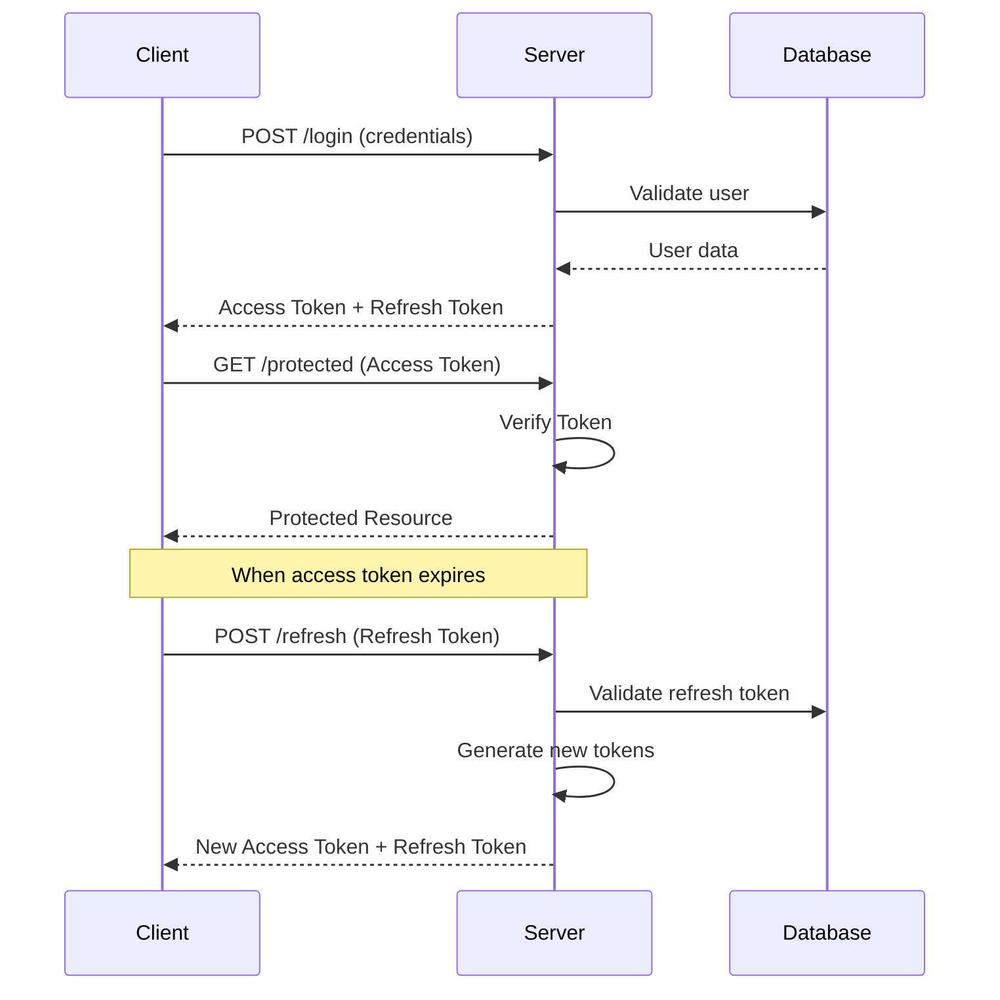
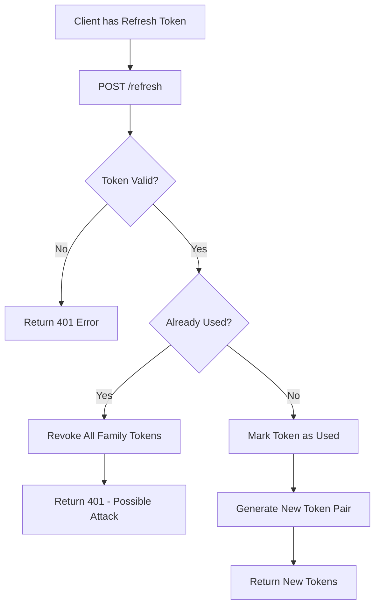
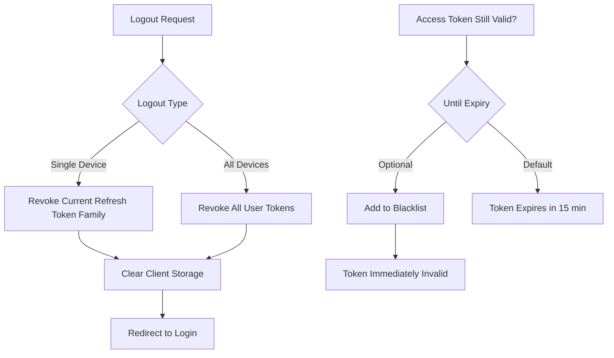

# How to Implement JWT Authentication in Deno

Author: [nawazdhandala](https://github.com/nawazdhandala)

Tags: Deno, JWT, Authentication, Security

Description: Learn how to implement secure JWT authentication in Deno using the Oak framework with refresh token rotation, middleware protection, and production-ready security practices.

---

> JWT authentication in Deno combines the security benefits of JSON Web Tokens with Deno's modern runtime features. This guide walks you through implementing a complete authentication system with access tokens, refresh tokens, protected routes, and secure token storage.

Deno's built-in TypeScript support, secure-by-default permissions, and modern API design make it an excellent choice for building secure authentication systems. This guide covers everything from basic token creation to advanced patterns like token rotation and revocation.

---

## Understanding JWT Authentication

### What is a JWT?

A JSON Web Token (JWT) is a compact, URL-safe means of representing claims between two parties. It consists of three parts separated by dots:

```
Header.Payload.Signature

eyJhbGciOiJIUzI1NiIsInR5cCI6IkpXVCJ9.
eyJzdWIiOiJ1c2VyMTIzIiwiZXhwIjoxNzA2NzAwMDAwfQ.
K8_PuV7qJkN5vF2mL3xR9yH4wZ1aB6cD8eF0gI2jK4M
```

- **Header**: Contains the signing algorithm (HS256, RS256) and token type
- **Payload**: Contains claims like user ID, expiration time, and custom data
- **Signature**: Cryptographic signature to verify token integrity

### Authentication Flow

The following diagram illustrates the complete JWT authentication flow including login, accessing protected resources, and token refresh:



---

## Project Setup

### Dependencies

Create a `deps.ts` file to centralize all dependencies. This pattern is common in Deno projects and makes it easy to manage versions across your application.

```typescript
// deps.ts
// Centralized dependencies for the authentication module

// Oak framework for HTTP server and routing
export { Application, Router, Context } from "https://deno.land/x/oak@v12.6.1/mod.ts";
export type { Middleware, RouterContext } from "https://deno.land/x/oak@v12.6.1/mod.ts";

// JWT library for token creation and verification
export { create, verify, getNumericDate } from "https://deno.land/x/djwt@v3.0.1/mod.ts";
export type { Header, Payload } from "https://deno.land/x/djwt@v3.0.1/mod.ts";

// Password hashing with bcrypt
export { hash, compare } from "https://deno.land/x/bcrypt@v0.4.1/mod.ts";

// Standard library utilities
export { load } from "https://deno.land/std@0.208.0/dotenv/mod.ts";
```

### Environment Configuration

Store sensitive configuration in environment variables. Never commit secrets to version control. Create a `.env` file for local development.

```typescript
// config.ts
// Application configuration loaded from environment variables

import { load } from "./deps.ts";

// Load environment variables from .env file in development
const env = await load();

// JWT secret key - must be at least 256 bits for HS256
// Generate with: openssl rand -base64 32
export const JWT_SECRET = Deno.env.get("JWT_SECRET") || env["JWT_SECRET"];

if (!JWT_SECRET || JWT_SECRET.length < 32) {
  throw new Error("JWT_SECRET must be set and at least 32 characters long");
}

// Token expiration times
export const ACCESS_TOKEN_EXPIRES_IN = 15 * 60; // 15 minutes in seconds
export const REFRESH_TOKEN_EXPIRES_IN = 7 * 24 * 60 * 60; // 7 days in seconds

// Server configuration
export const PORT = parseInt(Deno.env.get("PORT") || env["PORT"] || "8000");
```

---

## Creating JWT Tokens

### Generating the Cryptographic Key

Deno's crypto API requires a CryptoKey object for signing JWTs. This function creates a key from your secret string that can be used for both signing and verification.

```typescript
// crypto_key.ts
// Cryptographic key generation for JWT signing

import { JWT_SECRET } from "./config.ts";

// Convert string secret to CryptoKey for HMAC signing
// This key is used for both creating and verifying tokens
export async function getCryptoKey(): Promise<CryptoKey> {
  const encoder = new TextEncoder();
  const keyData = encoder.encode(JWT_SECRET);

  return await crypto.subtle.importKey(
    "raw",
    keyData,
    { name: "HMAC", hash: "SHA-256" },
    false, // Not extractable
    ["sign", "verify"]
  );
}

// Cache the key to avoid regenerating it on every request
let cachedKey: CryptoKey | null = null;

export async function getKey(): Promise<CryptoKey> {
  if (!cachedKey) {
    cachedKey = await getCryptoKey();
  }
  return cachedKey;
}
```

### Token Creation Functions

These functions create access and refresh tokens with appropriate expiration times and claims. Access tokens are short-lived for security, while refresh tokens are longer-lived but tracked for revocation.

```typescript
// jwt_service.ts
// JWT token creation and verification service

import { create, verify, getNumericDate, Header, Payload } from "./deps.ts";
import { getKey } from "./crypto_key.ts";
import { ACCESS_TOKEN_EXPIRES_IN, REFRESH_TOKEN_EXPIRES_IN } from "./config.ts";

// Standard JWT header for HS256 algorithm
const header: Header = {
  alg: "HS256",
  typ: "JWT",
};

// User payload interface for type safety
export interface UserPayload {
  userId: string;
  email: string;
  role?: string;
}

// Token pair returned after successful authentication
export interface TokenPair {
  accessToken: string;
  refreshToken: string;
  expiresIn: number;
}

/**
 * Create a short-lived access token for API authentication
 * Access tokens should be kept in memory on the client
 */
export async function createAccessToken(user: UserPayload): Promise<string> {
  const key = await getKey();
  const now = Date.now();

  const payload: Payload = {
    // Standard JWT claims
    iss: "your-app-name",           // Issuer
    sub: user.userId,                // Subject (user ID)
    iat: getNumericDate(0),         // Issued at (current time)
    exp: getNumericDate(ACCESS_TOKEN_EXPIRES_IN), // Expiration time

    // Custom claims
    email: user.email,
    role: user.role || "user",
    type: "access",                  // Token type for validation

    // Unique token ID for potential blacklisting
    jti: crypto.randomUUID(),
  };

  return await create(header, payload, key);
}

/**
 * Create a longer-lived refresh token for obtaining new access tokens
 * Refresh tokens should be stored securely (HTTP-only cookie recommended)
 */
export async function createRefreshToken(user: UserPayload): Promise<string> {
  const key = await getKey();

  const payload: Payload = {
    iss: "your-app-name",
    sub: user.userId,
    iat: getNumericDate(0),
    exp: getNumericDate(REFRESH_TOKEN_EXPIRES_IN),

    type: "refresh",
    jti: crypto.randomUUID(),

    // Family ID for detecting token reuse attacks
    family: crypto.randomUUID(),
  };

  return await create(header, payload, key);
}

/**
 * Generate both access and refresh tokens for a user
 * Call this after successful login or registration
 */
export async function createTokenPair(user: UserPayload): Promise<TokenPair> {
  const [accessToken, refreshToken] = await Promise.all([
    createAccessToken(user),
    createRefreshToken(user),
  ]);

  return {
    accessToken,
    refreshToken,
    expiresIn: ACCESS_TOKEN_EXPIRES_IN,
  };
}
```

---

## Verifying JWT Tokens

### Token Verification Service

This service verifies tokens and extracts their payload. It includes validation for token type to prevent refresh tokens from being used as access tokens (and vice versa).

```typescript
// jwt_verify.ts
// Token verification and payload extraction

import { verify, Payload } from "./deps.ts";
import { getKey } from "./crypto_key.ts";

// Verified payload with our custom claims
export interface VerifiedPayload extends Payload {
  userId: string;
  email: string;
  role: string;
  type: "access" | "refresh";
  jti: string;
  family?: string;
}

/**
 * Verify a JWT and return its payload
 * Throws an error if the token is invalid or expired
 */
export async function verifyToken(token: string): Promise<VerifiedPayload> {
  const key = await getKey();

  try {
    const payload = await verify(token, key) as VerifiedPayload;

    // Map 'sub' claim to 'userId' for convenience
    payload.userId = payload.sub as string;

    return payload;
  } catch (error) {
    if (error.message.includes("exp")) {
      throw new Error("Token has expired");
    }
    if (error.message.includes("signature")) {
      throw new Error("Invalid token signature");
    }
    throw new Error("Invalid token");
  }
}

/**
 * Verify that a token is specifically an access token
 * Prevents refresh tokens from being used for API access
 */
export async function verifyAccessToken(token: string): Promise<VerifiedPayload> {
  const payload = await verifyToken(token);

  if (payload.type !== "access") {
    throw new Error("Invalid token type: expected access token");
  }

  return payload;
}

/**
 * Verify that a token is specifically a refresh token
 * Prevents access tokens from being used for refresh operations
 */
export async function verifyRefreshToken(token: string): Promise<VerifiedPayload> {
  const payload = await verifyToken(token);

  if (payload.type !== "refresh") {
    throw new Error("Invalid token type: expected refresh token");
  }

  return payload;
}
```

---

## Authentication Middleware

### Creating Protected Route Middleware

The authentication middleware intercepts requests to protected routes, validates the JWT, and attaches user information to the request context for use in route handlers.

```typescript
// middleware/auth.ts
// Authentication middleware for protecting routes

import { Context, Middleware } from "../deps.ts";
import { verifyAccessToken, VerifiedPayload } from "../jwt_verify.ts";

// Extend Oak's state to include user information
export interface AuthState {
  user: VerifiedPayload;
}

/**
 * Extract Bearer token from Authorization header
 * Returns null if header is missing or malformed
 */
function extractBearerToken(authHeader: string | null): string | null {
  if (!authHeader) return null;

  const parts = authHeader.split(" ");
  if (parts.length !== 2 || parts[0].toLowerCase() !== "bearer") {
    return null;
  }

  return parts[1];
}

/**
 * Middleware that requires valid JWT authentication
 * Attaches verified user payload to context.state.user
 */
export const authMiddleware: Middleware<AuthState> = async (ctx, next) => {
  const authHeader = ctx.request.headers.get("Authorization");
  const token = extractBearerToken(authHeader);

  if (!token) {
    ctx.response.status = 401;
    ctx.response.body = {
      error: "Unauthorized",
      message: "Missing or invalid Authorization header",
    };
    return;
  }

  try {
    // Verify token and extract user information
    const payload = await verifyAccessToken(token);

    // Attach user to context for use in route handlers
    ctx.state.user = payload;

    await next();
  } catch (error) {
    ctx.response.status = 401;
    ctx.response.body = {
      error: "Unauthorized",
      message: error.message,
    };
  }
};

/**
 * Middleware that requires a specific role
 * Must be used after authMiddleware
 */
export function requireRole(allowedRoles: string[]): Middleware<AuthState> {
  return async (ctx, next) => {
    const user = ctx.state.user;

    if (!user || !allowedRoles.includes(user.role)) {
      ctx.response.status = 403;
      ctx.response.body = {
        error: "Forbidden",
        message: "Insufficient permissions",
      };
      return;
    }

    await next();
  };
}

/**
 * Optional authentication middleware
 * Attaches user if token is valid, but does not block if missing
 */
export const optionalAuthMiddleware: Middleware<Partial<AuthState>> = async (ctx, next) => {
  const authHeader = ctx.request.headers.get("Authorization");
  const token = extractBearerToken(authHeader);

  if (token) {
    try {
      const payload = await verifyAccessToken(token);
      ctx.state.user = payload;
    } catch {
      // Token invalid, but we continue without user context
    }
  }

  await next();
};
```

---

## Refresh Token Handling

### Token Rotation for Security

Refresh token rotation is a critical security measure. Each time a refresh token is used, it is invalidated and a new one is issued. This limits the window of opportunity for stolen tokens.



This implementation stores refresh tokens in a Map for demonstration. In production, use a database like PostgreSQL or Redis for persistence and to enable horizontal scaling.

```typescript
// token_store.ts
// Refresh token storage and rotation management

interface StoredToken {
  userId: string;
  family: string;
  used: boolean;
  expiresAt: number;
  createdAt: number;
}

// In-memory store for demonstration
// Use Redis or a database in production
const tokenStore = new Map<string, StoredToken>();

/**
 * Store a refresh token's metadata for tracking
 */
export function storeRefreshToken(
  jti: string,
  userId: string,
  family: string,
  expiresAt: number
): void {
  tokenStore.set(jti, {
    userId,
    family,
    used: false,
    expiresAt,
    createdAt: Date.now(),
  });
}

/**
 * Get stored token metadata
 */
export function getStoredToken(jti: string): StoredToken | undefined {
  return tokenStore.get(jti);
}

/**
 * Mark a token as used (for rotation)
 */
export function markTokenAsUsed(jti: string): void {
  const token = tokenStore.get(jti);
  if (token) {
    token.used = true;
    tokenStore.set(jti, token);
  }
}

/**
 * Revoke all tokens in a family (for security incidents)
 */
export function revokeTokenFamily(family: string): void {
  for (const [jti, token] of tokenStore.entries()) {
    if (token.family === family) {
      tokenStore.delete(jti);
    }
  }
}

/**
 * Revoke all tokens for a user (logout everywhere)
 */
export function revokeAllUserTokens(userId: string): void {
  for (const [jti, token] of tokenStore.entries()) {
    if (token.userId === userId) {
      tokenStore.delete(jti);
    }
  }
}

/**
 * Clean up expired tokens periodically
 */
export function cleanupExpiredTokens(): void {
  const now = Date.now();
  for (const [jti, token] of tokenStore.entries()) {
    if (token.expiresAt < now) {
      tokenStore.delete(jti);
    }
  }
}

// Run cleanup every hour
setInterval(cleanupExpiredTokens, 60 * 60 * 1000);
```

### Refresh Token Rotation Implementation

This service handles the complete refresh flow: validating the old token, detecting reuse attacks, and generating new tokens with rotation.

```typescript
// refresh_service.ts
// Secure refresh token rotation service

import { verifyRefreshToken, VerifiedPayload } from "./jwt_verify.ts";
import { createAccessToken, createRefreshToken, TokenPair } from "./jwt_service.ts";
import {
  getStoredToken,
  markTokenAsUsed,
  revokeTokenFamily,
  storeRefreshToken,
} from "./token_store.ts";
import { REFRESH_TOKEN_EXPIRES_IN } from "./config.ts";

/**
 * Rotate refresh token and return new token pair
 * Implements token reuse detection for security
 */
export async function rotateRefreshToken(oldToken: string): Promise<TokenPair> {
  // Verify the refresh token's signature and expiration
  const payload = await verifyRefreshToken(oldToken);

  const storedToken = getStoredToken(payload.jti);

  // Token not found in store (already revoked or never stored)
  if (!storedToken) {
    throw new Error("Refresh token not found or already revoked");
  }

  // SECURITY: Detect token reuse attack
  // If a token has been used before, an attacker may have stolen it
  if (storedToken.used) {
    // Revoke entire token family to protect the user
    revokeTokenFamily(storedToken.family);
    throw new Error("Token reuse detected - all sessions revoked for security");
  }

  // Mark the current token as used
  markTokenAsUsed(payload.jti);

  // Create new token pair
  const userPayload = {
    userId: payload.userId,
    email: payload.email,
    role: payload.role,
  };

  const accessToken = await createAccessToken(userPayload);
  const refreshToken = await createRefreshToken(userPayload);

  // Decode new refresh token to get its jti
  const newPayload = await verifyRefreshToken(refreshToken);

  // Store new refresh token with same family for tracking
  storeRefreshToken(
    newPayload.jti,
    payload.userId,
    storedToken.family, // Same family for reuse detection
    Date.now() + REFRESH_TOKEN_EXPIRES_IN * 1000
  );

  return {
    accessToken,
    refreshToken,
    expiresIn: 15 * 60, // Access token expiry
  };
}
```

---

## Complete API Routes

### Authentication Routes

This router implements all authentication endpoints: registration, login, token refresh, and logout. Each endpoint includes proper error handling and security measures.

```typescript
// routes/auth.ts
// Complete authentication API routes

import { Router, Context } from "../deps.ts";
import { hash, compare } from "../deps.ts";
import { createTokenPair, UserPayload } from "../jwt_service.ts";
import { verifyRefreshToken } from "../jwt_verify.ts";
import { rotateRefreshToken } from "../refresh_service.ts";
import {
  storeRefreshToken,
  revokeAllUserTokens,
  revokeTokenFamily,
} from "../token_store.ts";
import { authMiddleware, AuthState } from "../middleware/auth.ts";
import { REFRESH_TOKEN_EXPIRES_IN } from "../config.ts";

const authRouter = new Router<AuthState>();

// In-memory user store for demonstration
// Use a database in production
const users = new Map<string, { id: string; email: string; password: string; role: string }>();

/**
 * POST /auth/register
 * Create a new user account
 */
authRouter.post("/register", async (ctx: Context) => {
  const body = await ctx.request.body().value;
  const { email, password } = body;

  // Validate input
  if (!email || !password) {
    ctx.response.status = 400;
    ctx.response.body = { error: "Email and password are required" };
    return;
  }

  if (password.length < 8) {
    ctx.response.status = 400;
    ctx.response.body = { error: "Password must be at least 8 characters" };
    return;
  }

  // Check if user exists
  for (const user of users.values()) {
    if (user.email === email) {
      ctx.response.status = 409;
      ctx.response.body = { error: "Email already registered" };
      return;
    }
  }

  // Hash password with bcrypt
  const hashedPassword = await hash(password);

  // Create user
  const userId = crypto.randomUUID();
  users.set(userId, {
    id: userId,
    email,
    password: hashedPassword,
    role: "user",
  });

  // Generate tokens
  const userPayload: UserPayload = { userId, email, role: "user" };
  const tokens = await createTokenPair(userPayload);

  // Store refresh token metadata
  const refreshPayload = await verifyRefreshToken(tokens.refreshToken);
  storeRefreshToken(
    refreshPayload.jti,
    userId,
    refreshPayload.family!,
    Date.now() + REFRESH_TOKEN_EXPIRES_IN * 1000
  );

  ctx.response.status = 201;
  ctx.response.body = {
    message: "User registered successfully",
    user: { id: userId, email },
    ...tokens,
  };
});

/**
 * POST /auth/login
 * Authenticate user and return tokens
 */
authRouter.post("/login", async (ctx: Context) => {
  const body = await ctx.request.body().value;
  const { email, password } = body;

  // Find user by email
  let foundUser = null;
  for (const user of users.values()) {
    if (user.email === email) {
      foundUser = user;
      break;
    }
  }

  if (!foundUser) {
    ctx.response.status = 401;
    ctx.response.body = { error: "Invalid email or password" };
    return;
  }

  // Verify password
  const validPassword = await compare(password, foundUser.password);
  if (!validPassword) {
    ctx.response.status = 401;
    ctx.response.body = { error: "Invalid email or password" };
    return;
  }

  // Generate tokens
  const userPayload: UserPayload = {
    userId: foundUser.id,
    email: foundUser.email,
    role: foundUser.role,
  };
  const tokens = await createTokenPair(userPayload);

  // Store refresh token metadata
  const refreshPayload = await verifyRefreshToken(tokens.refreshToken);
  storeRefreshToken(
    refreshPayload.jti,
    foundUser.id,
    refreshPayload.family!,
    Date.now() + REFRESH_TOKEN_EXPIRES_IN * 1000
  );

  ctx.response.body = {
    message: "Login successful",
    user: { id: foundUser.id, email: foundUser.email },
    ...tokens,
  };
});

/**
 * POST /auth/refresh
 * Exchange refresh token for new token pair
 */
authRouter.post("/refresh", async (ctx: Context) => {
  const body = await ctx.request.body().value;
  const { refreshToken } = body;

  if (!refreshToken) {
    ctx.response.status = 400;
    ctx.response.body = { error: "Refresh token is required" };
    return;
  }

  try {
    const tokens = await rotateRefreshToken(refreshToken);

    // Store new refresh token metadata
    const refreshPayload = await verifyRefreshToken(tokens.refreshToken);
    storeRefreshToken(
      refreshPayload.jti,
      refreshPayload.userId,
      refreshPayload.family!,
      Date.now() + REFRESH_TOKEN_EXPIRES_IN * 1000
    );

    ctx.response.body = tokens;
  } catch (error) {
    ctx.response.status = 401;
    ctx.response.body = { error: error.message };
  }
});

/**
 * POST /auth/logout
 * Revoke current session tokens
 */
authRouter.post("/logout", authMiddleware, async (ctx: Context<AuthState>) => {
  const user = ctx.state.user;

  // Get refresh token from body to revoke its family
  const body = await ctx.request.body().value;
  const { refreshToken } = body;

  if (refreshToken) {
    try {
      const payload = await verifyRefreshToken(refreshToken);
      if (payload.family) {
        revokeTokenFamily(payload.family);
      }
    } catch {
      // Token already invalid, proceed with logout
    }
  }

  ctx.response.body = { message: "Logged out successfully" };
});

/**
 * POST /auth/logout-all
 * Revoke all sessions for current user
 */
authRouter.post("/logout-all", authMiddleware, (ctx: Context<AuthState>) => {
  const user = ctx.state.user;

  // Revoke all refresh tokens for this user
  revokeAllUserTokens(user.userId);

  ctx.response.body = { message: "All sessions logged out" };
});

export { authRouter };
```

### Protected Routes Example

This example shows how to create protected routes that require authentication. The middleware automatically validates the token and provides user information to the route handler.

```typescript
// routes/protected.ts
// Example protected routes requiring authentication

import { Router, Context } from "../deps.ts";
import { authMiddleware, requireRole, AuthState } from "../middleware/auth.ts";

const protectedRouter = new Router<AuthState>();

// Apply auth middleware to all routes in this router
protectedRouter.use(authMiddleware);

/**
 * GET /api/profile
 * Get current user's profile
 */
protectedRouter.get("/profile", (ctx: Context<AuthState>) => {
  const user = ctx.state.user;

  ctx.response.body = {
    userId: user.userId,
    email: user.email,
    role: user.role,
  };
});

/**
 * GET /api/dashboard
 * Protected dashboard data
 */
protectedRouter.get("/dashboard", (ctx: Context<AuthState>) => {
  const user = ctx.state.user;

  ctx.response.body = {
    message: `Welcome to your dashboard, ${user.email}!`,
    stats: {
      lastLogin: new Date().toISOString(),
      accountAge: "30 days",
    },
  };
});

/**
 * GET /api/admin
 * Admin-only route
 */
protectedRouter.get("/admin", requireRole(["admin"]), (ctx: Context<AuthState>) => {
  ctx.response.body = {
    message: "Welcome, admin!",
    adminFeatures: ["user-management", "system-settings", "audit-logs"],
  };
});

export { protectedRouter };
```

---

## Secure Token Storage

### Cookie-Based Storage for Browsers

For browser-based applications, HTTP-only cookies provide better security than localStorage because they cannot be accessed by JavaScript, protecting against XSS attacks.

```typescript
// cookie_auth.ts
// Secure cookie-based token storage for browser clients

import { Context, Router } from "./deps.ts";
import { createTokenPair } from "./jwt_service.ts";
import { rotateRefreshToken } from "./refresh_service.ts";

const cookieRouter = new Router();

// Cookie security settings
const COOKIE_OPTIONS = {
  httpOnly: true,    // Prevents JavaScript access (XSS protection)
  secure: true,      // Only sent over HTTPS
  sameSite: "Lax" as const,  // CSRF protection
  path: "/",
};

/**
 * POST /auth/cookie/login
 * Login and set tokens in HTTP-only cookies
 */
cookieRouter.post("/cookie/login", async (ctx: Context) => {
  const body = await ctx.request.body().value;
  const { email, password } = body;

  // Authenticate user (implementation same as regular login)
  const user = await authenticateUser(email, password);
  if (!user) {
    ctx.response.status = 401;
    ctx.response.body = { error: "Invalid credentials" };
    return;
  }

  const tokens = await createTokenPair(user);

  // Set access token cookie (short-lived)
  ctx.cookies.set("access_token", tokens.accessToken, {
    ...COOKIE_OPTIONS,
    maxAge: tokens.expiresIn,
  });

  // Set refresh token cookie (longer-lived, restricted path)
  ctx.cookies.set("refresh_token", tokens.refreshToken, {
    ...COOKIE_OPTIONS,
    maxAge: 7 * 24 * 60 * 60, // 7 days
    path: "/auth/cookie/refresh", // Only sent to refresh endpoint
  });

  ctx.response.body = { message: "Logged in successfully" };
});

/**
 * POST /auth/cookie/refresh
 * Refresh tokens using cookie-based storage
 */
cookieRouter.post("/cookie/refresh", async (ctx: Context) => {
  const refreshToken = await ctx.cookies.get("refresh_token");

  if (!refreshToken) {
    ctx.response.status = 401;
    ctx.response.body = { error: "No refresh token" };
    return;
  }

  try {
    const tokens = await rotateRefreshToken(refreshToken);

    // Update cookies with new tokens
    ctx.cookies.set("access_token", tokens.accessToken, {
      ...COOKIE_OPTIONS,
      maxAge: tokens.expiresIn,
    });

    ctx.cookies.set("refresh_token", tokens.refreshToken, {
      ...COOKIE_OPTIONS,
      maxAge: 7 * 24 * 60 * 60,
      path: "/auth/cookie/refresh",
    });

    ctx.response.body = { message: "Tokens refreshed" };
  } catch (error) {
    ctx.response.status = 401;
    ctx.response.body = { error: error.message };
  }
});

/**
 * POST /auth/cookie/logout
 * Clear authentication cookies
 */
cookieRouter.post("/cookie/logout", (ctx: Context) => {
  // Delete cookies by setting maxAge to 0
  ctx.cookies.delete("access_token");
  ctx.cookies.delete("refresh_token", { path: "/auth/cookie/refresh" });

  ctx.response.body = { message: "Logged out successfully" };
});

export { cookieRouter };

// Helper function (implement with your user store)
async function authenticateUser(email: string, password: string) {
  // Implementation depends on your user storage
  return null;
}
```

---

## Logout Handling

### Complete Logout Flow

The following diagram shows the different logout scenarios and how tokens are invalidated:



### Access Token Blacklisting (Optional)

For immediate access token invalidation during logout or security events, maintain a blacklist. This is optional since access tokens are short-lived, but provides stronger security guarantees.

```typescript
// blacklist.ts
// Optional access token blacklist for immediate revocation

// In-memory blacklist with expiration tracking
// Use Redis in production for persistence and distribution
const blacklist = new Map<string, number>(); // jti -> expiry timestamp

/**
 * Add an access token to the blacklist
 * Token remains blacklisted until its original expiry time
 */
export function blacklistToken(jti: string, expiresAt: number): void {
  blacklist.set(jti, expiresAt);
}

/**
 * Check if a token is blacklisted
 */
export function isBlacklisted(jti: string): boolean {
  const expiry = blacklist.get(jti);
  if (!expiry) return false;

  // Clean up if token has expired anyway
  if (expiry < Date.now()) {
    blacklist.delete(jti);
    return false;
  }

  return true;
}

/**
 * Clean up expired entries from blacklist
 */
export function cleanupBlacklist(): void {
  const now = Date.now();
  for (const [jti, expiry] of blacklist.entries()) {
    if (expiry < now) {
      blacklist.delete(jti);
    }
  }
}

// Run cleanup every 15 minutes
setInterval(cleanupBlacklist, 15 * 60 * 1000);
```

---

## Complete Application

### Main Server File

This brings everything together into a complete Deno application with all authentication features enabled.

```typescript
// main.ts
// Complete Deno JWT authentication server

import { Application, Router } from "./deps.ts";
import { authRouter } from "./routes/auth.ts";
import { protectedRouter } from "./routes/protected.ts";
import { cookieRouter } from "./cookie_auth.ts";
import { PORT } from "./config.ts";

const app = new Application();

// Error handling middleware
app.use(async (ctx, next) => {
  try {
    await next();
  } catch (err) {
    console.error("Server error:", err);
    ctx.response.status = 500;
    ctx.response.body = { error: "Internal server error" };
  }
});

// Request logging middleware
app.use(async (ctx, next) => {
  const start = Date.now();
  await next();
  const ms = Date.now() - start;
  console.log(`${ctx.request.method} ${ctx.request.url.pathname} - ${ctx.response.status} - ${ms}ms`);
});

// Security headers middleware
app.use(async (ctx, next) => {
  await next();

  // Prevent clickjacking
  ctx.response.headers.set("X-Frame-Options", "DENY");

  // Prevent MIME type sniffing
  ctx.response.headers.set("X-Content-Type-Options", "nosniff");

  // Prevent token leakage via referrer
  ctx.response.headers.set("Referrer-Policy", "strict-origin-when-cross-origin");

  // Prevent caching of authenticated responses
  if (ctx.request.headers.get("Authorization")) {
    ctx.response.headers.set("Cache-Control", "no-store");
  }
});

// Mount routers
const mainRouter = new Router();

mainRouter.use("/auth", authRouter.routes(), authRouter.allowedMethods());
mainRouter.use("/auth", cookieRouter.routes(), cookieRouter.allowedMethods());
mainRouter.use("/api", protectedRouter.routes(), protectedRouter.allowedMethods());

// Health check endpoint
mainRouter.get("/health", (ctx) => {
  ctx.response.body = { status: "healthy", timestamp: new Date().toISOString() };
});

app.use(mainRouter.routes());
app.use(mainRouter.allowedMethods());

console.log(`Server running on http://localhost:${PORT}`);
await app.listen({ port: PORT });
```

### Running the Application

Run the server with the necessary Deno permissions. The `--allow-net` flag enables network access, and `--allow-env` enables reading environment variables.

```bash
# Set required environment variable
export JWT_SECRET="your-secure-secret-at-least-32-chars-long"

# Run the server
deno run --allow-net --allow-env --allow-read main.ts
```

---

## Security Best Practices Summary

### Token Configuration

| Setting | Recommended Value | Reason |
|---------|-------------------|--------|
| Access Token Expiry | 15-30 minutes | Limits window for stolen tokens |
| Refresh Token Expiry | 7-14 days | Balance between security and UX |
| Algorithm | HS256 or RS256 | RS256 for distributed systems |
| Secret Length | 256+ bits (32+ chars) | Prevents brute force attacks |

### Implementation Checklist

1. **Use strong, random secrets** - Generate with `crypto.randomUUID()` or `openssl rand`
2. **Store secrets in environment variables** - Never commit to version control
3. **Implement token rotation** - New refresh token on each use
4. **Detect token reuse** - Revoke entire family on reuse detection
5. **Use HTTP-only cookies** - For browser-based applications
6. **Set proper cookie flags** - `httpOnly`, `secure`, `sameSite`
7. **Validate token type** - Prevent refresh tokens used as access tokens
8. **Include `jti` claim** - Enables token tracking and revocation
9. **Add rate limiting** - Protect against brute force attacks
10. **Log authentication events** - For security monitoring and auditing

### Common Security Mistakes

```typescript
// BAD: Long-lived access tokens
const expires = 30 * 24 * 60 * 60; // 30 days

// GOOD: Short-lived access tokens
const expires = 15 * 60; // 15 minutes
```

```typescript
// BAD: Hardcoded secret
const secret = "mysecret123";

// GOOD: Environment variable
const secret = Deno.env.get("JWT_SECRET");
```

```typescript
// BAD: No token type validation
const payload = await verify(token, key);
return payload;

// GOOD: Validate token type
const payload = await verify(token, key);
if (payload.type !== "access") {
  throw new Error("Invalid token type");
}
return payload;
```

---

## Conclusion

Implementing secure JWT authentication in Deno requires attention to several key areas:

- **Token lifecycle management** with short-lived access tokens and rotated refresh tokens
- **Proper validation** of all token claims including expiration and type
- **Secure storage** using HTTP-only cookies for browser applications
- **Revocation mechanisms** for logout and security incidents
- **Security middleware** to protect routes and enforce authentication

The patterns shown in this guide provide a production-ready foundation for JWT authentication. Deno's native TypeScript support and secure-by-default permissions model make it well-suited for building secure authentication systems.

Remember that authentication is just one layer of security. Combine these practices with HTTPS, input validation, rate limiting, and security monitoring for a comprehensive security posture.

---

*Need to monitor your authentication system? [OneUptime](https://oneuptime.com) provides real-time monitoring, alerting, and observability for your authentication endpoints and security events.*

**Related Reading:**
- [How to Build REST APIs with Deno and Oak](https://oneuptime.com/blog)
- [How to Handle JWT Authentication Securely in Python](https://oneuptime.com/blog/post/2025-01-06-python-jwt-authentication/view)
