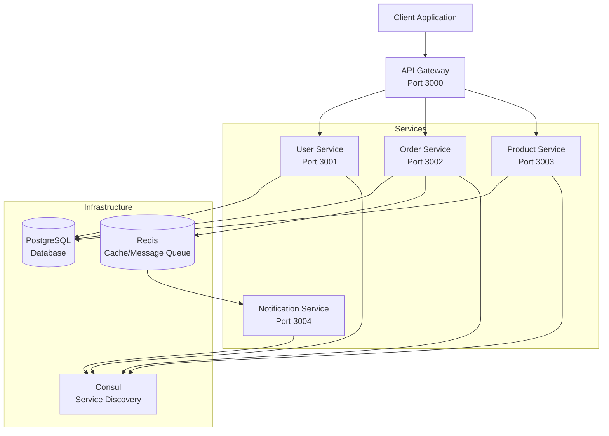
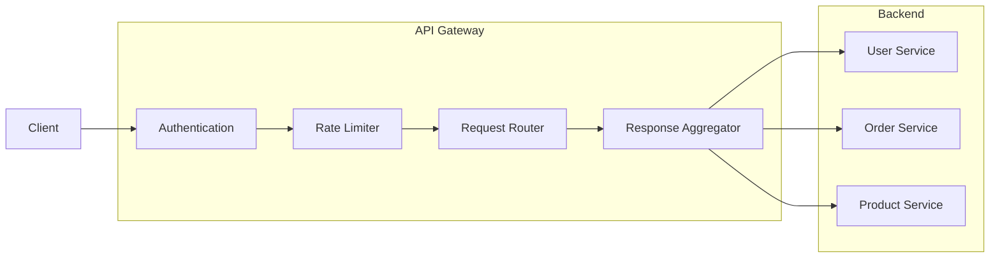

# How to Build Microservices with Deno

Author: [nawazdhandala](https://github.com/nawazdhandala)

Tags: Deno, Microservices, Docker, Distributed Systems

Description: A comprehensive guide to building production-ready microservices with Deno. Learn service communication, API gateway pattern, health checks, logging, tracing, and Docker deployment.

---

> Deno is a modern JavaScript and TypeScript runtime that offers built-in TypeScript support, secure-by-default permissions, and a standard library without npm dependencies. These features make it an excellent choice for building microservices that are secure, maintainable, and easy to deploy. This guide walks you through building a complete microservices architecture with Deno.

Microservices architecture breaks down applications into small, independently deployable services. Each service owns its data, communicates over well-defined APIs, and can be scaled independently. Deno's security model, native TypeScript support, and modern tooling make it particularly well-suited for this architecture.

---

## Microservices Architecture Overview

Before diving into code, let's understand the architecture we'll build. Our example system consists of multiple services that communicate via HTTP and message queues.



---

## Project Structure

A well-organized project structure is essential for maintaining microservices. Each service lives in its own directory with its own configuration and dependencies.

```
deno-microservices/
├── shared/
│   ├── types/
│   │   └── mod.ts
│   ├── middleware/
│   │   └── mod.ts
│   └── utils/
│       └── mod.ts
├── gateway/
│   ├── main.ts
│   ├── routes/
│   └── deno.json
├── services/
│   ├── user-service/
│   │   ├── main.ts
│   │   ├── routes/
│   │   ├── models/
│   │   └── deno.json
│   ├── order-service/
│   │   ├── main.ts
│   │   ├── routes/
│   │   ├── models/
│   │   └── deno.json
│   ├── product-service/
│   │   ├── main.ts
│   │   ├── routes/
│   │   └── deno.json
│   └── notification-service/
│       ├── main.ts
│       └── deno.json
├── docker-compose.yml
└── deno.json
```

---

## Shared Types and Utilities

Before building services, we define shared types and utilities that all services will use. This ensures consistency across the entire system.

The shared types define the data structures that services exchange:

```typescript
// shared/types/mod.ts
// Shared type definitions used across all microservices
// Centralizing types ensures consistency in service communication

export interface User {
  id: string;
  email: string;
  name: string;
  createdAt: Date;
  updatedAt: Date;
}

export interface Product {
  id: string;
  name: string;
  price: number;
  inventory: number;
  description: string;
}

export interface OrderItem {
  productId: string;
  quantity: number;
  price: number;
}

export interface Order {
  id: string;
  userId: string;
  items: OrderItem[];
  total: number;
  status: OrderStatus;
  createdAt: Date;
}

// Use string enums for better serialization across services
export enum OrderStatus {
  PENDING = "pending",
  CONFIRMED = "confirmed",
  SHIPPED = "shipped",
  DELIVERED = "delivered",
  CANCELLED = "cancelled",
}

// Standard API response wrapper for consistent error handling
export interface ApiResponse<T> {
  success: boolean;
  data?: T;
  error?: string;
  timestamp: string;
  traceId?: string; // For distributed tracing correlation
}

// Health check response structure
export interface HealthStatus {
  status: "healthy" | "degraded" | "unhealthy";
  service: string;
  version: string;
  uptime: number;
  checks: Record<string, ComponentHealth>;
}

export interface ComponentHealth {
  status: "healthy" | "unhealthy";
  latency?: number;
  message?: string;
}

// Service registration for discovery
export interface ServiceRegistration {
  name: string;
  address: string;
  port: number;
  tags: string[];
  healthEndpoint: string;
}
```

The shared HTTP client handles service-to-service communication with retry logic and tracing:

```typescript
// shared/utils/http-client.ts
// HTTP client for inter-service communication with retry and tracing support

import { ApiResponse } from "../types/mod.ts";

interface RequestOptions {
  headers?: Record<string, string>;
  timeout?: number;
  retries?: number;
  traceId?: string;
}

export class ServiceClient {
  private baseUrl: string;
  private serviceName: string;
  private defaultTimeout: number;

  constructor(baseUrl: string, serviceName: string, defaultTimeout = 5000) {
    this.baseUrl = baseUrl.replace(/\/$/, ""); // Remove trailing slash
    this.serviceName = serviceName;
    this.defaultTimeout = defaultTimeout;
  }

  // Make HTTP request with automatic retry and timeout handling
  async request<T>(
    method: string,
    path: string,
    body?: unknown,
    options: RequestOptions = {}
  ): Promise<ApiResponse<T>> {
    const { headers = {}, timeout = this.defaultTimeout, retries = 3, traceId } = options;
    
    // Generate trace ID if not provided for request correlation
    const requestTraceId = traceId || crypto.randomUUID();
    
    const requestHeaders: Record<string, string> = {
      "Content-Type": "application/json",
      "X-Trace-Id": requestTraceId,
      "X-Source-Service": this.serviceName,
      ...headers,
    };

    let lastError: Error | null = null;
    
    // Retry loop with exponential backoff
    for (let attempt = 0; attempt < retries; attempt++) {
      try {
        const controller = new AbortController();
        const timeoutId = setTimeout(() => controller.abort(), timeout);

        const response = await fetch(`${this.baseUrl}${path}`, {
          method,
          headers: requestHeaders,
          body: body ? JSON.stringify(body) : undefined,
          signal: controller.signal,
        });

        clearTimeout(timeoutId);

        const data = await response.json();
        return data as ApiResponse<T>;
      } catch (error) {
        lastError = error instanceof Error ? error : new Error(String(error));
        
        // Don't retry on abort (timeout)
        if (error instanceof DOMException && error.name === "AbortError") {
          break;
        }
        
        // Exponential backoff: 100ms, 200ms, 400ms
        if (attempt < retries - 1) {
          await new Promise((resolve) => setTimeout(resolve, 100 * Math.pow(2, attempt)));
        }
      }
    }

    // All retries failed
    return {
      success: false,
      error: `Service ${this.serviceName} unavailable: ${lastError?.message}`,
      timestamp: new Date().toISOString(),
      traceId: requestTraceId,
    };
  }

  // Convenience methods for common HTTP verbs
  get<T>(path: string, options?: RequestOptions) {
    return this.request<T>("GET", path, undefined, options);
  }

  post<T>(path: string, body: unknown, options?: RequestOptions) {
    return this.request<T>("POST", path, body, options);
  }

  put<T>(path: string, body: unknown, options?: RequestOptions) {
    return this.request<T>("PUT", path, body, options);
  }

  delete<T>(path: string, options?: RequestOptions) {
    return this.request<T>("DELETE", path, undefined, options);
  }
}
```

---

## Building a Base Service with Oak

Oak is a middleware framework for Deno inspired by Koa. We create a base service class that provides common functionality like health checks, logging, and graceful shutdown.

```typescript
// shared/base-service.ts
// Base service class that provides common microservice functionality
// All services inherit from this to ensure consistent behavior

import { Application, Router, Context, Middleware } from "https://deno.land/x/oak@v12.6.1/mod.ts";
import { HealthStatus, ComponentHealth } from "./types/mod.ts";

export interface ServiceConfig {
  name: string;
  port: number;
  version: string;
}

export abstract class BaseService {
  protected app: Application;
  protected router: Router;
  protected config: ServiceConfig;
  protected startTime: number;
  protected isShuttingDown = false;

  constructor(config: ServiceConfig) {
    this.config = config;
    this.app = new Application();
    this.router = new Router();
    this.startTime = Date.now();

    // Apply middleware in order: logging -> tracing -> error handling
    this.setupMiddleware();
    this.setupHealthEndpoints();
  }

  // Middleware setup provides cross-cutting concerns
  private setupMiddleware() {
    // Request logging middleware
    this.app.use(this.loggingMiddleware());
    
    // Distributed tracing middleware
    this.app.use(this.tracingMiddleware());
    
    // Error handling middleware (must be early in chain)
    this.app.use(this.errorMiddleware());
  }

  // Log every incoming request with timing information
  private loggingMiddleware(): Middleware {
    return async (ctx, next) => {
      const start = Date.now();
      const traceId = ctx.request.headers.get("X-Trace-Id") || crypto.randomUUID();
      
      // Store trace ID for downstream use
      ctx.state.traceId = traceId;

      await next();

      const duration = Date.now() - start;
      const logEntry = {
        timestamp: new Date().toISOString(),
        service: this.config.name,
        traceId,
        method: ctx.request.method,
        url: ctx.request.url.pathname,
        status: ctx.response.status,
        duration: `${duration}ms`,
      };

      console.log(JSON.stringify(logEntry));
    };
  }

  // Add trace ID to response headers for client correlation
  private tracingMiddleware(): Middleware {
    return async (ctx, next) => {
      const traceId = ctx.state.traceId || crypto.randomUUID();
      ctx.response.headers.set("X-Trace-Id", traceId);
      await next();
    };
  }

  // Global error handler prevents crashes and returns consistent errors
  private errorMiddleware(): Middleware {
    return async (ctx, next) => {
      try {
        await next();
      } catch (error) {
        const message = error instanceof Error ? error.message : "Internal server error";
        
        // Log error with full context for debugging
        console.error(JSON.stringify({
          timestamp: new Date().toISOString(),
          service: this.config.name,
          traceId: ctx.state.traceId,
          error: message,
          stack: error instanceof Error ? error.stack : undefined,
        }));

        ctx.response.status = 500;
        ctx.response.body = {
          success: false,
          error: message,
          timestamp: new Date().toISOString(),
          traceId: ctx.state.traceId,
        };
      }
    };
  }

  // Health endpoints are critical for Kubernetes orchestration
  private setupHealthEndpoints() {
    // Liveness probe - is the process alive?
    this.router.get("/health/live", (ctx) => {
      if (this.isShuttingDown) {
        ctx.response.status = 503;
        ctx.response.body = { status: "shutting_down" };
        return;
      }
      ctx.response.body = { status: "alive" };
    });

    // Readiness probe - can we handle traffic?
    this.router.get("/health/ready", async (ctx) => {
      if (this.isShuttingDown) {
        ctx.response.status = 503;
        ctx.response.body = { status: "shutting_down" };
        return;
      }

      const health = await this.getHealthStatus();
      ctx.response.status = health.status === "healthy" ? 200 : 503;
      ctx.response.body = health;
    });

    // Detailed health for debugging and monitoring dashboards
    this.router.get("/health", async (ctx) => {
      const health = await this.getHealthStatus();
      ctx.response.body = health;
    });
  }

  // Subclasses implement this to check their specific dependencies
  protected abstract checkDependencies(): Promise<Record<string, ComponentHealth>>;

  // Build complete health status including uptime and component checks
  private async getHealthStatus(): Promise<HealthStatus> {
    const checks = await this.checkDependencies();
    const allHealthy = Object.values(checks).every((c) => c.status === "healthy");

    return {
      status: allHealthy ? "healthy" : "unhealthy",
      service: this.config.name,
      version: this.config.version,
      uptime: Math.floor((Date.now() - this.startTime) / 1000),
      checks,
    };
  }

  // Abstract method for service-specific route setup
  protected abstract setupRoutes(): void;

  // Start the service with graceful shutdown support
  async start() {
    this.setupRoutes();
    
    // Mount router after all routes are registered
    this.app.use(this.router.routes());
    this.app.use(this.router.allowedMethods());

    // Handle shutdown signals from Kubernetes/Docker
    const abortController = new AbortController();
    
    Deno.addSignalListener("SIGINT", () => this.shutdown(abortController));
    Deno.addSignalListener("SIGTERM", () => this.shutdown(abortController));

    console.log(`${this.config.name} starting on port ${this.config.port}`);

    await this.app.listen({ 
      port: this.config.port,
      signal: abortController.signal,
    });
  }

  // Graceful shutdown waits for in-flight requests
  private async shutdown(controller: AbortController) {
    console.log(`${this.config.name} shutting down gracefully...`);
    this.isShuttingDown = true;

    // Wait for in-flight requests to complete
    await new Promise((resolve) => setTimeout(resolve, 5000));

    // Cleanup resources
    await this.cleanup();

    controller.abort();
    console.log(`${this.config.name} shutdown complete`);
  }

  // Override in subclasses to cleanup connections
  protected async cleanup(): Promise<void> {
    // Default implementation does nothing
  }
}
```

---

## User Service Implementation

The User Service manages user accounts and authentication. It demonstrates database integration, input validation, and proper error handling.

```typescript
// services/user-service/main.ts
// User Service - handles user registration, authentication, and profiles

import { Context } from "https://deno.land/x/oak@v12.6.1/mod.ts";
import { BaseService, ServiceConfig } from "../../shared/base-service.ts";
import { User, ApiResponse, ComponentHealth } from "../../shared/types/mod.ts";
import { Client } from "https://deno.land/x/postgres@v0.17.0/mod.ts";

// Database client for PostgreSQL connections
let dbClient: Client;

class UserService extends BaseService {
  constructor(config: ServiceConfig) {
    super(config);
  }

  // Check database connectivity for health endpoint
  protected async checkDependencies(): Promise<Record<string, ComponentHealth>> {
    const checks: Record<string, ComponentHealth> = {};
    
    try {
      const start = Date.now();
      await dbClient.queryArray("SELECT 1");
      checks.database = {
        status: "healthy",
        latency: Date.now() - start,
      };
    } catch (error) {
      checks.database = {
        status: "unhealthy",
        message: error instanceof Error ? error.message : "Database error",
      };
    }

    return checks;
  }

  // Define all user-related routes
  protected setupRoutes() {
    // Create new user
    this.router.post("/api/users", async (ctx) => {
      const body = await ctx.request.body().value;
      const result = await this.createUser(body, ctx.state.traceId);
      
      ctx.response.status = result.success ? 201 : 400;
      ctx.response.body = result;
    });

    // Get user by ID
    this.router.get("/api/users/:id", async (ctx) => {
      const userId = ctx.params.id;
      const result = await this.getUser(userId, ctx.state.traceId);
      
      ctx.response.status = result.success ? 200 : 404;
      ctx.response.body = result;
    });

    // Update user
    this.router.put("/api/users/:id", async (ctx) => {
      const userId = ctx.params.id;
      const body = await ctx.request.body().value;
      const result = await this.updateUser(userId, body, ctx.state.traceId);
      
      ctx.response.status = result.success ? 200 : 400;
      ctx.response.body = result;
    });

    // List users with pagination
    this.router.get("/api/users", async (ctx) => {
      const limit = parseInt(ctx.request.url.searchParams.get("limit") || "10");
      const offset = parseInt(ctx.request.url.searchParams.get("offset") || "0");
      const result = await this.listUsers(limit, offset, ctx.state.traceId);
      
      ctx.response.body = result;
    });
  }

  // Create user with validation
  private async createUser(
    data: Partial<User>,
    traceId: string
  ): Promise<ApiResponse<User>> {
    // Validate required fields
    if (!data.email || !data.name) {
      return {
        success: false,
        error: "Email and name are required",
        timestamp: new Date().toISOString(),
        traceId,
      };
    }

    // Validate email format
    const emailRegex = /^[^\s@]+@[^\s@]+\.[^\s@]+$/;
    if (!emailRegex.test(data.email)) {
      return {
        success: false,
        error: "Invalid email format",
        timestamp: new Date().toISOString(),
        traceId,
      };
    }

    try {
      const id = crypto.randomUUID();
      const now = new Date();

      // Insert user into database
      await dbClient.queryArray(
        `INSERT INTO users (id, email, name, created_at, updated_at) 
         VALUES ($1, $2, $3, $4, $5)`,
        [id, data.email, data.name, now, now]
      );

      const user: User = {
        id,
        email: data.email,
        name: data.name,
        createdAt: now,
        updatedAt: now,
      };

      return {
        success: true,
        data: user,
        timestamp: new Date().toISOString(),
        traceId,
      };
    } catch (error) {
      // Handle unique constraint violation (duplicate email)
      if (error instanceof Error && error.message.includes("unique")) {
        return {
          success: false,
          error: "Email already exists",
          timestamp: new Date().toISOString(),
          traceId,
        };
      }
      throw error;
    }
  }

  // Fetch user by ID
  private async getUser(
    userId: string,
    traceId: string
  ): Promise<ApiResponse<User>> {
    const result = await dbClient.queryObject<User>(
      `SELECT id, email, name, created_at as "createdAt", updated_at as "updatedAt"
       FROM users WHERE id = $1`,
      [userId]
    );

    if (result.rows.length === 0) {
      return {
        success: false,
        error: "User not found",
        timestamp: new Date().toISOString(),
        traceId,
      };
    }

    return {
      success: true,
      data: result.rows[0],
      timestamp: new Date().toISOString(),
      traceId,
    };
  }

  // Update user fields
  private async updateUser(
    userId: string,
    data: Partial<User>,
    traceId: string
  ): Promise<ApiResponse<User>> {
    const now = new Date();
    
    // Build dynamic update query
    const updates: string[] = ["updated_at = $2"];
    const values: unknown[] = [userId, now];
    let paramIndex = 3;

    if (data.name) {
      updates.push(`name = $${paramIndex}`);
      values.push(data.name);
      paramIndex++;
    }

    if (data.email) {
      updates.push(`email = $${paramIndex}`);
      values.push(data.email);
    }

    const query = `UPDATE users SET ${updates.join(", ")} WHERE id = $1 RETURNING *`;
    const result = await dbClient.queryObject<User>(query, values);

    if (result.rows.length === 0) {
      return {
        success: false,
        error: "User not found",
        timestamp: new Date().toISOString(),
        traceId,
      };
    }

    return {
      success: true,
      data: result.rows[0],
      timestamp: new Date().toISOString(),
      traceId,
    };
  }

  // List users with pagination support
  private async listUsers(
    limit: number,
    offset: number,
    traceId: string
  ): Promise<ApiResponse<User[]>> {
    const result = await dbClient.queryObject<User>(
      `SELECT id, email, name, created_at as "createdAt", updated_at as "updatedAt"
       FROM users ORDER BY created_at DESC LIMIT $1 OFFSET $2`,
      [limit, offset]
    );

    return {
      success: true,
      data: result.rows,
      timestamp: new Date().toISOString(),
      traceId,
    };
  }

  // Cleanup database connection on shutdown
  protected async cleanup(): Promise<void> {
    await dbClient.end();
  }
}

// Initialize database connection
async function initDatabase() {
  dbClient = new Client({
    hostname: Deno.env.get("DB_HOST") || "localhost",
    port: parseInt(Deno.env.get("DB_PORT") || "5432"),
    user: Deno.env.get("DB_USER") || "postgres",
    password: Deno.env.get("DB_PASSWORD") || "postgres",
    database: Deno.env.get("DB_NAME") || "users",
  });

  await dbClient.connect();

  // Create table if not exists
  await dbClient.queryArray(`
    CREATE TABLE IF NOT EXISTS users (
      id UUID PRIMARY KEY,
      email VARCHAR(255) UNIQUE NOT NULL,
      name VARCHAR(255) NOT NULL,
      created_at TIMESTAMP NOT NULL,
      updated_at TIMESTAMP NOT NULL
    )
  `);
}

// Start the service
const config: ServiceConfig = {
  name: "user-service",
  port: parseInt(Deno.env.get("PORT") || "3001"),
  version: "1.0.0",
};

await initDatabase();
const service = new UserService(config);
await service.start();
```

---

## API Gateway Pattern

The API Gateway acts as the single entry point for all client requests. It handles routing, authentication, rate limiting, and request aggregation.



This gateway implementation shows routing, authentication middleware, and service aggregation:

```typescript
// gateway/main.ts
// API Gateway - single entry point for all microservice requests

import { Application, Router, Context, Middleware } from "https://deno.land/x/oak@v12.6.1/mod.ts";
import { ServiceClient } from "../shared/utils/http-client.ts";

// Service client instances for each backend service
const userService = new ServiceClient(
  Deno.env.get("USER_SERVICE_URL") || "http://localhost:3001",
  "api-gateway"
);

const orderService = new ServiceClient(
  Deno.env.get("ORDER_SERVICE_URL") || "http://localhost:3002",
  "api-gateway"
);

const productService = new ServiceClient(
  Deno.env.get("PRODUCT_SERVICE_URL") || "http://localhost:3003",
  "api-gateway"
);

// In-memory rate limiter (use Redis in production)
const rateLimits = new Map<string, { count: number; resetTime: number }>();

// Rate limiting middleware with sliding window
function rateLimiter(maxRequests: number, windowMs: number): Middleware {
  return async (ctx, next) => {
    // Use client IP as rate limit key
    const clientIp = ctx.request.ip;
    const now = Date.now();

    let limit = rateLimits.get(clientIp);

    // Reset window if expired
    if (!limit || now > limit.resetTime) {
      limit = { count: 0, resetTime: now + windowMs };
      rateLimits.set(clientIp, limit);
    }

    limit.count++;

    // Add rate limit headers for client visibility
    ctx.response.headers.set("X-RateLimit-Limit", maxRequests.toString());
    ctx.response.headers.set("X-RateLimit-Remaining", Math.max(0, maxRequests - limit.count).toString());
    ctx.response.headers.set("X-RateLimit-Reset", limit.resetTime.toString());

    if (limit.count > maxRequests) {
      ctx.response.status = 429;
      ctx.response.body = {
        success: false,
        error: "Too many requests. Please try again later.",
        timestamp: new Date().toISOString(),
      };
      return;
    }

    await next();
  };
}

// JWT authentication middleware
async function authMiddleware(ctx: Context, next: () => Promise<unknown>) {
  // Skip auth for public endpoints
  const publicPaths = ["/health", "/api/auth/login", "/api/auth/register"];
  if (publicPaths.some((p) => ctx.request.url.pathname.startsWith(p))) {
    await next();
    return;
  }

  const authHeader = ctx.request.headers.get("Authorization");
  
  if (!authHeader || !authHeader.startsWith("Bearer ")) {
    ctx.response.status = 401;
    ctx.response.body = {
      success: false,
      error: "Missing or invalid authorization header",
      timestamp: new Date().toISOString(),
    };
    return;
  }

  const token = authHeader.substring(7);

  try {
    // Verify JWT token (simplified - use a proper JWT library)
    const payload = await verifyToken(token);
    ctx.state.user = payload;
    await next();
  } catch {
    ctx.response.status = 401;
    ctx.response.body = {
      success: false,
      error: "Invalid or expired token",
      timestamp: new Date().toISOString(),
    };
  }
}

// Simple JWT verification (use jose library in production)
async function verifyToken(token: string): Promise<{ userId: string }> {
  // Decode and verify JWT here
  // This is a placeholder - implement proper JWT verification
  const parts = token.split(".");
  if (parts.length !== 3) {
    throw new Error("Invalid token format");
  }
  const payload = JSON.parse(atob(parts[1]));
  return payload;
}

// Request tracing middleware
function tracingMiddleware(): Middleware {
  return async (ctx, next) => {
    const traceId = ctx.request.headers.get("X-Trace-Id") || crypto.randomUUID();
    const start = Date.now();

    ctx.state.traceId = traceId;
    ctx.response.headers.set("X-Trace-Id", traceId);

    await next();

    const duration = Date.now() - start;
    console.log(JSON.stringify({
      timestamp: new Date().toISOString(),
      service: "api-gateway",
      traceId,
      method: ctx.request.method,
      path: ctx.request.url.pathname,
      status: ctx.response.status,
      duration: `${duration}ms`,
    }));
  };
}

const app = new Application();
const router = new Router();

// Apply middleware stack
app.use(tracingMiddleware());
app.use(rateLimiter(100, 60000)); // 100 requests per minute
app.use(authMiddleware);

// Health endpoint for gateway
router.get("/health", (ctx) => {
  ctx.response.body = { status: "healthy", service: "api-gateway" };
});

// === User Routes ===
router.all("/api/users/:path*", async (ctx) => {
  const path = `/api/users${ctx.params.path ? `/${ctx.params.path}` : ""}`;
  const result = await userService.request(
    ctx.request.method,
    path,
    ctx.request.hasBody ? await ctx.request.body().value : undefined,
    { traceId: ctx.state.traceId }
  );
  ctx.response.body = result;
});

// === Order Routes ===
router.all("/api/orders/:path*", async (ctx) => {
  const path = `/api/orders${ctx.params.path ? `/${ctx.params.path}` : ""}`;
  const result = await orderService.request(
    ctx.request.method,
    path,
    ctx.request.hasBody ? await ctx.request.body().value : undefined,
    { traceId: ctx.state.traceId }
  );
  ctx.response.body = result;
});

// === Product Routes ===
router.all("/api/products/:path*", async (ctx) => {
  const path = `/api/products${ctx.params.path ? `/${ctx.params.path}` : ""}`;
  const result = await productService.request(
    ctx.request.method,
    path,
    ctx.request.hasBody ? await ctx.request.body().value : undefined,
    { traceId: ctx.state.traceId }
  );
  ctx.response.body = result;
});

// === Aggregation Endpoint ===
// Fetch user with their orders in a single request
router.get("/api/users/:userId/profile", async (ctx) => {
  const userId = ctx.params.userId;
  const traceId = ctx.state.traceId;

  // Parallel fetch for better performance
  const [userResult, ordersResult] = await Promise.all([
    userService.get(`/api/users/${userId}`, { traceId }),
    orderService.get(`/api/orders?userId=${userId}`, { traceId }),
  ]);

  if (!userResult.success) {
    ctx.response.status = 404;
    ctx.response.body = userResult;
    return;
  }

  ctx.response.body = {
    success: true,
    data: {
      user: userResult.data,
      orders: ordersResult.data || [],
    },
    timestamp: new Date().toISOString(),
    traceId,
  };
});

app.use(router.routes());
app.use(router.allowedMethods());

const port = parseInt(Deno.env.get("PORT") || "3000");
console.log(`API Gateway starting on port ${port}`);
await app.listen({ port });
```

---

## Service Discovery with Consul

Service discovery allows services to find each other dynamically without hardcoded URLs. This is essential for scaling and container orchestration.

```typescript
// shared/service-discovery.ts
// Consul-based service discovery for dynamic service registration

import { ServiceRegistration } from "./types/mod.ts";

export class ServiceDiscovery {
  private consulUrl: string;
  private serviceId: string | null = null;

  constructor(consulUrl: string = "http://localhost:8500") {
    this.consulUrl = consulUrl;
  }

  // Register this service instance with Consul
  async register(registration: ServiceRegistration): Promise<void> {
    this.serviceId = `${registration.name}-${crypto.randomUUID().slice(0, 8)}`;

    const consulRegistration = {
      ID: this.serviceId,
      Name: registration.name,
      Address: registration.address,
      Port: registration.port,
      Tags: registration.tags,
      Check: {
        HTTP: `http://${registration.address}:${registration.port}${registration.healthEndpoint}`,
        Interval: "10s", // Check every 10 seconds
        Timeout: "5s",
        DeregisterCriticalServiceAfter: "30s", // Remove after 30s of failure
      },
    };

    const response = await fetch(`${this.consulUrl}/v1/agent/service/register`, {
      method: "PUT",
      headers: { "Content-Type": "application/json" },
      body: JSON.stringify(consulRegistration),
    });

    if (!response.ok) {
      throw new Error(`Failed to register service: ${await response.text()}`);
    }

    console.log(`Registered service ${this.serviceId} with Consul`);
  }

  // Deregister on shutdown
  async deregister(): Promise<void> {
    if (!this.serviceId) return;

    await fetch(`${this.consulUrl}/v1/agent/service/deregister/${this.serviceId}`, {
      method: "PUT",
    });

    console.log(`Deregistered service ${this.serviceId} from Consul`);
  }

  // Get healthy instances of a service
  async getService(serviceName: string): Promise<string[]> {
    const response = await fetch(
      `${this.consulUrl}/v1/health/service/${serviceName}?passing=true`
    );

    if (!response.ok) {
      throw new Error(`Failed to get service: ${await response.text()}`);
    }

    const services = await response.json();
    
    // Return list of healthy service URLs
    return services.map((s: any) => 
      `http://${s.Service.Address}:${s.Service.Port}`
    );
  }

  // Get a single healthy instance (load balancing)
  async getServiceInstance(serviceName: string): Promise<string | null> {
    const instances = await this.getService(serviceName);
    
    if (instances.length === 0) {
      return null;
    }

    // Simple round-robin load balancing
    const index = Math.floor(Math.random() * instances.length);
    return instances[index];
  }
}

// Service client that uses discovery instead of hardcoded URLs
export class DiscoveryClient {
  private discovery: ServiceDiscovery;
  private serviceName: string;

  constructor(discovery: ServiceDiscovery, serviceName: string) {
    this.discovery = discovery;
    this.serviceName = serviceName;
  }

  // Make request with automatic service discovery
  async request<T>(
    method: string,
    path: string,
    body?: unknown,
    headers: Record<string, string> = {}
  ): Promise<T> {
    const baseUrl = await this.discovery.getServiceInstance(this.serviceName);
    
    if (!baseUrl) {
      throw new Error(`No healthy instances of ${this.serviceName} available`);
    }

    const response = await fetch(`${baseUrl}${path}`, {
      method,
      headers: {
        "Content-Type": "application/json",
        ...headers,
      },
      body: body ? JSON.stringify(body) : undefined,
    });

    return response.json();
  }
}
```

---

## Distributed Tracing Implementation

Distributed tracing helps track requests across multiple services. Here's a simple implementation that works with OpenTelemetry-compatible backends.

```typescript
// shared/tracing.ts
// Distributed tracing utilities for request correlation

export interface Span {
  traceId: string;
  spanId: string;
  parentSpanId?: string;
  operationName: string;
  serviceName: string;
  startTime: number;
  endTime?: number;
  tags: Record<string, string | number | boolean>;
  logs: Array<{ timestamp: number; message: string }>;
}

export class Tracer {
  private serviceName: string;
  private spans: Span[] = [];
  private endpoint: string;

  constructor(serviceName: string, endpoint: string = "http://localhost:4318/v1/traces") {
    this.serviceName = serviceName;
    this.endpoint = endpoint;

    // Flush spans periodically
    setInterval(() => this.flush(), 5000);
  }

  // Start a new span
  startSpan(
    operationName: string,
    parentContext?: { traceId: string; spanId: string }
  ): Span {
    const span: Span = {
      traceId: parentContext?.traceId || this.generateId(),
      spanId: this.generateId(),
      parentSpanId: parentContext?.spanId,
      operationName,
      serviceName: this.serviceName,
      startTime: Date.now(),
      tags: {},
      logs: [],
    };

    return span;
  }

  // End a span and queue for export
  endSpan(span: Span) {
    span.endTime = Date.now();
    this.spans.push(span);
  }

  // Add a tag to a span
  setTag(span: Span, key: string, value: string | number | boolean) {
    span.tags[key] = value;
  }

  // Add a log entry to a span
  log(span: Span, message: string) {
    span.logs.push({ timestamp: Date.now(), message });
  }

  // Extract trace context from HTTP headers
  extract(headers: Headers): { traceId: string; spanId: string } | undefined {
    const traceParent = headers.get("traceparent");
    
    if (!traceParent) {
      return undefined;
    }

    // W3C Trace Context format: version-traceId-spanId-flags
    const parts = traceParent.split("-");
    if (parts.length >= 3) {
      return {
        traceId: parts[1],
        spanId: parts[2],
      };
    }

    return undefined;
  }

  // Inject trace context into HTTP headers
  inject(span: Span, headers: Record<string, string>) {
    // W3C Trace Context format
    headers["traceparent"] = `00-${span.traceId}-${span.spanId}-01`;
    headers["X-Trace-Id"] = span.traceId;
  }

  // Generate random ID for trace/span
  private generateId(): string {
    return crypto.randomUUID().replace(/-/g, "").slice(0, 16);
  }

  // Flush spans to backend
  private async flush() {
    if (this.spans.length === 0) return;

    const toExport = [...this.spans];
    this.spans = [];

    try {
      // Convert to OTLP format (simplified)
      const otlpSpans = toExport.map((span) => ({
        traceId: span.traceId,
        spanId: span.spanId,
        parentSpanId: span.parentSpanId,
        name: span.operationName,
        kind: 1, // SERVER
        startTimeUnixNano: span.startTime * 1000000,
        endTimeUnixNano: (span.endTime || Date.now()) * 1000000,
        attributes: Object.entries(span.tags).map(([key, value]) => ({
          key,
          value: { stringValue: String(value) },
        })),
        status: { code: 1 }, // OK
      }));

      await fetch(this.endpoint, {
        method: "POST",
        headers: { "Content-Type": "application/json" },
        body: JSON.stringify({
          resourceSpans: [{
            resource: {
              attributes: [
                { key: "service.name", value: { stringValue: this.serviceName } },
              ],
            },
            scopeSpans: [{ spans: otlpSpans }],
          }],
        }),
      });
    } catch (error) {
      console.error("Failed to export spans:", error);
      // Re-queue failed spans
      this.spans.push(...toExport);
    }
  }
}
```

---

## Docker Deployment

This Docker configuration shows how to containerize Deno microservices with multi-stage builds for smaller images.

The Dockerfile uses Deno's native caching for efficient builds:

```dockerfile
# Dockerfile for Deno microservice
# Multi-stage build for minimal production image

# Build stage - cache dependencies
FROM denoland/deno:1.40.0 AS builder

WORKDIR /app

# Copy dependency files first to leverage Docker layer caching
COPY deno.json deno.lock* ./
COPY shared/ ./shared/

# Cache dependencies
RUN deno cache shared/base-service.ts

# Production stage
FROM denoland/deno:1.40.0

WORKDIR /app

# Create non-root user for security
RUN addgroup --system --gid 1001 deno && \
    adduser --system --uid 1001 deno

# Copy cached dependencies from builder
COPY --from=builder /deno-dir /deno-dir
COPY --from=builder /app /app

# Copy service-specific code
COPY services/user-service/ ./services/user-service/

# Switch to non-root user
USER deno

# Health check for container orchestration
HEALTHCHECK --interval=30s --timeout=5s --start-period=10s --retries=3 \
  CMD curl -f http://localhost:3001/health/live || exit 1

# Expose service port
EXPOSE 3001

# Run with minimal permissions
# --allow-net: Network access for HTTP server and database
# --allow-env: Read environment variables for configuration
# --allow-read: Read files (if needed for config)
CMD ["deno", "run", "--allow-net", "--allow-env", "--allow-read", "services/user-service/main.ts"]
```

Docker Compose orchestrates all services for local development:

```yaml
# docker-compose.yml
# Local development environment for all microservices

version: '3.8'

services:
  # PostgreSQL database shared by services
  postgres:
    image: postgres:15-alpine
    environment:
      POSTGRES_USER: postgres
      POSTGRES_PASSWORD: postgres
    ports:
      - "5432:5432"
    volumes:
      - postgres_data:/var/lib/postgresql/data
      - ./init.sql:/docker-entrypoint-initdb.d/init.sql
    healthcheck:
      test: ["CMD-SHELL", "pg_isready -U postgres"]
      interval: 10s
      timeout: 5s
      retries: 5

  # Redis for caching and pub/sub
  redis:
    image: redis:7-alpine
    ports:
      - "6379:6379"
    healthcheck:
      test: ["CMD", "redis-cli", "ping"]
      interval: 10s
      timeout: 5s
      retries: 5

  # Consul for service discovery
  consul:
    image: consul:1.15
    ports:
      - "8500:8500"
    command: agent -dev -ui -client=0.0.0.0

  # API Gateway
  gateway:
    build:
      context: .
      dockerfile: gateway/Dockerfile
    ports:
      - "3000:3000"
    environment:
      PORT: "3000"
      USER_SERVICE_URL: http://user-service:3001
      ORDER_SERVICE_URL: http://order-service:3002
      PRODUCT_SERVICE_URL: http://product-service:3003
      CONSUL_URL: http://consul:8500
    depends_on:
      consul:
        condition: service_started

  # User Service
  user-service:
    build:
      context: .
      dockerfile: services/user-service/Dockerfile
    ports:
      - "3001:3001"
    environment:
      PORT: "3001"
      DB_HOST: postgres
      DB_PORT: "5432"
      DB_USER: postgres
      DB_PASSWORD: postgres
      DB_NAME: users
      CONSUL_URL: http://consul:8500
    depends_on:
      postgres:
        condition: service_healthy
      consul:
        condition: service_started

  # Order Service
  order-service:
    build:
      context: .
      dockerfile: services/order-service/Dockerfile
    ports:
      - "3002:3002"
    environment:
      PORT: "3002"
      DB_HOST: postgres
      DB_PORT: "5432"
      DB_USER: postgres
      DB_PASSWORD: postgres
      DB_NAME: orders
      REDIS_URL: redis://redis:6379
      USER_SERVICE_URL: http://user-service:3001
      CONSUL_URL: http://consul:8500
    depends_on:
      postgres:
        condition: service_healthy
      redis:
        condition: service_healthy

  # Product Service
  product-service:
    build:
      context: .
      dockerfile: services/product-service/Dockerfile
    ports:
      - "3003:3003"
    environment:
      PORT: "3003"
      DB_HOST: postgres
      DB_PORT: "5432"
      DB_USER: postgres
      DB_PASSWORD: postgres
      DB_NAME: products
      CONSUL_URL: http://consul:8500
    depends_on:
      postgres:
        condition: service_healthy

  # Notification Service
  notification-service:
    build:
      context: .
      dockerfile: services/notification-service/Dockerfile
    environment:
      REDIS_URL: redis://redis:6379
      CONSUL_URL: http://consul:8500
    depends_on:
      redis:
        condition: service_healthy

volumes:
  postgres_data:
```

---

## Scaling and Load Balancing

This section shows how to configure horizontal scaling with proper load balancing:

```yaml
# kubernetes/deployment.yaml
# Kubernetes deployment with scaling and load balancing

apiVersion: apps/v1
kind: Deployment
metadata:
  name: user-service
  labels:
    app: user-service
spec:
  replicas: 3
  selector:
    matchLabels:
      app: user-service
  template:
    metadata:
      labels:
        app: user-service
    spec:
      containers:
      - name: user-service
        image: user-service:latest
        ports:
        - containerPort: 3001
        
        # Resource limits for predictable scaling
        resources:
          requests:
            memory: "128Mi"
            cpu: "100m"
          limits:
            memory: "256Mi"
            cpu: "500m"
        
        # Kubernetes probes
        livenessProbe:
          httpGet:
            path: /health/live
            port: 3001
          initialDelaySeconds: 10
          periodSeconds: 10
          
        readinessProbe:
          httpGet:
            path: /health/ready
            port: 3001
          initialDelaySeconds: 5
          periodSeconds: 5
          
        startupProbe:
          httpGet:
            path: /health/live
            port: 3001
          failureThreshold: 30
          periodSeconds: 10
          
        env:
        - name: PORT
          value: "3001"
        - name: DB_HOST
          valueFrom:
            secretKeyRef:
              name: db-credentials
              key: host

---
# Horizontal Pod Autoscaler for automatic scaling
apiVersion: autoscaling/v2
kind: HorizontalPodAutoscaler
metadata:
  name: user-service-hpa
spec:
  scaleTargetRef:
    apiVersion: apps/v1
    kind: Deployment
    name: user-service
  minReplicas: 2
  maxReplicas: 10
  metrics:
  - type: Resource
    resource:
      name: cpu
      target:
        type: Utilization
        averageUtilization: 70
  - type: Resource
    resource:
      name: memory
      target:
        type: Utilization
        averageUtilization: 80
```

---

## Best Practices Summary

### 1. Service Design

| Practice | Description |
|----------|-------------|
| Single Responsibility | Each service owns one business domain |
| Loose Coupling | Services communicate via well-defined APIs |
| Database per Service | Each service has its own data store |
| Stateless Services | No local state; use external storage |

### 2. Communication

| Practice | Description |
|----------|-------------|
| Use HTTP for Sync | REST or gRPC for request/response |
| Use Queues for Async | Redis/RabbitMQ for event-driven patterns |
| Implement Retries | Exponential backoff for transient failures |
| Set Timeouts | Prevent cascading failures |

### 3. Observability

| Practice | Description |
|----------|-------------|
| Structured Logging | JSON format with trace IDs |
| Health Checks | Separate liveness and readiness probes |
| Distributed Tracing | Propagate trace context across services |
| Metrics | Expose Prometheus-compatible metrics |

### 4. Security

| Practice | Description |
|----------|-------------|
| Minimal Permissions | Use Deno's permission flags |
| API Gateway Auth | Centralize authentication |
| Service-to-Service Auth | mTLS or JWT between services |
| Input Validation | Validate all external input |

### 5. Deployment

| Practice | Description |
|----------|-------------|
| Containerization | Package with Docker |
| Multi-Stage Builds | Smaller production images |
| Health Checks | Container and orchestrator probes |
| Graceful Shutdown | Handle SIGTERM properly |

---

## Conclusion

Building microservices with Deno offers several advantages: native TypeScript support eliminates build steps, the security-first permission model reduces attack surface, and the modern runtime provides excellent performance. The patterns covered in this guide provide a solid foundation for production microservices:

- **Base service class** provides consistent logging, tracing, and health checks across all services
- **API Gateway** centralizes authentication, rate limiting, and routing
- **Service discovery** enables dynamic scaling without hardcoded URLs
- **Distributed tracing** provides visibility into request flows across services
- **Docker deployment** packages services for consistent deployment

Start with a small number of services and add more as your application grows. Monitor service interactions carefully, and use the observability tools to identify bottlenecks before they become problems.

---

*Need comprehensive monitoring for your Deno microservices? [OneUptime](https://oneuptime.com) provides distributed tracing, log aggregation, and alerting for microservices architectures.*

**Related Reading:**
- [How to Build REST APIs with Deno and Oak](https://oneuptime.com/blog)
- [How to Implement Distributed Tracing in Microservices](https://oneuptime.com/blog/post/2025-01-06-python-distributed-tracing-microservices/view)
