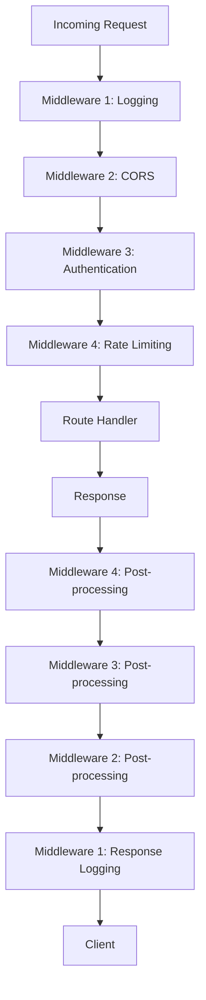
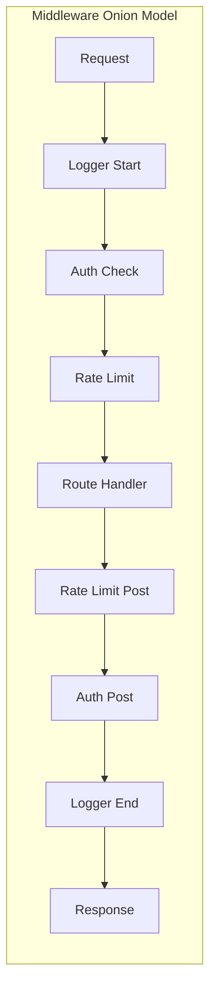
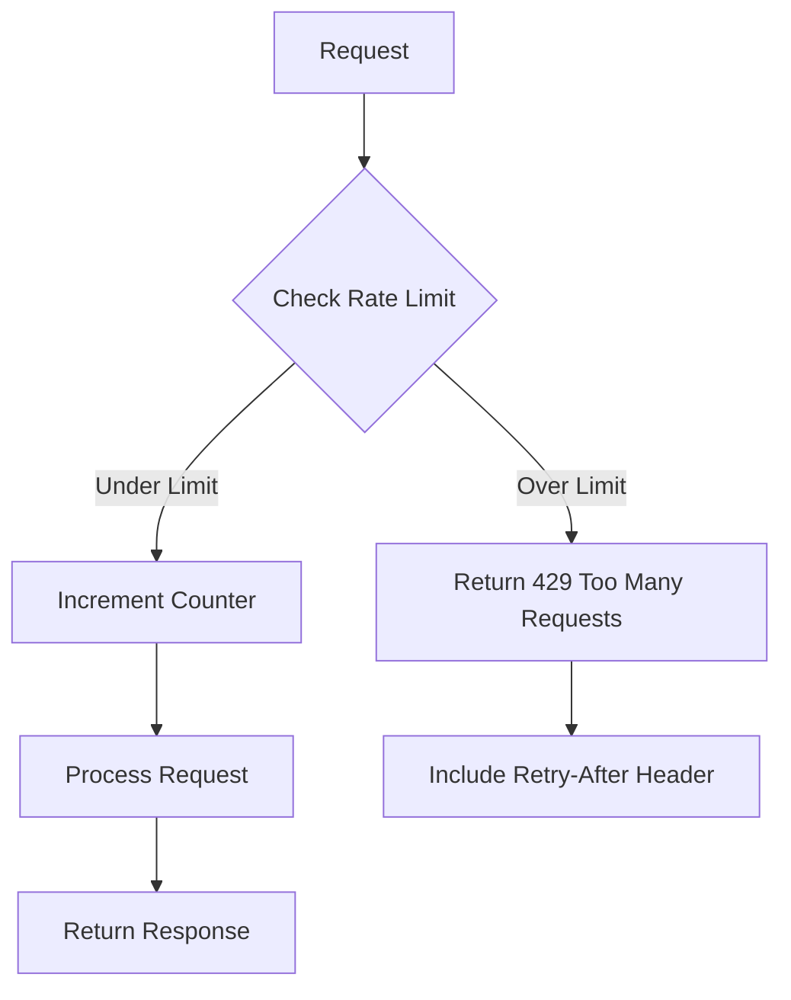
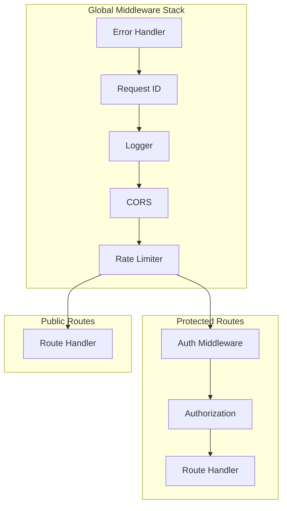
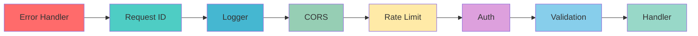

# How to Implement Middleware in Deno

Author: [nawazdhandala](https://github.com/nawazdhandala)

Tags: Deno, Middleware, Oak, Backend

Description: Learn how to implement middleware in Deno using the Oak framework, covering logging, authentication, CORS, rate limiting, error handling, and middleware composition patterns.

---

> Middleware is the backbone of modern web applications. It allows you to intercept requests and responses, adding functionality like logging, authentication, and error handling without cluttering your route handlers. This guide shows you how to implement robust middleware patterns in Deno.

Deno's secure-by-default runtime combined with first-class TypeScript support makes it an excellent choice for building modern APIs. Understanding middleware is essential for building production-ready Deno applications.

---

## What is Middleware?

Middleware functions are functions that have access to the request object, the response object, and the next middleware function in the application's request-response cycle. They can:

- Execute any code
- Modify the request and response objects
- End the request-response cycle
- Call the next middleware in the stack

Here is how middleware works in the request-response lifecycle:



---

## Setting Up Oak Framework

Oak is the most popular middleware framework for Deno, inspired by Koa.js. Let's start by setting up a basic Oak application.

Create a `deps.ts` file to manage dependencies:

```typescript
// deps.ts
export {
  Application,
  Router,
  Context,
  isHttpError,
  Status,
} from "https://deno.land/x/oak@v12.6.1/mod.ts";
export type { Middleware, Next } from "https://deno.land/x/oak@v12.6.1/mod.ts";
```

Create the main application file with basic middleware setup:

```typescript
// main.ts
import { Application, Router } from "./deps.ts";

const app = new Application();
const router = new Router();

// Basic route
router.get("/", (ctx) => {
  ctx.response.body = { message: "Hello, Deno!" };
});

router.get("/health", (ctx) => {
  ctx.response.body = { status: "healthy", timestamp: new Date().toISOString() };
});

// Use router middleware
app.use(router.routes());
app.use(router.allowedMethods());

console.log("Server running on http://localhost:8000");
await app.listen({ port: 8000 });
```

---

## The Middleware Pattern in Oak

Oak middleware follows an "onion" model where each middleware wraps around the next. Understanding this pattern is crucial for proper implementation.



Here is the basic structure of Oak middleware:

```typescript
// middleware/example.ts
import { Context, Next } from "../deps.ts";

// Middleware function signature
export async function exampleMiddleware(ctx: Context, next: Next) {
  // 1. Code before next() runs BEFORE the route handler
  console.log("Before route handler");

  // 2. Call next() to pass control to the next middleware
  await next();

  // 3. Code after next() runs AFTER the route handler
  console.log("After route handler");
}
```

---

## Logging Middleware

Logging is one of the most common middleware use cases. Let's build a comprehensive logging middleware that tracks request duration and details.

Basic logging middleware that captures request information and response time:

```typescript
// middleware/logger.ts
import { Context, Next } from "../deps.ts";

interface LogEntry {
  timestamp: string;
  method: string;
  url: string;
  status: number;
  duration: number;
  userAgent: string;
  ip: string;
}

export async function loggerMiddleware(ctx: Context, next: Next) {
  // Capture start time
  const start = Date.now();

  // Get request information
  const method = ctx.request.method;
  const url = ctx.request.url.pathname;
  const userAgent = ctx.request.headers.get("user-agent") || "unknown";
  const ip = ctx.request.ip;

  // Log incoming request
  console.log(`--> ${method} ${url}`);

  try {
    // Pass control to next middleware
    await next();
  } finally {
    // Calculate duration
    const duration = Date.now() - start;

    // Create log entry
    const logEntry: LogEntry = {
      timestamp: new Date().toISOString(),
      method,
      url,
      status: ctx.response.status,
      duration,
      userAgent,
      ip,
    };

    // Log response
    console.log(`<-- ${method} ${url} ${ctx.response.status} ${duration}ms`);

    // Optionally store structured logs
    // await sendToLogService(logEntry);
  }
}
```

Advanced logging middleware with configurable options and JSON output:

```typescript
// middleware/structured-logger.ts
import { Context, Next } from "../deps.ts";

interface LoggerOptions {
  includeHeaders?: boolean;
  includeBody?: boolean;
  excludePaths?: string[];
  format?: "json" | "text";
}

export function createLoggerMiddleware(options: LoggerOptions = {}) {
  const {
    includeHeaders = false,
    includeBody = false,
    excludePaths = ["/health", "/metrics"],
    format = "json",
  } = options;

  return async function loggerMiddleware(ctx: Context, next: Next) {
    // Skip logging for excluded paths
    if (excludePaths.includes(ctx.request.url.pathname)) {
      return await next();
    }

    const start = Date.now();
    const requestId = crypto.randomUUID();

    // Add request ID to context state for correlation
    ctx.state.requestId = requestId;

    // Capture request details
    const requestLog: Record<string, unknown> = {
      requestId,
      timestamp: new Date().toISOString(),
      method: ctx.request.method,
      path: ctx.request.url.pathname,
      query: ctx.request.url.search,
      ip: ctx.request.ip,
    };

    if (includeHeaders) {
      requestLog.headers = Object.fromEntries(ctx.request.headers.entries());
    }

    try {
      await next();
    } catch (error) {
      requestLog.error = error.message;
      throw error;
    } finally {
      const duration = Date.now() - start;

      const responseLog = {
        ...requestLog,
        status: ctx.response.status,
        duration,
      };

      if (format === "json") {
        console.log(JSON.stringify(responseLog));
      } else {
        console.log(
          `[${responseLog.timestamp}] ${responseLog.method} ${responseLog.path} - ${responseLog.status} (${duration}ms)`
        );
      }
    }
  };
}
```

---

## Authentication Middleware

Authentication middleware verifies user identity before allowing access to protected routes. Here are several approaches.

JWT-based authentication middleware that validates tokens and attaches user data to context:

```typescript
// middleware/auth.ts
import { Context, Next, Status } from "../deps.ts";
import { create, verify, getNumericDate } from "https://deno.land/x/djwt@v3.0.1/mod.ts";

// Define user interface
interface User {
  id: string;
  email: string;
  role: string;
}

// JWT secret key (in production, use environment variable)
const JWT_SECRET = Deno.env.get("JWT_SECRET") || "your-secret-key";

// Create crypto key for JWT operations
const key = await crypto.subtle.importKey(
  "raw",
  new TextEncoder().encode(JWT_SECRET),
  { name: "HMAC", hash: "SHA-256" },
  false,
  ["sign", "verify"]
);

// Helper to create tokens
export async function createToken(user: User): Promise<string> {
  const payload = {
    sub: user.id,
    email: user.email,
    role: user.role,
    exp: getNumericDate(60 * 60), // 1 hour expiration
  };

  return await create({ alg: "HS256", typ: "JWT" }, payload, key);
}

// Authentication middleware
export async function authMiddleware(ctx: Context, next: Next) {
  // Get authorization header
  const authHeader = ctx.request.headers.get("Authorization");

  if (!authHeader) {
    ctx.response.status = Status.Unauthorized;
    ctx.response.body = { error: "Authorization header required" };
    return;
  }

  // Check Bearer token format
  if (!authHeader.startsWith("Bearer ")) {
    ctx.response.status = Status.Unauthorized;
    ctx.response.body = { error: "Invalid authorization format. Use: Bearer <token>" };
    return;
  }

  const token = authHeader.slice(7);

  try {
    // Verify and decode token
    const payload = await verify(token, key);

    // Attach user to context state
    ctx.state.user = {
      id: payload.sub as string,
      email: payload.email as string,
      role: payload.role as string,
    };

    // Continue to next middleware
    await next();
  } catch (error) {
    ctx.response.status = Status.Unauthorized;
    ctx.response.body = { error: "Invalid or expired token" };
  }
}
```

Role-based authorization middleware that checks user permissions:

```typescript
// middleware/authorize.ts
import { Context, Next, Status } from "../deps.ts";

// Factory function to create role-based middleware
export function authorize(...allowedRoles: string[]) {
  return async function authorizeMiddleware(ctx: Context, next: Next) {
    // Check if user exists in state (set by auth middleware)
    const user = ctx.state.user;

    if (!user) {
      ctx.response.status = Status.Unauthorized;
      ctx.response.body = { error: "Authentication required" };
      return;
    }

    // Check if user has required role
    if (!allowedRoles.includes(user.role)) {
      ctx.response.status = Status.Forbidden;
      ctx.response.body = {
        error: "Insufficient permissions",
        required: allowedRoles,
        current: user.role,
      };
      return;
    }

    await next();
  };
}

// Usage example in routes:
// router.get("/admin", authMiddleware, authorize("admin"), adminHandler);
// router.get("/users", authMiddleware, authorize("admin", "manager"), usersHandler);
```

API key authentication for machine-to-machine communication:

```typescript
// middleware/api-key-auth.ts
import { Context, Next, Status } from "../deps.ts";

// In production, store API keys in a database
const validApiKeys = new Map([
  ["api_key_123", { name: "Service A", permissions: ["read", "write"] }],
  ["api_key_456", { name: "Service B", permissions: ["read"] }],
]);

export async function apiKeyAuthMiddleware(ctx: Context, next: Next) {
  // Check multiple header locations for API key
  const apiKey =
    ctx.request.headers.get("X-API-Key") ||
    ctx.request.headers.get("Authorization")?.replace("ApiKey ", "") ||
    ctx.request.url.searchParams.get("api_key");

  if (!apiKey) {
    ctx.response.status = Status.Unauthorized;
    ctx.response.body = { error: "API key required" };
    return;
  }

  const client = validApiKeys.get(apiKey);

  if (!client) {
    ctx.response.status = Status.Unauthorized;
    ctx.response.body = { error: "Invalid API key" };
    return;
  }

  // Attach client info to context
  ctx.state.client = client;

  await next();
}
```

---

## CORS Middleware

Cross-Origin Resource Sharing (CORS) middleware is essential for APIs consumed by web browsers.

Configurable CORS middleware with support for multiple origins and methods:

```typescript
// middleware/cors.ts
import { Context, Next } from "../deps.ts";

interface CorsOptions {
  origins?: string[] | "*";
  methods?: string[];
  allowHeaders?: string[];
  exposeHeaders?: string[];
  credentials?: boolean;
  maxAge?: number;
}

export function createCorsMiddleware(options: CorsOptions = {}) {
  const {
    origins = "*",
    methods = ["GET", "POST", "PUT", "PATCH", "DELETE", "OPTIONS"],
    allowHeaders = ["Content-Type", "Authorization", "X-Requested-With"],
    exposeHeaders = ["X-Request-Id", "X-RateLimit-Remaining"],
    credentials = false,
    maxAge = 86400, // 24 hours
  } = options;

  return async function corsMiddleware(ctx: Context, next: Next) {
    const requestOrigin = ctx.request.headers.get("Origin");

    // Determine if origin is allowed
    let allowOrigin: string | null = null;

    if (origins === "*") {
      allowOrigin = "*";
    } else if (requestOrigin && origins.includes(requestOrigin)) {
      allowOrigin = requestOrigin;
    }

    // Set CORS headers
    if (allowOrigin) {
      ctx.response.headers.set("Access-Control-Allow-Origin", allowOrigin);

      if (credentials) {
        ctx.response.headers.set("Access-Control-Allow-Credentials", "true");
      }

      ctx.response.headers.set(
        "Access-Control-Expose-Headers",
        exposeHeaders.join(", ")
      );
    }

    // Handle preflight requests
    if (ctx.request.method === "OPTIONS") {
      ctx.response.headers.set(
        "Access-Control-Allow-Methods",
        methods.join(", ")
      );
      ctx.response.headers.set(
        "Access-Control-Allow-Headers",
        allowHeaders.join(", ")
      );
      ctx.response.headers.set("Access-Control-Max-Age", String(maxAge));
      ctx.response.status = 204; // No content
      return;
    }

    await next();
  };
}

// Simple CORS middleware for development
export async function simpleCorsMiddleware(ctx: Context, next: Next) {
  ctx.response.headers.set("Access-Control-Allow-Origin", "*");
  ctx.response.headers.set(
    "Access-Control-Allow-Methods",
    "GET, POST, PUT, DELETE, OPTIONS"
  );
  ctx.response.headers.set(
    "Access-Control-Allow-Headers",
    "Content-Type, Authorization"
  );

  if (ctx.request.method === "OPTIONS") {
    ctx.response.status = 204;
    return;
  }

  await next();
}
```

---

## Rate Limiting Middleware

Rate limiting protects your API from abuse and ensures fair usage among clients.



Sliding window rate limiter implementation for accurate request counting:

```typescript
// middleware/rate-limit.ts
import { Context, Next, Status } from "../deps.ts";

interface RateLimitOptions {
  windowMs: number;      // Time window in milliseconds
  maxRequests: number;   // Maximum requests per window
  keyGenerator?: (ctx: Context) => string;
  message?: string;
  headers?: boolean;
}

interface RequestRecord {
  count: number;
  resetTime: number;
}

export function createRateLimitMiddleware(options: RateLimitOptions) {
  const {
    windowMs = 60000,       // 1 minute default
    maxRequests = 100,      // 100 requests default
    keyGenerator = (ctx) => ctx.request.ip,
    message = "Too many requests, please try again later",
    headers = true,
  } = options;

  // Store request counts (in production, use Redis)
  const requests = new Map<string, RequestRecord>();

  // Cleanup old entries periodically
  setInterval(() => {
    const now = Date.now();
    for (const [key, record] of requests.entries()) {
      if (record.resetTime < now) {
        requests.delete(key);
      }
    }
  }, windowMs);

  return async function rateLimitMiddleware(ctx: Context, next: Next) {
    const key = keyGenerator(ctx);
    const now = Date.now();

    // Get or create request record
    let record = requests.get(key);

    if (!record || record.resetTime < now) {
      record = {
        count: 0,
        resetTime: now + windowMs,
      };
    }

    // Increment request count
    record.count++;
    requests.set(key, record);

    // Calculate remaining requests
    const remaining = Math.max(0, maxRequests - record.count);
    const resetSeconds = Math.ceil((record.resetTime - now) / 1000);

    // Add rate limit headers
    if (headers) {
      ctx.response.headers.set("X-RateLimit-Limit", String(maxRequests));
      ctx.response.headers.set("X-RateLimit-Remaining", String(remaining));
      ctx.response.headers.set("X-RateLimit-Reset", String(record.resetTime));
    }

    // Check if limit exceeded
    if (record.count > maxRequests) {
      ctx.response.status = Status.TooManyRequests;
      ctx.response.headers.set("Retry-After", String(resetSeconds));
      ctx.response.body = {
        error: message,
        retryAfter: resetSeconds,
      };
      return;
    }

    await next();
  };
}

// Token bucket implementation for bursty traffic handling
export function createTokenBucketLimiter(options: {
  bucketSize: number;
  refillRate: number; // tokens per second
}) {
  const { bucketSize, refillRate } = options;

  interface Bucket {
    tokens: number;
    lastRefill: number;
  }

  const buckets = new Map<string, Bucket>();

  return async function tokenBucketMiddleware(ctx: Context, next: Next) {
    const key = ctx.request.ip;
    const now = Date.now();

    let bucket = buckets.get(key);

    if (!bucket) {
      bucket = { tokens: bucketSize, lastRefill: now };
    } else {
      // Refill tokens based on elapsed time
      const elapsed = (now - bucket.lastRefill) / 1000;
      bucket.tokens = Math.min(bucketSize, bucket.tokens + elapsed * refillRate);
      bucket.lastRefill = now;
    }

    if (bucket.tokens < 1) {
      const waitTime = Math.ceil((1 - bucket.tokens) / refillRate);
      ctx.response.status = Status.TooManyRequests;
      ctx.response.headers.set("Retry-After", String(waitTime));
      ctx.response.body = { error: "Rate limit exceeded", retryAfter: waitTime };
      return;
    }

    bucket.tokens -= 1;
    buckets.set(key, bucket);

    await next();
  };
}
```

---

## Error Handling Middleware

Centralized error handling middleware catches all errors and returns consistent responses.

Global error handling middleware with support for custom error types:

```typescript
// middleware/error-handler.ts
import { Context, Next, isHttpError, Status } from "../deps.ts";

// Custom error classes
export class AppError extends Error {
  constructor(
    public statusCode: number,
    message: string,
    public code?: string
  ) {
    super(message);
    this.name = "AppError";
  }
}

export class ValidationError extends AppError {
  constructor(message: string, public details?: Record<string, string[]>) {
    super(Status.BadRequest, message, "VALIDATION_ERROR");
    this.name = "ValidationError";
  }
}

export class NotFoundError extends AppError {
  constructor(resource: string) {
    super(Status.NotFound, `${resource} not found`, "NOT_FOUND");
    this.name = "NotFoundError";
  }
}

export class UnauthorizedError extends AppError {
  constructor(message = "Unauthorized") {
    super(Status.Unauthorized, message, "UNAUTHORIZED");
    this.name = "UnauthorizedError";
  }
}

// Error response interface
interface ErrorResponse {
  error: {
    message: string;
    code?: string;
    details?: unknown;
    stack?: string;
  };
  requestId?: string;
}

export async function errorHandlerMiddleware(ctx: Context, next: Next) {
  try {
    await next();
  } catch (error) {
    const requestId = ctx.state.requestId;
    const isDevelopment = Deno.env.get("DENO_ENV") === "development";

    let statusCode = Status.InternalServerError;
    let errorResponse: ErrorResponse = {
      error: {
        message: "An unexpected error occurred",
      },
      requestId,
    };

    // Handle custom AppError
    if (error instanceof AppError) {
      statusCode = error.statusCode;
      errorResponse.error = {
        message: error.message,
        code: error.code,
      };

      if (error instanceof ValidationError && error.details) {
        errorResponse.error.details = error.details;
      }
    }
    // Handle Oak HTTP errors
    else if (isHttpError(error)) {
      statusCode = error.status;
      errorResponse.error.message = error.message;
    }
    // Handle unknown errors
    else if (error instanceof Error) {
      // Log the full error for debugging
      console.error("Unhandled error:", error);

      // Include stack trace in development
      if (isDevelopment) {
        errorResponse.error.message = error.message;
        errorResponse.error.stack = error.stack;
      }
    }

    ctx.response.status = statusCode;
    ctx.response.body = errorResponse;
  }
}
```

Not found handler for unmatched routes:

```typescript
// middleware/not-found.ts
import { Context, Status } from "../deps.ts";

export function notFoundMiddleware(ctx: Context) {
  ctx.response.status = Status.NotFound;
  ctx.response.body = {
    error: {
      message: `Route ${ctx.request.method} ${ctx.request.url.pathname} not found`,
      code: "ROUTE_NOT_FOUND",
    },
    requestId: ctx.state.requestId,
  };
}
```

---

## Composing Middleware

Organizing and composing middleware is crucial for maintainable applications. Here is how to structure your middleware effectively.



Middleware composition utilities for reusable middleware chains:

```typescript
// middleware/compose.ts
import { Context, Next, Middleware } from "../deps.ts";

// Compose multiple middleware into one
export function compose(...middlewares: Middleware[]): Middleware {
  return async function composedMiddleware(ctx: Context, next: Next) {
    let index = -1;

    async function dispatch(i: number): Promise<void> {
      if (i <= index) {
        throw new Error("next() called multiple times");
      }
      index = i;

      let fn: Middleware | undefined = middlewares[i];

      if (i === middlewares.length) {
        fn = next;
      }

      if (!fn) {
        return;
      }

      await fn(ctx, () => dispatch(i + 1));
    }

    await dispatch(0);
  };
}

// Conditional middleware application
export function when(
  condition: (ctx: Context) => boolean,
  middleware: Middleware
): Middleware {
  return async function conditionalMiddleware(ctx: Context, next: Next) {
    if (condition(ctx)) {
      await middleware(ctx, next);
    } else {
      await next();
    }
  };
}

// Skip middleware for certain paths
export function unless(
  paths: string[],
  middleware: Middleware
): Middleware {
  return when(
    (ctx) => !paths.includes(ctx.request.url.pathname),
    middleware
  );
}
```

Complete application setup with organized middleware:

```typescript
// main.ts
import { Application, Router } from "./deps.ts";

// Import middleware
import { errorHandlerMiddleware } from "./middleware/error-handler.ts";
import { createLoggerMiddleware } from "./middleware/structured-logger.ts";
import { createCorsMiddleware } from "./middleware/cors.ts";
import { createRateLimitMiddleware } from "./middleware/rate-limit.ts";
import { authMiddleware } from "./middleware/auth.ts";
import { authorize } from "./middleware/authorize.ts";
import { notFoundMiddleware } from "./middleware/not-found.ts";
import { compose, unless } from "./middleware/compose.ts";

const app = new Application();

// Create configured middleware instances
const logger = createLoggerMiddleware({
  format: "json",
  excludePaths: ["/health"],
});

const cors = createCorsMiddleware({
  origins: ["http://localhost:3000", "https://myapp.com"],
  credentials: true,
});

const rateLimit = createRateLimitMiddleware({
  windowMs: 60000,
  maxRequests: 100,
});

// Request ID middleware for tracing
async function requestIdMiddleware(ctx: Context, next: Next) {
  ctx.state.requestId = crypto.randomUUID();
  ctx.response.headers.set("X-Request-Id", ctx.state.requestId);
  await next();
}

// Create routers
const publicRouter = new Router();
const protectedRouter = new Router();

// Public routes
publicRouter.get("/health", (ctx) => {
  ctx.response.body = { status: "healthy" };
});

publicRouter.post("/auth/login", async (ctx) => {
  // Login logic here
  ctx.response.body = { token: "jwt-token-here" };
});

// Protected routes
protectedRouter.use(authMiddleware);

protectedRouter.get("/api/profile", (ctx) => {
  ctx.response.body = { user: ctx.state.user };
});

protectedRouter.get("/api/admin", authorize("admin"), (ctx) => {
  ctx.response.body = { message: "Admin access granted" };
});

// Apply global middleware in order
// Error handler must be first to catch all errors
app.use(errorHandlerMiddleware);
app.use(requestIdMiddleware);
app.use(logger);
app.use(cors);
app.use(unless(["/health"], rateLimit));

// Apply routers
app.use(publicRouter.routes());
app.use(publicRouter.allowedMethods());
app.use(protectedRouter.routes());
app.use(protectedRouter.allowedMethods());

// 404 handler for unmatched routes
app.use(notFoundMiddleware);

// Start server
const port = parseInt(Deno.env.get("PORT") || "8000");
console.log(`Server running on http://localhost:${port}`);
await app.listen({ port });
```

---

## Request Validation Middleware

Input validation middleware ensures data integrity before reaching handlers.

Schema-based validation middleware using Zod:

```typescript
// middleware/validate.ts
import { Context, Next, Status } from "../deps.ts";
import { z, ZodSchema, ZodError } from "https://deno.land/x/zod@v3.22.4/mod.ts";

// Validation error response
interface ValidationErrorResponse {
  error: string;
  details: Record<string, string[]>;
}

// Create validation middleware factory
export function validate<T>(schema: ZodSchema<T>) {
  return async function validateMiddleware(ctx: Context, next: Next) {
    try {
      // Get request body
      const body = await ctx.request.body().value;

      // Validate against schema
      const validated = schema.parse(body);

      // Attach validated data to context
      ctx.state.validatedBody = validated;

      await next();
    } catch (error) {
      if (error instanceof ZodError) {
        // Transform Zod errors to friendly format
        const details: Record<string, string[]> = {};

        error.errors.forEach((err) => {
          const path = err.path.join(".");
          if (!details[path]) {
            details[path] = [];
          }
          details[path].push(err.message);
        });

        ctx.response.status = Status.BadRequest;
        ctx.response.body = {
          error: "Validation failed",
          details,
        } as ValidationErrorResponse;
        return;
      }

      throw error;
    }
  };
}

// Example schemas
export const createUserSchema = z.object({
  email: z.string().email("Invalid email format"),
  password: z.string().min(8, "Password must be at least 8 characters"),
  name: z.string().min(1, "Name is required"),
});

export const updateUserSchema = z.object({
  email: z.string().email().optional(),
  name: z.string().min(1).optional(),
});

// Usage in routes:
// router.post("/users", validate(createUserSchema), createUserHandler);
```

---

## Best Practices Summary

Here are essential best practices for implementing middleware in Deno:

| Practice | Description |
|----------|-------------|
| **Order Matters** | Place error handling first, authentication before authorization, logging early |
| **Keep Middleware Focused** | Each middleware should do one thing well |
| **Use Context State** | Store request-specific data in `ctx.state` |
| **Handle Errors Gracefully** | Always use try-catch in middleware |
| **Configure via Options** | Use factory functions for configurable middleware |
| **Clean Up Resources** | Use `finally` blocks to ensure cleanup |
| **Add Request IDs** | Include request IDs for distributed tracing |
| **Return Early** | Stop processing early when conditions fail |
| **Document Middleware** | Add JSDoc comments explaining middleware behavior |
| **Test Middleware** | Write unit tests for each middleware |

Middleware execution order diagram:



---

## Conclusion

Middleware is the foundation of well-structured Deno applications. Key takeaways from this guide:

- **Oak framework** provides an elegant middleware system inspired by Koa
- **The onion model** means code before `next()` runs on request, after `next()` runs on response
- **Logging middleware** should capture timing, request details, and response status
- **Authentication middleware** validates tokens and attaches user data to context state
- **CORS middleware** handles cross-origin requests and preflight `OPTIONS` requests
- **Rate limiting** protects APIs from abuse using sliding windows or token buckets
- **Error handling** should be centralized and return consistent response formats
- **Composition utilities** help organize and reuse middleware chains

With these patterns, you can build secure, observable, and maintainable APIs in Deno. Start with the essential middleware (error handling, logging, CORS) and add authentication and rate limiting as your application grows.

---

*Want to monitor your Deno applications in production? [OneUptime](https://oneuptime.com) provides comprehensive monitoring for APIs with built-in alerting and incident management.*

**Related Reading:**
- [How to Build REST APIs with Deno and Oak](https://oneuptime.com/blog)
- [How to Implement JWT Authentication in Deno](https://oneuptime.com/blog)
