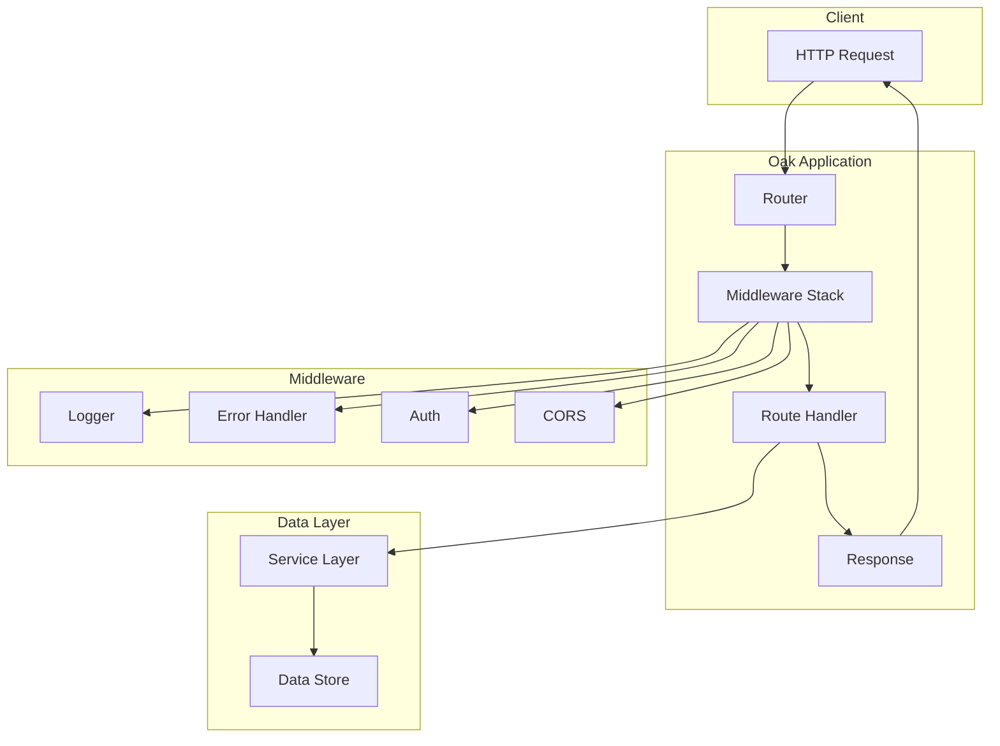
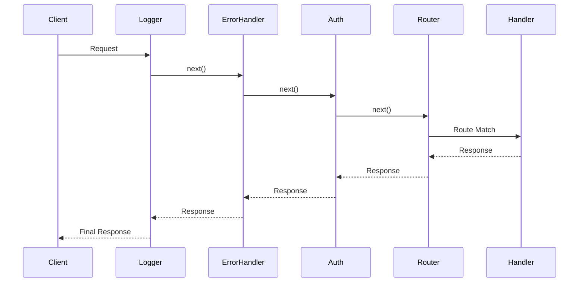
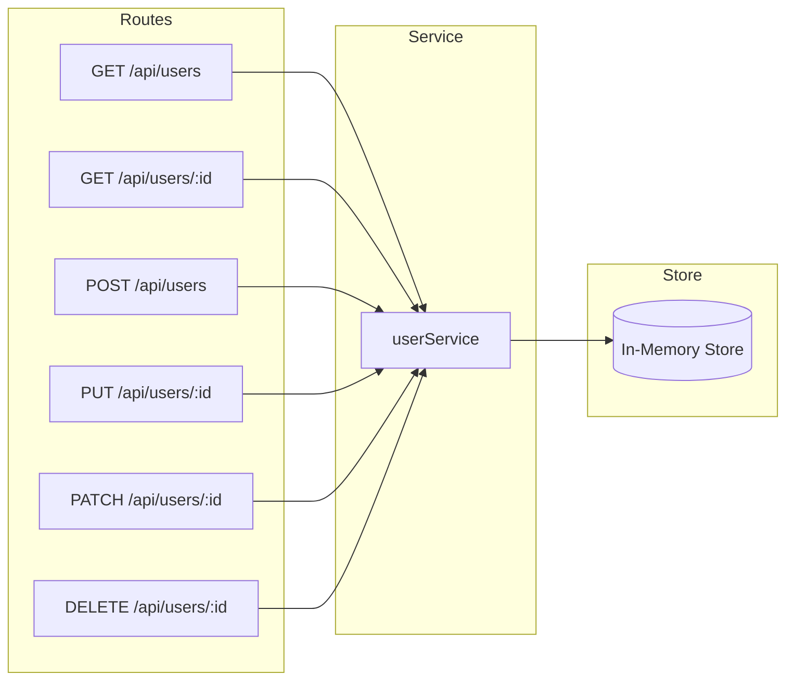

# How to Build REST APIs with Deno and Oak

Author: [nawazdhandala](https://github.com/nawazdhandala)

Tags: Deno, Oak, REST API, TypeScript

Description: Learn how to build production-ready REST APIs with Deno and Oak framework, covering routing, middleware, error handling, and CRUD operations with practical examples.

---

> Deno is a modern JavaScript and TypeScript runtime that provides built-in security, TypeScript support, and a better developer experience. Oak is its most popular web framework, inspired by Koa.js. This guide walks you through building a complete REST API from scratch.

Deno simplifies backend development by eliminating the need for separate TypeScript compilation, providing secure defaults, and including a standard library. When combined with Oak, you get an expressive and powerful framework for building APIs.

---

## Architecture Overview



---

## Setting Up Deno and Oak

First, ensure you have Deno installed. You can install it using the following command:

```bash
# macOS/Linux
curl -fsSL https://deno.land/install.sh | sh

# Windows (PowerShell)
irm https://deno.land/install.ps1 | iex

# Verify installation
deno --version
```

### Project Structure

Create a well-organized project structure for maintainability:

```
deno-oak-api/
├── main.ts              # Application entry point
├── deno.json            # Deno configuration
├── deps.ts              # Centralized dependencies
├── routes/
│   └── users.ts         # User routes
├── controllers/
│   └── userController.ts
├── middleware/
│   ├── logger.ts
│   ├── errorHandler.ts
│   └── auth.ts
├── services/
│   └── userService.ts
├── types/
│   └── user.ts
└── utils/
    └── response.ts
```

### Deno Configuration

Create a `deno.json` file to configure your project:

```json
{
  "tasks": {
    "dev": "deno run --watch --allow-net --allow-env main.ts",
    "start": "deno run --allow-net --allow-env main.ts",
    "test": "deno test --allow-net"
  },
  "imports": {
    "oak": "https://deno.land/x/oak@v12.6.1/mod.ts",
    "oak/": "https://deno.land/x/oak@v12.6.1/"
  },
  "compilerOptions": {
    "strict": true
  }
}
```

### Centralized Dependencies

Create a `deps.ts` file to manage all external dependencies in one place:

```typescript
// deps.ts
// Centralized dependency management for easier updates

export {
  Application,
  Router,
  Context,
  Status,
  isHttpError,
} from "oak";

export type {
  RouterContext,
  Middleware,
  Next,
} from "oak";
```

---

## Basic Oak Application

The entry point creates the Oak application and configures middleware and routes:

```typescript
// main.ts
import { Application, Router } from "./deps.ts";
import { logger } from "./middleware/logger.ts";
import { errorHandler } from "./middleware/errorHandler.ts";
import { userRouter } from "./routes/users.ts";

const app = new Application();
const router = new Router();

// Root route
router.get("/", (ctx) => {
  ctx.response.body = {
    message: "Welcome to Deno Oak API",
    version: "1.0.0",
    endpoints: {
      users: "/api/users",
      health: "/health"
    }
  };
});

// Health check endpoint
router.get("/health", (ctx) => {
  ctx.response.body = {
    status: "healthy",
    timestamp: new Date().toISOString()
  };
});

// Apply global middleware
app.use(errorHandler);
app.use(logger);

// Mount routes
app.use(router.routes());
app.use(router.allowedMethods());
app.use(userRouter.routes());
app.use(userRouter.allowedMethods());

// Start server
const PORT = parseInt(Deno.env.get("PORT") || "8000");
console.log(`Server running on http://localhost:${PORT}`);

await app.listen({ port: PORT });
```

---

## Middleware Implementation

Middleware functions process requests before they reach route handlers. Oak uses a middleware stack pattern similar to Koa.

### Request Flow with Middleware



### Logger Middleware

This middleware logs incoming requests with timing information:

```typescript
// middleware/logger.ts
import { Context, Next } from "../deps.ts";

export async function logger(ctx: Context, next: Next) {
  const start = Date.now();
  const { method, url } = ctx.request;

  // Log request start
  console.log(`--> ${method} ${url.pathname}`);

  await next();

  // Calculate response time
  const ms = Date.now() - start;
  const status = ctx.response.status;

  // Log response
  console.log(`<-- ${method} ${url.pathname} ${status} ${ms}ms`);

  // Add response time header
  ctx.response.headers.set("X-Response-Time", `${ms}ms`);
}
```

### Error Handler Middleware

Centralized error handling catches all errors and returns consistent JSON responses:

```typescript
// middleware/errorHandler.ts
import { Context, Next, Status, isHttpError } from "../deps.ts";

interface ErrorResponse {
  success: false;
  error: {
    message: string;
    status: number;
    code?: string;
  };
}

export async function errorHandler(ctx: Context, next: Next) {
  try {
    await next();
  } catch (err) {
    let status = Status.InternalServerError;
    let message = "Internal Server Error";
    let code: string | undefined;

    if (isHttpError(err)) {
      // Handle Oak HTTP errors
      status = err.status;
      message = err.message;
    } else if (err instanceof Error) {
      // Handle standard errors
      message = err.message;

      // Check for specific error types
      if (err.name === "ValidationError") {
        status = Status.BadRequest;
        code = "VALIDATION_ERROR";
      } else if (err.name === "NotFoundError") {
        status = Status.NotFound;
        code = "NOT_FOUND";
      } else if (err.name === "UnauthorizedError") {
        status = Status.Unauthorized;
        code = "UNAUTHORIZED";
      }
    }

    // Log error for debugging
    console.error(`[ERROR] ${status} - ${message}`, err);

    // Send error response
    const errorResponse: ErrorResponse = {
      success: false,
      error: {
        message,
        status,
        ...(code && { code })
      }
    };

    ctx.response.status = status;
    ctx.response.body = errorResponse;
  }
}
```

### Authentication Middleware

JWT-based authentication middleware protects routes:

```typescript
// middleware/auth.ts
import { Context, Next, Status } from "../deps.ts";

// Simple token validation (use proper JWT library in production)
interface TokenPayload {
  userId: string;
  email: string;
  exp: number;
}

function decodeToken(token: string): TokenPayload | null {
  try {
    // In production, use a proper JWT library like djwt
    const [, payload] = token.split(".");
    const decoded = JSON.parse(atob(payload));
    return decoded as TokenPayload;
  } catch {
    return null;
  }
}

export function authMiddleware(required = true) {
  return async (ctx: Context, next: Next) => {
    const authHeader = ctx.request.headers.get("Authorization");

    if (!authHeader || !authHeader.startsWith("Bearer ")) {
      if (required) {
        ctx.response.status = Status.Unauthorized;
        ctx.response.body = {
          success: false,
          error: {
            message: "Authorization header required",
            status: Status.Unauthorized
          }
        };
        return;
      }
      await next();
      return;
    }

    const token = authHeader.substring(7);
    const payload = decodeToken(token);

    if (!payload) {
      ctx.response.status = Status.Unauthorized;
      ctx.response.body = {
        success: false,
        error: {
          message: "Invalid token",
          status: Status.Unauthorized
        }
      };
      return;
    }

    // Check expiration
    if (payload.exp < Date.now() / 1000) {
      ctx.response.status = Status.Unauthorized;
      ctx.response.body = {
        success: false,
        error: {
          message: "Token expired",
          status: Status.Unauthorized
        }
      };
      return;
    }

    // Attach user to context state
    ctx.state.user = {
      id: payload.userId,
      email: payload.email
    };

    await next();
  };
}
```

### CORS Middleware

Enable Cross-Origin Resource Sharing for browser clients:

```typescript
// middleware/cors.ts
import { Context, Next } from "../deps.ts";

interface CorsOptions {
  origin?: string | string[];
  methods?: string[];
  headers?: string[];
  credentials?: boolean;
  maxAge?: number;
}

export function cors(options: CorsOptions = {}) {
  const {
    origin = "*",
    methods = ["GET", "POST", "PUT", "DELETE", "PATCH", "OPTIONS"],
    headers = ["Content-Type", "Authorization"],
    credentials = false,
    maxAge = 86400
  } = options;

  return async (ctx: Context, next: Next) => {
    const requestOrigin = ctx.request.headers.get("Origin") || "";

    // Determine allowed origin
    let allowedOrigin = "*";
    if (Array.isArray(origin)) {
      if (origin.includes(requestOrigin)) {
        allowedOrigin = requestOrigin;
      }
    } else if (origin !== "*") {
      allowedOrigin = origin;
    }

    // Set CORS headers
    ctx.response.headers.set("Access-Control-Allow-Origin", allowedOrigin);
    ctx.response.headers.set("Access-Control-Allow-Methods", methods.join(", "));
    ctx.response.headers.set("Access-Control-Allow-Headers", headers.join(", "));
    ctx.response.headers.set("Access-Control-Max-Age", maxAge.toString());

    if (credentials) {
      ctx.response.headers.set("Access-Control-Allow-Credentials", "true");
    }

    // Handle preflight
    if (ctx.request.method === "OPTIONS") {
      ctx.response.status = 204;
      return;
    }

    await next();
  };
}
```

---

## Routing and Route Handlers

Oak's router provides expressive route definitions with parameter support.

### Types Definition

Define TypeScript interfaces for type safety:

```typescript
// types/user.ts
export interface User {
  id: string;
  name: string;
  email: string;
  role: "admin" | "user";
  createdAt: string;
  updatedAt: string;
}

export interface CreateUserDto {
  name: string;
  email: string;
  password: string;
  role?: "admin" | "user";
}

export interface UpdateUserDto {
  name?: string;
  email?: string;
  role?: "admin" | "user";
}

export interface PaginationParams {
  page: number;
  limit: number;
}

export interface PaginatedResponse<T> {
  data: T[];
  pagination: {
    page: number;
    limit: number;
    total: number;
    totalPages: number;
  };
}
```

### User Service Layer

Separate business logic from route handlers:

```typescript
// services/userService.ts
import { User, CreateUserDto, UpdateUserDto, PaginatedResponse } from "../types/user.ts";

// In-memory store (use a real database in production)
const users: Map<string, User> = new Map();

// Seed initial data
function seedUsers() {
  const initialUsers: User[] = [
    {
      id: "1",
      name: "John Doe",
      email: "john@example.com",
      role: "admin",
      createdAt: new Date().toISOString(),
      updatedAt: new Date().toISOString()
    },
    {
      id: "2",
      name: "Jane Smith",
      email: "jane@example.com",
      role: "user",
      createdAt: new Date().toISOString(),
      updatedAt: new Date().toISOString()
    }
  ];

  initialUsers.forEach(user => users.set(user.id, user));
}

seedUsers();

export const userService = {
  // Get all users with pagination
  getAll(page = 1, limit = 10): PaginatedResponse<User> {
    const allUsers = Array.from(users.values());
    const total = allUsers.length;
    const totalPages = Math.ceil(total / limit);
    const offset = (page - 1) * limit;
    const data = allUsers.slice(offset, offset + limit);

    return {
      data,
      pagination: {
        page,
        limit,
        total,
        totalPages
      }
    };
  },

  // Get user by ID
  getById(id: string): User | undefined {
    return users.get(id);
  },

  // Get user by email
  getByEmail(email: string): User | undefined {
    return Array.from(users.values()).find(u => u.email === email);
  },

  // Create new user
  create(dto: CreateUserDto): User {
    const id = crypto.randomUUID();
    const now = new Date().toISOString();

    const user: User = {
      id,
      name: dto.name,
      email: dto.email,
      role: dto.role || "user",
      createdAt: now,
      updatedAt: now
    };

    users.set(id, user);
    return user;
  },

  // Update user
  update(id: string, dto: UpdateUserDto): User | undefined {
    const user = users.get(id);
    if (!user) return undefined;

    const updated: User = {
      ...user,
      ...dto,
      updatedAt: new Date().toISOString()
    };

    users.set(id, updated);
    return updated;
  },

  // Delete user
  delete(id: string): boolean {
    return users.delete(id);
  }
};
```

### User Routes

Define routes with proper HTTP methods and parameter handling:

```typescript
// routes/users.ts
import { Router, Status, RouterContext } from "../deps.ts";
import { userService } from "../services/userService.ts";
import { authMiddleware } from "../middleware/auth.ts";
import { CreateUserDto, UpdateUserDto } from "../types/user.ts";

export const userRouter = new Router({ prefix: "/api/users" });

// Validation helper
function validateEmail(email: string): boolean {
  const emailRegex = /^[^\s@]+@[^\s@]+\.[^\s@]+$/;
  return emailRegex.test(email);
}

// GET /api/users - List all users with pagination
userRouter.get("/", async (ctx: RouterContext<"/">) => {
  const params = ctx.request.url.searchParams;
  const page = parseInt(params.get("page") || "1");
  const limit = parseInt(params.get("limit") || "10");

  // Validate pagination params
  const validPage = Math.max(1, page);
  const validLimit = Math.min(100, Math.max(1, limit));

  const result = userService.getAll(validPage, validLimit);

  ctx.response.body = {
    success: true,
    ...result
  };
});

// GET /api/users/:id - Get user by ID
userRouter.get("/:id", (ctx: RouterContext<"/:id">) => {
  const { id } = ctx.params;
  const user = userService.getById(id);

  if (!user) {
    ctx.response.status = Status.NotFound;
    ctx.response.body = {
      success: false,
      error: {
        message: `User with ID ${id} not found`,
        status: Status.NotFound
      }
    };
    return;
  }

  ctx.response.body = {
    success: true,
    data: user
  };
});

// POST /api/users - Create new user
userRouter.post("/", async (ctx: RouterContext<"/">) => {
  const body = ctx.request.body();

  if (body.type !== "json") {
    ctx.response.status = Status.BadRequest;
    ctx.response.body = {
      success: false,
      error: {
        message: "Content-Type must be application/json",
        status: Status.BadRequest
      }
    };
    return;
  }

  const dto: CreateUserDto = await body.value;

  // Validate required fields
  const errors: string[] = [];

  if (!dto.name || dto.name.trim().length < 2) {
    errors.push("Name must be at least 2 characters");
  }

  if (!dto.email || !validateEmail(dto.email)) {
    errors.push("Valid email is required");
  }

  if (!dto.password || dto.password.length < 8) {
    errors.push("Password must be at least 8 characters");
  }

  if (errors.length > 0) {
    ctx.response.status = Status.BadRequest;
    ctx.response.body = {
      success: false,
      error: {
        message: "Validation failed",
        status: Status.BadRequest,
        details: errors
      }
    };
    return;
  }

  // Check for duplicate email
  if (userService.getByEmail(dto.email)) {
    ctx.response.status = Status.Conflict;
    ctx.response.body = {
      success: false,
      error: {
        message: "Email already in use",
        status: Status.Conflict
      }
    };
    return;
  }

  const user = userService.create(dto);

  ctx.response.status = Status.Created;
  ctx.response.body = {
    success: true,
    data: user
  };
});

// PUT /api/users/:id - Update user (protected route)
userRouter.put("/:id", authMiddleware(), async (ctx: RouterContext<"/:id">) => {
  const { id } = ctx.params;
  const body = ctx.request.body();

  if (body.type !== "json") {
    ctx.response.status = Status.BadRequest;
    ctx.response.body = {
      success: false,
      error: {
        message: "Content-Type must be application/json",
        status: Status.BadRequest
      }
    };
    return;
  }

  const dto: UpdateUserDto = await body.value;

  // Validate email if provided
  if (dto.email && !validateEmail(dto.email)) {
    ctx.response.status = Status.BadRequest;
    ctx.response.body = {
      success: false,
      error: {
        message: "Invalid email format",
        status: Status.BadRequest
      }
    };
    return;
  }

  const user = userService.update(id, dto);

  if (!user) {
    ctx.response.status = Status.NotFound;
    ctx.response.body = {
      success: false,
      error: {
        message: `User with ID ${id} not found`,
        status: Status.NotFound
      }
    };
    return;
  }

  ctx.response.body = {
    success: true,
    data: user
  };
});

// PATCH /api/users/:id - Partial update
userRouter.patch("/:id", authMiddleware(), async (ctx: RouterContext<"/:id">) => {
  const { id } = ctx.params;
  const body = ctx.request.body();

  if (body.type !== "json") {
    ctx.response.status = Status.BadRequest;
    ctx.response.body = {
      success: false,
      error: {
        message: "Content-Type must be application/json",
        status: Status.BadRequest
      }
    };
    return;
  }

  const dto: Partial<UpdateUserDto> = await body.value;
  const user = userService.update(id, dto);

  if (!user) {
    ctx.response.status = Status.NotFound;
    ctx.response.body = {
      success: false,
      error: {
        message: `User with ID ${id} not found`,
        status: Status.NotFound
      }
    };
    return;
  }

  ctx.response.body = {
    success: true,
    data: user
  };
});

// DELETE /api/users/:id - Delete user (protected route)
userRouter.delete("/:id", authMiddleware(), (ctx: RouterContext<"/:id">) => {
  const { id } = ctx.params;
  const deleted = userService.delete(id);

  if (!deleted) {
    ctx.response.status = Status.NotFound;
    ctx.response.body = {
      success: false,
      error: {
        message: `User with ID ${id} not found`,
        status: Status.NotFound
      }
    };
    return;
  }

  ctx.response.status = Status.NoContent;
});
```

---

## Request and Response Handling

### Response Utilities

Create consistent response helpers:

```typescript
// utils/response.ts
import { Context, Status } from "../deps.ts";

interface SuccessResponse<T> {
  success: true;
  data: T;
  message?: string;
}

interface ErrorResponseBody {
  success: false;
  error: {
    message: string;
    status: number;
    code?: string;
    details?: unknown;
  };
}

export function sendSuccess<T>(
  ctx: Context,
  data: T,
  status: Status = Status.OK,
  message?: string
) {
  ctx.response.status = status;
  ctx.response.body = {
    success: true,
    data,
    ...(message && { message })
  } as SuccessResponse<T>;
}

export function sendError(
  ctx: Context,
  message: string,
  status: Status = Status.BadRequest,
  code?: string,
  details?: unknown
) {
  ctx.response.status = status;
  ctx.response.body = {
    success: false,
    error: {
      message,
      status,
      ...(code && { code }),
      ...(details && { details })
    }
  } as ErrorResponseBody;
}

export function sendCreated<T>(ctx: Context, data: T, message?: string) {
  sendSuccess(ctx, data, Status.Created, message);
}

export function sendNoContent(ctx: Context) {
  ctx.response.status = Status.NoContent;
  ctx.response.body = null;
}

export function sendNotFound(ctx: Context, resource = "Resource") {
  sendError(ctx, `${resource} not found`, Status.NotFound, "NOT_FOUND");
}

export function sendUnauthorized(ctx: Context, message = "Unauthorized") {
  sendError(ctx, message, Status.Unauthorized, "UNAUTHORIZED");
}

export function sendForbidden(ctx: Context, message = "Forbidden") {
  sendError(ctx, message, Status.Forbidden, "FORBIDDEN");
}

export function sendValidationError(ctx: Context, errors: string[]) {
  sendError(
    ctx,
    "Validation failed",
    Status.BadRequest,
    "VALIDATION_ERROR",
    errors
  );
}
```

### Request Body Parsing

Handle different content types safely:

```typescript
// utils/request.ts
import { Context, Status } from "../deps.ts";

export async function parseJsonBody<T>(ctx: Context): Promise<T | null> {
  const body = ctx.request.body();

  if (body.type !== "json") {
    ctx.response.status = Status.UnsupportedMediaType;
    ctx.response.body = {
      success: false,
      error: {
        message: "Content-Type must be application/json",
        status: Status.UnsupportedMediaType
      }
    };
    return null;
  }

  try {
    return await body.value as T;
  } catch {
    ctx.response.status = Status.BadRequest;
    ctx.response.body = {
      success: false,
      error: {
        message: "Invalid JSON body",
        status: Status.BadRequest
      }
    };
    return null;
  }
}

export function getQueryParam(ctx: Context, name: string): string | null {
  return ctx.request.url.searchParams.get(name);
}

export function getQueryParamInt(
  ctx: Context,
  name: string,
  defaultValue: number
): number {
  const value = ctx.request.url.searchParams.get(name);
  if (!value) return defaultValue;

  const parsed = parseInt(value);
  return isNaN(parsed) ? defaultValue : parsed;
}

export function getQueryParamBool(
  ctx: Context,
  name: string,
  defaultValue = false
): boolean {
  const value = ctx.request.url.searchParams.get(name);
  if (!value) return defaultValue;

  return value.toLowerCase() === "true" || value === "1";
}
```

---

## Complete CRUD Example

Here is the complete API structure showing all components working together:



### Running the Application

Start the development server with file watching:

```bash
# Development mode with watch
deno task dev

# Production mode
deno task start
```

### Testing the API

Use curl or any HTTP client to test the endpoints:

```bash
# Get all users
curl http://localhost:8000/api/users

# Get user by ID
curl http://localhost:8000/api/users/1

# Create new user
curl -X POST http://localhost:8000/api/users \
  -H "Content-Type: application/json" \
  -d '{"name": "Alice", "email": "alice@example.com", "password": "secret123"}'

# Update user (requires auth token)
curl -X PUT http://localhost:8000/api/users/1 \
  -H "Content-Type: application/json" \
  -H "Authorization: Bearer <token>" \
  -d '{"name": "John Updated"}'

# Delete user
curl -X DELETE http://localhost:8000/api/users/1 \
  -H "Authorization: Bearer <token>"
```

---

## Best Practices Summary

| Practice | Description |
|----------|-------------|
| **Centralize Dependencies** | Use `deps.ts` for all external imports |
| **Type Everything** | Define TypeScript interfaces for requests and responses |
| **Consistent Responses** | Use helper functions for uniform API responses |
| **Validate Input** | Always validate request body and parameters |
| **Handle Errors Globally** | Use middleware to catch and format all errors |
| **Log Requests** | Include timing and status in request logs |
| **Use Service Layer** | Separate business logic from route handlers |
| **Protect Routes** | Apply authentication middleware to sensitive endpoints |
| **Return Proper Status Codes** | Use 201 for create, 204 for delete, 404 for not found |
| **Add CORS** | Enable CORS for browser-based API consumers |
| **Environment Variables** | Use `Deno.env.get()` for configuration |
| **Explicit Permissions** | Only grant required permissions when running |

### Security Recommendations

```typescript
// Always use explicit permissions when running
// deno run --allow-net --allow-env main.ts

// Validate all user input
function sanitizeString(input: string): string {
  return input.trim().replace(/[<>]/g, "");
}

// Use secure headers middleware
function securityHeaders(ctx: Context, next: Next) {
  ctx.response.headers.set("X-Content-Type-Options", "nosniff");
  ctx.response.headers.set("X-Frame-Options", "DENY");
  ctx.response.headers.set("X-XSS-Protection", "1; mode=block");
  return next();
}
```

---

## Conclusion

Deno and Oak provide a modern, secure foundation for building REST APIs. Key takeaways from this guide:

- **Deno simplifies development** with built-in TypeScript support and no node_modules
- **Oak's middleware pattern** enables clean separation of concerns
- **Type safety** with TypeScript catches errors at compile time
- **Centralized error handling** provides consistent API responses
- **Service layer architecture** makes code testable and maintainable
- **Explicit permissions** improve application security

The combination of Deno's security model and Oak's expressive routing makes it an excellent choice for production APIs. Start with the patterns shown here and extend them as your application grows.

---

*Want to monitor your Deno API in production? [OneUptime](https://oneuptime.com) provides API monitoring, uptime tracking, and alerting for modern applications.*
