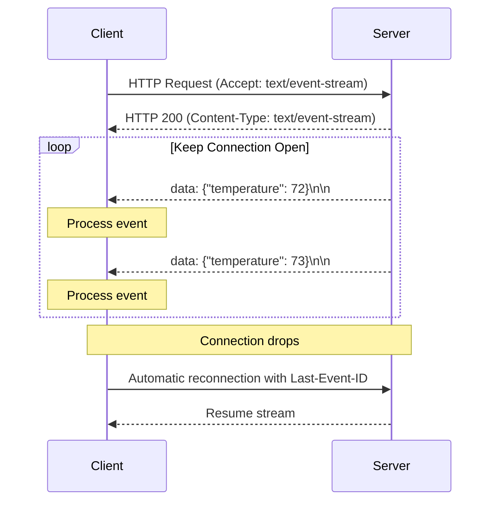
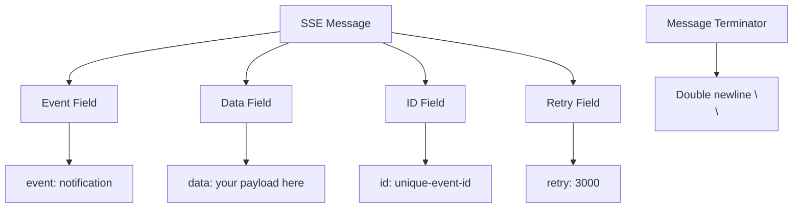
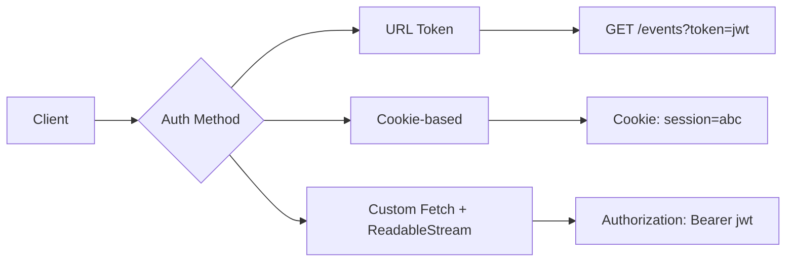
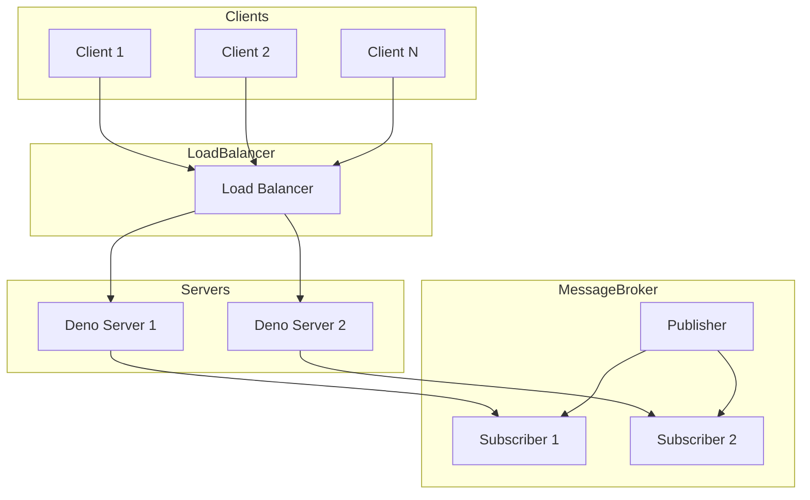

# How to Build Server-Sent Events in Deno

Author: [nawazdhandala](https://github.com/nawazdhandala)

Tags: Deno, Server-Sent Events, SSE, Real-time

Description: Learn how to implement Server-Sent Events (SSE) in Deno for real-time server-to-client communication with practical examples including live dashboards and event streaming.

---

Real-time communication is essential for modern web applications. Whether you are building live dashboards, notification systems, or streaming updates, you need a reliable way to push data from your server to clients. Server-Sent Events (SSE) provides an elegant, standards-based solution that is simpler than WebSockets for many use cases. In this guide, we will explore how to implement SSE in Deno, covering everything from basic concepts to production-ready patterns.

## Understanding Server-Sent Events

Server-Sent Events is a web standard that enables servers to push updates to clients over a single HTTP connection. Unlike traditional polling where clients repeatedly ask for updates, SSE establishes a persistent connection that the server uses to send data whenever it becomes available.

### How SSE Works

The following diagram illustrates the SSE communication flow:



### SSE vs WebSockets: Choosing the Right Tool

Before diving into implementation, it is important to understand when to use SSE versus WebSockets.

| Feature | Server-Sent Events | WebSockets |
|---------|-------------------|------------|
| Communication | Unidirectional (server to client) | Bidirectional |
| Protocol | HTTP/1.1 or HTTP/2 | WebSocket protocol (ws://) |
| Reconnection | Built-in automatic reconnection | Manual implementation required |
| Data format | Text-based (UTF-8) | Text or binary |
| Browser support | Excellent (EventSource API) | Excellent |
| Complexity | Simple | More complex |
| Firewall friendly | Yes (standard HTTP) | May require configuration |

**Choose SSE when:**
- You only need server-to-client communication
- You want automatic reconnection handling
- You prefer working with standard HTTP infrastructure
- Your data is text-based (JSON, plain text)

**Choose WebSockets when:**
- You need bidirectional real-time communication
- You are building chat applications or collaborative tools
- You need to send binary data efficiently
- Low latency in both directions is critical

## Creating Your First SSE Endpoint in Deno

Let us start with a basic SSE endpoint. Deno's built-in HTTP server makes this straightforward.

This example creates a minimal SSE server that sends the current time every second:

```typescript
// Basic SSE server in Deno
// This creates a simple endpoint that streams time updates

Deno.serve({ port: 8000 }, (request: Request): Response => {
  // Create a readable stream that will emit events
  const stream = new ReadableStream({
    start(controller) {
      // Send an event every second
      const intervalId = setInterval(() => {
        const data = JSON.stringify({ 
          time: new Date().toISOString(),
          timestamp: Date.now()
        });
        
        // SSE format: "data: " prefix, followed by data, then double newline
        controller.enqueue(new TextEncoder().encode(`data: ${data}\n\n`));
      }, 1000);

      // Clean up when the connection closes
      request.signal.addEventListener("abort", () => {
        clearInterval(intervalId);
        controller.close();
      });
    },
  });

  // Return the response with SSE-specific headers
  return new Response(stream, {
    headers: {
      "Content-Type": "text/event-stream",
      "Cache-Control": "no-cache",
      "Connection": "keep-alive",
    },
  });
});

console.log("SSE server running on http://localhost:8000");
```

## Understanding SSE Event Format

SSE uses a specific text format for events. Each event consists of one or more fields, with each field on its own line. Events are separated by double newlines.

The following diagram shows the structure of SSE messages:



This helper class formats SSE events with all available fields:

```typescript
// SSE Event formatter class
// Handles proper formatting of all SSE fields

class SSEEvent {
  private event?: string;
  private data: string;
  private id?: string;
  private retry?: number;

  constructor(data: string | object) {
    // Convert objects to JSON strings automatically
    this.data = typeof data === "object" ? JSON.stringify(data) : data;
  }

  // Set the event type (allows clients to listen for specific events)
  setEvent(event: string): SSEEvent {
    this.event = event;
    return this;
  }

  // Set a unique ID for reconnection support
  setId(id: string): SSEEvent {
    this.id = id;
    return this;
  }

  // Set retry interval in milliseconds
  setRetry(ms: number): SSEEvent {
    this.retry = ms;
    return this;
  }

  // Convert to SSE wire format
  toString(): string {
    let result = "";
    
    if (this.id) {
      result += `id: ${this.id}\n`;
    }
    
    if (this.event) {
      result += `event: ${this.event}\n`;
    }
    
    if (this.retry !== undefined) {
      result += `retry: ${this.retry}\n`;
    }
    
    // Handle multi-line data by prefixing each line
    const lines = this.data.split("\n");
    for (const line of lines) {
      result += `data: ${line}\n`;
    }
    
    // Double newline marks end of event
    result += "\n";
    
    return result;
  }
}
```

## Handling Multiple Event Types

Real applications often need to send different types of events. SSE supports named events through the `event` field, and clients can register specific handlers for each type.

This server demonstrates sending multiple event types for a monitoring dashboard:

```typescript
// Multi-event SSE server for a monitoring dashboard
// Sends different event types: metrics, alerts, and status updates

interface MetricsData {
  cpu: number;
  memory: number;
  requests: number;
}

interface AlertData {
  level: "info" | "warning" | "critical";
  message: string;
  source: string;
}

interface StatusData {
  service: string;
  status: "healthy" | "degraded" | "down";
}

Deno.serve({ port: 8000 }, (request: Request): Response => {
  const url = new URL(request.url);
  
  if (url.pathname !== "/events") {
    return new Response("Not found", { status: 404 });
  }

  let eventCounter = 0;
  
  const stream = new ReadableStream({
    start(controller) {
      const encoder = new TextEncoder();
      
      // Helper to send formatted events
      const sendEvent = (eventType: string, data: object) => {
        eventCounter++;
        const event = new SSEEvent(data)
          .setEvent(eventType)
          .setId(eventCounter.toString())
          .setRetry(5000);
        controller.enqueue(encoder.encode(event.toString()));
      };

      // Send metrics every 2 seconds
      const metricsInterval = setInterval(() => {
        const metrics: MetricsData = {
          cpu: Math.random() * 100,
          memory: Math.random() * 100,
          requests: Math.floor(Math.random() * 1000),
        };
        sendEvent("metrics", metrics);
      }, 2000);

      // Send random alerts occasionally
      const alertInterval = setInterval(() => {
        if (Math.random() > 0.7) {
          const levels: AlertData["level"][] = ["info", "warning", "critical"];
          const alert: AlertData = {
            level: levels[Math.floor(Math.random() * levels.length)],
            message: "Sample alert message",
            source: "monitoring-service",
          };
          sendEvent("alert", alert);
        }
      }, 5000);

      // Send status updates every 10 seconds
      const statusInterval = setInterval(() => {
        const statuses: StatusData["status"][] = ["healthy", "degraded", "down"];
        const status: StatusData = {
          service: "api-gateway",
          status: statuses[Math.floor(Math.random() * statuses.length)],
        };
        sendEvent("status", status);
      }, 10000);

      // Clean up on connection close
      request.signal.addEventListener("abort", () => {
        clearInterval(metricsInterval);
        clearInterval(alertInterval);
        clearInterval(statusInterval);
        controller.close();
      });
    },
  });

  return new Response(stream, {
    headers: {
      "Content-Type": "text/event-stream",
      "Cache-Control": "no-cache",
      "Connection": "keep-alive",
      "Access-Control-Allow-Origin": "*",
    },
  });
});
```

## Client-Side Implementation with EventSource

The browser provides the `EventSource` API for consuming SSE streams. It handles connection management, automatic reconnection, and event parsing.

This HTML page consumes the multi-event SSE stream and displays updates in a dashboard:

```html
<!DOCTYPE html>
<html lang="en">
<head>
  <meta charset="UTF-8">
  <title>Live Monitoring Dashboard</title>
  <style>
    body { font-family: system-ui, sans-serif; padding: 20px; }
    .card { border: 1px solid #ddd; padding: 15px; margin: 10px 0; border-radius: 8px; }
    .metrics { background: #f0f9ff; }
    .alert { background: #fef3c7; }
    .alert.critical { background: #fee2e2; }
    .status { background: #f0fdf4; }
    .status.down { background: #fee2e2; }
  </style>
</head>
<body>
  <h1>Live Monitoring Dashboard</h1>
  <div id="connection-status">Connecting...</div>
  <div id="metrics" class="card metrics">Waiting for metrics...</div>
  <div id="alerts"></div>
  <div id="status" class="card status">Waiting for status...</div>

  <script>
    // Create EventSource connection to the SSE endpoint
    const eventSource = new EventSource("http://localhost:8000/events");
    
    // Connection opened successfully
    eventSource.onopen = () => {
      document.getElementById("connection-status").textContent = "Connected";
      document.getElementById("connection-status").style.color = "green";
    };
    
    // Handle connection errors and reconnection
    eventSource.onerror = (error) => {
      document.getElementById("connection-status").textContent = "Reconnecting...";
      document.getElementById("connection-status").style.color = "orange";
    };
    
    // Listen for 'metrics' events specifically
    eventSource.addEventListener("metrics", (event) => {
      const data = JSON.parse(event.data);
      document.getElementById("metrics").innerHTML = `
        <h3>System Metrics</h3>
        <p>CPU: ${data.cpu.toFixed(1)}%</p>
        <p>Memory: ${data.memory.toFixed(1)}%</p>
        <p>Requests/min: ${data.requests}</p>
        <small>Event ID: ${event.lastEventId}</small>
      `;
    });
    
    // Listen for 'alert' events
    eventSource.addEventListener("alert", (event) => {
      const data = JSON.parse(event.data);
      const alertDiv = document.createElement("div");
      alertDiv.className = `card alert ${data.level}`;
      alertDiv.innerHTML = `
        <strong>[${data.level.toUpperCase()}]</strong> ${data.message}
        <small>(Source: ${data.source})</small>
      `;
      document.getElementById("alerts").prepend(alertDiv);
      
      // Keep only the last 5 alerts
      const alerts = document.getElementById("alerts").children;
      while (alerts.length > 5) {
        alerts[alerts.length - 1].remove();
      }
    });
    
    // Listen for 'status' events
    eventSource.addEventListener("status", (event) => {
      const data = JSON.parse(event.data);
      const statusDiv = document.getElementById("status");
      statusDiv.className = `card status ${data.status}`;
      statusDiv.innerHTML = `
        <h3>Service Status</h3>
        <p>${data.service}: <strong>${data.status}</strong></p>
      `;
    });
    
    // Clean up when page unloads
    window.addEventListener("beforeunload", () => {
      eventSource.close();
    });
  </script>
</body>
</html>
```

## Implementing Reconnection with Last-Event-ID

One of SSE's most valuable features is automatic reconnection. When a connection drops, the browser sends the `Last-Event-ID` header, allowing the server to resume from where it left off.

This server implementation supports resuming event streams after reconnection:

```typescript
// SSE server with reconnection support
// Tracks events and resumes from the last received event

interface StoredEvent {
  id: number;
  type: string;
  data: object;
  timestamp: number;
}

// In-memory event buffer (use Redis or similar in production)
const eventBuffer: StoredEvent[] = [];
const MAX_BUFFER_SIZE = 1000;
let globalEventId = 0;

// Add event to buffer
function storeEvent(type: string, data: object): number {
  globalEventId++;
  const event: StoredEvent = {
    id: globalEventId,
    type,
    data,
    timestamp: Date.now(),
  };
  
  eventBuffer.push(event);
  
  // Keep buffer size manageable
  if (eventBuffer.length > MAX_BUFFER_SIZE) {
    eventBuffer.shift();
  }
  
  return globalEventId;
}

// Get events after a specific ID
function getEventsSince(lastId: number): StoredEvent[] {
  return eventBuffer.filter(event => event.id > lastId);
}

Deno.serve({ port: 8000 }, (request: Request): Response => {
  // Get the Last-Event-ID header for reconnection
  const lastEventId = request.headers.get("Last-Event-ID");
  const resumeFromId = lastEventId ? parseInt(lastEventId, 10) : 0;
  
  console.log(`Client connected. Last-Event-ID: ${lastEventId || "none"}`);

  const stream = new ReadableStream({
    start(controller) {
      const encoder = new TextEncoder();
      
      const sendEvent = (id: number, type: string, data: object) => {
        const event = new SSEEvent(data)
          .setEvent(type)
          .setId(id.toString())
          .setRetry(3000);
        controller.enqueue(encoder.encode(event.toString()));
      };

      // Send any missed events first
      if (resumeFromId > 0) {
        const missedEvents = getEventsSince(resumeFromId);
        console.log(`Sending ${missedEvents.length} missed events`);
        
        for (const event of missedEvents) {
          sendEvent(event.id, event.type, event.data);
        }
      }

      // Continue with live events
      const interval = setInterval(() => {
        const data = {
          message: "Live update",
          timestamp: new Date().toISOString(),
        };
        const id = storeEvent("update", data);
        sendEvent(id, "update", data);
      }, 2000);

      request.signal.addEventListener("abort", () => {
        clearInterval(interval);
        controller.close();
        console.log("Client disconnected");
      });
    },
  });

  return new Response(stream, {
    headers: {
      "Content-Type": "text/event-stream",
      "Cache-Control": "no-cache",
      "Connection": "keep-alive",
    },
  });
});
```

## Adding Authentication to SSE Endpoints

SSE connections start as regular HTTP requests, so you can use standard authentication methods. However, the `EventSource` API has limitations with custom headers.

The following diagram shows authentication strategies for SSE:



This server implements token-based authentication for SSE:

```typescript
// SSE server with JWT authentication
// Validates tokens before establishing the event stream

interface User {
  id: string;
  name: string;
  role: string;
}

// Simple token validation (use a proper JWT library in production)
function validateToken(token: string): User | null {
  // In production, verify JWT signature and expiration
  if (token === "valid-token-123") {
    return { id: "user-1", name: "John Doe", role: "admin" };
  }
  return null;
}

Deno.serve({ port: 8000 }, (request: Request): Response => {
  const url = new URL(request.url);
  
  if (url.pathname !== "/events") {
    return new Response("Not found", { status: 404 });
  }

  // Try multiple authentication methods
  let token: string | null = null;
  
  // Method 1: Query parameter (for EventSource compatibility)
  token = url.searchParams.get("token");
  
  // Method 2: Authorization header (for custom implementations)
  if (!token) {
    const authHeader = request.headers.get("Authorization");
    if (authHeader?.startsWith("Bearer ")) {
      token = authHeader.slice(7);
    }
  }
  
  // Method 3: Cookie (for browser sessions)
  if (!token) {
    const cookies = request.headers.get("Cookie");
    if (cookies) {
      const match = cookies.match(/auth_token=([^;]+)/);
      token = match ? match[1] : null;
    }
  }

  // Validate authentication
  if (!token) {
    return new Response("Authentication required", { status: 401 });
  }

  const user = validateToken(token);
  if (!user) {
    return new Response("Invalid token", { status: 403 });
  }

  console.log(`Authenticated user: ${user.name} (${user.role})`);

  // Create authenticated event stream
  const stream = new ReadableStream({
    start(controller) {
      const encoder = new TextEncoder();
      
      // Send welcome event with user info
      const welcome = new SSEEvent({ 
        message: `Welcome, ${user.name}!`,
        userId: user.id,
        role: user.role 
      }).setEvent("connected");
      controller.enqueue(encoder.encode(welcome.toString()));

      const interval = setInterval(() => {
        const event = new SSEEvent({
          data: `Private data for ${user.name}`,
          timestamp: Date.now(),
        }).setEvent("update");
        controller.enqueue(encoder.encode(event.toString()));
      }, 3000);

      request.signal.addEventListener("abort", () => {
        clearInterval(interval);
        controller.close();
      });
    },
  });

  return new Response(stream, {
    headers: {
      "Content-Type": "text/event-stream",
      "Cache-Control": "no-cache, private",
      "Connection": "keep-alive",
    },
  });
});
```

For the client side, you can use the fetch API with custom headers when EventSource limitations are an issue:

```typescript
// Custom SSE client with authentication header support
// Use this when you need to send Authorization headers

async function connectWithAuth(url: string, token: string) {
  const response = await fetch(url, {
    headers: {
      "Authorization": `Bearer ${token}`,
      "Accept": "text/event-stream",
    },
  });

  if (!response.ok) {
    throw new Error(`HTTP ${response.status}: ${response.statusText}`);
  }

  const reader = response.body?.getReader();
  if (!reader) {
    throw new Error("No response body");
  }

  const decoder = new TextDecoder();
  let buffer = "";

  while (true) {
    const { done, value } = await reader.read();
    
    if (done) {
      console.log("Stream closed");
      break;
    }

    buffer += decoder.decode(value, { stream: true });
    
    // Process complete events (separated by double newlines)
    const events = buffer.split("\n\n");
    buffer = events.pop() || "";
    
    for (const eventText of events) {
      if (eventText.trim()) {
        const event = parseSSEEvent(eventText);
        console.log("Received event:", event);
      }
    }
  }
}

// Parse SSE event text into structured data
function parseSSEEvent(text: string): { event?: string; data?: string; id?: string } {
  const result: { event?: string; data?: string; id?: string } = {};
  const lines = text.split("\n");
  const dataLines: string[] = [];
  
  for (const line of lines) {
    if (line.startsWith("event:")) {
      result.event = line.slice(6).trim();
    } else if (line.startsWith("data:")) {
      dataLines.push(line.slice(5).trim());
    } else if (line.startsWith("id:")) {
      result.id = line.slice(3).trim();
    }
  }
  
  if (dataLines.length > 0) {
    result.data = dataLines.join("\n");
  }
  
  return result;
}
```

## Scaling SSE for Production

When scaling SSE to handle many concurrent connections, consider these architectural patterns:



This implementation uses a broadcast channel for multi-instance coordination:

```typescript
// Scalable SSE server using BroadcastChannel
// Enables event distribution across multiple server instances

// Create a broadcast channel for cross-instance communication
const channel = new BroadcastChannel("sse-events");

// Track connected clients
const clients = new Set<ReadableStreamDefaultController>();

// Listen for events from other instances
channel.onmessage = (event) => {
  const { type, data, id } = event.data;
  broadcastToLocalClients(type, data, id);
};

// Send to all local clients
function broadcastToLocalClients(type: string, data: object, id: string) {
  const encoder = new TextEncoder();
  const sseEvent = new SSEEvent(data)
    .setEvent(type)
    .setId(id);
  const encoded = encoder.encode(sseEvent.toString());
  
  for (const controller of clients) {
    try {
      controller.enqueue(encoded);
    } catch {
      // Client disconnected, remove from set
      clients.delete(controller);
    }
  }
}

// Publish event to all instances
function publishEvent(type: string, data: object) {
  const id = crypto.randomUUID();
  
  // Send to local clients
  broadcastToLocalClients(type, data, id);
  
  // Send to other instances via broadcast channel
  channel.postMessage({ type, data, id });
}

Deno.serve({ port: 8000 }, (request: Request): Response => {
  const url = new URL(request.url);
  
  // Endpoint to publish events
  if (url.pathname === "/publish" && request.method === "POST") {
    return request.json().then(body => {
      publishEvent(body.type || "message", body.data);
      return new Response(JSON.stringify({ success: true }), {
        headers: { "Content-Type": "application/json" },
      });
    });
  }
  
  // SSE endpoint
  if (url.pathname === "/events") {
    const stream = new ReadableStream({
      start(controller) {
        clients.add(controller);
        console.log(`Client connected. Total clients: ${clients.size}`);
        
        // Send heartbeat every 30 seconds to keep connection alive
        const heartbeat = setInterval(() => {
          try {
            controller.enqueue(new TextEncoder().encode(": heartbeat\n\n"));
          } catch {
            clearInterval(heartbeat);
          }
        }, 30000);
        
        request.signal.addEventListener("abort", () => {
          clearInterval(heartbeat);
          clients.delete(controller);
          controller.close();
          console.log(`Client disconnected. Total clients: ${clients.size}`);
        });
      },
    });

    return new Response(stream, {
      headers: {
        "Content-Type": "text/event-stream",
        "Cache-Control": "no-cache",
        "Connection": "keep-alive",
      },
    });
  }
  
  return new Response("Not found", { status: 404 });
});
```

## Building a Complete Live Updates Dashboard

Let us combine everything into a practical example: a live server monitoring dashboard.

This complete example creates a monitoring dashboard server:

```typescript
// Complete live monitoring dashboard with SSE
// Features: multiple metrics, alerts, and status updates

import { SSEEvent } from "./sse-event.ts"; // Use the SSEEvent class from earlier

interface ServerMetrics {
  serverId: string;
  cpu: number;
  memory: number;
  diskUsage: number;
  networkIn: number;
  networkOut: number;
  activeConnections: number;
  responseTime: number;
}

interface Incident {
  id: string;
  severity: "low" | "medium" | "high" | "critical";
  title: string;
  description: string;
  affectedServices: string[];
  startedAt: string;
  status: "investigating" | "identified" | "monitoring" | "resolved";
}

// Simulated server data
const servers = ["web-1", "web-2", "api-1", "api-2", "db-primary"];

function generateMetrics(serverId: string): ServerMetrics {
  return {
    serverId,
    cpu: Math.random() * 100,
    memory: 50 + Math.random() * 40,
    diskUsage: 30 + Math.random() * 50,
    networkIn: Math.random() * 1000,
    networkOut: Math.random() * 500,
    activeConnections: Math.floor(Math.random() * 1000),
    responseTime: 10 + Math.random() * 200,
  };
}

let eventId = 0;
const connectedClients = new Map<string, ReadableStreamDefaultController>();

function broadcast(eventType: string, data: object) {
  eventId++;
  const event = new SSEEvent(data)
    .setEvent(eventType)
    .setId(eventId.toString());
  const encoded = new TextEncoder().encode(event.toString());
  
  for (const [clientId, controller] of connectedClients) {
    try {
      controller.enqueue(encoded);
    } catch (error) {
      console.error(`Failed to send to client ${clientId}:`, error);
      connectedClients.delete(clientId);
    }
  }
}

// Start background event generators
setInterval(() => {
  // Send metrics for all servers
  for (const serverId of servers) {
    broadcast("metrics", generateMetrics(serverId));
  }
}, 2000);

setInterval(() => {
  // Occasionally generate incidents
  if (Math.random() > 0.8) {
    const severities: Incident["severity"][] = ["low", "medium", "high", "critical"];
    const statuses: Incident["status"][] = ["investigating", "identified", "monitoring"];
    
    const incident: Incident = {
      id: crypto.randomUUID(),
      severity: severities[Math.floor(Math.random() * severities.length)],
      title: "Elevated error rates detected",
      description: "API response times have increased above threshold",
      affectedServices: [servers[Math.floor(Math.random() * servers.length)]],
      startedAt: new Date().toISOString(),
      status: statuses[Math.floor(Math.random() * statuses.length)],
    };
    
    broadcast("incident", incident);
  }
}, 10000);

// HTTP server
Deno.serve({ port: 8000 }, (request: Request): Response => {
  const url = new URL(request.url);
  
  if (url.pathname === "/events") {
    const clientId = crypto.randomUUID();
    
    const stream = new ReadableStream({
      start(controller) {
        connectedClients.set(clientId, controller);
        console.log(`Client ${clientId} connected. Total: ${connectedClients.size}`);
        
        // Send initial state
        const welcome = new SSEEvent({
          clientId,
          servers,
          connectedAt: new Date().toISOString(),
        }).setEvent("welcome");
        controller.enqueue(new TextEncoder().encode(welcome.toString()));
        
        // Heartbeat
        const heartbeat = setInterval(() => {
          try {
            controller.enqueue(new TextEncoder().encode(": ping\n\n"));
          } catch {
            clearInterval(heartbeat);
          }
        }, 25000);
        
        request.signal.addEventListener("abort", () => {
          clearInterval(heartbeat);
          connectedClients.delete(clientId);
          controller.close();
          console.log(`Client ${clientId} disconnected. Total: ${connectedClients.size}`);
        });
      },
    });

    return new Response(stream, {
      headers: {
        "Content-Type": "text/event-stream",
        "Cache-Control": "no-cache",
        "Connection": "keep-alive",
        "Access-Control-Allow-Origin": "*",
      },
    });
  }
  
  // Serve the dashboard HTML
  if (url.pathname === "/" || url.pathname === "/dashboard") {
    return new Response(dashboardHTML, {
      headers: { "Content-Type": "text/html" },
    });
  }
  
  return new Response("Not found", { status: 404 });
});

const dashboardHTML = `
<!DOCTYPE html>
<html>
<head>
  <title>Server Monitoring Dashboard</title>
  <style>
    * { box-sizing: border-box; margin: 0; padding: 0; }
    body { font-family: system-ui; background: #1a1a2e; color: #eee; padding: 20px; }
    h1 { margin-bottom: 20px; }
    .grid { display: grid; grid-template-columns: repeat(auto-fill, minmax(300px, 1fr)); gap: 15px; }
    .server-card { background: #16213e; border-radius: 8px; padding: 15px; }
    .server-name { font-size: 1.2em; font-weight: bold; margin-bottom: 10px; }
    .metric { display: flex; justify-content: space-between; margin: 5px 0; }
    .metric-bar { height: 6px; background: #0f3460; border-radius: 3px; margin-top: 3px; }
    .metric-fill { height: 100%; border-radius: 3px; transition: width 0.3s; }
    .cpu .metric-fill { background: #00d9ff; }
    .memory .metric-fill { background: #00ff88; }
    .disk .metric-fill { background: #ff6b6b; }
    .incidents { margin-top: 20px; }
    .incident { background: #ff6b6b22; border-left: 3px solid #ff6b6b; padding: 10px; margin: 10px 0; }
    .incident.critical { border-color: #ff0000; background: #ff000022; }
    .status { padding: 5px 10px; font-size: 0.8em; border-radius: 4px; display: inline-block; }
  </style>
</head>
<body>
  <h1>Server Monitoring Dashboard</h1>
  <div id="status">Connecting...</div>
  <div class="grid" id="servers"></div>
  <div class="incidents" id="incidents"><h2>Recent Incidents</h2></div>
  
  <script>
    const serverData = {};
    const eventSource = new EventSource('/events');
    
    eventSource.addEventListener('welcome', (e) => {
      const data = JSON.parse(e.data);
      document.getElementById('status').textContent = 'Connected - ' + data.servers.length + ' servers';
    });
    
    eventSource.addEventListener('metrics', (e) => {
      const metrics = JSON.parse(e.data);
      serverData[metrics.serverId] = metrics;
      updateServerCard(metrics);
    });
    
    eventSource.addEventListener('incident', (e) => {
      const incident = JSON.parse(e.data);
      addIncident(incident);
    });
    
    eventSource.onerror = () => {
      document.getElementById('status').textContent = 'Reconnecting...';
    };
    
    function updateServerCard(metrics) {
      let card = document.getElementById('server-' + metrics.serverId);
      if (!card) {
        card = document.createElement('div');
        card.id = 'server-' + metrics.serverId;
        card.className = 'server-card';
        document.getElementById('servers').appendChild(card);
      }
      
      card.innerHTML = \`
        <div class="server-name">\${metrics.serverId}</div>
        <div class="metric cpu">
          <span>CPU</span><span>\${metrics.cpu.toFixed(1)}%</span>
        </div>
        <div class="metric-bar cpu"><div class="metric-fill" style="width: \${metrics.cpu}%"></div></div>
        <div class="metric memory">
          <span>Memory</span><span>\${metrics.memory.toFixed(1)}%</span>
        </div>
        <div class="metric-bar memory"><div class="metric-fill" style="width: \${metrics.memory}%"></div></div>
        <div class="metric disk">
          <span>Disk</span><span>\${metrics.diskUsage.toFixed(1)}%</span>
        </div>
        <div class="metric-bar disk"><div class="metric-fill" style="width: \${metrics.diskUsage}%"></div></div>
        <div class="metric"><span>Response Time</span><span>\${metrics.responseTime.toFixed(0)}ms</span></div>
        <div class="metric"><span>Connections</span><span>\${metrics.activeConnections}</span></div>
      \`;
    }
    
    function addIncident(incident) {
      const div = document.createElement('div');
      div.className = 'incident ' + incident.severity;
      div.innerHTML = \`
        <strong>\${incident.title}</strong>
        <span class="status">\${incident.status}</span>
        <p>\${incident.description}</p>
        <small>Affected: \${incident.affectedServices.join(', ')}</small>
      \`;
      document.getElementById('incidents').appendChild(div);
    }
  </script>
</body>
</html>
`;
```

## Best Practices Summary

When building SSE applications in Deno, follow these guidelines for robust, production-ready implementations:

**Connection Management**
- Always handle the `abort` signal to clean up resources when clients disconnect
- Implement heartbeat messages to detect stale connections (every 15-30 seconds)
- Set appropriate `retry` values (3000-5000ms) to control reconnection timing

**Event Design**
- Use meaningful event types to allow clients to subscribe to specific events
- Include unique IDs with every event to support reliable reconnection
- Keep payloads small and focused; send only necessary data

**Security**
- Validate authentication before establishing SSE connections
- Use HTTPS in production to encrypt the event stream
- Implement rate limiting to prevent abuse
- Never expose sensitive data in event payloads without authorization

**Scalability**
- Use broadcast channels or message brokers for multi-instance coordination
- Monitor connection counts and set appropriate limits
- Implement graceful shutdown to cleanly close client connections
- Consider connection pooling for upstream data sources

**Error Handling**
- Wrap event sending in try-catch blocks to handle disconnected clients
- Log errors appropriately for debugging
- Send error events to clients when recoverable errors occur
- Implement circuit breakers for external dependencies

## Conclusion

Server-Sent Events provide an elegant solution for real-time server-to-client communication in Deno applications. With its simpler implementation compared to WebSockets, built-in reconnection handling, and excellent browser support through the EventSource API, SSE is ideal for live dashboards, notification systems, and streaming updates.

In this guide, we covered the fundamentals of SSE, compared it with WebSockets, and built progressively complex examples from basic endpoints to a complete monitoring dashboard. We explored authentication strategies, reconnection handling with Last-Event-ID, and scaling patterns for production deployments.

Deno's modern runtime with native TypeScript support, built-in HTTP server, and web-standard APIs makes it an excellent choice for building SSE services. The examples provided are production-ready patterns that you can adapt for your specific use cases.

Start with simple SSE endpoints and gradually add features like authentication, event types, and reconnection support as your application requirements grow. With the patterns covered in this guide, you have the foundation to build robust real-time features in your Deno applications.
