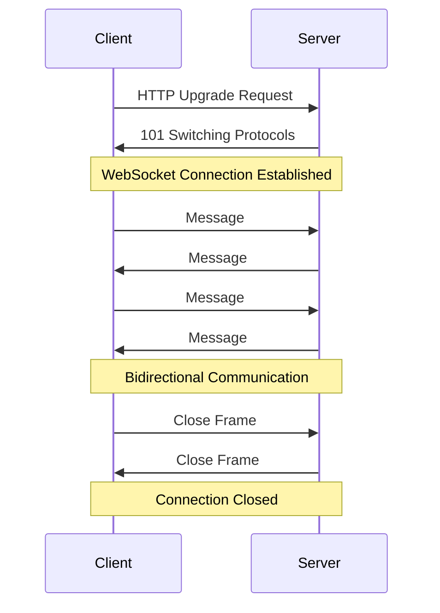
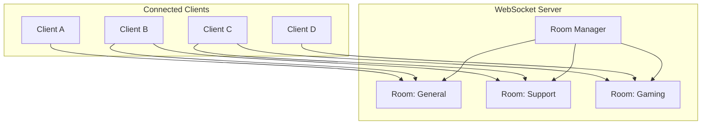
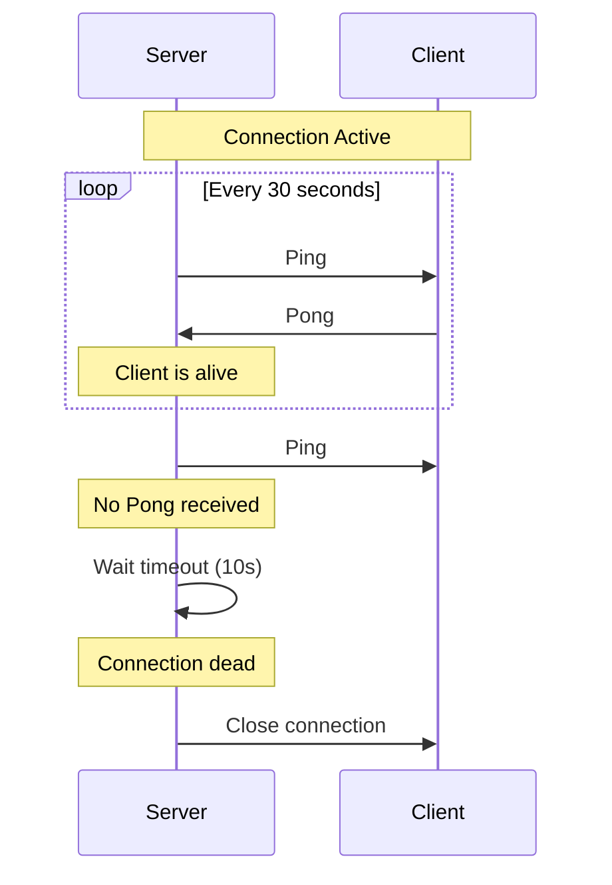
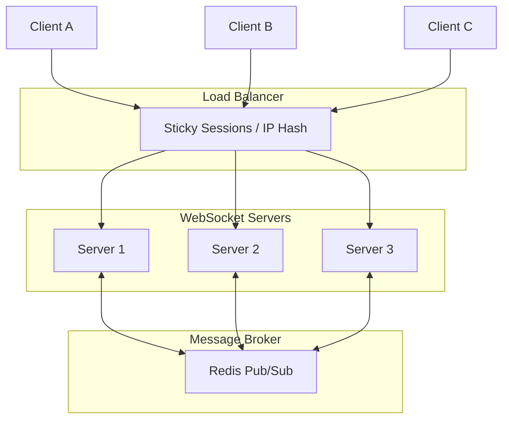

# How to Build WebSocket Servers in Deno

Author: [nawazdhandala](https://github.com/nawazdhandala)

Tags: Deno, WebSocket, Real-time, TypeScript

Description: Learn how to build production-ready WebSocket servers in Deno with authentication, rooms, broadcasting, and scaling strategies.

---

Real-time communication is essential for modern web applications. Whether you are building a chat application, live notifications, collaborative editing tools, or multiplayer games, WebSockets provide the foundation for bidirectional, low-latency communication between clients and servers. Deno, with its secure-by-default approach and native TypeScript support, offers an excellent platform for building WebSocket servers.

In this comprehensive guide, we will walk through building a production-ready WebSocket server in Deno. We will cover everything from basic concepts to advanced patterns like authentication, room management, and scaling considerations.

## Understanding WebSocket Basics

Before diving into code, let us understand how WebSockets work and why they are superior to traditional HTTP for real-time applications.

The following diagram illustrates the WebSocket connection lifecycle:



WebSockets provide several advantages over HTTP polling:

- **Persistent Connection**: A single TCP connection stays open, eliminating the overhead of repeated handshakes
- **Bidirectional Communication**: Both client and server can send messages at any time
- **Low Latency**: Messages are delivered instantly without polling delays
- **Reduced Bandwidth**: No HTTP headers for each message, resulting in smaller payloads

## Setting Up Your Deno Project

Deno requires no package.json or npm install. You can start writing WebSocket code immediately. However, for better organization, create a project structure:

```
websocket-server/
├── main.ts
├── handlers/
│   └── websocket.ts
├── services/
│   ├── auth.ts
│   └── rooms.ts
└── types/
    └── index.ts
```

## Creating a Basic WebSocket Server

Let us start with the simplest WebSocket server in Deno. This example creates a server that echoes back any message it receives:

```typescript
// main.ts - Basic WebSocket echo server
// Deno's native HTTP server handles the WebSocket upgrade automatically

const PORT = 8080;

function handleWebSocket(socket: WebSocket): void {
  console.log("Client connected");

  // Handle incoming messages from the client
  socket.onmessage = (event: MessageEvent) => {
    console.log("Received:", event.data);
    // Echo the message back to the client
    socket.send(`Echo: ${event.data}`);
  };

  // Handle client disconnection
  socket.onclose = () => {
    console.log("Client disconnected");
  };

  // Handle any errors that occur on the connection
  socket.onerror = (error: Event) => {
    console.error("WebSocket error:", error);
  };
}

Deno.serve({ port: PORT }, (request: Request) => {
  // Check if this is a WebSocket upgrade request
  const upgrade = request.headers.get("upgrade") || "";
  
  if (upgrade.toLowerCase() === "websocket") {
    // Upgrade the HTTP connection to WebSocket
    const { socket, response } = Deno.upgradeWebSocket(request);
    handleWebSocket(socket);
    return response;
  }

  // Return a simple response for non-WebSocket requests
  return new Response("WebSocket server is running. Connect via ws://localhost:8080");
});

console.log(`WebSocket server running on ws://localhost:${PORT}`);
```

Run the server with appropriate permissions:

```bash
deno run --allow-net main.ts
```

## Handling Multiple Connections

A real application needs to track multiple connected clients. We will create a connection manager that maintains a Set of active WebSocket connections:

```typescript
// services/connections.ts - Managing multiple WebSocket connections
// Using a Set provides O(1) add/delete operations for connection management

interface Client {
  id: string;
  socket: WebSocket;
  connectedAt: Date;
}

class ConnectionManager {
  // Store all active client connections
  private clients: Map<string, Client> = new Map();

  // Generate a unique identifier for each client
  private generateId(): string {
    return crypto.randomUUID();
  }

  // Add a new client connection to the manager
  addClient(socket: WebSocket): string {
    const id = this.generateId();
    const client: Client = {
      id,
      socket,
      connectedAt: new Date(),
    };
    this.clients.set(id, client);
    console.log(`Client ${id} connected. Total clients: ${this.clients.size}`);
    return id;
  }

  // Remove a client when they disconnect
  removeClient(id: string): void {
    this.clients.delete(id);
    console.log(`Client ${id} disconnected. Total clients: ${this.clients.size}`);
  }

  // Get a specific client by their ID
  getClient(id: string): Client | undefined {
    return this.clients.get(id);
  }

  // Get all currently connected clients
  getAllClients(): Client[] {
    return Array.from(this.clients.values());
  }

  // Get the total number of connected clients
  getClientCount(): number {
    return this.clients.size;
  }
}

export const connectionManager = new ConnectionManager();
```

## Broadcasting Messages

Broadcasting allows you to send a message to all connected clients or a subset of them. This is fundamental for features like chat rooms, live updates, and notifications:

```typescript
// services/broadcast.ts - Message broadcasting utilities
// Handles sending messages to multiple clients efficiently

import { connectionManager } from "./connections.ts";

interface BroadcastOptions {
  // Exclude specific client IDs from receiving the broadcast
  excludeIds?: string[];
  // Only send to specific client IDs
  includeIds?: string[];
}

// Send a message to all connected clients
export function broadcast(message: string, options: BroadcastOptions = {}): void {
  const clients = connectionManager.getAllClients();
  
  for (const client of clients) {
    // Skip excluded clients
    if (options.excludeIds?.includes(client.id)) {
      continue;
    }
    
    // If includeIds is specified, only send to those clients
    if (options.includeIds && !options.includeIds.includes(client.id)) {
      continue;
    }

    // Only send if the socket is open
    if (client.socket.readyState === WebSocket.OPEN) {
      try {
        client.socket.send(message);
      } catch (error) {
        console.error(`Failed to send to client ${client.id}:`, error);
      }
    }
  }
}

// Send a JSON message to all clients
export function broadcastJson(data: unknown, options: BroadcastOptions = {}): void {
  const message = JSON.stringify(data);
  broadcast(message, options);
}
```

## Implementing Rooms and Channels

For applications like chat, you need to organize clients into rooms or channels. This diagram shows the room-based architecture:



Here is the implementation of a room management system:

```typescript
// services/rooms.ts - Room/Channel management for WebSocket connections
// Allows clients to join multiple rooms and receive targeted broadcasts

interface Room {
  name: string;
  clientIds: Set<string>;
  createdAt: Date;
}

class RoomManager {
  // Store all active rooms
  private rooms: Map<string, Room> = new Map();

  // Create a new room or return existing one
  createRoom(name: string): Room {
    if (!this.rooms.has(name)) {
      const room: Room = {
        name,
        clientIds: new Set(),
        createdAt: new Date(),
      };
      this.rooms.set(name, room);
      console.log(`Room "${name}" created`);
    }
    return this.rooms.get(name)!;
  }

  // Add a client to a specific room
  joinRoom(roomName: string, clientId: string): void {
    const room = this.createRoom(roomName);
    room.clientIds.add(clientId);
    console.log(`Client ${clientId} joined room "${roomName}"`);
  }

  // Remove a client from a specific room
  leaveRoom(roomName: string, clientId: string): void {
    const room = this.rooms.get(roomName);
    if (room) {
      room.clientIds.delete(clientId);
      console.log(`Client ${clientId} left room "${roomName}"`);
      
      // Optionally delete empty rooms
      if (room.clientIds.size === 0) {
        this.rooms.delete(roomName);
        console.log(`Room "${roomName}" deleted (empty)`);
      }
    }
  }

  // Remove a client from all rooms (used on disconnect)
  removeClientFromAllRooms(clientId: string): void {
    for (const [roomName, room] of this.rooms) {
      if (room.clientIds.has(clientId)) {
        this.leaveRoom(roomName, clientId);
      }
    }
  }

  // Get all client IDs in a specific room
  getRoomClients(roomName: string): string[] {
    const room = this.rooms.get(roomName);
    return room ? Array.from(room.clientIds) : [];
  }

  // Get all rooms a client is in
  getClientRooms(clientId: string): string[] {
    const clientRooms: string[] = [];
    for (const [roomName, room] of this.rooms) {
      if (room.clientIds.has(clientId)) {
        clientRooms.push(roomName);
      }
    }
    return clientRooms;
  }

  // Broadcast a message to all clients in a room
  broadcastToRoom(roomName: string, message: string, excludeClientId?: string): void {
    const clientIds = this.getRoomClients(roomName);
    
    for (const clientId of clientIds) {
      if (clientId === excludeClientId) continue;
      
      const client = connectionManager.getClient(clientId);
      if (client && client.socket.readyState === WebSocket.OPEN) {
        try {
          client.socket.send(message);
        } catch (error) {
          console.error(`Failed to send to client ${clientId}:`, error);
        }
      }
    }
  }
}

export const roomManager = new RoomManager();
```

## Adding Authentication

Security is crucial for WebSocket connections. You can authenticate users during the initial HTTP upgrade request or after the connection is established. Here is an implementation using JWT tokens:

```typescript
// services/auth.ts - WebSocket authentication using JWT
// Validates tokens before allowing WebSocket connections

import { create, verify } from "https://deno.land/x/djwt@v3.0.1/mod.ts";

// Secret key for JWT signing (use environment variable in production)
const SECRET_KEY = await crypto.subtle.generateKey(
  { name: "HMAC", hash: "SHA-512" },
  true,
  ["sign", "verify"]
);

interface UserPayload {
  userId: string;
  username: string;
  roles: string[];
}

// Create a JWT token for a user
export async function createToken(user: UserPayload): Promise<string> {
  const payload = {
    ...user,
    exp: Math.floor(Date.now() / 1000) + (60 * 60), // 1 hour expiry
  };
  return await create({ alg: "HS512", typ: "JWT" }, payload, SECRET_KEY);
}

// Verify and decode a JWT token
export async function verifyToken(token: string): Promise<UserPayload | null> {
  try {
    const payload = await verify(token, SECRET_KEY);
    return payload as unknown as UserPayload;
  } catch (error) {
    console.error("Token verification failed:", error);
    return null;
  }
}

// Extract token from WebSocket request URL or headers
export function extractToken(request: Request): string | null {
  // Check URL query parameter first
  const url = new URL(request.url);
  const tokenFromQuery = url.searchParams.get("token");
  if (tokenFromQuery) return tokenFromQuery;

  // Check Authorization header
  const authHeader = request.headers.get("authorization");
  if (authHeader?.startsWith("Bearer ")) {
    return authHeader.slice(7);
  }

  return null;
}

// Authenticate a WebSocket connection request
export async function authenticateConnection(
  request: Request
): Promise<UserPayload | null> {
  const token = extractToken(request);
  if (!token) {
    console.log("No token provided");
    return null;
  }

  return await verifyToken(token);
}
```

Integrate authentication into the main server:

```typescript
// main.ts - WebSocket server with authentication
// Rejects connections that fail authentication

import { authenticateConnection } from "./services/auth.ts";

Deno.serve({ port: 8080 }, async (request: Request) => {
  const upgrade = request.headers.get("upgrade") || "";

  if (upgrade.toLowerCase() === "websocket") {
    // Authenticate before upgrading the connection
    const user = await authenticateConnection(request);
    
    if (!user) {
      // Reject unauthenticated connections
      return new Response("Unauthorized", { status: 401 });
    }

    const { socket, response } = Deno.upgradeWebSocket(request);
    
    // Pass user information to the handler
    handleAuthenticatedWebSocket(socket, user);
    return response;
  }

  return new Response("WebSocket server running");
});
```

## Implementing Heartbeat and Ping-Pong

Long-lived connections can become stale. Implementing heartbeat mechanisms helps detect dead connections and keep firewalls from closing idle connections:



Here is the implementation:

```typescript
// services/heartbeat.ts - Connection health monitoring with ping-pong
// Automatically closes stale connections that do not respond to pings

interface HeartbeatConfig {
  pingInterval: number;  // How often to send pings (ms)
  pongTimeout: number;   // How long to wait for pong (ms)
}

const DEFAULT_CONFIG: HeartbeatConfig = {
  pingInterval: 30000,  // 30 seconds
  pongTimeout: 10000,   // 10 seconds
};

class HeartbeatManager {
  // Track pending pongs for each client
  private pendingPongs: Map<string, NodeJS.Timeout> = new Map();
  // Track ping intervals for each client
  private pingIntervals: Map<string, NodeJS.Timeout> = new Map();
  
  private config: HeartbeatConfig;

  constructor(config: Partial<HeartbeatConfig> = {}) {
    this.config = { ...DEFAULT_CONFIG, ...config };
  }

  // Start heartbeat monitoring for a client
  startHeartbeat(clientId: string, socket: WebSocket): void {
    // Send ping at regular intervals
    const pingInterval = setInterval(() => {
      if (socket.readyState !== WebSocket.OPEN) {
        this.stopHeartbeat(clientId);
        return;
      }

      // Send ping message
      try {
        socket.send(JSON.stringify({ type: "ping", timestamp: Date.now() }));
      } catch (error) {
        console.error(`Failed to send ping to ${clientId}:`, error);
        this.stopHeartbeat(clientId);
        return;
      }

      // Set timeout for pong response
      const pongTimeout = setTimeout(() => {
        console.log(`Client ${clientId} did not respond to ping, closing connection`);
        socket.close(1000, "Heartbeat timeout");
        this.stopHeartbeat(clientId);
      }, this.config.pongTimeout);

      this.pendingPongs.set(clientId, pongTimeout);
    }, this.config.pingInterval);

    this.pingIntervals.set(clientId, pingInterval);
    console.log(`Heartbeat started for client ${clientId}`);
  }

  // Called when a pong is received from client
  receivedPong(clientId: string): void {
    const timeout = this.pendingPongs.get(clientId);
    if (timeout) {
      clearTimeout(timeout);
      this.pendingPongs.delete(clientId);
    }
  }

  // Stop heartbeat monitoring for a client
  stopHeartbeat(clientId: string): void {
    const interval = this.pingIntervals.get(clientId);
    if (interval) {
      clearInterval(interval);
      this.pingIntervals.delete(clientId);
    }

    const timeout = this.pendingPongs.get(clientId);
    if (timeout) {
      clearTimeout(timeout);
      this.pendingPongs.delete(clientId);
    }

    console.log(`Heartbeat stopped for client ${clientId}`);
  }
}

export const heartbeatManager = new HeartbeatManager();
```

## Robust Error Handling

Production WebSocket servers need comprehensive error handling. Here is a pattern that handles various failure scenarios:

```typescript
// handlers/websocket.ts - Comprehensive WebSocket error handling
// Gracefully handles all error scenarios and cleanup

import { connectionManager } from "../services/connections.ts";
import { roomManager } from "../services/rooms.ts";
import { heartbeatManager } from "../services/heartbeat.ts";

interface MessageHandler {
  (clientId: string, data: unknown): void;
}

const messageHandlers: Map<string, MessageHandler> = new Map();

// Register a handler for a specific message type
export function registerHandler(type: string, handler: MessageHandler): void {
  messageHandlers.set(type, handler);
}

// Parse and validate incoming messages
function parseMessage(data: string): { type: string; payload: unknown } | null {
  try {
    const parsed = JSON.parse(data);
    if (typeof parsed.type !== "string") {
      throw new Error("Message must have a type field");
    }
    return parsed;
  } catch (error) {
    console.error("Failed to parse message:", error);
    return null;
  }
}

// Main WebSocket handler with full error handling
export function handleWebSocket(socket: WebSocket, userId?: string): void {
  // Add client to connection manager
  const clientId = connectionManager.addClient(socket);

  // Start heartbeat monitoring
  heartbeatManager.startHeartbeat(clientId, socket);

  // Send welcome message with client ID
  socket.send(JSON.stringify({
    type: "connected",
    clientId,
    timestamp: Date.now(),
  }));

  // Handle incoming messages
  socket.onmessage = (event: MessageEvent) => {
    try {
      const data = typeof event.data === "string" 
        ? event.data 
        : new TextDecoder().decode(event.data);

      const message = parseMessage(data);
      if (!message) {
        socket.send(JSON.stringify({
          type: "error",
          error: "Invalid message format",
        }));
        return;
      }

      // Handle pong messages for heartbeat
      if (message.type === "pong") {
        heartbeatManager.receivedPong(clientId);
        return;
      }

      // Find and execute the appropriate handler
      const handler = messageHandlers.get(message.type);
      if (handler) {
        handler(clientId, message.payload);
      } else {
        socket.send(JSON.stringify({
          type: "error",
          error: `Unknown message type: ${message.type}`,
        }));
      }
    } catch (error) {
      console.error(`Error processing message from ${clientId}:`, error);
      socket.send(JSON.stringify({
        type: "error",
        error: "Internal server error",
      }));
    }
  };

  // Handle connection close
  socket.onclose = (event: CloseEvent) => {
    console.log(`Client ${clientId} disconnected: code=${event.code}, reason=${event.reason}`);
    cleanup(clientId);
  };

  // Handle errors
  socket.onerror = (error: Event) => {
    console.error(`WebSocket error for client ${clientId}:`, error);
    cleanup(clientId);
  };
}

// Cleanup all resources associated with a client
function cleanup(clientId: string): void {
  heartbeatManager.stopHeartbeat(clientId);
  roomManager.removeClientFromAllRooms(clientId);
  connectionManager.removeClient(clientId);
}
```

## Building a Complete Chat Application

Let us put everything together into a functional chat application:

```typescript
// main.ts - Complete chat application server
// Combines all services into a working real-time chat system

import { handleWebSocket, registerHandler } from "./handlers/websocket.ts";
import { roomManager } from "./services/rooms.ts";
import { connectionManager } from "./services/connections.ts";
import { authenticateConnection, UserPayload } from "./services/auth.ts";

// Store user information with client IDs
const clientUsers: Map<string, UserPayload> = new Map();

// Handler for joining a chat room
registerHandler("join_room", (clientId: string, payload: unknown) => {
  const { room } = payload as { room: string };
  const user = clientUsers.get(clientId);
  
  roomManager.joinRoom(room, clientId);
  
  // Notify room members
  roomManager.broadcastToRoom(room, JSON.stringify({
    type: "user_joined",
    room,
    username: user?.username || "Anonymous",
    timestamp: Date.now(),
  }), clientId);

  // Send confirmation to the joining client
  const client = connectionManager.getClient(clientId);
  client?.socket.send(JSON.stringify({
    type: "room_joined",
    room,
    members: roomManager.getRoomClients(room).length,
  }));
});

// Handler for leaving a chat room
registerHandler("leave_room", (clientId: string, payload: unknown) => {
  const { room } = payload as { room: string };
  const user = clientUsers.get(clientId);
  
  roomManager.leaveRoom(room, clientId);
  
  // Notify remaining room members
  roomManager.broadcastToRoom(room, JSON.stringify({
    type: "user_left",
    room,
    username: user?.username || "Anonymous",
    timestamp: Date.now(),
  }));
});

// Handler for sending chat messages
registerHandler("chat_message", (clientId: string, payload: unknown) => {
  const { room, message } = payload as { room: string; message: string };
  const user = clientUsers.get(clientId);
  
  // Validate message length
  if (message.length > 1000) {
    const client = connectionManager.getClient(clientId);
    client?.socket.send(JSON.stringify({
      type: "error",
      error: "Message too long (max 1000 characters)",
    }));
    return;
  }
  
  // Broadcast message to room
  roomManager.broadcastToRoom(room, JSON.stringify({
    type: "chat_message",
    room,
    username: user?.username || "Anonymous",
    message,
    timestamp: Date.now(),
  }));
});

// Handler for typing indicators
registerHandler("typing", (clientId: string, payload: unknown) => {
  const { room, isTyping } = payload as { room: string; isTyping: boolean };
  const user = clientUsers.get(clientId);
  
  roomManager.broadcastToRoom(room, JSON.stringify({
    type: "typing",
    room,
    username: user?.username || "Anonymous",
    isTyping,
  }), clientId);
});

// Start the server
const PORT = 8080;

Deno.serve({ port: PORT }, async (request: Request) => {
  const upgrade = request.headers.get("upgrade") || "";

  if (upgrade.toLowerCase() === "websocket") {
    const user = await authenticateConnection(request);
    
    if (!user) {
      return new Response("Unauthorized", { status: 401 });
    }

    const { socket, response } = Deno.upgradeWebSocket(request);
    
    // Handle the connection and store user info
    handleWebSocket(socket, user.userId);
    
    // We need to store user info after getting clientId
    socket.onopen = () => {
      // This is a simplified approach - in production you would handle this differently
    };
    
    return response;
  }

  // Serve a simple HTML client for testing
  if (request.method === "GET" && new URL(request.url).pathname === "/") {
    return new Response(getTestClientHtml(), {
      headers: { "content-type": "text/html" },
    });
  }

  return new Response("WebSocket Chat Server", { status: 200 });
});

console.log(`Chat server running on http://localhost:${PORT}`);
```

## Scaling Considerations

When your application grows, a single server will not be enough. Here are strategies for scaling WebSocket servers:



Key scaling strategies include:

**Sticky Sessions**: Configure your load balancer to route clients to the same server. This ensures WebSocket connections stay on one server.

**Pub/Sub for Cross-Server Communication**: Use Redis or similar message brokers to broadcast messages across servers:

```typescript
// services/pubsub.ts - Redis pub/sub for multi-server communication
// Enables broadcasting messages across multiple WebSocket server instances

import { connect } from "https://deno.land/x/redis@v0.31.0/mod.ts";

const REDIS_URL = Deno.env.get("REDIS_URL") || "redis://localhost:6379";

class PubSubManager {
  private publisher: Awaited<ReturnType<typeof connect>> | null = null;
  private subscriber: Awaited<ReturnType<typeof connect>> | null = null;
  private handlers: Map<string, (message: string) => void> = new Map();

  async initialize(): Promise<void> {
    // Create separate connections for publishing and subscribing
    this.publisher = await connect({ hostname: "localhost", port: 6379 });
    this.subscriber = await connect({ hostname: "localhost", port: 6379 });
    
    console.log("Connected to Redis for pub/sub");
  }

  // Publish a message to a channel
  async publish(channel: string, message: string): Promise<void> {
    if (!this.publisher) {
      throw new Error("PubSub not initialized");
    }
    await this.publisher.publish(channel, message);
  }

  // Subscribe to a channel
  async subscribe(channel: string, handler: (message: string) => void): Promise<void> {
    if (!this.subscriber) {
      throw new Error("PubSub not initialized");
    }
    
    this.handlers.set(channel, handler);
    const sub = await this.subscriber.subscribe(channel);
    
    // Process incoming messages
    (async () => {
      for await (const { message } of sub.receive()) {
        const channelHandler = this.handlers.get(channel);
        if (channelHandler) {
          channelHandler(message);
        }
      }
    })();
  }
}

export const pubSubManager = new PubSubManager();
```

**Connection State Storage**: Store connection metadata in Redis so any server can look up user information:

```typescript
// Store user session in Redis when they connect
await redis.set(`session:${clientId}`, JSON.stringify({
  userId: user.userId,
  serverId: SERVER_ID,
  connectedAt: Date.now(),
}), { ex: 3600 }); // 1 hour expiry
```

## Best Practices Summary

Following these best practices will help you build robust WebSocket servers:

1. **Always validate incoming messages**: Never trust client data. Validate message format, types, and content length before processing.

2. **Implement proper authentication**: Authenticate during the HTTP upgrade request when possible. Use short-lived tokens and implement token refresh mechanisms.

3. **Use heartbeat mechanisms**: Implement ping-pong to detect dead connections and prevent resource leaks from zombie connections.

4. **Handle reconnection gracefully**: Clients will disconnect. Design your protocol to handle reconnection and state synchronization.

5. **Rate limit messages**: Prevent abuse by limiting how many messages a client can send per second. Implement backpressure when needed.

6. **Clean up resources**: Always clean up connection state, room memberships, and intervals when a client disconnects.

7. **Log comprehensively**: Log connection events, errors, and important business events for debugging and monitoring.

8. **Use structured messages**: Define a clear message protocol with types and payloads. Consider using a schema validation library.

9. **Plan for horizontal scaling**: Design your architecture to work across multiple servers from the start using pub/sub patterns.

10. **Implement graceful shutdown**: Handle server shutdown gracefully by closing connections properly and notifying clients.

## Conclusion

Building WebSocket servers in Deno is straightforward thanks to its native support and modern APIs. We have covered the essential concepts from basic echo servers to production-ready features like authentication, rooms, heartbeats, and scaling strategies.

The key takeaways are:

- Deno provides native WebSocket support through `Deno.upgradeWebSocket()`
- Manage connections with proper tracking and cleanup
- Implement rooms for organizing clients into groups
- Use heartbeat mechanisms to detect and clean up dead connections
- Authenticate connections during the HTTP upgrade phase
- Plan for horizontal scaling with pub/sub patterns

With these patterns in place, you can build real-time applications that are secure, scalable, and maintainable. Start with the basic examples and incrementally add features as your application grows.

For production deployments, consider using Deno Deploy for easy global distribution of your WebSocket servers, or containerize your application with Docker for traditional infrastructure. Always monitor your connections, implement proper logging, and have alerting in place for connection anomalies.

Happy coding with Deno and WebSockets!
