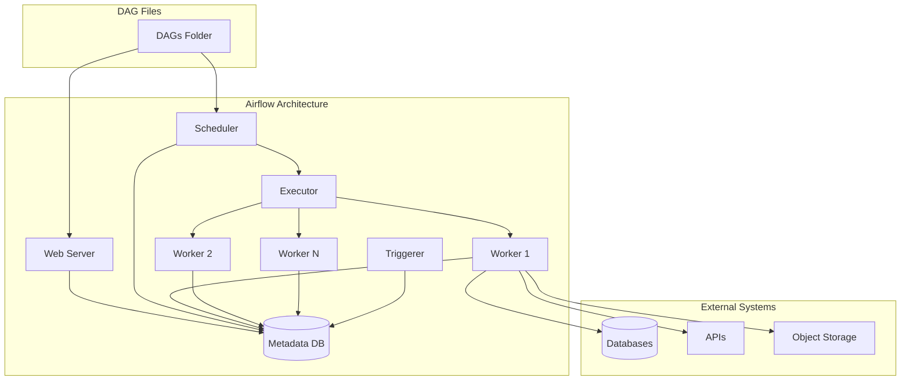
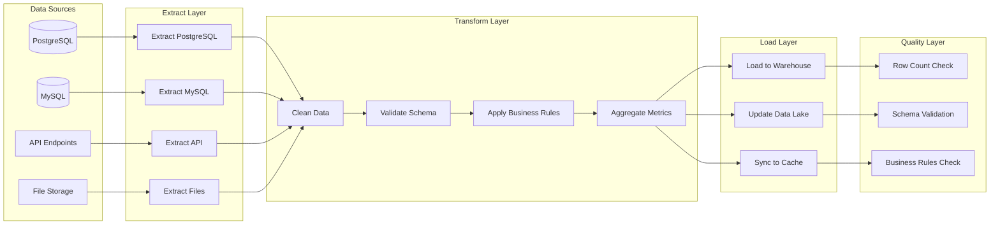
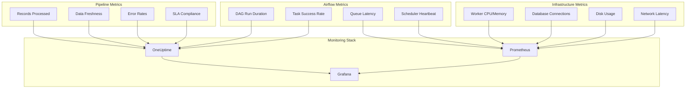
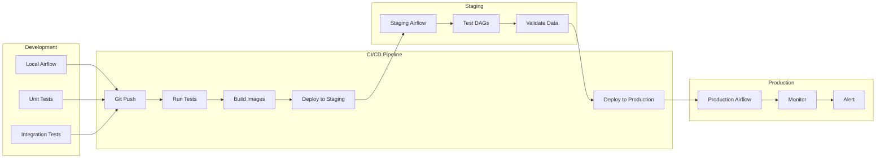

# How to Implement Data Pipeline Orchestration with Airflow

Author: [nawazdhandala](https://www.github.com/nawazdhandala)

Tags: Airflow, Data Engineering, ETL, Orchestration, Python, Data Pipelines, Apache Airflow, Workflow Management

Description: A comprehensive guide to implementing data pipeline orchestration with Apache Airflow, covering DAG design, task dependencies, operators, error handling, and production best practices for building reliable data workflows.

---

> Data pipeline orchestration is the backbone of modern data engineering. Apache Airflow has emerged as the industry standard for defining, scheduling, and monitoring complex data workflows. This guide walks you through implementing robust data pipeline orchestration from scratch.

Whether you are building ETL pipelines, ML training workflows, or data synchronization jobs, Airflow provides the tools to make your pipelines reliable, observable, and maintainable. We will cover everything from basic concepts to advanced patterns used in production environments.

---

## Prerequisites

Before we begin, ensure you have:
- Python 3.8 or higher
- Apache Airflow 2.x installed
- Basic understanding of Python and SQL
- Docker (optional, for local development)
- A monitoring solution like [OneUptime](https://oneuptime.com) for pipeline observability

---

## Understanding Airflow Architecture

Airflow consists of several components that work together to orchestrate your pipelines. Understanding this architecture helps you design better workflows and troubleshoot issues effectively.



### Core Components

- **Scheduler**: Parses DAG files, schedules tasks, and submits them to the executor
- **Executor**: Determines how tasks run (locally, on Celery workers, Kubernetes pods, etc.)
- **Workers**: Execute the actual task logic
- **Web Server**: Provides the UI for monitoring and managing DAGs
- **Metadata Database**: Stores DAG state, task history, connections, and variables
- **Triggerer**: Handles deferrable operators efficiently

---

## Building Your First Data Pipeline

Let us start with a complete ETL pipeline that extracts data from a source, transforms it, and loads it into a data warehouse.

### Project Structure

Organize your Airflow project for maintainability and scalability.

```
airflow/
├── dags/
│   ├── __init__.py
│   ├── etl_pipeline.py
│   ├── data_sync_pipeline.py
│   └── common/
│       ├── __init__.py
│       ├── operators.py
│       └── utils.py
├── plugins/
│   └── custom_operators/
│       └── __init__.py
├── tests/
│   ├── __init__.py
│   └── test_etl_pipeline.py
├── config/
│   └── pipeline_config.yaml
└── requirements.txt
```

### Complete ETL Pipeline Example

This example demonstrates a production-ready ETL pipeline with proper structure, error handling, and observability.

```python
# dags/etl_pipeline.py
# This DAG implements a complete ETL pipeline for sales data processing.
# It extracts data from a PostgreSQL database, transforms it using pandas,
# and loads the results into a data warehouse.

from datetime import datetime, timedelta
from airflow import DAG
from airflow.operators.python import PythonOperator
from airflow.operators.empty import EmptyOperator
from airflow.providers.postgres.hooks.postgres import PostgresHook
from airflow.utils.task_group import TaskGroup
import logging

# Configure logging for better observability
logger = logging.getLogger(__name__)

# Default arguments applied to all tasks in the DAG
# These settings ensure consistent behavior and proper error handling
default_args = {
    'owner': 'data-engineering',
    'depends_on_past': False,
    'email': ['data-alerts@company.com'],
    'email_on_failure': True,
    'email_on_retry': False,
    'retries': 3,
    'retry_delay': timedelta(minutes=5),
    'retry_exponential_backoff': True,
    'max_retry_delay': timedelta(minutes=30),
}

# DAG definition with comprehensive configuration
# The context manager ensures proper resource cleanup
with DAG(
    dag_id='etl_sales_pipeline',
    default_args=default_args,
    description='Daily ETL pipeline for sales data processing',
    schedule_interval='0 6 * * *',  # Run daily at 6 AM UTC
    start_date=datetime(2026, 1, 1),
    catchup=False,  # Disable backfilling on initial deployment
    tags=['etl', 'sales', 'production', 'critical'],
    max_active_runs=1,  # Prevent overlapping runs
    dagrun_timeout=timedelta(hours=4),  # Fail if run exceeds 4 hours
    doc_md="""
    ## Sales ETL Pipeline

    This pipeline processes daily sales data through three stages:
    1. **Extract**: Pull raw data from source PostgreSQL database
    2. **Transform**: Clean, validate, and aggregate the data
    3. **Load**: Insert processed data into the data warehouse

    ### Dependencies
    - Source: `sales_db` PostgreSQL connection
    - Target: `warehouse_db` PostgreSQL connection

    ### Alerts
    Failures trigger alerts to data-alerts@company.com
    """,
) as dag:

    # Start marker for DAG visualization
    start = EmptyOperator(task_id='start')

    # Extract phase: Pull data from source systems
    # Using a function that handles connection management and error handling
    def extract_sales_data(**context):
        """
        Extract sales data from the source database for the given execution date.
        Uses parameterized queries to prevent SQL injection.
        """
        # Get the data interval for this run
        data_interval_start = context['data_interval_start']
        data_interval_end = context['data_interval_end']

        logger.info(f"Extracting sales data from {data_interval_start} to {data_interval_end}")

        # Use PostgresHook for connection management
        pg_hook = PostgresHook(postgres_conn_id='sales_db')

        # Parameterized query for safety
        query = """
            SELECT
                order_id,
                customer_id,
                product_id,
                quantity,
                unit_price,
                order_date,
                region
            FROM sales_orders
            WHERE order_date >= %s AND order_date < %s
        """

        # Execute query and get results as DataFrame
        df = pg_hook.get_pandas_df(
            sql=query,
            parameters=(data_interval_start, data_interval_end)
        )

        record_count = len(df)
        logger.info(f"Extracted {record_count} records")

        # Save to intermediate storage
        output_path = f"/tmp/sales_extract_{context['ds']}.parquet"
        df.to_parquet(output_path, index=False)

        # Return metadata via XCom (not the data itself)
        return {
            'record_count': record_count,
            'output_path': output_path,
            'data_interval_start': str(data_interval_start),
            'data_interval_end': str(data_interval_end),
        }

    extract = PythonOperator(
        task_id='extract_sales_data',
        python_callable=extract_sales_data,
    )

    # Transform phase: Clean and aggregate data
    # This function demonstrates data validation and transformation patterns
    def transform_sales_data(**context):
        """
        Transform extracted sales data by cleaning, validating, and aggregating.
        Applies business rules and creates derived metrics.
        """
        import pandas as pd

        # Pull metadata from extract task
        ti = context['ti']
        extract_result = ti.xcom_pull(task_ids='extract_sales_data')

        input_path = extract_result['output_path']
        logger.info(f"Transforming data from {input_path}")

        # Load extracted data
        df = pd.read_parquet(input_path)
        initial_count = len(df)

        # Data cleaning: Remove invalid records
        # Filter out orders with invalid quantities or prices
        df = df[df['quantity'] > 0]
        df = df[df['unit_price'] > 0]

        # Calculate derived fields
        df['total_amount'] = df['quantity'] * df['unit_price']
        df['order_date'] = pd.to_datetime(df['order_date'])
        df['order_month'] = df['order_date'].dt.to_period('M').astype(str)

        # Aggregate by region and product for summary table
        summary_df = df.groupby(['region', 'product_id', 'order_month']).agg({
            'order_id': 'count',
            'quantity': 'sum',
            'total_amount': 'sum'
        }).reset_index()

        summary_df.columns = [
            'region', 'product_id', 'order_month',
            'order_count', 'total_quantity', 'total_revenue'
        ]

        cleaned_count = len(df)
        removed_count = initial_count - cleaned_count

        logger.info(f"Cleaned data: {cleaned_count} records ({removed_count} removed)")
        logger.info(f"Created summary with {len(summary_df)} aggregated records")

        # Save transformed data
        detail_path = f"/tmp/sales_transformed_{context['ds']}.parquet"
        summary_path = f"/tmp/sales_summary_{context['ds']}.parquet"

        df.to_parquet(detail_path, index=False)
        summary_df.to_parquet(summary_path, index=False)

        return {
            'detail_path': detail_path,
            'summary_path': summary_path,
            'detail_count': cleaned_count,
            'summary_count': len(summary_df),
            'removed_count': removed_count,
        }

    transform = PythonOperator(
        task_id='transform_sales_data',
        python_callable=transform_sales_data,
    )

    # Load phase: Insert data into the warehouse
    # Uses task groups to organize related loading tasks
    with TaskGroup(group_id='load_tasks') as load_group:

        def load_detail_data(**context):
            """
            Load transformed detail data into the warehouse fact table.
            Uses UPSERT pattern to handle reruns safely.
            """
            import pandas as pd

            ti = context['ti']
            transform_result = ti.xcom_pull(task_ids='transform_sales_data')

            detail_path = transform_result['detail_path']
            df = pd.read_parquet(detail_path)

            logger.info(f"Loading {len(df)} detail records to warehouse")

            # Use warehouse connection
            pg_hook = PostgresHook(postgres_conn_id='warehouse_db')

            # Delete existing data for this date range (idempotent)
            data_interval_start = context['data_interval_start']
            data_interval_end = context['data_interval_end']

            pg_hook.run(
                """
                DELETE FROM sales_fact
                WHERE order_date >= %s AND order_date < %s
                """,
                parameters=(data_interval_start, data_interval_end)
            )

            # Insert new data
            df.to_sql(
                'sales_fact',
                pg_hook.get_sqlalchemy_engine(),
                if_exists='append',
                index=False,
                method='multi',
                chunksize=1000
            )

            logger.info("Detail data loaded successfully")
            return {'detail_loaded': len(df)}

        def load_summary_data(**context):
            """
            Load aggregated summary data into the warehouse summary table.
            """
            import pandas as pd

            ti = context['ti']
            transform_result = ti.xcom_pull(task_ids='transform_sales_data')

            summary_path = transform_result['summary_path']
            df = pd.read_parquet(summary_path)

            logger.info(f"Loading {len(df)} summary records to warehouse")

            pg_hook = PostgresHook(postgres_conn_id='warehouse_db')

            # UPSERT using temporary table pattern
            df.to_sql(
                'sales_summary_staging',
                pg_hook.get_sqlalchemy_engine(),
                if_exists='replace',
                index=False
            )

            # Merge into main table
            pg_hook.run("""
                INSERT INTO sales_summary (region, product_id, order_month,
                                          order_count, total_quantity, total_revenue)
                SELECT region, product_id, order_month,
                       order_count, total_quantity, total_revenue
                FROM sales_summary_staging
                ON CONFLICT (region, product_id, order_month)
                DO UPDATE SET
                    order_count = EXCLUDED.order_count,
                    total_quantity = EXCLUDED.total_quantity,
                    total_revenue = EXCLUDED.total_revenue,
                    updated_at = NOW()
            """)

            # Clean up staging table
            pg_hook.run("DROP TABLE IF EXISTS sales_summary_staging")

            logger.info("Summary data loaded successfully")
            return {'summary_loaded': len(df)}

        load_detail = PythonOperator(
            task_id='load_detail',
            python_callable=load_detail_data,
        )

        load_summary = PythonOperator(
            task_id='load_summary',
            python_callable=load_summary_data,
        )

        # Detail and summary can load in parallel
        [load_detail, load_summary]

    # Data quality check after loading
    def validate_loaded_data(**context):
        """
        Validate that loaded data meets quality requirements.
        Raises an exception if validation fails.
        """
        from airflow.exceptions import AirflowException

        ti = context['ti']
        extract_result = ti.xcom_pull(task_ids='extract_sales_data')
        transform_result = ti.xcom_pull(task_ids='transform_sales_data')

        expected_count = transform_result['detail_count']

        pg_hook = PostgresHook(postgres_conn_id='warehouse_db')

        data_interval_start = context['data_interval_start']
        data_interval_end = context['data_interval_end']

        # Count records in warehouse for this date range
        result = pg_hook.get_first(
            """
            SELECT COUNT(*) FROM sales_fact
            WHERE order_date >= %s AND order_date < %s
            """,
            parameters=(data_interval_start, data_interval_end)
        )

        actual_count = result[0]

        logger.info(f"Validation: Expected {expected_count}, found {actual_count}")

        if actual_count != expected_count:
            raise AirflowException(
                f"Data validation failed: expected {expected_count} records, "
                f"but found {actual_count} in warehouse"
            )

        # Check for data quality issues
        null_check = pg_hook.get_first(
            """
            SELECT COUNT(*) FROM sales_fact
            WHERE order_date >= %s AND order_date < %s
            AND (customer_id IS NULL OR product_id IS NULL)
            """,
            parameters=(data_interval_start, data_interval_end)
        )

        if null_check[0] > 0:
            raise AirflowException(
                f"Data quality check failed: {null_check[0]} records have NULL values"
            )

        logger.info("All data quality checks passed")
        return {'validation': 'passed', 'record_count': actual_count}

    validate = PythonOperator(
        task_id='validate_data',
        python_callable=validate_loaded_data,
    )

    # Cleanup temporary files
    def cleanup_temp_files(**context):
        """
        Remove temporary files created during the pipeline run.
        Uses trigger_rule to run even if previous tasks fail.
        """
        import os

        ds = context['ds']
        temp_files = [
            f"/tmp/sales_extract_{ds}.parquet",
            f"/tmp/sales_transformed_{ds}.parquet",
            f"/tmp/sales_summary_{ds}.parquet",
        ]

        for file_path in temp_files:
            if os.path.exists(file_path):
                os.remove(file_path)
                logger.info(f"Removed temporary file: {file_path}")

    cleanup = PythonOperator(
        task_id='cleanup',
        python_callable=cleanup_temp_files,
        trigger_rule='all_done',  # Run regardless of upstream success/failure
    )

    # End marker
    end = EmptyOperator(task_id='end')

    # Define the pipeline flow
    start >> extract >> transform >> load_group >> validate >> cleanup >> end
```

---

## Advanced Pipeline Patterns

Real-world data pipelines often require sophisticated patterns for handling complex workflows, dependencies, and data processing scenarios.

### Parallel Processing with Dynamic Task Generation

When processing multiple data sources or partitions, generate tasks dynamically to maximize parallelism.

```python
# dags/parallel_processing_dag.py
# This DAG demonstrates dynamic task generation for parallel processing
# of multiple data sources with proper dependency management.

from datetime import datetime, timedelta
from airflow import DAG
from airflow.operators.python import PythonOperator
from airflow.operators.empty import EmptyOperator

# Configuration for data sources to process
# In production, this could come from a database or configuration file
DATA_SOURCES = [
    {'name': 'customers', 'table': 'dim_customers', 'priority': 1},
    {'name': 'products', 'table': 'dim_products', 'priority': 1},
    {'name': 'orders', 'table': 'fact_orders', 'priority': 2},
    {'name': 'inventory', 'table': 'fact_inventory', 'priority': 2},
    {'name': 'shipments', 'table': 'fact_shipments', 'priority': 3},
]

default_args = {
    'owner': 'data-engineering',
    'retries': 2,
    'retry_delay': timedelta(minutes=3),
}

with DAG(
    dag_id='parallel_data_sync',
    default_args=default_args,
    description='Parallel processing of multiple data sources',
    schedule_interval='0 */4 * * *',  # Every 4 hours
    start_date=datetime(2026, 1, 1),
    catchup=False,
    tags=['sync', 'parallel', 'production'],
    max_active_tasks=10,  # Allow up to 10 concurrent tasks
) as dag:

    start = EmptyOperator(task_id='start')

    # Group tasks by priority for proper ordering
    priority_groups = {}

    for source in DATA_SOURCES:
        priority = source['priority']
        if priority not in priority_groups:
            priority_groups[priority] = []

        # Create a processing function for each source
        # Using a closure to capture the source configuration
        def create_process_function(source_config):
            def process_source(**context):
                import logging
                logger = logging.getLogger(__name__)

                source_name = source_config['name']
                table_name = source_config['table']

                logger.info(f"Processing source: {source_name}")
                logger.info(f"Target table: {table_name}")

                # Simulate data processing
                # In production, this would contain actual ETL logic
                import time
                time.sleep(2)

                return {
                    'source': source_name,
                    'table': table_name,
                    'status': 'completed',
                    'records_processed': 1000,
                }
            return process_source

        task = PythonOperator(
            task_id=f"process_{source['name']}",
            python_callable=create_process_function(source),
            pool='data_sync_pool',  # Use pool to limit concurrency
        )

        priority_groups[priority].append(task)

    # Create completion markers for each priority group
    previous_group = [start]

    for priority in sorted(priority_groups.keys()):
        tasks = priority_groups[priority]
        group_complete = EmptyOperator(task_id=f'priority_{priority}_complete')

        # Previous group must complete before this group starts
        previous_group >> tasks
        # All tasks in this group must complete before marker
        tasks >> group_complete

        previous_group = [group_complete]

    end = EmptyOperator(task_id='end')
    previous_group >> end
```

### Conditional Execution with Branching

Implement workflows that adapt based on data conditions or business rules.

```python
# dags/conditional_pipeline.py
# This DAG demonstrates conditional branching based on runtime data evaluation.
# The pipeline chooses different processing paths based on data volume.

from datetime import datetime, timedelta
from airflow import DAG
from airflow.operators.python import PythonOperator, BranchPythonOperator
from airflow.operators.empty import EmptyOperator
from airflow.utils.trigger_rule import TriggerRule

default_args = {
    'owner': 'data-engineering',
    'retries': 2,
    'retry_delay': timedelta(minutes=5),
}

with DAG(
    dag_id='conditional_processing_pipeline',
    default_args=default_args,
    description='Pipeline with conditional execution paths',
    schedule_interval='0 2 * * *',
    start_date=datetime(2026, 1, 1),
    catchup=False,
    tags=['conditional', 'etl'],
) as dag:

    start = EmptyOperator(task_id='start')

    # Assess data volume to determine processing strategy
    def assess_data_volume(**context):
        """
        Check the volume of data to be processed and store the result.
        This information is used to choose the processing path.
        """
        import random

        # In production, this would query the actual data source
        # For demonstration, we simulate varying data volumes
        record_count = random.randint(100, 100000)

        context['ti'].xcom_push(key='record_count', value=record_count)

        return {'record_count': record_count}

    assess = PythonOperator(
        task_id='assess_data_volume',
        python_callable=assess_data_volume,
    )

    # Branch based on data volume
    def choose_processing_path(**context):
        """
        Determine which processing path to take based on data volume.
        Returns the task_id of the branch to execute.
        """
        ti = context['ti']
        record_count = ti.xcom_pull(task_ids='assess_data_volume', key='record_count')

        # Choose processing strategy based on volume
        if record_count < 1000:
            return 'process_small_batch'
        elif record_count < 50000:
            return 'process_medium_batch'
        else:
            return 'process_large_batch'

    branch = BranchPythonOperator(
        task_id='choose_processing_path',
        python_callable=choose_processing_path,
    )

    # Small batch processing: simple in-memory processing
    def process_small(**context):
        import logging
        logger = logging.getLogger(__name__)

        record_count = context['ti'].xcom_pull(
            task_ids='assess_data_volume', key='record_count'
        )
        logger.info(f"Processing {record_count} records using small batch strategy")

        # Simple processing for small datasets
        return {'strategy': 'small', 'records': record_count}

    process_small_batch = PythonOperator(
        task_id='process_small_batch',
        python_callable=process_small,
    )

    # Medium batch processing: chunked processing
    def process_medium(**context):
        import logging
        logger = logging.getLogger(__name__)

        record_count = context['ti'].xcom_pull(
            task_ids='assess_data_volume', key='record_count'
        )
        chunk_size = 5000
        chunks = (record_count // chunk_size) + 1

        logger.info(f"Processing {record_count} records in {chunks} chunks")

        # Process in chunks
        return {'strategy': 'medium', 'records': record_count, 'chunks': chunks}

    process_medium_batch = PythonOperator(
        task_id='process_medium_batch',
        python_callable=process_medium,
    )

    # Large batch processing: distributed processing
    def process_large(**context):
        import logging
        logger = logging.getLogger(__name__)

        record_count = context['ti'].xcom_pull(
            task_ids='assess_data_volume', key='record_count'
        )

        logger.info(f"Processing {record_count} records using distributed strategy")

        # Trigger distributed processing (e.g., Spark job)
        return {'strategy': 'large', 'records': record_count, 'distributed': True}

    process_large_batch = PythonOperator(
        task_id='process_large_batch',
        python_callable=process_large,
    )

    # Join point after branching
    # This task runs regardless of which branch was taken
    join = EmptyOperator(
        task_id='join',
        trigger_rule=TriggerRule.NONE_FAILED_MIN_ONE_SUCCESS,
    )

    # Post-processing that runs after any branch completes
    def finalize(**context):
        import logging
        logger = logging.getLogger(__name__)
        logger.info("Finalizing pipeline execution")
        return {'status': 'completed'}

    finalize_task = PythonOperator(
        task_id='finalize',
        python_callable=finalize,
    )

    # Define the workflow
    start >> assess >> branch
    branch >> [process_small_batch, process_medium_batch, process_large_batch]
    [process_small_batch, process_medium_batch, process_large_batch] >> join
    join >> finalize_task
```

---

## Data Pipeline Flow Visualization

Understanding how data flows through your pipeline helps with debugging and optimization.



---

## Implementing Sensors for Event-Driven Pipelines

Sensors allow your pipelines to wait for external conditions before proceeding, enabling event-driven architectures.

```python
# dags/event_driven_pipeline.py
# This DAG waits for external events before processing.
# It demonstrates file sensors, external task sensors, and custom sensors.

from datetime import datetime, timedelta
from airflow import DAG
from airflow.operators.python import PythonOperator
from airflow.operators.empty import EmptyOperator
from airflow.sensors.filesystem import FileSensor
from airflow.sensors.external_task import ExternalTaskSensor
from airflow.sensors.base import BaseSensorOperator
from airflow.utils.decorators import apply_defaults

# Custom sensor for checking API availability
# This pattern is useful when you need to wait for external services
class ApiAvailabilitySensor(BaseSensorOperator):
    """
    Custom sensor that checks if an API endpoint is available and ready.
    Pokes the endpoint until it returns a successful response.
    """

    @apply_defaults
    def __init__(self, endpoint_url, expected_status=200, *args, **kwargs):
        super().__init__(*args, **kwargs)
        self.endpoint_url = endpoint_url
        self.expected_status = expected_status

    def poke(self, context):
        import requests
        import logging

        logger = logging.getLogger(__name__)

        try:
            response = requests.get(self.endpoint_url, timeout=10)
            is_ready = response.status_code == self.expected_status

            if is_ready:
                logger.info(f"API is ready: {self.endpoint_url}")
            else:
                logger.info(f"API returned {response.status_code}, waiting...")

            return is_ready
        except requests.RequestException as e:
            logger.warning(f"API check failed: {e}")
            return False

default_args = {
    'owner': 'data-engineering',
    'retries': 1,
    'retry_delay': timedelta(minutes=5),
}

with DAG(
    dag_id='event_driven_etl',
    default_args=default_args,
    description='Event-driven ETL pipeline with sensors',
    schedule_interval='0 * * * *',  # Hourly
    start_date=datetime(2026, 1, 1),
    catchup=False,
    tags=['event-driven', 'sensors'],
) as dag:

    start = EmptyOperator(task_id='start')

    # Wait for the upstream data pipeline to complete
    # This creates a dependency between DAGs without tight coupling
    wait_for_upstream = ExternalTaskSensor(
        task_id='wait_for_upstream_pipeline',
        external_dag_id='data_ingestion_pipeline',
        external_task_id='complete',
        execution_delta=timedelta(hours=0),  # Same execution time
        timeout=7200,  # 2 hour timeout
        mode='reschedule',  # Free worker while waiting
        poke_interval=300,  # Check every 5 minutes
    )

    # Wait for a data file to appear in the landing zone
    # Using reschedule mode to free up workers during long waits
    wait_for_file = FileSensor(
        task_id='wait_for_data_file',
        filepath='/data/landing/sales_{{ ds }}.csv',
        poke_interval=60,
        timeout=3600,  # 1 hour timeout
        mode='reschedule',
        fs_conn_id='data_filesystem',
    )

    # Wait for external API to be available
    wait_for_api = ApiAvailabilitySensor(
        task_id='wait_for_api',
        endpoint_url='https://api.example.com/health',
        expected_status=200,
        poke_interval=30,
        timeout=600,
        mode='poke',  # Short wait, keep worker
    )

    # Process data after all sensors pass
    def process_data(**context):
        import logging
        logger = logging.getLogger(__name__)

        logger.info("All dependencies satisfied, processing data...")

        # Your processing logic here
        return {'status': 'processed'}

    process = PythonOperator(
        task_id='process_data',
        python_callable=process_data,
    )

    end = EmptyOperator(task_id='end')

    # Sensors can run in parallel, then process after all complete
    start >> [wait_for_upstream, wait_for_file, wait_for_api] >> process >> end
```

---

## Error Handling and Alerting

Robust error handling ensures your pipelines fail gracefully and alert the right people.

```python
# dags/robust_error_handling.py
# This DAG demonstrates comprehensive error handling patterns
# including retries, callbacks, and custom exception handling.

from datetime import datetime, timedelta
from airflow import DAG
from airflow.operators.python import PythonOperator
from airflow.operators.empty import EmptyOperator
from airflow.exceptions import AirflowException, AirflowSkipException
from airflow.utils.trigger_rule import TriggerRule
import logging

logger = logging.getLogger(__name__)

# Callback functions for task lifecycle events
# These enable custom alerting and logging behaviors

def on_failure_callback(context):
    """
    Called when a task fails after all retries are exhausted.
    Use this to send alerts, update status dashboards, or trigger recovery.
    """
    task_instance = context['task_instance']
    exception = context.get('exception')
    dag_id = context['dag'].dag_id
    task_id = task_instance.task_id
    execution_date = context['execution_date']

    error_message = f"""
    Task Failed!
    DAG: {dag_id}
    Task: {task_id}
    Execution Date: {execution_date}
    Exception: {exception}
    Log URL: {task_instance.log_url}
    """

    logger.error(error_message)

    # Send alert to monitoring system
    # send_to_oneuptime(error_message)
    # send_slack_alert(error_message)
    # send_pagerduty_alert(error_message)

def on_success_callback(context):
    """
    Called when a task completes successfully.
    Useful for tracking metrics and updating dashboards.
    """
    task_instance = context['task_instance']
    duration = task_instance.duration

    logger.info(f"Task {task_instance.task_id} completed in {duration}s")

    # Track task duration metrics
    # send_metric('task_duration', duration, tags={'task': task_instance.task_id})

def on_retry_callback(context):
    """
    Called when a task is about to be retried.
    Useful for logging retry attempts and potential issues.
    """
    task_instance = context['task_instance']
    try_number = task_instance.try_number
    max_tries = task_instance.max_tries

    logger.warning(
        f"Task {task_instance.task_id} retry {try_number}/{max_tries}"
    )

def sla_miss_callback(dag, task_list, blocking_task_list, slas, blocking_tis):
    """
    Called when tasks miss their SLA.
    Enables proactive alerting before failures occur.
    """
    logger.warning(f"SLA missed for DAG {dag.dag_id}")
    logger.warning(f"Tasks missing SLA: {task_list}")

    # Alert operations team about SLA breach
    # send_sla_alert(dag.dag_id, task_list)

default_args = {
    'owner': 'data-engineering',
    'retries': 3,
    'retry_delay': timedelta(minutes=2),
    'retry_exponential_backoff': True,
    'max_retry_delay': timedelta(minutes=15),
    'on_failure_callback': on_failure_callback,
    'on_success_callback': on_success_callback,
    'on_retry_callback': on_retry_callback,
    'execution_timeout': timedelta(hours=1),  # Task timeout
}

with DAG(
    dag_id='robust_error_handling_pipeline',
    default_args=default_args,
    description='Pipeline with comprehensive error handling',
    schedule_interval='0 6 * * *',
    start_date=datetime(2026, 1, 1),
    catchup=False,
    tags=['production', 'error-handling'],
    sla_miss_callback=sla_miss_callback,
    dagrun_timeout=timedelta(hours=4),  # DAG run timeout
) as dag:

    start = EmptyOperator(task_id='start')

    # Task with custom exception handling
    def extract_with_validation(**context):
        """
        Extract data with validation and appropriate error handling.
        Raises specific exceptions based on failure type.
        """
        import random

        # Simulate different failure scenarios
        scenario = random.choice(['success', 'temporary_failure', 'data_issue', 'skip'])

        if scenario == 'temporary_failure':
            # Retriable error - will be retried
            raise ConnectionError("Database connection failed")

        if scenario == 'data_issue':
            # Data quality issue - fail immediately
            raise AirflowException("Data validation failed: missing required columns")

        if scenario == 'skip':
            # No data to process - skip downstream tasks
            raise AirflowSkipException("No new data available for processing")

        logger.info("Extract completed successfully")
        return {'records': 1000}

    extract = PythonOperator(
        task_id='extract_data',
        python_callable=extract_with_validation,
        sla=timedelta(minutes=30),  # SLA for this task
    )

    # Task that always runs for cleanup
    def cleanup_resources(**context):
        """
        Clean up resources regardless of pipeline success or failure.
        Uses trigger_rule='all_done' to run in all cases.
        """
        logger.info("Cleaning up temporary resources")

        # Clean up temp files, connections, etc.
        return {'cleanup': 'completed'}

    cleanup = PythonOperator(
        task_id='cleanup_resources',
        python_callable=cleanup_resources,
        trigger_rule=TriggerRule.ALL_DONE,  # Run regardless of upstream status
    )

    # Alert task that only runs on failure
    def send_failure_summary(**context):
        """
        Send a summary of all failures in this DAG run.
        Only runs if any upstream task failed.
        """
        dag_run = context['dag_run']

        failed_tasks = [
            ti for ti in dag_run.get_task_instances()
            if ti.state == 'failed'
        ]

        if failed_tasks:
            failure_summary = "\n".join([
                f"- {ti.task_id}: {ti.state}" for ti in failed_tasks
            ])
            logger.error(f"Failed tasks:\n{failure_summary}")

            # Send consolidated failure alert
            # send_failure_digest(dag_run.dag_id, failed_tasks)

    failure_alert = PythonOperator(
        task_id='send_failure_alert',
        python_callable=send_failure_summary,
        trigger_rule=TriggerRule.ONE_FAILED,  # Only run if something failed
    )

    end = EmptyOperator(
        task_id='end',
        trigger_rule=TriggerRule.NONE_FAILED_MIN_ONE_SUCCESS,
    )

    start >> extract >> [cleanup, failure_alert] >> end
```

---

## Monitoring and Observability

Effective monitoring ensures you catch issues before they impact downstream systems.



### Implementing Custom Metrics

Track pipeline-specific metrics for better observability.

```python
# dags/pipeline_with_metrics.py
# This DAG demonstrates how to emit custom metrics for monitoring.
# Integrates with external monitoring systems for comprehensive observability.

from datetime import datetime, timedelta
from airflow import DAG
from airflow.operators.python import PythonOperator
from airflow.operators.empty import EmptyOperator
import logging
import time

logger = logging.getLogger(__name__)

# Metrics helper class for consistent metric emission
class PipelineMetrics:
    """
    Helper class for emitting pipeline metrics.
    Supports multiple backends (StatsD, Prometheus, custom).
    """

    @staticmethod
    def emit_counter(metric_name, value, tags=None):
        """Emit a counter metric."""
        tags = tags or {}
        logger.info(f"METRIC [counter] {metric_name}={value} tags={tags}")

        # In production, send to your metrics backend:
        # statsd_client.incr(metric_name, value, tags=tags)
        # prometheus_counter.labels(**tags).inc(value)

    @staticmethod
    def emit_gauge(metric_name, value, tags=None):
        """Emit a gauge metric."""
        tags = tags or {}
        logger.info(f"METRIC [gauge] {metric_name}={value} tags={tags}")

        # statsd_client.gauge(metric_name, value, tags=tags)
        # prometheus_gauge.labels(**tags).set(value)

    @staticmethod
    def emit_timing(metric_name, duration_ms, tags=None):
        """Emit a timing metric."""
        tags = tags or {}
        logger.info(f"METRIC [timing] {metric_name}={duration_ms}ms tags={tags}")

        # statsd_client.timing(metric_name, duration_ms, tags=tags)
        # prometheus_histogram.labels(**tags).observe(duration_ms / 1000)

metrics = PipelineMetrics()

default_args = {
    'owner': 'data-engineering',
    'retries': 2,
    'retry_delay': timedelta(minutes=5),
}

with DAG(
    dag_id='pipeline_with_observability',
    default_args=default_args,
    description='Pipeline with comprehensive metrics and observability',
    schedule_interval='0 */2 * * *',  # Every 2 hours
    start_date=datetime(2026, 1, 1),
    catchup=False,
    tags=['metrics', 'observability', 'production'],
) as dag:

    start = EmptyOperator(task_id='start')

    def extract_with_metrics(**context):
        """
        Extract data and emit metrics for monitoring.
        Tracks extraction duration, record counts, and data freshness.
        """
        dag_id = context['dag'].dag_id
        task_id = context['task'].task_id

        start_time = time.time()

        try:
            # Simulate extraction
            import random
            record_count = random.randint(1000, 10000)

            # Calculate data freshness (time since last record)
            data_freshness_minutes = random.randint(5, 60)

            duration_ms = (time.time() - start_time) * 1000

            # Emit success metrics
            metrics.emit_counter(
                'pipeline.extract.records',
                record_count,
                tags={'dag': dag_id, 'task': task_id}
            )

            metrics.emit_timing(
                'pipeline.extract.duration',
                duration_ms,
                tags={'dag': dag_id, 'task': task_id}
            )

            metrics.emit_gauge(
                'pipeline.data.freshness_minutes',
                data_freshness_minutes,
                tags={'dag': dag_id, 'source': 'sales_db'}
            )

            return {
                'record_count': record_count,
                'duration_ms': duration_ms,
                'data_freshness_minutes': data_freshness_minutes,
            }

        except Exception as e:
            # Emit failure metric
            metrics.emit_counter(
                'pipeline.extract.errors',
                1,
                tags={'dag': dag_id, 'task': task_id, 'error_type': type(e).__name__}
            )
            raise

    extract = PythonOperator(
        task_id='extract_with_metrics',
        python_callable=extract_with_metrics,
    )

    def transform_with_metrics(**context):
        """
        Transform data with comprehensive metrics tracking.
        Monitors data quality and transformation performance.
        """
        dag_id = context['dag'].dag_id
        task_id = context['task'].task_id
        ti = context['ti']

        start_time = time.time()

        extract_result = ti.xcom_pull(task_ids='extract_with_metrics')
        input_records = extract_result['record_count']

        # Simulate transformation
        import random

        valid_records = int(input_records * random.uniform(0.95, 1.0))
        invalid_records = input_records - valid_records

        duration_ms = (time.time() - start_time) * 1000

        # Emit transformation metrics
        metrics.emit_counter(
            'pipeline.transform.input_records',
            input_records,
            tags={'dag': dag_id}
        )

        metrics.emit_counter(
            'pipeline.transform.valid_records',
            valid_records,
            tags={'dag': dag_id}
        )

        metrics.emit_counter(
            'pipeline.transform.invalid_records',
            invalid_records,
            tags={'dag': dag_id}
        )

        metrics.emit_timing(
            'pipeline.transform.duration',
            duration_ms,
            tags={'dag': dag_id}
        )

        # Calculate and emit data quality score
        quality_score = (valid_records / input_records) * 100 if input_records > 0 else 0
        metrics.emit_gauge(
            'pipeline.data.quality_score',
            quality_score,
            tags={'dag': dag_id}
        )

        return {
            'valid_records': valid_records,
            'invalid_records': invalid_records,
            'quality_score': quality_score,
        }

    transform = PythonOperator(
        task_id='transform_with_metrics',
        python_callable=transform_with_metrics,
    )

    def emit_pipeline_summary(**context):
        """
        Emit summary metrics for the entire pipeline run.
        Useful for SLA tracking and trend analysis.
        """
        dag_run = context['dag_run']
        dag_id = context['dag'].dag_id

        # Calculate total pipeline duration
        if dag_run.start_date:
            pipeline_duration = (datetime.utcnow() - dag_run.start_date).total_seconds() * 1000

            metrics.emit_timing(
                'pipeline.total_duration',
                pipeline_duration,
                tags={'dag': dag_id}
            )

        # Emit pipeline completion metric
        metrics.emit_counter(
            'pipeline.runs.completed',
            1,
            tags={'dag': dag_id, 'status': 'success'}
        )

        logger.info(f"Pipeline {dag_id} completed successfully")

    summary = PythonOperator(
        task_id='emit_pipeline_summary',
        python_callable=emit_pipeline_summary,
    )

    end = EmptyOperator(task_id='end')

    start >> extract >> transform >> summary >> end
```

---

## Production Best Practices

Follow these practices to build reliable, maintainable data pipelines.

### Configuration Management

```python
# dags/common/config.py
# Centralized configuration management for pipelines.
# Supports environment-specific settings and secure secrets.

import os
from typing import Any, Dict, Optional
from airflow.models import Variable

class PipelineConfig:
    """
    Centralized configuration for data pipelines.
    Supports environment variables, Airflow Variables, and defaults.
    """

    # Environment detection
    ENVIRONMENT = os.getenv('AIRFLOW_ENV', 'development')

    # Database configurations
    SOURCE_DB_CONN_ID = 'sales_db_' + ENVIRONMENT
    WAREHOUSE_DB_CONN_ID = 'warehouse_db_' + ENVIRONMENT

    # Processing settings
    BATCH_SIZE = int(os.getenv('BATCH_SIZE', '10000'))
    PARALLEL_TASKS = int(os.getenv('PARALLEL_TASKS', '4'))

    # Feature flags
    ENABLE_DATA_QUALITY_CHECKS = os.getenv('ENABLE_DQ_CHECKS', 'true').lower() == 'true'
    ENABLE_NOTIFICATIONS = os.getenv('ENABLE_NOTIFICATIONS', 'true').lower() == 'true'

    @classmethod
    def get_variable(cls, key: str, default: Any = None) -> Any:
        """
        Get configuration from Airflow Variables with fallback.
        Caches values to reduce database queries.
        """
        try:
            return Variable.get(key, default_var=default)
        except Exception:
            return default

    @classmethod
    def get_json_variable(cls, key: str, default: Optional[Dict] = None) -> Dict:
        """Get JSON configuration from Airflow Variables."""
        try:
            return Variable.get(key, deserialize_json=True)
        except Exception:
            return default or {}

    @classmethod
    def get_connection_config(cls, conn_type: str) -> Dict[str, str]:
        """Get connection configuration based on environment."""
        configs = {
            'development': {
                'source': 'sales_db_dev',
                'warehouse': 'warehouse_db_dev',
            },
            'staging': {
                'source': 'sales_db_staging',
                'warehouse': 'warehouse_db_staging',
            },
            'production': {
                'source': 'sales_db_prod',
                'warehouse': 'warehouse_db_prod',
            },
        }
        return configs.get(cls.ENVIRONMENT, configs['development']).get(conn_type)
```

### Idempotent Task Design

```python
# dags/idempotent_tasks.py
# Demonstrates idempotent task patterns that can be safely re-run.
# Essential for reliable data pipelines that may need to be retried.

from datetime import datetime, timedelta
from airflow import DAG
from airflow.operators.python import PythonOperator
from airflow.providers.postgres.hooks.postgres import PostgresHook

default_args = {
    'owner': 'data-engineering',
    'retries': 3,
    'retry_delay': timedelta(minutes=5),
}

with DAG(
    dag_id='idempotent_etl_example',
    default_args=default_args,
    schedule_interval='0 6 * * *',
    start_date=datetime(2026, 1, 1),
    catchup=False,
    tags=['idempotent', 'production'],
) as dag:

    def idempotent_load(**context):
        """
        Idempotent data loading using delete-then-insert pattern.
        Safe to re-run multiple times with same result.
        """
        data_interval_start = context['data_interval_start']
        data_interval_end = context['data_interval_end']

        pg_hook = PostgresHook(postgres_conn_id='warehouse_db')

        # Step 1: Delete existing data for this interval
        # This makes the operation idempotent
        pg_hook.run(
            """
            DELETE FROM fact_sales
            WHERE order_date >= %s AND order_date < %s
            """,
            parameters=(data_interval_start, data_interval_end)
        )

        # Step 2: Insert fresh data
        pg_hook.run(
            """
            INSERT INTO fact_sales (order_id, customer_id, amount, order_date)
            SELECT order_id, customer_id, amount, order_date
            FROM staging_sales
            WHERE order_date >= %s AND order_date < %s
            """,
            parameters=(data_interval_start, data_interval_end)
        )

        return {'status': 'loaded'}

    def idempotent_upsert(**context):
        """
        Idempotent data loading using UPSERT pattern.
        Handles both new records and updates to existing records.
        """
        pg_hook = PostgresHook(postgres_conn_id='warehouse_db')

        # UPSERT using ON CONFLICT
        pg_hook.run(
            """
            INSERT INTO dim_customers (customer_id, name, email, updated_at)
            SELECT customer_id, name, email, NOW()
            FROM staging_customers
            ON CONFLICT (customer_id)
            DO UPDATE SET
                name = EXCLUDED.name,
                email = EXCLUDED.email,
                updated_at = NOW()
            """
        )

        return {'status': 'upserted'}

    load_task = PythonOperator(
        task_id='idempotent_load',
        python_callable=idempotent_load,
    )

    upsert_task = PythonOperator(
        task_id='idempotent_upsert',
        python_callable=idempotent_upsert,
    )

    load_task >> upsert_task
```

---

## Testing Data Pipelines

Comprehensive testing ensures your pipelines work correctly before deployment.

```python
# tests/test_etl_pipeline.py
# Unit and integration tests for ETL pipelines.
# Run with: pytest tests/test_etl_pipeline.py -v

import pytest
from datetime import datetime
from unittest.mock import MagicMock, patch
from airflow.models import DagBag

class TestDagStructure:
    """Tests for DAG structure and configuration."""

    @pytest.fixture
    def dagbag(self):
        """Load all DAGs for testing."""
        return DagBag(dag_folder='dags/', include_examples=False)

    def test_no_import_errors(self, dagbag):
        """Verify all DAGs load without import errors."""
        assert len(dagbag.import_errors) == 0, \
            f"DAG import errors: {dagbag.import_errors}"

    def test_etl_dag_exists(self, dagbag):
        """Verify the ETL DAG exists."""
        assert 'etl_sales_pipeline' in dagbag.dags

    def test_dag_has_required_tasks(self, dagbag):
        """Verify DAG contains all required tasks."""
        dag = dagbag.get_dag('etl_sales_pipeline')
        task_ids = [task.task_id for task in dag.tasks]

        required_tasks = ['extract_sales_data', 'transform_sales_data', 'validate_data']
        for task in required_tasks:
            assert task in task_ids, f"Missing required task: {task}"

    def test_dag_schedule_is_valid(self, dagbag):
        """Verify DAG schedule is properly configured."""
        dag = dagbag.get_dag('etl_sales_pipeline')

        assert dag.schedule_interval == '0 6 * * *'
        assert dag.catchup is False
        assert dag.max_active_runs == 1


class TestTaskLogic:
    """Tests for individual task logic."""

    @patch('dags.etl_pipeline.PostgresHook')
    def test_extract_returns_expected_structure(self, mock_hook):
        """Test extract function returns correct data structure."""
        # Import the function to test
        from dags.etl_pipeline import extract_sales_data

        # Set up mock
        mock_df = MagicMock()
        mock_df.__len__ = MagicMock(return_value=100)
        mock_hook.return_value.get_pandas_df.return_value = mock_df

        # Create mock context
        context = {
            'data_interval_start': datetime(2026, 1, 1),
            'data_interval_end': datetime(2026, 1, 2),
            'ds': '2026-01-01',
        }

        # Execute
        result = extract_sales_data(**context)

        # Verify
        assert 'record_count' in result
        assert 'output_path' in result
        assert result['record_count'] == 100

    def test_transform_handles_empty_data(self):
        """Test transform handles empty input gracefully."""
        import pandas as pd
        from dags.etl_pipeline import transform_sales_data

        # Create empty DataFrame
        empty_df = pd.DataFrame(columns=['order_id', 'quantity', 'unit_price'])

        # Transformation should handle empty data without errors
        # (Implementation would need adjustment for this test)


class TestDataQuality:
    """Tests for data quality checks."""

    def test_validation_catches_null_values(self):
        """Test that validation properly catches NULL values."""
        # Test implementation
        pass

    def test_validation_catches_count_mismatch(self):
        """Test that validation catches record count mismatches."""
        # Test implementation
        pass


# Run tests with: pytest tests/ -v --cov=dags
```

---

## Deployment Strategies

Deploy Airflow DAGs safely with version control and staged rollouts.



---

## Summary

Implementing data pipeline orchestration with Apache Airflow requires understanding both the technical components and operational best practices. Here are the key takeaways:

### Architecture
- Design DAGs with clear separation of extract, transform, and load phases
- Use task groups to organize related tasks
- Implement proper dependency management between tasks

### Reliability
- Make tasks idempotent so they can be safely re-run
- Implement comprehensive error handling with appropriate retries
- Use sensors for event-driven coordination between pipelines

### Observability
- Emit custom metrics for pipeline-specific monitoring
- Implement callbacks for alerting on failures
- Track data quality metrics throughout the pipeline

### Operations
- Test DAGs thoroughly before deployment
- Use configuration management for environment-specific settings
- Deploy with staged rollouts through CI/CD pipelines

### Performance
- Parallelize independent tasks
- Use pools to manage resource-intensive operations
- Choose appropriate sensor modes based on expected wait times

Building reliable data pipelines is an iterative process. Start simple, add complexity as needed, and always prioritize observability and error handling.

---

*Need comprehensive monitoring for your Airflow data pipelines? [OneUptime](https://oneuptime.com) provides end-to-end observability for data infrastructure, including DAG execution monitoring, custom metric tracking, and intelligent alerting. Start monitoring your pipelines today with our free tier.*
