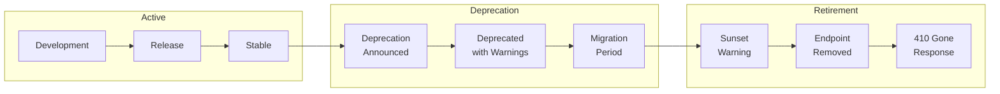
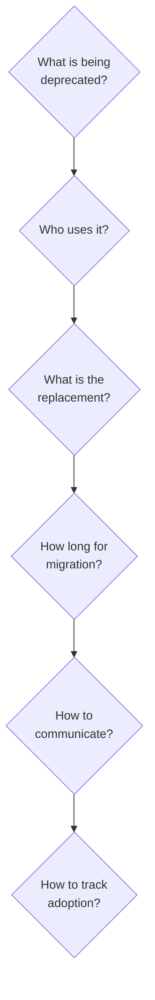
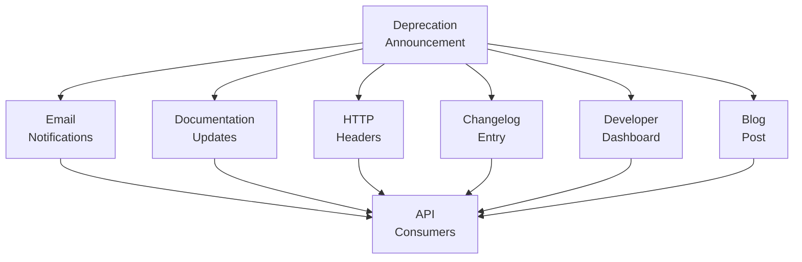
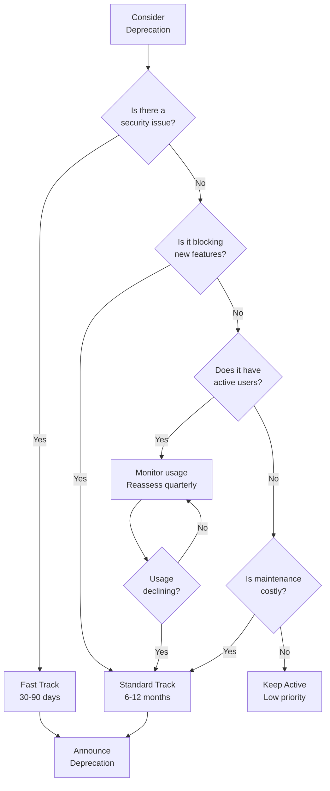
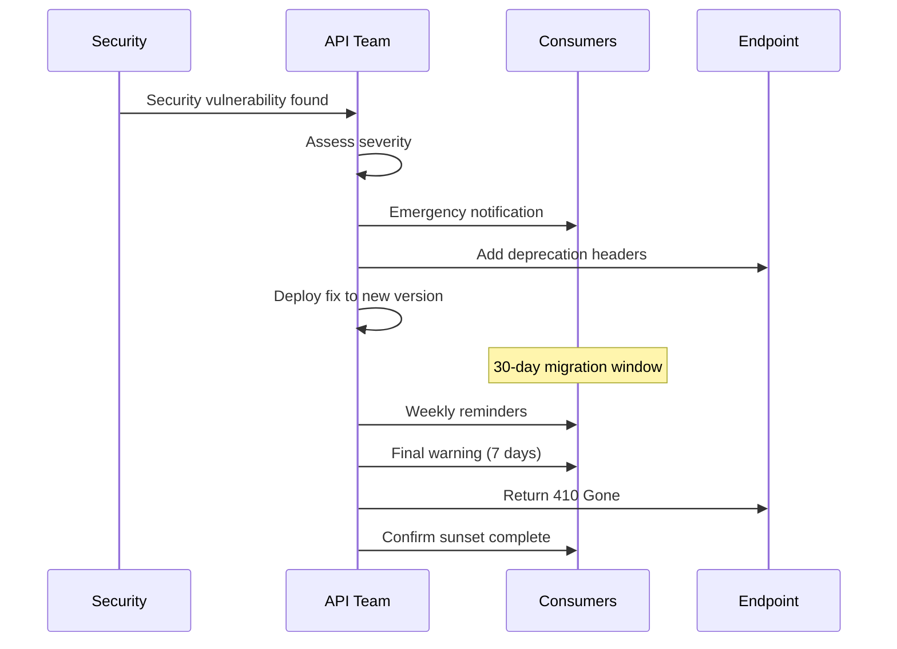

# How to Handle API Deprecation

Author: [nawazdhandala](https://www.github.com/nawazdhandala)

Tags: API, REST API, API Lifecycle, Deprecation, API Versioning, Backend Development, Web Development, API Management

Description: A comprehensive guide to managing API deprecation effectively. Learn how to plan deprecation timelines, communicate changes to consumers, implement graceful transitions, monitor adoption, and safely retire endpoints without breaking client integrations.

---

> API deprecation is the process of phasing out old API endpoints, versions, or features while giving consumers adequate time and guidance to migrate. Done well, it maintains trust with your API consumers. Done poorly, it breaks applications and damages relationships.

Every API eventually needs to evolve. Whether you are fixing design mistakes, improving performance, or adding new capabilities, deprecation is how you retire the old while introducing the new.

---

## Why Deprecation Matters

| Aspect | Impact |
|--------|--------|
| **Technical Debt** | Old endpoints accumulate maintenance burden |
| **Security** | Outdated code may have vulnerabilities |
| **Performance** | Legacy implementations slow down the system |
| **Complexity** | Supporting multiple versions increases cognitive load |
| **Documentation** | Outdated APIs confuse new developers |

---

## The API Deprecation Lifecycle

Understanding the full lifecycle helps you plan and execute deprecations smoothly.



Each stage requires specific actions:

1. **Development**: Build the new version alongside the old
2. **Deprecation Announced**: Publicly announce the deprecation
3. **Deprecated with Warnings**: Add headers and response metadata
4. **Migration Period**: Support both versions, help consumers migrate
5. **Sunset Warning**: Final notice before removal
6. **Endpoint Removed**: Stop serving the old endpoint
7. **410 Gone Response**: Return informative error for old requests

---

## Planning Your Deprecation Strategy

Before deprecating anything, answer these questions:

### Key Questions Checklist



### Deprecation Timeline Guidelines

Different types of changes require different timelines:

| Change Type | Minimum Notice | Recommended Notice |
|-------------|----------------|-------------------|
| Minor field removal | 3 months | 6 months |
| Endpoint removal | 6 months | 12 months |
| Major version sunset | 12 months | 18-24 months |
| Security-related | 30 days | 90 days |
| Breaking change | 6 months | 12 months |

For public APIs with unknown consumers, err on the side of longer timelines.

---

## Announcing Deprecation

Communication is critical. Announce deprecation through multiple channels.

### Communication Channels

The following code shows how to structure a deprecation announcement.

```markdown
## API Deprecation Notice: /api/v1/users Endpoint

**Effective Date:** February 1, 2026
**Sunset Date:** August 1, 2026

### What is Changing
The `/api/v1/users` endpoint is being deprecated in favor of `/api/v2/users`.

### Why
The v1 endpoint uses a legacy response format that does not support
pagination and lacks proper error handling.

### Migration Path
1. Update your base URL from `/api/v1/` to `/api/v2/`
2. Update response parsing (see field mapping below)
3. Handle new pagination format

### Field Mapping
| v1 Field | v2 Field |
|----------|----------|
| full_name | firstName, lastName |
| email_address | email |
| created | createdAt (ISO 8601) |

### Support
- Documentation: https://api.example.com/docs/migration/v1-to-v2
- Support email: api-support@example.com
- Migration deadline: August 1, 2026

### Timeline
- February 1, 2026: Deprecation warnings begin
- May 1, 2026: Warning frequency increases
- August 1, 2026: v1 endpoint returns 410 Gone
```

### Multiple Communication Channels

Reach consumers through every available channel.



---

## Implementing Deprecation Warnings

Add deprecation metadata to API responses to programmatically notify consumers.

### HTTP Headers Implementation

This middleware adds standard deprecation headers to responses.

```python
# deprecation_middleware.py
# Middleware that adds RFC 8594 deprecation headers to API responses

from datetime import datetime
from email.utils import formatdate
from time import mktime

# Configuration for deprecated endpoints
# Store this in a database or configuration file for production
DEPRECATION_CONFIG = {
    '/api/v1/users': {
        'deprecated_at': datetime(2026, 2, 1),
        'sunset_at': datetime(2026, 8, 1),
        'successor': '/api/v2/users',
        'migration_doc': 'https://api.example.com/docs/migration/users-v1-v2'
    },
    '/api/v1/orders': {
        'deprecated_at': datetime(2026, 3, 1),
        'sunset_at': datetime(2026, 9, 1),
        'successor': '/api/v2/orders',
        'migration_doc': 'https://api.example.com/docs/migration/orders-v1-v2'
    }
}


def format_http_date(dt):
    """
    Convert datetime to HTTP-date format per RFC 7231.
    Example: Sun, 01 Feb 2026 00:00:00 GMT
    """
    stamp = mktime(dt.timetuple())
    return formatdate(timeval=stamp, localtime=False, usegmt=True)


def get_deprecation_config(path):
    """
    Find deprecation config for a request path.
    Supports exact match and prefix matching for paths with IDs.
    """
    # Try exact match first
    if path in DEPRECATION_CONFIG:
        return DEPRECATION_CONFIG[path]

    # Try prefix match for parameterized routes
    for pattern, config in DEPRECATION_CONFIG.items():
        if path.startswith(pattern + '/') or path == pattern:
            return config

    return None


class DeprecationMiddleware:
    """
    ASGI/WSGI middleware that adds deprecation headers.
    Compatible with FastAPI, Flask, and Django.
    """

    def __init__(self, app):
        self.app = app

    def add_deprecation_headers(self, path, headers):
        """Add deprecation headers if endpoint is deprecated."""
        config = get_deprecation_config(path)

        if config:
            # Deprecation header with announcement date
            headers['Deprecation'] = format_http_date(config['deprecated_at'])

            # Sunset header with removal date
            headers['Sunset'] = format_http_date(config['sunset_at'])

            # Link headers for documentation and successor
            links = []
            if config.get('successor'):
                links.append(f'<{config["successor"]}>; rel="successor-version"')
            if config.get('migration_doc'):
                links.append(f'<{config["migration_doc"]}>; rel="deprecation"; type="text/html"')

            if links:
                headers['Link'] = ', '.join(links)

        return headers
```

### Response Body Warnings

Include deprecation warnings in the response body for consumers who do not inspect headers.

```javascript
// response-wrapper.js
// Wraps API responses with deprecation metadata when applicable

const deprecationConfig = {
    '/api/v1/users': {
        deprecated: true,
        deprecatedAt: '2026-02-01',
        sunsetAt: '2026-08-01',
        successor: '/api/v2/users',
        migrationDoc: 'https://api.example.com/docs/migration/users-v1-v2'
    }
};

/**
 * Wrap response data with deprecation warnings if applicable.
 * The _deprecation field provides machine-readable deprecation info.
 *
 * @param {string} path - The request path
 * @param {object} data - The original response data
 * @returns {object} - Response with optional deprecation metadata
 */
function wrapResponse(path, data) {
    const config = findDeprecationConfig(path);

    if (!config || !config.deprecated) {
        return data;
    }

    // Calculate days remaining until sunset
    const sunsetDate = new Date(config.sunsetAt);
    const today = new Date();
    const daysRemaining = Math.ceil((sunsetDate - today) / (1000 * 60 * 60 * 24));

    return {
        // Include original response data
        ...data,

        // Add deprecation metadata
        _deprecation: {
            deprecated: true,
            deprecatedAt: config.deprecatedAt,
            sunsetAt: config.sunsetAt,
            daysRemaining: Math.max(0, daysRemaining),
            message: `This endpoint will be removed on ${config.sunsetAt}. ` +
                    `Please migrate to ${config.successor}.`,
            successor: config.successor,
            documentation: config.migrationDoc
        }
    };
}

/**
 * Find deprecation config supporting prefix matching.
 */
function findDeprecationConfig(path) {
    // Exact match
    if (deprecationConfig[path]) {
        return deprecationConfig[path];
    }

    // Prefix match for parameterized paths
    for (const [pattern, config] of Object.entries(deprecationConfig)) {
        if (path.startsWith(pattern + '/')) {
            return config;
        }
    }

    return null;
}

module.exports = { wrapResponse };
```

---

## Building a Migration Guide

A good migration guide makes the transition painless for consumers.

### Migration Guide Structure

Every migration guide should include these sections.

```markdown
# Migration Guide: API v1 to v2

## Overview
This guide helps you migrate from API v1 to v2. The migration
involves updating endpoints, request formats, and response handling.

## Timeline
- v1 deprecated: February 1, 2026
- v1 sunset: August 1, 2026

## Breaking Changes

### 1. Authentication
**v1:** API key in query parameter
**v2:** Bearer token in Authorization header

```bash
# v1 (deprecated)
curl "https://api.example.com/v1/users?api_key=YOUR_KEY"

# v2 (current)
curl -H "Authorization: Bearer YOUR_TOKEN" \
     "https://api.example.com/v2/users"
```

### 2. Response Format
**v1:** Flat structure with snake_case
**v2:** Nested structure with camelCase

### 3. Pagination
**v1:** Offset-based (?page=1&limit=20)
**v2:** Cursor-based (?cursor=abc123&limit=20)

## Field Mapping Reference

| v1 Field | v2 Field | Notes |
|----------|----------|-------|
| user_id | id | Renamed |
| full_name | - | Split into firstName, lastName |
| - | firstName | New field |
| - | lastName | New field |
| email_address | email | Renamed |
| created | createdAt | Now ISO 8601 format |
| modified | updatedAt | Now ISO 8601 format |

## Code Examples

### Python Migration

```python
# Before (v1)
response = requests.get(
    'https://api.example.com/v1/users',
    params={'api_key': API_KEY}
)
user = response.json()
name = user['full_name']

# After (v2)
response = requests.get(
    'https://api.example.com/v2/users',
    headers={'Authorization': f'Bearer {TOKEN}'}
)
user = response.json()
name = f"{user['firstName']} {user['lastName']}"
```

## Testing Your Migration

1. Use our sandbox environment for testing
2. Run integration tests against v2 endpoints
3. Verify pagination handling with large datasets
4. Test error handling with invalid requests

## Support

- Email: api-support@example.com
- Slack: #api-migration channel
- Office hours: Tuesdays 2-3pm PT
```

---

## Monitoring Deprecation Adoption

Track which consumers still use deprecated endpoints to know when it is safe to remove them.

### Tracking Implementation

This code tracks deprecated endpoint usage for monitoring.

```python
# deprecation_tracker.py
# Track usage of deprecated API endpoints for monitoring

import json
from datetime import datetime
from collections import defaultdict
import logging

logger = logging.getLogger(__name__)


class DeprecationTracker:
    """
    Tracks usage of deprecated endpoints.
    Stores metrics for monitoring and reporting.
    """

    def __init__(self):
        # In production, use Redis or a database
        self.usage_metrics = defaultdict(lambda: {
            'total_calls': 0,
            'unique_clients': set(),
            'first_seen': None,
            'last_seen': None,
            'calls_by_day': defaultdict(int)
        })

    def track_usage(self, endpoint, client_id, timestamp=None):
        """
        Record a usage event for a deprecated endpoint.

        Args:
            endpoint: The deprecated endpoint path
            client_id: Identifier for the API consumer
            timestamp: When the request occurred
        """
        if timestamp is None:
            timestamp = datetime.utcnow()

        metrics = self.usage_metrics[endpoint]
        metrics['total_calls'] += 1
        metrics['unique_clients'].add(client_id)
        metrics['last_seen'] = timestamp.isoformat()

        if metrics['first_seen'] is None:
            metrics['first_seen'] = timestamp.isoformat()

        # Track daily usage for trend analysis
        day_key = timestamp.strftime('%Y-%m-%d')
        metrics['calls_by_day'][day_key] += 1

        # Log for external monitoring systems
        logger.info(json.dumps({
            'event': 'deprecated_endpoint_usage',
            'endpoint': endpoint,
            'client_id': client_id,
            'timestamp': timestamp.isoformat()
        }))

    def get_report(self, endpoint):
        """
        Generate a usage report for a deprecated endpoint.

        Returns metrics useful for deciding when to sunset.
        """
        metrics = self.usage_metrics[endpoint]

        return {
            'endpoint': endpoint,
            'total_calls': metrics['total_calls'],
            'unique_clients': len(metrics['unique_clients']),
            'client_list': list(metrics['unique_clients']),
            'first_seen': metrics['first_seen'],
            'last_seen': metrics['last_seen'],
            'daily_trend': dict(metrics['calls_by_day'])
        }

    def get_all_reports(self):
        """Generate reports for all tracked endpoints."""
        return [
            self.get_report(endpoint)
            for endpoint in self.usage_metrics.keys()
        ]


# Global tracker instance
tracker = DeprecationTracker()


def track_deprecated_request(request, endpoint):
    """
    Middleware helper to track deprecated endpoint usage.
    Extract client ID from request headers or auth token.
    """
    # Try multiple sources for client identification
    client_id = (
        request.headers.get('X-Client-ID') or
        request.headers.get('X-API-Key') or
        extract_client_from_token(request) or
        request.remote_addr or
        'anonymous'
    )

    tracker.track_usage(endpoint, client_id)


def extract_client_from_token(request):
    """Extract client identifier from JWT or API token."""
    auth_header = request.headers.get('Authorization', '')

    if auth_header.startswith('Bearer '):
        # In production, decode JWT and extract client_id claim
        token = auth_header[7:]
        # Return decoded client_id
        return None

    return None
```

### Dashboard Metrics

Expose metrics for monitoring dashboards.

```javascript
// deprecation-metrics-endpoint.js
// Express endpoint that exposes deprecation usage metrics

const express = require('express');
const router = express.Router();

// In-memory metrics store (use Redis in production)
const deprecationMetrics = new Map();

/**
 * Track deprecated endpoint usage.
 * Call this from your deprecation middleware.
 */
function recordUsage(endpoint, clientId) {
    if (!deprecationMetrics.has(endpoint)) {
        deprecationMetrics.set(endpoint, {
            totalCalls: 0,
            uniqueClients: new Set(),
            lastUsed: null,
            hourlyUsage: {}
        });
    }

    const metrics = deprecationMetrics.get(endpoint);
    metrics.totalCalls++;
    metrics.uniqueClients.add(clientId);
    metrics.lastUsed = new Date().toISOString();

    // Track hourly usage
    const hourKey = new Date().toISOString().slice(0, 13);
    metrics.hourlyUsage[hourKey] = (metrics.hourlyUsage[hourKey] || 0) + 1;
}

/**
 * GET /metrics/deprecation
 * Returns usage metrics for all deprecated endpoints.
 * Use this for monitoring dashboards and alerting.
 */
router.get('/metrics/deprecation', (req, res) => {
    const report = {
        generatedAt: new Date().toISOString(),
        endpoints: []
    };

    deprecationMetrics.forEach((metrics, endpoint) => {
        report.endpoints.push({
            endpoint: endpoint,
            totalCalls: metrics.totalCalls,
            uniqueClients: metrics.uniqueClients.size,
            lastUsed: metrics.lastUsed,
            usageTrend: calculateTrend(metrics.hourlyUsage)
        });
    });

    // Sort by total calls descending
    report.endpoints.sort((a, b) => b.totalCalls - a.totalCalls);

    res.json(report);
});

/**
 * GET /metrics/deprecation/:endpoint
 * Returns detailed metrics for a specific deprecated endpoint.
 */
router.get('/metrics/deprecation/:endpoint', (req, res) => {
    const endpoint = decodeURIComponent(req.params.endpoint);
    const metrics = deprecationMetrics.get(endpoint);

    if (!metrics) {
        return res.status(404).json({ error: 'Endpoint not found' });
    }

    res.json({
        endpoint: endpoint,
        totalCalls: metrics.totalCalls,
        uniqueClients: metrics.uniqueClients.size,
        clientList: Array.from(metrics.uniqueClients),
        lastUsed: metrics.lastUsed,
        hourlyUsage: metrics.hourlyUsage
    });
});

/**
 * Calculate usage trend (increasing, decreasing, stable).
 */
function calculateTrend(hourlyUsage) {
    const hours = Object.keys(hourlyUsage).sort().slice(-24);

    if (hours.length < 2) {
        return 'insufficient_data';
    }

    const firstHalf = hours.slice(0, Math.floor(hours.length / 2));
    const secondHalf = hours.slice(Math.floor(hours.length / 2));

    const firstAvg = firstHalf.reduce((sum, h) => sum + hourlyUsage[h], 0) / firstHalf.length;
    const secondAvg = secondHalf.reduce((sum, h) => sum + hourlyUsage[h], 0) / secondHalf.length;

    if (secondAvg < firstAvg * 0.8) {
        return 'decreasing';
    } else if (secondAvg > firstAvg * 1.2) {
        return 'increasing';
    }

    return 'stable';
}

module.exports = { router, recordUsage };
```

---

## Handling the Sunset

When the sunset date arrives, gracefully retire the endpoint.

### Sunset Response Handler

Return HTTP 410 Gone with helpful information instead of 404 Not Found.

```go
// sunset_handler.go
// Handler for sunset endpoints that returns 410 Gone with migration info

package main

import (
    "encoding/json"
    "net/http"
    "time"
)

// SunsetConfig holds information about a retired endpoint
type SunsetConfig struct {
    SunsetDate     time.Time
    Successor      string
    MigrationDoc   string
    RetirementNote string
}

// SunsetResponse is the JSON response for retired endpoints
type SunsetResponse struct {
    Error         string `json:"error"`
    Message       string `json:"message"`
    RetiredAt     string `json:"retiredAt"`
    Successor     string `json:"successor,omitempty"`
    Documentation string `json:"documentation,omitempty"`
    Note          string `json:"note,omitempty"`
}

// SunsetRegistry tracks retired endpoints
type SunsetRegistry struct {
    endpoints map[string]*SunsetConfig
}

// NewSunsetRegistry creates a registry for sunset endpoints
func NewSunsetRegistry() *SunsetRegistry {
    return &SunsetRegistry{
        endpoints: make(map[string]*SunsetConfig),
    }
}

// Register adds a retired endpoint to the registry
func (r *SunsetRegistry) Register(path string, config *SunsetConfig) {
    r.endpoints[path] = config
}

// Middleware intercepts requests to sunset endpoints
func (r *SunsetRegistry) Middleware(next http.Handler) http.Handler {
    return http.HandlerFunc(func(w http.ResponseWriter, req *http.Request) {
        config := r.findConfig(req.URL.Path)

        if config != nil && time.Now().After(config.SunsetDate) {
            // Endpoint has been retired
            r.handleSunset(w, req.URL.Path, config)
            return
        }

        next.ServeHTTP(w, req)
    })
}

// handleSunset returns a 410 Gone response with migration guidance
func (r *SunsetRegistry) handleSunset(w http.ResponseWriter, path string, config *SunsetConfig) {
    response := SunsetResponse{
        Error:     "Gone",
        Message:   "This API endpoint has been retired.",
        RetiredAt: config.SunsetDate.Format(time.RFC3339),
    }

    if config.Successor != "" {
        response.Successor = config.Successor
        response.Message += " Please use " + config.Successor + " instead."
    }

    if config.MigrationDoc != "" {
        response.Documentation = config.MigrationDoc
    }

    if config.RetirementNote != "" {
        response.Note = config.RetirementNote
    }

    w.Header().Set("Content-Type", "application/json")
    w.WriteHeader(http.StatusGone)
    json.NewEncoder(w).Encode(response)
}

// findConfig locates config for a path with prefix matching
func (r *SunsetRegistry) findConfig(path string) *SunsetConfig {
    // Try exact match
    if config, ok := r.endpoints[path]; ok {
        return config
    }

    // Try prefix match
    for pattern, config := range r.endpoints {
        if len(path) > len(pattern) && path[:len(pattern)+1] == pattern+"/" {
            return config
        }
    }

    return nil
}
```

### Example Usage

Register sunset endpoints in your application.

```go
// main.go
// Example of configuring sunset endpoints

package main

import (
    "net/http"
    "time"
)

func main() {
    // Create sunset registry
    sunsetRegistry := NewSunsetRegistry()

    // Register retired endpoints
    sunsetRegistry.Register("/api/v1/users", &SunsetConfig{
        SunsetDate:     time.Date(2026, 8, 1, 0, 0, 0, 0, time.UTC),
        Successor:      "/api/v2/users",
        MigrationDoc:   "https://api.example.com/docs/migration/users-v1-v2",
        RetirementNote: "v1 was retired due to security improvements in v2.",
    })

    sunsetRegistry.Register("/api/v1/orders", &SunsetConfig{
        SunsetDate:   time.Date(2026, 9, 1, 0, 0, 0, 0, time.UTC),
        Successor:    "/api/v2/orders",
        MigrationDoc: "https://api.example.com/docs/migration/orders-v1-v2",
    })

    // Create router with your actual handlers
    mux := http.NewServeMux()
    mux.HandleFunc("/api/v2/users", handleUsersV2)
    mux.HandleFunc("/api/v2/orders", handleOrdersV2)

    // Wrap with sunset middleware
    handler := sunsetRegistry.Middleware(mux)

    http.ListenAndServe(":8080", handler)
}
```

---

## Deprecation Decision Framework

Use this framework to decide what and when to deprecate.

### Decision Flow



### Deprecation Checklist

Before deprecating, verify each item.

```markdown
## Pre-Deprecation Checklist

### Analysis
- [ ] Documented all breaking changes
- [ ] Identified all consumers (if possible)
- [ ] Built replacement functionality
- [ ] Created migration guide
- [ ] Tested migration path end-to-end

### Communication
- [ ] Drafted announcement
- [ ] Scheduled email notifications
- [ ] Updated API documentation
- [ ] Added changelog entry
- [ ] Notified high-volume consumers directly

### Implementation
- [ ] Deprecation headers configured
- [ ] Response body warnings added
- [ ] Usage tracking implemented
- [ ] Monitoring dashboards ready
- [ ] Alerting configured for usage spikes

### Timeline
- [ ] Deprecation date set
- [ ] Sunset date set
- [ ] Review dates scheduled
- [ ] Sunset handler prepared
```

---

## Handling Emergency Deprecation

Sometimes you must deprecate quickly due to security issues.

### Emergency Deprecation Process



### Emergency Communication Template

Quick communication for urgent deprecations.

```markdown
## URGENT: Security-Related API Deprecation

**Action Required By:** [DATE - 30 days from now]

### Summary
A security vulnerability has been identified in `/api/v1/auth`.
This endpoint will be removed on [DATE].

### Immediate Action Required
1. Update to `/api/v2/auth` immediately
2. Rotate any credentials used with v1
3. Review access logs for suspicious activity

### Changes in v2
- Enhanced token validation
- Required TLS 1.3
- New rate limiting

### Migration Steps
1. Replace `/api/v1/auth` with `/api/v2/auth`
2. Update Authorization header format
3. Handle new error response codes

### Timeline
- Today: Deprecation warning enabled
- [DATE + 7]: Increased warning frequency
- [DATE + 14]: Rate limiting applied to v1
- [DATE + 30]: v1 endpoint removed

### Support
Priority support available at security@example.com
```

---

## Version Coexistence Patterns

While deprecating, both versions must work correctly.

### Request Router Pattern

Route requests to the appropriate version handler.

```python
# version_router.py
# Routes requests to version-specific handlers

from functools import wraps


class VersionRouter:
    """
    Routes requests to version-specific handlers.
    Supports graceful degradation and feature flags.
    """

    def __init__(self):
        self.handlers = {}
        self.default_version = 'v2'

    def register(self, version, path):
        """
        Decorator to register a handler for a specific version.

        Usage:
            @router.register('v1', '/users')
            def get_users_v1(request):
                ...
        """
        def decorator(func):
            key = f"{version}:{path}"
            self.handlers[key] = func

            @wraps(func)
            def wrapper(*args, **kwargs):
                return func(*args, **kwargs)
            return wrapper
        return decorator

    def route(self, version, path, request):
        """
        Route a request to the appropriate handler.
        Falls back to default version if specific handler not found.
        """
        # Try exact version match
        key = f"{version}:{path}"
        if key in self.handlers:
            return self.handlers[key](request)

        # Fall back to default version
        default_key = f"{self.default_version}:{path}"
        if default_key in self.handlers:
            return self.handlers[default_key](request)

        raise ValueError(f"No handler found for {version}:{path}")


# Example usage
router = VersionRouter()


@router.register('v1', '/users')
def get_users_v1(request):
    """V1 handler returns flat structure."""
    users = fetch_users()
    return [{'id': u.id, 'full_name': f"{u.first} {u.last}"} for u in users]


@router.register('v2', '/users')
def get_users_v2(request):
    """V2 handler returns nested structure with pagination."""
    users = fetch_users()
    return {
        'data': [{'id': u.id, 'firstName': u.first, 'lastName': u.last} for u in users],
        'pagination': {'page': 1, 'total': len(users)}
    }
```

---

## Testing Deprecation

Verify deprecation works correctly across all scenarios.

### Test Suite

```python
# test_deprecation.py
# Tests for API deprecation functionality

import pytest
from datetime import datetime, timedelta


class TestDeprecationHeaders:
    """Test deprecation headers are correctly applied."""

    def test_deprecated_endpoint_includes_deprecation_header(self, client):
        """Deprecated endpoints must include Deprecation header."""
        response = client.get('/api/v1/users')

        assert response.status_code == 200
        assert 'Deprecation' in response.headers
        # Verify date format is HTTP-date
        assert 'GMT' in response.headers['Deprecation']

    def test_deprecated_endpoint_includes_sunset_header(self, client):
        """Deprecated endpoints must include Sunset header."""
        response = client.get('/api/v1/users')

        assert 'Sunset' in response.headers
        # Verify sunset is in the future
        sunset_date = parse_http_date(response.headers['Sunset'])
        assert sunset_date > datetime.utcnow()

    def test_deprecated_endpoint_includes_link_header(self, client):
        """Deprecated endpoints should link to successor."""
        response = client.get('/api/v1/users')

        assert 'Link' in response.headers
        assert 'successor-version' in response.headers['Link']
        assert '/api/v2/users' in response.headers['Link']

    def test_active_endpoint_no_deprecation_headers(self, client):
        """Active endpoints should not have deprecation headers."""
        response = client.get('/api/v2/users')

        assert response.status_code == 200
        assert 'Deprecation' not in response.headers
        assert 'Sunset' not in response.headers


class TestSunsetEndpoints:
    """Test behavior after sunset date."""

    def test_sunset_endpoint_returns_410(self, client, freeze_time):
        """Endpoints past sunset date should return 410 Gone."""
        # Freeze time to after sunset
        freeze_time(datetime(2026, 9, 1))

        response = client.get('/api/v1/users')

        assert response.status_code == 410

    def test_sunset_response_includes_successor(self, client, freeze_time):
        """410 response should include migration information."""
        freeze_time(datetime(2026, 9, 1))

        response = client.get('/api/v1/users')
        data = response.json()

        assert 'successor' in data
        assert data['successor'] == '/api/v2/users'

    def test_sunset_response_includes_documentation(self, client, freeze_time):
        """410 response should link to migration docs."""
        freeze_time(datetime(2026, 9, 1))

        response = client.get('/api/v1/users')
        data = response.json()

        assert 'documentation' in data
        assert 'migration' in data['documentation']


class TestDeprecationTracking:
    """Test usage tracking for deprecated endpoints."""

    def test_usage_is_tracked(self, client, tracker):
        """Deprecated endpoint usage should be recorded."""
        client.get('/api/v1/users', headers={'X-Client-ID': 'client-123'})

        report = tracker.get_report('/api/v1/users')

        assert report['total_calls'] == 1
        assert 'client-123' in report['client_list']

    def test_unique_clients_counted(self, client, tracker):
        """Multiple calls from same client count as one unique."""
        for _ in range(5):
            client.get('/api/v1/users', headers={'X-Client-ID': 'client-123'})

        report = tracker.get_report('/api/v1/users')

        assert report['total_calls'] == 5
        assert report['unique_clients'] == 1
```

---

## Best Practices Summary

### Do

1. **Announce early and often** - Give at least 6 months notice for major changes
2. **Provide a clear migration path** - Documentation, examples, and support
3. **Use standard headers** - Deprecation and Sunset headers per RFC 8594
4. **Monitor adoption** - Track who uses deprecated endpoints
5. **Communicate through multiple channels** - Email, docs, headers, dashboards
6. **Return 410 Gone** - Not 404, after sunset
7. **Support both versions** - During the migration period
8. **Test the deprecation** - Verify headers, tracking, and sunset behavior

### Do Not

1. **Do not surprise consumers** - No unannounced removals
2. **Do not rush** - Unless security requires it
3. **Do not ignore usage data** - Extend timelines if adoption is slow
4. **Do not remove documentation** - Keep v1 docs available after sunset
5. **Do not skip tracking** - You need data to make sunset decisions
6. **Do not forget edge cases** - Test with real consumer scenarios

---

## Conclusion

API deprecation is a communication challenge as much as a technical one. Success depends on giving consumers adequate notice, clear migration paths, and the tools to track their own progress.

Start by adding deprecation headers to any endpoints you plan to retire. Build tracking to understand who uses them. Create comprehensive migration guides. Then, and only then, set your sunset dates.

The goal is zero surprises. When you finally return 410 Gone, no consumer should be caught off guard.

---

*Need to monitor your API deprecation process? [OneUptime](https://oneuptime.com) provides comprehensive API monitoring with endpoint health checks, deprecation tracking, and alerting. Monitor both your deprecated and active endpoints to ensure smooth transitions and catch issues before your consumers do.*

