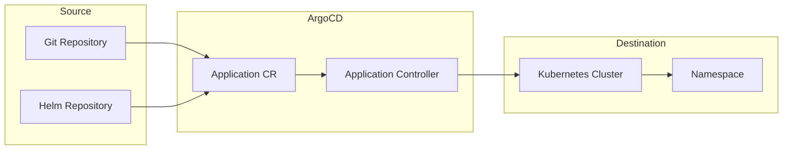
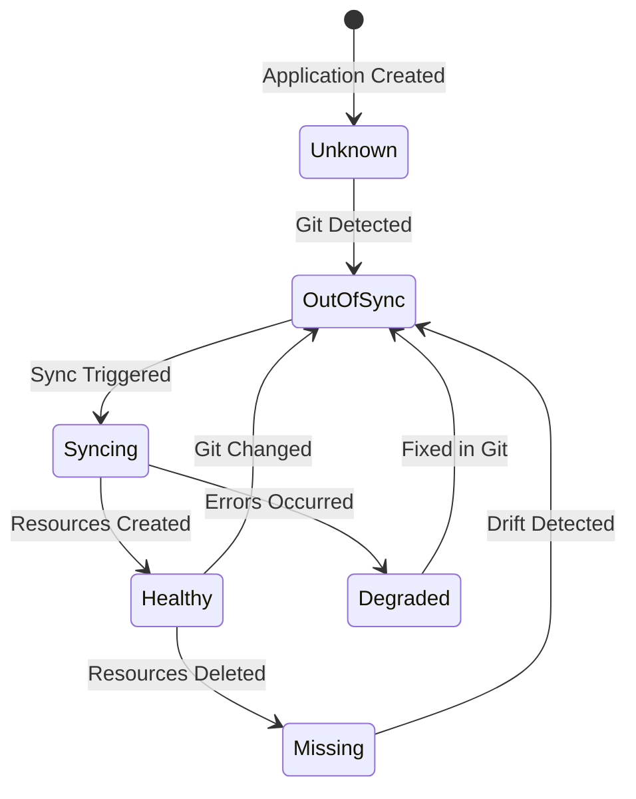
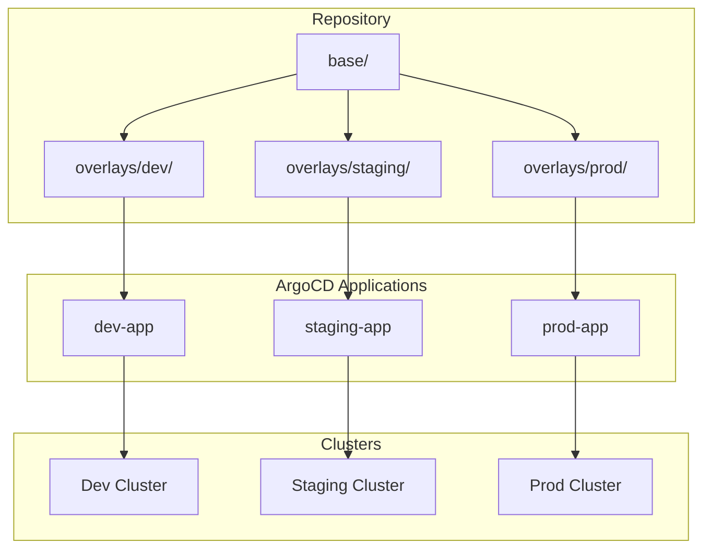
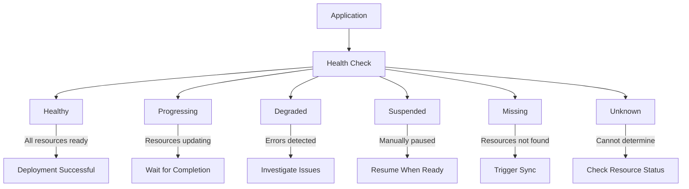

# How to Create ArgoCD Applications

Author: [nawazdhandala](https://www.github.com/nawazdhandala)

Tags: ArgoCD, GitOps, Kubernetes, DevOps, CI/CD

Description: Learn how to create and manage ArgoCD Applications for GitOps-driven Kubernetes deployments with declarative manifests, Helm charts, and Kustomize overlays.

---

ArgoCD Applications are the fundamental building blocks of GitOps workflows in Kubernetes. Each Application defines the relationship between a source repository and a target cluster, enabling automated synchronization and declarative infrastructure management. Understanding how to create and configure Applications properly will help you build reliable, scalable deployment pipelines.

## Understanding ArgoCD Applications

An ArgoCD Application is a Kubernetes custom resource that connects a Git repository (or Helm repository) to a destination cluster. ArgoCD continuously monitors the source and reconciles any drift between the desired state in Git and the actual state in the cluster.



## Creating Your First Application via CLI

The quickest way to create an Application is using the ArgoCD CLI. First, ensure you have the CLI installed and are logged in.

The following command creates an Application that deploys a sample guestbook app from the ArgoCD examples repository:

```bash
# Create an Application using the CLI
# --repo: Source Git repository URL
# --path: Directory within the repo containing manifests
# --dest-server: Target Kubernetes cluster API server
# --dest-namespace: Target namespace for deployment
argocd app create guestbook \
  --repo https://github.com/argoproj/argocd-example-apps.git \
  --path guestbook \
  --dest-server https://kubernetes.default.svc \
  --dest-namespace default \
  --sync-policy automated
```

Verify the Application was created and check its status:

```bash
# List all Applications
argocd app list

# Get detailed information about the guestbook Application
argocd app get guestbook

# View the Application's resources
argocd app resources guestbook
```

## Creating Applications Declaratively

For production environments, define Applications as YAML manifests stored in Git. Declarative Application definitions enable version control, code review, and GitOps for your GitOps configuration.

The following manifest creates an Application that deploys from a Git repository containing plain Kubernetes manifests:

```yaml
# application.yaml
# Basic ArgoCD Application definition
apiVersion: argoproj.io/v1alpha1
kind: Application
metadata:
  # Application name - must be unique within the ArgoCD namespace
  name: my-web-app
  # ArgoCD Applications typically live in the argocd namespace
  namespace: argocd
  # Finalizers prevent accidental deletion of cluster resources
  finalizers:
    - resources-finalizer.argocd.argoproj.io
spec:
  # Project groups Applications and defines access controls
  project: default

  # Source defines where to fetch the manifests
  source:
    repoURL: https://github.com/myorg/my-web-app.git
    targetRevision: HEAD
    path: k8s/manifests

  # Destination defines where to deploy
  destination:
    server: https://kubernetes.default.svc
    namespace: web-app

  # Sync policy controls automatic synchronization
  syncPolicy:
    automated:
      # Prune removes resources not defined in Git
      prune: true
      # SelfHeal reverts manual changes made to cluster resources
      selfHeal: true
    syncOptions:
      # Create namespace if it does not exist
      - CreateNamespace=true
```

Apply the Application manifest to your cluster:

```bash
# Apply the Application definition
kubectl apply -f application.yaml

# Alternatively, use argocd CLI
argocd app create -f application.yaml
```

## Application Lifecycle

Understanding the Application lifecycle helps you manage deployments effectively. Applications move through several states during synchronization.



## Deploying Helm Charts

ArgoCD natively supports Helm charts as a source type. You can deploy charts from Git repositories or dedicated Helm repositories.

The following manifest deploys a Helm chart from a Helm repository with custom values:

```yaml
# helm-application.yaml
# Application using Helm chart from a Helm repository
apiVersion: argoproj.io/v1alpha1
kind: Application
metadata:
  name: nginx-ingress
  namespace: argocd
spec:
  project: default

  source:
    # Helm repository URL
    repoURL: https://kubernetes.github.io/ingress-nginx
    # Chart name and version
    chart: ingress-nginx
    targetRevision: 4.9.0

    # Helm-specific configuration
    helm:
      # Release name (defaults to Application name)
      releaseName: nginx-ingress

      # Inline values override chart defaults
      values: |
        controller:
          replicaCount: 2
          service:
            type: LoadBalancer
          metrics:
            enabled: true
            serviceMonitor:
              enabled: true
        defaultBackend:
          enabled: true

      # Individual parameter overrides (alternative to values block)
      parameters:
        - name: controller.nodeSelector.kubernetes\.io/os
          value: linux

  destination:
    server: https://kubernetes.default.svc
    namespace: ingress-nginx

  syncPolicy:
    automated:
      prune: true
      selfHeal: true
    syncOptions:
      - CreateNamespace=true
```

For Helm charts stored in Git repositories, use the path field instead:

```yaml
# helm-git-application.yaml
# Application using Helm chart from a Git repository
apiVersion: argoproj.io/v1alpha1
kind: Application
metadata:
  name: api-service
  namespace: argocd
spec:
  project: default

  source:
    repoURL: https://github.com/myorg/helm-charts.git
    targetRevision: main
    # Path to the chart directory within the repo
    path: charts/api-service

    helm:
      # Reference a values file in the same repo
      valueFiles:
        - values-production.yaml

      # Override specific values
      parameters:
        - name: image.tag
          value: v1.2.3

  destination:
    server: https://kubernetes.default.svc
    namespace: api

  syncPolicy:
    automated:
      prune: true
      selfHeal: true
```

## Deploying with Kustomize

Kustomize allows you to customize Kubernetes manifests without templating. ArgoCD automatically detects and processes Kustomize configurations.



The following manifest creates an Application that uses Kustomize overlays for environment-specific configuration:

```yaml
# kustomize-application.yaml
# Application using Kustomize overlay
apiVersion: argoproj.io/v1alpha1
kind: Application
metadata:
  name: my-app-production
  namespace: argocd
spec:
  project: default

  source:
    repoURL: https://github.com/myorg/my-app.git
    targetRevision: HEAD
    # Path to the Kustomize overlay directory
    path: k8s/overlays/production

    # Kustomize-specific configuration
    kustomize:
      # Override the image tag
      images:
        - myorg/my-app:v2.0.0

      # Add common labels to all resources
      commonLabels:
        app.kubernetes.io/environment: production

      # Add name prefix or suffix
      namePrefix: prod-

  destination:
    server: https://kubernetes.default.svc
    namespace: my-app-prod

  syncPolicy:
    automated:
      prune: true
      selfHeal: true
    syncOptions:
      - CreateNamespace=true
```

## Configuring Sync Options

Sync options control how ArgoCD applies resources to the cluster. Different scenarios require different sync behaviors.

The following manifest demonstrates common sync options and their purposes:

```yaml
# sync-options-application.yaml
# Application with comprehensive sync options
apiVersion: argoproj.io/v1alpha1
kind: Application
metadata:
  name: database-app
  namespace: argocd
spec:
  project: default

  source:
    repoURL: https://github.com/myorg/database-app.git
    targetRevision: HEAD
    path: k8s/

  destination:
    server: https://kubernetes.default.svc
    namespace: database

  syncPolicy:
    automated:
      prune: true
      selfHeal: true
      # Allow empty - sync even if no resources are defined
      allowEmpty: false

    # Retry failed syncs with backoff
    retry:
      limit: 5
      backoff:
        duration: 5s
        factor: 2
        maxDuration: 3m

    syncOptions:
      # Create namespace if missing
      - CreateNamespace=true
      # Validate manifests before applying
      - Validate=true
      # Use server-side apply for better conflict handling
      - ServerSideApply=true
      # Replace resources instead of patching (use carefully)
      - Replace=false
      # Prune resources in the correct order based on dependencies
      - PrunePropagationPolicy=foreground
      # Skip schema validation for CRDs
      - SkipSchemaValidation=false
      # Apply out of sync resources only
      - ApplyOutOfSyncOnly=true
```

## Managing Multiple Sources

ArgoCD supports Applications with multiple sources, enabling you to combine configuration from different repositories or mix Helm charts with overlays.

```yaml
# multi-source-application.yaml
# Application combining multiple sources
apiVersion: argoproj.io/v1alpha1
kind: Application
metadata:
  name: full-stack-app
  namespace: argocd
spec:
  project: default

  # Multiple sources allow combining different configs
  sources:
    # First source: Helm chart for the main application
    - repoURL: https://charts.myorg.com
      chart: my-app
      targetRevision: 1.5.0
      helm:
        releaseName: my-app
        # Reference values from the second source
        valueFiles:
          - $values/environments/production/values.yaml

    # Second source: Values files from a config repository
    # The $values reference above points to this source
    - repoURL: https://github.com/myorg/app-config.git
      targetRevision: HEAD
      ref: values

  destination:
    server: https://kubernetes.default.svc
    namespace: my-app

  syncPolicy:
    automated:
      prune: true
      selfHeal: true
```

## Health Checks and Resource Tracking

ArgoCD performs health assessments on deployed resources. Understanding health status helps you identify deployment issues quickly.



You can define custom health checks for resources that ArgoCD does not natively understand:

```yaml
# custom-health-application.yaml
# Application with custom resource health check
apiVersion: argoproj.io/v1alpha1
kind: Application
metadata:
  name: custom-app
  namespace: argocd
spec:
  project: default

  source:
    repoURL: https://github.com/myorg/custom-app.git
    targetRevision: HEAD
    path: k8s/

  destination:
    server: https://kubernetes.default.svc
    namespace: custom

  # Ignore differences for specific fields
  ignoreDifferences:
    - group: apps
      kind: Deployment
      jsonPointers:
        # Ignore replica count (managed by HPA)
        - /spec/replicas
    - group: ""
      kind: Service
      jqPathExpressions:
        # Ignore cluster IP assignment
        - .spec.clusterIP

  syncPolicy:
    automated:
      prune: true
      selfHeal: true
```

## Setting Up Notifications

Configure notifications to alert your team about Application state changes. ArgoCD Notifications integrates with Slack, email, and other channels.

The following ConfigMap configures Slack notifications for sync failures:

```yaml
# argocd-notifications-cm.yaml
# ConfigMap for ArgoCD notifications
apiVersion: v1
kind: ConfigMap
metadata:
  name: argocd-notifications-cm
  namespace: argocd
data:
  # Define notification services
  service.slack: |
    token: $slack-token

  # Define notification templates
  template.app-sync-failed: |
    message: |
      Application {{.app.metadata.name}} sync failed.
      Error: {{.app.status.operationState.message}}
      Repository: {{.app.spec.source.repoURL}}
    slack:
      attachments: |
        [{
          "color": "#ff0000",
          "title": "{{.app.metadata.name}} Sync Failed",
          "fields": [
            {"title": "Application", "value": "{{.app.metadata.name}}", "short": true},
            {"title": "Namespace", "value": "{{.app.spec.destination.namespace}}", "short": true}
          ]
        }]

  # Define triggers
  trigger.on-sync-failed: |
    - when: app.status.operationState.phase in ['Error', 'Failed']
      send: [app-sync-failed]
```

Add annotations to Applications to subscribe them to notifications:

```yaml
# application-with-notifications.yaml
# Application configured for Slack notifications
apiVersion: argoproj.io/v1alpha1
kind: Application
metadata:
  name: critical-app
  namespace: argocd
  annotations:
    # Subscribe to sync failure notifications
    notifications.argoproj.io/subscribe.on-sync-failed.slack: platform-alerts
    # Subscribe to successful deployment notifications
    notifications.argoproj.io/subscribe.on-deployed.slack: deployments
spec:
  project: default
  source:
    repoURL: https://github.com/myorg/critical-app.git
    targetRevision: HEAD
    path: k8s/
  destination:
    server: https://kubernetes.default.svc
    namespace: critical
  syncPolicy:
    automated:
      prune: true
      selfHeal: true
```

## Best Practices

**Use Projects for Access Control.** Group related Applications into Projects and define RBAC policies:

```yaml
# project.yaml
# ArgoCD Project for team-specific access control
apiVersion: argoproj.io/v1alpha1
kind: AppProject
metadata:
  name: platform-team
  namespace: argocd
spec:
  description: Platform team applications

  # Allowed source repositories
  sourceRepos:
    - https://github.com/myorg/platform-*
    - https://charts.myorg.com

  # Allowed destination clusters and namespaces
  destinations:
    - namespace: platform-*
      server: https://kubernetes.default.svc
    - namespace: monitoring
      server: https://kubernetes.default.svc

  # Allowed cluster-scoped resources
  clusterResourceWhitelist:
    - group: ''
      kind: Namespace
    - group: rbac.authorization.k8s.io
      kind: ClusterRole
    - group: rbac.authorization.k8s.io
      kind: ClusterRoleBinding

  # Denied namespace-scoped resources
  namespaceResourceBlacklist:
    - group: ''
      kind: Secret
```

**Enable Self-Healing Carefully.** Self-heal automatically reverts manual changes. Consider disabling it for debugging or when operators need to make emergency changes:

```yaml
syncPolicy:
  automated:
    prune: true
    # Disable self-heal for apps that may need manual intervention
    selfHeal: false
```

**Use Sync Waves for Ordering.** Control the order in which resources are applied using sync waves:

```yaml
# Resource annotations for sync waves
metadata:
  annotations:
    # Lower numbers sync first
    argocd.argoproj.io/sync-wave: "-1"  # CRDs and namespaces
    argocd.argoproj.io/sync-wave: "0"   # Core resources (default)
    argocd.argoproj.io/sync-wave: "1"   # Dependent resources
```

**Pin Versions in Production.** Avoid using HEAD or latest in production Applications:

```yaml
source:
  repoURL: https://github.com/myorg/my-app.git
  # Pin to a specific tag or commit SHA
  targetRevision: v1.2.3
  # Or use a release branch
  targetRevision: release/1.2
```

---

ArgoCD Applications provide a powerful, declarative approach to Kubernetes deployments. Start with simple Applications using plain manifests, then progress to Helm and Kustomize as your needs grow. Remember to configure appropriate sync policies, set up notifications for production applications, and use Projects to enforce security boundaries. The flexibility of ArgoCD's Application model scales from single-cluster deployments to complex multi-environment architectures.
