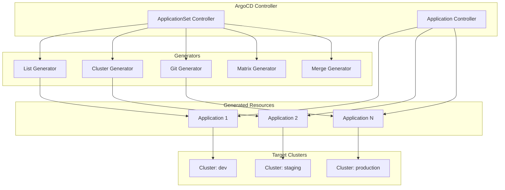
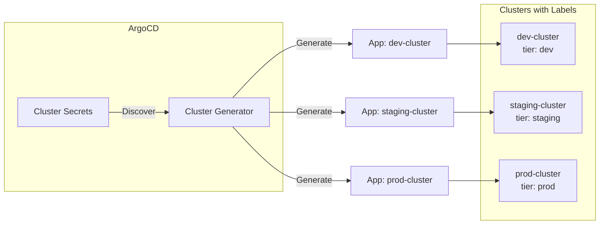
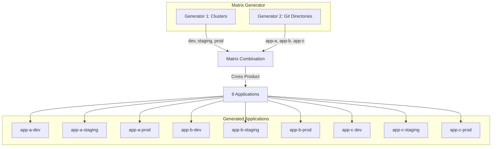
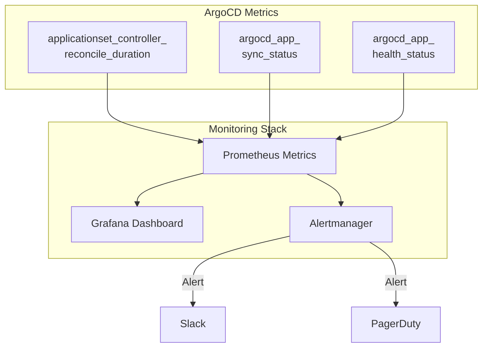

# How to Handle ArgoCD Application Sets

ArgoCD Application Sets provide a powerful way to manage multiple applications from a single definition. Instead of creating individual Application resources for each environment or cluster, ApplicationSets let you template and generate applications dynamically. In this guide, you will learn how to handle ApplicationSets effectively, from basic configuration to advanced patterns for production deployments.

## Understanding ApplicationSets Architecture

Before diving into implementation, let's understand how ApplicationSets fit into the ArgoCD ecosystem.



## Installing the ApplicationSet Controller

ApplicationSets are included by default in ArgoCD 2.3 and later versions. For earlier versions, you need to install the controller separately.

The following command installs the ApplicationSet controller in your ArgoCD namespace:

```bash
# Install ApplicationSet controller for ArgoCD versions prior to 2.3
kubectl apply -n argocd -f https://raw.githubusercontent.com/argoproj/argo-cd/stable/manifests/install.yaml

# Verify the controller is running
kubectl get pods -n argocd -l app.kubernetes.io/name=argocd-applicationset-controller
```

## Creating Your First ApplicationSet

Let's start with a basic ApplicationSet that deploys an application to multiple environments.

The following YAML defines an ApplicationSet using the List generator to create applications for dev, staging, and production environments:

```yaml
# applicationset-basic.yaml
# Creates one Application for each item in the elements list
apiVersion: argoproj.io/v1alpha1
kind: ApplicationSet
metadata:
  name: myapp-environments
  namespace: argocd
spec:
  # The generators section defines how applications are created
  generators:
    - list:
        # Each element generates one Application
        elements:
          - env: dev
            cluster: https://dev-cluster.example.com
            replicas: "1"
          - env: staging
            cluster: https://staging-cluster.example.com
            replicas: "2"
          - env: production
            cluster: https://prod-cluster.example.com
            replicas: "3"

  # The template section defines the Application structure
  template:
    metadata:
      # Use templating to create unique names
      name: "myapp-{{env}}"
      labels:
        environment: "{{env}}"
    spec:
      project: default
      source:
        repoURL: https://github.com/myorg/myapp.git
        targetRevision: HEAD
        path: "overlays/{{env}}"
        helm:
          parameters:
            - name: replicas
              value: "{{replicas}}"
      destination:
        server: "{{cluster}}"
        namespace: "myapp-{{env}}"
      syncPolicy:
        automated:
          prune: true
          selfHeal: true
```

Apply the ApplicationSet to your cluster:

```bash
# Apply the ApplicationSet
kubectl apply -f applicationset-basic.yaml

# View generated applications
kubectl get applications -n argocd
```

## Working with the Cluster Generator

The Cluster generator automatically discovers clusters registered in ArgoCD and creates applications for each one.



The following ApplicationSet uses the Cluster generator with label selectors to target specific clusters:

```yaml
# applicationset-cluster.yaml
# Deploys to all clusters matching the label selector
apiVersion: argoproj.io/v1alpha1
kind: ApplicationSet
metadata:
  name: monitoring-stack
  namespace: argocd
spec:
  generators:
    - clusters:
        # Only select clusters with specific labels
        selector:
          matchLabels:
            monitoring: enabled
        # Values can be overridden or added
        values:
          alertmanagerReplicas: "2"

  template:
    metadata:
      # name and server are automatically available from cluster secrets
      name: "monitoring-{{name}}"
    spec:
      project: infrastructure
      source:
        repoURL: https://github.com/myorg/monitoring-stack.git
        targetRevision: v1.2.0
        path: charts/prometheus-stack
        helm:
          valueFiles:
            - values.yaml
          parameters:
            - name: alertmanager.replicas
              value: "{{values.alertmanagerReplicas}}"
      destination:
        # server is automatically populated from cluster registration
        server: "{{server}}"
        namespace: monitoring
      syncPolicy:
        automated:
          prune: true
          selfHeal: true
        syncOptions:
          - CreateNamespace=true
```

## Using the Git Generator

The Git generator creates applications based on directory structure or files in a Git repository.

The following example scans a Git repository for directories and creates an application for each:

```yaml
# applicationset-git-directory.yaml
# Creates applications based on directory structure in the repo
apiVersion: argoproj.io/v1alpha1
kind: ApplicationSet
metadata:
  name: team-applications
  namespace: argocd
spec:
  generators:
    - git:
        repoURL: https://github.com/myorg/application-configs.git
        revision: HEAD
        # Scan for directories matching this pattern
        directories:
          - path: "teams/*/apps/*"
          # Exclude specific paths
          - path: "teams/platform/apps/deprecated-*"
            exclude: true

  template:
    metadata:
      # path variables: path, basename, basenameNormalized
      name: "{{path.basename}}"
      annotations:
        team: "{{path[1]}}"
    spec:
      project: team-apps
      source:
        repoURL: https://github.com/myorg/application-configs.git
        targetRevision: HEAD
        path: "{{path}}"
      destination:
        server: https://kubernetes.default.svc
        namespace: "{{path.basename}}"
      syncPolicy:
        automated:
          prune: true
          selfHeal: true
```

For file-based generation, you can use config files in your repository:

```yaml
# applicationset-git-files.yaml
# Reads configuration from JSON or YAML files in the repo
apiVersion: argoproj.io/v1alpha1
kind: ApplicationSet
metadata:
  name: microservices
  namespace: argocd
spec:
  generators:
    - git:
        repoURL: https://github.com/myorg/service-registry.git
        revision: HEAD
        files:
          # Match all config.json files in service directories
          - path: "services/**/config.json"

  template:
    metadata:
      # Fields from config.json are available as template variables
      name: "{{name}}"
      labels:
        team: "{{team}}"
        tier: "{{tier}}"
    spec:
      project: "{{project}}"
      source:
        repoURL: "{{repoURL}}"
        targetRevision: "{{targetRevision}}"
        path: "{{chartPath}}"
        helm:
          valueFiles:
            - "{{valuesFile}}"
      destination:
        server: "{{clusterURL}}"
        namespace: "{{namespace}}"
```

An example config.json file structure for the services:

```json
{
  "name": "order-service",
  "team": "commerce",
  "tier": "backend",
  "project": "commerce",
  "repoURL": "https://github.com/myorg/order-service.git",
  "targetRevision": "v2.1.0",
  "chartPath": "deploy/helm",
  "valuesFile": "values-production.yaml",
  "clusterURL": "https://prod-cluster.example.com",
  "namespace": "commerce"
}
```

## Combining Generators with Matrix

The Matrix generator combines two generators to create a cross-product of applications.



The following ApplicationSet deploys all applications to all clusters:

```yaml
# applicationset-matrix.yaml
# Creates applications for every combination of clusters and git directories
apiVersion: argoproj.io/v1alpha1
kind: ApplicationSet
metadata:
  name: all-apps-all-clusters
  namespace: argocd
spec:
  generators:
    - matrix:
        generators:
          # First generator: clusters
          - clusters:
              selector:
                matchLabels:
                  app-deployment: enabled
              values:
                # Add revision based on cluster tier
                revision: "{{metadata.labels.tier}}"

          # Second generator: git directories
          - git:
              repoURL: https://github.com/myorg/applications.git
              revision: HEAD
              directories:
                - path: "apps/*"

  template:
    metadata:
      # Combine values from both generators
      name: "{{path.basename}}-{{name}}"
    spec:
      project: default
      source:
        repoURL: https://github.com/myorg/applications.git
        # Use cluster-specific revision
        targetRevision: "{{values.revision}}"
        path: "{{path}}"
      destination:
        server: "{{server}}"
        namespace: "{{path.basename}}"
```

## Implementing Progressive Rollouts

ApplicationSets support progressive sync strategies for safer deployments across multiple clusters.

```yaml
# applicationset-progressive.yaml
# Implements progressive rollout with rollout steps
apiVersion: argoproj.io/v1alpha1
kind: ApplicationSet
metadata:
  name: progressive-deployment
  namespace: argocd
spec:
  generators:
    - list:
        elements:
          - env: canary
            cluster: https://canary-cluster.example.com
            order: "1"
          - env: staging
            cluster: https://staging-cluster.example.com
            order: "2"
          - env: production-east
            cluster: https://prod-east.example.com
            order: "3"
          - env: production-west
            cluster: https://prod-west.example.com
            order: "3"

  # Define the rollout strategy
  strategy:
    type: RollingSync
    rollingSync:
      steps:
        # Step 1: Deploy to canary first
        - matchExpressions:
            - key: env
              operator: In
              values:
                - canary
        # Step 2: Wait for canary, then deploy staging
        - matchExpressions:
            - key: env
              operator: In
              values:
                - staging
        # Step 3: Deploy to all production clusters
        - matchExpressions:
            - key: env
              operator: In
              values:
                - production-east
                - production-west

  template:
    metadata:
      name: "myapp-{{env}}"
      labels:
        env: "{{env}}"
        rollout-order: "{{order}}"
    spec:
      project: default
      source:
        repoURL: https://github.com/myorg/myapp.git
        targetRevision: HEAD
        path: "deploy/{{env}}"
      destination:
        server: "{{cluster}}"
        namespace: myapp
      syncPolicy:
        automated:
          prune: true
          selfHeal: true
```

## Handling Application Lifecycle

Control how applications behave when they are removed from the generator output.

```yaml
# applicationset-lifecycle.yaml
# Configures application lifecycle and deletion behavior
apiVersion: argoproj.io/v1alpha1
kind: ApplicationSet
metadata:
  name: managed-applications
  namespace: argocd
spec:
  generators:
    - git:
        repoURL: https://github.com/myorg/app-registry.git
        revision: HEAD
        directories:
          - path: "applications/*"

  # Sync policy controls application lifecycle
  syncPolicy:
    # Preserve resources in the cluster when Application is deleted
    preserveResourcesOnDeletion: false

    # Control what happens when an application is removed from generator output
    applicationsSync: create-update
    # Options:
    # - create-only: Only create, never update or delete
    # - create-update: Create and update, but never delete
    # - create-delete: Create and delete, but never update
    # - sync: Full lifecycle management (default)

  template:
    metadata:
      name: "{{path.basename}}"
      # Finalizers control deletion behavior
      finalizers:
        - resources-finalizer.argocd.argoproj.io
    spec:
      project: default
      source:
        repoURL: https://github.com/myorg/app-registry.git
        targetRevision: HEAD
        path: "{{path}}"
      destination:
        server: https://kubernetes.default.svc
        namespace: "{{path.basename}}"
```

## Implementing Conditional Logic with Go Templates

Use Go templating for complex conditional logic in your ApplicationSets.

```yaml
# applicationset-conditional.yaml
# Uses Go template functions for conditional configuration
apiVersion: argoproj.io/v1alpha1
kind: ApplicationSet
metadata:
  name: conditional-apps
  namespace: argocd
spec:
  goTemplate: true
  goTemplateOptions: ["missingkey=error"]

  generators:
    - list:
        elements:
          - name: api-service
            env: production
            region: us-east
            highAvailability: "true"
            resourceQuota: large
          - name: api-service
            env: staging
            region: us-east
            highAvailability: "false"
            resourceQuota: small

  template:
    metadata:
      name: "{{ .name }}-{{ .env }}-{{ .region }}"
    spec:
      project: default
      source:
        repoURL: https://github.com/myorg/services.git
        targetRevision: HEAD
        path: "services/{{ .name }}"
        helm:
          values: |
            # Conditional replica count based on HA setting
            {{- if eq .highAvailability "true" }}
            replicas: 3
            podDisruptionBudget:
              enabled: true
              minAvailable: 2
            {{- else }}
            replicas: 1
            podDisruptionBudget:
              enabled: false
            {{- end }}

            # Resource configuration based on quota
            resources:
            {{- if eq .resourceQuota "large" }}
              requests:
                cpu: "2"
                memory: "4Gi"
              limits:
                cpu: "4"
                memory: "8Gi"
            {{- else }}
              requests:
                cpu: "500m"
                memory: "512Mi"
              limits:
                cpu: "1"
                memory: "1Gi"
            {{- end }}

            environment: {{ .env }}
            region: {{ .region }}
      destination:
        server: https://kubernetes.default.svc
        namespace: "{{ .name }}-{{ .env }}"
```

## Monitoring and Debugging ApplicationSets

Set up proper monitoring and understand how to debug issues.



The following commands help debug ApplicationSet issues:

```bash
# View ApplicationSet status
kubectl get applicationsets -n argocd

# Get detailed ApplicationSet information
kubectl describe applicationset myapp-environments -n argocd

# View ApplicationSet controller logs
kubectl logs -n argocd -l app.kubernetes.io/name=argocd-applicationset-controller -f

# List generated applications
kubectl get applications -n argocd -l app.kubernetes.io/instance=myapp-environments

# Check for sync errors in applications
kubectl get applications -n argocd -o custom-columns=NAME:.metadata.name,SYNC:.status.sync.status,HEALTH:.status.health.status

# Get events related to ApplicationSets
kubectl get events -n argocd --field-selector involvedObject.kind=ApplicationSet
```

Create a ServiceMonitor for Prometheus integration:

```yaml
# servicemonitor-applicationset.yaml
# Enables Prometheus scraping of ApplicationSet controller metrics
apiVersion: monitoring.coreos.com/v1
kind: ServiceMonitor
metadata:
  name: argocd-applicationset-controller
  namespace: argocd
  labels:
    release: prometheus
spec:
  selector:
    matchLabels:
      app.kubernetes.io/name: argocd-applicationset-controller
  endpoints:
    - port: metrics
      interval: 30s
      path: /metrics
```

## Handling Secrets and Sensitive Data

Integrate ApplicationSets with secret management solutions.

```yaml
# applicationset-with-secrets.yaml
# Uses external secrets operator for sensitive configuration
apiVersion: argoproj.io/v1alpha1
kind: ApplicationSet
metadata:
  name: apps-with-secrets
  namespace: argocd
spec:
  generators:
    - list:
        elements:
          - name: payment-service
            env: production
            secretStore: aws-secrets-manager
          - name: payment-service
            env: staging
            secretStore: vault

  template:
    metadata:
      name: "{{name}}-{{env}}"
    spec:
      project: secure-apps
      source:
        repoURL: https://github.com/myorg/secure-services.git
        targetRevision: HEAD
        path: "services/{{name}}"
        helm:
          valueFiles:
            - "values-{{env}}.yaml"
          parameters:
            # Reference to External Secrets configuration
            - name: externalSecrets.enabled
              value: "true"
            - name: externalSecrets.secretStore
              value: "{{secretStore}}"
            - name: externalSecrets.refreshInterval
              value: "1h"
      destination:
        server: https://kubernetes.default.svc
        namespace: "{{name}}-{{env}}"
      syncPolicy:
        automated:
          prune: true
          selfHeal: true
```

## Best Practices and Common Patterns

### Pattern 1: Environment Promotion

```yaml
# applicationset-promotion.yaml
# Manages application versions across environments with promotion workflow
apiVersion: argoproj.io/v1alpha1
kind: ApplicationSet
metadata:
  name: promotion-workflow
  namespace: argocd
spec:
  generators:
    - git:
        repoURL: https://github.com/myorg/release-registry.git
        revision: HEAD
        files:
          - path: "releases/*/environment-config.yaml"

  template:
    metadata:
      name: "{{name}}-{{environment}}"
      annotations:
        # Track the promoted version
        notifications.argoproj.io/subscribe.on-sync-succeeded.slack: releases
    spec:
      project: default
      source:
        repoURL: "{{chartRepo}}"
        chart: "{{chartName}}"
        targetRevision: "{{chartVersion}}"
        helm:
          valueFiles:
            - "{{valuesFile}}"
      destination:
        server: "{{clusterURL}}"
        namespace: "{{namespace}}"
```

### Pattern 2: Tenant Isolation

```yaml
# applicationset-multitenant.yaml
# Creates isolated namespaces and applications for each tenant
apiVersion: argoproj.io/v1alpha1
kind: ApplicationSet
metadata:
  name: tenant-applications
  namespace: argocd
spec:
  generators:
    - git:
        repoURL: https://github.com/myorg/tenant-registry.git
        revision: HEAD
        files:
          - path: "tenants/*/config.yaml"

  template:
    metadata:
      name: "tenant-{{tenantId}}-{{appName}}"
      labels:
        tenant: "{{tenantId}}"
    spec:
      # Each tenant gets their own project for RBAC isolation
      project: "tenant-{{tenantId}}"
      source:
        repoURL: https://github.com/myorg/tenant-app-template.git
        targetRevision: HEAD
        path: charts/tenant-stack
        helm:
          values: |
            tenantId: {{tenantId}}
            tenantName: {{tenantName}}
            resourceQuota:
              cpu: {{quotaCPU}}
              memory: {{quotaMemory}}
            networkPolicy:
              enabled: true
              allowedNamespaces:
                - shared-services
      destination:
        server: https://kubernetes.default.svc
        namespace: "tenant-{{tenantId}}"
      syncPolicy:
        syncOptions:
          - CreateNamespace=true
```

### Pattern 3: Disaster Recovery

```yaml
# applicationset-dr.yaml
# Implements active-passive disaster recovery pattern
apiVersion: argoproj.io/v1alpha1
kind: ApplicationSet
metadata:
  name: disaster-recovery
  namespace: argocd
spec:
  goTemplate: true
  generators:
    - list:
        elements:
          - name: critical-app
            primaryCluster: https://primary.example.com
            drCluster: https://dr.example.com
            primaryActive: "true"

  template:
    metadata:
      name: "{{ .name }}-dr-setup"
    spec:
      project: critical
      source:
        repoURL: https://github.com/myorg/critical-apps.git
        targetRevision: HEAD
        path: "apps/{{ .name }}"
        helm:
          values: |
            # Primary site configuration
            primary:
              enabled: {{ .primaryActive }}
              cluster: {{ .primaryCluster }}

            # DR site configuration
            dr:
              enabled: {{ not (eq .primaryActive "true") }}
              cluster: {{ .drCluster }}

            # Replication settings
            dataReplication:
              enabled: true
              mode: async
              targetCluster: {{ .drCluster }}
      destination:
        server: "{{ .primaryCluster }}"
        namespace: critical-apps
```

## Troubleshooting Common Issues

Here are solutions to frequently encountered problems:

```bash
# Issue: Applications not being generated
# Check if the generator is producing output
kubectl get applicationset myapp -n argocd -o jsonpath='{.status}'

# Issue: Template rendering errors
# Enable debug logging in the controller
kubectl set env deployment/argocd-applicationset-controller -n argocd ARGOCD_APPLICATIONSET_CONTROLLER_LOGLEVEL=debug

# Issue: Applications stuck in sync loop
# Check for drift in the Application spec
kubectl get application myapp-dev -n argocd -o yaml | grep -A 20 "status:"

# Issue: Cluster generator not finding clusters
# Verify cluster secrets have correct labels
kubectl get secrets -n argocd -l argocd.argoproj.io/secret-type=cluster --show-labels

# Reset an ApplicationSet by deleting and recreating
kubectl delete applicationset myapp -n argocd
kubectl apply -f applicationset.yaml
```

## Conclusion

ArgoCD ApplicationSets significantly simplify multi-cluster and multi-environment deployments by providing declarative, templated application management. Starting with simple generators and progressively adopting more complex patterns like Matrix generators and progressive rollouts will help you build a robust GitOps workflow.

Key takeaways include using the appropriate generator for your use case, implementing proper lifecycle management, leveraging Go templates for conditional logic, and setting up monitoring for visibility into your ApplicationSets. By following these patterns and best practices, you can manage hundreds of applications across multiple clusters with minimal operational overhead.

Remember to test ApplicationSets in non-production environments first, especially when using features like progressive sync or automated pruning, to ensure the behavior matches your expectations.
