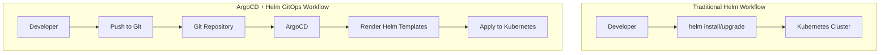
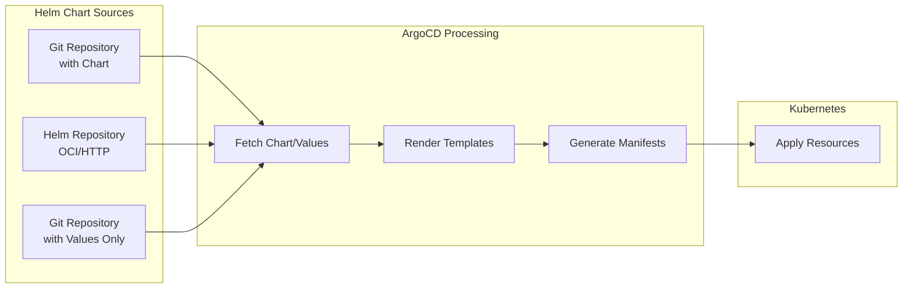
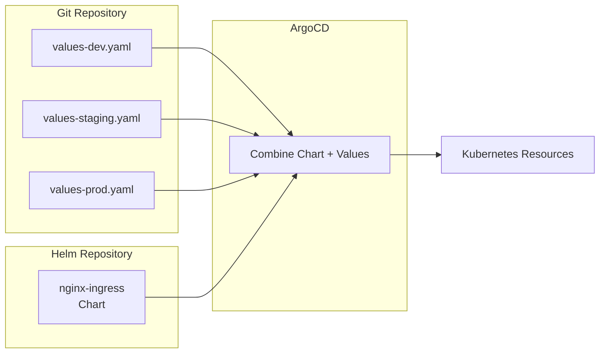
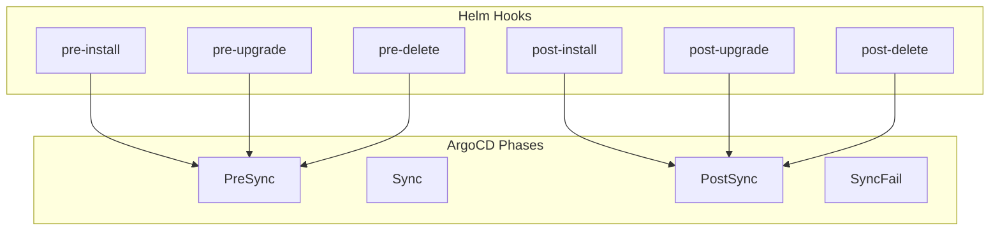
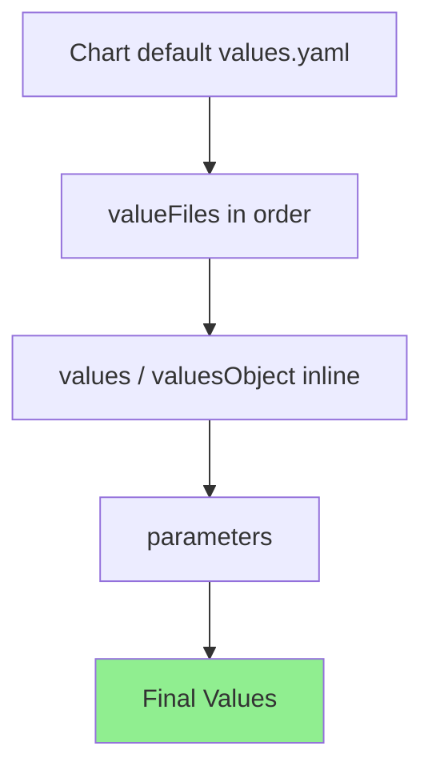
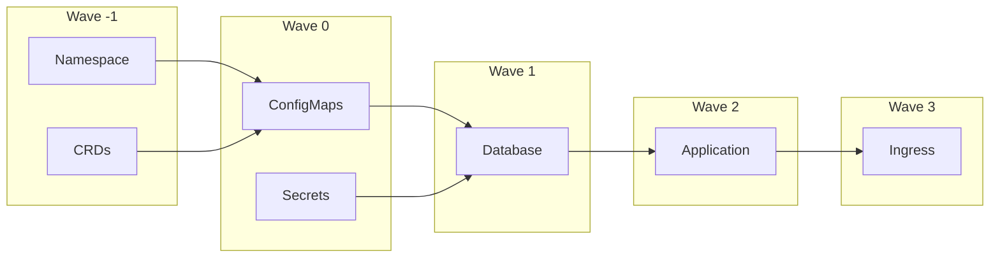

# How to Use ArgoCD with Helm

Author: [nawazdhandala](https://www.github.com/nawazdhandala)

Tags: ArgoCD, Helm, Kubernetes, GitOps, DevOps, CI/CD, Charts, Deployment

Description: A comprehensive guide to deploying Helm charts with ArgoCD, covering chart repositories, values management, parameter overrides, sync strategies, and production-ready patterns for GitOps workflows.

---

ArgoCD and Helm are a powerful combination for Kubernetes deployments. ArgoCD provides the GitOps workflow while Helm handles the packaging and templating of your applications. Together, they enable declarative, version-controlled, and automated deployments that scale from small teams to enterprise environments.

## Why Combine ArgoCD with Helm?

Before diving into implementation, let's understand why this combination makes sense:



**Benefits of using ArgoCD with Helm:**

1. **GitOps-driven deployments** - All changes go through Git, providing audit trails and easy rollbacks
2. **Declarative configuration** - Define what you want, not how to get there
3. **Drift detection** - ArgoCD continuously monitors and alerts on configuration drift
4. **Multi-environment management** - Use the same chart with different values per environment
5. **Self-healing** - Automatically correct manual changes that deviate from Git state
6. **Visual dashboard** - See the status of all your Helm releases in one place

## Prerequisites

Before starting, ensure you have:

- A running Kubernetes cluster (v1.24+)
- kubectl configured with cluster access
- ArgoCD installed (v2.8+)
- Basic understanding of Helm charts

## ArgoCD Installation with Helm

Let's start by installing ArgoCD itself using Helm. This demonstrates the pattern we will use throughout.

The following command adds the official ArgoCD Helm repository and installs ArgoCD with production-ready settings:

```bash
# Add the ArgoCD Helm repository
helm repo add argo https://argoproj.github.io/argo-helm
helm repo update

# Install ArgoCD with custom values for production
helm install argocd argo/argo-cd \
  --namespace argocd \
  --create-namespace \
  --set server.replicas=2 \
  --set controller.replicas=2 \
  --set repoServer.replicas=2 \
  --set configs.params."server\.insecure"=true
```

For a more maintainable approach, create a values file:

This values file configures ArgoCD with high availability settings, resource limits, and metrics enabled for monitoring:

```yaml
# argocd-values.yaml
server:
  # Run multiple replicas for high availability
  replicas: 2

  # Resource limits prevent runaway memory consumption
  resources:
    limits:
      cpu: 500m
      memory: 512Mi
    requests:
      cpu: 100m
      memory: 256Mi

  # Enable metrics for Prometheus scraping
  metrics:
    enabled: true
    serviceMonitor:
      enabled: true

controller:
  # Controller handles sync operations - scale for large deployments
  replicas: 2
  resources:
    limits:
      cpu: 1000m
      memory: 1Gi
    requests:
      cpu: 250m
      memory: 512Mi

repoServer:
  # Repo server renders Helm templates - critical for performance
  replicas: 2
  resources:
    limits:
      cpu: 1000m
      memory: 1Gi
    requests:
      cpu: 250m
      memory: 512Mi

configs:
  params:
    # Disable TLS for internal communication (use ingress for external TLS)
    server.insecure: true
  cm:
    # Enable Helm support explicitly
    helm.enabled: "true"
```

Install using the values file:

```bash
helm install argocd argo/argo-cd \
  --namespace argocd \
  --create-namespace \
  -f argocd-values.yaml
```

## Understanding How ArgoCD Handles Helm Charts

ArgoCD supports three methods for deploying Helm charts:



1. **Helm chart in Git** - Chart source code stored in a Git repository
2. **Helm repository** - Chart stored in a Helm repository (HTTP or OCI)
3. **Helm chart with external values** - Chart from a repository with values from Git

## Method 1: Deploying a Helm Chart from Git

When your Helm chart source code lives in a Git repository, ArgoCD can directly use it.

### Repository Structure

```
my-app/
├── Chart.yaml
├── values.yaml
├── values-dev.yaml
├── values-staging.yaml
├── values-prod.yaml
└── templates/
    ├── deployment.yaml
    ├── service.yaml
    ├── ingress.yaml
    └── _helpers.tpl
```

### ArgoCD Application Definition

This Application resource tells ArgoCD to deploy a Helm chart from a Git repository, using the production values file:

```yaml
# application-git-helm.yaml
apiVersion: argoproj.io/v1alpha1
kind: Application
metadata:
  name: my-app-production
  namespace: argocd
  # Finalizer ensures ArgoCD cleans up resources when Application is deleted
  finalizers:
    - resources-finalizer.argocd.argoproj.io
spec:
  project: default

  source:
    # Git repository containing the Helm chart
    repoURL: https://github.com/myorg/my-app.git
    targetRevision: main
    # Path to the chart directory within the repository
    path: helm/my-app

    helm:
      # Use environment-specific values file
      valueFiles:
        - values.yaml
        - values-prod.yaml

      # Override specific parameters inline
      parameters:
        - name: image.tag
          value: "v1.2.3"
        - name: replicaCount
          value: "3"

  destination:
    # Deploy to the same cluster where ArgoCD runs
    server: https://kubernetes.default.svc
    namespace: production

  syncPolicy:
    automated:
      # Remove resources that are no longer in Git
      prune: true
      # Fix any drift from the desired state
      selfHeal: true
    syncOptions:
      # Create the namespace if it does not exist
      - CreateNamespace=true
      # Use server-side apply for better conflict resolution
      - ServerSideApply=true
```

Apply the Application:

```bash
kubectl apply -f application-git-helm.yaml
```

## Method 2: Deploying from a Helm Repository

For charts published to a Helm repository (like Bitnami, Prometheus, or your own), ArgoCD can fetch them directly.

### Adding a Helm Repository to ArgoCD

First, register the Helm repository with ArgoCD:

This Secret resource configures ArgoCD to access a Helm repository. The labels are critical as they tell ArgoCD this is a repository configuration:

```yaml
# helm-repo-secret.yaml
apiVersion: v1
kind: Secret
metadata:
  name: bitnami-charts
  namespace: argocd
  labels:
    # This label is required for ArgoCD to recognize this as a repository
    argocd.argoproj.io/secret-type: repository
stringData:
  # Repository name for display
  name: bitnami
  # Repository URL
  url: https://charts.bitnami.com/bitnami
  # Type must be "helm" for Helm repositories
  type: helm
```

For private repositories, include authentication:

```yaml
# private-helm-repo.yaml
apiVersion: v1
kind: Secret
metadata:
  name: private-charts
  namespace: argocd
  labels:
    argocd.argoproj.io/secret-type: repository
stringData:
  name: private-charts
  url: https://charts.example.com
  type: helm
  # Basic authentication
  username: admin
  password: secretpassword
```

### Deploying from the Helm Repository

This Application deploys PostgreSQL from the Bitnami Helm repository with custom configuration for persistence and authentication:

```yaml
# application-helm-repo.yaml
apiVersion: argoproj.io/v1alpha1
kind: Application
metadata:
  name: postgresql
  namespace: argocd
spec:
  project: default

  source:
    # Helm repository URL - must match a registered repository
    repoURL: https://charts.bitnami.com/bitnami
    # Chart name within the repository
    chart: postgresql
    # Chart version - pin this for reproducible deployments
    targetRevision: 15.5.0

    helm:
      # Helm release name (defaults to Application name if not set)
      releaseName: postgresql

      # Inline values (alternative to valueFiles for Helm repos)
      values: |
        # Primary PostgreSQL configuration
        primary:
          persistence:
            enabled: true
            size: 20Gi
            storageClass: fast-ssd
          resources:
            limits:
              cpu: 2000m
              memory: 4Gi
            requests:
              cpu: 500m
              memory: 1Gi

        # Authentication configuration
        auth:
          postgresPassword: changeme
          database: myapp
          username: myapp
          password: changeme

        # Metrics for monitoring
        metrics:
          enabled: true
          serviceMonitor:
            enabled: true

  destination:
    server: https://kubernetes.default.svc
    namespace: database

  syncPolicy:
    automated:
      prune: true
      selfHeal: true
    syncOptions:
      - CreateNamespace=true
```

## Method 3: Helm Chart with External Values

This pattern keeps your chart in a Helm repository but manages values files in Git. This is ideal for third-party charts where you only need to customize configuration.



### Repository Structure for Values

```
gitops-config/
├── apps/
│   ├── nginx-ingress/
│   │   ├── base-values.yaml
│   │   ├── values-dev.yaml
│   │   ├── values-staging.yaml
│   │   └── values-prod.yaml
│   └── cert-manager/
│       ├── base-values.yaml
│       └── values-prod.yaml
└── applicationsets/
    └── infrastructure.yaml
```

### Multi-Source Application

ArgoCD supports multiple sources, allowing you to combine a Helm chart from a repository with values from Git:

This Application uses two sources - the chart from a Helm repository and values from a Git repository. The ref field creates a named reference that can be used in valueFiles paths:

```yaml
# multi-source-application.yaml
apiVersion: argoproj.io/v1alpha1
kind: Application
metadata:
  name: nginx-ingress
  namespace: argocd
spec:
  project: default

  sources:
    # First source: Helm chart from repository
    - repoURL: https://kubernetes.github.io/ingress-nginx
      chart: ingress-nginx
      targetRevision: 4.10.0
      helm:
        releaseName: nginx-ingress
        # Reference values from the Git source using $values prefix
        valueFiles:
          - $values/apps/nginx-ingress/base-values.yaml
          - $values/apps/nginx-ingress/values-prod.yaml

    # Second source: Git repository containing values files
    # The ref creates a reference that can be used in valueFiles
    - repoURL: https://github.com/myorg/gitops-config.git
      targetRevision: main
      ref: values

  destination:
    server: https://kubernetes.default.svc
    namespace: ingress-nginx

  syncPolicy:
    automated:
      prune: true
      selfHeal: true
    syncOptions:
      - CreateNamespace=true
```

## Managing Values Across Environments

### Using ApplicationSets for Multi-Environment Deployments

ApplicationSets automatically generate Applications from a template, perfect for deploying the same chart to multiple environments.

This ApplicationSet creates three Applications (dev, staging, prod) from a single template, with environment-specific configuration:

```yaml
# applicationset-environments.yaml
apiVersion: argoproj.io/v1alpha1
kind: ApplicationSet
metadata:
  name: my-app
  namespace: argocd
spec:
  generators:
    # List generator defines each environment explicitly
    - list:
        elements:
          - env: dev
            namespace: my-app-dev
            replicas: "1"
            values_file: values-dev.yaml
          - env: staging
            namespace: my-app-staging
            replicas: "2"
            values_file: values-staging.yaml
          - env: prod
            namespace: my-app-prod
            replicas: "3"
            values_file: values-prod.yaml

  template:
    metadata:
      # Application name includes environment suffix
      name: 'my-app-{{env}}'
    spec:
      project: default

      source:
        repoURL: https://github.com/myorg/my-app.git
        targetRevision: main
        path: helm/my-app

        helm:
          valueFiles:
            - values.yaml
            - '{{values_file}}'
          parameters:
            - name: replicaCount
              value: '{{replicas}}'

      destination:
        server: https://kubernetes.default.svc
        namespace: '{{namespace}}'

      syncPolicy:
        automated:
          prune: true
          selfHeal: true
        syncOptions:
          - CreateNamespace=true
```

### Git Directory Generator

For teams managing many applications, the Git directory generator automatically discovers and deploys charts:

This ApplicationSet scans a Git directory and creates an Application for each subdirectory containing a Helm chart:

```yaml
# applicationset-git-directories.yaml
apiVersion: argoproj.io/v1alpha1
kind: ApplicationSet
metadata:
  name: apps
  namespace: argocd
spec:
  generators:
    - git:
        repoURL: https://github.com/myorg/helm-charts.git
        revision: main
        directories:
          # Match all directories under charts/
          - path: charts/*

  template:
    metadata:
      # Use the directory name as the Application name
      name: '{{path.basename}}'
    spec:
      project: default

      source:
        repoURL: https://github.com/myorg/helm-charts.git
        targetRevision: main
        path: '{{path}}'

        helm:
          valueFiles:
            - values.yaml

      destination:
        server: https://kubernetes.default.svc
        namespace: '{{path.basename}}'

      syncPolicy:
        automated:
          prune: true
          selfHeal: true
        syncOptions:
          - CreateNamespace=true
```

## Handling Helm Hooks in ArgoCD

Helm hooks present a challenge in ArgoCD because ArgoCD manages resources differently than Helm. ArgoCD converts Helm hooks to its own sync phases.



### Configuring Hook Behavior

This example shows how to create a database migration job that runs before the main deployment:

```yaml
# templates/migration-job.yaml
apiVersion: batch/v1
kind: Job
metadata:
  name: {{ include "myapp.fullname" . }}-migrate
  annotations:
    # ArgoCD will run this before the main sync
    argocd.argoproj.io/hook: PreSync
    # Delete the job after it succeeds to allow re-runs
    argocd.argoproj.io/hook-delete-policy: HookSucceeded
spec:
  template:
    spec:
      containers:
        - name: migrate
          image: "{{ .Values.image.repository }}:{{ .Values.image.tag }}"
          command: ["./migrate.sh"]
          env:
            - name: DATABASE_URL
              valueFrom:
                secretKeyRef:
                  name: {{ include "myapp.fullname" . }}-db
                  key: url
      restartPolicy: Never
  backoffLimit: 3
```

### Skip Resource Deletion

For resources that should not be deleted when the Application is removed:

```yaml
# templates/persistent-volume-claim.yaml
apiVersion: v1
kind: PersistentVolumeClaim
metadata:
  name: {{ include "myapp.fullname" . }}-data
  annotations:
    # Prevent ArgoCD from deleting this resource
    argocd.argoproj.io/sync-options: Delete=false
spec:
  accessModes:
    - ReadWriteOnce
  resources:
    requests:
      storage: {{ .Values.persistence.size }}
```

## Advanced Helm Configuration in ArgoCD

### Ignore Differences

Some resources have fields that change outside of Git (like autoscaler-managed replicas). Configure ArgoCD to ignore these:

```yaml
apiVersion: argoproj.io/v1alpha1
kind: Application
metadata:
  name: my-app
  namespace: argocd
spec:
  # ... other config ...

  ignoreDifferences:
    # Ignore replica count changes from HPA
    - group: apps
      kind: Deployment
      jsonPointers:
        - /spec/replicas

    # Ignore webhook CA bundle injections
    - group: admissionregistration.k8s.io
      kind: MutatingWebhookConfiguration
      jqPathExpressions:
        - '.webhooks[]?.clientConfig.caBundle'
```

### Helm Parameters from Secrets

For sensitive values like passwords, reference Kubernetes secrets:

```yaml
apiVersion: argoproj.io/v1alpha1
kind: Application
metadata:
  name: my-app
  namespace: argocd
spec:
  source:
    # ... chart config ...

    helm:
      # Values can reference ConfigMaps or Secrets in the argocd namespace
      valuesObject:
        database:
          password:
            valueFrom:
              secretKeyRef:
                name: db-credentials
                key: password
```

### Helm Value Precedence

Understanding how ArgoCD merges Helm values is critical:



1. Chart's default `values.yaml`
2. Files listed in `valueFiles` (in order)
3. Inline `values` or `valuesObject`
4. Individual `parameters` (highest priority)

This means parameters always win. Use them for CI/CD-injected values like image tags:

```yaml
spec:
  source:
    helm:
      valueFiles:
        - values.yaml
        - values-prod.yaml
      values: |
        # This overrides valueFiles
        extraLabels:
          team: backend
      parameters:
        # This overrides everything else
        - name: image.tag
          value: "sha-abc123"
```

## Sync Waves for Complex Deployments

When deploying multiple components with dependencies, use sync waves:



This Application demonstrates deploying a full stack with proper ordering using sync waves:

```yaml
# full-stack-application.yaml
apiVersion: argoproj.io/v1alpha1
kind: Application
metadata:
  name: full-stack
  namespace: argocd
spec:
  project: default

  source:
    repoURL: https://github.com/myorg/full-stack.git
    targetRevision: main
    path: deploy

    helm:
      valueFiles:
        - values.yaml

  destination:
    server: https://kubernetes.default.svc
    namespace: full-stack

  syncPolicy:
    automated:
      prune: true
      selfHeal: true
    syncOptions:
      - CreateNamespace=true
      # Respect sync wave annotations
      - ApplyOutOfSyncOnly=true
```

In your Helm templates, add wave annotations:

```yaml
# templates/namespace.yaml
apiVersion: v1
kind: Namespace
metadata:
  name: {{ .Release.Namespace }}
  annotations:
    argocd.argoproj.io/sync-wave: "-1"
---
# templates/configmap.yaml
apiVersion: v1
kind: ConfigMap
metadata:
  name: {{ include "myapp.fullname" . }}-config
  annotations:
    argocd.argoproj.io/sync-wave: "0"
data:
  config.yaml: |
    {{ .Values.config | toYaml | nindent 4 }}
---
# templates/deployment.yaml
apiVersion: apps/v1
kind: Deployment
metadata:
  name: {{ include "myapp.fullname" . }}
  annotations:
    argocd.argoproj.io/sync-wave: "2"
spec:
  # ... deployment spec ...
```

## Rollback Strategies

### Manual Rollback via CLI

The ArgoCD CLI provides easy rollback capabilities:

```bash
# List deployment history
argocd app history my-app

# Rollback to a specific revision
argocd app rollback my-app 3

# Rollback to the previous version
argocd app rollback my-app
```

### GitOps-Style Rollback

The preferred GitOps approach is to revert changes in Git:

```bash
# Find the commit to revert to
git log --oneline

# Revert the problematic commit
git revert abc123

# Push the revert commit
git push origin main

# ArgoCD will automatically sync the reverted state
```

### Automated Rollback with Argo Rollouts

For advanced deployment strategies, combine ArgoCD with Argo Rollouts:

```yaml
# templates/rollout.yaml
apiVersion: argoproj.io/v1alpha1
kind: Rollout
metadata:
  name: {{ include "myapp.fullname" . }}
spec:
  replicas: {{ .Values.replicaCount }}
  selector:
    matchLabels:
      app: {{ include "myapp.name" . }}
  template:
    spec:
      containers:
        - name: {{ .Chart.Name }}
          image: "{{ .Values.image.repository }}:{{ .Values.image.tag }}"
  strategy:
    canary:
      steps:
        # Deploy to 20% of traffic
        - setWeight: 20
        # Wait and analyze metrics
        - pause: { duration: 5m }
        # Continue rollout
        - setWeight: 50
        - pause: { duration: 5m }
        # Full rollout
        - setWeight: 100
      analysis:
        templates:
          - templateName: success-rate
        startingStep: 2
```

## Monitoring ArgoCD Helm Deployments

### Prometheus Metrics

ArgoCD exposes metrics that can help monitor Helm deployments:

```yaml
# prometheus-rules.yaml
apiVersion: monitoring.coreos.com/v1
kind: PrometheusRule
metadata:
  name: argocd-helm-alerts
  namespace: argocd
spec:
  groups:
    - name: argocd-helm
      rules:
        # Alert when an application sync fails
        - alert: ArgoApplicationSyncFailed
          expr: |
            argocd_app_info{sync_status="OutOfSync"} == 1
          for: 15m
          labels:
            severity: warning
          annotations:
            summary: "Application {{ $labels.name }} is out of sync"

        # Alert when an application is unhealthy
        - alert: ArgoApplicationUnhealthy
          expr: |
            argocd_app_info{health_status!="Healthy"} == 1
          for: 10m
          labels:
            severity: critical
          annotations:
            summary: "Application {{ $labels.name }} is unhealthy"
```

### Notifications

Configure notifications for sync events:

```yaml
# argocd-notifications-cm.yaml
apiVersion: v1
kind: ConfigMap
metadata:
  name: argocd-notifications-cm
  namespace: argocd
data:
  service.slack: |
    token: $slack-token

  template.app-sync-succeeded: |
    message: |
      Application {{.app.metadata.name}} sync succeeded.
      Revision: {{.app.status.sync.revision}}

  template.app-sync-failed: |
    message: |
      Application {{.app.metadata.name}} sync failed.
      Error: {{.app.status.operationState.message}}

  trigger.on-sync-succeeded: |
    - description: Application synced successfully
      send:
        - app-sync-succeeded
      when: app.status.operationState.phase in ['Succeeded']

  trigger.on-sync-failed: |
    - description: Application sync failed
      send:
        - app-sync-failed
      when: app.status.operationState.phase in ['Error', 'Failed']
```

## Best Practices

### 1. Pin Chart Versions

Always specify exact chart versions for reproducibility:

```yaml
spec:
  source:
    chart: nginx-ingress
    # Pin to specific version, not "latest" or ranges
    targetRevision: 4.10.0
```

### 2. Use Separate Repos for Config

Keep application code and deployment configuration in separate repositories:

```
# Application repository
my-app/
├── src/
├── Dockerfile
└── .github/workflows/build.yml

# GitOps configuration repository
my-app-config/
├── charts/
│   └── my-app/
└── environments/
    ├── dev/
    ├── staging/
    └── prod/
```

### 3. Implement Proper RBAC

Restrict who can deploy to which environments:

```yaml
apiVersion: argoproj.io/v1alpha1
kind: AppProject
metadata:
  name: production
  namespace: argocd
spec:
  description: Production applications
  sourceRepos:
    - 'https://github.com/myorg/gitops-config.git'
  destinations:
    - namespace: 'prod-*'
      server: https://kubernetes.default.svc
  roles:
    - name: deployer
      description: Can sync applications
      policies:
        - p, proj:production:deployer, applications, sync, production/*, allow
        - p, proj:production:deployer, applications, get, production/*, allow
      groups:
        - production-deployers
```

### 4. Test Charts Before Deployment

Use CI to validate Helm charts:

```yaml
# .github/workflows/helm-test.yml
name: Helm Chart Tests
on: [pull_request]

jobs:
  lint-test:
    runs-on: ubuntu-latest
    steps:
      - uses: actions/checkout@v4

      - name: Set up Helm
        uses: azure/setup-helm@v4
        with:
          version: v3.14.0

      - name: Lint chart
        run: helm lint ./charts/my-app

      - name: Template chart
        run: helm template ./charts/my-app --debug

      - name: Run chart-testing
        uses: helm/chart-testing-action@v2
        with:
          command: lint-and-install
```

### 5. Handle Secrets Properly

Never commit secrets to Git. Use external secret management:

```yaml
# External Secrets Operator integration
apiVersion: external-secrets.io/v1beta1
kind: ExternalSecret
metadata:
  name: my-app-secrets
spec:
  refreshInterval: 1h
  secretStoreRef:
    kind: ClusterSecretStore
    name: vault-backend
  target:
    name: my-app-secrets
  data:
    - secretKey: database-password
      remoteRef:
        key: my-app/database
        property: password
```

## Troubleshooting Common Issues

### Chart Not Found

If ArgoCD cannot find your Helm chart:

```bash
# Verify the repository is registered
argocd repo list

# Test Helm repo access
helm repo add test-repo https://charts.example.com
helm search repo test-repo

# Check ArgoCD repo-server logs
kubectl logs -n argocd -l app.kubernetes.io/name=argocd-repo-server
```

### Values Not Being Applied

Debug Helm rendering:

```bash
# See what ArgoCD renders
argocd app manifests my-app

# Compare with local Helm
helm template my-app ./charts/my-app -f values.yaml -f values-prod.yaml

# Check for YAML syntax issues
yamllint values-prod.yaml
```

### Sync Stuck or Slow

Diagnose sync issues:

```bash
# Check application status
argocd app get my-app

# Force refresh from Git
argocd app get my-app --refresh

# Check for resource issues
kubectl get events -n my-app-namespace --sort-by='.lastTimestamp'

# Review sync operation
argocd app sync my-app --dry-run
```

## Conclusion

ArgoCD and Helm together provide a robust foundation for Kubernetes deployments. By following GitOps principles, you gain version control, audit trails, and easy rollbacks. The key points to remember:

1. Choose the right deployment method based on your chart source
2. Use ApplicationSets for managing multiple environments
3. Implement sync waves for complex deployments with dependencies
4. Monitor your deployments with proper alerting
5. Follow security best practices for secrets management

Start simple with a single application, then expand to ApplicationSets and multi-cluster deployments as your needs grow. The investment in a proper GitOps workflow pays dividends in reliability, security, and developer productivity.
