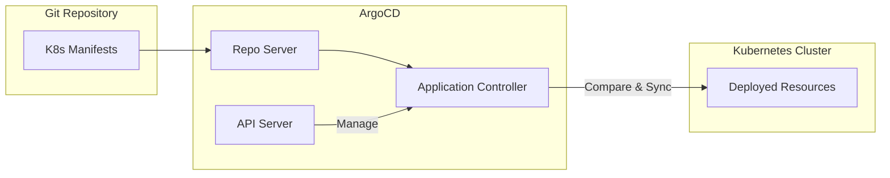

# How to Install and Configure ArgoCD

Author: [nawazdhandala](https://www.github.com/nawazdhandala)

Tags: ArgoCD, GitOps, Kubernetes, CD, DevOps

Description: A complete guide to installing ArgoCD on Kubernetes and configuring it for GitOps workflows, from basic setup to production-ready configurations.

---

ArgoCD is the de facto standard for GitOps on Kubernetes. It watches your Git repositories and automatically keeps your cluster state in sync with what you have defined in code. In this guide, we will walk through installation, initial configuration, and essential settings to get ArgoCD running properly.

## What is ArgoCD?

Before diving into installation, let's understand what ArgoCD does:



ArgoCD continuously monitors your Git repositories and compares the desired state (what's in Git) with the actual state (what's running in your cluster). When it detects drift, it can automatically sync or alert you depending on your configuration.

## Prerequisites

Before you start, make sure you have:

- A running Kubernetes cluster (v1.22+)
- kubectl configured to communicate with your cluster
- Helm 3 installed (for the Helm installation method)
- Cluster admin permissions

## Installation Methods

### Method 1: Quick Install with kubectl

The simplest way to get ArgoCD running is using the official manifests. This installs everything into the `argocd` namespace.

```bash
# Create the argocd namespace
kubectl create namespace argocd

# Apply the installation manifest
kubectl apply -n argocd -f https://raw.githubusercontent.com/argoproj/argo-cd/stable/manifests/install.yaml

# Wait for all pods to be ready
kubectl wait --for=condition=Ready pods --all -n argocd --timeout=300s
```

### Method 2: Install with Helm (Recommended for Production)

Helm gives you more control over the installation and makes upgrades easier. This is the recommended approach for production environments.

```bash
# Add the ArgoCD Helm repository
helm repo add argo https://argoproj.github.io/argo-helm
helm repo update

# Install ArgoCD with custom values
helm install argocd argo/argo-cd \
  --namespace argocd \
  --create-namespace \
  --version 5.51.6 \
  --set server.service.type=ClusterIP \
  --set configs.params."server\.insecure"=true
```

For a production setup, create a values file with your specific configuration:

```yaml
# argocd-values.yaml
server:
  # Number of replicas for high availability
  replicas: 2

  service:
    type: ClusterIP

  # Resource limits
  resources:
    requests:
      cpu: 100m
      memory: 128Mi
    limits:
      cpu: 500m
      memory: 512Mi

controller:
  # Number of replicas for high availability
  replicas: 2

  resources:
    requests:
      cpu: 250m
      memory: 256Mi
    limits:
      cpu: 1000m
      memory: 1Gi

repoServer:
  replicas: 2

  resources:
    requests:
      cpu: 100m
      memory: 128Mi
    limits:
      cpu: 500m
      memory: 512Mi

configs:
  params:
    # Run server without TLS (use ingress for TLS termination)
    server.insecure: true

    # Increase timeout for large repos
    reposerver.parallelism.limit: 5

redis:
  enabled: true

redis-ha:
  enabled: false
```

Install using the values file:

```bash
helm install argocd argo/argo-cd \
  --namespace argocd \
  --create-namespace \
  -f argocd-values.yaml
```

### Method 3: HA Installation for Production

For production clusters that need high availability, use the HA manifests:

```bash
kubectl create namespace argocd

# Install HA version
kubectl apply -n argocd -f https://raw.githubusercontent.com/argoproj/argo-cd/stable/manifests/ha/install.yaml
```

## Accessing ArgoCD

### Get the Initial Admin Password

ArgoCD generates a random password for the admin user during installation:

```bash
# Get the initial admin password
kubectl -n argocd get secret argocd-initial-admin-secret \
  -o jsonpath="{.data.password}" | base64 -d && echo
```

Save this password - you will need it to log in.

### Port Forward for Local Access

The simplest way to access the ArgoCD UI is through port forwarding:

```bash
# Forward port 8080 to the ArgoCD server
kubectl port-forward svc/argocd-server -n argocd 8080:443

# Open https://localhost:8080 in your browser
# Username: admin
# Password: (the password from the previous step)
```

### Expose via Ingress

For production, set up an Ingress controller. Here is an example using nginx-ingress:

```yaml
# argocd-ingress.yaml
apiVersion: networking.k8s.io/v1
kind: Ingress
metadata:
  name: argocd-server-ingress
  namespace: argocd
  annotations:
    nginx.ingress.kubernetes.io/ssl-passthrough: "true"
    nginx.ingress.kubernetes.io/backend-protocol: "HTTPS"
spec:
  ingressClassName: nginx
  rules:
    - host: argocd.example.com
      http:
        paths:
          - path: /
            pathType: Prefix
            backend:
              service:
                name: argocd-server
                port:
                  number: 443
  tls:
    - hosts:
        - argocd.example.com
      secretName: argocd-tls
```

Apply the ingress:

```bash
kubectl apply -f argocd-ingress.yaml
```

## Installing the ArgoCD CLI

The CLI is useful for scripting and automation. Install it based on your operating system:

```bash
# macOS (using Homebrew)
brew install argocd

# Linux (amd64)
curl -sSL -o argocd-linux-amd64 https://github.com/argoproj/argo-cd/releases/latest/download/argocd-linux-amd64
sudo install -m 555 argocd-linux-amd64 /usr/local/bin/argocd
rm argocd-linux-amd64

# Windows (using Chocolatey)
choco install argocd-cli
```

Log in to your ArgoCD instance:

```bash
# Log in (when using port-forward)
argocd login localhost:8080 --insecure --username admin --password <your-password>

# Log in via domain
argocd login argocd.example.com --username admin --password <your-password>
```

## Essential Configuration

### Change the Admin Password

Always change the default password after installation:

```bash
argocd account update-password \
  --current-password <initial-password> \
  --new-password <new-secure-password>
```

Or disable the admin user entirely and use SSO:

```yaml
# In your Helm values or ConfigMap
configs:
  cm:
    admin.enabled: "false"
```

### Configure Repository Credentials

Add credentials for private repositories:

```bash
# Add a private repo using HTTPS
argocd repo add https://github.com/myorg/private-repo.git \
  --username git \
  --password <github-token>

# Add a private repo using SSH
argocd repo add git@github.com:myorg/private-repo.git \
  --ssh-private-key-path ~/.ssh/id_rsa
```

For declarative repository configuration:

```yaml
# repository-secret.yaml
apiVersion: v1
kind: Secret
metadata:
  name: private-repo
  namespace: argocd
  labels:
    argocd.argoproj.io/secret-type: repository
stringData:
  type: git
  url: https://github.com/myorg/private-repo.git
  username: git
  password: ghp_xxxxxxxxxxxx
```

### Add Cluster Credentials

If you want to deploy to multiple clusters, add them to ArgoCD:

```bash
# Add a cluster from your kubeconfig
argocd cluster add my-cluster-context --name production-cluster

# List registered clusters
argocd cluster list
```

### Configure RBAC

ArgoCD uses its own RBAC system. Configure it in the ConfigMap:

```yaml
# argocd-rbac-cm.yaml
apiVersion: v1
kind: ConfigMap
metadata:
  name: argocd-rbac-cm
  namespace: argocd
data:
  policy.csv: |
    # Grant all permissions to admin group
    g, admins, role:admin

    # Create a read-only role
    p, role:readonly, applications, get, *, allow
    p, role:readonly, applications, list, *, allow
    p, role:readonly, clusters, get, *, allow
    p, role:readonly, repositories, get, *, allow
    p, role:readonly, projects, get, *, allow

    # Assign groups to roles
    g, developers, role:readonly

    # Project-specific permissions
    p, role:team-a-deployer, applications, sync, team-a/*, allow
    p, role:team-a-deployer, applications, get, team-a/*, allow
    g, team-a, role:team-a-deployer

  policy.default: role:readonly
```

Apply it:

```bash
kubectl apply -f argocd-rbac-cm.yaml
```

## Setting Up SSO Authentication

### OIDC Configuration (Generic)

Configure OpenID Connect for SSO with providers like Okta, Auth0, or Keycloak:

```yaml
# argocd-cm.yaml
apiVersion: v1
kind: ConfigMap
metadata:
  name: argocd-cm
  namespace: argocd
data:
  url: https://argocd.example.com
  oidc.config: |
    name: Okta
    issuer: https://yourcompany.okta.com
    clientID: your-client-id
    clientSecret: $oidc.okta.clientSecret
    requestedScopes: ["openid", "profile", "email", "groups"]
    requestedIDTokenClaims:
      groups:
        essential: true
```

Store the client secret:

```yaml
# argocd-secret.yaml
apiVersion: v1
kind: Secret
metadata:
  name: argocd-secret
  namespace: argocd
stringData:
  oidc.okta.clientSecret: your-client-secret
```

### GitHub OAuth

```yaml
apiVersion: v1
kind: ConfigMap
metadata:
  name: argocd-cm
  namespace: argocd
data:
  url: https://argocd.example.com
  dex.config: |
    connectors:
      - type: github
        id: github
        name: GitHub
        config:
          clientID: $dex.github.clientID
          clientSecret: $dex.github.clientSecret
          orgs:
            - name: your-github-org
```

## Creating Your First Application

With ArgoCD configured, create an application to deploy:

```yaml
# example-application.yaml
apiVersion: argoproj.io/v1alpha1
kind: Application
metadata:
  name: my-app
  namespace: argocd
spec:
  project: default

  source:
    repoURL: https://github.com/myorg/my-app.git
    targetRevision: main
    path: k8s/manifests

  destination:
    server: https://kubernetes.default.svc
    namespace: my-app

  syncPolicy:
    automated:
      prune: true
      selfHeal: true
    syncOptions:
      - CreateNamespace=true
```

Apply the application:

```bash
kubectl apply -f example-application.yaml

# Check the application status
argocd app get my-app
```

## Verifying the Installation

Run these checks to make sure everything is working:

```bash
# Check all ArgoCD pods are running
kubectl get pods -n argocd

# Expected output:
# NAME                                               READY   STATUS    RESTARTS   AGE
# argocd-application-controller-0                    1/1     Running   0          5m
# argocd-dex-server-xxxxxxxxxx-xxxxx                 1/1     Running   0          5m
# argocd-notifications-controller-xxxxxxxxxx-xxxxx  1/1     Running   0          5m
# argocd-redis-xxxxxxxxxx-xxxxx                      1/1     Running   0          5m
# argocd-repo-server-xxxxxxxxxx-xxxxx                1/1     Running   0          5m
# argocd-server-xxxxxxxxxx-xxxxx                     1/1     Running   0          5m

# Check ArgoCD version
argocd version

# List all applications
argocd app list

# Check cluster connectivity
argocd cluster list
```

## Common Issues and Solutions

### Application Stuck in Syncing State

This usually means there is an issue with the manifests:

```bash
# Get detailed sync status
argocd app get my-app --show-operation

# Check for resource errors
kubectl get events -n my-app --sort-by='.lastTimestamp'
```

### Repository Connection Failures

Verify your repository credentials:

```bash
# List repos and check status
argocd repo list

# Test repo connection
argocd repo add https://github.com/myorg/repo.git --username git --password token
```

### Out of Sync but Nothing Changed

ArgoCD might be detecting differences in auto-generated fields. Add ignore rules:

```yaml
spec:
  ignoreDifferences:
    - group: apps
      kind: Deployment
      jsonPointers:
        - /spec/replicas
    - group: ""
      kind: Service
      jsonPointers:
        - /spec/clusterIP
```

### Resource Limits Exceeded

If ArgoCD is running slow, increase resource limits:

```yaml
# In your Helm values
controller:
  resources:
    limits:
      cpu: 2000m
      memory: 2Gi
    requests:
      cpu: 500m
      memory: 512Mi
```

## Upgrading ArgoCD

For Helm installations:

```bash
# Update the Helm repo
helm repo update

# Check available versions
helm search repo argo/argo-cd --versions

# Upgrade to a new version
helm upgrade argocd argo/argo-cd \
  --namespace argocd \
  -f argocd-values.yaml \
  --version 5.52.0
```

For kubectl installations:

```bash
# Apply the new version manifests
kubectl apply -n argocd -f https://raw.githubusercontent.com/argoproj/argo-cd/v2.9.3/manifests/install.yaml
```

---

*Once you have ArgoCD running, you can monitor your GitOps workflows alongside your application metrics using [OneUptime](https://oneuptime.com). OneUptime provides unified observability for your entire infrastructure, helping you catch deployment issues before they impact users.*
