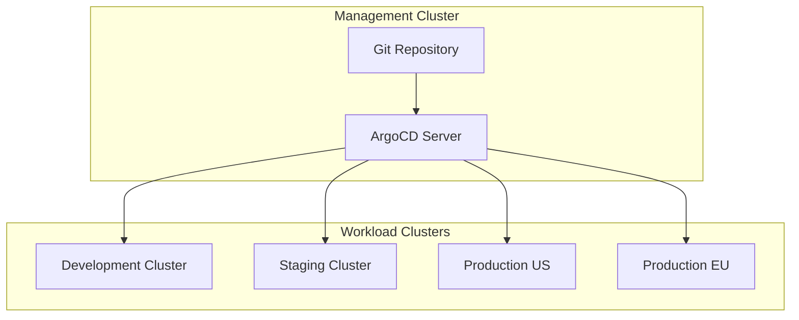
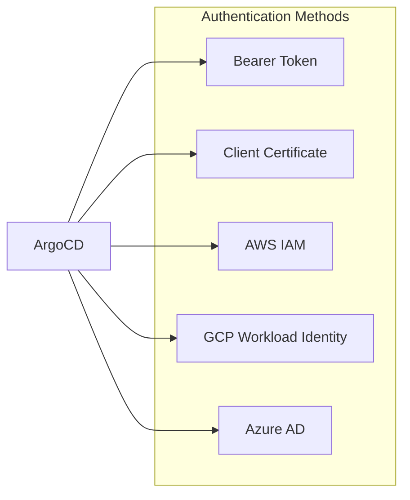
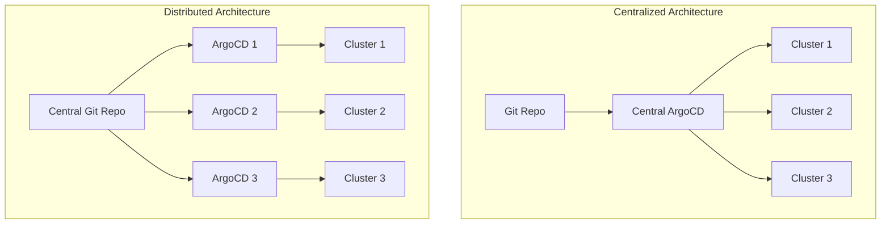
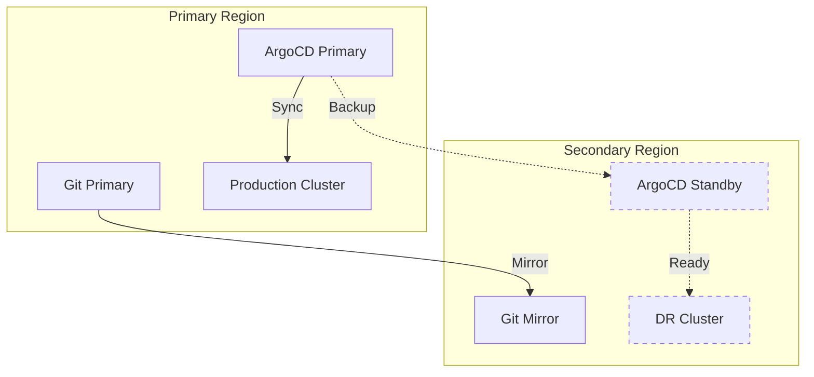

# How to Handle ArgoCD Multi-Cluster

Author: [nawazdhandala](https://www.github.com/nawazdhandala)

Tags: Kubernetes, ArgoCD, GitOps, Multi-Cluster, DevOps, CI/CD, Infrastructure

Description: A comprehensive guide to managing multiple Kubernetes clusters with ArgoCD, covering cluster registration, ApplicationSets, centralized vs distributed architectures, security best practices, and disaster recovery strategies.

---

Managing multiple Kubernetes clusters with ArgoCD enables consistent deployments across development, staging, and production environments. Whether you run clusters across different cloud providers or regions, ArgoCD provides a unified control plane for GitOps-based deployments.

## Multi-Cluster Architecture Overview



ArgoCD supports two main deployment patterns for multi-cluster management:

1. **Centralized** - Single ArgoCD instance manages all clusters
2. **Distributed** - Each cluster has its own ArgoCD, coordinated via a central repository

## Prerequisites

Before setting up multi-cluster management, ensure you have:

- ArgoCD installed on your management cluster
- kubectl access to all target clusters
- Network connectivity between ArgoCD and target clusters
- Appropriate RBAC permissions on each cluster

The following command installs ArgoCD CLI if not already available.

```bash
# Install ArgoCD CLI on macOS
brew install argocd

# Install ArgoCD CLI on Linux
curl -sSL -o argocd-linux-amd64 https://github.com/argoproj/argo-cd/releases/latest/download/argocd-linux-amd64
sudo install -m 555 argocd-linux-amd64 /usr/local/bin/argocd
rm argocd-linux-amd64
```

## Registering Clusters

### Method 1: Using ArgoCD CLI

The simplest way to add a cluster uses the ArgoCD CLI with an existing kubeconfig context. ArgoCD creates a service account with cluster-admin privileges on the target cluster.

```bash
# List available contexts in your kubeconfig
kubectl config get-contexts

# Add a cluster using its kubeconfig context name
argocd cluster add production-us-west --name prod-us-west

# Add a cluster with specific namespace restrictions
argocd cluster add staging-context \
  --name staging \
  --namespace staging-apps \
  --namespace monitoring
```

### Method 2: Declarative Cluster Registration

For GitOps-native cluster management, define clusters as Kubernetes secrets. ArgoCD automatically discovers clusters from secrets labeled with `argocd.argoproj.io/secret-type: cluster`.

```yaml
# cluster-secret.yaml
# Define a cluster using bearer token authentication
apiVersion: v1
kind: Secret
metadata:
  name: prod-us-west-cluster
  namespace: argocd
  labels:
    argocd.argoproj.io/secret-type: cluster
    # Custom labels for filtering with ApplicationSets
    environment: production
    region: us-west
type: Opaque
stringData:
  name: prod-us-west
  server: https://prod-us-west.example.com:6443
  config: |
    {
      "bearerToken": "eyJhbGciOiJSUzI1NiIsImtpZCI...",
      "tlsClientConfig": {
        "insecure": false,
        "caData": "LS0tLS1CRUdJTiBDRVJUSUZJQ0FURS0tLS0t..."
      }
    }
```

### Method 3: Using Service Account Tokens

For production environments, create dedicated service accounts with limited permissions instead of using cluster-admin.

The following manifest creates a service account on the target cluster with appropriate permissions.

```yaml
# target-cluster-rbac.yaml
# Create a dedicated namespace for ArgoCD resources
apiVersion: v1
kind: Namespace
metadata:
  name: argocd-manager
---
# Service account for ArgoCD to use
apiVersion: v1
kind: ServiceAccount
metadata:
  name: argocd-manager
  namespace: argocd-manager
---
# ClusterRole with minimum required permissions
apiVersion: rbac.authorization.k8s.io/v1
kind: ClusterRole
metadata:
  name: argocd-manager-role
rules:
  - apiGroups: ["*"]
    resources: ["*"]
    verbs: ["get", "list", "watch"]
  - apiGroups: [""]
    resources: ["events"]
    verbs: ["create", "patch"]
  - apiGroups: ["", "apps", "batch", "networking.k8s.io"]
    resources: ["*"]
    verbs: ["*"]
---
# Bind the role to the service account
apiVersion: rbac.authorization.k8s.io/v1
kind: ClusterRoleBinding
metadata:
  name: argocd-manager-role-binding
roleRef:
  apiGroup: rbac.authorization.k8s.io
  kind: ClusterRole
  name: argocd-manager-role
subjects:
  - kind: ServiceAccount
    name: argocd-manager
    namespace: argocd-manager
```

After applying the RBAC configuration, extract the service account token.

```bash
# Apply RBAC on target cluster
kubectl apply -f target-cluster-rbac.yaml --context target-cluster

# Create a long-lived token for the service account (Kubernetes 1.24+)
kubectl create token argocd-manager \
  --namespace argocd-manager \
  --duration=8760h \
  --context target-cluster
```

## Cluster Authentication Options

ArgoCD supports multiple authentication methods for connecting to clusters.



### AWS EKS Authentication

For EKS clusters, use IAM roles for authentication. ArgoCD supports the AWS IAM Authenticator.

```yaml
# eks-cluster-secret.yaml
apiVersion: v1
kind: Secret
metadata:
  name: eks-production
  namespace: argocd
  labels:
    argocd.argoproj.io/secret-type: cluster
stringData:
  name: eks-production
  server: https://ABCDEF1234567890.gr7.us-west-2.eks.amazonaws.com
  config: |
    {
      "awsAuthConfig": {
        "clusterName": "production-cluster",
        "roleARN": "arn:aws:iam::123456789012:role/ArgoCD-EKS-Access"
      },
      "tlsClientConfig": {
        "insecure": false,
        "caData": "LS0tLS1CRUdJTiBDRVJUSUZJQ0FURS0tLS0t..."
      }
    }
```

### GKE Authentication with Workload Identity

For GKE clusters, configure Workload Identity to allow ArgoCD to authenticate.

```yaml
# gke-cluster-secret.yaml
apiVersion: v1
kind: Secret
metadata:
  name: gke-production
  namespace: argocd
  labels:
    argocd.argoproj.io/secret-type: cluster
stringData:
  name: gke-production
  server: https://34.123.45.67
  config: |
    {
      "execProviderConfig": {
        "command": "argocd-k8s-auth",
        "args": ["gcp"],
        "apiVersion": "client.authentication.k8s.io/v1beta1"
      },
      "tlsClientConfig": {
        "insecure": false,
        "caData": "LS0tLS1CRUdJTiBDRVJUSUZJQ0FURS0tLS0t..."
      }
    }
```

## ApplicationSets for Multi-Cluster Deployments

ApplicationSets automate the creation of ArgoCD Applications across multiple clusters.

### Cluster Generator

The cluster generator creates Applications for each registered cluster that matches the selector.

```yaml
# appset-monitoring.yaml
# Deploy monitoring stack to all production clusters
apiVersion: argoproj.io/v1alpha1
kind: ApplicationSet
metadata:
  name: monitoring-stack
  namespace: argocd
spec:
  generators:
    - clusters:
        # Select clusters by label
        selector:
          matchLabels:
            environment: production
  template:
    metadata:
      # Use cluster name in application name
      name: 'monitoring-{{name}}'
      labels:
        app-type: monitoring
    spec:
      project: infrastructure
      source:
        repoURL: https://github.com/myorg/platform-configs.git
        targetRevision: main
        path: monitoring/base
      destination:
        # Dynamic server URL from cluster secret
        server: '{{server}}'
        namespace: monitoring
      syncPolicy:
        automated:
          prune: true
          selfHeal: true
        syncOptions:
          - CreateNamespace=true
```

### Matrix Generator

Combine multiple generators to create Applications for different environments and services.

```yaml
# appset-matrix.yaml
# Deploy multiple services across multiple clusters
apiVersion: argoproj.io/v1alpha1
kind: ApplicationSet
metadata:
  name: microservices
  namespace: argocd
spec:
  generators:
    - matrix:
        generators:
          # First generator: clusters
          - clusters:
              selector:
                matchLabels:
                  environment: production
          # Second generator: list of services
          - list:
              elements:
                - service: api-gateway
                  namespace: gateway
                - service: user-service
                  namespace: users
                - service: order-service
                  namespace: orders
  template:
    metadata:
      name: '{{service}}-{{name}}'
    spec:
      project: applications
      source:
        repoURL: https://github.com/myorg/services.git
        targetRevision: main
        path: 'services/{{service}}/overlays/production'
      destination:
        server: '{{server}}'
        namespace: '{{namespace}}'
      syncPolicy:
        automated:
          prune: true
          selfHeal: true
```

### Pull Request Generator for Multi-Cluster Preview

Create preview environments across clusters for pull requests.

```yaml
# appset-preview.yaml
apiVersion: argoproj.io/v1alpha1
kind: ApplicationSet
metadata:
  name: preview-environments
  namespace: argocd
spec:
  generators:
    - pullRequest:
        github:
          owner: myorg
          repo: myapp
          tokenRef:
            secretName: github-token
            key: token
        requeueAfterSeconds: 60
  template:
    metadata:
      name: 'preview-{{branch_slug}}-{{number}}'
    spec:
      project: previews
      source:
        repoURL: https://github.com/myorg/myapp.git
        targetRevision: '{{head_sha}}'
        path: k8s/overlays/preview
      destination:
        # Deploy previews to dedicated preview cluster
        server: https://preview-cluster.example.com
        namespace: 'preview-{{number}}'
      syncPolicy:
        automated:
          prune: true
          selfHeal: true
        syncOptions:
          - CreateNamespace=true
```

## Centralized vs Distributed Architecture



### Centralized Architecture

A single ArgoCD instance manages all clusters, suitable for smaller deployments.

```yaml
# centralized-argocd-values.yaml
# Helm values for centralized ArgoCD deployment
controller:
  replicas: 2
  resources:
    requests:
      cpu: 500m
      memory: 512Mi
    limits:
      cpu: 2000m
      memory: 2Gi

server:
  replicas: 2
  resources:
    requests:
      cpu: 100m
      memory: 128Mi

repoServer:
  replicas: 2
  resources:
    requests:
      cpu: 200m
      memory: 256Mi
    limits:
      cpu: 1000m
      memory: 1Gi

redis-ha:
  enabled: true

configs:
  params:
    # Increase parallelism for multi-cluster
    controller.status.processors: 50
    controller.operation.processors: 25
    controller.repo.server.timeout.seconds: 180
```

### Distributed Architecture with Central Configuration

Each cluster runs its own ArgoCD, but all instances share the same Git repository.

```yaml
# distributed-argocd-app.yaml
# ArgoCD Application to deploy ArgoCD itself to each cluster
apiVersion: argoproj.io/v1alpha1
kind: ApplicationSet
metadata:
  name: argocd-instances
  namespace: argocd
spec:
  generators:
    - clusters:
        selector:
          matchLabels:
            argocd-managed: "true"
  template:
    metadata:
      name: 'argocd-{{name}}'
    spec:
      project: platform
      source:
        repoURL: https://github.com/myorg/platform.git
        targetRevision: main
        path: argocd
        helm:
          valueFiles:
            - values.yaml
            - 'values-{{metadata.labels.environment}}.yaml'
      destination:
        server: '{{server}}'
        namespace: argocd
      syncPolicy:
        automated:
          prune: true
          selfHeal: true
```

## Network Connectivity and Security

### Private Clusters with VPN

For private clusters accessible only via VPN, configure ArgoCD to route through the VPN.

```yaml
# argocd-repo-server-deployment-patch.yaml
# Add VPN sidecar to repo-server for private cluster access
apiVersion: apps/v1
kind: Deployment
metadata:
  name: argocd-repo-server
  namespace: argocd
spec:
  template:
    spec:
      containers:
        - name: vpn-sidecar
          image: your-vpn-client:latest
          securityContext:
            capabilities:
              add: ["NET_ADMIN"]
          volumeMounts:
            - name: vpn-config
              mountPath: /etc/vpn
      volumes:
        - name: vpn-config
          secret:
            secretName: vpn-credentials
```

### Network Policies for ArgoCD

Restrict network access to only necessary endpoints.

```yaml
# argocd-network-policy.yaml
apiVersion: networking.k8s.io/v1
kind: NetworkPolicy
metadata:
  name: argocd-server
  namespace: argocd
spec:
  podSelector:
    matchLabels:
      app.kubernetes.io/name: argocd-server
  policyTypes:
    - Ingress
    - Egress
  ingress:
    - from:
        - namespaceSelector:
            matchLabels:
              name: ingress-nginx
      ports:
        - port: 8080
  egress:
    # Allow DNS
    - to: []
      ports:
        - port: 53
          protocol: UDP
    # Allow HTTPS to Git repos
    - to: []
      ports:
        - port: 443
    # Allow access to managed clusters
    - to:
        - ipBlock:
            cidr: 10.0.0.0/8
      ports:
        - port: 6443
```

## Project-Based Access Control

Define projects to control which clusters and namespaces applications can target.

```yaml
# appproject-team.yaml
# Project restricting team to specific clusters
apiVersion: argoproj.io/v1alpha1
kind: AppProject
metadata:
  name: team-payments
  namespace: argocd
spec:
  description: Payment team applications

  # Allowed source repositories
  sourceRepos:
    - 'https://github.com/myorg/payment-*'
    - 'https://github.com/myorg/shared-libs.git'

  # Allowed destination clusters and namespaces
  destinations:
    # Development cluster - full access
    - server: https://dev.example.com
      namespace: 'payments-*'
    # Production clusters - specific namespaces only
    - server: https://prod-us.example.com
      namespace: payments
    - server: https://prod-eu.example.com
      namespace: payments

  # Cluster resources the project can create
  clusterResourceWhitelist:
    - group: ''
      kind: Namespace

  # Namespace resources allowed
  namespaceResourceWhitelist:
    - group: '*'
      kind: '*'

  # Deny specific resources
  namespaceResourceBlacklist:
    - group: ''
      kind: ResourceQuota
    - group: ''
      kind: LimitRange

  # RBAC roles within the project
  roles:
    - name: developer
      description: Developer access
      policies:
        - p, proj:team-payments:developer, applications, get, team-payments/*, allow
        - p, proj:team-payments:developer, applications, sync, team-payments/*, allow
        - p, proj:team-payments:developer, logs, get, team-payments/*, allow
      groups:
        - payments-developers

    - name: admin
      description: Admin access
      policies:
        - p, proj:team-payments:admin, applications, *, team-payments/*, allow
        - p, proj:team-payments:admin, repositories, *, team-payments/*, allow
      groups:
        - payments-admins
```

## Sync Strategies for Multi-Cluster

### Sequential Rollout

Use sync waves to control deployment order across environments.

```yaml
# appset-sequential-rollout.yaml
apiVersion: argoproj.io/v1alpha1
kind: ApplicationSet
metadata:
  name: sequential-deploy
  namespace: argocd
spec:
  generators:
    - list:
        elements:
          - cluster: dev
            server: https://dev.example.com
            wave: "1"
          - cluster: staging
            server: https://staging.example.com
            wave: "2"
          - cluster: prod-us
            server: https://prod-us.example.com
            wave: "3"
          - cluster: prod-eu
            server: https://prod-eu.example.com
            wave: "4"
  template:
    metadata:
      name: 'myapp-{{cluster}}'
      annotations:
        argocd.argoproj.io/sync-wave: '{{wave}}'
    spec:
      project: default
      source:
        repoURL: https://github.com/myorg/myapp.git
        targetRevision: main
        path: 'overlays/{{cluster}}'
      destination:
        server: '{{server}}'
        namespace: myapp
      syncPolicy:
        automated:
          prune: true
          selfHeal: true
```

### Progressive Delivery with Rollouts

Integrate Argo Rollouts for canary deployments across clusters.

```yaml
# rollout-multi-cluster.yaml
apiVersion: argoproj.io/v1alpha1
kind: Rollout
metadata:
  name: myapp
spec:
  replicas: 10
  selector:
    matchLabels:
      app: myapp
  template:
    metadata:
      labels:
        app: myapp
    spec:
      containers:
        - name: myapp
          image: myapp:latest
  strategy:
    canary:
      steps:
        - setWeight: 10
        - pause: {duration: 5m}
        - setWeight: 30
        - pause: {duration: 5m}
        - setWeight: 50
        - pause: {duration: 5m}
      trafficRouting:
        istio:
          virtualService:
            name: myapp-vsvc
            routes:
              - primary
```

## Disaster Recovery

### Backup ArgoCD Configuration

Create regular backups of ArgoCD resources for disaster recovery.

```bash
#!/bin/bash
# backup-argocd.sh
# Backup ArgoCD configuration to a file

BACKUP_DIR="/backups/argocd/$(date +%Y%m%d)"
mkdir -p "$BACKUP_DIR"

# Backup all ArgoCD applications
kubectl get applications -n argocd -o yaml > "$BACKUP_DIR/applications.yaml"

# Backup ApplicationSets
kubectl get applicationsets -n argocd -o yaml > "$BACKUP_DIR/applicationsets.yaml"

# Backup AppProjects
kubectl get appprojects -n argocd -o yaml > "$BACKUP_DIR/appprojects.yaml"

# Backup cluster secrets (careful with sensitive data)
kubectl get secrets -n argocd -l argocd.argoproj.io/secret-type=cluster \
  -o yaml > "$BACKUP_DIR/clusters.yaml"

# Backup repository credentials
kubectl get secrets -n argocd -l argocd.argoproj.io/secret-type=repository \
  -o yaml > "$BACKUP_DIR/repositories.yaml"

echo "Backup completed to $BACKUP_DIR"
```

### Multi-Region Failover

Configure ArgoCD for multi-region failover scenarios.



```yaml
# dr-argocd-config.yaml
# ArgoCD configuration for disaster recovery standby
apiVersion: v1
kind: ConfigMap
metadata:
  name: argocd-cm
  namespace: argocd
data:
  # Use Git mirror in DR region
  repositories: |
    - url: https://git-mirror.dr-region.example.com/myorg/configs.git
      name: configs-dr
      type: git

  # Webhook configuration for failover notifications
  webhook.github.secret: $webhook-secret

  # Resource tracking method
  application.resourceTrackingMethod: annotation
```

## Monitoring and Observability

### Prometheus Metrics for Multi-Cluster

Configure Prometheus to collect metrics from ArgoCD managing multiple clusters.

```yaml
# argocd-servicemonitor.yaml
apiVersion: monitoring.coreos.com/v1
kind: ServiceMonitor
metadata:
  name: argocd-metrics
  namespace: argocd
spec:
  selector:
    matchLabels:
      app.kubernetes.io/name: argocd-server
  endpoints:
    - port: metrics
      interval: 30s
      path: /metrics
---
apiVersion: monitoring.coreos.com/v1
kind: ServiceMonitor
metadata:
  name: argocd-controller-metrics
  namespace: argocd
spec:
  selector:
    matchLabels:
      app.kubernetes.io/name: argocd-application-controller
  endpoints:
    - port: metrics
      interval: 30s
```

### Alerting Rules

Set up alerts for multi-cluster deployment issues.

```yaml
# argocd-alerts.yaml
apiVersion: monitoring.coreos.com/v1
kind: PrometheusRule
metadata:
  name: argocd-alerts
  namespace: argocd
spec:
  groups:
    - name: argocd.rules
      rules:
        - alert: ArgocdAppOutOfSync
          expr: |
            argocd_app_info{sync_status="OutOfSync"} == 1
          for: 15m
          labels:
            severity: warning
          annotations:
            summary: "ArgoCD app {{ $labels.name }} is out of sync"
            description: "Application {{ $labels.name }} in project {{ $labels.project }} has been out of sync for more than 15 minutes"

        - alert: ArgocdAppSyncFailed
          expr: |
            argocd_app_info{health_status="Degraded"} == 1
          for: 5m
          labels:
            severity: critical
          annotations:
            summary: "ArgoCD app {{ $labels.name }} sync failed"
            description: "Application {{ $labels.name }} is in degraded state"

        - alert: ArgocdClusterConnectionFailed
          expr: |
            argocd_cluster_info{connection_state!="Successful"} == 1
          for: 5m
          labels:
            severity: critical
          annotations:
            summary: "ArgoCD cannot connect to cluster {{ $labels.name }}"
            description: "Connection to cluster {{ $labels.server }} has failed"
```

## Troubleshooting Multi-Cluster Issues

### Cluster Connection Problems

Diagnose and resolve cluster connectivity issues.

```bash
# Check cluster connection status
argocd cluster list

# Get detailed cluster info
argocd cluster get prod-us-west

# Test cluster connectivity manually
argocd admin cluster kubeconfig prod-us-west | kubectl --kubeconfig=/dev/stdin get nodes

# Check ArgoCD controller logs for connection errors
kubectl logs -n argocd -l app.kubernetes.io/name=argocd-application-controller \
  --tail=100 | grep -i "cluster"
```

### Application Sync Failures

Debug sync failures in multi-cluster deployments.

```bash
# Get sync status for all apps in a cluster
argocd app list --dest-server https://prod-us-west.example.com

# Check sync details for specific app
argocd app get myapp-prod-us-west --show-operation

# View application events
kubectl get events -n argocd --field-selector involvedObject.name=myapp-prod-us-west

# Force a hard refresh to clear cache
argocd app get myapp-prod-us-west --hard-refresh

# Dry-run sync to see what would change
argocd app sync myapp-prod-us-west --dry-run
```

### Resource Quota and Limit Issues

Handle resource constraints across clusters.

```yaml
# resource-ignore-differences.yaml
# Ignore differences in resource fields managed by cluster
apiVersion: argoproj.io/v1alpha1
kind: Application
metadata:
  name: myapp
spec:
  ignoreDifferences:
    - group: apps
      kind: Deployment
      jsonPointers:
        - /spec/replicas
    - group: autoscaling
      kind: HorizontalPodAutoscaler
      jqPathExpressions:
        - .spec.minReplicas
        - .spec.maxReplicas
    - kind: PersistentVolumeClaim
      jsonPointers:
        - /spec/volumeName
        - /spec/storageClassName
```

## Best Practices Summary

1. **Use declarative cluster registration** - Store cluster secrets in Git for reproducibility
2. **Implement least-privilege access** - Create dedicated service accounts with minimal permissions
3. **Leverage ApplicationSets** - Automate application deployment across clusters
4. **Configure proper resource limits** - Scale ArgoCD components based on cluster count
5. **Set up comprehensive monitoring** - Track sync status and cluster connectivity
6. **Plan for disaster recovery** - Regular backups and tested failover procedures
7. **Use projects for access control** - Restrict team access to specific clusters and namespaces

---

Multi-cluster management with ArgoCD transforms how you deploy applications across your infrastructure. Start with a centralized architecture for simplicity, then evolve to distributed patterns as your needs grow. Consistent GitOps practices across all clusters ensure reliability, auditability, and faster deployments.
