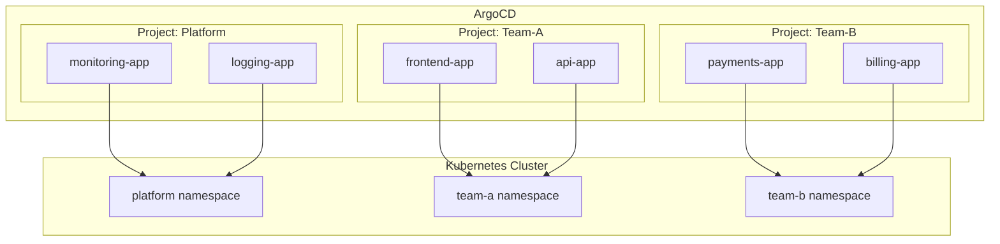
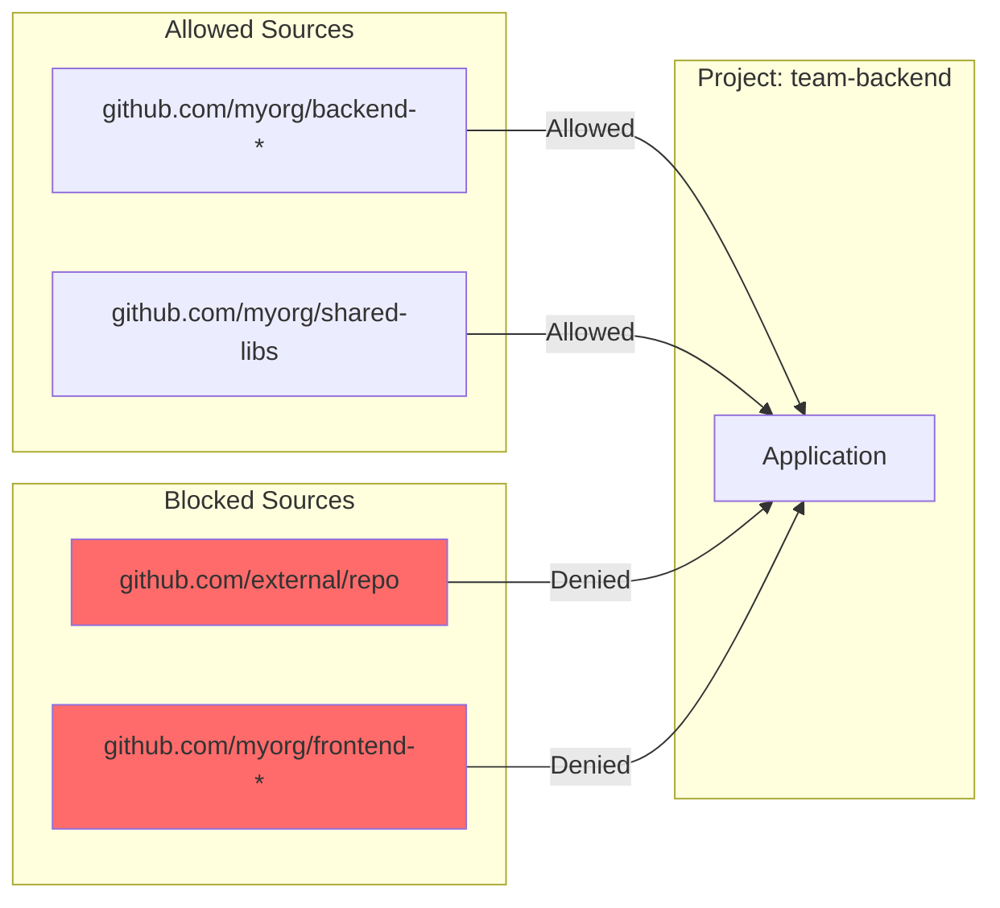
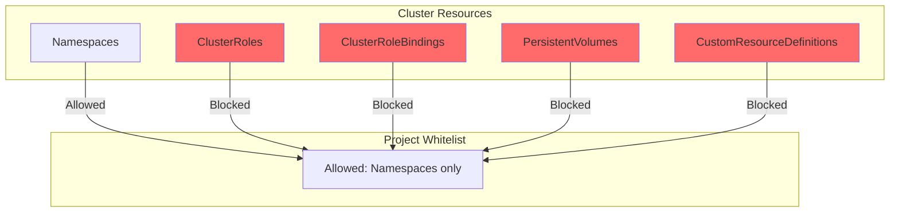
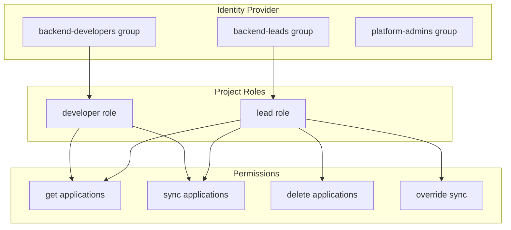
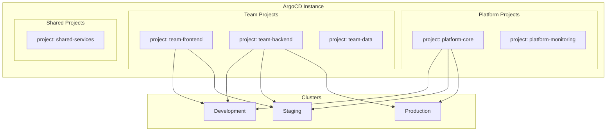

# How to Use ArgoCD Projects

Author: [nawazdhandala](https://www.github.com/nawazdhandala)

Tags: ArgoCD, Kubernetes, GitOps, DevOps, Security, Multi-tenancy, RBAC

Description: A comprehensive guide to ArgoCD Projects covering multi-tenant isolation, RBAC configuration, source and destination restrictions, role-based access control, and production best practices for secure GitOps workflows.

---

ArgoCD Projects provide logical boundaries for applications, enabling multi-team environments with proper access control and resource isolation. Projects define what repositories can be deployed, where applications can land, and who can manage them.

## Understanding ArgoCD Projects



Projects solve several critical problems:
- **Multi-tenancy** - Isolate teams and their applications
- **Security** - Restrict what resources can be deployed
- **Compliance** - Control source repositories and target clusters
- **Access Control** - Define who can view, sync, or delete applications

## The Default Project

Every ArgoCD installation includes a `default` project. Applications without an explicit project assignment belong here.

The following command retrieves the default project configuration to understand its baseline settings:

```bash
argocd proj get default
```

Output shows the project specification:

```
Name:                        default
Description:
Destinations:                *,*
Repositories:                *
Allowed Cluster Resources:   */*
Allowed Namespace Resources: */*
Denied Namespace Resources:  <none>
Signature keys:              <none>
Orphaned Resources:          disabled
```

The default project permits everything, making it unsuitable for production multi-tenant environments.

## Creating Your First Project

Projects can be created via CLI or declarative YAML. The declarative approach integrates better with GitOps workflows.

### CLI Method

The following command creates a basic project with defined source and destination constraints:

```bash
argocd proj create team-backend \
  --description "Backend team applications" \
  --src "https://github.com/myorg/backend-*" \
  --dest "https://kubernetes.default.svc,backend-*"
```

### Declarative YAML Method

A complete project specification provides fine-grained control over all aspects of the project:

```yaml
# argocd-projects/team-backend.yaml
apiVersion: argoproj.io/v1alpha1
kind: AppProject
metadata:
  name: team-backend
  namespace: argocd
  # Finalizer ensures dependent applications are deleted first
  finalizers:
    - resources-finalizer.argocd.argoproj.io
spec:
  description: Backend services maintained by the backend team

  # Repositories that applications in this project can pull from
  sourceRepos:
    - 'https://github.com/myorg/backend-services.git'
    - 'https://github.com/myorg/backend-configs.git'

  # Clusters and namespaces where applications can be deployed
  destinations:
    - namespace: 'backend-*'
      server: https://kubernetes.default.svc
    - namespace: 'shared-services'
      server: https://kubernetes.default.svc
```

Apply the project configuration:

```bash
kubectl apply -f argocd-projects/team-backend.yaml
```

## Source Repository Restrictions

Projects control which Git repositories applications can use. Wildcards provide flexibility while maintaining security boundaries.



### Pattern Examples

The sourceRepos field accepts various patterns for different use cases:

```yaml
spec:
  sourceRepos:
    # Exact repository match
    - 'https://github.com/myorg/myapp.git'

    # Wildcard for all repos in an organization
    - 'https://github.com/myorg/*'

    # Specific path wildcard
    - 'https://github.com/myorg/backend-*'

    # Allow any repository (not recommended for production)
    - '*'

    # Helm chart repositories
    - 'https://charts.helm.sh/stable'
    - 'https://argoproj.github.io/argo-helm'
```

## Destination Restrictions

Destinations define where applications can deploy resources. Proper configuration prevents accidental or malicious deployments to unauthorized namespaces.

### Basic Destination Configuration

The destinations field specifies allowed cluster and namespace combinations:

```yaml
spec:
  destinations:
    # Single namespace on local cluster
    - namespace: production
      server: https://kubernetes.default.svc

    # Wildcard namespace pattern
    - namespace: 'backend-*'
      server: https://kubernetes.default.svc

    # All namespaces on a specific cluster
    - namespace: '*'
      server: https://staging.example.com

    # Specific namespace on remote cluster
    - namespace: critical-services
      server: https://production.example.com
```

### Using Cluster Names Instead of URLs

Cluster names provide more readable configurations:

```yaml
spec:
  destinations:
    - namespace: production
      name: production-cluster
    - namespace: staging
      name: staging-cluster
```

## Cluster Resource Restrictions

Projects can restrict which cluster-scoped resources applications can create. Preventing teams from creating cluster-wide resources maintains security.



### Whitelist Approach

Only allow specific cluster resources with the whitelist:

```yaml
spec:
  # Allow only Namespace creation at cluster scope
  clusterResourceWhitelist:
    - group: ''
      kind: Namespace
```

### Blacklist Approach

Block specific dangerous resources while allowing others:

```yaml
spec:
  # Block sensitive cluster resources
  clusterResourceBlacklist:
    - group: ''
      kind: ResourceQuota
    - group: rbac.authorization.k8s.io
      kind: ClusterRole
    - group: rbac.authorization.k8s.io
      kind: ClusterRoleBinding
```

## Namespace Resource Restrictions

Fine-grained control over namespace-scoped resources prevents teams from deploying unauthorized workloads.

### Restricting Namespace Resources

The following configuration limits deployable resource types:

```yaml
spec:
  # Only allow specific namespace resources
  namespaceResourceWhitelist:
    - group: ''
      kind: ConfigMap
    - group: ''
      kind: Secret
    - group: ''
      kind: Service
    - group: apps
      kind: Deployment
    - group: apps
      kind: StatefulSet
    - group: networking.k8s.io
      kind: Ingress
```

### Blocking Specific Resources

Block problematic resources while allowing everything else:

```yaml
spec:
  # Block privileged resources
  namespaceResourceBlacklist:
    - group: ''
      kind: LimitRange
    - group: ''
      kind: ResourceQuota
    - group: policy
      kind: PodSecurityPolicy
```

## Project Roles and RBAC

Projects support custom roles with fine-grained permissions. Roles integrate with external identity providers through groups.



### Defining Project Roles

Roles specify permissions using Casbin-style policies:

```yaml
spec:
  roles:
    # Read-only access for developers
    - name: developer
      description: Developer read and sync access
      policies:
        - p, proj:team-backend:developer, applications, get, team-backend/*, allow
        - p, proj:team-backend:developer, applications, sync, team-backend/*, allow
        - p, proj:team-backend:developer, logs, get, team-backend/*, allow
      groups:
        - backend-developers

    # Full access for team leads
    - name: lead
      description: Team lead full access
      policies:
        - p, proj:team-backend:lead, applications, *, team-backend/*, allow
        - p, proj:team-backend:lead, repositories, *, team-backend/*, allow
        - p, proj:team-backend:lead, logs, get, team-backend/*, allow
      groups:
        - backend-leads

    # CI/CD service account
    - name: ci
      description: CI pipeline access
      policies:
        - p, proj:team-backend:ci, applications, sync, team-backend/*, allow
        - p, proj:team-backend:ci, applications, get, team-backend/*, allow
```

### Policy Syntax

Policies follow a specific format that defines access rules:

```
p, <role>, <resource>, <action>, <object>, <allow/deny>
```

Available resources and actions:

| Resource | Actions |
|----------|---------|
| applications | get, create, update, delete, sync, override, action |
| repositories | get, create, update, delete |
| clusters | get, create, update, delete |
| logs | get |
| exec | create |

### Generating JWT Tokens for Roles

Service accounts can authenticate using JWT tokens generated for specific roles:

```bash
# Generate a token for the CI role valid for 24 hours
argocd proj role create-token team-backend ci --expires-in 24h
```

Use the token in CI pipelines:

```bash
# Set the token for CLI authentication
export ARGOCD_AUTH_TOKEN="<generated-token>"

# Sync an application
argocd app sync backend-api
```

## Orphaned Resource Monitoring

Projects can detect resources in target namespaces that ArgoCD did not create, helping identify configuration drift or manual changes.

```yaml
spec:
  orphanedResources:
    warn: true
    ignore:
      # Ignore specific resource types
      - group: ''
        kind: ConfigMap
        name: kube-root-ca.crt
      - group: ''
        kind: ServiceAccount
        name: default
```

Orphaned resources appear as warnings in the ArgoCD UI and can trigger alerts.

## Signature Verification

Projects can require GPG signature verification for Git commits, ensuring only authorized changes are deployed.

### Configuring Signature Keys

Add trusted GPG keys to the project:

```yaml
spec:
  signatureKeys:
    - keyID: 4AEE18F83AFDEB23
    - keyID: B8F8D9832F4AD5E7
```

### Setting Up GPG Keys in ArgoCD

Add the public keys to ArgoCD's GPG keyring:

```bash
# Export public key
gpg --armor --export 4AEE18F83AFDEB23 > pubkey.asc

# Add to ArgoCD
argocd gpg add --from pubkey.asc
```

## Complete Project Example

A production-ready project configuration combining all security features:

```yaml
apiVersion: argoproj.io/v1alpha1
kind: AppProject
metadata:
  name: team-backend
  namespace: argocd
  finalizers:
    - resources-finalizer.argocd.argoproj.io
spec:
  description: Backend services for the payments platform

  # Source repository restrictions
  sourceRepos:
    - 'https://github.com/myorg/backend-services.git'
    - 'https://github.com/myorg/backend-configs.git'
    - 'https://github.com/myorg/shared-charts.git'

  # Deployment destinations
  destinations:
    - namespace: 'backend-*'
      server: https://kubernetes.default.svc
    - namespace: 'backend-*'
      name: production-cluster

  # Cluster resource whitelist
  clusterResourceWhitelist:
    - group: ''
      kind: Namespace

  # Namespace resource whitelist
  namespaceResourceWhitelist:
    - group: ''
      kind: ConfigMap
    - group: ''
      kind: Secret
    - group: ''
      kind: Service
    - group: ''
      kind: ServiceAccount
    - group: apps
      kind: Deployment
    - group: apps
      kind: StatefulSet
    - group: apps
      kind: ReplicaSet
    - group: batch
      kind: Job
    - group: batch
      kind: CronJob
    - group: networking.k8s.io
      kind: Ingress
    - group: networking.k8s.io
      kind: NetworkPolicy
    - group: autoscaling
      kind: HorizontalPodAutoscaler
    - group: policy
      kind: PodDisruptionBudget

  # Orphaned resource monitoring
  orphanedResources:
    warn: true
    ignore:
      - group: ''
        kind: ConfigMap
        name: kube-root-ca.crt

  # Role definitions
  roles:
    - name: developer
      description: Developer access - view and sync
      policies:
        - p, proj:team-backend:developer, applications, get, team-backend/*, allow
        - p, proj:team-backend:developer, applications, sync, team-backend/*, allow
        - p, proj:team-backend:developer, logs, get, team-backend/*, allow
      groups:
        - backend-developers

    - name: lead
      description: Team lead access - full control
      policies:
        - p, proj:team-backend:lead, applications, *, team-backend/*, allow
        - p, proj:team-backend:lead, repositories, get, team-backend/*, allow
        - p, proj:team-backend:lead, logs, get, team-backend/*, allow
        - p, proj:team-backend:lead, exec, create, team-backend/*, allow
      groups:
        - backend-leads

    - name: ci-cd
      description: CI/CD pipeline access
      policies:
        - p, proj:team-backend:ci-cd, applications, get, team-backend/*, allow
        - p, proj:team-backend:ci-cd, applications, sync, team-backend/*, allow

  # Require signed commits
  signatureKeys:
    - keyID: 4AEE18F83AFDEB23
```

## Multi-Tenant Architecture

Designing projects for multiple teams requires careful planning of isolation boundaries.



### Project Naming Conventions

Consistent naming simplifies management and policy enforcement:

```yaml
# Platform team projects
- platform-core
- platform-monitoring
- platform-security

# Team projects
- team-frontend
- team-backend
- team-mobile
- team-data

# Environment-specific projects
- dev-sandbox
- staging-integration
- prod-critical
```

### GitOps Repository Structure

Organize project definitions in a dedicated repository:

```
argocd-config/
├── projects/
│   ├── platform/
│   │   ├── core.yaml
│   │   └── monitoring.yaml
│   ├── teams/
│   │   ├── frontend.yaml
│   │   ├── backend.yaml
│   │   └── data.yaml
│   └── shared/
│       └── services.yaml
├── applicationsets/
│   └── team-apps.yaml
└── rbac/
    └── policies.yaml
```

## Managing Projects with ApplicationSets

ApplicationSets can generate applications across projects dynamically:

```yaml
apiVersion: argoproj.io/v1alpha1
kind: ApplicationSet
metadata:
  name: team-services
  namespace: argocd
spec:
  generators:
    - git:
        repoURL: https://github.com/myorg/services-config.git
        revision: HEAD
        directories:
          - path: 'teams/*/services/*'
  template:
    metadata:
      name: '{{path[2]}}-{{path[4]}}'
    spec:
      # Project derived from directory structure
      project: 'team-{{path[2]}}'
      source:
        repoURL: https://github.com/myorg/services-config.git
        targetRevision: HEAD
        path: '{{path}}'
      destination:
        server: https://kubernetes.default.svc
        namespace: '{{path[2]}}-{{path[4]}}'
      syncPolicy:
        automated:
          prune: true
          selfHeal: true
```

## Project Scoped Repositories

Projects can have dedicated repository credentials isolated from other projects:

```yaml
apiVersion: v1
kind: Secret
metadata:
  name: team-backend-repo
  namespace: argocd
  labels:
    argocd.argoproj.io/secret-type: repo-creds
stringData:
  url: https://github.com/myorg/backend-services.git
  username: git
  password: <personal-access-token>
  project: team-backend
```

Repository credentials with a project label are only available to applications in that project.

## Best Practices

### 1. Start Restrictive

Begin with minimal permissions and expand as needed:

```yaml
spec:
  # Start with explicit source repos
  sourceRepos:
    - 'https://github.com/myorg/specific-repo.git'

  # Specific namespace destinations
  destinations:
    - namespace: myapp
      server: https://kubernetes.default.svc
```

### 2. Use Namespace Prefixes

Namespace prefixes simplify wildcard policies:

```yaml
spec:
  destinations:
    # All team namespaces start with team prefix
    - namespace: 'backend-*'
      server: https://kubernetes.default.svc
```

### 3. Separate Environments

Create distinct projects for different environments:

```yaml
# Development - permissive
apiVersion: argoproj.io/v1alpha1
kind: AppProject
metadata:
  name: team-backend-dev
spec:
  sourceRepos:
    - '*'
  destinations:
    - namespace: '*'
      name: development

---
# Production - restrictive
apiVersion: argoproj.io/v1alpha1
kind: AppProject
metadata:
  name: team-backend-prod
spec:
  sourceRepos:
    - 'https://github.com/myorg/backend-services.git'
  destinations:
    - namespace: 'backend-prod'
      name: production
```

### 4. Audit Project Changes

Track project modifications using Git history:

```bash
# View project change history
git log --oneline -- argocd-config/projects/

# Compare project versions
git diff HEAD~5 -- argocd-config/projects/team-backend.yaml
```

### 5. Test Project Policies

Validate project policies before deployment:

```bash
# Dry-run application creation to test project restrictions
argocd app create test-app \
  --project team-backend \
  --repo https://github.com/myorg/test.git \
  --path k8s \
  --dest-server https://kubernetes.default.svc \
  --dest-namespace backend-test \
  --dry-run
```

## Troubleshooting

### Application Fails Project Validation

Check if the application violates project constraints:

```bash
# View project details
argocd proj get team-backend

# Check application project assignment
argocd app get myapp -o yaml | grep project
```

### Permission Denied Errors

Verify role assignments and group memberships:

```bash
# List project roles
argocd proj role list team-backend

# Check user's groups
argocd account get-user-info
```

### Repository Access Issues

Confirm repository credentials and project scope:

```bash
# List repositories
argocd repo list

# Test repository access
argocd repo get https://github.com/myorg/backend-services.git
```

---

ArgoCD Projects transform a shared ArgoCD installation into a secure multi-tenant platform. Start with basic source and destination restrictions, then layer on RBAC and resource whitelists as your organization's needs grow. Proper project design ensures teams can work independently while maintaining security and compliance requirements.
