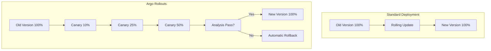
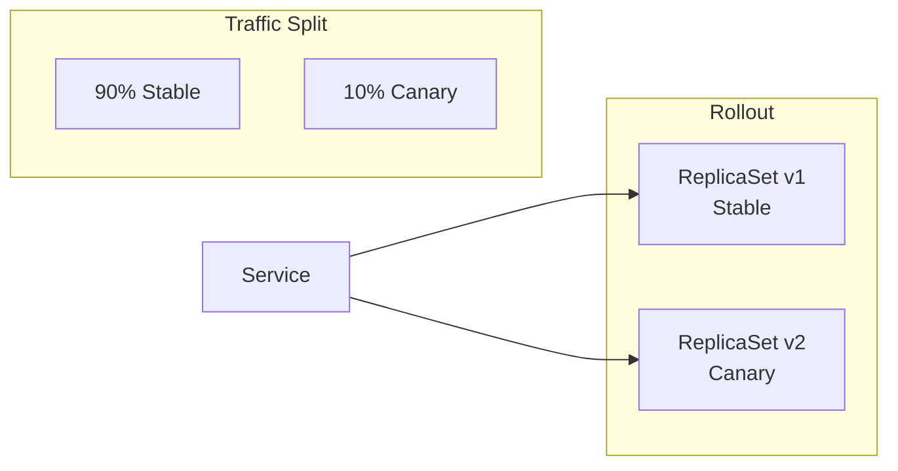
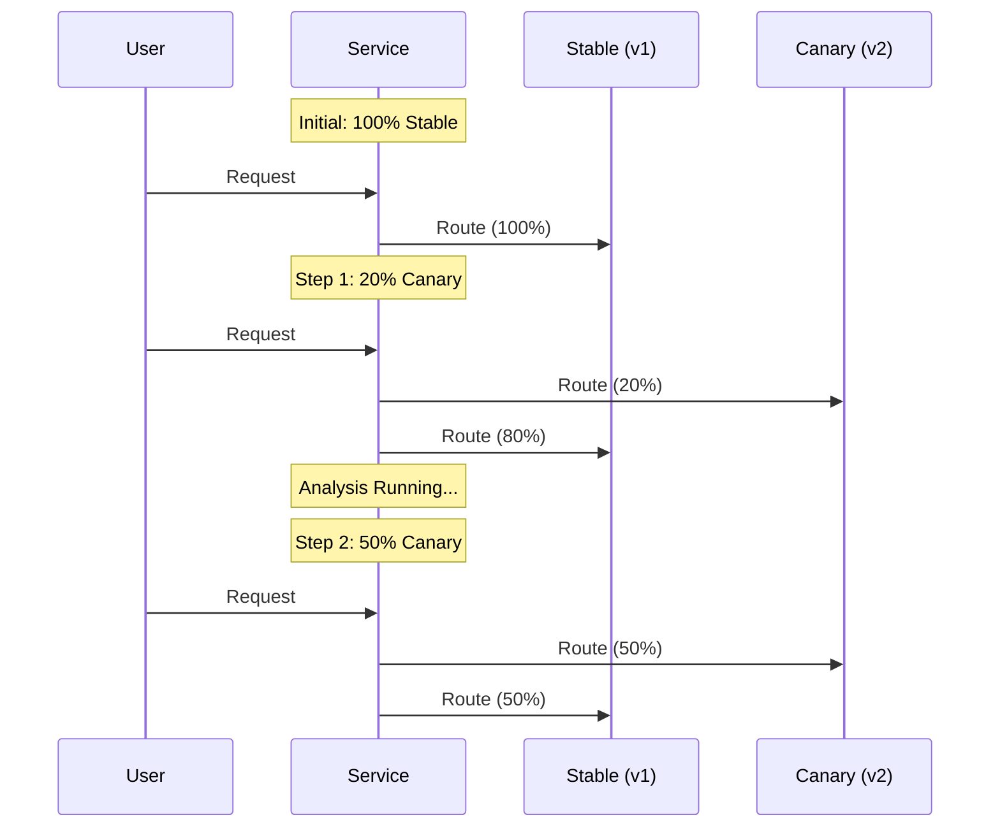
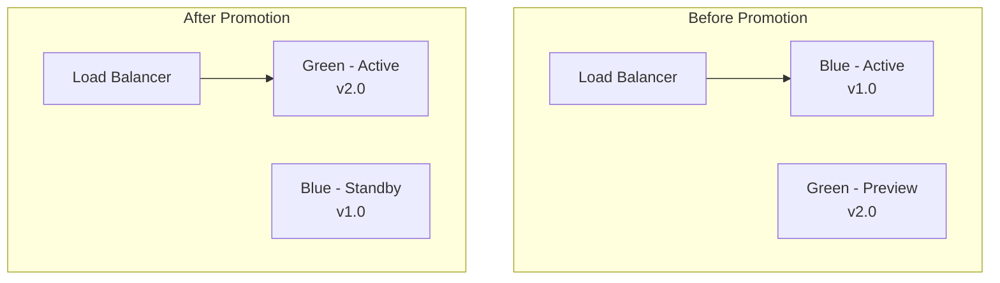
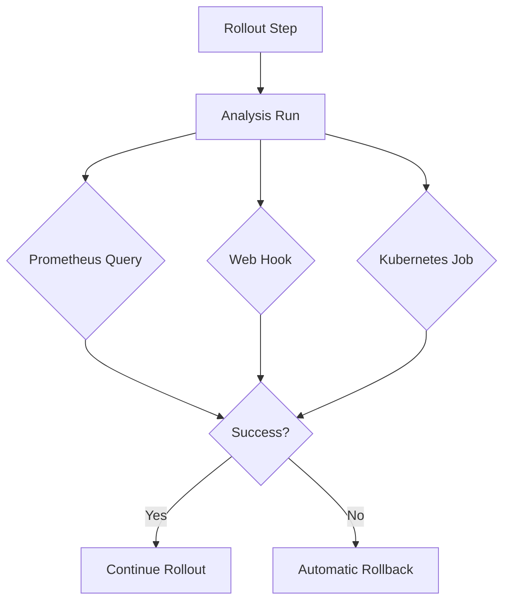

# How to Implement ArgoCD Rollouts

Author: [nawazdhandala](https://www.github.com/nawazdhandala)

Tags: Kubernetes, ArgoCD, Rollouts, Canary, Blue-Green, Progressive Delivery, DevOps

Description: A comprehensive guide to implementing Argo Rollouts for progressive delivery in Kubernetes, covering canary deployments, blue-green deployments, analysis runs, traffic management, and production best practices.

---

Progressive delivery reduces deployment risk by gradually shifting traffic to new versions. Argo Rollouts extends Kubernetes with advanced deployment strategies that standard Deployments cannot provide.

## What Are Argo Rollouts?

Argo Rollouts is a Kubernetes controller that provides advanced deployment capabilities including canary releases, blue-green deployments, and automated rollbacks based on metrics analysis.



Key benefits of Argo Rollouts:

1. **Gradual traffic shifting** - Control exactly how much traffic reaches new versions
2. **Automated analysis** - Validate deployments with metrics before full rollout
3. **Instant rollbacks** - Revert to stable versions in seconds
4. **Traffic management** - Integrate with service meshes and ingress controllers

## Installing Argo Rollouts

### Quick Installation with kubectl

The following commands create the argo-rollouts namespace and install all required components.

```bash
kubectl create namespace argo-rollouts
kubectl apply -n argo-rollouts -f https://github.com/argoproj/argo-rollouts/releases/latest/download/install.yaml

# Verify installation
kubectl wait --for=condition=Ready pods --all -n argo-rollouts --timeout=120s
```

### Production Installation with Helm

Helm provides more configuration options for production environments, including high availability settings and custom resource limits.

```bash
helm repo add argo https://argoproj.github.io/argo-helm
helm repo update

helm install argo-rollouts argo/argo-rollouts \
  --namespace argo-rollouts \
  --create-namespace \
  --set dashboard.enabled=true \
  --set controller.replicas=2
```

### Installing the kubectl Plugin

The kubectl argo rollouts plugin provides convenient commands for managing rollouts from the terminal.

```bash
# macOS
brew install argoproj/tap/kubectl-argo-rollouts

# Linux
curl -LO https://github.com/argoproj/argo-rollouts/releases/latest/download/kubectl-argo-rollouts-linux-amd64
chmod +x kubectl-argo-rollouts-linux-amd64
sudo mv kubectl-argo-rollouts-linux-amd64 /usr/local/bin/kubectl-argo-rollouts

# Verify installation
kubectl argo rollouts version
```

## Understanding the Rollout Resource

A Rollout resource replaces a standard Deployment and adds progressive delivery capabilities. Here is the basic structure.



### Basic Rollout Structure

A Rollout looks similar to a Deployment but includes a strategy section that defines how updates proceed.

```yaml
apiVersion: argoproj.io/v1alpha1
kind: Rollout
metadata:
  name: myapp
spec:
  replicas: 5
  selector:
    matchLabels:
      app: myapp
  template:
    metadata:
      labels:
        app: myapp
    spec:
      containers:
        - name: myapp
          image: myapp:1.0.0
          ports:
            - containerPort: 8080
  strategy:
    canary:
      steps:
        - setWeight: 20
        - pause: {duration: 5m}
        - setWeight: 50
        - pause: {duration: 5m}
        - setWeight: 80
        - pause: {duration: 5m}
```

## Implementing Canary Deployments

Canary deployments gradually shift traffic from the stable version to the new version, allowing you to detect issues before they affect all users.



### Complete Canary Rollout Example

The following Rollout defines a canary strategy with analysis at each step. Traffic increases gradually while metrics are validated.

```yaml
apiVersion: argoproj.io/v1alpha1
kind: Rollout
metadata:
  name: myapp
  namespace: production
spec:
  replicas: 10
  revisionHistoryLimit: 3
  selector:
    matchLabels:
      app: myapp
  template:
    metadata:
      labels:
        app: myapp
        version: canary
    spec:
      containers:
        - name: myapp
          image: myapp:2.0.0
          ports:
            - containerPort: 8080
          resources:
            requests:
              cpu: 100m
              memory: 128Mi
            limits:
              cpu: 500m
              memory: 512Mi
          readinessProbe:
            httpGet:
              path: /health
              port: 8080
            initialDelaySeconds: 5
            periodSeconds: 10
          livenessProbe:
            httpGet:
              path: /health
              port: 8080
            initialDelaySeconds: 15
            periodSeconds: 20
  strategy:
    canary:
      # Canary service receives canary traffic
      canaryService: myapp-canary
      # Stable service receives stable traffic
      stableService: myapp-stable
      # Traffic routing configuration
      trafficRouting:
        nginx:
          stableIngress: myapp-ingress
      # Deployment steps
      steps:
        # Start with 10% traffic to canary
        - setWeight: 10
        # Wait 2 minutes and run analysis
        - pause: {duration: 2m}
        - analysis:
            templates:
              - templateName: success-rate
            args:
              - name: service-name
                value: myapp-canary
        # Increase to 25%
        - setWeight: 25
        - pause: {duration: 5m}
        # Increase to 50%
        - setWeight: 50
        - pause: {duration: 5m}
        # Increase to 75%
        - setWeight: 75
        - pause: {duration: 5m}
        # Full rollout completes automatically
```

### Required Services for Canary

Canary deployments require two services: one for stable traffic and one for canary traffic.

```yaml
# Stable service - routes to stable pods
apiVersion: v1
kind: Service
metadata:
  name: myapp-stable
spec:
  selector:
    app: myapp
  ports:
    - port: 80
      targetPort: 8080

---
# Canary service - routes to canary pods
apiVersion: v1
kind: Service
metadata:
  name: myapp-canary
spec:
  selector:
    app: myapp
  ports:
    - port: 80
      targetPort: 8080

---
# Main service for external access
apiVersion: v1
kind: Service
metadata:
  name: myapp
spec:
  selector:
    app: myapp
  ports:
    - port: 80
      targetPort: 8080
```

## Implementing Blue-Green Deployments

Blue-green deployments maintain two identical environments. Traffic switches entirely from blue (current) to green (new) after validation.



### Blue-Green Rollout Configuration

The following configuration sets up a blue-green deployment with a preview service for testing before promotion.

```yaml
apiVersion: argoproj.io/v1alpha1
kind: Rollout
metadata:
  name: myapp-bluegreen
  namespace: production
spec:
  replicas: 5
  revisionHistoryLimit: 2
  selector:
    matchLabels:
      app: myapp
  template:
    metadata:
      labels:
        app: myapp
    spec:
      containers:
        - name: myapp
          image: myapp:2.0.0
          ports:
            - containerPort: 8080
  strategy:
    blueGreen:
      # Service for production traffic
      activeService: myapp-active
      # Service for testing new version before promotion
      previewService: myapp-preview
      # Automatically promote after successful analysis
      autoPromotionEnabled: true
      # Wait for analysis before auto-promotion
      autoPromotionSeconds: 300
      # Scale down old version after this delay
      scaleDownDelaySeconds: 30
      # Run analysis before promotion
      prePromotionAnalysis:
        templates:
          - templateName: smoke-tests
        args:
          - name: service-name
            value: myapp-preview
      # Run analysis after promotion
      postPromotionAnalysis:
        templates:
          - templateName: success-rate
```

### Blue-Green Services

Blue-green deployments require an active service for production traffic and a preview service for testing.

```yaml
# Active service - receives production traffic
apiVersion: v1
kind: Service
metadata:
  name: myapp-active
spec:
  selector:
    app: myapp
  ports:
    - port: 80
      targetPort: 8080

---
# Preview service - receives test traffic for new version
apiVersion: v1
kind: Service
metadata:
  name: myapp-preview
spec:
  selector:
    app: myapp
  ports:
    - port: 80
      targetPort: 8080
```

## Analysis and Automated Rollbacks

Argo Rollouts can automatically validate deployments by running analysis against metrics, web endpoints, or custom jobs.



### Prometheus Analysis Template

The following template queries Prometheus for the success rate and fails if it drops below 95%.

```yaml
apiVersion: argoproj.io/v1alpha1
kind: AnalysisTemplate
metadata:
  name: success-rate
spec:
  args:
    - name: service-name
  metrics:
    - name: success-rate
      # Run every 30 seconds
      interval: 30s
      # Number of successful measurements required
      successCondition: result[0] >= 0.95
      # Number of failed measurements before failing
      failureLimit: 3
      provider:
        prometheus:
          address: http://prometheus.monitoring:9090
          query: |
            sum(rate(http_requests_total{service="{{args.service-name}}", status=~"2.."}[5m]))
            /
            sum(rate(http_requests_total{service="{{args.service-name}}"}[5m]))
```

### Error Rate Analysis

The following template monitors error rates and triggers a rollback if errors exceed 5%.

```yaml
apiVersion: argoproj.io/v1alpha1
kind: AnalysisTemplate
metadata:
  name: error-rate
spec:
  args:
    - name: service-name
  metrics:
    - name: error-rate
      interval: 1m
      # Fail if error rate exceeds 5%
      failureCondition: result[0] > 0.05
      failureLimit: 2
      provider:
        prometheus:
          address: http://prometheus.monitoring:9090
          query: |
            sum(rate(http_requests_total{service="{{args.service-name}}", status=~"5.."}[5m]))
            /
            sum(rate(http_requests_total{service="{{args.service-name}}"}[5m]))
```

### Latency Analysis

The following template checks that p99 latency stays below 500ms.

```yaml
apiVersion: argoproj.io/v1alpha1
kind: AnalysisTemplate
metadata:
  name: latency-check
spec:
  args:
    - name: service-name
  metrics:
    - name: p99-latency
      interval: 1m
      # P99 latency must be under 500ms
      successCondition: result[0] < 500
      failureLimit: 3
      provider:
        prometheus:
          address: http://prometheus.monitoring:9090
          query: |
            histogram_quantile(0.99,
              sum(rate(http_request_duration_milliseconds_bucket{service="{{args.service-name}}"}[5m]))
              by (le)
            )
```

### Web Analysis (Smoke Tests)

The following template runs smoke tests against a web endpoint.

```yaml
apiVersion: argoproj.io/v1alpha1
kind: AnalysisTemplate
metadata:
  name: smoke-tests
spec:
  args:
    - name: service-name
  metrics:
    - name: smoke-test
      # Run once
      count: 1
      # Success if status code is 200
      successCondition: result.statusCode == 200
      provider:
        web:
          url: "http://{{args.service-name}}.production.svc.cluster.local/health"
          timeoutSeconds: 30
          headers:
            - key: X-Test-Header
              value: smoke-test
```

### Job-Based Analysis

The following template runs a Kubernetes Job for integration tests.

```yaml
apiVersion: argoproj.io/v1alpha1
kind: AnalysisTemplate
metadata:
  name: integration-tests
spec:
  args:
    - name: service-name
  metrics:
    - name: integration-test
      count: 1
      provider:
        job:
          spec:
            backoffLimit: 0
            template:
              spec:
                restartPolicy: Never
                containers:
                  - name: test-runner
                    image: myorg/test-runner:latest
                    command:
                      - /bin/sh
                      - -c
                      - |
                        npm run test:integration -- --target={{args.service-name}}
                    env:
                      - name: SERVICE_URL
                        value: "http://{{args.service-name}}.production.svc.cluster.local"
```

### Combining Multiple Analysis Templates

You can run multiple analysis templates together for comprehensive validation.

```yaml
apiVersion: argoproj.io/v1alpha1
kind: Rollout
metadata:
  name: myapp
spec:
  strategy:
    canary:
      steps:
        - setWeight: 20
        - pause: {duration: 2m}
        - analysis:
            templates:
              - templateName: success-rate
              - templateName: error-rate
              - templateName: latency-check
            args:
              - name: service-name
                value: myapp-canary
```

## Traffic Management Integrations

Argo Rollouts integrates with various traffic management solutions for precise traffic control.

### NGINX Ingress Integration

The following configuration uses NGINX Ingress for traffic splitting.

```yaml
apiVersion: argoproj.io/v1alpha1
kind: Rollout
metadata:
  name: myapp
spec:
  strategy:
    canary:
      canaryService: myapp-canary
      stableService: myapp-stable
      trafficRouting:
        nginx:
          stableIngress: myapp-ingress
          # Additional ingress annotation for canary
          additionalIngressAnnotations:
            canary-by-header: X-Canary
            canary-by-header-value: "true"
      steps:
        - setWeight: 10
        - pause: {duration: 5m}
        - setWeight: 50
        - pause: {duration: 5m}

---
apiVersion: networking.k8s.io/v1
kind: Ingress
metadata:
  name: myapp-ingress
  annotations:
    kubernetes.io/ingress.class: nginx
spec:
  rules:
    - host: myapp.example.com
      http:
        paths:
          - path: /
            pathType: Prefix
            backend:
              service:
                name: myapp-stable
                port:
                  number: 80
```

### Istio Integration

The following configuration uses Istio for traffic management with VirtualService.

```yaml
apiVersion: argoproj.io/v1alpha1
kind: Rollout
metadata:
  name: myapp
spec:
  strategy:
    canary:
      canaryService: myapp-canary
      stableService: myapp-stable
      trafficRouting:
        istio:
          virtualServices:
            - name: myapp-vsvc
              routes:
                - primary
      steps:
        - setWeight: 10
        - pause: {duration: 5m}
        - setWeight: 30
        - pause: {duration: 5m}
        - setWeight: 60
        - pause: {duration: 5m}

---
apiVersion: networking.istio.io/v1beta1
kind: VirtualService
metadata:
  name: myapp-vsvc
spec:
  hosts:
    - myapp.example.com
  gateways:
    - myapp-gateway
  http:
    - name: primary
      route:
        - destination:
            host: myapp-stable
          weight: 100
        - destination:
            host: myapp-canary
          weight: 0
```

### AWS ALB Integration

The following configuration uses AWS Application Load Balancer for traffic routing.

```yaml
apiVersion: argoproj.io/v1alpha1
kind: Rollout
metadata:
  name: myapp
spec:
  strategy:
    canary:
      canaryService: myapp-canary
      stableService: myapp-stable
      trafficRouting:
        alb:
          ingress: myapp-ingress
          servicePort: 80
          rootService: myapp-root
      steps:
        - setWeight: 10
        - pause: {duration: 5m}
        - setWeight: 50
        - pause: {duration: 5m}

---
apiVersion: networking.k8s.io/v1
kind: Ingress
metadata:
  name: myapp-ingress
  annotations:
    kubernetes.io/ingress.class: alb
    alb.ingress.kubernetes.io/scheme: internet-facing
    alb.ingress.kubernetes.io/actions.myapp-root: |
      {
        "Type": "forward",
        "ForwardConfig": {
          "TargetGroups": [
            {
              "ServiceName": "myapp-stable",
              "ServicePort": "80",
              "Weight": 100
            },
            {
              "ServiceName": "myapp-canary",
              "ServicePort": "80",
              "Weight": 0
            }
          ]
        }
      }
spec:
  rules:
    - host: myapp.example.com
      http:
        paths:
          - path: /
            pathType: Prefix
            backend:
              service:
                name: myapp-root
                port:
                  name: use-annotation
```

## Managing Rollouts

### Viewing Rollout Status

The kubectl plugin provides several commands for monitoring rollouts.

```bash
# View rollout status
kubectl argo rollouts get rollout myapp -n production

# Watch rollout progress in real-time
kubectl argo rollouts get rollout myapp -n production --watch

# View rollout history
kubectl argo rollouts history rollout myapp -n production
```

### Manual Promotion and Rollback

You can manually control rollout progression when needed.

```bash
# Promote to next step
kubectl argo rollouts promote myapp -n production

# Skip all remaining steps and fully promote
kubectl argo rollouts promote myapp -n production --full

# Abort rollout and rollback
kubectl argo rollouts abort myapp -n production

# Retry a failed rollout
kubectl argo rollouts retry rollout myapp -n production

# Undo to previous version
kubectl argo rollouts undo myapp -n production
```

### Pausing and Resuming

Rollouts can be paused for manual intervention or debugging.

```bash
# Pause a rollout
kubectl argo rollouts pause myapp -n production

# Resume a paused rollout
kubectl argo rollouts resume myapp -n production
```

## Using the Dashboard

Argo Rollouts includes a web dashboard for visualizing and managing rollouts.

### Starting the Dashboard

The dashboard can be accessed through port-forwarding or by enabling it in the Helm installation.

```bash
# Port-forward the dashboard
kubectl argo rollouts dashboard -n argo-rollouts

# Access at http://localhost:3100
```

### Dashboard Features

The dashboard provides:
- Visual representation of rollout progress
- Real-time status updates
- Analysis run results
- One-click promotion and rollback
- Rollout history

## Production Best Practices

### 1. Always Define Resource Limits

Ensure your Rollout templates include proper resource requests and limits.

```yaml
spec:
  template:
    spec:
      containers:
        - name: myapp
          resources:
            requests:
              cpu: 100m
              memory: 128Mi
            limits:
              cpu: 500m
              memory: 512Mi
```

### 2. Use Pod Disruption Budgets

Protect your application availability during rollouts.

```yaml
apiVersion: policy/v1
kind: PodDisruptionBudget
metadata:
  name: myapp-pdb
spec:
  minAvailable: 80%
  selector:
    matchLabels:
      app: myapp
```

### 3. Configure Proper Health Checks

Analysis is only effective when your application reports accurate health status.

```yaml
spec:
  template:
    spec:
      containers:
        - name: myapp
          readinessProbe:
            httpGet:
              path: /ready
              port: 8080
            initialDelaySeconds: 10
            periodSeconds: 5
            failureThreshold: 3
          livenessProbe:
            httpGet:
              path: /health
              port: 8080
            initialDelaySeconds: 30
            periodSeconds: 10
            failureThreshold: 3
```

### 4. Set Appropriate Timeouts

Configure analysis timeouts to prevent indefinite waiting.

```yaml
apiVersion: argoproj.io/v1alpha1
kind: AnalysisTemplate
metadata:
  name: success-rate
spec:
  metrics:
    - name: success-rate
      interval: 30s
      # Maximum time for analysis
      initialDelay: 30s
      # Number of measurements
      count: 10
      failureLimit: 3
```

### 5. Use Revision History Limits

Prevent excessive resource accumulation by limiting revision history.

```yaml
apiVersion: argoproj.io/v1alpha1
kind: Rollout
metadata:
  name: myapp
spec:
  revisionHistoryLimit: 3
```

### 6. Implement Progressive Analysis

Start with relaxed thresholds and tighten as confidence grows.

```yaml
strategy:
  canary:
    steps:
      - setWeight: 5
      - analysis:
          templates:
            - templateName: quick-check
      - setWeight: 25
      - analysis:
          templates:
            - templateName: thorough-check
      - setWeight: 75
      - analysis:
          templates:
            - templateName: comprehensive-check
```

## Troubleshooting Common Issues

### Rollout Stuck in Progressing

Check the ReplicaSet status and events.

```bash
# Check rollout status
kubectl argo rollouts get rollout myapp -n production

# Check ReplicaSet status
kubectl get rs -l app=myapp -n production

# Check events
kubectl get events -n production --field-selector involvedObject.kind=Rollout
```

### Analysis Always Failing

Verify your Prometheus queries return expected values.

```bash
# Test Prometheus query directly
kubectl exec -it prometheus-pod -n monitoring -- \
  curl -s 'http://localhost:9090/api/v1/query?query=your_query_here'

# Check AnalysisRun status
kubectl get analysisruns -n production
kubectl describe analysisrun <name> -n production
```

### Traffic Not Shifting

Verify your traffic management configuration matches the ingress controller or service mesh.

```bash
# Check ingress annotations
kubectl get ingress myapp-ingress -n production -o yaml

# For Istio, check VirtualService
kubectl get virtualservice myapp-vsvc -n production -o yaml
```

---

Argo Rollouts transforms Kubernetes deployments from risky big-bang releases into controlled, observable progressions. Start with simple canary deployments and gradually add analysis templates as you identify the metrics that matter most for your applications. The investment in progressive delivery pays off through reduced incidents and increased deployment confidence.
