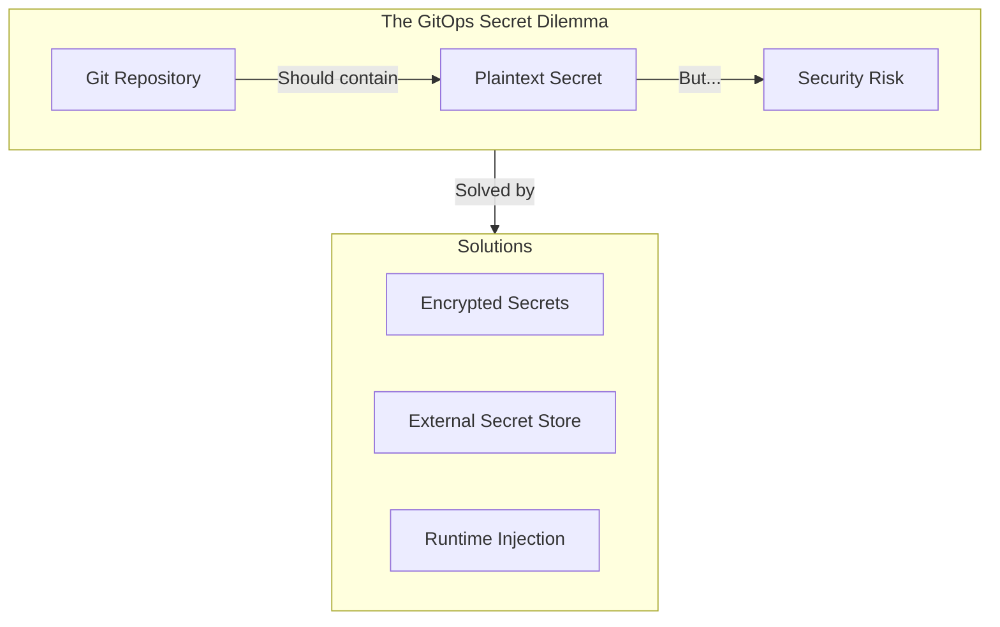
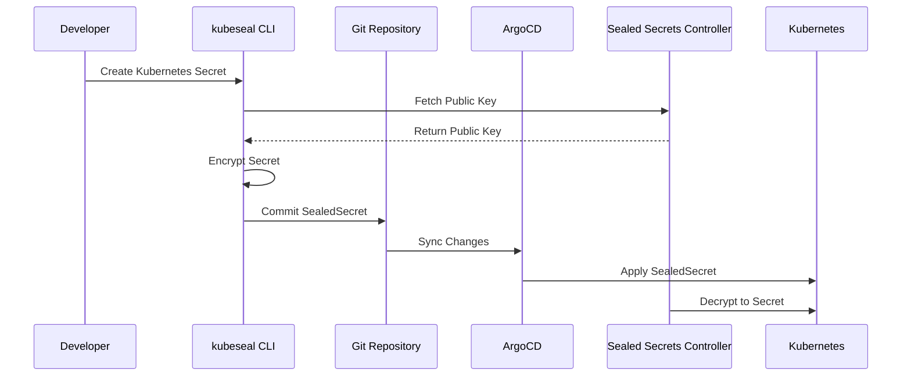
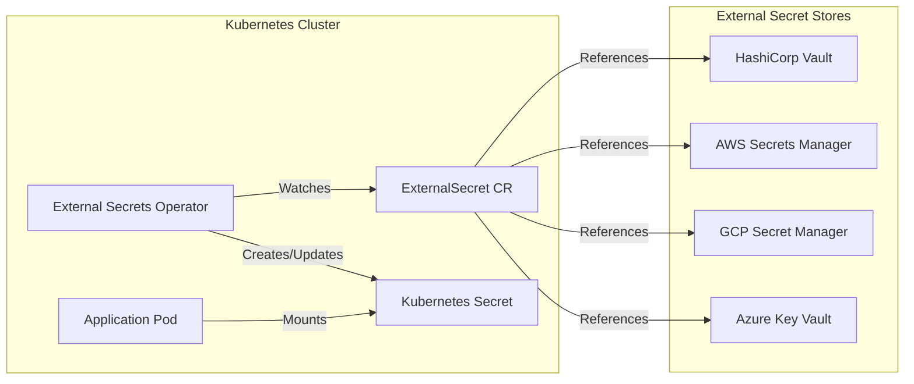
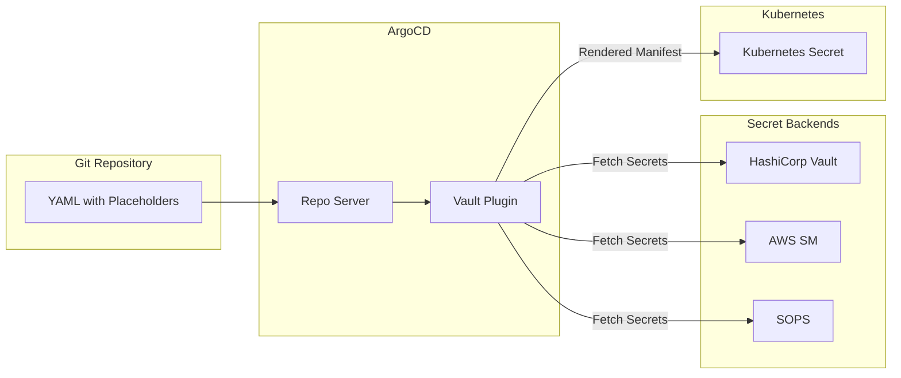
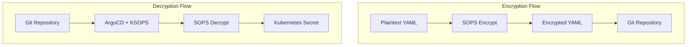
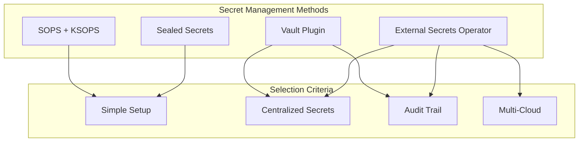

# How to Handle ArgoCD Secret Management

Author: [nawazdhandala](https://www.github.com/nawazdhandala)

Tags: Kubernetes, ArgoCD, GitOps, Secrets, Security, DevOps, Vault, External Secrets

Description: A comprehensive guide to managing secrets in ArgoCD, covering Sealed Secrets, External Secrets Operator, Vault integration, SOPS, and best practices for secure GitOps workflows.

---

Managing secrets in GitOps presents a fundamental challenge: Git repositories should be the source of truth, but storing plaintext secrets in Git is a security nightmare. ArgoCD offers several strategies to handle secrets securely while maintaining GitOps principles.

## The Secret Management Problem



Storing secrets in Git creates several risks:
- Credentials exposed in commit history
- Access by anyone with repo read access
- Compliance violations for sensitive data
- Difficulty rotating compromised secrets

## Solution 1: Sealed Secrets

Sealed Secrets encrypt secrets using a cluster-side controller. Only the controller can decrypt them, making the encrypted version safe to store in Git.

### How Sealed Secrets Work



### Installing Sealed Secrets

The following commands install the Sealed Secrets controller using Helm, which manages the encryption keys and decryption process.

```bash
# Add the Sealed Secrets Helm repository
helm repo add sealed-secrets https://bitnami-labs.github.io/sealed-secrets
helm repo update

# Install the controller in the kube-system namespace
helm install sealed-secrets sealed-secrets/sealed-secrets \
  --namespace kube-system \
  --set controller.create=true

# Install the kubeseal CLI for encrypting secrets
# macOS
brew install kubeseal

# Linux
wget https://github.com/bitnami-labs/sealed-secrets/releases/download/v0.24.0/kubeseal-0.24.0-linux-amd64.tar.gz
tar xfz kubeseal-0.24.0-linux-amd64.tar.gz
sudo install -m 755 kubeseal /usr/local/bin/kubeseal
```

### Creating Sealed Secrets

First, create a regular Kubernetes Secret, then encrypt it with kubeseal to produce a SealedSecret that can be safely committed to Git.

```bash
# Create a regular secret YAML (do NOT commit this)
kubectl create secret generic db-credentials \
  --from-literal=username=admin \
  --from-literal=password=supersecret \
  --dry-run=client -o yaml > secret.yaml

# Seal the secret using the cluster's public key
kubeseal --format yaml < secret.yaml > sealed-secret.yaml

# Clean up the plaintext secret
rm secret.yaml

# Commit the sealed secret to Git
git add sealed-secret.yaml
git commit -m "Add encrypted database credentials"
```

The resulting SealedSecret YAML can be safely stored in your Git repository since it can only be decrypted by the controller running in your cluster.

```yaml
# sealed-secret.yaml - Safe to commit to Git
apiVersion: bitnami.com/v1alpha1
kind: SealedSecret
metadata:
  name: db-credentials
  namespace: production
spec:
  encryptedData:
    # Encrypted values that only the controller can decrypt
    username: AgBy3i4OJSWK+PiTySYZZA9rO43cGDEq...
    password: AgCtrNKhLqC2LQ9KZsC7Xr3H7nJLe1pL...
  template:
    metadata:
      name: db-credentials
      namespace: production
    type: Opaque
```

### Sealed Secrets with ArgoCD Application

Configure your ArgoCD Application to sync the directory containing your Sealed Secrets, and the controller will automatically decrypt them into regular Kubernetes Secrets.

```yaml
# argocd-application.yaml
apiVersion: argoproj.io/v1alpha1
kind: Application
metadata:
  name: myapp
  namespace: argocd
spec:
  project: default
  source:
    repoURL: https://github.com/myorg/myapp-config.git
    targetRevision: HEAD
    path: overlays/production
  destination:
    server: https://kubernetes.default.svc
    namespace: production
  syncPolicy:
    automated:
      prune: true
      selfHeal: true
```

### Rotating Sealed Secrets Keys

Periodically rotating encryption keys enhances security. The controller can manage multiple keys, allowing gradual migration of secrets.

```bash
# Fetch the current public key and save it
kubeseal --fetch-cert > sealed-secrets-cert.pem

# Force key rotation by restarting the controller
kubectl rollout restart deployment sealed-secrets-controller -n kube-system

# Re-encrypt all secrets with the new key
for file in $(find . -name "sealed-*.yaml"); do
  # Extract the secret name and namespace
  name=$(yq '.metadata.name' $file)
  ns=$(yq '.metadata.namespace' $file)

  # Re-seal with fresh key
  kubeseal --format yaml --re-encrypt < $file > $file.new
  mv $file.new $file
done
```

## Solution 2: External Secrets Operator

External Secrets Operator (ESO) syncs secrets from external providers like HashiCorp Vault, AWS Secrets Manager, Azure Key Vault, and Google Secret Manager into Kubernetes Secrets.

### External Secrets Architecture



### Installing External Secrets Operator

Install ESO using Helm to enable secret synchronization from external providers.

```bash
# Add the External Secrets Helm repository
helm repo add external-secrets https://charts.external-secrets.io
helm repo update

# Install External Secrets Operator
helm install external-secrets external-secrets/external-secrets \
  --namespace external-secrets \
  --create-namespace \
  --set installCRDs=true
```

### Configuring Secret Stores

A SecretStore defines the connection to your external secret provider. Use ClusterSecretStore for cluster-wide access.

AWS Secrets Manager configuration requires proper IAM permissions for the operator to read secrets.

```yaml
# cluster-secret-store-aws.yaml
apiVersion: external-secrets.io/v1beta1
kind: ClusterSecretStore
metadata:
  name: aws-secrets-manager
spec:
  provider:
    aws:
      service: SecretsManager
      region: us-east-1
      auth:
        jwt:
          serviceAccountRef:
            name: external-secrets-sa
            namespace: external-secrets
```

HashiCorp Vault configuration using Kubernetes authentication for secure access.

```yaml
# cluster-secret-store-vault.yaml
apiVersion: external-secrets.io/v1beta1
kind: ClusterSecretStore
metadata:
  name: vault-backend
spec:
  provider:
    vault:
      server: "https://vault.example.com"
      path: "secret"
      version: "v2"
      auth:
        kubernetes:
          mountPath: "kubernetes"
          role: "external-secrets"
          serviceAccountRef:
            name: external-secrets-sa
            namespace: external-secrets
```

### Creating External Secrets

An ExternalSecret defines which secrets to fetch from the external store and how to create the Kubernetes Secret.

```yaml
# external-secret.yaml
apiVersion: external-secrets.io/v1beta1
kind: ExternalSecret
metadata:
  name: db-credentials
  namespace: production
spec:
  # How often to sync secrets from the external store
  refreshInterval: 1h

  # Reference to the SecretStore
  secretStoreRef:
    name: vault-backend
    kind: ClusterSecretStore

  # The Kubernetes Secret that will be created
  target:
    name: db-credentials
    creationPolicy: Owner
    template:
      type: Opaque
      data:
        # Template supports Go text/template syntax
        DB_CONNECTION_STRING: "postgresql://{{ .username }}:{{ .password }}@db.example.com:5432/myapp"

  # Map external secret keys to Kubernetes Secret keys
  data:
    - secretKey: username
      remoteRef:
        key: myapp/database
        property: username
    - secretKey: password
      remoteRef:
        key: myapp/database
        property: password
```

### Using ExternalSecret with ArgoCD

Store only the ExternalSecret manifests in Git, not the actual secrets. ArgoCD syncs the ExternalSecret, and ESO creates the actual Kubernetes Secret.

```yaml
# Repository structure
# myapp-config/
#   base/
#     deployment.yaml
#     service.yaml
#     external-secret.yaml    # Safe to commit
#   overlays/
#     production/
#       kustomization.yaml

# kustomization.yaml
apiVersion: kustomize.config.k8s.io/v1beta1
kind: Kustomization
namespace: production
resources:
  - ../../base
  - external-secret.yaml
```

## Solution 3: ArgoCD Vault Plugin

ArgoCD Vault Plugin (AVP) processes manifests and replaces placeholder values with secrets from Vault or other backends before applying them.

### AVP Architecture



### Installing ArgoCD Vault Plugin

Configure the ArgoCD repo server to include the Vault plugin as a sidecar container.

```yaml
# argocd-repo-server-patch.yaml
apiVersion: apps/v1
kind: Deployment
metadata:
  name: argocd-repo-server
  namespace: argocd
spec:
  template:
    spec:
      # Add service account for Vault authentication
      serviceAccountName: argocd-repo-server
      automountServiceAccountToken: true

      containers:
        - name: argocd-repo-server
          # Mount plugin binary
          volumeMounts:
            - name: custom-tools
              mountPath: /usr/local/bin/argocd-vault-plugin
              subPath: argocd-vault-plugin

      # Init container to download the plugin
      initContainers:
        - name: download-tools
          image: alpine:3.18
          command: [sh, -c]
          args:
            - >-
              wget -O /custom-tools/argocd-vault-plugin
              https://github.com/argoproj-labs/argocd-vault-plugin/releases/download/v1.17.0/argocd-vault-plugin_1.17.0_linux_amd64 &&
              chmod +x /custom-tools/argocd-vault-plugin
          volumeMounts:
            - name: custom-tools
              mountPath: /custom-tools

      volumes:
        - name: custom-tools
          emptyDir: {}
```

### Configuring AVP

Register the plugin with ArgoCD by adding it to the ConfigManagementPlugin configuration.

```yaml
# argocd-cmp-plugin.yaml
apiVersion: v1
kind: ConfigMap
metadata:
  name: argocd-cmp-cm
  namespace: argocd
data:
  plugin.yaml: |
    apiVersion: argoproj.io/v1alpha1
    kind: ConfigManagementPlugin
    metadata:
      name: argocd-vault-plugin
    spec:
      allowConcurrency: true
      discover:
        find:
          command:
            - sh
            - "-c"
            - "find . -name '*.yaml' | xargs -I {} grep -l 'avp.kubernetes.io/path' {}"
      generate:
        command:
          - argocd-vault-plugin
          - generate
          - "."
      lockRepo: false
```

### Using AVP Placeholders

Add placeholder annotations to your manifests. AVP replaces them with actual secrets during the ArgoCD sync process.

```yaml
# secret-template.yaml - Safe to commit
apiVersion: v1
kind: Secret
metadata:
  name: db-credentials
  namespace: production
  annotations:
    # Specify the Vault path for this secret
    avp.kubernetes.io/path: "secret/data/myapp/database"
type: Opaque
stringData:
  # Placeholders replaced at sync time
  username: <username>
  password: <password>
```

For more complex scenarios, use inline path references to pull from multiple Vault paths.

```yaml
# configmap-with-secrets.yaml
apiVersion: v1
kind: ConfigMap
metadata:
  name: app-config
  namespace: production
data:
  config.yaml: |
    database:
      host: db.example.com
      port: 5432
      username: <path:secret/data/myapp/database#username>
      password: <path:secret/data/myapp/database#password>
    redis:
      host: redis.example.com
      password: <path:secret/data/myapp/redis#password>
```

### AVP ArgoCD Application

Configure your ArgoCD Application to use the Vault plugin for manifest generation.

```yaml
# application-with-avp.yaml
apiVersion: argoproj.io/v1alpha1
kind: Application
metadata:
  name: myapp
  namespace: argocd
spec:
  project: default
  source:
    repoURL: https://github.com/myorg/myapp-config.git
    targetRevision: HEAD
    path: overlays/production
    plugin:
      name: argocd-vault-plugin
      env:
        - name: AVP_TYPE
          value: vault
        - name: AVP_AUTH_TYPE
          value: k8s
        - name: AVP_K8S_ROLE
          value: argocd
        - name: VAULT_ADDR
          value: https://vault.example.com
  destination:
    server: https://kubernetes.default.svc
    namespace: production
```

## Solution 4: SOPS with Age or GPG

SOPS (Secrets OPerationS) encrypts specific values in YAML files while keeping keys readable. Combined with Age or GPG, it provides a Git-native approach to secret management.

### SOPS Workflow



### Setting Up SOPS with Age

Age is a modern encryption tool that pairs well with SOPS for simpler key management than GPG.

```bash
# Install age and sops
# macOS
brew install age sops

# Linux
sudo apt install age
wget https://github.com/getsops/sops/releases/download/v3.8.1/sops-v3.8.1.linux.amd64
sudo mv sops-v3.8.1.linux.amd64 /usr/local/bin/sops
sudo chmod +x /usr/local/bin/sops

# Generate an age key pair
age-keygen -o age-key.txt

# Output looks like:
# Public key: age1ql3z7hjy54pw3hyww5ayyfg7zqgvc7w3j2elw8zmrj2kg5sfn9aqmcac8p

# Store the private key securely and share the public key
```

### Configuring SOPS

Create a `.sops.yaml` configuration file at the root of your repository to define encryption rules.

```yaml
# .sops.yaml
creation_rules:
  # Encrypt secrets in production with production key
  - path_regex: overlays/production/.*\.yaml$
    encrypted_regex: "^(data|stringData)$"
    age: age1ql3z7hjy54pw3hyww5ayyfg7zqgvc7w3j2elw8zmrj2kg5sfn9aqmcac8p

  # Encrypt secrets in staging with staging key
  - path_regex: overlays/staging/.*\.yaml$
    encrypted_regex: "^(data|stringData)$"
    age: age1abc123def456...

  # Default rule for other secrets
  - path_regex: .*secret.*\.yaml$
    encrypted_regex: "^(data|stringData)$"
    age: age1ql3z7hjy54pw3hyww5ayyfg7zqgvc7w3j2elw8zmrj2kg5sfn9aqmcac8p
```

### Encrypting and Decrypting Secrets

Use SOPS to encrypt secrets before committing and decrypt them for local development.

```bash
# Create a plaintext secret
cat > secret.yaml << EOF
apiVersion: v1
kind: Secret
metadata:
  name: db-credentials
  namespace: production
type: Opaque
stringData:
  username: admin
  password: supersecret123
EOF

# Encrypt the secret - only the stringData values are encrypted
sops --encrypt --in-place secret.yaml

# View the encrypted file - keys remain readable
cat secret.yaml
```

The encrypted file looks like this, with keys visible but values encrypted.

```yaml
apiVersion: v1
kind: Secret
metadata:
  name: db-credentials
  namespace: production
type: Opaque
stringData:
  username: ENC[AES256_GCM,data:YWRtaW4=,iv:...,tag:...,type:str]
  password: ENC[AES256_GCM,data:c3VwZXJzZWNyZXQ=,iv:...,tag:...,type:str]
sops:
  age:
    - recipient: age1ql3z7hjy54pw3hyww5ayyfg7zqgvc7w3j2elw8zmrj2kg5sfn9aqmcac8p
      enc: |
        -----BEGIN AGE ENCRYPTED FILE-----
        ...
        -----END AGE ENCRYPTED FILE-----
  lastmodified: "2024-01-15T10:30:00Z"
  mac: ENC[AES256_GCM,data:...,tag:...,type:str]
  version: 3.8.1
```

### KSOPS Integration with ArgoCD

KSOPS is a Kustomize plugin that decrypts SOPS-encrypted files during ArgoCD sync.

```yaml
# argocd-repo-server-patch.yaml for KSOPS
apiVersion: apps/v1
kind: Deployment
metadata:
  name: argocd-repo-server
  namespace: argocd
spec:
  template:
    spec:
      containers:
        - name: argocd-repo-server
          env:
            # Set the age key file location
            - name: SOPS_AGE_KEY_FILE
              value: /sops-age/age-key.txt
            # Enable Kustomize plugins
            - name: XDG_CONFIG_HOME
              value: /.config
          volumeMounts:
            - name: sops-age
              mountPath: /sops-age
            - name: custom-tools
              mountPath: /.config/kustomize/plugin/viaduct.ai/v1/ksops/ksops
              subPath: ksops

      initContainers:
        - name: install-ksops
          image: viaductoss/ksops:v4.2.1
          command: ["/bin/sh", "-c"]
          args:
            - cp /usr/local/bin/ksops /.config/kustomize/plugin/viaduct.ai/v1/ksops/ksops
          volumeMounts:
            - name: custom-tools
              mountPath: /.config/kustomize/plugin/viaduct.ai/v1/ksops

      volumes:
        - name: sops-age
          secret:
            secretName: sops-age-key
        - name: custom-tools
          emptyDir: {}
```

Store the age private key as a Kubernetes Secret for ArgoCD to use during decryption.

```bash
# Create secret containing the age private key
kubectl create secret generic sops-age-key \
  --from-file=age-key.txt \
  --namespace argocd
```

### KSOPS Kustomization

Configure Kustomize to use KSOPS for decrypting secrets.

```yaml
# kustomization.yaml
apiVersion: kustomize.config.k8s.io/v1beta1
kind: Kustomization
namespace: production

resources:
  - deployment.yaml
  - service.yaml

generators:
  - ksops-generator.yaml
```

```yaml
# ksops-generator.yaml
apiVersion: viaduct.ai/v1
kind: ksops
metadata:
  name: secret-generator
files:
  - ./secret.enc.yaml
```

## Comparison of Approaches



| Feature | Sealed Secrets | External Secrets | Vault Plugin | SOPS |
|---------|---------------|------------------|--------------|------|
| Setup Complexity | Low | Medium | Medium | Low |
| External Dependencies | None | Secret Store | Vault | None |
| Audit Trail | Git only | Full | Full | Git only |
| Secret Rotation | Manual | Automatic | Automatic | Manual |
| Multi-Cluster | Per-cluster keys | Centralized | Centralized | Shared keys |
| Offline Access | Yes | No | No | Yes |

## Best Practices

### 1. Never Commit Plaintext Secrets

Implement pre-commit hooks to prevent accidental secret commits.

```bash
# .pre-commit-config.yaml
repos:
  - repo: https://github.com/gitleaks/gitleaks
    rev: v8.18.0
    hooks:
      - id: gitleaks

  - repo: local
    hooks:
      - id: check-secrets
        name: Check for plaintext secrets
        entry: bash -c 'grep -rn "password:" --include="*.yaml" | grep -v "ENC\[" | grep -v "<path:" | grep -v "<password>" && exit 1 || exit 0'
        language: system
        pass_filenames: false
```

### 2. Implement Secret Rotation

Automate secret rotation to reduce the blast radius of compromised credentials.

```yaml
# external-secret-with-rotation.yaml
apiVersion: external-secrets.io/v1beta1
kind: ExternalSecret
metadata:
  name: rotating-credentials
  namespace: production
spec:
  # Refresh every 15 minutes for frequently rotated secrets
  refreshInterval: 15m

  secretStoreRef:
    name: vault-backend
    kind: ClusterSecretStore

  target:
    name: api-credentials
    # Ensure pods restart when secrets change
    template:
      metadata:
        annotations:
          # Stakater Reloader watches this annotation
          secret.reloader.stakater.com/reload: "true"

  data:
    - secretKey: api-key
      remoteRef:
        key: myapp/api
        property: current-key
```

### 3. Use Namespaced Secret Stores

Limit secret access by namespace for better isolation.

```yaml
# namespace-scoped-secret-store.yaml
apiVersion: external-secrets.io/v1beta1
kind: SecretStore
metadata:
  name: team-secrets
  namespace: team-backend
spec:
  provider:
    vault:
      server: "https://vault.example.com"
      path: "secret/data/teams/backend"
      auth:
        kubernetes:
          mountPath: "kubernetes"
          role: "team-backend"
```

### 4. Audit and Monitor Secret Access

Enable audit logging for secret operations to track access and changes.

```yaml
# vault-audit-policy.hcl
path "secret/data/production/*" {
  capabilities = ["read"]

  # Log all access
  audit = {
    enabled = true
  }
}

# ArgoCD specific policy
path "secret/data/argocd/*" {
  capabilities = ["read", "list"]

  allowed_parameters = {
    "*" = []
  }
}
```

### 5. Separate Secrets by Environment

Maintain strict separation between environment secrets using different paths and access policies.

```yaml
# Directory structure
# secrets/
#   development/
#     external-secret.yaml    # Points to dev vault path
#   staging/
#     external-secret.yaml    # Points to staging vault path
#   production/
#     external-secret.yaml    # Points to prod vault path

# production/external-secret.yaml
apiVersion: external-secrets.io/v1beta1
kind: ExternalSecret
metadata:
  name: app-secrets
  namespace: production
spec:
  secretStoreRef:
    name: vault-production    # Environment-specific store
    kind: ClusterSecretStore
  data:
    - secretKey: db-password
      remoteRef:
        key: production/database    # Environment-specific path
        property: password
```

## Troubleshooting

### Sealed Secrets Not Decrypting

```bash
# Check controller logs
kubectl logs -n kube-system -l app.kubernetes.io/name=sealed-secrets

# Verify the secret was encrypted with correct certificate
kubeseal --fetch-cert | openssl x509 -text -noout

# Re-seal if certificate was rotated
kubeseal --re-encrypt < old-sealed-secret.yaml > new-sealed-secret.yaml
```

### External Secrets Not Syncing

```bash
# Check ExternalSecret status
kubectl get externalsecret -n production
kubectl describe externalsecret db-credentials -n production

# Check operator logs
kubectl logs -n external-secrets -l app.kubernetes.io/name=external-secrets

# Verify SecretStore connectivity
kubectl get secretstore -A
kubectl describe clustersecretstore vault-backend
```

### AVP Not Replacing Placeholders

```bash
# Test AVP manually
export VAULT_ADDR=https://vault.example.com
export AVP_TYPE=vault
export AVP_AUTH_TYPE=k8s

argocd-vault-plugin generate ./path/to/manifests

# Check ArgoCD repo-server logs
kubectl logs -n argocd -l app.kubernetes.io/name=argocd-repo-server -c argocd-repo-server
```

---

Secret management in ArgoCD requires careful planning to maintain security without sacrificing GitOps principles. Start with Sealed Secrets for simplicity, then consider External Secrets Operator or Vault Plugin as your needs grow. Regardless of the approach, always implement pre-commit hooks, secret rotation, and access auditing to maintain a strong security posture.
