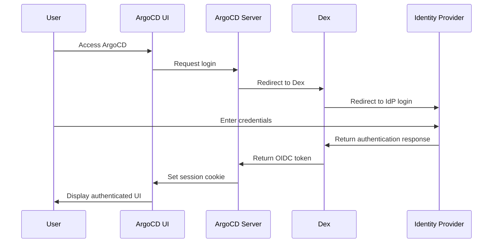
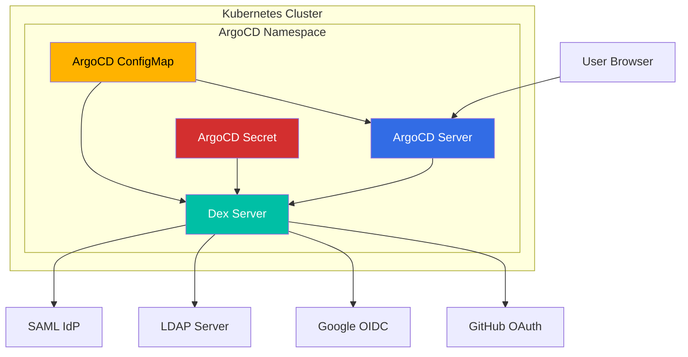
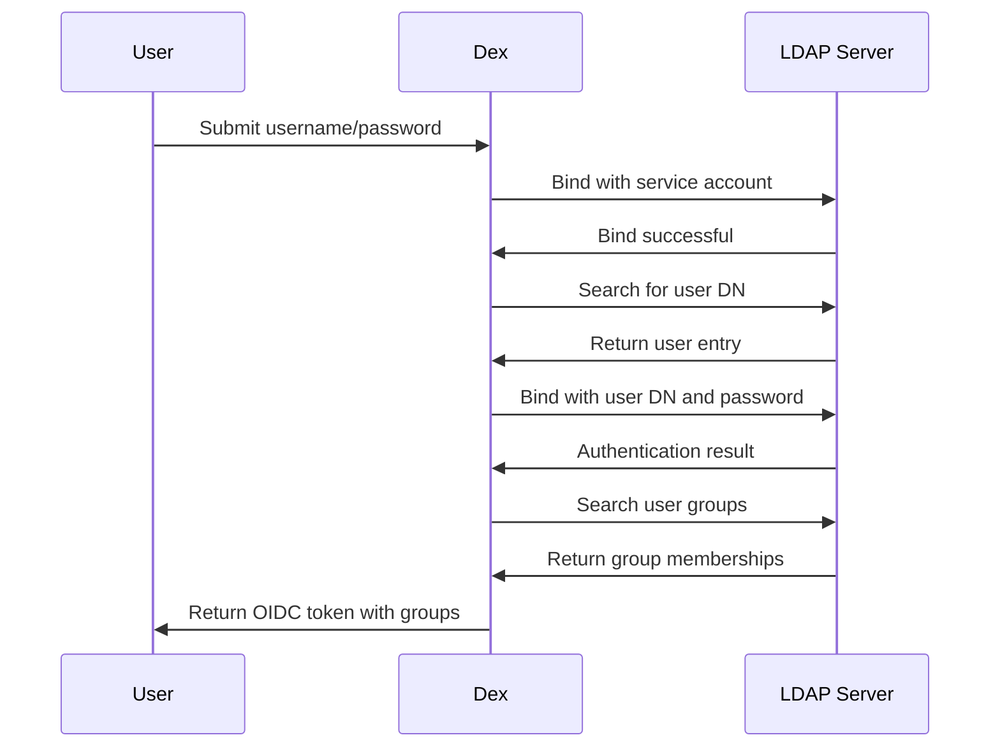
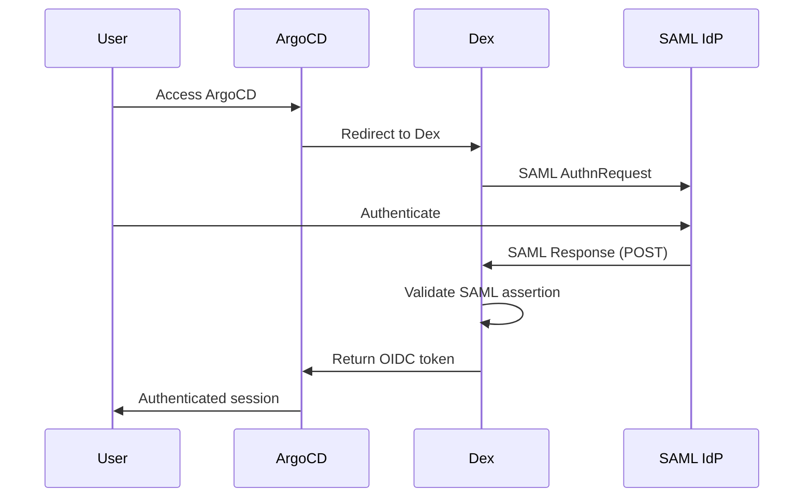
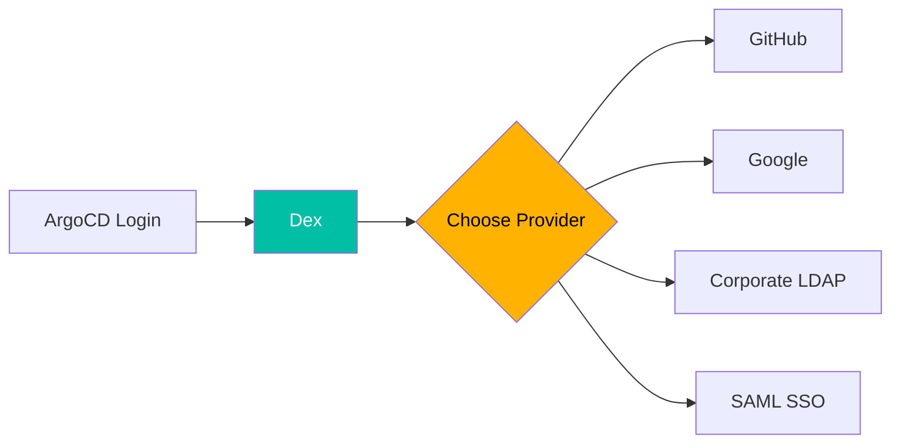
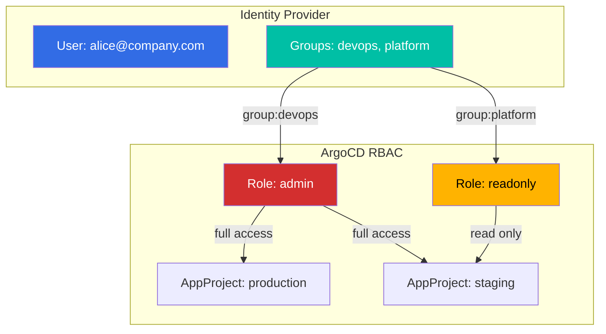
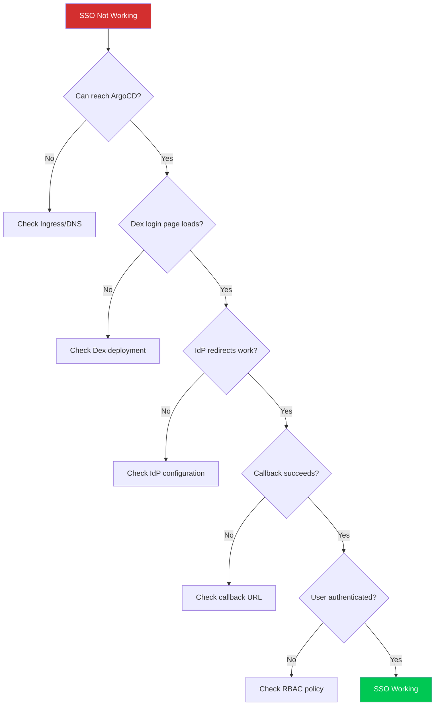

# How to Implement ArgoCD SSO with Dex

Author: [nawazdhandala](https://www.github.com/nawazdhandala)

Tags: ArgoCD, Dex, SSO, Kubernetes, GitOps, Authentication, OIDC, LDAP, OAuth2

Description: Learn how to implement Single Sign-On (SSO) for ArgoCD using Dex as an identity broker. Covers integration with GitHub, LDAP, SAML, and other identity providers with step-by-step configuration examples.

---

> Managing user access in ArgoCD becomes complex as your team grows. Instead of maintaining separate credentials, SSO with Dex allows your team to authenticate using existing identity providers like GitHub, Google, LDAP, or SAML. Dex acts as an identity broker, translating authentication requests between ArgoCD and your chosen provider.

ArgoCD includes Dex as its built-in OIDC provider, making SSO integration straightforward. You can connect multiple identity providers through a single configuration, giving your organization flexibility in how users authenticate.

---

## Understanding the SSO Architecture

Before diving into configuration, understanding how the authentication flow works helps troubleshoot issues and make informed decisions about your setup.



Dex serves as a federated OpenID Connect provider. When a user attempts to log in, ArgoCD redirects them to Dex, which then redirects to the configured identity provider. After successful authentication, Dex issues an OIDC token that ArgoCD uses to establish the user session.

---

## Component Architecture

The following diagram shows how the different components interact within your Kubernetes cluster.



---

## Prerequisites

Before configuring SSO, ensure you have the following ready:

- ArgoCD installed on your Kubernetes cluster (version 2.0 or higher recommended)
- Administrative access to your Kubernetes cluster
- Access to configure your identity provider (GitHub, Google, LDAP, etc.)
- A domain name for ArgoCD with valid TLS certificates

Verify your ArgoCD installation with this command.

```bash
# Check ArgoCD version and running pods
kubectl get pods -n argocd
kubectl get svc -n argocd

# Expected output shows argocd-server and argocd-dex-server running
# NAME                                  READY   STATUS    RESTARTS   AGE
# argocd-server-xxx                     1/1     Running   0          1d
# argocd-dex-server-xxx                 1/1     Running   0          1d
```

---

## Configuring Dex with GitHub OAuth

GitHub OAuth is popular for organizations already using GitHub for source control. Users authenticate with their GitHub accounts, and you can restrict access based on organization or team membership.

### Step 1: Create GitHub OAuth Application

Navigate to your GitHub organization settings and create a new OAuth application with these settings:

- **Application name**: ArgoCD SSO
- **Homepage URL**: https://argocd.yourdomain.com
- **Authorization callback URL**: https://argocd.yourdomain.com/api/dex/callback

Save the Client ID and generate a Client Secret - you will need both for the configuration.

### Step 2: Configure ArgoCD ConfigMap

The ConfigMap contains the Dex configuration and ArgoCD URL settings. Update the argocd-cm ConfigMap with the following configuration.

```yaml
# argocd-cm-github.yaml
# ArgoCD ConfigMap with GitHub OAuth configuration for Dex
apiVersion: v1
kind: ConfigMap
metadata:
  name: argocd-cm
  namespace: argocd
  labels:
    app.kubernetes.io/name: argocd-cm
    app.kubernetes.io/part-of: argocd
data:
  # Base URL where ArgoCD is accessible - must match your ingress configuration
  url: https://argocd.yourdomain.com

  # Dex configuration - embedded YAML document
  dex.config: |
    # Dex connector configuration for GitHub OAuth
    connectors:
      - type: github
        id: github
        name: GitHub
        config:
          # OAuth App credentials - clientSecret references the argocd-secret
          clientID: your-github-client-id
          clientSecret: $dex.github.clientSecret

          # Restrict to specific GitHub organizations for security
          orgs:
            - name: your-github-org
              # Optionally restrict to specific teams within the org
              teams:
                - devops
                - platform-team

          # Load all user teams for RBAC group mapping
          loadAllGroups: true

          # Use team slug for group names (e.g., 'devops' instead of full name)
          teamNameField: slug

          # Request read:org scope to access organization membership
          scopes:
            - read:org
```

### Step 3: Store Client Secret Securely

Never store secrets in ConfigMaps. The client secret should be stored in the argocd-secret and referenced using the $variable syntax.

```yaml
# argocd-secret-github.yaml
# ArgoCD Secret containing Dex GitHub OAuth credentials
apiVersion: v1
kind: Secret
metadata:
  name: argocd-secret
  namespace: argocd
  labels:
    app.kubernetes.io/name: argocd-secret
    app.kubernetes.io/part-of: argocd
type: Opaque
stringData:
  # GitHub OAuth client secret - Dex references this as $dex.github.clientSecret
  dex.github.clientSecret: your-github-client-secret
```

### Step 4: Apply the Configuration

Apply the configuration files and restart the ArgoCD components to pick up the changes.

```bash
# Apply the ConfigMap and Secret
kubectl apply -f argocd-cm-github.yaml
kubectl apply -f argocd-secret-github.yaml

# Restart ArgoCD server and Dex to load new configuration
kubectl rollout restart deployment argocd-server -n argocd
kubectl rollout restart deployment argocd-dex-server -n argocd

# Watch the rollout status
kubectl rollout status deployment argocd-server -n argocd
kubectl rollout status deployment argocd-dex-server -n argocd
```

---

## Configuring Dex with Google OIDC

Google OIDC provides enterprise-grade authentication for organizations using Google Workspace. You can restrict access to users within your Google Workspace domain.

### Step 1: Create Google OAuth Credentials

1. Go to the Google Cloud Console (https://console.cloud.google.com)
2. Navigate to APIs & Services > Credentials
3. Create an OAuth 2.0 Client ID with these settings:
   - **Application type**: Web application
   - **Authorized redirect URIs**: https://argocd.yourdomain.com/api/dex/callback

### Step 2: Configure ArgoCD for Google OIDC

The following configuration enables Google authentication with domain restriction.

```yaml
# argocd-cm-google.yaml
# ArgoCD ConfigMap with Google OIDC configuration for Dex
apiVersion: v1
kind: ConfigMap
metadata:
  name: argocd-cm
  namespace: argocd
  labels:
    app.kubernetes.io/name: argocd-cm
    app.kubernetes.io/part-of: argocd
data:
  url: https://argocd.yourdomain.com

  dex.config: |
    connectors:
      - type: oidc
        id: google
        name: Google
        config:
          # Google OIDC discovery endpoint
          issuer: https://accounts.google.com

          # OAuth credentials - clientSecret is stored in argocd-secret
          clientID: your-google-client-id.apps.googleusercontent.com
          clientSecret: $dex.google.clientSecret

          # Callback URL must match the authorized redirect URI in Google Console
          redirectURI: https://argocd.yourdomain.com/api/dex/callback

          # Restrict to your Google Workspace domain
          hostedDomains:
            - yourdomain.com

          # Request user profile information
          scopes:
            - openid
            - profile
            - email

          # Ensure email is included in the ID token
          insecureSkipEmailVerified: false

          # Map Google groups to ArgoCD groups (requires Google Workspace admin setup)
          getUserInfo: true
```

Store the Google client secret in the argocd-secret.

```yaml
# Add to argocd-secret stringData section
stringData:
  dex.google.clientSecret: your-google-client-secret
```

---

## Configuring Dex with LDAP

LDAP integration works well for organizations with existing Active Directory or OpenLDAP infrastructure. Users authenticate with their corporate credentials without needing additional accounts.

### LDAP Connection Flow



### LDAP Configuration

The LDAP connector requires careful configuration of bind credentials, user search parameters, and group mappings.

```yaml
# argocd-cm-ldap.yaml
# ArgoCD ConfigMap with LDAP configuration for Dex
apiVersion: v1
kind: ConfigMap
metadata:
  name: argocd-cm
  namespace: argocd
  labels:
    app.kubernetes.io/name: argocd-cm
    app.kubernetes.io/part-of: argocd
data:
  url: https://argocd.yourdomain.com

  dex.config: |
    connectors:
      - type: ldap
        id: ldap
        name: Corporate LDAP
        config:
          # LDAP server address - use ldaps:// for TLS (recommended)
          host: ldap.yourdomain.com:636

          # Enable StartTLS for secure connection (not needed if using ldaps://)
          # startTLS: true

          # For self-signed certificates, you may need to skip verification
          # insecureNoSSL: false
          # insecureSkipVerify: false

          # Path to CA certificate for LDAP server verification
          # rootCA: /etc/ssl/certs/ldap-ca.crt

          # Service account for initial LDAP bind (used to search for users)
          bindDN: cn=argocd-service,ou=ServiceAccounts,dc=yourdomain,dc=com
          bindPW: $dex.ldap.bindPW

          # User search configuration
          userSearch:
            # Base DN where users are located
            baseDN: ou=Users,dc=yourdomain,dc=com

            # LDAP filter to find users - {0} is replaced with login username
            filter: "(|(uid={0})(mail={0})(sAMAccountName={0}))"

            # Attribute containing the username for login
            username: uid

            # Attribute for user's unique identifier
            idAttr: uid

            # Attribute for user's email address
            emailAttr: mail

            # Attribute for user's display name
            nameAttr: displayName

          # Group search configuration for RBAC
          groupSearch:
            # Base DN where groups are located
            baseDN: ou=Groups,dc=yourdomain,dc=com

            # LDAP filter to find groups - {0} is replaced with user DN
            filter: "(member={0})"

            # Attribute containing the group name
            nameAttr: cn

            # How to identify user in group membership
            userMatchers:
              - userAttr: DN
                groupAttr: member
```

Store the LDAP bind password securely.

```yaml
# Add to argocd-secret stringData section
stringData:
  dex.ldap.bindPW: your-ldap-service-account-password
```

---

## Configuring Dex with SAML 2.0

SAML integration enables SSO with enterprise identity providers like Okta, OneLogin, Azure AD, and others that support SAML 2.0.

### SAML Authentication Flow



### SAML Configuration

Before configuring Dex, you need to set up ArgoCD as a Service Provider (SP) in your SAML Identity Provider. Use these values:

- **Entity ID / Audience**: https://argocd.yourdomain.com/api/dex/callback
- **ACS URL**: https://argocd.yourdomain.com/api/dex/callback
- **Name ID Format**: Email address or persistent

```yaml
# argocd-cm-saml.yaml
# ArgoCD ConfigMap with SAML 2.0 configuration for Dex
apiVersion: v1
kind: ConfigMap
metadata:
  name: argocd-cm
  namespace: argocd
  labels:
    app.kubernetes.io/name: argocd-cm
    app.kubernetes.io/part-of: argocd
data:
  url: https://argocd.yourdomain.com

  dex.config: |
    connectors:
      - type: saml
        id: saml
        name: Corporate SSO
        config:
          # URL to your IdP's SSO endpoint (from IdP metadata)
          ssoURL: https://idp.yourdomain.com/sso/saml

          # Entity ID of your SAML IdP (from IdP metadata)
          entityIssuer: https://idp.yourdomain.com

          # IdP's X.509 signing certificate (from IdP metadata)
          # Include the full certificate in PEM format
          ca: |
            -----BEGIN CERTIFICATE-----
            MIIDXTCCAkWgAwIBAgIJAJC1HiIAZAiUMA0Gcg...
            Fh8nC6GvL+O4SFjj4/Cmc=
            -----END CERTIFICATE-----

          # Or reference a CA file mounted in the Dex container
          # caFile: /etc/dex/saml/idp-ca.crt

          # Callback URL - ArgoCD's SAML assertion consumer service
          redirectURI: https://argocd.yourdomain.com/api/dex/callback

          # Map SAML attributes to user claims
          usernameAttr: name
          emailAttr: email
          groupsAttr: groups

          # Optional: Filter groups to only include specific patterns
          # groupsDelim: ","

          # Name ID policy - use email or persistent identifier
          nameIDPolicyFormat: emailAddress
```

---

## Configuring Multiple Identity Providers

Organizations often need to support multiple authentication methods. Dex allows configuring multiple connectors, presenting users with a choice during login.



### Multi-Provider Configuration

The following configuration enables GitHub, Google, and LDAP authentication simultaneously.

```yaml
# argocd-cm-multi.yaml
# ArgoCD ConfigMap with multiple identity providers
apiVersion: v1
kind: ConfigMap
metadata:
  name: argocd-cm
  namespace: argocd
  labels:
    app.kubernetes.io/name: argocd-cm
    app.kubernetes.io/part-of: argocd
data:
  url: https://argocd.yourdomain.com

  dex.config: |
    # Configure multiple connectors - users choose during login
    connectors:
      # GitHub for external contributors
      - type: github
        id: github
        name: GitHub
        config:
          clientID: github-client-id
          clientSecret: $dex.github.clientSecret
          orgs:
            - name: your-org
          loadAllGroups: true

      # Google for Google Workspace users
      - type: oidc
        id: google
        name: Google Workspace
        config:
          issuer: https://accounts.google.com
          clientID: google-client-id.apps.googleusercontent.com
          clientSecret: $dex.google.clientSecret
          redirectURI: https://argocd.yourdomain.com/api/dex/callback
          hostedDomains:
            - yourdomain.com

      # LDAP for on-premises users
      - type: ldap
        id: ldap
        name: Corporate Directory
        config:
          host: ldap.internal.yourdomain.com:636
          bindDN: cn=argocd,ou=Services,dc=internal,dc=yourdomain,dc=com
          bindPW: $dex.ldap.bindPW
          userSearch:
            baseDN: ou=Users,dc=internal,dc=yourdomain,dc=com
            filter: "(uid={0})"
            username: uid
            idAttr: uid
            emailAttr: mail
            nameAttr: displayName
          groupSearch:
            baseDN: ou=Groups,dc=internal,dc=yourdomain,dc=com
            filter: "(member={0})"
            nameAttr: cn
```

---

## Configuring RBAC for SSO Users

After setting up SSO, configure Role-Based Access Control (RBAC) to define what authenticated users can do. ArgoCD uses groups from the identity provider to assign permissions.

### RBAC Architecture



### RBAC Policy Configuration

The rbac ConfigMap defines policies mapping groups to permissions.

```yaml
# argocd-rbac-cm.yaml
# ArgoCD RBAC ConfigMap for SSO group-based access control
apiVersion: v1
kind: ConfigMap
metadata:
  name: argocd-rbac-cm
  namespace: argocd
  labels:
    app.kubernetes.io/name: argocd-rbac-cm
    app.kubernetes.io/part-of: argocd
data:
  # Default policy for authenticated users without explicit role assignment
  # Options: role:readonly, role:admin, or "" (no access)
  policy.default: role:readonly

  # CSV policy definitions mapping groups and users to roles
  policy.csv: |
    # Format: p, subject, resource, action, object, effect
    # Format: g, subject, role

    # Admin group gets full access to everything
    g, devops-team, role:admin
    g, platform-team, role:admin

    # GitHub organization teams (format depends on connector config)
    g, your-org:devops, role:admin
    g, your-org:platform, role:admin

    # Developers can sync and view applications in staging
    p, role:developer, applications, get, staging/*, allow
    p, role:developer, applications, sync, staging/*, allow
    p, role:developer, applications, action/*, staging/*, allow
    g, developers-team, role:developer

    # QA team can view production but not modify
    p, role:qa, applications, get, production/*, allow
    p, role:qa, logs, get, production/*, allow
    g, qa-team, role:qa

    # Individual user override - alice gets admin access
    g, alice@yourdomain.com, role:admin

    # Project-specific permissions
    # Allow dev team to manage only their project
    p, role:project-dev, applications, *, default/myapp-*, allow
    p, role:project-dev, repositories, get, *, allow
    g, myapp-developers, role:project-dev

  # OIDC scope configuration - which scopes to request from Dex
  scopes: "[groups, email]"
```

### AppProject RBAC

For finer-grained control, use AppProjects to restrict which clusters and repositories teams can deploy to.

```yaml
# appproject-production.yaml
# AppProject with RBAC restrictions for production deployments
apiVersion: argoproj.io/v1alpha1
kind: AppProject
metadata:
  name: production
  namespace: argocd
spec:
  description: Production environment applications

  # Allowed source repositories
  sourceRepos:
    - 'https://github.com/your-org/production-apps.git'
    - 'https://github.com/your-org/helm-charts.git'

  # Allowed deployment destinations
  destinations:
    - namespace: 'production-*'
      server: https://kubernetes.default.svc
      name: in-cluster

  # Cluster resource whitelist (optional - restrict what can be deployed)
  clusterResourceWhitelist:
    - group: ''
      kind: Namespace

  # Namespace resource blacklist (optional - prevent certain resources)
  namespaceResourceBlacklist:
    - group: ''
      kind: ResourceQuota
    - group: ''
      kind: LimitRange

  # RBAC roles specific to this project
  roles:
    - name: production-deployer
      description: Can deploy applications in production
      policies:
        - p, proj:production:production-deployer, applications, get, production/*, allow
        - p, proj:production:production-deployer, applications, sync, production/*, allow
        - p, proj:production:production-deployer, applications, action/*, production/*, allow
      groups:
        # Map SSO groups to this project role
        - devops-team
        - release-managers

    - name: production-viewer
      description: Read-only access to production
      policies:
        - p, proj:production:production-viewer, applications, get, production/*, allow
        - p, proj:production:production-viewer, logs, get, production/*, allow
      groups:
        - all-developers
```

---

## Troubleshooting SSO Issues

When SSO does not work as expected, systematic debugging helps identify the problem quickly.

### Common Issues and Solutions



### Debug Commands

Use these commands to diagnose SSO issues.

```bash
# Check Dex server logs for authentication errors
kubectl logs -n argocd -l app.kubernetes.io/name=argocd-dex-server --tail=100

# Check ArgoCD server logs for RBAC and session issues
kubectl logs -n argocd -l app.kubernetes.io/name=argocd-server --tail=100

# Verify Dex configuration is loaded correctly
kubectl get configmap argocd-cm -n argocd -o yaml | grep -A 100 "dex.config"

# Check if secrets are properly configured
kubectl get secret argocd-secret -n argocd -o yaml

# Test Dex health endpoint
kubectl port-forward svc/argocd-dex-server -n argocd 5556:5556
# Then visit http://localhost:5556/.well-known/openid-configuration

# Check ArgoCD RBAC configuration
kubectl get configmap argocd-rbac-cm -n argocd -o yaml
```

### Verify User Claims

After authentication, check what claims ArgoCD receives from Dex.

```bash
# Get the current user's info via ArgoCD CLI
argocd account get-user-info

# List all accounts and their capabilities
argocd account list

# Check if a user can perform an action (requires admin)
argocd account can-i sync applications 'production/*'
```

### Common Configuration Mistakes

The following configuration shows properly escaped characters and correct formatting, which are common sources of errors.

```yaml
# Common mistakes to avoid in dex.config
dex.config: |
  connectors:
    - type: github
      id: github
      name: GitHub
      config:
        # MISTAKE: Missing $ prefix for secret reference
        # clientSecret: dex.github.clientSecret  # Wrong
        clientSecret: $dex.github.clientSecret    # Correct

        # MISTAKE: Wrong callback URL
        # redirectURI: https://argocd.example.com/callback  # Wrong
        redirectURI: https://argocd.example.com/api/dex/callback  # Correct

        # MISTAKE: Org name with wrong case
        orgs:
          # - name: Your-Org    # Wrong - GitHub org names are case-sensitive
          - name: your-org      # Correct - use exact org name from GitHub
```

---

## Security Best Practices

### 1. Always Use TLS

Ensure all communication is encrypted. Never run SSO over plain HTTP.

```yaml
# argocd-server deployment configuration for TLS
apiVersion: v1
kind: ConfigMap
metadata:
  name: argocd-cmd-params-cm
  namespace: argocd
data:
  # Disable insecure server (HTTP) - only allow HTTPS
  server.insecure: "false"

  # Or if using a TLS-terminating load balancer
  # server.insecure: "true"  # Only if TLS is handled by ingress
```

### 2. Restrict Identity Provider Scope

Limit which users can authenticate by restricting to specific organizations, domains, or groups.

```yaml
# GitHub: Restrict to specific org and teams
orgs:
  - name: your-org
    teams:
      - approved-team

# Google: Restrict to specific domain
hostedDomains:
  - yourdomain.com

# LDAP: Use specific OU for user search
userSearch:
  baseDN: ou=ArgoCD-Users,dc=yourdomain,dc=com
```

### 3. Implement Proper RBAC

Follow the principle of least privilege when configuring RBAC.

```yaml
# Start with restrictive default policy
policy.default: ""  # No access by default

# Explicitly grant permissions
policy.csv: |
  # Only grant what's needed
  p, role:developer, applications, get, staging/*, allow
  p, role:developer, applications, sync, staging/*, allow
  # Developers cannot access production
```

### 4. Rotate Secrets Regularly

Implement a process for rotating OAuth client secrets and other credentials.

```bash
# Update secret with new value
kubectl create secret generic argocd-secret \
  --from-literal=dex.github.clientSecret=new-secret-value \
  --dry-run=client -o yaml | kubectl apply -f -

# Restart Dex to pick up new secret
kubectl rollout restart deployment argocd-dex-server -n argocd
```

### 5. Monitor Authentication Events

Enable logging and monitoring for security events.

```yaml
# Enable detailed logging in ArgoCD server
apiVersion: v1
kind: ConfigMap
metadata:
  name: argocd-cmd-params-cm
  namespace: argocd
data:
  # Set log level to debug for troubleshooting
  log.level: info

  # Enable audit logging (ArgoCD 2.4+)
  server.audit.enabled: "true"
```

---

## Complete Configuration Example

Here is a complete, production-ready configuration combining all components.

```yaml
# argocd-sso-complete.yaml
# Complete ArgoCD SSO configuration with GitHub and LDAP
---
apiVersion: v1
kind: ConfigMap
metadata:
  name: argocd-cm
  namespace: argocd
  labels:
    app.kubernetes.io/name: argocd-cm
    app.kubernetes.io/part-of: argocd
data:
  url: https://argocd.yourdomain.com

  # Enable admin user only for initial setup, then disable
  admin.enabled: "false"

  dex.config: |
    connectors:
      - type: github
        id: github
        name: GitHub
        config:
          clientID: your-github-client-id
          clientSecret: $dex.github.clientSecret
          orgs:
            - name: your-org
              teams:
                - devops
                - platform
          loadAllGroups: true
          teamNameField: slug

      - type: ldap
        id: ldap
        name: Corporate LDAP
        config:
          host: ldap.yourdomain.com:636
          bindDN: cn=argocd,ou=Services,dc=yourdomain,dc=com
          bindPW: $dex.ldap.bindPW
          userSearch:
            baseDN: ou=Users,dc=yourdomain,dc=com
            filter: "(uid={0})"
            username: uid
            idAttr: uid
            emailAttr: mail
            nameAttr: displayName
          groupSearch:
            baseDN: ou=Groups,dc=yourdomain,dc=com
            filter: "(member={0})"
            nameAttr: cn
---
apiVersion: v1
kind: Secret
metadata:
  name: argocd-secret
  namespace: argocd
  labels:
    app.kubernetes.io/name: argocd-secret
    app.kubernetes.io/part-of: argocd
type: Opaque
stringData:
  dex.github.clientSecret: "your-github-secret"
  dex.ldap.bindPW: "your-ldap-password"
---
apiVersion: v1
kind: ConfigMap
metadata:
  name: argocd-rbac-cm
  namespace: argocd
  labels:
    app.kubernetes.io/name: argocd-rbac-cm
    app.kubernetes.io/part-of: argocd
data:
  policy.default: role:readonly
  policy.csv: |
    # Admin access for DevOps team
    g, your-org:devops, role:admin
    g, ldap-admins, role:admin

    # Developer access
    p, role:developer, applications, get, */*, allow
    p, role:developer, applications, sync, staging/*, allow
    g, your-org:developers, role:developer
    g, ldap-developers, role:developer

    # QA read-only access
    p, role:qa, applications, get, */*, allow
    p, role:qa, logs, get, */*, allow
    g, ldap-qa, role:qa
  scopes: "[groups, email]"
```

Apply the complete configuration.

```bash
# Apply all configuration in one command
kubectl apply -f argocd-sso-complete.yaml

# Restart all ArgoCD components
kubectl rollout restart deployment -n argocd argocd-server argocd-dex-server

# Verify all pods are running
kubectl get pods -n argocd -w
```

---

## Conclusion

Implementing SSO with Dex in ArgoCD provides centralized authentication and simplifies user management. Key takeaways:

- **Dex acts as an identity broker**, allowing integration with multiple identity providers through a single configuration
- **Choose the right connector** based on your organization's needs - GitHub for developer teams, LDAP for enterprises, or SAML for complex IdP requirements
- **Configure RBAC carefully** to implement the principle of least privilege
- **Monitor and troubleshoot** using Dex and ArgoCD server logs
- **Follow security best practices** including TLS everywhere and regular secret rotation

With proper SSO configuration, your team can access ArgoCD using existing credentials while maintaining fine-grained access control over your GitOps workflows.

---

*Need to monitor your ArgoCD deployments? [OneUptime](https://oneuptime.com) provides comprehensive monitoring for Kubernetes applications, including deployment tracking, alerting, and performance metrics.*

**Related Reading:**
- [How to Set Up ArgoCD for GitOps Deployments](https://oneuptime.com/blog)
- [Kubernetes RBAC Best Practices](https://oneuptime.com/blog)
