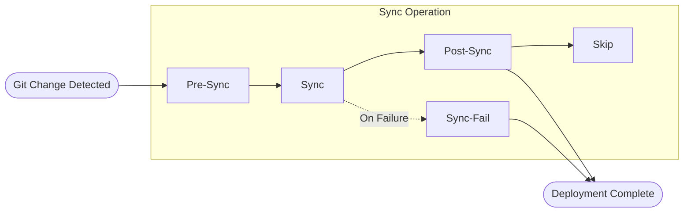
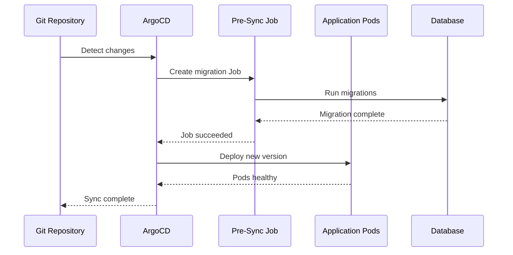
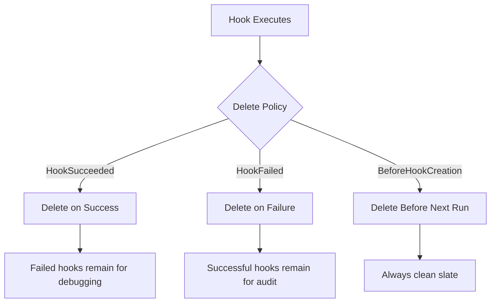
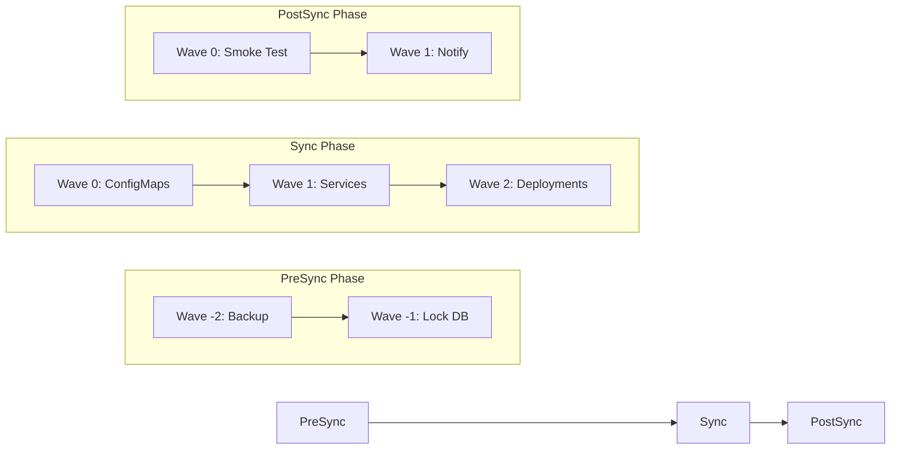
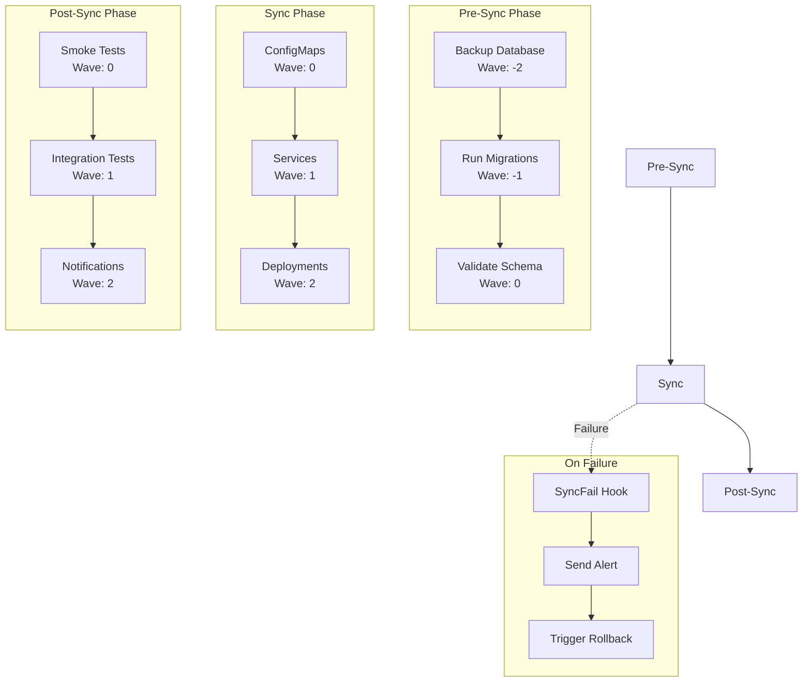

# How to Implement ArgoCD Pre-Sync and Post-Sync Jobs

Author: [nawazdhandala](https://www.github.com/nawazdhandala)

Tags: ArgoCD, Kubernetes, GitOps, CI/CD, DevOps, Sync Hooks

Description: Learn how to implement ArgoCD Pre-Sync and Post-Sync jobs for database migrations, smoke tests, notifications, and more. Covers hook types, delete policies, sync waves, and production best practices.

---

ArgoCD sync hooks let you run custom logic before, during, or after application deployments. Pre-Sync jobs handle database migrations and cache warming. Post-Sync jobs run smoke tests and send notifications. Understanding these hooks transforms your GitOps workflow from simple deployments to complete release orchestration.

## Understanding ArgoCD Sync Hooks

Sync hooks are Kubernetes resources annotated to run at specific phases of the ArgoCD sync operation. They execute as Jobs, Pods, or any other Kubernetes resource and give you control over deployment sequencing.



### Hook Phases

ArgoCD provides five hook phases for running custom logic at different stages:

| Phase | When It Runs | Common Use Cases |
|-------|--------------|------------------|
| PreSync | Before manifests are applied | Database migrations, backup creation |
| Sync | During manifest application | Configuration updates |
| PostSync | After all manifests are healthy | Smoke tests, notifications |
| SyncFail | When sync operation fails | Rollback triggers, alerts |
| Skip | Never executed by sync | Manual-only resources |

## Creating Your First Pre-Sync Hook

Pre-Sync hooks run before ArgoCD applies your main application manifests. Database migrations are the classic example.

The following Job runs database migrations before deploying new application code:

```yaml
apiVersion: batch/v1
kind: Job
metadata:
  name: db-migration
  annotations:
    # Marks this resource as a Pre-Sync hook
    argocd.argoproj.io/hook: PreSync
    # Deletes the Job after successful completion
    argocd.argoproj.io/hook-delete-policy: HookSucceeded
spec:
  backoffLimit: 3
  template:
    spec:
      containers:
        - name: migrate
          image: myapp:latest
          command: ["./scripts/migrate.sh"]
          env:
            - name: DATABASE_URL
              valueFrom:
                secretKeyRef:
                  name: db-credentials
                  key: url
      restartPolicy: Never
```

### Pre-Sync Hook Flow



## Creating Post-Sync Hooks

Post-Sync hooks execute after all application resources are synced and healthy. Use them for validation and notifications.

The following Job runs smoke tests after deployment to verify the application works correctly:

```yaml
apiVersion: batch/v1
kind: Job
metadata:
  name: smoke-test
  annotations:
    argocd.argoproj.io/hook: PostSync
    argocd.argoproj.io/hook-delete-policy: HookSucceeded
spec:
  backoffLimit: 1
  template:
    spec:
      containers:
        - name: test
          image: curlimages/curl:latest
          command:
            - /bin/sh
            - -c
            - |
              # Wait for service to be ready
              sleep 10

              # Test health endpoint
              response=$(curl -s -o /dev/null -w "%{http_code}" http://myapp-service:8080/health)

              if [ "$response" = "200" ]; then
                echo "Health check passed"
                exit 0
              else
                echo "Health check failed with status: $response"
                exit 1
              fi
      restartPolicy: Never
```

### Sending Slack Notifications

Post-Sync hooks can notify your team about successful deployments:

```yaml
apiVersion: batch/v1
kind: Job
metadata:
  name: notify-deployment
  annotations:
    argocd.argoproj.io/hook: PostSync
    argocd.argoproj.io/hook-delete-policy: HookSucceeded
spec:
  template:
    spec:
      containers:
        - name: notify
          image: curlimages/curl:latest
          command:
            - /bin/sh
            - -c
            - |
              curl -X POST "$SLACK_WEBHOOK_URL" \
                -H "Content-Type: application/json" \
                -d '{
                  "text": "Deployment Complete",
                  "blocks": [
                    {
                      "type": "section",
                      "text": {
                        "type": "mrkdwn",
                        "text": "*Application deployed successfully*\n*App:* myapp\n*Environment:* production\n*Time:* '"$(date -u)"'"
                      }
                    }
                  ]
                }'
          env:
            - name: SLACK_WEBHOOK_URL
              valueFrom:
                secretKeyRef:
                  name: slack-webhook
                  key: url
      restartPolicy: Never
```

## Hook Delete Policies

Hook delete policies control when ArgoCD removes hook resources. Choosing the right policy prevents resource accumulation and maintains cluster hygiene.



### Delete Policy Options

| Policy | Behavior | Best For |
|--------|----------|----------|
| HookSucceeded | Delete after successful completion | Most use cases |
| HookFailed | Delete after failure | Keeping successful runs for audit |
| BeforeHookCreation | Delete before next hook creation | Ensuring clean execution |

Combining multiple policies handles all scenarios:

```yaml
metadata:
  annotations:
    argocd.argoproj.io/hook: PreSync
    # Delete on success OR before next creation
    argocd.argoproj.io/hook-delete-policy: HookSucceeded,BeforeHookCreation
```

## Sync Waves for Ordering

Sync waves control the order of resource application within each hook phase. Lower numbers execute first.



### Practical Sync Wave Example

A complete deployment with ordered Pre-Sync and Post-Sync hooks:

The backup job runs first with the lowest wave number:

```yaml
apiVersion: batch/v1
kind: Job
metadata:
  name: backup-database
  annotations:
    argocd.argoproj.io/hook: PreSync
    argocd.argoproj.io/hook-delete-policy: HookSucceeded
    # Runs first in PreSync phase
    argocd.argoproj.io/sync-wave: "-2"
spec:
  template:
    spec:
      containers:
        - name: backup
          image: postgres:15
          command:
            - /bin/sh
            - -c
            - |
              pg_dump $DATABASE_URL > /backup/pre-deploy-$(date +%Y%m%d-%H%M%S).sql
              echo "Backup completed"
          env:
            - name: DATABASE_URL
              valueFrom:
                secretKeyRef:
                  name: db-credentials
                  key: url
      restartPolicy: Never
```

The migration job runs after backup completes:

```yaml
apiVersion: batch/v1
kind: Job
metadata:
  name: run-migrations
  annotations:
    argocd.argoproj.io/hook: PreSync
    argocd.argoproj.io/hook-delete-policy: HookSucceeded
    # Runs after backup (wave -2)
    argocd.argoproj.io/sync-wave: "-1"
spec:
  template:
    spec:
      containers:
        - name: migrate
          image: myapp:latest
          command: ["npm", "run", "migrate"]
          env:
            - name: DATABASE_URL
              valueFrom:
                secretKeyRef:
                  name: db-credentials
                  key: url
      restartPolicy: Never
```

## Handling Hook Failures with SyncFail

SyncFail hooks run when the sync operation fails. Use them for rollback logic or alerting.

The following hook sends an alert when deployment fails:

```yaml
apiVersion: batch/v1
kind: Job
metadata:
  name: sync-fail-alert
  annotations:
    argocd.argoproj.io/hook: SyncFail
    argocd.argoproj.io/hook-delete-policy: HookSucceeded
spec:
  template:
    spec:
      containers:
        - name: alert
          image: curlimages/curl:latest
          command:
            - /bin/sh
            - -c
            - |
              # Send PagerDuty alert
              curl -X POST https://events.pagerduty.com/v2/enqueue \
                -H "Content-Type: application/json" \
                -d '{
                  "routing_key": "'"$PAGERDUTY_KEY"'",
                  "event_action": "trigger",
                  "payload": {
                    "summary": "ArgoCD sync failed for myapp",
                    "severity": "critical",
                    "source": "argocd"
                  }
                }'
          env:
            - name: PAGERDUTY_KEY
              valueFrom:
                secretKeyRef:
                  name: pagerduty
                  key: routing-key
      restartPolicy: Never
```

## Complete Pre-Sync and Post-Sync Architecture



## Production-Ready Example

Here is a complete Application manifest with Pre-Sync migrations and Post-Sync validation:

```yaml
apiVersion: argoproj.io/v1alpha1
kind: Application
metadata:
  name: production-app
  namespace: argocd
spec:
  project: default
  source:
    repoURL: https://github.com/myorg/myapp.git
    targetRevision: HEAD
    path: k8s/production
  destination:
    server: https://kubernetes.default.svc
    namespace: production
  syncPolicy:
    automated:
      prune: true
      selfHeal: true
    syncOptions:
      - CreateNamespace=true
      - PruneLast=true
```

### Directory Structure

Organize your manifests to separate hooks from application resources:

```
k8s/production/
  kustomization.yaml
  deployment.yaml
  service.yaml
  configmap.yaml
  hooks/
    pre-sync-backup.yaml
    pre-sync-migrate.yaml
    post-sync-smoke-test.yaml
    post-sync-notify.yaml
    sync-fail-alert.yaml
```

### Kustomization Including Hooks

The kustomization file includes all resources and hooks:

```yaml
apiVersion: kustomize.config.k8s.io/v1beta1
kind: Kustomization
namespace: production

resources:
  - deployment.yaml
  - service.yaml
  - configmap.yaml
  # Include hook manifests
  - hooks/pre-sync-backup.yaml
  - hooks/pre-sync-migrate.yaml
  - hooks/post-sync-smoke-test.yaml
  - hooks/post-sync-notify.yaml
  - hooks/sync-fail-alert.yaml

images:
  - name: myapp
    newTag: v2.1.0
```

## Advanced Patterns

### Conditional Hook Execution

Use init containers to conditionally skip hooks based on environment or conditions:

```yaml
apiVersion: batch/v1
kind: Job
metadata:
  name: conditional-migration
  annotations:
    argocd.argoproj.io/hook: PreSync
    argocd.argoproj.io/hook-delete-policy: HookSucceeded
spec:
  template:
    spec:
      initContainers:
        # Check if migration is needed
        - name: check-migration
          image: postgres:15
          command:
            - /bin/sh
            - -c
            - |
              # Check if schema is current
              CURRENT=$(psql $DATABASE_URL -t -c "SELECT version FROM schema_versions ORDER BY id DESC LIMIT 1")
              EXPECTED="v2.1.0"

              if [ "$CURRENT" = "$EXPECTED" ]; then
                echo "Schema is current, skipping migration"
                # Create skip file
                touch /shared/skip-migration
              fi
          volumeMounts:
            - name: shared
              mountPath: /shared
          env:
            - name: DATABASE_URL
              valueFrom:
                secretKeyRef:
                  name: db-credentials
                  key: url
      containers:
        - name: migrate
          image: myapp:latest
          command:
            - /bin/sh
            - -c
            - |
              if [ -f /shared/skip-migration ]; then
                echo "Migration skipped"
                exit 0
              fi
              npm run migrate
          volumeMounts:
            - name: shared
              mountPath: /shared
      volumes:
        - name: shared
          emptyDir: {}
      restartPolicy: Never
```

### Hook Resource Limits

Always set resource limits on hooks to prevent runaway jobs:

```yaml
apiVersion: batch/v1
kind: Job
metadata:
  name: db-migration
  annotations:
    argocd.argoproj.io/hook: PreSync
    argocd.argoproj.io/hook-delete-policy: HookSucceeded
spec:
  # Fail job after 10 minutes
  activeDeadlineSeconds: 600
  backoffLimit: 3
  template:
    spec:
      containers:
        - name: migrate
          image: myapp:latest
          command: ["npm", "run", "migrate"]
          resources:
            requests:
              memory: "256Mi"
              cpu: "250m"
            limits:
              memory: "512Mi"
              cpu: "500m"
      restartPolicy: Never
```

### Using Helm Hooks with ArgoCD

ArgoCD supports Helm hooks through annotation mapping:

```yaml
# Helm hook annotation
annotations:
  "helm.sh/hook": pre-install,pre-upgrade
  "helm.sh/hook-weight": "-5"
  "helm.sh/hook-delete-policy": before-hook-creation,hook-succeeded
```

ArgoCD maps Helm hooks to its own hook system:

| Helm Hook | ArgoCD Phase |
|-----------|--------------|
| pre-install, pre-upgrade | PreSync |
| post-install, post-upgrade | PostSync |
| pre-delete | PreSync (on delete) |
| post-delete | PostSync (on delete) |

## Monitoring Hook Execution

### ArgoCD CLI Commands

Monitor hook execution using the ArgoCD CLI:

```bash
# Watch sync operation including hooks
argocd app sync myapp --watch

# Get detailed hook status
argocd app get myapp -o wide

# View hook logs
kubectl logs -n production job/db-migration
```

### Prometheus Metrics

ArgoCD exposes hook metrics for monitoring:

```promql
# Hook execution duration
argocd_app_sync_hook_duration_seconds_bucket{
  name="myapp",
  phase="PreSync"
}

# Failed hooks count
argocd_app_sync_hook_failed_total{name="myapp"}
```

## Common Pitfalls and Solutions

### Problem: Hook Timeout

Hooks that take too long cause sync timeouts.

```yaml
# Set explicit timeout on Job
spec:
  activeDeadlineSeconds: 300  # 5 minutes max
```

### Problem: Hook Runs on Every Sync

Hooks run every sync by default. Use sync wave ordering and idempotent scripts.

```yaml
# Make migrations idempotent
command:
  - /bin/sh
  - -c
  - |
    # Use migration tool that tracks applied migrations
    flyway migrate
```

### Problem: Hook Logs Lost

Hook pods get deleted before you can debug them.

```yaml
# Keep failed hooks for debugging
annotations:
  argocd.argoproj.io/hook-delete-policy: HookSucceeded
  # Only delete on success, keep failures
```

### Problem: Resource Conflicts

Hooks create resources that conflict with main manifests.

```yaml
# Use unique names with timestamps or random suffixes
metadata:
  generateName: db-migration-
```

## Best Practices Summary

1. **Always set delete policies** - Prevent resource accumulation with appropriate delete policies
2. **Use sync waves** - Order hooks within phases using sync waves for predictable execution
3. **Set timeouts** - Configure activeDeadlineSeconds to prevent hung jobs
4. **Make hooks idempotent** - Hooks may run multiple times, so design them to be safely repeatable
5. **Set resource limits** - Prevent runaway hooks from consuming cluster resources
6. **Log hook output** - Include meaningful logging for debugging failed deployments
7. **Test hooks locally** - Validate hook logic before committing to your GitOps repository
8. **Monitor hook metrics** - Track hook duration and failure rates in your monitoring system

---

ArgoCD sync hooks transform simple deployments into sophisticated release pipelines. Pre-Sync hooks ensure your database stays in sync with your code. Post-Sync hooks validate deployments and notify your team. SyncFail hooks catch problems early. Start with basic migrations and notifications, then expand to include integration tests, canary validation, and automated rollbacks as your GitOps practice matures.
