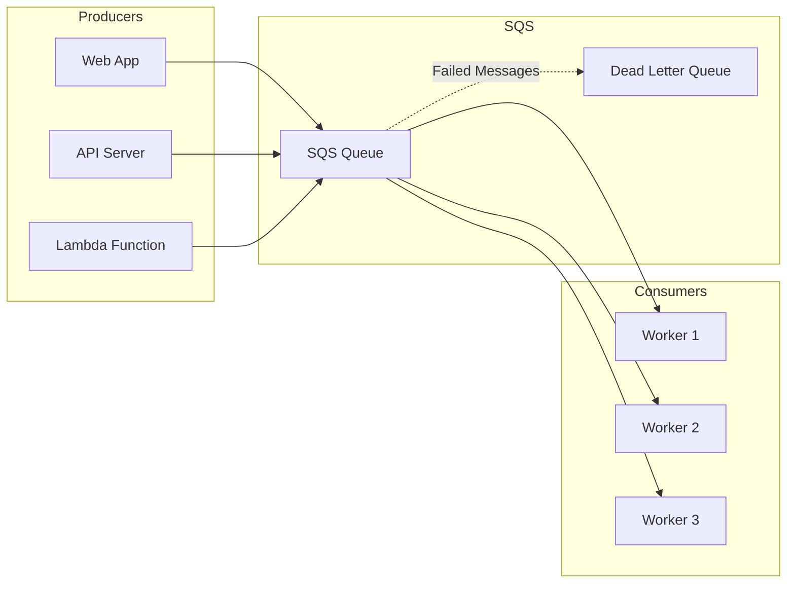
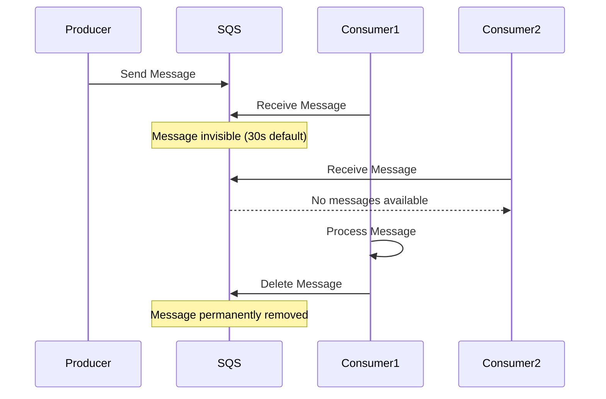

# How to Get Started with AWS SQS

Author: [nawazdhandala](https://www.github.com/nawazdhandala)

Tags: AWS, SQS, Queue, Messaging

Description: Learn how to get started with Amazon SQS for building scalable, decoupled applications with reliable message queuing.

---

> Message queues are the backbone of distributed systems. They let services communicate without tight coupling, handle traffic spikes gracefully, and ensure messages are never lost. AWS SQS is one of the most battle-tested message queuing services available.

Amazon Simple Queue Service (SQS) has been around since 2006, making it one of AWS's oldest services. It handles trillions of messages per week across AWS customers. Whether you're building microservices, processing background jobs, or decoupling application components, SQS is a solid choice.

---

## What is AWS SQS?

SQS is a fully managed message queuing service. You don't need to provision servers, worry about scaling, or handle message persistence. AWS takes care of all that.

There are two types of SQS queues:

| Feature | Standard Queue | FIFO Queue |
|---------|---------------|------------|
| Throughput | Nearly unlimited | 300-3000 messages/second |
| Ordering | Best-effort | Strict FIFO |
| Delivery | At-least-once | Exactly-once |
| Use case | High throughput, order not critical | Order matters, no duplicates |

---

## Architecture Overview

Here's how SQS fits into a typical architecture:



---

## Setting Up SQS

### Prerequisites

You'll need:
- An AWS account
- AWS CLI installed and configured
- Python 3.8+ (or Node.js if you prefer)

### Creating a Queue via AWS Console

1. Open the SQS console at https://console.aws.amazon.com/sqs
2. Click "Create queue"
3. Choose queue type (Standard or FIFO)
4. Name your queue (FIFO queues must end with `.fifo`)
5. Configure settings (defaults work fine for testing)
6. Click "Create queue"

### Creating a Queue via CLI

Create a standard queue with the AWS CLI. This is great for automation and infrastructure-as-code workflows:

```bash
# Create a standard queue
aws sqs create-queue \
    --queue-name my-application-queue \
    --attributes '{
        "DelaySeconds": "0",
        "MessageRetentionPeriod": "345600",
        "VisibilityTimeout": "30",
        "ReceiveMessageWaitTimeSeconds": "20"
    }'

# Create a FIFO queue (name must end with .fifo)
aws sqs create-queue \
    --queue-name my-application-queue.fifo \
    --attributes '{
        "FifoQueue": "true",
        "ContentBasedDeduplication": "true"
    }'
```

---

## Working with SQS in Python

### Installation

Install the AWS SDK for Python (boto3):

```bash
pip install boto3
```

### Basic Setup

Create an SQS client and get your queue URL. The queue URL is required for all operations:

```python
# sqs_client.py
import boto3
import json
import os

# Create SQS client
# Credentials are loaded from environment variables or ~/.aws/credentials
sqs = boto3.client(
    'sqs',
    region_name=os.getenv('AWS_REGION', 'us-east-1')
)

# Get queue URL by name
# You'll need this URL for sending and receiving messages
def get_queue_url(queue_name):
    response = sqs.get_queue_url(QueueName=queue_name)
    return response['QueueUrl']

QUEUE_URL = get_queue_url('my-application-queue')
```

### Sending Messages

Send a single message to the queue. Messages can contain any string data up to 256KB:

```python
# send_message.py
import boto3
import json

sqs = boto3.client('sqs', region_name='us-east-1')
QUEUE_URL = 'https://sqs.us-east-1.amazonaws.com/123456789/my-application-queue'

def send_message(message_body, attributes=None):
    """
    Send a single message to the queue.

    Args:
        message_body: String content of the message (max 256KB)
        attributes: Optional dict of message attributes for filtering

    Returns:
        Message ID of the sent message
    """
    params = {
        'QueueUrl': QUEUE_URL,
        'MessageBody': json.dumps(message_body) if isinstance(message_body, dict) else message_body
    }

    # Add message attributes if provided
    # Attributes allow consumers to filter messages without parsing the body
    if attributes:
        params['MessageAttributes'] = {
            key: {'DataType': 'String', 'StringValue': str(value)}
            for key, value in attributes.items()
        }

    response = sqs.send_message(**params)
    return response['MessageId']


# Example: Send an order processing message
message_id = send_message(
    message_body={
        'order_id': 'ORD-12345',
        'customer_id': 'CUST-789',
        'items': [
            {'sku': 'WIDGET-001', 'quantity': 2},
            {'sku': 'GADGET-002', 'quantity': 1}
        ],
        'total': 99.99
    },
    attributes={
        'event_type': 'order_created',
        'priority': 'high'
    }
)
print(f"Sent message: {message_id}")
```

### Sending Messages in Batches

Batch sending is more efficient when you have multiple messages. You can send up to 10 messages per batch:

```python
# batch_send.py
def send_messages_batch(messages):
    """
    Send multiple messages in a single API call.
    More efficient than individual sends - reduces API calls and latency.

    Args:
        messages: List of dicts with 'body' and optional 'attributes' keys

    Returns:
        Tuple of (successful_ids, failed_ids)
    """
    # SQS allows max 10 messages per batch
    entries = []
    for i, msg in enumerate(messages[:10]):
        entry = {
            'Id': str(i),  # Unique ID within this batch
            'MessageBody': json.dumps(msg['body']) if isinstance(msg['body'], dict) else msg['body']
        }

        if msg.get('attributes'):
            entry['MessageAttributes'] = {
                key: {'DataType': 'String', 'StringValue': str(value)}
                for key, value in msg['attributes'].items()
            }

        entries.append(entry)

    response = sqs.send_message_batch(
        QueueUrl=QUEUE_URL,
        Entries=entries
    )

    successful = [r['MessageId'] for r in response.get('Successful', [])]
    failed = [r['Id'] for r in response.get('Failed', [])]

    return successful, failed


# Example: Send multiple events at once
messages = [
    {'body': {'event': 'user_signup', 'user_id': 'U001'}},
    {'body': {'event': 'user_signup', 'user_id': 'U002'}},
    {'body': {'event': 'order_placed', 'order_id': 'O001'}, 'attributes': {'priority': 'high'}},
]
successful, failed = send_messages_batch(messages)
print(f"Sent: {len(successful)}, Failed: {len(failed)}")
```

### Receiving Messages

Receive and process messages from the queue. Always use long polling to reduce costs and latency:

```python
# receive_messages.py
def receive_messages(max_messages=10, wait_time=20):
    """
    Receive messages from the queue using long polling.

    Args:
        max_messages: Max messages to receive (1-10)
        wait_time: Long polling wait time in seconds (0-20)

    Returns:
        List of message dicts with Body and ReceiptHandle
    """
    response = sqs.receive_message(
        QueueUrl=QUEUE_URL,
        MaxNumberOfMessages=max_messages,
        WaitTimeSeconds=wait_time,  # Long polling - wait up to 20s for messages
        MessageAttributeNames=['All'],  # Fetch all message attributes
        AttributeNames=['All']  # Fetch all system attributes
    )

    return response.get('Messages', [])


def delete_message(receipt_handle):
    """
    Delete a message after successful processing.
    Must be called before visibility timeout expires.
    """
    sqs.delete_message(
        QueueUrl=QUEUE_URL,
        ReceiptHandle=receipt_handle
    )


def process_messages():
    """
    Main message processing loop.
    Receives messages, processes them, and deletes on success.
    """
    while True:
        messages = receive_messages()

        for message in messages:
            try:
                # Parse the message body
                body = json.loads(message['Body'])
                print(f"Processing: {body}")

                # Your processing logic here
                handle_message(body)

                # Delete message only after successful processing
                # If we crash before this, the message becomes visible again
                delete_message(message['ReceiptHandle'])
                print(f"Processed and deleted message")

            except Exception as e:
                # Don't delete on failure - message will become visible again
                # after visibility timeout expires
                print(f"Error processing message: {e}")


def handle_message(body):
    """Implement your message handling logic here."""
    event_type = body.get('event')
    if event_type == 'user_signup':
        # Send welcome email, create profile, etc.
        pass
    elif event_type == 'order_placed':
        # Process order, update inventory, etc.
        pass
```

---

## Working with SQS in Node.js

### Installation

Install the AWS SDK v3 for Node.js:

```bash
npm install @aws-sdk/client-sqs
```

### Sending and Receiving Messages

Complete example showing how to send and receive messages in Node.js:

```javascript
// sqs-client.js
const {
    SQSClient,
    SendMessageCommand,
    ReceiveMessageCommand,
    DeleteMessageCommand
} = require('@aws-sdk/client-sqs');

// Create SQS client
const sqs = new SQSClient({ region: process.env.AWS_REGION || 'us-east-1' });
const QUEUE_URL = process.env.SQS_QUEUE_URL;

/**
 * Send a message to the queue
 * @param {Object} messageBody - The message content (will be JSON stringified)
 * @param {Object} attributes - Optional message attributes
 * @returns {Promise<string>} Message ID
 */
async function sendMessage(messageBody, attributes = {}) {
    const params = {
        QueueUrl: QUEUE_URL,
        MessageBody: JSON.stringify(messageBody),
        MessageAttributes: {}
    };

    // Convert attributes to SQS format
    for (const [key, value] of Object.entries(attributes)) {
        params.MessageAttributes[key] = {
            DataType: 'String',
            StringValue: String(value)
        };
    }

    const command = new SendMessageCommand(params);
    const response = await sqs.send(command);
    return response.MessageId;
}

/**
 * Receive messages from the queue with long polling
 * @param {number} maxMessages - Maximum messages to receive (1-10)
 * @returns {Promise<Array>} Array of messages
 */
async function receiveMessages(maxMessages = 10) {
    const command = new ReceiveMessageCommand({
        QueueUrl: QUEUE_URL,
        MaxNumberOfMessages: maxMessages,
        WaitTimeSeconds: 20,  // Long polling
        MessageAttributeNames: ['All'],
        AttributeNames: ['All']
    });

    const response = await sqs.send(command);
    return response.Messages || [];
}

/**
 * Delete a message after successful processing
 * @param {string} receiptHandle - The receipt handle from the received message
 */
async function deleteMessage(receiptHandle) {
    const command = new DeleteMessageCommand({
        QueueUrl: QUEUE_URL,
        ReceiptHandle: receiptHandle
    });
    await sqs.send(command);
}

/**
 * Main processing loop
 */
async function processMessages() {
    console.log('Starting message processor...');

    while (true) {
        try {
            const messages = await receiveMessages();

            for (const message of messages) {
                try {
                    const body = JSON.parse(message.Body);
                    console.log('Processing:', body);

                    // Your processing logic here
                    await handleMessage(body);

                    // Delete only after successful processing
                    await deleteMessage(message.ReceiptHandle);
                    console.log('Message processed and deleted');

                } catch (err) {
                    console.error('Error processing message:', err);
                    // Message will become visible again after visibility timeout
                }
            }
        } catch (err) {
            console.error('Error receiving messages:', err);
            await new Promise(resolve => setTimeout(resolve, 5000));
        }
    }
}

async function handleMessage(body) {
    // Implement your business logic here
    console.log('Handling:', body);
}

module.exports = { sendMessage, receiveMessages, deleteMessage, processMessages };
```

---

## Visibility Timeout

When a consumer receives a message, it becomes invisible to other consumers. This prevents multiple consumers from processing the same message:



Adjust visibility timeout based on your processing time:

```python
# Extend visibility timeout if processing takes longer than expected
def extend_visibility(receipt_handle, timeout_seconds):
    """
    Extend the visibility timeout for a message being processed.
    Call this if you need more time to process a message.
    """
    sqs.change_message_visibility(
        QueueUrl=QUEUE_URL,
        ReceiptHandle=receipt_handle,
        VisibilityTimeout=timeout_seconds
    )

# Example: Extend timeout to 5 minutes during processing
extend_visibility(message['ReceiptHandle'], 300)
```

---

## Dead Letter Queues

Dead Letter Queues (DLQ) capture messages that fail processing repeatedly. This prevents poison messages from blocking your queue:

```python
# Create a DLQ and configure the source queue to use it
import boto3
import json

sqs = boto3.client('sqs', region_name='us-east-1')

# Step 1: Create the Dead Letter Queue
dlq_response = sqs.create_queue(
    QueueName='my-application-dlq',
    Attributes={
        'MessageRetentionPeriod': '1209600'  # 14 days - keep failed messages longer
    }
)
dlq_url = dlq_response['QueueUrl']

# Step 2: Get the DLQ ARN (needed for redrive policy)
dlq_attributes = sqs.get_queue_attributes(
    QueueUrl=dlq_url,
    AttributeNames=['QueueArn']
)
dlq_arn = dlq_attributes['Attributes']['QueueArn']

# Step 3: Configure the source queue to send failed messages to DLQ
# maxReceiveCount: how many times a message can be received before going to DLQ
sqs.set_queue_attributes(
    QueueUrl=QUEUE_URL,
    Attributes={
        'RedrivePolicy': json.dumps({
            'deadLetterTargetArn': dlq_arn,
            'maxReceiveCount': 3  # After 3 failed attempts, move to DLQ
        })
    }
)
```

### Processing DLQ Messages

Periodically check your DLQ and handle failed messages:

```python
def process_dlq():
    """
    Process messages from the Dead Letter Queue.
    These are messages that failed multiple times.
    """
    dlq_url = 'https://sqs.us-east-1.amazonaws.com/123456789/my-application-dlq'

    while True:
        messages = sqs.receive_message(
            QueueUrl=dlq_url,
            MaxNumberOfMessages=10,
            WaitTimeSeconds=20,
            AttributeNames=['All']
        ).get('Messages', [])

        for message in messages:
            body = json.loads(message['Body'])

            # Log the failure for investigation
            print(f"DLQ Message: {body}")
            print(f"Receive count: {message['Attributes'].get('ApproximateReceiveCount')}")

            # Options for handling DLQ messages:
            # 1. Fix and reprocess
            # 2. Alert operations team
            # 3. Store in database for manual review
            # 4. Discard if no longer relevant

            handle_failed_message(body)

            # Delete from DLQ after handling
            sqs.delete_message(
                QueueUrl=dlq_url,
                ReceiptHandle=message['ReceiptHandle']
            )
```

---

## FIFO Queues

FIFO queues guarantee exactly-once processing and strict ordering. Use them when message order matters:

```python
# Working with FIFO queues
FIFO_QUEUE_URL = 'https://sqs.us-east-1.amazonaws.com/123456789/orders.fifo'

def send_fifo_message(message_body, group_id, deduplication_id=None):
    """
    Send a message to a FIFO queue.

    Args:
        message_body: The message content
        group_id: Messages with the same group_id are processed in order
        deduplication_id: Unique ID to prevent duplicates (optional if content-based dedup enabled)
    """
    params = {
        'QueueUrl': FIFO_QUEUE_URL,
        'MessageBody': json.dumps(message_body),
        'MessageGroupId': group_id  # Required for FIFO queues
    }

    # Deduplication ID prevents duplicate sends within 5-minute window
    if deduplication_id:
        params['MessageDeduplicationId'] = deduplication_id

    response = sqs.send_message(**params)
    return response['MessageId']


# Example: Process orders for each customer in order
# Orders for customer-123 are processed in sequence
# Orders for customer-456 are processed in sequence (independently)
send_fifo_message(
    message_body={'order_id': 'O001', 'action': 'create'},
    group_id='customer-123',
    deduplication_id='O001-create'
)

send_fifo_message(
    message_body={'order_id': 'O001', 'action': 'update'},
    group_id='customer-123',
    deduplication_id='O001-update'
)

# This can process in parallel with customer-123 orders
send_fifo_message(
    message_body={'order_id': 'O002', 'action': 'create'},
    group_id='customer-456',
    deduplication_id='O002-create'
)
```

---

## Best Practices

### 1. Always Use Long Polling

Long polling reduces costs and latency by waiting for messages instead of returning immediately:

```python
# Good: Long polling - waits up to 20 seconds for messages
response = sqs.receive_message(
    QueueUrl=QUEUE_URL,
    WaitTimeSeconds=20  # Long poll
)

# Bad: Short polling - returns immediately, even if empty
response = sqs.receive_message(
    QueueUrl=QUEUE_URL,
    WaitTimeSeconds=0  # Short poll - more API calls, higher costs
)
```

### 2. Handle Idempotency

Messages may be delivered more than once (especially in Standard queues). Make your processing idempotent:

```python
def process_order(order_id):
    """
    Process an order idempotently.
    Check if already processed before doing work.
    """
    # Check if already processed
    if is_order_processed(order_id):
        print(f"Order {order_id} already processed, skipping")
        return

    # Process the order
    result = do_order_processing(order_id)

    # Mark as processed (use database transaction)
    mark_order_processed(order_id)

    return result
```

### 3. Set Appropriate Timeouts

Match visibility timeout to your processing time:

```python
# Queue attributes for different workloads
# Quick tasks: 30 seconds
quick_task_attributes = {
    'VisibilityTimeout': '30'
}

# Long-running tasks: 5 minutes
long_task_attributes = {
    'VisibilityTimeout': '300'
}
```

### 4. Monitor Queue Depth

Track queue metrics to detect backlogs:

```python
def get_queue_stats():
    """Get queue statistics for monitoring."""
    response = sqs.get_queue_attributes(
        QueueUrl=QUEUE_URL,
        AttributeNames=[
            'ApproximateNumberOfMessages',  # Messages waiting
            'ApproximateNumberOfMessagesNotVisible',  # Messages being processed
            'ApproximateNumberOfMessagesDelayed'  # Messages in delay
        ]
    )

    attrs = response['Attributes']
    return {
        'messages_available': int(attrs['ApproximateNumberOfMessages']),
        'messages_in_flight': int(attrs['ApproximateNumberOfMessagesNotVisible']),
        'messages_delayed': int(attrs['ApproximateNumberOfMessagesDelayed'])
    }

# Alert if queue is backing up
stats = get_queue_stats()
if stats['messages_available'] > 10000:
    send_alert(f"Queue backlog: {stats['messages_available']} messages")
```

---

## Pricing

SQS pricing is straightforward:

| Component | Cost |
|-----------|------|
| First 1M requests/month | Free |
| Standard queue requests | $0.40 per million |
| FIFO queue requests | $0.50 per million |
| Data transfer | Standard AWS rates |

Tips to reduce costs:
- Use long polling (fewer API calls)
- Batch send/receive/delete operations
- Delete messages promptly after processing

---

## Conclusion

AWS SQS is a reliable, scalable message queuing service that works well for most use cases. Key takeaways:

- **Standard queues** for high throughput when order doesn't matter
- **FIFO queues** when you need strict ordering or exactly-once processing
- **Long polling** reduces costs and latency
- **Dead Letter Queues** prevent poison messages from blocking processing
- **Visibility timeout** prevents duplicate processing

SQS integrates well with Lambda, SNS, and other AWS services, making it a natural choice for AWS-based architectures.

---

*Want to monitor your SQS queues and get alerted on backlogs? [OneUptime](https://oneuptime.com) provides AWS infrastructure monitoring with queue depth tracking and custom alerting to keep your message pipelines healthy.*
