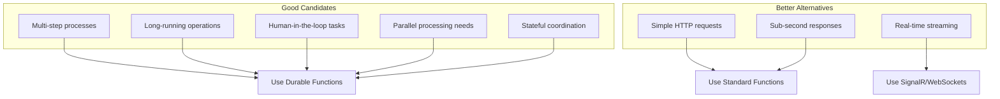
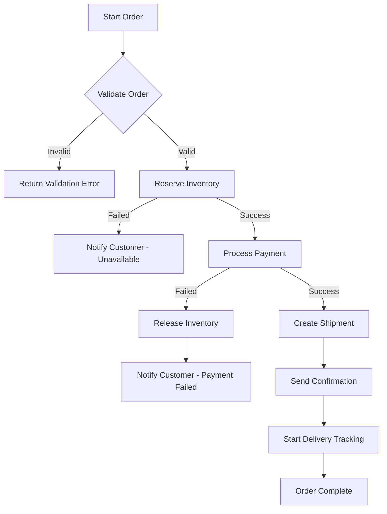
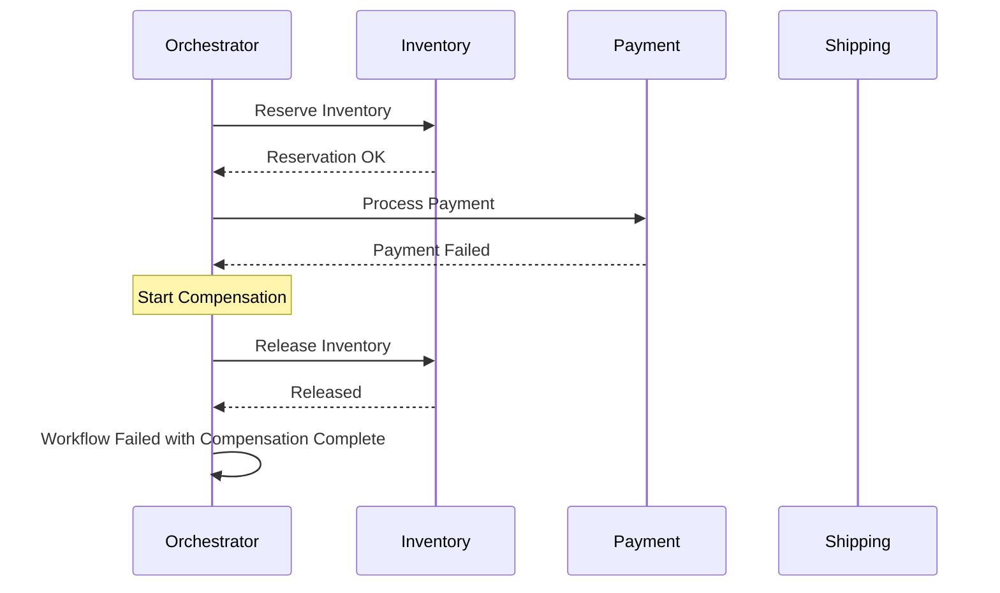
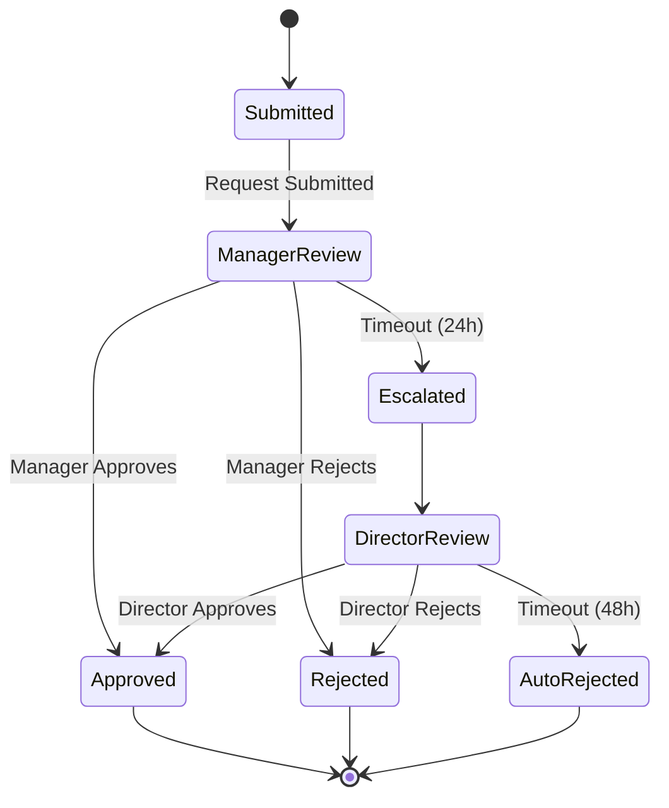
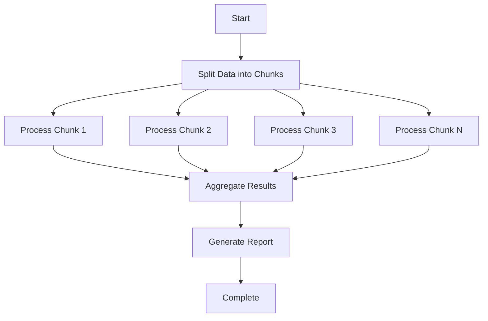

# How to Use Durable Functions for Workflows

Author: [nawazdhandala](https://github.com/nawazdhandala)

Tags: Azure, Durable Functions, Workflows, Serverless

Description: Master Azure Durable Functions for building complex, stateful workflows with practical patterns including saga transactions, long-running processes, and event-driven architectures.

---

Building workflows in serverless environments presents unique challenges. Traditional Azure Functions are stateless and have execution timeouts, making them unsuitable for complex business processes that span minutes, hours, or even days. Azure Durable Functions solve this by providing a programming model for writing stateful, long-running workflows while maintaining the benefits of serverless computing.

This guide focuses on implementing production-ready workflows using Durable Functions, covering advanced patterns, error handling strategies, and real-world implementations you can adapt for your applications.

## Understanding Workflow Requirements

Before diving into implementation, let's understand what makes a good workflow candidate for Durable Functions:



Durable Functions excel when your workflow requires:

- **State persistence**: The workflow needs to remember where it is across multiple steps
- **Long execution times**: Processes that run for minutes, hours, or days
- **External event handling**: Waiting for human approval, webhooks, or other systems
- **Parallel execution**: Running multiple activities concurrently and aggregating results
- **Reliable error recovery**: Automatic checkpointing and replay on failures

## Project Setup for Workflow Development

Let's set up a project structure optimized for workflow development.

### Initialize the Project

Start by creating a new Durable Functions project with the proper dependencies and folder structure.

```bash
# Create project directory
mkdir workflow-functions
cd workflow-functions

# Initialize TypeScript Functions project
func init --worker-runtime node --language typescript

# Install required packages
npm install durable-functions @azure/functions

# Install development dependencies
npm install -D typescript @types/node ts-node
```

### Project Structure

Organize your code by workflow domain rather than function type to improve maintainability.

```
workflow-functions/
├── src/
│   ├── workflows/
│   │   ├── order-processing/
│   │   │   ├── orchestrator.ts
│   │   │   ├── activities.ts
│   │   │   └── types.ts
│   │   ├── document-approval/
│   │   │   ├── orchestrator.ts
│   │   │   ├── activities.ts
│   │   │   └── types.ts
│   │   └── data-pipeline/
│   │       ├── orchestrator.ts
│   │       ├── activities.ts
│   │       └── types.ts
│   ├── shared/
│   │   ├── retry-policies.ts
│   │   ├── logging.ts
│   │   └── error-handling.ts
│   └── http/
│       ├── workflow-starter.ts
│       └── workflow-status.ts
├── host.json
├── local.settings.json
└── package.json
```

### Configuration Files

Configure your host.json to optimize workflow execution. These settings control concurrency, timeouts, and storage behavior.

```json
{
    "version": "2.0",
    "extensions": {
        "durableTask": {
            "storageProvider": {
                "connectionStringName": "AzureWebJobsStorage",
                "partitionCount": 4
            },
            "maxConcurrentActivityFunctions": 10,
            "maxConcurrentOrchestratorFunctions": 5,
            "extendedSessionsEnabled": true,
            "extendedSessionIdleTimeoutInSeconds": 30,
            "useAppLease": true,
            "useGracefulShutdown": true
        }
    },
    "logging": {
        "logLevel": {
            "DurableTask.AzureStorage": "Warning",
            "DurableTask.Core": "Warning",
            "Host.Triggers.DurableTask": "Information"
        }
    },
    "functionTimeout": "00:10:00"
}
```

## Building a Production Workflow: Order Processing

Let's build a comprehensive order processing workflow that demonstrates key patterns. This workflow handles inventory checks, payment processing, fulfillment, and notifications with proper error handling.

### Workflow Architecture



### Type Definitions

Define clear interfaces for workflow inputs and outputs to ensure type safety throughout the orchestration.

```typescript
// src/workflows/order-processing/types.ts

// Input structure for starting an order workflow
export interface OrderInput {
    orderId: string;
    customerId: string;
    customerEmail: string;
    items: OrderItem[];
    shippingAddress: ShippingAddress;
    paymentDetails: PaymentDetails;
}

export interface OrderItem {
    productId: string;
    sku: string;
    name: string;
    quantity: number;
    unitPrice: number;
}

export interface ShippingAddress {
    street: string;
    city: string;
    state: string;
    zipCode: string;
    country: string;
}

export interface PaymentDetails {
    method: 'credit_card' | 'paypal' | 'bank_transfer';
    token: string;
}

// Activity result types
export interface InventoryReservation {
    reservationId: string;
    items: Array<{
        productId: string;
        quantity: number;
        warehouseId: string;
    }>;
    expiresAt: string;
}

export interface PaymentResult {
    transactionId: string;
    amount: number;
    currency: string;
    status: 'completed' | 'pending' | 'failed';
    processedAt: string;
}

export interface ShipmentResult {
    shipmentId: string;
    trackingNumber: string;
    carrier: string;
    estimatedDelivery: string;
}

// Final workflow output
export interface OrderResult {
    orderId: string;
    status: 'completed' | 'failed' | 'cancelled';
    inventoryReservation?: InventoryReservation;
    payment?: PaymentResult;
    shipment?: ShipmentResult;
    failureReason?: string;
    completedAt: string;
}
```

### The Orchestrator Function

The orchestrator coordinates the entire workflow. Note that it must be deterministic and should not perform any I/O operations directly.

```typescript
// src/workflows/order-processing/orchestrator.ts
import * as df from 'durable-functions';
import { OrchestrationContext, OrchestrationHandler, RetryOptions } from 'durable-functions';
import {
    OrderInput,
    OrderResult,
    InventoryReservation,
    PaymentResult,
    ShipmentResult
} from './types';

// Configure retry policy for transient failures
// Activities will retry up to 5 times with exponential backoff
const defaultRetryOptions: RetryOptions = new df.RetryOptions(
    5000,   // First retry after 5 seconds
    5       // Maximum 5 attempts
);
defaultRetryOptions.backoffCoefficient = 2;
defaultRetryOptions.maxRetryInterval = 60000;

// More aggressive retry for critical operations like payments
const paymentRetryOptions: RetryOptions = new df.RetryOptions(
    2000,   // First retry after 2 seconds
    3       // Maximum 3 attempts - fail fast for payments
);
paymentRetryOptions.backoffCoefficient = 2;
paymentRetryOptions.maxRetryInterval = 10000;

const orderProcessingOrchestrator: OrchestrationHandler = function* (
    context: OrchestrationContext
): Generator<unknown, OrderResult, unknown> {
    const order = context.df.getInput() as OrderInput;

    // Track workflow progress with custom status
    // This status is queryable from external clients
    context.df.setCustomStatus({
        stage: 'started',
        orderId: order.orderId
    });

    let inventoryReservation: InventoryReservation | undefined;
    let paymentResult: PaymentResult | undefined;
    let shipmentResult: ShipmentResult | undefined;

    try {
        // Step 1: Validate the order
        // This is a quick check, so no retry needed
        context.df.setCustomStatus({ stage: 'validating', orderId: order.orderId });

        const isValid: boolean = yield context.df.callActivity(
            'validateOrder',
            order
        );

        if (!isValid) {
            return {
                orderId: order.orderId,
                status: 'failed',
                failureReason: 'Order validation failed',
                completedAt: context.df.currentUtcDateTime.toISOString()
            };
        }

        // Step 2: Reserve inventory
        // Use retry policy for potential transient failures
        context.df.setCustomStatus({ stage: 'reserving_inventory', orderId: order.orderId });

        inventoryReservation = yield context.df.callActivityWithRetry(
            'reserveInventory',
            defaultRetryOptions,
            {
                orderId: order.orderId,
                items: order.items
            }
        );

        // Step 3: Process payment
        // Payment has its own retry policy with fewer attempts
        context.df.setCustomStatus({ stage: 'processing_payment', orderId: order.orderId });

        try {
            paymentResult = yield context.df.callActivityWithRetry(
                'processPayment',
                paymentRetryOptions,
                {
                    orderId: order.orderId,
                    customerId: order.customerId,
                    amount: calculateOrderTotal(order.items),
                    paymentDetails: order.paymentDetails
                }
            );
        } catch (paymentError) {
            // Payment failed - compensate by releasing inventory
            context.df.setCustomStatus({
                stage: 'compensating',
                orderId: order.orderId,
                reason: 'payment_failed'
            });

            yield context.df.callActivity(
                'releaseInventory',
                { reservationId: inventoryReservation.reservationId }
            );

            // Notify customer about the failure
            yield context.df.callActivity(
                'sendNotification',
                {
                    type: 'payment_failed',
                    email: order.customerEmail,
                    orderId: order.orderId
                }
            );

            return {
                orderId: order.orderId,
                status: 'failed',
                inventoryReservation,
                failureReason: 'Payment processing failed',
                completedAt: context.df.currentUtcDateTime.toISOString()
            };
        }

        // Step 4: Create shipment
        context.df.setCustomStatus({ stage: 'creating_shipment', orderId: order.orderId });

        shipmentResult = yield context.df.callActivityWithRetry(
            'createShipment',
            defaultRetryOptions,
            {
                orderId: order.orderId,
                items: order.items,
                address: order.shippingAddress,
                reservationId: inventoryReservation.reservationId
            }
        );

        // Step 5: Send confirmation and start tracking
        // These can run in parallel since they are independent
        context.df.setCustomStatus({ stage: 'finalizing', orderId: order.orderId });

        const confirmationTask = context.df.callActivity(
            'sendNotification',
            {
                type: 'order_confirmed',
                email: order.customerEmail,
                orderId: order.orderId,
                trackingNumber: shipmentResult.trackingNumber
            }
        );

        const trackingTask = context.df.callSubOrchestrator(
            'deliveryTrackingOrchestrator',
            {
                shipmentId: shipmentResult.shipmentId,
                trackingNumber: shipmentResult.trackingNumber,
                customerEmail: order.customerEmail
            }
        );

        // Wait for both tasks to complete
        yield context.df.Task.all([confirmationTask, trackingTask]);

        context.df.setCustomStatus({ stage: 'completed', orderId: order.orderId });

        return {
            orderId: order.orderId,
            status: 'completed',
            inventoryReservation,
            payment: paymentResult,
            shipment: shipmentResult,
            completedAt: context.df.currentUtcDateTime.toISOString()
        };

    } catch (error) {
        // Handle unexpected errors with compensation
        context.df.setCustomStatus({
            stage: 'error',
            orderId: order.orderId,
            error: error instanceof Error ? error.message : 'Unknown error'
        });

        // Compensate any completed steps
        if (inventoryReservation) {
            yield context.df.callActivity(
                'releaseInventory',
                { reservationId: inventoryReservation.reservationId }
            );
        }

        if (paymentResult && paymentResult.status === 'completed') {
            yield context.df.callActivity(
                'refundPayment',
                { transactionId: paymentResult.transactionId }
            );
        }

        yield context.df.callActivity(
            'sendNotification',
            {
                type: 'order_failed',
                email: order.customerEmail,
                orderId: order.orderId
            }
        );

        return {
            orderId: order.orderId,
            status: 'failed',
            inventoryReservation,
            payment: paymentResult,
            failureReason: error instanceof Error ? error.message : 'Unknown error',
            completedAt: context.df.currentUtcDateTime.toISOString()
        };
    }
};

// Helper function to calculate total
// This is safe to call in orchestrator since it uses only the input data
function calculateOrderTotal(items: Array<{ quantity: number; unitPrice: number }>): number {
    return items.reduce((sum, item) => sum + (item.quantity * item.unitPrice), 0);
}

df.app.orchestration('orderProcessingOrchestrator', orderProcessingOrchestrator);
```

### Activity Functions

Activities perform the actual work. They can make HTTP calls, access databases, and perform any I/O operations.

```typescript
// src/workflows/order-processing/activities.ts
import * as df from 'durable-functions';
import { ActivityHandler } from 'durable-functions';

// Validate order data and business rules
// This activity checks inventory availability and customer eligibility
const validateOrder: ActivityHandler = async (orderInput: {
    orderId: string;
    customerId: string;
    items: Array<{ productId: string; quantity: number; unitPrice: number }>;
}): Promise<boolean> => {

    // Check for empty order
    if (!orderInput.items || orderInput.items.length === 0) {
        console.log(`Order ${orderInput.orderId}: No items in order`);
        return false;
    }

    // Validate quantities and prices
    for (const item of orderInput.items) {
        if (item.quantity <= 0) {
            console.log(`Order ${orderInput.orderId}: Invalid quantity for ${item.productId}`);
            return false;
        }
        if (item.unitPrice <= 0) {
            console.log(`Order ${orderInput.orderId}: Invalid price for ${item.productId}`);
            return false;
        }
    }

    // In production, add calls to:
    // - Customer service to verify account status
    // - Fraud detection service
    // - Address validation service

    console.log(`Order ${orderInput.orderId}: Validation passed`);
    return true;
};

df.app.activity('validateOrder', { handler: validateOrder });

// Reserve inventory across warehouses
// Uses a reservation pattern to hold items until order completes
const reserveInventory: ActivityHandler = async (input: {
    orderId: string;
    items: Array<{ productId: string; quantity: number }>;
}): Promise<{
    reservationId: string;
    items: Array<{ productId: string; quantity: number; warehouseId: string }>;
    expiresAt: string;
}> => {

    console.log(`Reserving inventory for order ${input.orderId}`);

    // In production, this would call your inventory management system
    // Example: await inventoryService.createReservation(input.items);

    const reservationId = `res_${Date.now()}_${input.orderId}`;
    const expiresAt = new Date(Date.now() + 30 * 60 * 1000).toISOString(); // 30 minutes

    // Simulate warehouse allocation
    const reservedItems = input.items.map(item => ({
        productId: item.productId,
        quantity: item.quantity,
        warehouseId: 'WH-001' // Would be determined by inventory system
    }));

    console.log(`Reservation ${reservationId} created for order ${input.orderId}`);

    return {
        reservationId,
        items: reservedItems,
        expiresAt
    };
};

df.app.activity('reserveInventory', { handler: reserveInventory });

// Release inventory reservation when order fails or is cancelled
const releaseInventory: ActivityHandler = async (input: {
    reservationId: string;
}): Promise<{ success: boolean }> => {

    console.log(`Releasing inventory reservation ${input.reservationId}`);

    // In production: await inventoryService.releaseReservation(input.reservationId);

    return { success: true };
};

df.app.activity('releaseInventory', { handler: releaseInventory });

// Process payment through payment gateway
// Handles credit card, PayPal, and bank transfer methods
const processPayment: ActivityHandler = async (input: {
    orderId: string;
    customerId: string;
    amount: number;
    paymentDetails: { method: string; token: string };
}): Promise<{
    transactionId: string;
    amount: number;
    currency: string;
    status: 'completed' | 'pending' | 'failed';
    processedAt: string;
}> => {

    console.log(`Processing payment for order ${input.orderId}, amount: $${input.amount}`);

    // In production, integrate with Stripe, PayPal, or other providers
    // Example with Stripe:
    // const stripe = require('stripe')(process.env.STRIPE_SECRET_KEY);
    // const charge = await stripe.paymentIntents.create({
    //     amount: Math.round(input.amount * 100),
    //     currency: 'usd',
    //     payment_method: input.paymentDetails.token,
    //     confirm: true,
    // });

    // Simulate payment processing delay
    await new Promise(resolve => setTimeout(resolve, 500));

    const transactionId = `txn_${Date.now()}_${input.orderId}`;

    console.log(`Payment completed: ${transactionId}`);

    return {
        transactionId,
        amount: input.amount,
        currency: 'USD',
        status: 'completed',
        processedAt: new Date().toISOString()
    };
};

df.app.activity('processPayment', { handler: processPayment });

// Refund a completed payment
const refundPayment: ActivityHandler = async (input: {
    transactionId: string;
}): Promise<{ refundId: string; status: string }> => {

    console.log(`Refunding transaction ${input.transactionId}`);

    // In production: await paymentGateway.refund(input.transactionId);

    return {
        refundId: `ref_${Date.now()}`,
        status: 'completed'
    };
};

df.app.activity('refundPayment', { handler: refundPayment });

// Create shipment with carrier
const createShipment: ActivityHandler = async (input: {
    orderId: string;
    items: Array<{ productId: string; quantity: number }>;
    address: {
        street: string;
        city: string;
        state: string;
        zipCode: string;
        country: string;
    };
    reservationId: string;
}): Promise<{
    shipmentId: string;
    trackingNumber: string;
    carrier: string;
    estimatedDelivery: string;
}> => {

    console.log(`Creating shipment for order ${input.orderId}`);

    // In production, integrate with shipping providers
    // Example: FedEx, UPS, USPS APIs

    const shipmentId = `ship_${Date.now()}_${input.orderId}`;
    const trackingNumber = `TRK${Date.now()}`;

    // Calculate estimated delivery (3-5 business days)
    const estimatedDelivery = new Date(Date.now() + 5 * 24 * 60 * 60 * 1000).toISOString();

    console.log(`Shipment created: ${shipmentId}, tracking: ${trackingNumber}`);

    return {
        shipmentId,
        trackingNumber,
        carrier: 'FedEx',
        estimatedDelivery
    };
};

df.app.activity('createShipment', { handler: createShipment });

// Send notifications via email, SMS, or push
const sendNotification: ActivityHandler = async (input: {
    type: string;
    email: string;
    orderId: string;
    trackingNumber?: string;
}): Promise<{ sent: boolean; timestamp: string }> => {

    console.log(`Sending ${input.type} notification to ${input.email} for order ${input.orderId}`);

    // In production, integrate with SendGrid, AWS SES, Twilio, etc.
    // Example with SendGrid:
    // const sgMail = require('@sendgrid/mail');
    // await sgMail.send({
    //     to: input.email,
    //     from: 'orders@yourcompany.com',
    //     templateId: getTemplateId(input.type),
    //     dynamicTemplateData: { orderId: input.orderId, trackingNumber: input.trackingNumber }
    // });

    return {
        sent: true,
        timestamp: new Date().toISOString()
    };
};

df.app.activity('sendNotification', { handler: sendNotification });
```

## Implementing the Saga Pattern

The Saga pattern is essential for workflows that need to maintain consistency across multiple services. When a step fails, the saga executes compensating transactions to undo previous steps.



### Saga Orchestrator Implementation

This implementation maintains a compensation stack and executes rollbacks when errors occur.

```typescript
// src/workflows/saga/orchestrator.ts
import * as df from 'durable-functions';
import { OrchestrationContext, OrchestrationHandler } from 'durable-functions';

interface SagaStep {
    name: string;
    activity: string;
    input: unknown;
    compensationActivity: string;
    compensationInput?: unknown;
}

interface SagaResult {
    success: boolean;
    completedSteps: string[];
    failedStep?: string;
    error?: string;
    compensationsExecuted: string[];
}

// Generic saga orchestrator that handles any sequence of compensatable steps
const sagaOrchestrator: OrchestrationHandler = function* (
    context: OrchestrationContext
): Generator<unknown, SagaResult, unknown> {
    const steps = context.df.getInput() as SagaStep[];

    const completedSteps: Array<{ step: SagaStep; result: unknown }> = [];
    const compensationsExecuted: string[] = [];

    for (const step of steps) {
        context.df.setCustomStatus({
            stage: step.name,
            completedCount: completedSteps.length
        });

        try {
            // Execute the forward action
            const result = yield context.df.callActivity(step.activity, step.input);

            // Store completed step with its result for potential compensation
            completedSteps.push({
                step: {
                    ...step,
                    compensationInput: step.compensationInput || result
                },
                result
            });

        } catch (error) {
            // Step failed - begin compensation in reverse order
            context.df.setCustomStatus({
                stage: 'compensating',
                failedAt: step.name,
                stepsToCompensate: completedSteps.length
            });

            // Execute compensations in reverse order (LIFO)
            for (let i = completedSteps.length - 1; i >= 0; i--) {
                const completedStep = completedSteps[i];

                try {
                    yield context.df.callActivity(
                        completedStep.step.compensationActivity,
                        completedStep.step.compensationInput
                    );
                    compensationsExecuted.push(completedStep.step.name);
                } catch (compensationError) {
                    // Log compensation failure but continue with other compensations
                    // In production, alert on compensation failures for manual intervention
                    console.error(
                        `Compensation failed for ${completedStep.step.name}:`,
                        compensationError
                    );
                }
            }

            return {
                success: false,
                completedSteps: completedSteps.map(s => s.step.name),
                failedStep: step.name,
                error: error instanceof Error ? error.message : 'Unknown error',
                compensationsExecuted
            };
        }
    }

    return {
        success: true,
        completedSteps: completedSteps.map(s => s.step.name),
        compensationsExecuted
    };
};

df.app.orchestration('sagaOrchestrator', sagaOrchestrator);
```

### Using the Saga Orchestrator

Start the saga with a defined sequence of steps.

```typescript
// src/http/start-saga.ts
import { app, HttpRequest, HttpResponseInit, InvocationContext } from '@azure/functions';
import * as df from 'durable-functions';

// HTTP endpoint to start a saga workflow
// Each step defines both the forward action and its compensation
app.http('startSaga', {
    route: 'saga/order/{orderId}',
    methods: ['POST'],
    extraInputs: [df.input.durableClient()],
    handler: async (request: HttpRequest, context: InvocationContext): Promise<HttpResponseInit> => {
        const client = df.getClient(context);
        const orderId = request.params.orderId;
        const body = await request.json() as Record<string, unknown>;

        // Define saga steps with compensation actions
        const sagaSteps = [
            {
                name: 'reserve_inventory',
                activity: 'reserveInventory',
                input: { orderId, items: body.items },
                compensationActivity: 'releaseInventory'
                // compensationInput will be set from activity result
            },
            {
                name: 'charge_payment',
                activity: 'processPayment',
                input: {
                    orderId,
                    customerId: body.customerId,
                    amount: body.total,
                    paymentDetails: body.payment
                },
                compensationActivity: 'refundPayment'
            },
            {
                name: 'create_shipment',
                activity: 'createShipment',
                input: {
                    orderId,
                    items: body.items,
                    address: body.shippingAddress
                },
                compensationActivity: 'cancelShipment'
            },
            {
                name: 'update_order_status',
                activity: 'updateOrderStatus',
                input: { orderId, status: 'completed' },
                compensationActivity: 'updateOrderStatus',
                compensationInput: { orderId, status: 'failed' }
            }
        ];

        const instanceId = await client.startNew('sagaOrchestrator', {
            instanceId: `saga-${orderId}`,
            input: sagaSteps
        });

        return client.createCheckStatusResponse(request, instanceId);
    }
});
```

## Long-Running Approval Workflows

Many business processes require human approval. Durable Functions handle this elegantly with external events and timers.



### Multi-Level Approval Orchestrator

This orchestrator handles approval workflows with timeouts and escalation.

```typescript
// src/workflows/approval/orchestrator.ts
import * as df from 'durable-functions';
import { OrchestrationContext, OrchestrationHandler } from 'durable-functions';

interface ApprovalRequest {
    requestId: string;
    requestType: 'expense' | 'leave' | 'purchase';
    requesterId: string;
    requesterEmail: string;
    amount?: number;
    description: string;
    approvalChain: ApprovalLevel[];
}

interface ApprovalLevel {
    level: number;
    approverEmail: string;
    approverRole: string;
    timeoutHours: number;
    autoApprove?: boolean;
    autoReject?: boolean;
}

interface ApprovalDecision {
    approved: boolean;
    approverEmail: string;
    comments?: string;
    decidedAt: string;
}

interface ApprovalResult {
    requestId: string;
    finalStatus: 'approved' | 'rejected' | 'timeout';
    decisions: ApprovalDecision[];
    completedAt: string;
}

const approvalOrchestrator: OrchestrationHandler = function* (
    context: OrchestrationContext
): Generator<unknown, ApprovalResult, unknown> {
    const request = context.df.getInput() as ApprovalRequest;
    const decisions: ApprovalDecision[] = [];

    context.df.setCustomStatus({
        stage: 'started',
        requestId: request.requestId,
        currentLevel: 0
    });

    // Process each approval level in sequence
    for (const level of request.approvalChain) {
        context.df.setCustomStatus({
            stage: 'awaiting_approval',
            requestId: request.requestId,
            currentLevel: level.level,
            approver: level.approverEmail
        });

        // Send approval request notification
        yield context.df.callActivity('sendApprovalNotification', {
            requestId: request.requestId,
            approverEmail: level.approverEmail,
            requestType: request.requestType,
            description: request.description,
            amount: request.amount,
            requesterEmail: request.requesterEmail
        });

        // Calculate timeout using orchestrator's deterministic time
        const timeoutAt = new Date(
            context.df.currentUtcDateTime.getTime() + level.timeoutHours * 60 * 60 * 1000
        );

        // Create timer task for timeout
        const timerTask = context.df.createTimer(timeoutAt);

        // Create event task for approval response
        // Event name includes request ID to support multiple concurrent approvals
        const approvalEventName = `approval_${request.requestId}_level_${level.level}`;
        const approvalTask = context.df.waitForExternalEvent<ApprovalDecision>(approvalEventName);

        // Race between approval and timeout
        const winner = yield context.df.Task.any([approvalTask, timerTask]);

        if (winner === timerTask) {
            // Timeout occurred
            if (level.autoApprove) {
                // Auto-approve on timeout
                decisions.push({
                    approved: true,
                    approverEmail: 'system',
                    comments: `Auto-approved after ${level.timeoutHours} hour timeout`,
                    decidedAt: context.df.currentUtcDateTime.toISOString()
                });
                continue; // Move to next level
            } else if (level.autoReject) {
                // Auto-reject on timeout
                decisions.push({
                    approved: false,
                    approverEmail: 'system',
                    comments: `Auto-rejected after ${level.timeoutHours} hour timeout`,
                    decidedAt: context.df.currentUtcDateTime.toISOString()
                });

                // Notify requester of rejection
                yield context.df.callActivity('sendRejectionNotification', {
                    requestId: request.requestId,
                    requesterEmail: request.requesterEmail,
                    reason: 'Approval timeout'
                });

                return {
                    requestId: request.requestId,
                    finalStatus: 'timeout',
                    decisions,
                    completedAt: context.df.currentUtcDateTime.toISOString()
                };
            }
            // Default: escalate to next level on timeout
            decisions.push({
                approved: true,
                approverEmail: 'system',
                comments: `Escalated after ${level.timeoutHours} hour timeout`,
                decidedAt: context.df.currentUtcDateTime.toISOString()
            });
            continue;
        }

        // Cancel the timer since we got a response
        timerTask.cancel();

        // Process the approval decision
        const decision = approvalTask.result;
        decisions.push(decision);

        if (!decision.approved) {
            // Rejected - notify requester and end workflow
            yield context.df.callActivity('sendRejectionNotification', {
                requestId: request.requestId,
                requesterEmail: request.requesterEmail,
                reason: decision.comments || 'Request rejected',
                rejectedBy: decision.approverEmail
            });

            return {
                requestId: request.requestId,
                finalStatus: 'rejected',
                decisions,
                completedAt: context.df.currentUtcDateTime.toISOString()
            };
        }

        // Approved at this level - continue to next level
        context.df.setCustomStatus({
            stage: 'level_approved',
            requestId: request.requestId,
            completedLevel: level.level
        });
    }

    // All levels approved - notify requester and complete workflow
    yield context.df.callActivity('sendApprovalCompleteNotification', {
        requestId: request.requestId,
        requesterEmail: request.requesterEmail,
        decisions
    });

    return {
        requestId: request.requestId,
        finalStatus: 'approved',
        decisions,
        completedAt: context.df.currentUtcDateTime.toISOString()
    };
};

df.app.orchestration('approvalOrchestrator', approvalOrchestrator);
```

### Submitting Approval Decisions

Create an endpoint for approvers to submit their decisions.

```typescript
// src/http/submit-approval.ts
import { app, HttpRequest, HttpResponseInit, InvocationContext } from '@azure/functions';
import * as df from 'durable-functions';

// Endpoint for submitting approval decisions
// This raises an external event that the orchestrator is waiting for
app.http('submitApproval', {
    route: 'approvals/{instanceId}/levels/{level}',
    methods: ['POST'],
    extraInputs: [df.input.durableClient()],
    handler: async (request: HttpRequest, context: InvocationContext): Promise<HttpResponseInit> => {
        const client = df.getClient(context);
        const instanceId = request.params.instanceId;
        const level = request.params.level;
        const body = await request.json() as {
            approved: boolean;
            approverEmail: string;
            comments?: string;
        };

        // Verify the orchestration exists and is running
        const status = await client.getStatus(instanceId);

        if (!status) {
            return {
                status: 404,
                body: JSON.stringify({ error: 'Approval workflow not found' })
            };
        }

        if (status.runtimeStatus !== 'Running') {
            return {
                status: 400,
                body: JSON.stringify({
                    error: 'Approval workflow is not active',
                    currentStatus: status.runtimeStatus
                })
            };
        }

        // Extract request ID from the custom status
        const customStatus = status.customStatus as { requestId: string };
        const eventName = `approval_${customStatus.requestId}_level_${level}`;

        // Raise the approval event
        await client.raiseEvent(instanceId, eventName, {
            approved: body.approved,
            approverEmail: body.approverEmail,
            comments: body.comments,
            decidedAt: new Date().toISOString()
        });

        return {
            status: 202,
            body: JSON.stringify({
                message: 'Approval decision submitted',
                instanceId,
                level
            })
        };
    }
});
```

## Parallel Processing with Fan-Out/Fan-In

Process large datasets efficiently by parallelizing work across multiple activities.



### Batch Processing Orchestrator

This pattern is useful for data migrations, report generation, and bulk operations.

```typescript
// src/workflows/batch-processing/orchestrator.ts
import * as df from 'durable-functions';
import { OrchestrationContext, OrchestrationHandler, Task } from 'durable-functions';

interface BatchInput {
    jobId: string;
    dataSource: string;
    batchSize: number;
    maxParallelism: number;
}

interface BatchChunk {
    chunkId: number;
    items: string[];
    startIndex: number;
}

interface ChunkResult {
    chunkId: number;
    processedCount: number;
    successCount: number;
    failedCount: number;
    errors: Array<{ itemId: string; error: string }>;
}

interface BatchResult {
    jobId: string;
    totalProcessed: number;
    totalSuccess: number;
    totalFailed: number;
    chunks: ChunkResult[];
    duration: number;
}

// Orchestrator for processing large datasets in parallel batches
// Implements controlled parallelism to avoid overwhelming downstream systems
const batchProcessingOrchestrator: OrchestrationHandler = function* (
    context: OrchestrationContext
): Generator<unknown, BatchResult, unknown> {
    const input = context.df.getInput() as BatchInput;
    const startTime = context.df.currentUtcDateTime.getTime();

    context.df.setCustomStatus({
        stage: 'initializing',
        jobId: input.jobId
    });

    // Step 1: Fetch and partition the data
    const chunks: BatchChunk[] = yield context.df.callActivity(
        'partitionData',
        {
            dataSource: input.dataSource,
            batchSize: input.batchSize
        }
    );

    context.df.setCustomStatus({
        stage: 'processing',
        jobId: input.jobId,
        totalChunks: chunks.length,
        processedChunks: 0
    });

    // Step 2: Process chunks with controlled parallelism
    const allResults: ChunkResult[] = [];

    // Process in batches to control parallelism
    for (let i = 0; i < chunks.length; i += input.maxParallelism) {
        const chunkBatch = chunks.slice(i, i + input.maxParallelism);

        // Create parallel tasks for this batch
        const tasks: Task[] = chunkBatch.map(chunk =>
            context.df.callActivity('processChunk', chunk)
        );

        // Wait for all tasks in this batch to complete
        const batchResults: ChunkResult[] = yield context.df.Task.all(tasks);
        allResults.push(...batchResults);

        // Update progress
        context.df.setCustomStatus({
            stage: 'processing',
            jobId: input.jobId,
            totalChunks: chunks.length,
            processedChunks: allResults.length,
            percentComplete: Math.round((allResults.length / chunks.length) * 100)
        });
    }

    // Step 3: Aggregate results
    const endTime = context.df.currentUtcDateTime.getTime();

    const summary: BatchResult = {
        jobId: input.jobId,
        totalProcessed: allResults.reduce((sum, r) => sum + r.processedCount, 0),
        totalSuccess: allResults.reduce((sum, r) => sum + r.successCount, 0),
        totalFailed: allResults.reduce((sum, r) => sum + r.failedCount, 0),
        chunks: allResults,
        duration: endTime - startTime
    };

    // Step 4: Generate and store report
    yield context.df.callActivity('generateReport', {
        jobId: input.jobId,
        summary
    });

    context.df.setCustomStatus({
        stage: 'completed',
        jobId: input.jobId,
        summary: {
            totalProcessed: summary.totalProcessed,
            totalSuccess: summary.totalSuccess,
            totalFailed: summary.totalFailed
        }
    });

    return summary;
};

df.app.orchestration('batchProcessingOrchestrator', batchProcessingOrchestrator);
```

### Batch Processing Activities

```typescript
// src/workflows/batch-processing/activities.ts
import * as df from 'durable-functions';
import { ActivityHandler } from 'durable-functions';

// Partition data into processable chunks
const partitionData: ActivityHandler = async (input: {
    dataSource: string;
    batchSize: number;
}): Promise<Array<{ chunkId: number; items: string[]; startIndex: number }>> => {

    // In production, fetch from database, S3, or other data source
    // Example: const allItems = await db.query('SELECT id FROM items WHERE status = ?', ['pending']);

    // Simulate fetching 1000 items
    const allItems = Array.from({ length: 1000 }, (_, i) => `item_${i}`);

    const chunks = [];
    for (let i = 0; i < allItems.length; i += input.batchSize) {
        chunks.push({
            chunkId: Math.floor(i / input.batchSize),
            items: allItems.slice(i, i + input.batchSize),
            startIndex: i
        });
    }

    console.log(`Created ${chunks.length} chunks of size ${input.batchSize}`);
    return chunks;
};

df.app.activity('partitionData', { handler: partitionData });

// Process a single chunk of items
const processChunk: ActivityHandler = async (chunk: {
    chunkId: number;
    items: string[];
    startIndex: number;
}): Promise<{
    chunkId: number;
    processedCount: number;
    successCount: number;
    failedCount: number;
    errors: Array<{ itemId: string; error: string }>;
}> => {

    console.log(`Processing chunk ${chunk.chunkId} with ${chunk.items.length} items`);

    let successCount = 0;
    let failedCount = 0;
    const errors: Array<{ itemId: string; error: string }> = [];

    for (const itemId of chunk.items) {
        try {
            // Process each item
            // In production: await processItem(itemId);
            await new Promise(resolve => setTimeout(resolve, 10)); // Simulate work

            // Simulate 2% failure rate
            if (Math.random() < 0.02) {
                throw new Error('Simulated processing error');
            }

            successCount++;
        } catch (error) {
            failedCount++;
            errors.push({
                itemId,
                error: error instanceof Error ? error.message : 'Unknown error'
            });
        }
    }

    return {
        chunkId: chunk.chunkId,
        processedCount: chunk.items.length,
        successCount,
        failedCount,
        errors
    };
};

df.app.activity('processChunk', { handler: processChunk });

// Generate a report for the batch job
const generateReport: ActivityHandler = async (input: {
    jobId: string;
    summary: {
        totalProcessed: number;
        totalSuccess: number;
        totalFailed: number;
        duration: number;
    };
}): Promise<{ reportUrl: string }> => {

    // In production, generate and store report in blob storage
    // const reportBlob = await storageService.uploadReport(input.jobId, input.summary);

    console.log(`Batch job ${input.jobId} completed:`, input.summary);

    return {
        reportUrl: `https://storage.example.com/reports/${input.jobId}.json`
    };
};

df.app.activity('generateReport', { handler: generateReport });
```

## Monitoring and Observability

Effective monitoring is crucial for production workflows. Implement these patterns to maintain visibility.

### Workflow Status API

Create endpoints for querying workflow status and history.

```typescript
// src/http/workflow-status.ts
import { app, HttpRequest, HttpResponseInit, InvocationContext } from '@azure/functions';
import * as df from 'durable-functions';
import { OrchestrationRuntimeStatus } from 'durable-functions';

// Get status of a specific workflow instance
app.http('getWorkflowStatus', {
    route: 'workflows/{instanceId}',
    methods: ['GET'],
    extraInputs: [df.input.durableClient()],
    handler: async (request: HttpRequest, context: InvocationContext): Promise<HttpResponseInit> => {
        const client = df.getClient(context);
        const instanceId = request.params.instanceId;
        const showHistory = request.query.get('history') === 'true';

        const status = await client.getStatus(instanceId, {
            showHistory,
            showHistoryOutput: showHistory,
            showInput: true
        });

        if (!status) {
            return {
                status: 404,
                body: JSON.stringify({ error: 'Workflow not found' })
            };
        }

        return {
            status: 200,
            headers: { 'Content-Type': 'application/json' },
            body: JSON.stringify({
                instanceId: status.instanceId,
                name: status.name,
                runtimeStatus: status.runtimeStatus,
                customStatus: status.customStatus,
                input: status.input,
                output: status.output,
                createdTime: status.createdTime,
                lastUpdatedTime: status.lastUpdatedTime,
                history: status.historyEvents
            })
        };
    }
});

// List workflows with filtering
app.http('listWorkflows', {
    route: 'workflows',
    methods: ['GET'],
    extraInputs: [df.input.durableClient()],
    handler: async (request: HttpRequest, context: InvocationContext): Promise<HttpResponseInit> => {
        const client = df.getClient(context);

        // Parse query parameters
        const statusFilter = request.query.get('status');
        const createdFrom = request.query.get('createdFrom');
        const createdTo = request.query.get('createdTo');
        const pageSize = parseInt(request.query.get('pageSize') || '50');
        const continuationToken = request.query.get('continuationToken');

        // Build filter criteria
        const runtimeStatuses: OrchestrationRuntimeStatus[] = [];
        if (statusFilter) {
            const statusMap: Record<string, OrchestrationRuntimeStatus> = {
                'running': OrchestrationRuntimeStatus.Running,
                'completed': OrchestrationRuntimeStatus.Completed,
                'failed': OrchestrationRuntimeStatus.Failed,
                'terminated': OrchestrationRuntimeStatus.Terminated,
                'pending': OrchestrationRuntimeStatus.Pending
            };
            if (statusMap[statusFilter.toLowerCase()]) {
                runtimeStatuses.push(statusMap[statusFilter.toLowerCase()]);
            }
        }

        const queryResult = await client.getStatusBy({
            runtimeStatus: runtimeStatuses.length > 0 ? runtimeStatuses : undefined,
            createdTimeFrom: createdFrom ? new Date(createdFrom) : undefined,
            createdTimeTo: createdTo ? new Date(createdTo) : undefined,
            pageSize,
            continuationToken: continuationToken || undefined
        });

        return {
            status: 200,
            headers: { 'Content-Type': 'application/json' },
            body: JSON.stringify({
                workflows: queryResult.map(status => ({
                    instanceId: status.instanceId,
                    name: status.name,
                    runtimeStatus: status.runtimeStatus,
                    customStatus: status.customStatus,
                    createdTime: status.createdTime,
                    lastUpdatedTime: status.lastUpdatedTime
                })),
                continuationToken: queryResult.continuationToken
            })
        };
    }
});

// Terminate a running workflow
app.http('terminateWorkflow', {
    route: 'workflows/{instanceId}/terminate',
    methods: ['POST'],
    extraInputs: [df.input.durableClient()],
    handler: async (request: HttpRequest, context: InvocationContext): Promise<HttpResponseInit> => {
        const client = df.getClient(context);
        const instanceId = request.params.instanceId;
        const body = await request.json() as { reason?: string };

        const status = await client.getStatus(instanceId);

        if (!status) {
            return {
                status: 404,
                body: JSON.stringify({ error: 'Workflow not found' })
            };
        }

        if (status.runtimeStatus !== 'Running') {
            return {
                status: 400,
                body: JSON.stringify({
                    error: 'Cannot terminate workflow',
                    currentStatus: status.runtimeStatus
                })
            };
        }

        await client.terminate(instanceId, body.reason || 'Terminated by user');

        return {
            status: 200,
            body: JSON.stringify({
                message: 'Workflow terminated',
                instanceId
            })
        };
    }
});
```

## Best Practices Summary

### Orchestrator Rules

| Do | Avoid |
|---|---|
| Use context.df.currentUtcDateTime for time | Use Date.now() or new Date() |
| Keep orchestrators deterministic | Make random choices or I/O calls |
| Use activity functions for all work | Put business logic in orchestrators |
| Set custom status for observability | Leave status empty |
| Handle errors with compensation | Ignore failures |

### Activity Design

| Do | Avoid |
|---|---|
| Make activities idempotent | Rely on exactly-once execution |
| Use retry policies for transient failures | Retry everything blindly |
| Keep activities focused and small | Create monolithic activities |
| Log extensively for debugging | Skip logging |
| Validate inputs early | Trust all inputs |

### Performance Optimization

| Technique | Benefit |
|-----------|---------|
| Batch parallel tasks | Control concurrency |
| Use sub-orchestrators | Break down complexity |
| Enable extended sessions | Reduce replay overhead |
| Partition by entity | Improve throughput |
| Purge old instances | Manage storage costs |

## Deployment Checklist

Before deploying to production, verify these items:

```bash
# Build and validate
npm run build
npm run test

# Check configuration
cat host.json | jq '.extensions.durableTask'

# Deploy to Azure
func azure functionapp publish your-app-name

# Verify deployment
az functionapp function list --name your-app-name --resource-group your-rg
```

### Production Configuration

Set these application settings in Azure:

```bash
# Storage connection for durable task state
az functionapp config appsettings set \
    --name your-app-name \
    --resource-group your-rg \
    --settings "AzureWebJobsStorage=your-connection-string"

# Application Insights for monitoring
az functionapp config appsettings set \
    --name your-app-name \
    --resource-group your-rg \
    --settings "APPINSIGHTS_INSTRUMENTATIONKEY=your-key"
```

## Conclusion

Azure Durable Functions provide a robust framework for implementing complex workflows in a serverless environment. By following the patterns in this guide, you can build workflows that are:

- **Reliable**: Automatic state checkpointing and replay on failures
- **Scalable**: Parallel processing with controlled concurrency
- **Observable**: Built-in status tracking and history
- **Maintainable**: Clean separation of orchestration and business logic

Start with simple workflows and progressively adopt advanced patterns as your requirements grow. The key principles to remember are: keep orchestrators deterministic, delegate work to activities, implement compensation for failures, and monitor everything.

---

*Need to monitor your Durable Functions workflows in production? [OneUptime](https://oneuptime.com) provides comprehensive observability for Azure Functions including trace correlation, performance metrics, and alerting.*

**Related Reading:**

- [How to Create Azure Functions Durable](https://oneuptime.com/blog/post/2026-01-30-azure-functions-durable/view)
- [Traces and Spans in OpenTelemetry](https://oneuptime.com/blog/post/2025-08-27-traces-and-spans-in-opentelemetry/view)
- [How to Implement Retry Logic with Exponential Backoff in Node.js](https://oneuptime.com/blog/post/2026-01-06-nodejs-retry-exponential-backoff/view)
